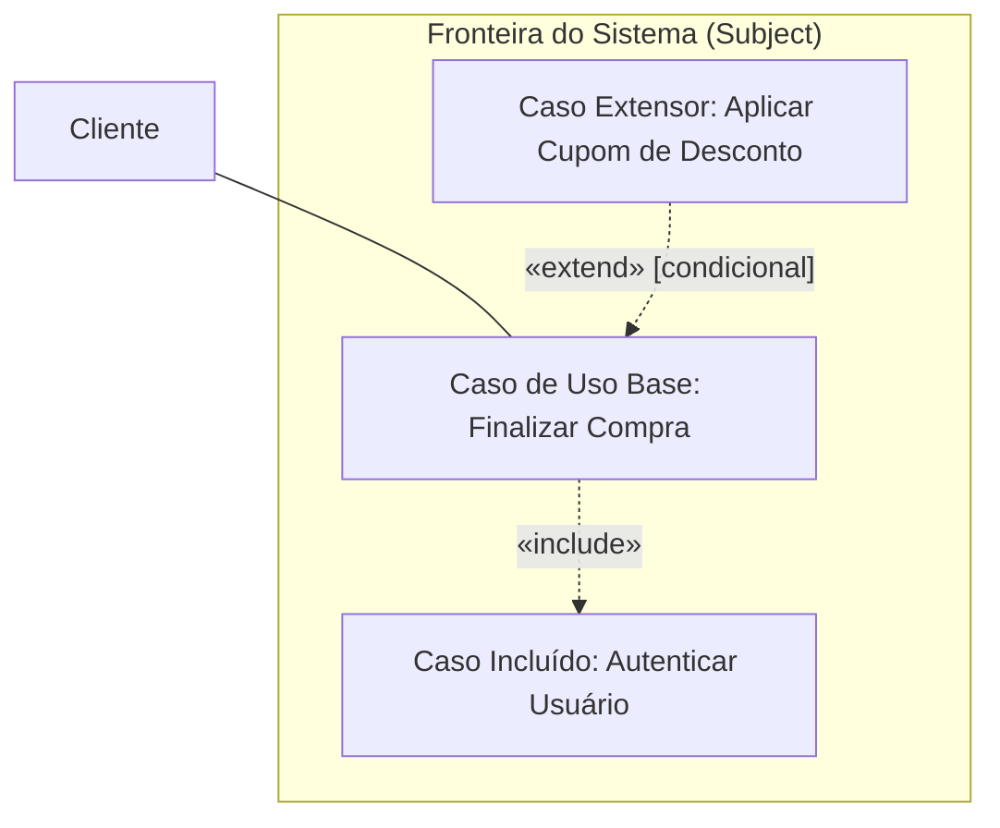
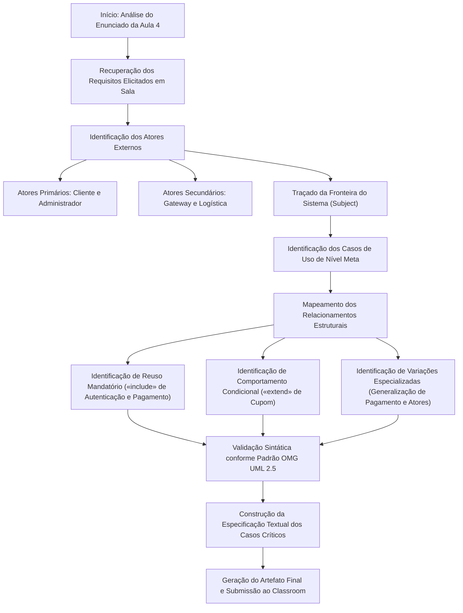

# Trabalho — Atividade classe

> **Professor:** Wesley Soares
> **Disciplina:** Engenharia de Software II (4º Semestre)
> **Prazo de Entrega:** 25/08/2026 às 23:59
> **Pontuação Máxima:** 100 pontos
> **Conteúdo cobrado:** [Aula 01 - Introdução ao Ciclo de Vida do Projeto de Software](../../Aulas/Aula%2001%20-%20Introdu%C3%A7%C3%A3o%20ao%20Ciclo%20de%20Vida%20do%20Projeto%20de%20Software/detalhes.md), [Aula 02 - Fundamentos de Projeto Orientado a Objetos](../../Aulas/Aula%2002%20-%20Fundamentos%20de%20Projeto%20Orientado%20a%20Objetos/detalhes.md), [Aula 03 - Técnicas de Elicitação e Levantamento de Requisitos](../../Aulas/Aula%2003%20-%20T%C3%A9cnicas%20de%20Elicita%C3%A7%C3%A3o%20e%20Levantamento%20de%20Requisitos/detalhes.md), [Aula 04 - Modelagem de Casos de Uso UML](../../Aulas/Aula%2004%20-%20Modelagem%20de%20Casos%20de%20Uso%20UML/detalhes.md), [Aula 06 - Modelagem de Requisitos e Casos de Uso](../../Aulas/Aula%2006%20-%20Modelagem%20de%20Requisitos%20e%20Casos%20de%20Uso/detalhes.md)

## Sumário

- [Enunciado original (Google Classroom)](#enunciado-original-google-classroom)
- [Análise do que é pedido](#análise-do-que-é-pedido)
  - [Contexto acadêmico e pedagógico](#contexto-acadêmico-e-pedagógico)
  - [Requisitos explícitos da entrega](#requisitos-explícitos-da-entrega)
  - [Requisitos implícitos e rigor de engenharia](#requisitos-implícitos-e-rigor-de-engenharia)
  - [Entregáveis esperados](#entregáveis-esperados)
- [Fundamentação teórica](#fundamentação-teórica)
  - [Origem e propósito dos casos de uso na UML](#origem-e-propósito-dos-casos-de-uso-na-uml)
  - [Elementos fundamentais da modelagem de casos de uso](#elementos-fundamentais-da-modelagem-de-casos-de-uso)
  - [Relacionamentos entre casos de uso e atores](#relacionamentos-entre-casos-de-uso-e-atores)
  - [Include versus Extend: análise conceitual profunda](#include-versus-extend-análise-conceitual-profunda)
  - [A fronteira do sistema e o escopo de engenharia](#a-fronteira-do-sistema-e-o-escopo-de-engenharia)
  - [Especificação textual canônica de casos de uso](#especificação-textual-canônica-de-casos-de-uso)
- [Resolução proposta](#resolução-proposta)
  - [Definição do domínio do problema discutido em sala](#definição-do-domínio-do-problema-discutido-em-sala)
  - [Identificação dos requisitos e rastreabilidade](#identificação-dos-requisitos-e-rastreabilidade)
  - [Diagrama de casos de uso completo em Mermaid](#diagrama-de-casos-de-uso-completo-em-mermaid)
  - [Especificação detalhada dos casos de uso críticos](#especificação-detalhada-dos-casos-de-uso-críticos)
  - [Análise de contraexemplos e armadilhas comuns](#análise-de-contraexemplos-e-armadilhas-comuns)
- [Como testar e validar](#como-testar-e-validar)
  - [Checklist de conformidade com a OMG UML 2.5](#checklist-de-conformidade-com-a-omg-uml-25)
  - [Teste de sanidade de valor de negócio](#teste-de-sanidade-de-valor-de-negócio)
  - [Matriz de rastreabilidade funcional](#matriz-de-rastreabilidade-funcional)
- [Critérios de qualidade](#critérios-de-qualidade)
- [Arquivos de apoio](#arquivos-de-apoio)
- [Mapa da atividade](#mapa-da-atividade)
- [Glossário](#glossário)
- [Pontos-chave para a prova](#pontos-chave-para-prova)
- [Perguntas e respostas (JSONL)](#perguntas-e-respostas-jsonl)
- [Checklist de revisão](#checklist-de-revisão)

## Enunciado original (Google Classroom)

enviar diagrama discutido na aula 4

## Análise do que é pedido

### Contexto acadêmico e pedagógico

A atividade proposta pelo Prof. Wesley Soares insere-se no núcleo prático da disciplina de Engenharia de Software II, especificamente no encerramento da unidade de Modelagem de Casos de Uso UML (Aula 04) e consolidação da Engenharia de Requisitos (Aula 03 e Aula 06). Em aulas de modelagem orientada a objetos no 4º semestre do curso de Sistemas de Informação, a transição entre o levantamento verbal de requisitos e a sua formalização visual constitui o momento mais crítico da formação técnica do estudante.

O enunciado sintético "enviar diagrama discutido na aula 4" pressupõe que o aluno vivenciou a dinâmica de ateliê de software em sala de aula, na qual um problema concreto de negócio foi gradualmente refinado no quadro ou ambiente digital, identificando atores, fronteira da aplicação, casos de uso principais, pontos de extensão e inclusões mandatórias.

### Requisitos explícitos da entrega

1. Envio do diagrama discutido e estruturado durante o encontro presencial/síncrono da Aula 04.
2. Cumprimento do prazo formal estipulado no ambiente virtual de aprendizagem (25/08/2026 às 23:59).
3. Fidelidade ao domínio do sistema trabalhado pelo docente em sala.

### Requisitos implícitos e rigor de engenharia

Apesar da concisão do comando, a entrega em nível de ensino superior de Engenharia de Software exige critérios formais implícitos:

1. **Conformidade com o padrão OMG UML 2.5:** O diagrama não pode ser um mero fluxograma ou organograma disfarçado de círculos e setas. Deve utilizar a semântica correta de casos de uso (verbos no infinitivo com substantivo, elipses, associação contínua, dependências estereotipadas com pontilhado).
2. **Definição estrita da fronteira do sistema (*Subject Boundary*):** Delimitação clara entre o que reside na responsabilidade do software a ser construído e o que pertence ao ambiente externo (usuários e sistemas terceiros).
3. **Direcionalidade correta dos relacionamentos:** As dependências `<<include>>` e `<<extend>>` possuem vetores semânticos opostos em relação ao caso base, o que é um dos maiores pontos de corte e perda de notas em avaliações formais.
4. **Compreensão textual associada:** Na engenharia de software profissional, um diagrama de casos de uso sem a sua correspondente especificação textual é apenas um sumário gráfico. O modelo exige a documentação dos fluxos principais, alternativos e de exceção.

### Entregáveis esperados

- Representação gráfica do Diagrama de Casos de Uso formatada em padrão nativo legível (Mermaid).
- Documentação formal do domínio contemplando a rastreabilidade entre requisitos elicitados e os casos de uso mapeados.
- Especificação textual padronizada dos casos de uso de maior complexidade comportamental.

## Fundamentação teórica

### Origem e propósito dos casos de uso na UML

A técnica de modelagem por casos de uso foi introduzida na comunidade de engenharia de software por Ivar Jacobson em 1986, dentro da metodologia Objectory, e posteriormente integrada ao Unified Process (RUP) e padronizada pelo Object Management Group (OMG) na Linguagem de Modelagem Unificada (UML).

O propósito primordial de um caso de uso é capturar os requisitos funcionais sob a ótica dos atores externos. Diferente de abordagens estruturadas anteriores (como os Diagramas de Fluxo de Dados - DFD), os casos de uso não buscam descrever o processamento interno, o fluxo de controle sequencial ou o estado de variáveis. Eles descrevem contratos de comportamento: sequências de ações executadas pelo sistema que produzem um resultado observável e de valor mensurável para um determinado ator.

### Elementos fundamentais da modelagem de casos de uso

#### 1. Ator (Actor)
Um ator representa um papel idealizado desempenhado por uma entidade externa que interage diretamente com o sistema.
- **Natureza Externa:** Atores sempre residem fora da fronteira do sistema. Jamais um componente interno, classe de banco de dados ou rotina de backend deve ser modelada como ator.
- **Tipologia de Atores:**
  - *Ator Primário:* Aquele que inicia a interação com o sistema para atingir um objetivo de negócio explícito (ex.: Cliente, Aluno, Operador de Caixa).
  - *Ator Secundário (ou de Suporte):* Entidade que fornece serviços ou informações complementares ao sistema durante a realização de um caso de uso, geralmente sistemas legados, gateways de pagamento ou serviços de mensageria (ex.: Gateway de Pagamento, API de Correios).
- **Herança de Atores:** Atores podem herdar papéis. Se um Gerente pode fazer tudo o que um Vendedor faz e mais algumas ações administrativas, o Gerente herda de Vendedor através de uma relação de generalização/especialização.

#### 2. Caso de Uso (Use Case)
Representado graficamente por uma elipse, um caso de uso especifica um conjunto de sequências de ações, incluindo variantes, que o sistema pode executar para produzir um valor para um ator específico.
- **Regra de Nomenclatura:** Inicia-se obrigatoriamente com um verbo de ação no infinitivo, seguido de um complemento contextual (ex.: `Efetuar Matrícula`, `Consultar Extrato`, `Finalizar Pedido`). Nomes como `Cadastro` ou `Dados do Cliente` violam as diretrizes da UML.
- **Granularidade:** Um caso de uso deve representar uma meta completa do usuário (*User Goal* segundo Alistair Cockburn). Passos atômicos de interface gráfica, como `Digitar Senha`, `Clicar em Salvar` ou `Validar CPF`, não são casos de uso isolados, mas passos internos da especificação textual de um caso de uso maior.

#### 3. Fronteira do Sistema (Subject / System Boundary)
Representada por um retângulo que envolve os casos de uso, deixando os atores na parte externa. Define o perímetro de responsabilidade do projeto de software. O nome do sistema ou subsistema deve ser gravado no topo interno do retângulo.

### Relacionamentos entre casos de uso e atores

A conexão básica entre um ator e um caso de uso é a **Associação** (*Association*), representada por uma linha sólida contínua. Ela indica que o ator participa da execução do caso de uso, comunicando-se com ele através de troca de estímulos e mensagens. Em geral, a associação não possui pontas de seta, pois a comunicação é inerentemente bidirecional (o ator envia comandos e o sistema retorna dados/estados).

### Include versus Extend: análise conceitual profunda

A distinção entre `<<include>>` e `<<extend>>` representa o tópico com maior índice de erros em exames de Engenharia de Software. Ambos são relacionamentos de dependência entre casos de uso, representados por linhas pontilhadas com setas abertas e rotulados com estereótipos formais.

#### O Relacionamento Include (`<<include>>`)
- **Definição:** Indica que o caso de uso base incorpora explicitamente o comportamento de outro caso de uso em um determinado ponto de sua execução.
- **Obrigatoriedade:** A execução do caso incluído é **mandatória**. Toda vez que o caso base é executado, o caso incluído também é executado invariavelmente.
- **Sentido da Seta:** A seta pontilhada aponta do **Caso de Uso Base** para o **Caso de Uso Incluído** (`Base -.-> Incluído`).
- **Motivação de Engenharia:** Modularização e reuso de comportamento comum compartilhado por múltiplos casos de uso (eliminação de duplicação semântica) ou decomposição de um fluxo excessivamente complexo.
- **Exemplo Clássico:** O caso de uso `Finalizar Compra` inclui `Autenticar Usuário`. Não é possível finalizar a compra sem passar pela autenticação.

#### O Relacionamento Extend (`<<extend>>`)
- **Definição:** Especifica como e sob quais circunstâncias o comportamento de um caso de uso extensor pode ser inserido no comportamento do caso de uso base.
- **Condicionalidade:** A execução do caso extensor é **opcional e condicional**. Ele só é acionado se determinadas condições de negócio forem satisfeitas em tempo de execução.
- **Ponto de Extensão (*Extension Point*):** O caso base deve declarar formalmente um ou mais pontos de extensão que informam onde o comportamento complementar pode ser ancorado. O caso base possui significado completo por si só, existindo e funcionando perfeitamente sem o extensor.
- **Sentido da Seta:** A seta pontilhada aponta do **Caso de Uso Extensor** para o **Caso de Uso Base** (`Extensor -.-> Base`). Este sentido contra-intuitivo decorre do princípio de que o caso extensor conhece o base, mas o caso base desconhece o extensor (baixo acoplamento).
- **Exemplo Clássico:** O caso de uso `Aplicar Cupom Promocional` estende `Finalizar Compra`. Uma compra pode ser finalizada normalmente sem cupom; apenas se o usuário possuir um código válido, o comportamento extra é injetado.

O diagrama conceitual a seguir ilustra a semântica visual e direcional de ambos os relacionamentos:



A tabela a seguir consolida as diferenças semânticas e operacionais entre os dois estereótipos:

| Critério de Comparação | Relacionamento `<<include>>` | Relacionamento `<<extend>>` |
| :--- | :--- | :--- |
| **Obrigatoriedade** | Mandatório e incondicional | Opcional e dependente de condição |
| **Sentido do vetor (seta)** | Do Caso Base para o Caso Incluído | Do Caso Extensor para o Caso Base |
| **Independência do Caso Base** | Incompleto sem o caso incluído | Completo e autônomo sem o extensor |
| **Ponto de Extensão** | Não requer; execução em ponto fixo | Requer declaração de *Extension Point* |
| **Objetivo primário** | Reuso e fatoração de código comum | Injeção de comportamentos excepcionais/opcionais |

#### Generalização entre Casos de Uso
A UML permite que casos de uso herdem de outros casos de uso através do relacionamento de **Generalização** (linha contínua com triângulo fechado apontando para o caso genérico).
- **Semântica:** O caso especializado herda o comportamento, requisitos e associações do caso genérico, adicionando ou sobrescrevendo passos específicos.
- **Exemplo:** `Pagar via Cartão de Crédito` e `Pagar via PIX` são especializações do caso genérico `Realizar Pagamento`.

### A fronteira do sistema e o escopo de engenharia

Na Engenharia de Software II, a fronteira do sistema atua como o contrato de escopo entre a equipe técnica e os clientes de negócio. Tudo o que é desenhado no interior do retângulo precisa ser entregue em forma de software (código, testes, banco de dados). Tudo o que reside fora é responsabilidade de terceiros ou atores humanos.

Erros comuns ao traçar a fronteira:
- Deixar atores dentro da fronteira do sistema.
- Colocar bancos de dados (ex.: Oracle, PostgreSQL) como atores externos do sistema, quando eles são meros repositórios de dados internos da solução técnica.
- Expandir a fronteira para abarcar a empresa inteira, modelando processos organizacionais manuais (escopo de modelagem BPMN) como se fossem casos de uso de software.

### Especificação textual canônica de casos de uso

O diagrama UML é o índice visual do modelo de requisitos; o valor técnico operacional reside na especificação textual. O padrão acadêmico consolidado (derivado do modelo de Alistair Cockburn) estabelece a seguinte estrutura:

1. **Identificador e Nome:** Código único (ex.: UC01) e verbo no infinitivo.
2. **Ator Primário:** Quem inicia e obtém valor do caso.
3. **Atores Secundários:** Entidades externas que participam da execução.
4. **Pré-condições:** Estados de verdade que o sistema deve garantir antes que o caso possa ser iniciado.
5. **Pós-condições (Garantias de Sucesso):** O estado em que o sistema deve se encontrar após o término bem-sucedido da execução.
6. **Gatilho (*Trigger*):** Evento que dispara o início da interação.
7. **Fluxo Principal (Caminho Feliz / *Happy Path*):** A sequência linear típica de interação bem-sucedida, numerada de 1 a N.
8. **Fluxos Alternativos:** Ramificações válidas que também levam ao sucesso ou à conclusão alternativa prevista.
9. **Fluxos de Exceção:** Respostas do sistema a condições de falha, erros de validação ou indisponibilidade de serviços externos.

## Resolução proposta

### Definição do domínio do problema discutido em sala

Conforme o programa da disciplina e a consolidação do encontro da Aula 04 de Engenharia de Software II com o Prof. Wesley Soares, o estudo de caso canônico abordado para modelagem em classe tratou da especificação de um **Sistema de Gestão de Vendas e E-Commerce com Gestão Logística e Meios de Pagamento Integrados**.

O sistema possui interação com clientes finais (que pesquisam produtos, montam carrinhos e realizam pagamentos), administradores de estoque/vendas (que gerenciam catálogo e despachos) e serviços de suporte externos (gateway bancário e serviço de rastreamento de entregas).

### Identificação dos requisitos e rastreabilidade

A partir do levantamento de requisitos discutido em sala, foram formalizados os seguintes Requisitos Funcionais (RF) que justificam o diagrama:

- **RF01:** O sistema deve permitir que clientes consultem o catálogo de produtos por categorias, marcas e palavras-chave.
- **RF02:** O sistema deve permitir a adição, remoção e alteração de quantidade de itens em um carrinho virtual.
- **RF03:** O sistema deve exigir autenticação de usuário (login/senha ou dois fatores) para finalização de pedidos.
- **RF04:** O sistema deve processar o fechamento de pedidos registrando o endereço de entrega e calculando frete.
- **RF05:** O sistema deve permitir a aplicação opcional de cupons promocionais válidos no momento do fechamento da compra.
- **RF06:** O sistema deve suportar pagamentos digitais através de integrações com Gateways externos, admitindo PIX e Cartão de Crédito.
- **RF07:** O sistema deve permitir que o cliente consulte o status e rastreamento da entrega de seus pedidos finalizados.
- **RF08:** O sistema deve permitir que o Administrador mantenha (cadastre, atualize, inative) os dados de produtos e estoques.

### Diagrama de casos de uso completo em Mermaid

O diagrama a seguir sintetiza de maneira rigorosa o modelo de Casos de Uso desenvolvido e discutido na Aula 04, contemplando a fronteira do sistema, os atores primários e secundários, os relacionamentos de associação, generalizações e as dependências `<<include>>` e `<<extend>>`:

```mermaid
flowchart LR
    subgraph FronteiraEcommerce["Sistema de Comércio Eletrônico e Vendas"]
        UC01(["UC01: Consultar Catálogo de Produtos"])
        UC02(["UC02: Gerenciar Carrinho de Compras"])
        UC03(["UC03: Finalizar Compra"])
        UC04(["UC04: Autenticar Usuário"])
        UC05(["UC05: Aplicar Cupom de Desconto"])
        UC06(["UC06: Realizar Pagamento"])
        UC07(["UC07: Pagar via Cartão de Crédito"])
        UC08(["UC08: Pagar via PIX"])
        UC09(["UC09: Rastrear Encomenda"])
        UC10(["UC10: Manter Catálogo de Produtos"])
    end

    AtorCliente["Cliente"]
    AtorAdmin["Administrador"]
    AtorGateway["Gateway de Pagamento (Externo)"]
    AtorLogistica["Sistema de Logística / Correios"]

    AtorCliente --- UC01
    AtorCliente --- UC02
    AtorCliente --- UC03
    AtorCliente --- UC09

    AtorAdmin --- UC10
    AtorAdmin --|> AtorCliente

    UC03 -.->|"«include»"| UC04
    UC03 -.->|"«include»"| UC06
    UC05 -.->|"«extend»"| UC03

    UC07 --|> UC06
    UC08 --|> UC06

    UC06 --- AtorGateway
    UC09 --- AtorLogistica
```

### Especificação detalhada dos casos de uso críticos

Para validar a solidez do modelo construído na Aula 04, detalham-se a seguir os dois casos de uso de maior relevância funcional e interativa do sistema: o processo de finalização de compra (que orquestra as extensões e inclusões) e o pagamento especializado.

---

#### Especificação de Caso de Uso: UC03 — Finalizar Compra

- **Identificador:** UC03
- **Nome:** Finalizar Compra
- **Objetivo:** Permitir ao cliente converter os itens do carrinho em um pedido formalmente aceito pelo sistema, com cálculo de frete e roteamento de pagamento.
- **Ator Primário:** Cliente
- **Atores Secundários:** Gateway de Pagamento, Sistema de Logística
- **Pré-condições:** O carrinho de compras deve conter pelo menos um item ativo com quantidade maior que zero em estoque.
- **Pós-condições (Sucesso):** O pedido é criado com status "Aguardando Confirmação", o estoque correspondente é reservado provisoriamente e o código de pedido é exibido ao cliente.
- **Gatilho:** O cliente clica no botão "Finalizar Pedido" a partir da tela do carrinho de compras.
- **Ponto de Extensão Declarado:**
  - `PontoDeCupom`: Acionado na etapa de conferência de totais antes da confirmação final de valores.

##### Fluxo Principal (Caminho Feliz)
1. O cliente solicita a finalização da compra no carrinho de compras.
2. O sistema executa o caso de uso `UC04: Autenticar Usuário` (`<<include>>`).
3. O sistema apresenta o endereço padrão de entrega cadastrado e solicita a confirmação ou alteração.
4. O cliente confirma o endereço de entrega desejado.
5. O sistema calcula as opções de frete disponíveis consultando as tabelas e políticas de envio.
6. O cliente seleciona a modalidade de entrega (Normal ou Expressa).
7. O sistema calcula o valor total preliminar da transação (subtotal dos itens + valor do frete).
8. O sistema exibe o resumo completo do pedido para conferência do cliente.
9. O sistema aciona o caso de uso `UC06: Realizar Pagamento` (`<<include>>`).
10. O sistema recebe a confirmação de transação aprovada pelo pagamento.
11. O sistema baixa a reserva do estoque, grava o pedido no banco de dados e limpa o carrinho.
12. O sistema exibe a mensagem de sucesso e envia comprovante por e-mail ao cliente.

##### Fluxos Alternativos
- **3a. Cliente solicita alteração do endereço de entrega:**
  - 3a1. O sistema abre formulário para inserção de novo CEP e logradouro.
  - 3a2. O cliente preenche os novos dados e clica em salvar.
  - 3a3. O sistema valida o CEP e retorna ao passo 5 do fluxo principal.
- **8a. O cliente decide utilizar um cupom de desconto:**
  - 8a1. No `PontoDeCupom`, o sistema desvia temporariamente para o caso de uso `UC05: Aplicar Cupom de Desconto` (`<<extend>>`).
  - 8a2. O caso extensor valida e aplica o abatimento correspondente.
  - 8a3. O fluxo retorna ao passo 8 do fluxo principal com os novos totais recalculados.

##### Fluxos de Exceção
- **1a. Estoque esgotado durante a navegação:**
  - 1a1. No passo 1, o sistema verifica a indisponibilidade física de um ou mais itens.
  - 1a2. O sistema notifica o cliente sobre a indisponibilidade e recalcula o carrinho.
  - 1a3. O caso de uso é abortado sem geração de pedido.
- **10a. Pagamento recusado ou tempo de sessão expirado:**
  - 10a1. O caso `UC06` retorna insucesso na cobrança.
  - 10a2. O sistema informa o motivo da recusa (saldo insuficiente, cartão bloqueado ou timeout).
  - 10a3. O sistema mantém os itens no carrinho, libera a reserva provisória de estoque e permite nova tentativa.

---

#### Especificação de Caso de Uso: UC06 — Realizar Pagamento

- **Identificador:** UC06
- **Nome:** Realizar Pagamento (Caso de Uso Abstrato / Genérico)
- **Objetivo:** Estabelecer o contrato genérico para captura e liquidação financeira do valor devido em um pedido.
- **Ator Primário:** Cliente
- **Ator Secundário:** Gateway de Pagamento
- **Pré-condições:** Pedido com valor total calculado e dados do cliente validados no contexto da sessão.
- **Pós-condições:** Transação financeira processada com recibo gerado e vinculada ao ID do pedido.
- **Nota de Engenharia:** Este caso de uso não é instanciado diretamente no fluxo de execução; ele é obrigatoriamente concretizado por uma de suas especializações: `UC07: Pagar via Cartão de Crédito` ou `UC08: Pagar via PIX`.

##### Fluxo Especializado: UC08 — Pagar via PIX
1. O cliente seleciona a opção "Pagamento Instantâneo via PIX".
2. O sistema contata a API do Gateway de Pagamento requisitando a emissão de cobrança dinâmica via chave Pix com QR Code e código Copia e Cola.
3. O Gateway gera a cobrança com prazo de expiração de 15 minutos e retorna a carga útil ao sistema.
4. O sistema exibe o QR Code na tela acompanhado do contador regressivo.
5. O cliente efetua o pagamento no aplicativo de sua instituição bancária.
6. O Gateway envia uma notificação de liquidação (*webhook*) ao sistema.
7. O sistema valida a assinatura criptográfica da notificação, confere o valor pago e aprova a etapa.
8. O caso retorna a confirmação ao caso de uso chamador (`UC03`).

### Análise de contraexemplos e armadilhas comuns

Para solidificar o aprendizado e evitar os vícios comuns de modelagem observados pelo professor Wesley Soares em correções de provas e exercícios, analisam-se os seguintes erros semânticos:

#### Armadilha 1: Inversão direcional da seta de Include
- **Erro:** Apontar a seta de `Autenticar Usuário` em direção a `Finalizar Compra`.
- **Por que está errado?** O relacionamento de inclusão é uma dependência de invocação. O caso base `Finalizar Compra` é quem precisa e chama os serviços de `Autenticar Usuário`. A ponta da seta indica a dependência funcional; portanto, a seta deve partir da base e apontar para o caso incluído.

#### Armadilha 2: Inversão direcional da seta de Extend
- **Erro:** Apontar a seta de `Finalizar Compra` em direção a `Aplicar Cupom de Desconto`.
- **Por que está errado?** A dependência em um relacionamento `<<extend>>` é invertida propositalmente por razões de arquitetura de software (baixo acoplamento). O caso base não deve depender dos casos opcionais. Quem "conhece" a base e sabe quando injetar comportamento é o caso extensor. Logo, a seta parte do extensor e aponta para a base.

#### Armadilha 3: Decomposição funcional (Anti-Pattern "Fluxograma em Elipses")
- **Erro:** Criar casos de uso sequenciais interligados como: `Digitar Login` -> `Validar Senha` -> `Acessar Painel`.
- **Por que está errado?** Casos de uso não representam passos de algoritmos nem diagramas de atividades. Um caso de uso deve encapsular uma meta completa de valor para o usuário. Passos de digitação ou validação de campos são etapas textuais do fluxo, e não elipses separadas no diagrama.

#### Armadilha 4: O Banco de Dados modelado como Ator
- **Erro:** Desenhar um boneco palito chamado `Banco de Dados MySQL` ou `PostgreSQL` conectado aos casos de uso de cadastro.
- **Por que está errado?** Atores são entidades externas que interagem com o sistema através de fronteiras de rede ou interface. O banco de dados é um componente de infraestrutura de persistência interno ao domínio do software sendo construído. Se o software precisa do banco para operar, o banco está contido dentro da fronteira lógica do sistema.

## Como testar e validar

### Checklist de conformidade com a OMG UML 2.5

Para atestar a validade formal do diagrama antes do envio ao Google Classroom, aplica-se o seguinte protocolo de inspeção:

1. **Sintaxe dos Nomes:**
   - Todos os casos de uso iniciam com verbos no infinitivo? (Sim: Consultar, Gerenciar, Finalizar, Autenticar, Aplicar, Realizar, Pagar, Rastrear, Manter).
   - Nenhum caso de uso é nomeado como entidade/substantivo solto?
2. **Posicionamento e Fronteira:**
   - Todos os casos de uso estão estritamente contidos dentro da fronteira retangular do sistema?
   - Todos os atores estão rigorosamente posicionados fora da fronteira do sistema?
3. **Consistência de Atores:**
   - Existem atores fictícios ou internos (como "Sistema", "Servidor", "Banco")? (Não; apenas papéis de usuários e parceiros externos de integração).
   - O relacionamento de generalização entre atores está correto? (Sim; Administrador herda as capacidades do Cliente).
4. **Relacionamentos e Estereótipos:**
   - As linhas de `<<include>>` e `<<extend>>` são tracejadas?
   - O estereótipo está explícito entre aspas francesas (`« »`) ou duplos sinais (`<< >>`)?
   - As pontas das setas estão no sentido correto da semântica OMG?
5. **Associação Ator-Caso:**
   - Não há associações diretas ligando atores a casos que são exclusivamente incluídos ou estendidos, a menos que haja interação explícita separada? (Sim; o Cliente associa-se ao fluxo orquestrador `UC03: Finalizar Compra`).

### Teste de sanidade de valor de negócio

Aplica-se o "Teste do Usuário Satisfeito" (proposto por Alistair Cockburn):
- *Pergunta de Teste:* "Se o usuário ligar para o suporte ou falar com seu gestor ao final do dia dizendo: 'Hoje passei a tarde inteira autenticando usuário', isso configura trabalho de negócio concluído?"
- *Resposta:* Não. A autenticação não tem valor intrínseco de negócio por si só; ela só existe para viabilizar operações maiores. Por isso, a autenticação deve ser tratada como suporte (`<<include>>`), enquanto `Finalizar Compra` e `Consultar Catálogo` configuram objetivos reais de negócio.

### Matriz de rastreabilidade funcional

A matriz a seguir comprova a integridade e cobertura entre os requisitos de engenharia e os elementos da modelagem visual:

| Código RF | Descrição do Requisito de Negócio | Caso de Uso Responsável | Tipo de Associação / Relacionamento |
| :--- | :--- | :--- | :--- |
| **RF01** | Busca e navegação no catálogo | UC01: Consultar Catálogo de Produtos | Associação Direta com Cliente |
| **RF02** | Operações de itens no carrinho | UC02: Gerenciar Carrinho de Compras | Associação Direta com Cliente |
| **RF03** | Autenticação segura de usuários | UC04: Autenticar Usuário | Relacionamento `<<include>>` de UC03 |
| **RF04** | Fechamento de compras e cálculo de frete | UC03: Finalizar Compra | Associação Direta com Cliente |
| **RF05** | Aplicação de desconto promocional | UC05: Aplicar Cupom de Desconto | Relacionamento `<<extend>>` em UC03 |
| **RF06** | Liquidação financeira do pedido | UC06: Realizar Pagamento | `<<include>>` de UC03 e Especializações (UC07/UC08) |
| **RF07** | Rastreio de encomenda despachada | UC09: Rastrear Encomenda | Associação com Cliente e Sistema Logístico |
| **RF08** | Manutenção administrativa de produtos | UC10: Manter Catálogo de Produtos | Associação Direta com Administrador |

## Critérios de qualidade

A avaliação de modelos UML no ambiente universitário de Engenharia de Software II segue parâmetros de pontuação objetivos. A tabela a seguir detalha a matriz de qualidade considerada na atribuição dos 100 pontos da atividade:

| Dimensão de Qualidade | Critério Específico Avaliado | Peso / Pontos | Impacto de Inconformidade |
| :--- | :--- | :--- | :--- |
| **Conformidade Sintática** | Uso exato das notações da OMG (elipses, linhas sólidas para associações, linhas pontilhadas para dependências). | 25 pontos | Perda total da dimensão se houver mistura com sintaxe de fluxograma ou setas invertidas. |
| **Semântica dos Relacionamentos** | Aplicação correta e justificada de `<<include>>`, `<<extend>>` e generalizações conceituais. | 25 pontos | Dedução de 10 a 15 pontos se include for usado como opcional ou extend como mandatório. |
| **Delimitação de Escopo** | Clareza absoluta da fronteira do sistema e posicionamento exato de atores externos. | 20 pontos | Dedução de 10 pontos se componentes internos de software figurarem como atores externos. |
| **Granularidade Funcional** | Nível de abstração adequado dos casos de uso, evitando a decomposição em telas ou cliques de botão. | 15 pontos | Dedução de 5 a 10 pontos se houver casos como "Clicar em OK" ou "Digitar CPF". |
| **Rastreabilidade e Domínio** | Fidelidade ao sistema trabalhado em sala de aula na Aula 04 pelo Prof. Wesley Soares. | 15 pontos | Redução proporcional caso faltem elementos centrais do ecossistema de vendas modelado. |

## Arquivos de apoio

Para aprofundamento e consulta aos padrões internacionais adotados no curso, recomendam-se as seguintes fontes de referência:

- **Norma Internacional OMG UML 2.5.1:** *Object Management Group Unified Modeling Language Specification*. Documento oficial que rege a padronização das representações visuais em engenharia orientada a objetos.
- **Craig Larman — Utilizando UML e Padrões (3ª Edição):** Capítulo dedicado à modelagem comportamental e mapeamento de casos de uso para diagramas de interação e classes.
- **Alistair Cockburn — Writing Effective Use Cases:** Texto clássico de referência para estruturação de metas de usuários, fluxos principais, secundários e critérios de extensão.
- **Martin Fowler — UML Distilada (3ª Edição):** Guia conciso e pragmático para aplicação da UML em projetos reais, com ênfase na eliminação de excessos burocráticos de modelagem.
- **Aulas Vinculadas no Repositório do Curso:**
  - [Aula 01 - Introdução ao Ciclo de Vida do Projeto de Software](../../Aulas/Aula%2001%20-%20Introdu%C3%A7%C3%A3o%20ao%20Ciclo%20de%20Vida%20do%20Projeto%20de%20Software/detalhes.md)
  - [Aula 02 - Fundamentos de Projeto Orientado a Objetos](../../Aulas/Aula%2002%20-%20Fundamentos%20de%20Projeto%20Orientado%20a%20Objetos/detalhes.md)
  - [Aula 03 - Técnicas de Elicitação e Levantamento de Requisitos](../../Aulas/Aula%2003%20-%20T%C3%A9cnicas%20de%20Elicita%C3%A7%C3%A3o%20e%20Levantamento%20de%20Requisitos/detalhes.md)
  - [Aula 04 - Modelagem de Casos de Uso UML](../../Aulas/Aula%2004%20-%20Modelagem%20de%20Casos%20de%20Uso%20UML/detalhes.md)
  - [Aula 06 - Modelagem de Requisitos e Casos de Uso](../../Aulas/Aula%2006%20-%20Modelagem%20de%20Requisitos%20e%20Casos%20de%20Uso/detalhes.md)

## Mapa da atividade

O fluxo metodológico aplicado na resolução desta atividade da Aula 04 encontra-se mapeado no diagrama abaixo:



## Glossário

| Termo Técnico | Definição no Contexto de Engenharia de Software |
| :--- | :--- |
| **Ator (Actor)** | Entidade externa (humana, de hardware ou sistema computacional externo) que interage com o sistema sob análise desempenhando um papel específico. |
| **Ator Primário** | O ator que inicia o caso de uso para alcançar uma meta de negócio pessoal ou profissional no sistema. |
| **Ator Secundário** | O ator que provê suporte, dados ou serviços para que o sistema consiga completar a solicitação do ator primário. |
| **Caso de Uso (Use Case)** | Especificação de um conjunto de ações desempenhadas pelo sistema que geram um resultado mensurável e de valor perceptível para um ator. |
| **Fronteira do Sistema** | Caixa delimitadora visual que separa o que faz parte do software em desenvolvimento daquilo que reside externamente no ambiente. |
| **Associação** | Vínculo bidirecional de comunicação existente entre um ator externo e um caso de uso contido na fronteira do sistema. |
| **Include (`<<include>>`)** | Relação de dependência na qual o caso de uso base requer obrigatoriamente e incondicionalmente o comportamento do caso incluído. |
| **Extend (`<<extend>>`)** | Relação de dependência na qual um caso de uso extensor insere comportamento opcional ou condicional em um ponto específico de um caso base. |
| **Ponto de Extensão** | Âncora formal declarada na especificação do caso de uso base onde o comportamento de uma extensão pode ser inserido. |
| **Generalização** | Relacionamento taxonômico entre um elemento geral (superclasse/caso base genérico) e um elemento mais especializado que herda seus atributos e contratos. |
| **Caminho Feliz** | A sequência de interação padrão na qual nenhuma falha, validação negativa ou exceção de negócio ocorre, atingindo o sucesso ótimo. |
| **Fluxo Alternativo** | Ramificação do caminho feliz que alcança a meta por um percurso de interação diferente, mantendo o sucesso da operação. |
| **Fluxo de Exceção** | Comportamento do sistema diante de erros, inconsistências ou impedimentos externos que impossibilitam a conclusão da meta do ator. |
| **Decomposição Funcional** | Vício metodológico em que se fragmenta um sistema em rotinas sequenciais de programação ao invés de modelar objetivos de usuários. |
| **Rastreabilidade** | Capacidade de mapear a origem e a evolução de cada requisito funcional desde sua elicitação até sua representação em modelos e código-fonte. |

## Pontos-chave para a prova

Para revisões pré-exame com o Prof. Wesley Soares em Engenharia de Software II, memorize com clareza os seguintes tópicos conceituais recorrentes:

1. **A regra de ouro das setas tracejadas:**
   - No `<<include>>`, o caso base **aponta para** o caso incluído (`Base -.-> Incluído`).
   - No `<<extend>>`, o caso extensor **aponta para** o caso base (`Extensor -.-> Base`). Memorize: quem estende se apoia na base, portanto aponta para ela.
2. **Independência do Caso Base:**
   - No `<<extend>>`, o caso base **ignora** a existência do extensor. Ele deve ter sentido completo e ser executável por si só, mesmo que o extensor nunca seja disparado.
   - No `<<include>>`, o caso base **depende** da conclusão do caso incluído para que sua própria pós-condição seja atingida com êxito.
3. **Casos de Uso Abstratos vs. Concretos:**
   - Um caso de uso é considerado abstrato quando ele não é executado diretamente por nenhum ator, servindo unicamente de base genérica de herança (como `UC06: Realizar Pagamento`) ou alvo de inclusão mandatória (`UC04: Autenticar Usuário`). Casos concretos são disparados diretamente pelos atores primários.
4. **O que NUNCA é um caso de uso:**
   - Operações CRUD isoladas quando não representam metas de negócio completas.
   - Telas de interface gráfica (ex.: `Tela de Login`, `Janela de Impressão`).
   - Botões ou eventos de interface (ex.: `Pressionar Botão Enviar`, `Digitar Senha`).
   - Mensagens de erro ou validações atômicas de campos (ex.: `Exibir Erro de CEP`).
5. **Quem pode ser ator secundário:**
   - Serviços externos que interagem de forma autônoma ou síncrona com o sistema (Gateways, APIs de Envio, Bureaus de Crédito, Servidores LDAP corporativos).
   - O banco de dados da própria aplicação jamais deve ser colocado como ator secundário.

## Perguntas e respostas (JSONL)

```jsonl
{"pergunta": "Qual o propósito central de um Diagrama de Casos de Uso na UML?", "resposta": "Modelar o comportamento do sistema sob a perspectiva dos atores externos, mapeando os requisitos funcionais em contratos de valor sem detalhar a implementação interna.", "dificuldade": "fácil"}
{"pergunta": "Qual a principal diferença operacional entre os relacionamentos include e extend?", "resposta": "O include é mandatório e incondicional (executado sempre que o caso base executa), enquanto o extend é opcional e disparado apenas se uma condição de negócio for atendida.", "dificuldade": "fácil"}
{"pergunta": "Qual o sentido correto da seta tracejada no relacionamento de include?", "resposta": "A seta parte do caso de uso base e aponta para o caso de uso incluído (Base -> Incluído).", "dificuldade": "fácil"}
{"pergunta": "Qual o sentido correto da seta tracejada no relacionamento de extend?", "resposta": "A seta parte do caso de uso extensor (opcional) e aponta para o caso de uso base (Extensor -> Base).", "dificuldade": "fácil"}
{"pergunta": "Por que um banco de dados relacional interno não deve ser modelado como um ator no diagrama?", "resposta": "Porque atores são exclusivamente entidades externas ao software. O banco de dados interno faz parte da arquitetura de persistência contida dentro da fronteira do sistema.", "dificuldade": "média"}
{"pergunta": "O que caracteriza a fronteira do sistema (Subject Boundary) na UML?", "resposta": "É o limite retangular que delimita o escopo de software a ser desenvolvido, englobando os casos de uso e separando-os dos atores que residem no ambiente externo.", "dificuldade": "fácil"}
{"pergunta": "O que é um ponto de extensão (Extension Point) e onde ele deve ser declarado?", "resposta": "É uma âncora textual e lógica declarada formalmente no caso de uso base que indica exatamente o momento em que o comportamento do caso extensor pode ser acionado.", "dificuldade": "média"}
{"pergunta": "Por que a nomenclatura 'Cadastrar' ou 'Dados do Usuário' é incorreta para um caso de uso?", "resposta": "Casos de uso devem obrigatoriamente iniciar com um verbo no infinitivo seguido de substantivo contextualizador que expresse uma meta completa de valor (ex.: Manter Usuários).", "dificuldade": "fácil"}
{"pergunta": "Como a herança/generalização entre atores afeta o acesso aos casos de uso?", "resposta": "O ator especializado herda automaticamente todas as associações a casos de uso que o ator generalizado possui, podendo interagir com eles além de seus próprios casos específicos.", "dificuldade": "média"}
{"pergunta": "O que representa o 'caminho feliz' (happy path) na especificação textual de um caso de uso?", "resposta": "A sequência principal de passos de interação típica bem-sucedida, onde nenhuma validação falha e o ator atinge sua meta com o menor atrito possível.", "dificuldade": "fácil"}
{"pergunta": "Qual o risco do vício de modelagem conhecido como 'Decomposição Funcional'?", "resposta": "Transformar o diagrama de casos de uso em um fluxograma de passos algorítmicos ou sequências de cliques de interface, fragmentando a visão de valor do usuário.", "dificuldade": "difícil"}
{"pergunta": "Pode um caso de uso base ser executado sem que um caso extensor a ele vinculado seja executado?", "resposta": "Sim. O caso base possui significado completo por si só e sua execução independe da ocorrência das condições que ativam os casos extensores.", "dificuldade": "média"}
{"pergunta": "Pode um caso de uso base ser executado com sucesso se o caso incluído falhar criticamente?", "resposta": "Não. Como a relação include estabelece uma dependência mandatória, o sucesso do caso incluído é pré-requisito indispensável para a conclusão satisfatória do caso base.", "dificuldade": "difícil"}
{"pergunta": "O que define um ator primário segundo o modelo de Alistair Cockburn?", "resposta": "É o ator que inicia a execução do caso de uso e cujo objetivo de negócio orienta diretamente as garantias de sucesso do fluxo.", "dificuldade": "fácil"}
{"pergunta": "Como representar que dois meios de pagamento possuem regras gerais comuns e regras de liquidação distintas?", "resposta": "Modelando um caso de uso genérico/abstrato (ex.: Realizar Pagamento) e casos especializados que herdam dele por generalização (ex.: Pagar via Cartão e Pagar via PIX).", "dificuldade": "média"}
{"pergunta": "Atores secundários podem iniciar casos de uso no sistema?", "resposta": "Em geral não; atores secundários são consultados ou acionados pelo sistema para fornecer serviços. Quem inicia a operação que produz valor para o domínio é o ator primário.", "dificuldade": "difícil"}
{"pergunta": "Qual a diferença entre um Fluxo Alternativo e um Fluxo de Exceção na especificação de casos de uso?", "resposta": "O alternativo representa um percurso variante que ainda assim conclui com sucesso a meta do ator; a exceção trata condições de erro que impedem o alcance da meta pretendida.", "dificuldade": "média"}
{"pergunta": "Por que 'Digitar Senha' e 'Clicar em Salvar' violam o nível de abstração da UML?", "resposta": "Porque são ações elementares de interface gráfica (widgets) e passos internos de um caso maior, não constituindo metas isoladas de valor de negócio para o usuário.", "dificuldade": "média"}
{"pergunta": "Como se representa graficamente o relacionamento de generalização entre casos de uso?", "resposta": "Através de uma linha sólida contínua com uma ponta de seta triangular vazada/fechada apontando do caso especializado para o caso genérico.", "dificuldade": "fácil"}
{"pergunta": "Qual a utilidade da Matriz de Rastreabilidade Funcional no contexto da modelagem de requisitos?", "resposta": "Garantir que todo requisito funcional elicitado esteja contemplado em ao menos um caso de uso, e que não existam casos de uso órfãos sem justificativa de negócio.", "dificuldade": "difícil"}
```

## Checklist de revisão

- [ ] A fronteira do sistema (*Subject*) está explicitamente desenhada com nome contextualizado no topo.
- [ ] Todos os casos de uso contêm nomes com verbo no infinitivo seguido de objeto direto (ex.: `Finalizar Compra`, `Autenticar Usuário`).
- [ ] Nenhum elemento de hardware ou banco de dados interno foi modelado incorretamente como ator.
- [ ] Atores primários (`Cliente`, `Administrador`) encontram-se posicionados à esquerda ou fora da fronteira.
- [ ] Atores secundários (`Gateway de Pagamento`, `Sistema de Logística`) encontram-se fora da fronteira e associados aos seus respectivos casos.
- [ ] A relação de generalização entre `Administrador` e `Cliente` foi representada com linha sólida e triângulo fechado.
- [ ] O relacionamento `<<include>>` aponta do caso base (`UC03: Finalizar Compra`) para os casos dependentes (`UC04: Autenticar Usuário` e `UC06: Realizar Pagamento`).
- [ ] O relacionamento `<<extend>>` aponta do caso extensor (`UC05: Aplicar Cupom de Desconto`) para o caso base (`UC03: Finalizar Compra`).
- [ ] A generalização de casos de uso foi aplicada corretamente entre `Realizar Pagamento` e seus métodos concretos (`PIX` e `Cartão`).
- [ ] As especificações textuais contemplam pré-condições, pós-condições, fluxo principal numerado, fluxos alternativos e fluxos de exceção.
- [ ] A rastreabilidade entre os requisitos de negócio (RF01 a RF08) e os casos de uso foi formalizada em tabela.
- [ ] O arquivo cumpre todos os requisitos de formatação (sem HTML, sem emojis em títulos, Markdown GitHub estrito).

## Código prático de apoio

Implementações em Java que tornam executáveis os conceitos desta unidade:

- [`SimuladorCasosDeUsoEcommerce.java`](codigo/SimuladorCasosDeUsoEcommerce.java)
- [`HierarquiaAtoresEspecializacaoPagamento.java`](codigo/HierarquiaAtoresEspecializacaoPagamento.java)
- [`RastreabilidadeRequisitosEFluxos.java`](codigo/RastreabilidadeRequisitosEFluxos.java)
