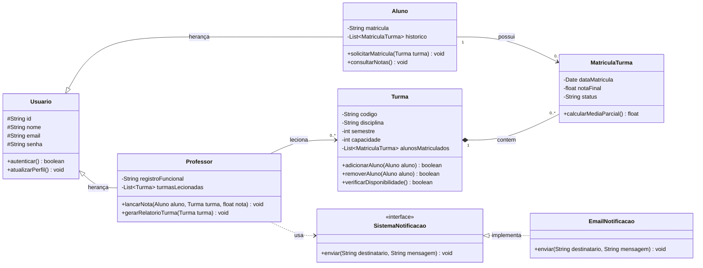

# 📊 Diagrama de Classes - Atividade Aula 4
**Disciplina:** Engenharia de Software II (4º Semestre)  
**Professor:** Prof. Wesley Soares  
**Aluno / Desenvolvedor:** Professor & Desenvolvedor Sênior - Sistemas de Informação  

---

## 1. Contextualização
Durante a **Aula 4** da disciplina de Engenharia de Software II, discutimos a modelagem orientada a objetos voltada para um sistema robusto de gerenciamento acadêmico e de turmas, enfatizando os princípios SOLID, acoplamento fraco e alta coesão.

O diagrama abaixo representa a arquitetura lógica de classes discutida em sala, contemplando o mapeamento conceitual para a implementação em linguagens orientadas a objetos (como Java/TypeScript).

---

## 2. Diagrama de Classes (Mermaid)

---

## 3. Descrição dos Componentes

1. **Classe Abstrata `Usuario`**: Serve como superclasse para centralizar os atributos e comportamentos comuns de autenticação e gerenciamento de perfil no sistema.
2. **Classes `Aluno` e `Professor`**: Especializações de `Usuario`, implementando regras de negócio específicas de seus papéis acadêmicos.
3. **Classe `Turma`**: Representa uma oferta de disciplina em um determinado semestre, controlando limites de capacidade e listas de alunos.
4. **Classe Associativa `MatriculaTurma`**: Resolve o relacionamento de *muitos-para-muitos* ($\text{N:M}$) entre `Aluno` e `Turma`, armazenando atributos contextuais como data de matrícula, nota final e status atual.
5. **Interface `SistemaNotificacao`**: Aplica o Princípio da Inversão de Dependência (DIP) do SOLID, desacoplando os módulos de negócio de serviços externos de envio de mensagens (ex: `EmailNotificacao`).