# Trabalho — Trabalho semestral

> **Professor:** Wesley Soares
> **Disciplina:** Engenharia de Software II (4º Semestre)
> **Prazo de Entrega:** 08/09/2026 às 23:59
> **Pontuação Máxima:** 100 pontos
> **Conteúdo cobrado:** [Aula 01 - Introdução ao Ciclo de Vida do Projeto de Software](../../Aulas/Aula%2001%20-%20Introdu%C3%A7%C3%A3o%20ao%20Ciclo%20de%20Vida%20do%20Projeto%20de%20Software/detalhes.md), [Aula 02 - Fundamentos de Projeto Orientado a Objetos](../../Aulas/Aula%2002%20-%20Fundamentos%20de%20Projeto%20Orientado%20a%20Objetos/detalhes.md), [Aula 03 - Técnicas de Elicitação e Levantamento de Requisitos](../../Aulas/Aula%2003%20-%20T%C3%A9cnicas%20de%20Elicita%C3%A7%C3%A3o%20e%20Levantamento%20de%20Requisitos/detalhes.md), [Aula 04 - Modelagem de Casos de Uso UML](../../Aulas/Aula%2004%20-%20Modelagem%20de%20Casos%20de%20Uso%20UML/detalhes.md), [Aula 06 - Modelagem de Requisitos e Casos de Uso](../../Aulas/Aula%2006%20-%20Modelagem%20de%20Requisitos%20e%20Casos%20de%20Uso/detalhes.md)

---

## Sumário

- [Enunciado original (Google Classroom)](#enunciado-original-google-classroom)
- [Análise do que é pedido](#análise-do-que-é-pedido)
- [Fundamentação teórica](#fundamentação-teórica)
  - [Engenharia de requisitos e ciclo de vida de software](#engenharia-de-requisitos-e-ciclo-de-vida-de-software)
  - [Tipologia de requisitos: funcionais, não-funcionais e regras de negócio](#tipologia-de-requisitos-funcionais-não-funcionais-e-regras-de-negócio)
  - [Priorização de requisitos com o método MoSCoW](#priorização-de-requisitos-com-o-método-moscow)
  - [Modelagem de casos de uso UML: sintaxe, semântica e relacionamentos](#modelagem-de-casos-de-uso-uml-sintaxe-semântica-e-relacionamentos)
  - [Granularidade: casos de uso gerais versus específicos](#granularidade-casos-de-uso-gerais-versus-específicos)
  - [Estrutura da especificação textual de casos de uso](#estrutura-da-especificação-textual-de-casos-de-uso)
- [Resolução proposta](#resolução-proposta)
  - [Definição do sistema de referência: MedClinic](#definição-do-sistema-de-referência-medclinic)
  - [Levantamento de requisitos](#levantamento-de-requisitos)
  - [Matriz e priorização MoSCoW](#matriz-e-priorização-moscow)
  - [Diagrama de casos de uso geral](#diagrama-de-casos-de-uso-geral)
  - [Diagrama de casos de uso específico](#diagrama-de-casos-de-uso-específico)
  - [Documentação textual detalhada dos casos de uso](#documentação-textual-detalhada-dos-casos-de-uso)
  - [Diagrama de suporte comportamental](#diagrama-de-suporte-comportamental)
- [Como testar e validar](#como-testar-e-validar)
- [Critérios de qualidade](#critérios-de-qualidade)
- [Arquivos de apoio](#arquivos-de-apoio)
- [Mapa da atividade](#mapa-da-atividade)
- [Glossário](#glossário)
- [Pontos-chave para a prova](#pontos-chave-para-a-prova)
- [Perguntas e respostas (JSONL)](#perguntas-e-respostas-jsonl)
- [Checklist de revisão](#checklist-de-revisão)

---

## Enunciado original (Google Classroom)

> subir documento do word ou google docs contendo levantamento de requisitos, diagrama moscow e casos de uso geral e específico com documentação

---

## Análise do que é pedido

O trabalho semestral solicitado pelo Professor Wesley Soares consolida os pilares fundamentais da fase de concepção e especificação de software dentro da disciplina de Engenharia de Software II. O objetivo central é demonstrar a capacidade de transformar necessidades abstratas de negócio em artefatos de engenharia rigorosos, rastreáveis e compreensíveis tanto por partes interessadas (*stakeholders*) quanto por desenvolvedores.

### Decomposição dos entregáveis obrigatórios

1. **Documento formal (Word ou Google Docs):**
   - Estrutura textual organizada contendo capa, identificação dos alunos, introdução com descrição do domínio do problema e seções técnicas bem delimitadas.
2. **Levantamento de requisitos:**
   - Catalogação exaustiva e estruturada dos Requisitos Funcionais (RF), Requisitos Não-Funcionais (RNF) e Regras de Negócio (RN).
   - Identificadores padronizados (ex.: `RF01`, `RNF01`, `RN01`) acompanhados de descrição inequívoca e critério de aceitação.
3. **Diagrama e matriz MoSCoW:**
   - Aplicação da técnica de priorização MoSCoW (*Must have*, *Should have*, *Could have*, *Won't have*).
   - Representação visual e tabela comparativa justificando o enquadramento de cada requisito em seu respectivo nível de criticidade.
4. **Diagrama de casos de uso geral:**
   - Visão macro da arquitetura funcional do sistema.
   - Definição clara da fronteira do sistema (*system boundary*), identificação de todos os atores primários e secundários, e apresentação dos casos de uso de alto nível sem sobrecarga de detalhes internos.
5. **Diagrama de casos de uso específico:**
   - Visão detalhada de um subsistema ou módulo crítico.
   - Emprego correto dos relacionamentos avançados da UML: `<<include>>`, `<<extend>>` (com ponto de extensão) e generalização/especialização (tanto de atores quanto de casos de uso).
6. **Documentação textual de casos de uso:**
   - Especificação detalhada dos fluxos de interação para os casos de uso mapeados.
   - Presença obrigatória de: identificador, ator principal, atores secundários, pré-condições, pós-condições, fluxo principal (*happy path*), fluxos alternativos, fluxos de exceção e regras de negócio associadas.

### Critérios implícitos e armadilhas a evitar

- **Confusão entre Requisito Funcional e Regra de Negócio:** Um requisito funcional descreve o que o sistema deve fazer tecnicamente (ex.: "O sistema deve calcular o valor final com desconto"). Uma regra de negócio define uma premissa do domínio que existe independentemente de software (ex.: "Clientes da categoria Ouro têm direito a 15% de desconto").
- **Decomposição funcional disfarçada de caso de uso:** Casos de uso devem representar uma meta completa que entrega valor perceptível ao ator. Quebrar o sistema em "Digitar CPF", "Clicar em Salvar" ou "Validar Campo" é um erro clássico de modelagem funcional procedimental, proibido na UML orientada a objetos.
- **Inversão de setas em `<<include>>` e `<<extend>>`:** O relacionamento `<<include>>` aponta do caso de uso base para a inclusão mandatória. O relacionamento `<<extend>>` aponta do caso de uso extensor (opcional) para o caso de uso base.
- **Rastreabilidade ausente:** Cada caso de uso documentado deve obrigatoriamente estar vinculado a um ou mais requisitos funcionais levantados e priorizados no MoSCoW.

---

## Fundamentação teórica

### Engenharia de requisitos e ciclo de vida de software

A Engenharia de Requisitos é a disciplina da Engenharia de Software responsável por descobrir, analisar, documentar e manter os requisitos ao longo de todo o ciclo de vida do sistema (Aula 01 e Aula 03). Falhas cometidas nesta etapa propagam erros geométricos para as fases de projeto, codificação e testes, resultando na conhecida regra de Boehm: o custo de corrigir um defeito de requisito na fase de produção é até cem vezes superior ao custo de corrigi-lo durante a especificação inicial.

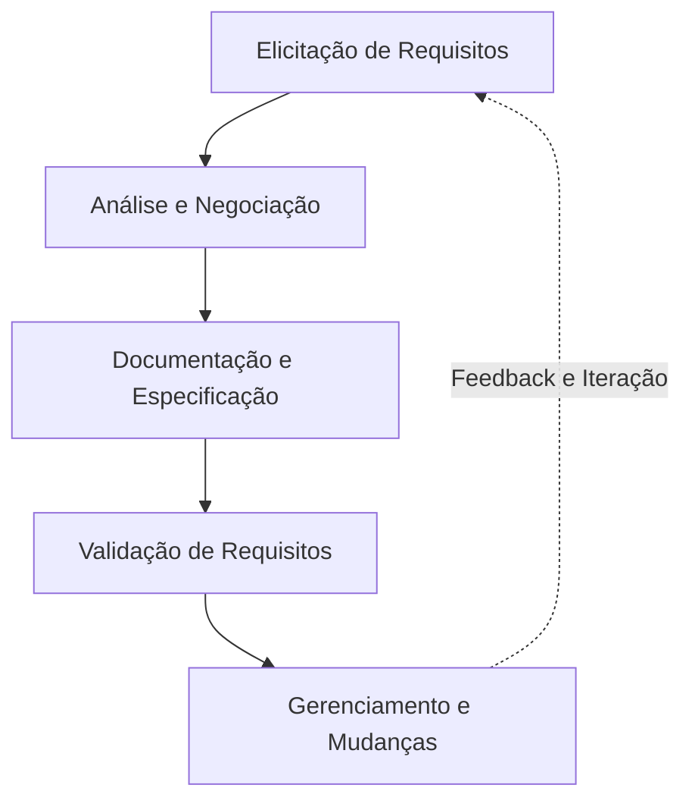

- **Definição:** Conjunto estruturado de atividades voltado a compreender o problema de negócio e estabelecer com precisão os serviços que o software deve fornecer, juntamente com suas restrições operacionais.
- **Motivação:** Mitigar o risco de construir o software errado, reduzir retrabalho de desenvolvimento, alinhar expectativas entre clientes e equipe técnica, e prover a base contratual e de testes do projeto.
- **Exemplo:** Realizar entrevistas estruturadas com a equipe de faturamento de uma clínica para entender as regras da ANS antes de desenhar a tela de fechamento de guias.
- **Contraexemplo:** O desenvolvedor iniciar diretamente a modelagem do banco de dados e a escrita do código frontend baseando-se apenas em uma conversa informal de corredor de cinco minutos com o gerente.
- **Armadilhas:** Tratar o levantamento como um evento pontual único em vez de um processo iterativo; aceitar jargões vagos de clientes (ex.: "o sistema deve ser intuitivo e rápido") sem métricas objetivas de verificação.

---

### Tipologia de requisitos: funcionais, não-funcionais e regras de negócio

A taxonomia formal estabelecida nas Aulas 03 e 06 segmenta as necessidades do sistema em três categorias distintas e complementares:

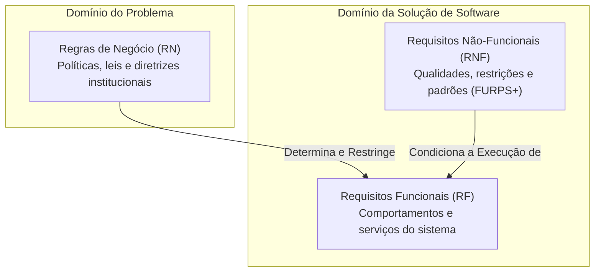

#### Requisitos Funcionais (RF)
- **Definição:** Declarações explícitas sobre os serviços, transformações de dados, comportamentos e saídas que o software deve executar em resposta a estímulos específicos.
- **Motivação:** Estabelecer com clareza o escopo operacional do sistema, permitindo que os desenvolvedores implementem as rotinas necessárias e a equipe de garantia de qualidade (QA) elabore casos de teste.
- **Exemplo:** "O sistema deve emitir um alerta visual e impedir o agendamento de uma consulta quando o médico selecionado já possuir outro atendimento no mesmo intervalo de horário."
- **Contraexemplo:** "O sistema deve ser desenvolvido em React com Node.js." (Isto é uma restrição arquitetural / RNF, não uma funcionalidade de usuário).
- **Armadilhas:** Descrever a implementação técnica em vez do comportamento esperado pelo usuário; redigir requisitos com ambiguidade léxica ("o sistema deve processar os dados adequadamente").

#### Requisitos Não-Funcionais (RNF)
- **Definição:** Propriedades de qualidade, restrições de desempenho, segurança, conformidade legal e limites operacionais sob os quais o sistema deve funcionar. Seguem comumente o modelo FURPS+ (*Functionality, Usability, Reliability, Performance, Supportability*).
- **Motivação:** Garantir que o sistema, além de executar suas funções lógicas, opere de forma segura, estável, escalável e dentro dos padrões de conformidade do mercado.
- **Exemplo:** "O sistema deve anonimizar os dados sensíveis dos prontuários médicos em repouso utilizando criptografia AES de 256 bits, em conformidade com o artigo 13 da LGPD."
- **Contraexemplo:** "O sistema deve permitir que o médico anote o histórico de alergias do paciente." (Isto é um Requisito Funcional).
- **Armadilhas:** Declarar RNFs sem métricas mensuráveis (ex.: "o sistema deve ser seguro"). Um RNF deve sempre possuir uma forma objetiva de medição e teste.

#### Regras de Negócio (RN)
- **Definição:** Diretrizes, políticas organizacionais, normas jurídicas ou axiomas do domínio que regulam o funcionamento da instituição, independentemente da existência ou informatização por software.
- **Motivação:** Preservar a integridade legal e operacional da organização, servindo de base fundacional a partir da qual os requisitos funcionais são deduzidos.
- **Exemplo:** "Consultas canceladas com menos de 24 horas de antecedência acarretam cobrança de 50% do valor da taxa de agendamento."
- **Contraexemplo:** "O botão de cancelamento deve ficar desabilitado após as 18:00." (Isto é um requisito de interface/funcional derivado da regra, não a regra em si).
- **Armadilhas:** Tratar regras de negócio voláteis como requisitos codificados de forma rígida (*hardcoded*), dificultando manutenções futuras.

---

### Priorização de requisitos com o método MoSCoW

O método MoSCoW é uma técnica analítica de priorização colaborativa utilizada para gerenciar o escopo de entregas em projetos com prazos e orçamentos finitos. Ele divide as demandas em quatro quadrantes rigorosos:

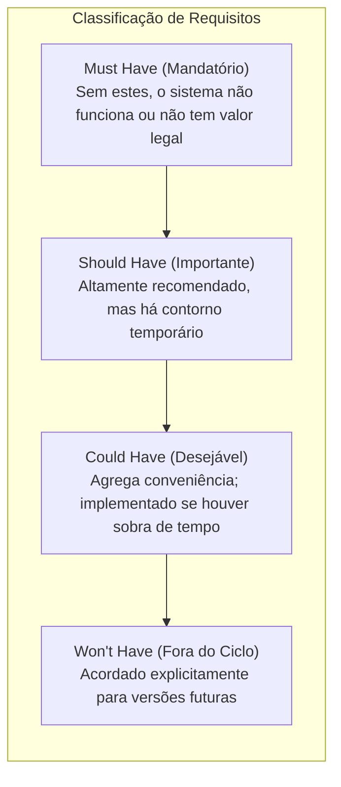

#### Os quatro níveis de classificação
1. **Must Have (M):** Requisitos inegociáveis. Se qualquer um deles não for entregue, o sistema é considerado inviável, ilegal ou tecnicamente inoperante para o lançamento (*showstopper*).
2. **Should Have (S):** Requisitos de alta prioridade que adicionam valor crítico. Devem ser implementados se possível, mas sua ausência não inviabiliza o funcionamento imediato do sistema (existem soluções de contorno viáveis no curto prazo).
3. **Could Have (C):** Requisitos desejáveis que trazem ganhos de conveniência ou refinamento estético/operacional. São incluídos apenas se houver folga de cronograma e recursos sem colocar em risco os itens *Must* e *Should*.
4. **Won't Have (W) [this time]:** Requisitos expressamente reconhecidos pelas partes interessadas como fora do escopo do ciclo atual de desenvolvimento. Evitam o fenômeno do inchaço de escopo (*scope creep*).

- **Definição:** Técnica de categorização qualitativa de requisitos em quatro níveis de importância decrescente para direcionamento do esforço de engenharia.
- **Motivação:** Equilibrar restrições de prazo, custo e capacidade produtiva, estabelecendo um Produto Mínimo Viável (MVP) sólido e um roteiro claro de evolução.
- **Exemplo:** Em um sistema de clínica: Emissão de receita médica é *Must Have*; Envio de lembrete por SMS é *Should Have*; Integração com calendário do Google do paciente é *Could Have*; Telemedicina com tradução simultânea por IA é *Won't Have* para a versão 1.0.
- **Contraexemplo:** Classificar 95% de todos os requisitos do projeto como *Must Have*. Quando tudo é prioridade máxima, nada é prioridade e o planejamento falha.
- **Armadilhas:** Esquecer a regra empírica da literatura de engenharia de software (máximo de 60% do esforço alocado em *Must Have*, 20% em *Should Have* e 20% em *Could Have* para garantir resiliência temporal).

---

### Modelagem de casos de uso UML: sintaxe, semântica e relacionamentos

A modelagem de casos de uso (Aula 04 e Aula 06) é a técnica padrão da UML para capturar os requisitos comportamentais sob a ótica dos utilizadores externos. Ela define os limites do sistema e especifica as transações realizadas entre os atores e o sistema.

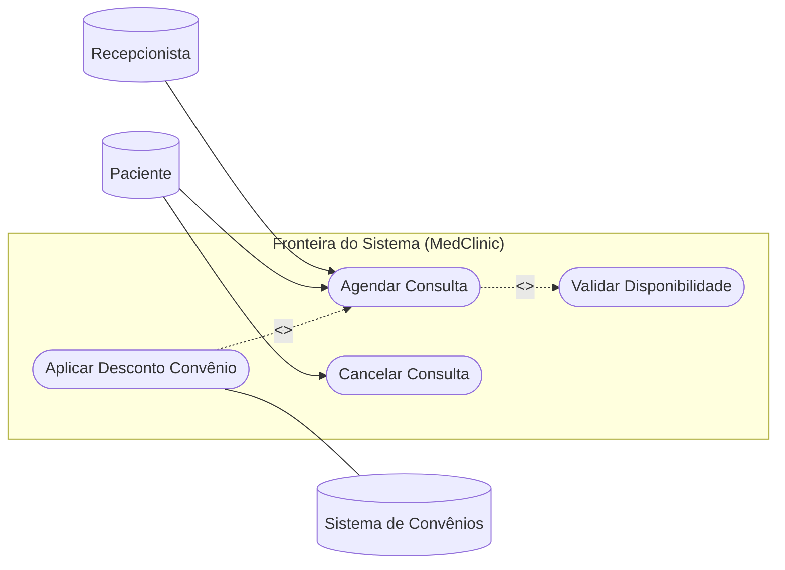

#### Elementos fundamentais da modelagem
- **Ator:** Entidade externa (humano, dispositivo de hardware ou outro sistema de software) que interage ativamente com o sistema, enviando estímulos ou recebendo dados de resposta. Os atores são papéis desempenhados, não indivíduos específicos.
- **Caso de Uso:** Sequência completa de ações executadas pelo sistema que resulta em um resultado observável de valor para um ator específico.
- **Fronteira do Sistema (*Subject Boundary*):** Retângulo conceitual que delimita o que faz parte do software a ser construído (casos de uso situados em seu interior) e o que pertence ao ambiente externo (atores situados fora).

#### Relacionamentos formais

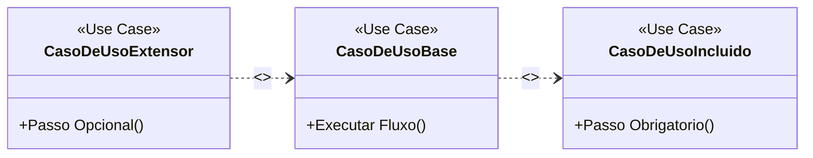

1. **Associação:** Linha contínua conectando um ator a um caso de uso, indicando canal de comunicação bidirecional.
2. **Inclusão (`<<include>>`):**
   - **Semântica:** O caso de uso base incorpora obrigatoriamente o comportamento do caso de uso incluído. O caso de uso base não pode ser concluído com sucesso sem a execução integral do caso de uso incluído.
   - **Sentido da seta:** Parte do caso de uso **base** em direção ao caso de uso **incluído** (`Base ..> Incluído`).
   - **Motivação:** Eliminar redundância de especificação ao extrair passos comuns compartilhados por múltiplos casos de uso (ex.: "Autenticar Usuário").
3. **Extensão (`<<extend>>`):**
   - **Semântica:** O caso de uso extensor insere seu comportamento de maneira opcional ou condicional dentro do caso de uso base, disparado apenas quando uma condição de guarda for verdadeira em um **Ponto de Extensão** (*Extension Point*) predeterminado. O caso de uso base tem plena autonomia e desconhece a existência do extensor.
   - **Sentido da seta:** Parte do caso de uso **extensor** em direção ao caso de uso **base** (`Extensor ..> Base`).
   - **Motivação:** Manter o caso de uso base focado no fluxo padrão, desacoplando variações de fluxo, exceções de negócio complexas ou comportamentos opcionais.
4. **Generalização:**
   - **Atores:** Um ator especializado herda as associações e permissões do ator generalista (ex.: "Médico Cirurgião" é uma generalização de "Médico").
   - **Casos de Uso:** O caso de uso especializado herda os comportamentos e fluxos do caso de uso ancestral, podendo sobrepor passos ou adicionar novas etapas especializadas (ex.: "Pagar com Cartão de Crédito" especializa "Realizar Pagamento").

- **Armadilhas recorrentes em provas e trabalhos:**
  - Inverter a ponta da seta no relacionamento `<<extend>>`.
  - Utilizar `<<include>>` para simular chamadas de funções procedimentais de código (`<<include>> Validar CPF`).
  - Representar o sistema operacional, bancos de dados internos ou linguagens de programação como atores externos.

---

### Granularidade: casos de uso gerais versus específicos

A separação entre níveis de abstração é mandatória para evitar que os modelos se tornem ilegíveis:

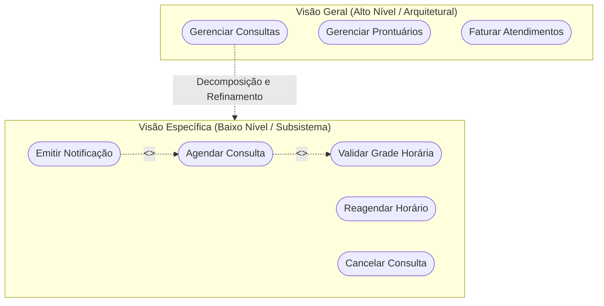

- **Caso de Uso Geral:** Apresenta a arquitetura de funcionalidades do sistema como um todo. Agrupa macro-objetivos de negócio, permitindo que a diretoria, clientes e gerentes de projeto compreendam o escopo total sem se perderem em detalhes técnicos. Possui poucos casos de uso e poucas relações de inclusão ou extensão.
- **Caso de Uso Específico:** Faz uma ampliação (*zoom-in*) sobre um subsistema específico (ex.: Subsistema de Agendamento). Expõe explicitamente a anatomia dos fluxos, detalhando relações de dependência mandatória (`<<include>>`), ramificações condicionais (`<<extend>>`) e especializações.

---

### Estrutura da especificação textual de casos de uso

O diagrama UML é apenas o índice visual; o verdadeiro valor da Engenharia de Requisitos reside na **especificação textual**. Um caso de uso sem documentação estruturada é inútil para a engenharia.

A estrutura formal exigida no padrão de mercado (baseado nas recomendações de Alistair Cockburn e RUP) contempla:

| Campo | Finalidade Técnica |
| :--- | :--- |
| **Identificador e Nome** | Código único (ex.: `CSU01`) e verbo no infinitivo com substantivo claro. |
| **Ator Primário** | O participante que inicia a interação para atingir o objetivo. |
| **Atores Secundários** | Participantes que fornecem dados ou realizam tarefas de apoio. |
| **Breve Descrição** | Resumo em um parágrafo da intenção e do valor entregue pelo caso de uso. |
| **Pré-condições** | Estados que o sistema **deve** obrigatoriamente satisfazer antes do início. |
| **Pós-condições (Sucesso)** | Estado em que o sistema se encontra após o término correto da operação. |
| **Pós-condições (Falha)** | Estado em que o sistema se encontra caso o fluxo seja abortado. |
| **Fluxo Principal (*Happy Path*)** | Sequência numerada e atômica de passos do cenário ideal de sucesso. |
| **Fluxos Alternativos** | Variações válidas de caminho que ainda concluem o objetivo do ator. |
| **Fluxos de Exceção** | Erros, falhas de sistema ou violações de regras que abortam o caso de uso. |
| **Regras de Negócio Associadas** | IDs das regras de domínio aplicadas durante a execução dos passos. |

---

## Resolução proposta

Para atender exaustivamente a todas as exigências do enunciado do Professor Wesley Soares, adota-se como referência de projeto o **Sistema de Gestão de Clínica Médica Integrada (MedClinic)**. Este domínio é rico em regras de concorrência, restrições legais e interações entre diferentes perfis de usuários.

---

### Definição do sistema de referência: MedClinic

O **MedClinic** é um sistema projetado para gerenciar a rotina operacional, clínica e financeira de clínicas de saúde privadas de médio porte. Seus módulos contemplam o controle de agendas médicas, a gestão de recepção e triagem de pacientes, a emissão e guarda de prontuários eletrônicos de saúde (PEP), e o faturamento de consultas tanto por cobrança particular quanto por operadoras de planos de saúde.

---

### Levantamento de requisitos

A seguir, apresentam-se os catálogos formais de Requisitos Funcionais, Requisitos Não-Funcionais e Regras de Negócio.

#### Tabela de Requisitos Funcionais (RF)

| ID | Nome do Requisito | Descrição Detalhada |
| :--- | :--- | :--- |
| **RF01** | Cadastrar Paciente | O sistema deve permitir o registro e a atualização de dados cadastrais dos pacientes (nome, CPF, data de nascimento, telefone, endereço e plano de saúde). |
| **RF02** | Agendar Consulta | O sistema deve permitir a seleção de profissional médico, especialidade, data e horário vago para a marcação de um atendimento ambulatorial. |
| **RF03** | Cancelar Agendamento | O sistema deve permitir o cancelamento de uma consulta previamente agendada por solicitação do paciente ou indisponibilidade médica justificada. |
| **RF04** | Validar Grade de Horários | O sistema deve verificar de forma síncrona a existência de sobreposição de horários do médico antes de persistir qualquer agendamento. |
| **RF05** | Registrar Atendimento Clínico | O sistema deve disponibilizar ao médico logado interface para preenchimento de anamnese, diagnóstico (CID-10), hipótese diagnóstica e prescrição de medicamentos. |
| **RF06** | Emitir Receita Médica Digital | O sistema deve gerar documento PDF da receita médica contendo código bidimensional QR-Code assinado digitalmente com certificado ICP-Brasil. |
| **RF07** | Faturar Atendimento Particular | O sistema deve registrar a forma de pagamento (dinheiro, cartão ou PIX), emitir o comprovante e dar baixa no contas a receber da clínica. |
| **RF08** | Emitir Guia TISS para Convênio | O sistema deve gerar o arquivo XML no padrão TISS exigido pela Agência Nacional de Saúde Suplementar (ANS) para faturamento junto ao plano de saúde. |
| **RF09** | Enviar Lembrete de Consulta | O sistema deve disparar notificação automática via WhatsApp e E-mail 24 horas antes do horário previsto para confirmação pelo paciente. |
| **RF10** | Emitir Relatório Gerencial de Ocupação | O sistema deve emitir relatórios periódicos consolidando taxa de absenteísmo (*no-show*), faturamento bruto e tempo médio de espera na recepção. |

#### Tabela de Requisitos Não-Funcionais (RNF)

| ID | Categoria (FURPS+) | Descrição Técnica | Métrica / Critério de Aceitação |
| :--- | :--- | :--- | :--- |
| **RNF01** | Segurança | Todos os dados sensíveis de prontuário e identificação de pacientes devem ser criptografados em repouso. | Algoritmo AES-256 com chaves rotativas gerenciadas em cofre de chaves. |
| **RNF02** | Desempenho | O tempo de resposta para busca de horários disponíveis na agenda médica não deve degradar sob carga. | Latência inferior a 1,5 segundos para 200 requisições simultâneas. |
| **RNF03** | Confiabilidade | O sistema deve manter alta disponibilidade operacional durante os horários comerciais de atendimento. | SLA de 99,8% de disponibilidade (máximo de 1h26m de inatividade mensal). |
| **RNF04** | Suportabilidade | A interface da aplicação web deve ser responsiva e compatível com os principais navegadores modernos. | Suporte comprovado em Chrome, Edge, Safari e Firefox nas duas últimas versões estáveis. |
| **RNF05** | Usabilidade | A recepção deve conseguir registrar o comparecimento de um paciente na recepção com o mínimo de interações. | Fluxo de *check-in* executado em até 3 cliques na tela inicial. |
| **RNF06** | Conformidade | A geração de prontuários deve atender integralmente à legislação vigente de proteção de dados e guarda médica. | Conformidade com LGPD (Lei 13.709/2018) e Resolução CFM nº 1.821/2007 (guarda por 20 anos). |

#### Tabela de Regras de Negócio (RN)

| ID | Nome da Regra | Declaração da Diretriz / Política de Negócio |
| :--- | :--- | :--- |
| **RN01** | Bloqueio por Duplicidade | Um mesmo paciente não pode possuir mais de uma consulta agendada com a mesma especialidade médica na mesma data. |
| **RN02** | Antecedência Mínima de Agendamento | Agendamentos de consultas de rotina só podem ser realizados com antecedência mínima de 2 horas em relação ao horário corrente. |
| **RN03** | Imutabilidade do Prontuário | Registros médicos finalizados e assinados digitalmente não podem ser editados ou excluídos; correções devem ser realizadas via termo aditivo retificador datado. |
| **RN04** | Prazo para Cancelamento sem Multa | Cancelamentos de consultas particulares efetuados com menos de 24 horas de antecedência implicam retenção de 30% do valor pago a título de taxa administrativa. |
| **RN05** | Validade de Elegibilidade de Convênio | Consultas intermediadas por plano de saúde exigem token de autorização emitido pela operadora com validade não expirada no momento do atendimento. |

---

### Matriz e priorização MoSCoW

A priorização dos requisitos funcionais e não-funcionais do MedClinic foi conduzida considerando as restrições regulatórias do Conselho Federal de Medicina (CFM), a sustentabilidade financeira inicial e a necessidade de viabilizar um MVP operacional funcional.

#### Tabela da Matriz MoSCoW

| Classificação | IDs dos Requisitos | Racional e Justificativa de Engenharia |
| :--- | :--- | :--- |
| **Must Have**<br/>(Mandatório para o MVP) | **RF01**, **RF02**, **RF04**, **RF05**, **RNF01**, **RNF03**, **RN01**, **RN03** | Sem o cadastro de pacientes, o agendamento sem conflitos e o registro seguro do prontuário médico, a clínica é impedida legalmente e operacionalmente de abrir suas portas. |
| **Should Have**<br/>(Alta Prioridade / Ciclo 1) | **RF03**, **RF06**, **RF07**, **RNF02**, **RNF05**, **RN02**, **RN04** | O cancelamento, a emissão de receita com assinatura ICP-Brasil e o faturamento particular trazem grande eficiência e segurança jurídica, embora em caso crítico a receita ainda pudesse ser emitida em bloco de papel manual. |
| **Could Have**<br/>(Desejável / Ciclo 2) | **RF08**, **RF09**, **RNF04**, **RN05** | A automação de envio de lembretes via WhatsApp e a integração de guias TISS facilitam a operação, mas a recepção pode realizar tais tarefas manualmente via telefone e portal web da operadora no início. |
| **Won't Have**<br/>(Fora do Escopo Atual) | **RF10**, telemedicina com videoconferência síncrona, aplicativo nativo iOS/Android | Relatórios analíticos avançados de BI e infraestrutura de teleatendimento por vídeo foram adiados para a versão 2.0 para manter o foco na estabilidade do núcleo clínico. |

#### Diagrama visual da priorização MoSCoW

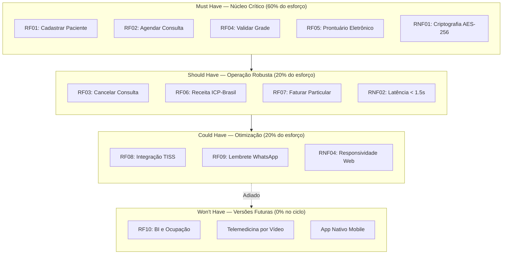

---

### Diagrama de casos de uso geral

O Diagrama de Casos de Uso Geral delimita a fronteira do sistema **MedClinic**, estabelecendo a visão macro das interações entre os atores operacionais, clínicos e os sistemas externos de suporte.

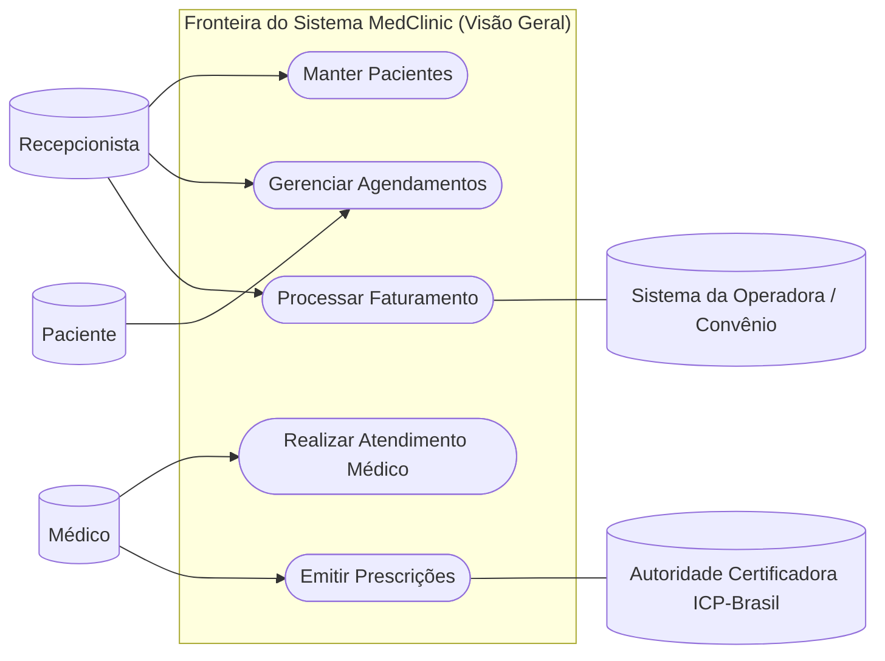

*Nota de interpretação arquitetural:* Os casos de uso acima representam pacotes funcionais de macro-nível. A Recepcionista gerencia o cadastro e apoia agendamentos e faturamento; o Paciente pode interagir diretamente para agendar ou solicitar cancelamentos; o Médico conduz o atendimento e emite as prescrições, as quais se comunicam com entidades externas (autoridade certificadora ICP-Brasil e operadoras de convênio).

---

### Diagrama de casos de uso específico

O diagrama a seguir detalha o **Módulo de Agendamento e Recepção**, explicitando a aplicação prática dos relacionamentos `<<include>>`, `<<extend>>` e generalização.

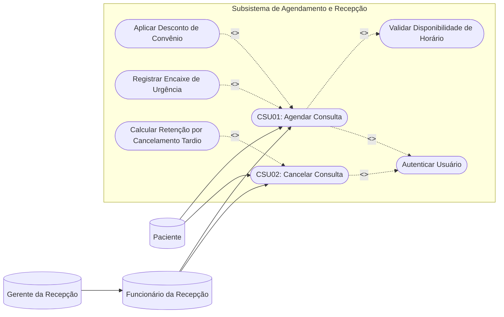

#### Justificativa técnica dos relacionamentos modelados:
1. **`<<include>>` para "Validar Disponibilidade de Horário" a partir de CSU01:** O caso de uso base não pode prosperar sob hipótese alguma se a grade do profissional não for consultada e bloqueada, garantindo a Regra de Negócio `RN01`.
2. **`<<include>>` para "Autenticar Usuário":** Tanto a marcação quanto o cancelamento exigem auditoria e controle de sessão obrigatórios.
3. **`<<extend>>` de "Aplicar Desconto de Convênio" para CSU01:** Esta etapa só ocorre se o paciente possuir convênio cadastrado e apresentar autorização ativa (`RN05`). Se a consulta for particular integral, o fluxo do caso de uso base encerra sem disparar este ramo.
4. **`<<extend>>` de "Registrar Encaixe de Urgência" para CSU01:** Procedimento excepcional acionado exclusivamente por permissão da gerência da recepção quando a agenda normal do médico já estiver saturada.
5. **`<<extend>>` de "Calcular Retenção por Cancelamento Tardio" para CSU02:** Disparado apenas se a solicitação de cancelamento ocorrer com intervalo inferior a 24 horas do atendimento planejado (`RN04`).
6. **Generalização de Atores:** O "Gerente da Recepção" herda todas as permissões do "Funcionário da Recepção", agregando a prerrogativa única de autorizar encaixes de urgência e abonar multas de cancelamento.

---

### Documentação textual detalhada dos casos de uso

Apresentam-se a seguir três especificações textuais completas, rigorosamente estruturadas de acordo com o padrão internacional de Engenharia de Software.

---

#### Especificação de Caso de Uso: CSU01 — Agendar Consulta Médica

- **Identificador:** CSU01
- **Nome:** Agendar Consulta Médica
- **Atores:**
  - *Primário:* Funcionário da Recepção ou Paciente (via terminal/web).
  - *Secundário:* Sistema de Mensageria (serviço externo de envio de notificações).
- **Breve Descrição:** Permite alocar um horário vago na grade de um médico especialista para um paciente previamente cadastrado, confirmando os detalhes do agendamento e gerando a reserva do horário.
- **Requisitos Associados:** RF01, RF02, RF04, RNF02, RN01, RN02.
- **Pré-condições:**
  1. O usuário que realiza a operação deve estar autenticado no sistema.
  2. O paciente deve possuir cadastro ativo no sistema (`RF01`).
  3. O médico deve possuir grade de horários publicada e ativa.
- **Pós-condições de Sucesso:**
  1. O horário na agenda médica é alterado para o estado "Reservado".
  2. Um registro de agendamento com identificador único é persistido no banco de dados.
  3. Um comprovante com protocolo de confirmação é disponibilizado ao solicitante.
- **Pós-condições de Falha:**
  1. Nenhum horário é bloqueado e a agenda permanece inalterada.
  2. O usuário é notificado com mensagem explicativa sobre o motivo da recusa.

##### Fluxo Principal (*Happy Path*)
1. O ator inicia o caso de uso solicitando a marcação de uma nova consulta.
2. O sistema solicita a identificação do paciente, a especialidade médica desejada e o período pretendido.
3. O ator fornece os dados cadastrais do paciente (CPF) e a especialidade buscada.
4. O sistema busca os dados do paciente e apresenta a lista de médicos especialistas disponíveis com suas respectivas agendas.
5. O ator seleciona o médico de sua preferência, a data e o horário vago desejado.
6. O sistema executa o caso de uso obrigatório **Validar Disponibilidade de Horário** (`<<include>>`).
7. O sistema valida as regras de negócio: verifica que a antecedência é superior a 2 horas (`RN02`) e que o paciente não possui outra consulta na mesma especialidade no mesmo dia (`RN01`).
8. O sistema calcula o valor base da consulta e exibe o resumo completo do agendamento para conferência.
9. O ator revisa os dados e clica no botão "Confirmar Agendamento".
10. O sistema bloqueia o horário na agenda, persiste o agendamento com status "Confirmado" e gera o código localizador.
11. O sistema envia a confirmação para a fila do serviço de mensageria externa.
12. O sistema encerra o caso de uso exibindo o comprovante em tela.

##### Fluxos Alternativos
- **FA01 — Paciente conveniado com plano de saúde (Ponto de Extensão: Etapa 8):**
  1. Na etapa 8, o sistema detecta que o paciente possui convênio médico informado.
  2. O sistema aciona o caso de uso extensor **Aplicar Desconto de Convênio** (`<<extend>>`).
  3. O sistema solicita o número da carteirinha e realiza consulta síncrona ao *web service* da operadora para verificar elegibilidade (`RN05`).
  4. O *web service* retorna autorização válida e valor da coparticipação.
  5. O sistema atualiza o valor da fatura para o valor de coparticipação do convênio.
  6. O fluxo retorna ao passo 9 do Fluxo Principal.

- **FA02 — Agendamento de retorno sem custo (Ponto de Extensão: Etapa 8):**
  1. Na etapa 8, o sistema identifica que o paciente teve consulta com o mesmo médico nos últimos 15 dias.
  2. O sistema classifica o agendamento sob a categoria "Retorno Médico".
  3. O valor a faturar é ajustado para R$ 0,00.
  4. O fluxo retorna ao passo 9 do Fluxo Principal.

##### Fluxos de Exceção
- **FE01 — Colisão de horários / Concorrência de reserva (Etapa 6):**
  1. Na etapa 6, o caso de uso incluído detecta que outro operador reservou o mesmo horário frações de segundo antes.
  2. O sistema emite alerta: "O horário selecionado acaba de ser preenchido por outro usuário."
  3. O sistema atualiza a grade de horários em tela e reapresenta os horários remanescentes.
  4. O fluxo retorna à etapa 5 do Fluxo Principal. Se o ator optar por desistir, o caso de uso é cancelado sem persistência.

- **FE02 — Violação de duplicidade de especialidade no dia (Etapa 7):**
  1. Na etapa 7, o sistema detecta que o paciente já tem consulta agendada para a mesma especialidade naquela mesma data (`RN01`).
  2. O sistema emite mensagem de bloqueio: "Operação não permitida: O paciente já possui agendamento na especialidade [Nome] nesta data."
  3. O sistema aborta a operação e o caso de uso é finalizado em estado de falha.

---

#### Especificação de Caso de Uso: CSU02 — Registrar Atendimento no Prontuário Eletrônico

- **Identificador:** CSU02
- **Nome:** Registrar Atendimento no Prontuário Eletrônico
- **Atores:**
  - *Primário:* Médico.
  - *Secundário:* Sistema de Auditoria Interna.
- **Breve Descrição:** Permite ao médico registrar a evolução clínica do paciente, registrar o histórico de queixas, prescrever terapias e selar o prontuário eletrônico com assinatura criptográfica imutável.
- **Requisitos Associados:** RF05, RF06, RNF01, RNF06, RN03.
- **Pré-condições:**
  1. O médico deve estar logado no sistema com perfil ativo e CRM validado.
  2. O paciente deve ter passado pelo *check-in* na recepção e constar na fila "Aguardando Atendimento".
- **Pós-condições de Sucesso:**
  1. O prontuário é gravado com status "Finalizado/Imutável" com carimbo de tempo (*timestamp* confiável).
  2. A consulta do agendamento associado transita para o status "Realizada".
  3. O documento assinado passa a ser consultável no histórico clínico do paciente.
- **Pós-condições de Falha:**
  1. O rascunho de texto é mantido temporariamente em cache local criptografado para evitar perda de digitação.
  2. O prontuário não é selado e o status da consulta permanece "Em Atendimento".

##### Fluxo Principal (*Happy Path*)
1. O médico acessa a lista de pacientes em espera e seleciona o paciente para atendimento.
2. O sistema carrega o histórico pregresso do prontuário eletrônico do paciente, exibindo alergias, intervenções cirúrgicas anteriores e medicamentos contínuos.
3. O médico preenche os campos obrigatórios da consulta: Anamnese, Exame Físico e Hipótese Diagnóstica vinculada à tabela CID-10.
4. O médico insere a conduta clínica e redige os itens da receita médica.
5. O médico clica em "Finalizar e Assinar Prontuário".
6. O sistema aciona o caso de uso obrigatório **Autenticar Certificado Digital ICP-Brasil** (`<<include>>`).
7. O sistema aplica o hash SHA-256 sobre os dados clínicos e assina digitalmente o registro com a chave privada do profissional (`RN03`).
8. O sistema salva o registro no banco de dados com criptografia AES-256 (`RNF01`).
9. O sistema atualiza o status do agendamento para "Concluído" e libera o paciente para saída ou encaminhamento à recepção.
10. O sistema gera a guia de auditoria registrando data, hora, IP e ID do médico.
11. O sistema encerra o caso de uso exibindo a confirmação de encerramento com sucesso.

##### Fluxos Alternativos
- **FA01 — Emissão de Atestado Médico Integrado (Ponto de Extensão: Etapa 4):**
  1. Na etapa 4, o médico seleciona a opção "Emitir Atestado Médico".
  2. O sistema aciona o caso de uso extensor **Emitir Atestado Médico Digital** (`<<extend>>`).
  3. O médico informa a quantidade de dias de afastamento e autoriza ou não a impressão explícita do código CID.
  4. O sistema anexa o atestado ao pacote de documentos clínicos a serem assinados.
  5. O fluxo retorna à etapa 5 do Fluxo Principal.

##### Fluxos de Exceção
- **FE01 — Falha de comunicação com o Token de Certificação Digital (Etapa 6):**
  1. Na etapa 6, o sistema tenta acessar o certificado A1/A3 e não obtém resposta.
  2. O sistema emite mensagem de erro: "Certificado digital não localizado ou senha PIN incorreta. O prontuário não pode ser finalizado sem assinatura válida (Resolução CFM)."
  3. O sistema salva os dados preenchidos sob status provisório "Rascunho não assinado".
  4. O caso de uso é interrompido em estado de falha temporária.

---

#### Especificação de Caso de Uso: CSU03 — Cancelar Agendamento de Consulta

- **Identificador:** CSU03
- **Nome:** Cancelar Agendamento de Consulta
- **Atores:**
  - *Primário:* Paciente ou Funcionário da Recepção.
  - *Secundário:* Módulo de Estorno Financeiro.
- **Breve Descrição:** Realiza a desmarcação de uma consulta previamente agendada, liberando a vaga na agenda do profissional e apurando eventuais penalidades financeiras contratuais.
- **Requisitos Associados:** RF03, RNF03, RN04.
- **Pré-condições:**
  1. O agendamento deve existir no banco de dados com status "Confirmado" ou "Pendente de Pagamento".
  2. A data e hora da consulta devem ser futuras.
- **Pós-condições de Sucesso:**
  1. O status do agendamento é alterado para "Cancelado".
  2. O horário correspondente na agenda do médico transita imediatamente para "Disponível".
  3. Registro do motivo do cancelamento e operador responsável é gravado em log de auditoria.
- **Pós-condições de Falha:**
  1. O agendamento permanece intacto no estado "Confirmado".
  2. Nenhuma alteração financeira ou de agenda é realizada.

##### Fluxo Principal (*Happy Path*)
1. O ator pesquisa o agendamento através do CPF do paciente ou número do localizador.
2. O sistema localiza o registro e exibe os dados da consulta (médico, especialidade, data, hora e valor pago).
3. O ator clica na opção "Cancelar Consulta".
4. O sistema solicita a confirmação formal e o motivo do cancelamento.
5. O ator seleciona o motivo e confirma a solicitação.
6. O sistema verifica a antecedência do cancelamento em relação ao horário agendado.
7. O sistema constata que o cancelamento ocorre com mais de 24 horas de antecedência (`RN04`).
8. O sistema cancela o agendamento e aciona o estorno integral (100%) dos valores eventualmente pagos antecipadamente.
9. O sistema libera o horário na grade médica para nova marcação.
10. O sistema envia comprovante de cancelamento ao paciente via e-mail/SMS.
11. O sistema encerra o caso de uso emitindo confirmação em tela.

##### Fluxos Alternativos
- **FA01 — Cancelamento com menos de 24 horas de antecedência (Ponto de Extensão: Etapa 7):**
  1. Na etapa 7, o sistema detecta que o horário atual dista menos de 24 horas do atendimento marcado.
  2. O sistema aciona o caso de uso extensor **Calcular Retenção por Cancelamento Tardio** (`<<extend>>`).
  3. O sistema aplica a regra de negócio `RN04`, calculando retenção de 30% sobre o montante pago.
  4. O sistema informa ao operador: "Cancelamento fora do prazo contratual: 30% de taxa administrativa será retida. Valor a estornar: R$ [X]."
  5. O operador confirma a ciência do paciente.
  6. O sistema emite a ordem de estorno parcial de 70% e finaliza o cancelamento.
  7. O fluxo retorna ao passo 9 do Fluxo Principal.

##### Fluxos de Exceção
- **FE01 — Tentativa de cancelamento de consulta já iniciada ou realizada (Etapa 2):**
  1. Na etapa 2, o sistema verifica que o agendamento já se encontra com status "Em Atendimento", "Concluído" ou "Cancelado".
  2. O sistema exibe mensagem: "Operação inválida: Não é possível cancelar uma consulta com status [Status Atual]."
  3. O caso de uso é encerrado sem modificações.

---

### Diagrama de suporte comportamental

Para ilustrar o ciclo de dados e a ordem cronológica de trocas de mensagens durante o fluxo principal do **CSU01 (Agendar Consulta)**, apresenta-se o seguinte diagrama de sequência:

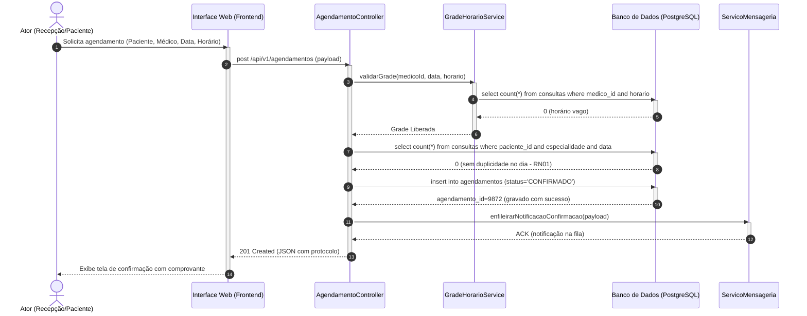

---

## Como testar e validar

A validação de artefatos de Engenharia de Requisitos difere da execução de testes unitários de código; ela foca na garantia da qualidade intrínseca do documento, verificação de conformidade lógica e alinhamento com as partes interessadas.

### 1. Métodos de inspeção formal e revisão por pares
- **Inspeção de Fagan:** Conduzir reuniões formais de leitura guiada do documento com a equipe. Três papéis são atribuídos:
  - *Autor:* Apresenta as justificativas dos casos de uso modelados.
  - *Inspetor (Analista/QA):* Busca ativamente inconsistências léxicas, regras de negócio contraditórias e ambiguidades nos passos dos fluxos.
  - *Moderador:* Assegura que a revisão cubra todas as páginas sem desvios de foco.

### 2. Matriz de Rastreabilidade de Requisitos (RTM)
A validação técnica exige que cada Requisito Funcional (RF) possua pelo menos um Caso de Uso (CSU) associado e um Caso de Teste (CT) correspondente:

| ID Requisito | Descrição Sintética | Caso de Uso Associado | Caso de Teste Proposto |
| :--- | :--- | :--- | :--- |
| **RF01** | Cadastrar Paciente | CSU_G01 (Manter Pacientes) | CT01 — Inserção de CPF válido e bloqueio de CPF duplicado. |
| **RF02** | Agendar Consulta | CSU01 (Agendar Consulta) | CT02 — Agendamento em vaga livre com emissão de protocolo. |
| **RF03** | Cancelar Agendamento | CSU03 (Cancelar Agendamento) | CT03 — Desmarcação com >24h (estorno total) e <24h (retenção 30%). |
| **RF04** | Validar Grade Horária | CSU01 (`<<include>>` Validar) | CT04 — Concorrência simulada: 2 requisições para a mesma vaga. |
| **RF05** | Prontuário Eletrônico | CSU02 (Registrar Atendimento) | CT05 — Gravação de anamnese e teste de bloqueio de edição pós-assinatura. |

### 3. Técnica de derivação de casos de teste a partir de fluxos de casos de uso
Para cada especificação textual de caso de uso:
- **Cenário de Teste Positivo:** Gerado diretamente a partir do **Fluxo Principal**. Verifica se o sistema atinge a pós-condição de sucesso sob dados estritamente válidos.
- **Cenários de Teste Alternativos:** Derivados de cada **Fluxo Alternativo** (ex.: teste de convênio aprovado, teste de paciente com desconto por retorno).
- **Cenários de Teste Negativos/Borda:** Derivados dos **Fluxos de Exceção** (ex.: tentar agendar para o passado, tentar cancelar consulta concluída, provocar desconexão de banco durante a gravação).

---

## Critérios de qualidade

Para obter a pontuação máxima no trabalho, o documento produzido deve respeitar os atributos formais de qualidade especificados pelas normas internacionais **ISO/IEC/IEEE 29148:2018** (Engenharia de Requisitos) e **OMG Unified Modeling Language (UML)**:

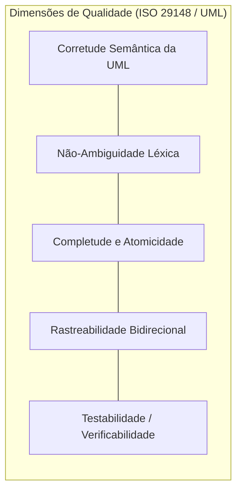

1. **Corretude Sintática e Semântica da UML:**
   - As setas de `<<include>>` devem obrigatoriamente apontar do caso de uso base para o caso de uso incluído.
   - As setas de `<<extend>>` devem obrigatoriamente apontar do caso de uso extensor para o caso de uso base.
   - Nomes de casos de uso devem começar rigorosamente com um verbo transitivo no infinitivo seguido de substantivo indicador do objeto da ação (ex.: "Registrar Atendimento", e nunca "Prontuário" ou "Botão Salvar").
   - Atores devem representar papéis com relação ao sistema e posicionar-se fora da fronteira do retângulo do sistema.
2. **Não-Ambiguidade:**
   - Proibição absoluta de adjetivos vagos como "rápido", "adequado", "amigável", "moderno" ou "eficiente". Todo requisito deve expressar uma quantidade mensurável ou um comportamento booleano observável.
3. **Completude dos Fluxos:**
   - Casos de uso documentados devem obrigatoriamente possuir no mínimo um fluxo principal, pelo menos um fluxo alternativo e um ou mais fluxos de exceção. Casos de uso com apenas fluxo principal revelam análise ingênua e superficial.
4. **Isolamento de Regras de Negócio:**
   - As políticas e cálculos do negócio não devem ser diluídos no meio do texto dos passos procedimentais sem identificação; devem ser mapeadas em uma tabela de regras de negócio (`RNxx`) e referenciadas formalmente pelos passos.
5. **Apresentação e Formatação Editorial:**
   - Documento perfeitamente paginado no Word ou Google Docs, com cabeçalhos padronizados, fontes sóbrias (Arial, Calibri ou Times New Roman 11/12), entrelinha 1,5, sumário gerado automaticamente via estilos de título e diagramas em alta resolução com legendas legíveis.

---

## Arquivos de apoio

Para a confecção final e submissão no Google Classroom, os alunos devem consultar os seguintes artefatos de apoio e referências normativas:

- **Template de Estruturação do Trabalho Semestral (Word/Docs):**
  - *Capa Padronizada:* Instituição (Centro Universitário UniFEF), Curso (Sistemas de Informação), Disciplina (Engenharia de Software II), Professor (Prof. Wesley Soares), Título do Projeto, Integrantes com RA e Data.
  - *Sumário Dinâmico:* Utilização dos estilos "Título 1", "Título 2" e "Título 3" do Word/Docs para gerar a navegação automática.
  - *Organização das Seções:* Seguir rigorosamente a ordem: Introdução -> Levantamento de Requisitos (RF, RNF, RN) -> Priorização MoSCoW -> Diagrama de Casos de Uso Geral -> Diagrama de Casos de Uso Específico -> Especificações Textuais dos Casos de Uso -> Matriz de Rastreabilidade -> Conclusão.
- **Ferramentas de Diagramação Recomendadas:**
  - [Mermaid Live Editor](https://mermaid.live/) (para exportação dos diagramas em SVG/PNG de alta fidelidade para colagem no Word).
  - Visual Paradigm, Astah Community ou Draw.io (caso optem por editores visuais convencionais de diagramas de caso de uso UML).
- **Normas Técnicas de Referência:**
  - Padrão IEEE 830-1998 / ISO/IEC/IEEE 29148:2018 — *Systems and software engineering — Life cycle processes — Requirements engineering*.
  - Especificação OMG UML 2.5.1 — *Unified Modeling Language Superstructure Specification*.

---

## Mapa da atividade

O mapa mental a seguir sintetiza todos os blocos de conhecimento e produtos práticos exigidos na entrega do trabalho semestral:

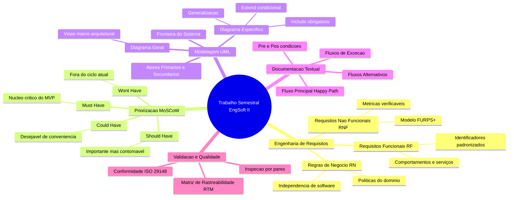

---

## Glossário

| Termo Técnico | Definição no Contexto de Engenharia de Software |
| :--- | :--- |
| **Ator Primário** | O interveniente externo que inicia ativamente uma interação com o sistema para atingir uma meta de negócio mensurável. |
| **Ator Secundário** | O participante externo que interage com o sistema para fornecer serviços auxiliares, dados de suporte ou receber saídas transacionais. |
| **Caso de Uso (Use Case)** | Especificação de uma sequência de ações realizada por um sistema que produz um resultado observável de valor para um ator específico. |
| **Critério de Aceitação** | Condições contratuais e técnicas predefinidas que um software deve satisfazer para ser aceito pelo cliente ou colocado em produção. |
| **Elicitação de Requisitos** | Processo investigativo e colaborativo de descobrir, extrair e entender as necessidades dos usuários e *stakeholders*. |
| **Fluxo Alternativo** | Ramo secundário de execução de um caso de uso que atinge o objetivo com sucesso, mas por um caminho operacional diferente do fluxo principal. |
| **Fluxo de Exceção** | Sequência de passos acionada em caso de erro, inconsistência ou bloqueio de regra de negócio, resultando no término do caso de uso sem sucesso. |
| **Fluxo Principal (*Happy Path*)** | Caminho ideal de execução de um caso de uso, no qual tudo ocorre perfeitamente sem falhas, erros ou interrupções de fluxo. |
| **Fronteira do Sistema** | Delimitação conceitual que define formalmente o que está dentro do escopo do software versus o ambiente externo que com ele interage. |
| **FURPS+** | Modelo clássico de classificação de requisitos de qualidade: *Functionality, Usability, Reliability, Performance, Supportability* (+ restrições). |
| **Matriz MoSCoW** | Mecanismo analítico de governança de escopo que aloca demandas em *Must have*, *Should have*, *Could have* e *Won't have*. |
| **Matriz de Rastreabilidade (RTM)**| Tabela lógica que correlaciona requisitos de negócio aos seus respectivos casos de uso, artefatos de código e casos de teste. |
| **Pós-condição** | Estado e invariantes que o sistema deve obrigatoriamente manter e assumir após a conclusão da execução de um caso de uso. |
| **Pré-condição** | Conjunto de circunstâncias e estados que o sistema deve satisfazer obrigatoriamente antes que um caso de uso possa ser iniciado. |
| **Ponto de Extensão** | Local específico e nomeado dentro do fluxo de um caso de uso base onde um comportamento extensor (`<<extend>>`) pode ser inserido. |
| **Regra de Negócio (Business Rule)**| Declaração atômica sobre diretrizes, políticas ou restrições do negócio que orienta o comportamento corporativo independentemente de tecnologia. |
| **Relacionamento `<<extend>>`** | Relação na qual um caso de uso extensor insere opcionalmente seu comportamento em um caso de uso base sob condição específica. |
| **Relacionamento `<<include>>`** | Relação mandatória na qual um caso de uso base incorpora e depende explicitamente da execução de outro caso de uso reutilizável. |
| **Requisito Funcional (RF)** | Descrição explícita de um serviço, função, cálculo ou comportamento computacional que o software deve ser capaz de executar. |
| **Requisito Não-Funcional (RNF)** | Propriedade qualitativa, desempenho ou restrição arquitetural que qualifica o modo como o software executa suas funções. |

---

## Pontos-chave para a prova

Esta seção sintetiza os conceitos mais cobrados pelo Professor Wesley Soares em avaliações teóricas e práticas de Engenharia de Software II:

1. **A regra de ouro da diferença entre `<<include>>` e `<<extend>>`:**
   - `<<include>>` é **obrigatório**, **incondicional** e o caso de uso base **conhece e chama** o incluído. A seta aponta do Base para o Incluído (`Base ..> Incluído`).
   - `<<extend>>` é **opcional**, **condicional** e o caso de uso base **não sabe** que está sendo estendido (quem conhece a regra é o extensor). A seta aponta do Extensor para o Base (`Extensor ..> Base`).
2. **Requisito Funcional vs. Regra de Negócio:**
   - Se o cliente fechar o computador e o software for desligado, as Regras de Negócio continuam existindo no mundo real? Se sim, é **Regra de Negócio** (ex.: "A clínica só atende com agendamento prévio").
   - Se aquilo só faz sentido como um mecanismo operacional implementado dentro do sistema digital, é um **Requisito Funcional** (ex.: "O sistema deve enviar e-mail de alerta com link de redefinição de senha").
3. **Distribuição do MoSCoW para viabilidade de projetos:**
   - Em exames de certificação e concursos, considera-se falha grave de planejamento classificar quase tudo como *Must Have*. O limite recomendado da literatura para *Must Have* é de 60% do esforço estimado, reservando 20% para *Should* e 20% para *Could* para garantir amortecimento de cronograma.
4. **Armadilhas de modelagem de casos de uso em diagramas:**
   - **Nunca use setas bidirecionais** entre atores e casos de uso; utilize linhas contínuas simples sem ponta de seta (associação binária).
   - **Atores não se comunicam entre si** diretamente dentro do diagrama de casos de uso (proibido ligar Ator A a Ator B por associação direta, exceto por generalização).
   - **Casos de uso não interagem entre si por associação simples**; a comunicação entre casos de uso só ocorre estritamente via estereótipos `<<include>>`, `<<extend>>` ou por generalização de casos de uso.
   - **Banco de dados não é ator:** O banco de dados faz parte do sistema (está dentro da fronteira ou compõe a infraestrutura interna da solução). Um ator secundário só pode ser um sistema externo autônomo com o qual o nosso software troca mensagens (ex.: *Gateway* da Cielo, *Web Service* dos Correios, SERPRO).

---

## Perguntas e respostas (JSONL)

```jsonl
{"pergunta": "Qual é a diferença semântica fundamental entre os relacionamentos <<include>> e <<extend>> na modelagem de casos de uso UML?", "resposta": "O relacionamento <<include>> indica dependência obrigatória e incondicional onde o caso base executa e incorpora o caso incluído; o relacionamento <<extend>> indica um comportamento opcional e condicional disparado a partir de um ponto de extensão, sem que o caso base dependa dele.", "dificuldade": "facil"}
{"pergunta": "Em um diagrama de casos de uso UML, qual é a direção correta da seta pontilhada no relacionamento <<extend>>?", "resposta": "A seta pontilhada parte do caso de uso extensor (opcional) em direção ao caso de uso base estendido.", "dificuldade": "facil"}
{"pergunta": "Em um diagrama de casos de uso UML, qual é a direção correta da seta pontilhada no relacionamento <<include>>?", "resposta": "A seta pontilhada parte do caso de uso base em direção ao caso de uso incluído (reutilizável).", "dificuldade": "facil"}
{"pergunta": "Por que o banco de dados interno de uma aplicação nunca deve ser representado como um ator em um diagrama de casos de uso?", "resposta": "Porque o banco de dados interno é um componente que reside dentro dos limites do próprio sistema a ser construído; atores representam estritamente papéis e entidades externas que interagem com o sistema.", "dificuldade": "media"}
{"pergunta": "Como diferenciar com precisão um Requisito Funcional de uma Regra de Negócio?", "resposta": "A Regra de Negócio define políticas, restrições e diretrizes da organização que existem independentemente de software; o Requisito Funcional define o comportamento e a transformação computacional que o software executa para operacionalizar essa regra.", "dificuldade": "media"}
{"pergunta": "O que caracteriza o quadrante 'Must Have' na técnica de priorização de requisitos MoSCoW?", "resposta": "Requisitos obrigatórios e inegociáveis sem os quais o sistema é considerado inviável, ilegal ou tecnicamente inoperante, constituindo o núcleo vital do MVP.", "dificuldade": "facil"}
{"pergunta": "Qual risco de gestão de projetos ocorre quando uma equipe classifica mais de 80% dos requisitos como 'Must Have'?", "resposta": "Perda total de flexibilidade e capacidade de negociação de escopo diante de atrasos, gerando o risco de colapso do cronograma e incapacidade de entregar o software no prazo.", "dificuldade": "media"}
{"pergunta": "Quais são as três categorias de fluxos indispensáveis em uma especificação textual completa de caso de uso?", "resposta": "Fluxo Principal (Happy Path), Fluxos Alternativos e Fluxos de Exceção.", "dificuldade": "facil"}
{"pergunta": "O que são pré-condições em uma documentação textual de caso de uso?", "resposta": "Estados e condições mandatórias que o sistema deve satisfazer antes que a interação do caso de uso possa ser disparada pelo ator.", "dificuldade": "facil"}
{"pergunta": "O que define a pós-condição de sucesso de um caso de uso?", "resposta": "O estado em que o sistema e seus dados se encontram imediatamente após o término satisfatório de todas as etapas do fluxo principal ou alternativo.", "dificuldade": "facil"}
{"pergunta": "O que é um Ponto de Extensão (Extension Point) na UML?", "resposta": "Um marcador nomeado no fluxo do caso de uso base que referencia exatamente onde o comportamento do caso de uso extensor será acoplado caso a condição seja atendida.", "dificuldade": "dificil"}
{"pergunta": "Segundo o modelo FURPS+, quais atributos são classificados como Requisitos Não-Funcionais?", "resposta": "Usabilidade (Usability), Confiabilidade (Reliability), Desempenho (Performance) e Suportabilidade (Supportability), além de restrições de implementação e interface (+).", "dificuldade": "media"}
{"pergunta": "Por que a afirmação 'o sistema deve ser rápido' não é considerada um Requisito Não-Funcional válido na engenharia de software?", "resposta": "Porque é vaga, subjetiva e ambígua; um RNF deve possuir métricas quantitativas e mensuráveis objetivamente (ex.: tempo de resposta < 1.5s sob carga de 200 usuários).", "dificuldade": "facil"}
{"pergunta": "O que representa a 'Fronteira do Sistema' (System Boundary) em um diagrama de casos de uso?", "resposta": "Um retângulo conceitual que divide o escopo interno do software (casos de uso) do ambiente operacional externo (atores).", "dificuldade": "facil"}
{"pergunta": "O que significa generalização de atores em um diagrama de casos de uso UML?", "resposta": "Um relacionamento hierárquico no qual um ator especializado herda todas as associações e privilégios de interação de um ator generalista.", "dificuldade": "media"}
{"pergunta": "Qual é a finalidade principal de uma Matriz de Rastreabilidade de Requisitos (RTM)?", "resposta": "Assegurar que cada requisito elicitaado esteja vinculado formalmente a um caso de uso da arquitetura e a um caso de teste verificador, evitando requisitos órfãos.", "dificuldade": "media"}
{"pergunta": "Por que a decomposição funcional excessiva (ex.: criar casos de uso como 'Digitar Senha' ou 'Clicar em Salvar') é considerada um erro na modelagem UML?", "resposta": "Porque viola o princípio de que um caso de uso deve representar uma unidade completa e transacional de valor perceptível para o ator, transformando o diagrama em um fluxograma de código.", "dificuldade": "dificil"}
{"pergunta": "O que é o quadrante 'Won't Have' no MoSCoW e qual a sua utilidade prática?", "resposta": "Categoria de requisitos expressamente acordados entre stakeholders como fora do escopo do ciclo atual, evitando o crescimento descontrolado do projeto (scope creep).", "dificuldade": "facil"}
{"pergunta": "Como se justifica a existência de um Diagrama de Casos de Uso Geral além dos Diagramas Específicos?", "resposta": "O diagrama geral oferece a visão arquitetural panorâmica para partes interessadas e executivos, enquanto o específico aprofunda relacionamentos internos para a equipe técnica.", "dificuldade": "media"}
{"pergunta": "Qual a consequência direta, segundo a regra de Boehm, de falhas não detectadas na etapa de Engenharia de Requisitos?", "resposta": "O custo de correção do defeito cresce exponencialmente nas fases posteriores, podendo custar até 100 vezes mais se corrigido após a entrada em produção.", "dificuldade": "dificil"}
```

---

## Checklist de revisão

Antes de converter o conteúdo para o Word ou Google Docs e realizar a submissão definitiva no Google Classroom, certifique-se de que todos os itens abaixo foram cumpridos:

- [ ] **Formato do documento:** O arquivo está estruturado no Word ou Google Docs com capa formal, identificação da UniFEF, curso, disciplina e membros da equipe com RA.
- [ ] **Estrutura de tópicos:** O sumário automático foi gerado e reflete com fidelidade todas as seções principais e secundárias do trabalho.
- [ ] **Levantamento de requisitos completo:**
  - [ ] Mínimo de 8 a 10 Requisitos Funcionais (RF) catalogados com ID, nome e descrição clara sem jargões de implementação.
  - [ ] Mínimo de 4 a 6 Requisitos Não-Funcionais (RNF) catalogados sob o padrão FURPS+ com métricas objetivas de mensuração.
  - [ ] Mínimo de 4 a 5 Regras de Negócio (RN) documentadas e diferenciadas claramente de requisitos computacionais.
- [ ] **Priorização MoSCoW:**
  - [ ] Todos os requisitos funcionais e não-funcionais foram distribuídos entre *Must*, *Should*, *Could* e *Won't*.
  - [ ] Uma tabela ou diagrama visual fundamenta as razões estratégicas de cada classificação, respeitando a proporção recomendada (MVP realista).
- [ ] **Diagrama de casos de uso geral:**
  - [ ] Contém a fronteira do sistema (*system boundary*) explicitamente desenhada.
  - [ ] Atores humanos e sistemas externos posicionados estritamente fora do retângulo da fronteira.
  - [ ] Casos de uso de alto nível nomeados com verbo no infinitivo + substantivo.
  - [ ] Ausência de ligações diretas entre atores ou uso inadequado de pontas de seta nas associações simples.
- [ ] **Diagrama de casos de uso específico:**
  - [ ] Foco em um subsistema ou módulo de negócio crítico e complexo.
  - [ ] Emprego semanticamente correto de relacionamentos `<<include>>` (seta partindo do base para a inclusão).
  - [ ] Emprego semanticamente correto de relacionamentos `<<extend>>` (seta partindo do extensor para o base).
  - [ ] Presença de relacionamento de herança/generalização entre atores ou entre casos de uso.
- [ ] **Documentação textual dos casos de uso:**
  - [ ] Pelo menos 2 a 3 casos de uso descritos em padrão exaustivo e rigoroso.
  - [ ] Presença de campos essenciais: Identificador, Nome, Atores, Breve Descrição, Pré-condições e Pós-condições (de sucesso e de falha).
  - [ ] Passos numerados e sequenciais no Fluxo Principal (*Happy Path*).
  - [ ] No mínimo 1 a 2 Fluxos Alternativos detalhados com identificação do ponto de ramificação.
  - [ ] No mínimo 1 a 2 Fluxos de Exceção mapeando tratamentos de erros e inconsistências de negócio.
  - [ ] Referência explícita aos IDs das Regras de Negócio (`RNxx`) e Requisitos Funcionais (`RFxx`) validados no fluxo.
- [ ] **Rastreabilidade e validação:**
  - [ ] Inclusão da Matriz de Rastreabilidade cruzando requisitos com casos de uso e cenários de teste.
  - [ ] Todos os diagramas inseridos no documento com resolução gráfica nítida, legendas descritivas e fontes legíveis.

## Código prático de apoio

Implementações em Java que tornam executáveis os conceitos desta unidade (compilar com `javac *.java`):

- [`AgendaService.java`](codigo/AgendaService.java)
- [`MedClinicDemo.java`](codigo/MedClinicDemo.java)
- [`Modelo.java`](codigo/Modelo.java)

