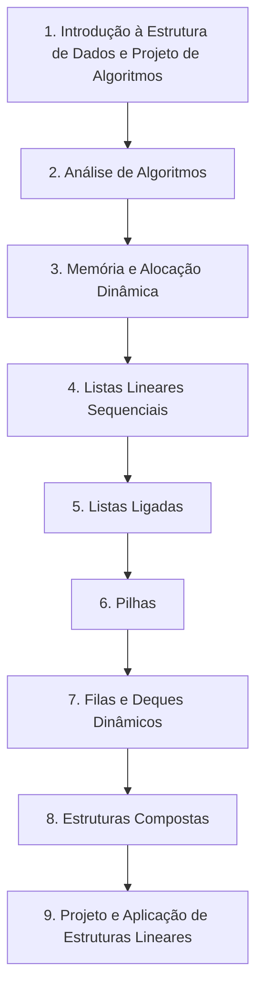
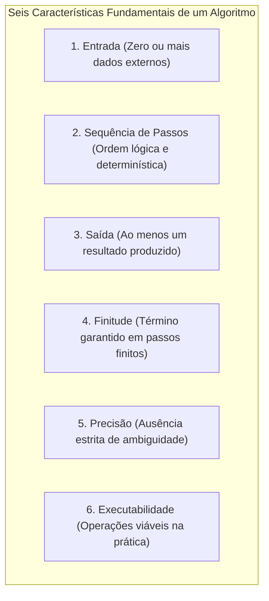
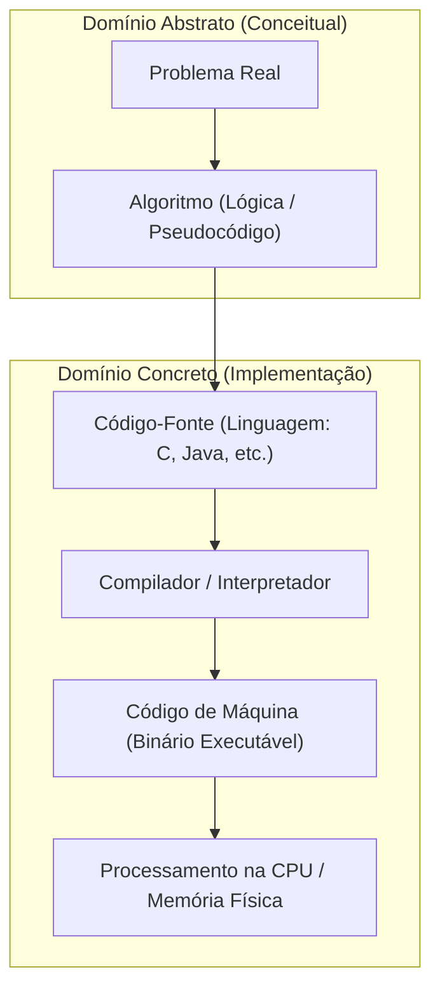
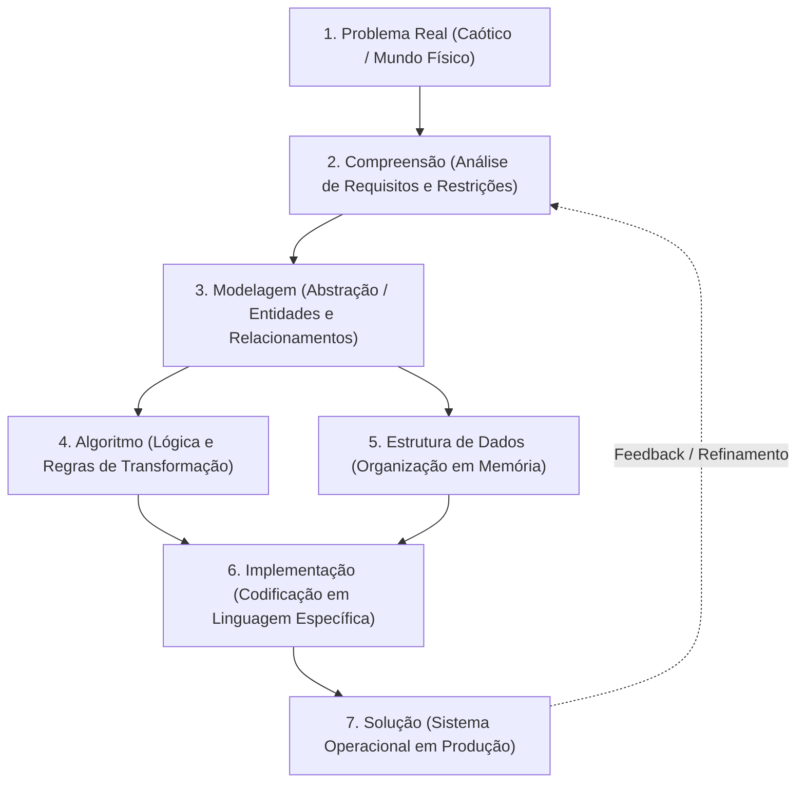
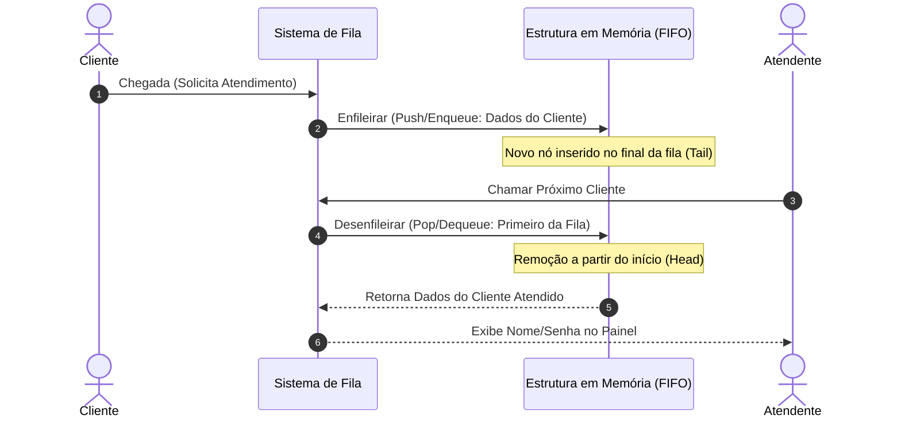
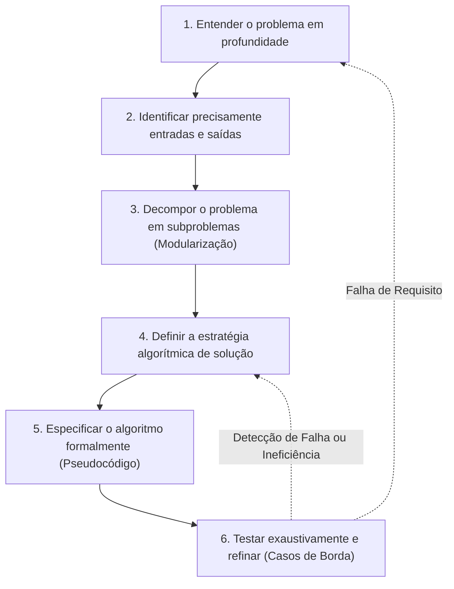
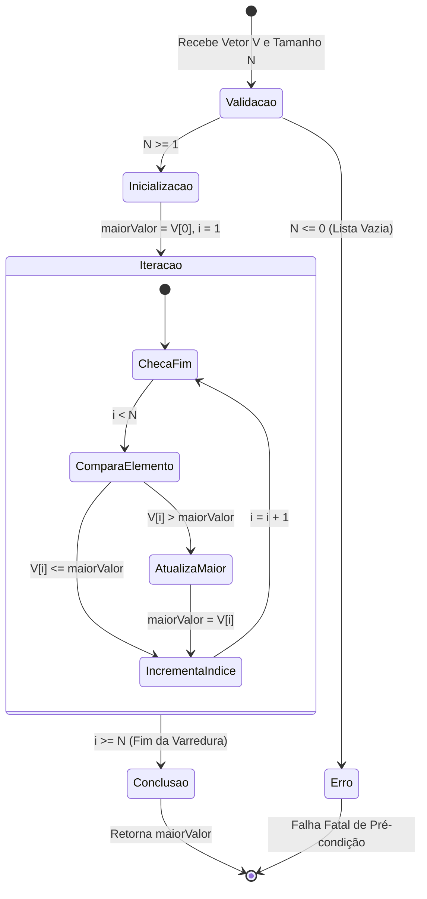
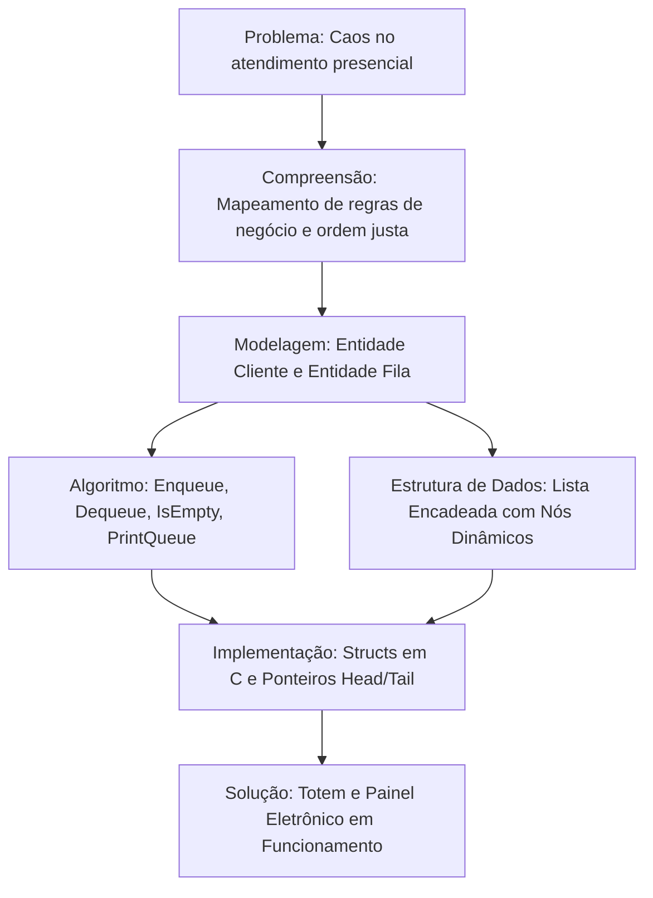
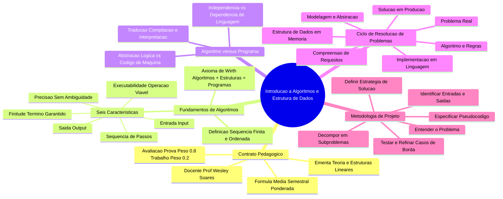

# Aula 01 — Introdução a Algoritmos e Estrutura de Dados

> **Professor:** Wesley Soares
> **Disciplina:** Estrutura de Dados I (4º Semestre)
> **Tema:** Fundamentos de algoritmos, ciclo de resolução de problemas, características operacionais e metodologia de projeto de algoritmos

---

## Sumário

- [Sumário](#sumario)
- [Objetivo da aula](#objetivo-da-aula)
- [Contexto e pré-requisitos](#contexto-e-pre-requisitos)
- [Ementa, conteúdo programático e critérios de avaliação da disciplina](#ementa-conteudo-programatico-e-criterios-de-avaliacao-da-disciplina)
  - [Perfil docente e visão da disciplina](#perfil-docente-e-visao-da-disciplina)
  - [Ementa oficial e trilha temática](#ementa-oficial-e-trilha-tematica)
  - [Critérios e métrica de avaliação](#criterios-e-metrica-de-avaliacao)
  - [Bibliografia oficial e leituras recomendadas](#bibliografia-oficial-e-leituras-recomendadas)
- [O que é um algoritmo e suas características](#o-que-e-um-algoritmo-e-suas-caracteristicas)
  - [Definição formal e semântica de algoritmo](#definicao-formal-e-semantica-de-algoritmo)
  - [As seis características fundamentais](#as-seis-caracteristicas-fundamentais)
  - [O princípio da organização: Algoritmos e Estruturas de Dados](#o-principio-da-organizacao-algoritmos-e-estruturas-de-dados)
- [Diferença entre algoritmo e programa](#diferenca-entre-algoritmo-e-programa)
  - [Abstração lógica versus materialização computacional](#abstracao-logica-versus-materializacao-computacional)
  - [Ciclo de vida: da concepção à execução física](#ciclo-de-vida-da-concepcao-a-execucao-fisica)
  - [Comparação prática e sintática](#comparacao-pratica-e-sintatica)
- [Do problema à solução: compreensão, modelagem, algoritmo, estrutura de dados, implementação](#do-problema-a-solucao-compreensao-modelagem-algoritmo-estrutura-de-dados-implementacao)
  - [O pipeline de engenharia de software](#o-pipeline-de-engenharia-de-software)
  - [Estudo de caso guiado: Fila de atendimento bancário](#estudo-de-caso-guiado-fila-de-atendimento-bancario)
- [Projeto de algoritmos: da formulação ao refinamento](#projeto-de-algoritmos-da-formulacao-ao-refinamento)
  - [As seis etapas sistemáticas de projeto](#as-seis-etapas-sistematicas-de-projeto)
  - [Estudo de caso guiado: Busca do maior elemento em uma lista](#estudo-de-caso-guiado-busca-do-maior-elemento-em-uma-lista)
  - [Análise de invariantes de laço e complexidade introdutória](#analise-de-invariantes-de-laco-e-complexidade-introdutoria)
- [Código da aula](#codigo-da-aula)
- [Exercícios](#exercicios)
  - [Exercício 1: Características de um algoritmo no cotidiano](#exercicio-1-caracteristicas-de-um-algoritmo-no-cotidiano)
  - [Exercício 2: Algoritmo versus programa na média aritmética](#exercicio-2-algoritmo-versus-programa-na-media-aritmetica)
  - [Exercício 3: Do problema à solução na gestão de atendimento](#exercicio-3-do-problema-a-solucao-na-gestao-de-atendimento)
  - [Exercício 4: Projeto sistemático para busca de valor extremo](#exercicio-4-projeto-sistematico-para-busca-de-valor-extremo)
- [Erros comuns e boas práticas](#erros-comuns-e-boas-praticas)
- [Links e materiais complementares](#links-e-materiais-complementares)
- [Mapa da aula](#mapa-da-aula)
- [Glossário](#glossario)
- [Pontos-chave para a prova](#pontos-chave-para-a-prova)
- [Perguntas e respostas (JSONL)](#perguntas-e-respostas-jsonl)
- [Checklist de revisão](#checklist-de-revisao)

---

## Objetivo da aula

- Compreender a abrangência, os objetivos formativos e o contrato pedagógico da disciplina de Estrutura de Dados I no 4º semestre do curso de Sistemas de Informação da UniFEF.
- Estabelecer a definição formal de algoritmo e dominar suas seis propriedades essenciais: entrada, sequência de passos, saída, finitude, precisão e executabilidade.
- Distinguir rigorosamente a solução algorítmica conceitual de sua materialização em um programa de computador dependente de compiladores, interpretadores e arquitetura física.
- Mapear e aplicar o ciclo completo de engenharia de transformação de demandas reais em sistemas computacionais: Problema, Compreensão, Modelagem, Algoritmo, Estrutura de Dados, Implementação e Solução.
- Executar metodicamente as seis etapas do projeto de algoritmos (entender, identificar I/O, decompor, definir estratégia, especificar e testar/refinar) com foco em correção lógica e casos de borda.

---

## Contexto e pré-requisitos

Esta aula inaugural estabelece o alicerce fundamental sobre o qual todo o conhecimento de estruturas de dados e análise de eficiência computacional será construído ao longo do semestre. No currículo de Sistemas de Informação da UniFEF, os estudantes chegam ao 4º semestre dominando a sintaxe básica de programação imperativa, operadores lógicos e aritméticos, estruturas de controle de fluxo condicional (`if/else`, `switch`) e estruturas de repetição (`while`, `for`).

O salto conceitual exigido a partir deste ponto deixa de ser "como fazer a sintaxe compilar" e passa a ser "como modelar o armazenamento e a manipulação de dados para que a solução seja matematicamente correta, escalável e eficiente em uso de tempo e memória". Para acompanhar esta transição, o estudante precisa revisitar conceitos de raciocínio lógico formal e manter postura analítica diante de problemas ambíguos.

---

## Ementa, conteúdo programático e critérios de avaliação da disciplina

### Perfil docente e visão da disciplina

A disciplina é conduzida pelo Prof. Ms. Wesley Soares de Souza, engenheiro de software sênior com mais de 15 anos de atuação no mercado de tecnologia da informação e docente do ensino superior desde 2014, com passagens pelo Grupo Kroton (Anhanguera), FATEC Jales e IFSP Votuporanga. O professor é graduado em Sistemas de Informação pela FEF (UniFEF), especialista em Gestão de Banco de Dados e mestre em Engenharia de Software pela Universidade Federal do Pampa (UNIPAMPA - RS). 

Essa trajetória estabelece a linha mestra da matéria: o rigor conceitual acadêmico aliado às práticas reais de engenharia de software da indústria, onde o desperdício de memória e o processamento ineficiente geram custos financeiros diretos e instabilidade em sistemas de produção.

### Ementa oficial e trilha temática

A ementa oficial aprovada pelo colegiado de curso estrutura-se em dois grandes blocos articulados:

1. **Fundamentos e Teoria Base**: Fundamentos de projeto e análise de algoritmos, tipos abstratos de dados (TAD), complexidade computacional, organização da arquitetura de memória e alocação dinâmica de memória.
2. **Estruturas Lineares e Aplicação Prática**: Estudo, implementação e análise de estruturas de dados lineares, incluindo listas sequenciais e ligadas, listas circulares, pilhas, filas, deques e estruturas compostas, com aplicação de técnicas modernas de desenvolvimento e avaliação de desempenho de algoritmos.

O conteúdo programático é distribuído em nove unidades sequenciais que partem do nível conceitual até a aplicação avançada de estruturas lineares:



### Critérios e métrica de avaliação

O sistema de avaliação do aprendizado é semestral e composto por dois módulos avaliativos principais (Módulo 1 e Módulo 2), resultando em duas notas parciais denominadas Avaliação 1 (composta por $AV_1$ e $T_1$) e Avaliação 2 (composta por $AV_2$ e $T_2$):

- **Avaliação 1 ($AV_1$ e $T_1$)**: Uma prova individual sem consulta ($AV_1$) valendo de 0 a 10 pontos com peso 0,8 (contribuição máxima de 8,0 pontos), somada a um trabalho prático ($T_1$) valendo de 0 a 10 pontos com peso 0,2 (contribuição máxima de 2,0 pontos).
- **Avaliação 2 ($AV_2$ e $T_2$)**: Uma prova individual sem consulta ($AV_2$) valendo de 0 a 10 pontos com peso 0,8 (contribuição máxima de 8,0 pontos), somada a um trabalho prático ($T_2$) valendo de 0 a 10 pontos com peso 0,2 (contribuição máxima de 2,0 pontos).

A média semestral final ($MS$) é regida pela fórmula canônica apresentada em aula:

$$MS = \frac{[(AV_1 \times 0.8) + (T_1 \times 0.2)] + [(AV_2 \times 0.8) + (T_2 \times 0.2)]}{2}$$

| Componente | Descrição | Escala | Peso Relativo no Módulo | Contribuição na Nota do Módulo |
| :--- | :--- | :--- | :--- | :--- |
| **Trabalho 1 ($T_1$)** | Projeto prático / exercícios aplicados | 0,0 a 10,0 | 20% (0,2) | Até 2,0 pontos |
| **Prova 1 ($AV_1$)** | Avaliação teórica e escrita de código | 0,0 a 10,0 | 80% (0,8) | Até 8,0 pontos |
| **Trabalho 2 ($T_2$)** | Implementação de estruturas avançadas | 0,0 a 10,0 | 20% (0,2) | Até 2,0 pontos |
| **Prova 2 ($AV_2$)** | Avaliação formal integradora | 0,0 a 10,0 | 80% (0,8) | Até 8,0 pontos |

### Bibliografia oficial e leituras recomendadas

O plano de ensino registra obras clássicas da computação dedicadas à arquitetura e organização de computadores, além de manuais fundamentais de estruturas de dados e desenvolvimento de software:

#### Bibliografia básica registrada
- MONTEIRO, Mário A. *Introdução à Organização de Computadores*. 4. ed. Rio de Janeiro: LTC, 2002.
- STALLINGS, William. *Arquitetura e Organização de Computadores*. 8. ed. São Paulo: Pearson, 2010.
- TANENBAUM, Andrew S. *Organização Estruturada de Computadores*. 3. ed. São Paulo: Prentice-Hall do Brasil, 1990.

#### Bibliografia complementar registrada
- IDOETA, Ivan Valeije; CAPUANO, Francisco Gabriel. *Elementos de Eletrônica Digital*. 32. ed. São Paulo: Érica, 2001.
- PATTERSON, David A.; HENNESSY, John L. *Organização e Projeto de Computadores*. 2. ed. Rio de Janeiro: LTC, 1998.
- WEBER, Raul Fernando. *Arquitetura de Computadores Pessoais*. 2. ed. Porto Alegre: Sagra, 2001.
- WEBER, Raul Fernando. *Fundamentos de Arquitetura de Computadores*. Série Livros Didáticos Informática UFRGS, Vol. 8, 4. ed. Porto Alegre: Bookman, 2012.

> **Nota de complementação pedagógica:** Embora a bibliografia primariamente registrada pelo programa curricular enfatize a camada de hardware e organização da máquina — indispensável para compreender alocação dinâmica, ponteiros, pilha de execução (*stack*) e memória dinâmica (*heap*) —, recomenda-se o acompanhamento complementar das obras canônicas de algoritmos: *Projeto de Algoritmos com Implementações em Pascal e C* (Nivio Ziviani) e *Algoritmos: Teoria e Prática* (Thomas H. Cormen et al.).

---

## O que é um algoritmo e suas características

### Definição formal e semântica de algoritmo

Um **algoritmo** é formalmente definido como uma sequência finita, ordenada e não ambígua de instruções computacionais bem definidas, a qual, a partir de um estado inicial e de um conjunto de dados de entrada (que pode ser vazio), conduz a execução por estados sucessivos bem delimitados até atingir um estado final previsível, gerando uma saída correspondente e satisfatória para uma classe específica de problemas.

O termo tem raiz histórica no nome do matemático persa do século IX, Abu Abdullah Muhammad ibn Musa al-Khwarizmi, cujos tratados sobre numeração decimal e manipulação de equações estabeleceram as regras sistemáticas de computação algébrica passo a passo. No contexto da computação moderna, um algoritmo é a formulação da lógica pura que soluciona um determinado desafio independentemente de qualquer eletrônica ou linguagem que venha a processá-lo.

### As seis características fundamentais

Para que uma sequência de passos seja legitimamente classificada como um algoritmo em ciência da computação, ela deve obrigatoriamente satisfazer seis propriedades canônicas estabelecidas na literatura clássica e expostas em sala de aula:



1. **Possui uma Entrada (*Input*)**: Um algoritmo recebe dados externos do mundo exterior sobre os quais irá operar. A quantidade de dados de entrada pode ser zero ou mais. Quando a entrada é vazia (zero), o algoritmo opera estritamente a partir de constantes pré-definidas em sua própria estrutura (por exemplo, um algoritmo para gerar e imprimir os dez primeiros números primos).
2. **Executa uma Sequência de Passos (*Sequence*)**: As operações não ocorrem em desordem caótica; há uma cronologia determinística de execução. Cada instrução possui uma relação de sucessão e dependência temporal em relação à instrução anterior.
3. **Produz uma Saída (*Output*)**: Todo algoritmo existe em função de entregar uma resposta útil ao final de seu ciclo de trabalho. Deve produzir obrigatoriamente ao menos uma saída que mantenha relação matemática ou lógica direta com os dados de entrada fornecidos.
4. **Deve ser Finito (*Finiteness*)**: Um algoritmo deve obrigatoriamente encerrar sua execução após o processamento de um número finito de passos. Procedimentos que entram em laços de repetição infinitos (*infinite loops*) sem condição de parada não são algoritmos; são processos computacionais divergentes ou com falha crítica de especificação.
5. **Deve ser Preciso (*Definiteness / Unambiguity*)**: Cada instrução deve ser rigorosamente clara, sem espaço para interpretação dúbia ou subjetiva. As instruções devem ser formalizáveis mecanicamente. Uma instrução como *"adicione um punhado de sal"* ou *"aguarde alguns minutos"* falha categoricamente no critério de precisão.
6. **Deve ser Executável (*Effectiveness / Executability*)**: Cada operação individual do algoritmo precisa ser computacionalmente exequível, ou seja, realizável por um agente mecânico utilizando uma quantidade finita de tempo e recursos físicos reais. Por exemplo, uma instrução teórica que determine *"encontre a raiz exata deste número dividindo-o por zero"* ou *"calcule todas as casas decimais de $\pi$ antes do próximo passo"* viola o princípio da executabilidade.

| Característica | Descrição Técnica | Exemplo Válido | Contraexemplo (Violação) |
| :--- | :--- | :--- | :--- |
| **Entrada** | Dados fornecidos do domínio | Lista de $N$ inteiros | Algoritmo que tenta ler da memória um ponteiro não inicializado |
| **Sequência de Passos** | Fluxo causal ordenado de estados | 1º Lê; 2º Soma; 3º Escreve | Executar a impressão do total antes de computar as parcelas |
| **Saída** | Transformação perceptível do estado | O quociente da divisão | Procedimento que calcula um valor, não retorna nada e descarta a memória |
| **Finitude** | Critério de parada comprovável | `for (i = 0; i < N; i++)` | `while (true)` sem comando `break` ou alteração de sentinela |
| **Precisão** | Semântica estrita e unívoca | `atribuir soma = a + b` | "Adicione um pouco mais até ficar bom" |
| **Executabilidade** | Operações física e logicamente viáveis | `dividir numerador por denominador != 0` | "Calcule a divisão de $X$ por zero" |

### O princípio da organização: Algoritmos e Estruturas de Dados

Conforme destacado pelo professor Wesley Soares em aula:

> *"Um bom programa depende tanto de um bom algoritmo quanto da forma como os dados são organizados."*

Esta máxima sintetiza o clássico axioma do cientista da computação suíço Niklaus Wirth, criador da linguagem Pascal, expressa em seu influente livro de 1976:

$$\text{Algoritmos} + \text{Estruturas de Dados} = \text{Programas}$$

A concepção desse axioma demonstra que a lógica procedural pura (o algoritmo) é impotente se os dados manipulados estiverem armazenados de forma caótica, inacessível ou inadequada à natureza das consultas. De maneira correspondente, a estrutura de dados mais refinada do mundo torna-se estéril sem um algoritmo eficiente capaz de percorrê-la, inserir, alterar e extrair elementos sem degradar o poder de processamento da CPU.

---

## Diferença entre algoritmo e programa

### Abstração lógica versus materialização computacional

Uma das confusões mais recorrentes entre ingressantes de tecnologia é a presunção de que programar é sinônimo direto de criar algoritmos. Um algoritmo é uma entidade conceitual abstrata e platônica; um programa é um artefato de engenharia concreto e executável.

O algoritmo habita o mundo das ideias matemáticas: ele pode ser rascunhado com lápis em um guardanapo de papel, descrito formalmente em língua portuguesa por meio de pseudocódigo, modelado graficamente através de diagramas de atividades ou simplesmente estruturado na mente do engenheiro. Ele independe da existência de semicondutores, sistemas operacionais ou memórias RAM.

O programa, por outro lado, é a codificação estrita dessa lógica utilizando a sintaxe, os tipos primitivos e a gramática formal de uma linguagem de programação específica (como C, C++, Java, Rust ou Python), concebido para ser submetido a um compilador ou interpretador a fim de que seja traduzido em código de máquina e processado pelos registradores de um processador real.



### Ciclo de vida: da concepção à execução física

Para que uma solução algorítmica se converta em utilidade operacional, ela atravessa barreiras sucessivas de abstração. No nível do algoritmo, lidamos com conceitos puros: *conjunto de números*, *variável de valor acumulado*, *troca de elementos*. 

No nível do programa, surgem preocupações materiais inevitáveis: *capacidade de representação de um inteiro de 32 bits*, *tamanho do barramento*, *estouro de capacidade de pilha (stack overflow)*, *alocação dinâmica de ponteiros sem vazamento de memória (memory leak)*, *tratamento de exceções de entrada e saída* e *compatibilidade entre sistemas operacionais*.

| Critério de Comparação | Algoritmo | Programa |
| :--- | :--- | :--- |
| **Natureza Ontológica** | Solução conceitual e matemática | Implementação material e de engenharia |
| **Acoplamento Tecnológico** | Totalmente independente de linguagem | Estritamente dependente de linguagem e compilador |
| **Propósito Imediato** | Descrever a lógica correta da solução | Executar a lógica em uma máquina real |
| **Formas de Representação** | Pseudocódigo, fluxogramas, linguagem natural | Arquivos de código-fonte (`.c`, `.java`, `.py`), binários |
| **Tolerância a Imprecisões** | Requer precisão lógica, mas não sintática | Intolerante a erros sintáticos; quebra na compilação |
| **Ambiente de Execução** | O cérebro humano ou modelos formais (Turing) | Sistemas operacionais, CPUs, memória semicondutora |

### Comparação prática e sintática

Para ilustrar a cisão entre algoritmo e programa, observemos a solução para a determinação da média aritmética simples de três notas escolares.

#### Representação em Algoritmo (Pseudocódigo Estruturado)
```text
Algoritmo CalcularMediaTresNotas
Entrada:
    nota1, nota2, nota3 : números reais
Saída:
    media : número real
Início
    Ler(nota1)
    Ler(nota2)
    Ler(nota3)
    soma <- nota1 + nota2 + nota3
    media <- soma / 3.0
    Escrever("A média calculada é: ", media)
Fim
```

#### Representação em Programa (Linguagem C — Paradigma Estruturado)
```c
#include <stdio.h>

int main(void) {
    // Alocação explícita de variáveis em memória (Stack)
    float nota1 = 0.0f;
    float nota2 = 0.0f;
    float nota3 = 0.0f;
    float soma = 0.0f;
    float media = 0.0f;

    // Entrada de dados sujeita à validação de I/O da arquitetura
    printf("Digite a primeira nota: ");
    if (scanf("%f", &nota1) != 1) return 1;

    printf("Digite a segunda nota: ");
    if (scanf("%f", &nota2) != 1) return 1;

    printf("Digite a terceira nota: ");
    if (scanf("%f", &nota3) != 1) return 1;

    // Processamento e conversão de ponto flutuante via ULA
    soma = nota1 + nota2 + nota3;
    media = soma / 3.0f;

    // Saída formatada no terminal
    printf("A media calculada e: %.2f\n", media);

    return 0; // Código de saída para o Sistema Operacional
}
```

#### Representação em Programa (Linguagem Python — Alto Nível)
```python
import sys

def main() -> None:
    try:
        # Entrada e conversão dinâmica de tipos
        nota1: float = float(input("Digite a primeira nota: "))
        nota2: float = float(input("Digite a segunda nota: "))
        nota3: float = float(input("Digite a terceira nota: "))
        
        # Computação do resultado
        media: float = (nota1 + nota2 + nota3) / 3.0
        
        # Saída via stream padrão com interpolação de strings
        print(f"A média calculada é: {media:.2f}")
    except ValueError:
        print("Erro: Entrada inválida. Forneça números reais.", file=sys.stderr)
        sys.exit(1)

if __name__ == "__main__":
    main()
```

O algoritmo conceitual permanece idêntico em todas as abordagens: capturar três valores, totalizá-los e dividir pela constante 3. Já os programas em C e Python exigem a declaração de tipos, importação de cabeçalhos de sistema (`stdio.h`, `sys`), controle de alocação de bytes e tratamento mecânico de erros de conversão.

---

## Do problema à solução: compreensão, modelagem, algoritmo, estrutura de dados, implementação

### O pipeline de engenharia de software

A resolução sistemática de problemas no âmbito da ciência da computação não se dá por intuição aleatória ou inserção impulsiva de código em uma IDE. Trata-se de um pipeline de engenharia de software rigoroso, composto por seis transformações ontológicas sucessivas:



1. **Problema**: O ponto de partida é uma necessidade prática, frequentemente ambígua, desestruturada e expressa na linguagem do negócio ou do cotidiano.
2. **Compreensão**: Fase investigativa na qual o engenheiro desconstrói o problema, identifica as restrições de contorno, elimina ambiguidades, determina casos excepcionais e mapeia exatamente o que deve ser computado.
3. **Modelagem**: Transposição do domínio do problema para o domínio matemático e computacional. Define quais entidades do mundo real precisam existir digitalmente e como elas se relacionam (conceito embrionário de Tipos Abstratos de Dados).
4. **Algoritmo**: Descrição unívoca e ordenada dos passos que alteram os estados das entidades modeladas, assegurando que o objetivo final seja alcançado.
5. **Estrutura de Dados**: Seleção deliberada de como as entidades e valores serão representados na memória física do computador (sequencial em vetores, nós dinamicamente encadeados por ponteiros, estruturas em árvore, tabelas de espalhamento).
6. **Implementação**: Ação de codificar o algoritmo e a estrutura de dados escolhida na sintaxe formal da linguagem selecionada, respeitando boas práticas, compilação, testes unitários e padrões de arquitetura.
7. **Solução**: O artefato de software final homologado, rodando de forma confiável e resolvendo a demanda original.

### Estudo de caso guiado: Fila de atendimento bancário

Para materializar o pipeline, analisemos o problema didático apresentado pelo professor Wesley Soares em aula: **o controle de uma fila de atendimento para uma agência de serviços**.



#### 1. Quais dados precisam ser armazenados?
Na fase de compreensão e modelagem, abstraímos o ser humano para uma estrutura de dados de registro. Para gerenciar o atendimento, não precisamos armazenar a altura ou a cor dos olhos do indivíduo, mas sim:
- `identificador` (inteiro: ID único sequencial);
- `nome` (texto: identificação visual);
- `senha` (alfanumérico: código do tíquete emitido);
- `tipoAtendimento` (enumerado: Convencional, Prioritário, Preferencial);
- `timestampChegada` (ponto temporal: hora/minuto de entrada no sistema).

#### 2. Em que ordem as pessoas serão atendidas?
A política de negócio clássica estabelece o princípio do **FIFO** (*First-In, First-Out* — o primeiro a entrar é estritamente o primeiro a ser atendido). Se Maria chegou às 09h01 e João chegou às 09h02, Maria deve obrigatoriamente ser despachada antes de João, garantindo o critério de justiça temporal do sistema. Caso haja categorias prioritárias, a modelagem evolui para múltiplas filas FIFO acopladas ou uma fila com prioridade (*Priority Queue*).

#### 3. Quais operações serão realizadas?
O Tipo Abstrato de Dados (TAD) da fila exige um conjunto mínimo de operações primitivas bem delimitadas:
- `inicializarFila()`: Cria e prepara a estrutura em memória.
- `enfileirar(cliente)`: Adiciona um novo registro ao final (*tail*) da fila.
- `desenfileirar()`: Remove e retorna o registro situado no início (*head*) da fila.
- `estaVazia()`: Retorna um predicado booleano indicando ausência de clientes.
- `tamanho()`: Computa a quantidade de pessoas aguardando atendimento.
- `consultarProximo()`: Inspeciona os dados do primeiro da fila sem removê-lo (*peek*).

#### 4. Como representar essa informação em memória?
A escolha da estrutura de dados impacta diretamente a performance e o consumo de hardware:
- **Abordagem Sequencial Estática (Vetor / Array)**: Aloca um bloco contíguo de memória para um número máximo prefixado de clientes (por exemplo, 100 posições). Vantagem: acesso direto via índice. Desvantagem: desperdício de espaço se a fila estiver vazia e falha de overflow se chegarem 101 pessoas.
- **Abordagem Encadeada Dinâmica (Lista Ligada)**: Cada cliente ocupa um nó alocado dinamicamente no *heap* no instante exato de sua chegada, contendo um ponteiro que referencia o próximo cliente na sequência. Vantagem: consumo de memória perfeitamente elástico. Desvantagem: consumo adicional de bytes para armazenar os ponteiros e ausência de contiguidade física na memória cache da CPU.

---

## Projeto de algoritmos: da formulação ao refinamento

### As seis etapas sistemáticas de projeto

O processo de transformar uma necessidade bruta em uma rotina computacional robusta exige o cumprimento metódico de seis passos de engenharia de algoritmos:



1. **Entender o problema**: Leitura analítica do enunciado, identificando as regras de negócio, as restrições implícitas e o que define matematicamente o estado de sucesso.
2. **Identificar entradas e saídas**: Especificar o domínio, a cardinalidade, a tipagem e os intervalos numéricos dos dados recebidos, assim como o formato e as garantias da saída esperada.
3. **Decompor o problema**: Aplicação do princípio fundamental da engenharia: divisão e conquista. Isolar a validação de entrada, o laço de iteração principal, as operações condicionais e a formatação final de resposta.
4. **Definir a estratégia de solução**: Escolher o paradigma algorítmico mais adequado para o cenário (força bruta, busca linear, recursão, programação dinâmica, estratégia gulosa).
5. **Especificar o algoritmo**: Estruturar a lógica por meio de pseudocódigo rigoroso, com variáveis descritivas e fluxo de controle claro.
6. **Testar e refinar**: Conduzir testes de mesa (*dry runs*) com dados ordinários, dados extremos (máximos e mínimos do tipo de dado), entradas nulas, duplicadas e negativas, refinando o código contra falhas silenciosas.

### Estudo de caso guiado: Busca do maior elemento em uma lista

Aplicando metodicamente o ciclo das seis etapas ao problema clássico introduzido em aula: **encontrar o maior valor contido em uma lista de números inteiros**.

#### Etapa 1: Entender o problema
O objetivo é inspecionar uma coleção finita de números inteiros desordenados e extrair dela o valor escalar que seja maior ou igual a todos os demais elementos do conjunto.

#### Etapa 2: Identificar entradas e saídas
- **Entrada**: Uma coleção (vetor) $V$ composta por $N$ números inteiros, onde $N \ge 1$, indexada de $0$ até $N - 1$.
- **Saída**: Um número inteiro $M$, tal que $\forall i \in [0, N-1], M \ge V[i]$.

#### Etapa 3: Decompor o problema
A decomposição divide a operação em quatro módulos sequenciais:
1. Validar se a lista possui elementos suficientes para processamento ($N > 0$).
2. Estabelecer um referencial inicial para comparação.
3. Varrer sistematicamente os elementos restantes da coleção comparando-os com o referencial corrente.
4. Atualizar o referencial sempre que um elemento estritamente maior for detectado e retornar o resultado final após a varredura integral.

#### Etapa 4: Definir a estratégia de solução
- **Pergunta: Precisamos percorrer todos os elementos?**
  *Sim*. Como a lista de entrada é expressamente desordenada, qualquer elemento não examinado pode ser potencialmente o maior valor do conjunto. Uma busca que ignore uma única posição não pode oferecer garantia formal de correção. A estratégia matemática necessária é a **busca linear exaustiva** ($O(N)$).
- **Pergunta: Como armazenar o maior valor encontrado?**
  Utiliza-se uma variável auxiliar na memória (por exemplo, `maiorValor`). 
  
  > **Armadilha Crítica de Engenharia:** Jamais inicialize a variável `maiorValor` com a constante zero (`0`). Se a coleção contiver exclusivamente números negativos (como $[-15, -42, -8, -99]$), o algoritmo reportará erroneamente que o maior número é $0$, um valor que sequer constava na lista de entrada. A única estratégia formalmente correta é inicializar `maiorValor` com o primeiro elemento válido da própria coleção: `maiorValor <- V[0]`.

#### Etapa 5: Especificar o algoritmo



```text
Algoritmo EncontrarMaiorNumero
Entradas:
    V : arranjo de números inteiros
    N : número inteiro (tamanho do arranjo V)
Saída:
    maiorValor : número inteiro
Pré-condição:
    N deve ser estritamente maior que zero (N > 0)
Variáveis:
    i : número inteiro
Início
    Se N <= 0 então
        DispararErro("Pré-condição violada: O vetor não pode ser vazio.")
    FimSe

    // Inicialização segura com o primeiro elemento do próprio conjunto
    maiorValor <- V[0]

    // Varredura a partir do segundo elemento (índice 1) até o fim (N - 1)
    Para i de 1 até N - 1 passo 1 faça
        Se V[i] > maiorValor então
            maiorValor <- V[i]
        FimSe
    FimPara

    Retornar maiorValor
Fim
```

#### Etapa 6: Testar e refinar
Submetemos a especificação a testes de mesa rigorosos para validar seu comportamento lógico diante de diferentes partições de equivalência.

##### Teste de Mesa 1: Caso Geral com Elementos Positivos Desordenados
- Entrada: $V = [12, 45, 7, 89, 23]$, $N = 5$

| Passo | Índice `i` | Elemento `V[i]` | Condição `V[i] > maiorValor` | Ação Realizada | Valor Corrente de `maiorValor` |
| :---: | :---: | :---: | :---: | :---: | :---: |
| Inicial | - | - | - | Atribuição `maiorValor <- V[0]` | 12 |
| 1 | 1 | 45 | $45 > 12$ (Verdadeiro) | Atualiza: `maiorValor <- 45` | 45 |
| 2 | 2 | 7 | $7 > 45$ (Falso) | Nenhuma alteração | 45 |
| 3 | 3 | 89 | $89 > 45$ (Verdadeiro) | Atualiza: `maiorValor <- 89` | 89 |
| 4 | 4 | 23 | $23 > 89$ (Falso) | Nenhuma alteração | 89 |
| Fim | 5 | - | $5 < 5$ (Falso: Fim de Laço) | Retorna `maiorValor` | **89** |

*Resultado*: 89 (Correto).

##### Teste de Mesa 2: Caso de Borda Crítico — Coleção Estritamente Negativa
- Entrada: $V = [-34, -12, -89, -5]$, $N = 4$

| Passo | Índice `i` | Elemento `V[i]` | Condição `V[i] > maiorValor` | Ação Realizada | Valor Corrente de `maiorValor` |
| :---: | :---: | :---: | :---: | :---: | :---: |
| Inicial | - | - | - | Atribuição `maiorValor <- V[0]` | -34 |
| 1 | 1 | -12 | $-12 > -34$ (Verdadeiro) | Atualiza: `maiorValor <- -12` | -12 |
| 2 | 2 | -89 | $-89 > -12$ (Falso) | Nenhuma alteração | -12 |
| 3 | 3 | -5 | $-5 > -12$ (Verdadeiro) | Atualiza: `maiorValor <- -5` | -5 |
| Fim | 4 | - | $4 < 4$ (Falso: Fim de Laço) | Retorna `maiorValor` | **-5** |

*Resultado*: -5 (Correto). Se `maiorValor` tivesse sido inicializado com zero, o algoritmo teria falhado catastroficamente ao retornar 0.

##### Teste de Mesa 3: Caso de Borda — Elementos Iguais e Repetidos
- Entrada: $V = [42, 42, 42]$, $N = 3$

| Passo | Índice `i` | Elemento `V[i]` | Condição `V[i] > maiorValor` | Ação Realizada | Valor Corrente de `maiorValor` |
| :---: | :---: | :---: | :---: | :---: | :---: |
| Inicial | - | - | - | Atribuição `maiorValor <- V[0]` | 42 |
| 1 | 1 | 42 | $42 > 42$ (Falso) | Nenhuma alteração | 42 |
| 2 | 2 | 42 | $42 > 42$ (Falso) | Nenhuma alteração | 42 |
| Fim | 3 | - | $3 < 3$ (Falso: Fim de Laço) | Retorna `maiorValor` | **42** |

*Resultado*: 42 (Correto).

### Análise de invariantes de laço e complexidade introdutória

A prova formal de correção matemática de algoritmos iterativos fundamenta-se no conceito de **Invariante de Laço**. Para o algoritmo de busca do maior número, a invariante pode ser enunciada da seguinte forma:

> *"No início de cada iteração do laço `Para`, indexado por `i`, a variável `maiorValor` armazena o maior elemento presente no subvetor $V[0 \dots i - 1]$."*

- **Inicialização**: Antes da primeira iteração ($i = 1$), o subvetor considerado é composto apenas pelo elemento $V[0]$. Como `maiorValor` foi inicializado exatamente com $V[0]$, a invariante é trivialmente verdadeira.
- **Manutenção**: Durante a iteração $i$, se $V[i] > maiorValor$, a variável é atualizada para $V[i]$, passando a representar o máximo de $V[0 \dots i]$. Caso contrário, o valor atual de `maiorValor` já é maior ou igual a $V[i]$, mantendo-se como o maior elemento de $V[0 \dots i]$. Ao avançar o contador para $i + 1$, a invariante se preserva para a próxima iteração.
- **Término**: O laço termina quando $i = N$. Pela invariante, a variável `maiorValor` contém o valor máximo presente no subvetor $V[0 \dots N - 1]$, que é a totalidade dos dados de entrada. Logo, o algoritmo é formalmente correto.

Quanto à complexidade de tempo, o algoritmo realiza exatamente $N - 1$ comparações no pior, no melhor e no caso médio, uma vez que a lista não é ordenada. Sua complexidade é linear:

$$T(N) = O(N)$$

O consumo de memória adicional decorre apenas das variáveis escalares auxiliares (`i` e `maiorValor`), caracterizando uma complexidade espacial constante:

$$S(N) = O(1)$$

---

## Código da aula

Sendo esta a primeira aula da disciplina, voltada aos fundamentos epistemológicos de algoritmos, apresentação de ementa e ciclo de modelagem, nenhum arquivo de código-fonte pré-existente foi distribuído no repositório. 

Entretanto, para solidificar a transição do pseudocódigo teórico para uma implementação de engenharia de software fiel à memória física, apresentamos a seguir o código canônico completo do algoritmo de busca de valor máximo implementado em Linguagem C (padrão C99/C11), amplamente utilizada para o estudo de alocação de memória e estruturas lineares.

```c
#include <stdio.h>
#include <stdlib.h>
#include <stdbool.h>

/**
 * @brief Localiza o maior elemento dentro de um arranjo de inteiros contíguo em memória.
 * 
 * @param vetor Ponteiro para o primeiro elemento do bloco contíguo na Stack ou Heap.
 * @param tamanho Quantidade de elementos válidos no arranjo.
 * @param erro Ponteiro para flag de erro; recebe 'true' se violar pré-condições, 'false' em sucesso.
 * @return int O maior valor numérico encontrado no arranjo.
 */
int encontrar_maior_elemento(const int *vetor, size_t tamanho, bool *erro) {
    // Validação estrita de pré-condições e segurança de ponteiros
    if (vetor == NULL || tamanho == 0) {
        if (erro != NULL) {
            *erro = true; // Sinaliza estado de falha para a rotina chamadora
        }
        return 0; // Valor de retorno indefinido devido ao erro
    }

    if (erro != NULL) {
        *erro = false; // Sinaliza execução regular
    }

    // Inicialização semântica: ancoragem no primeiro valor válido da coleção
    int maior_valor = vetor[0];

    // Varredura linear determinística de complexidade O(N)
    for (size_t i = 1; i < tamanho; ++i) {
        if (vetor[i] > maior_valor) {
            maior_valor = vetor[i];
        }
    }

    return maior_valor;
}

int main(void) {
    // Vetor com números mistos e repetidos
    int dados_teste_1[] = {15, -42, 89, 89, 0, -100, 23};
    size_t tamanho_1 = sizeof(dados_teste_1) / sizeof(dados_teste_1[0]);

    // Vetor com números exclusivamente negativos
    int dados_teste_2[] = {-50, -12, -99, -4, -25};
    size_t tamanho_2 = sizeof(dados_teste_2) / sizeof(dados_teste_2[0]);

    bool houve_erro = false;

    // Execução do Teste 1
    int resultado_1 = encontrar_maior_elemento(dados_teste_1, tamanho_1, &houve_erro);
    if (!houve_erro) {
        printf("[Teste 1] Maior elemento encontrado: %d (Esperado: 89)\n", resultado_1);
    } else {
        fprintf(stderr, "[Teste 1] Falha ao processar vetor invalido.\n");
    }

    // Execução do Teste 2
    int resultado_2 = encontrar_maior_elemento(dados_teste_2, tamanho_2, &houve_erro);
    if (!houve_erro) {
        printf("[Teste 2] Maior elemento encontrado: %d (Esperado: -4)\n", resultado_2);
    } else {
        fprintf(stderr, "[Teste 2] Falha ao processar vetor invalido.\n");
    }

    // Execução do Teste 3: Caso de borda - Coleção vazia
    int resultado_3 = encontrar_maior_elemento(NULL, 0, &houve_erro);
    if (houve_erro) {
        printf("[Teste 3] Erro detectado com sucesso: Colecao vazia rejeitada pelas pre-condicoes.\n");
    }

    return EXIT_SUCCESS;
}
```

### Análise linha a linha das decisões de implementação
- **Linhas 11-12 (`const int *vetor, size_t tamanho`)**: O vetor é recebido como um ponteiro constante (`const`), garantindo em tempo de compilação que a função é uma operação de consulta estrita que não sofrerá mutação acidental de dados. O tipo `size_t` garante a representação correta de tamanhos em bytes e índices na arquitetura nativa da CPU (32 ou 64 bits), impedindo índices negativos.
- **Linhas 14-23**: Tratamento defensivo de exceções de entrada. O algoritmo protege o sistema operacional contra falhas de segmentação (*segmentation fault*) causadas por referências nulas (`NULL`) e contra violações de invariantes com tamanhos nulos.
- **Linha 26 (`int maior_valor = vetor[0];`)**: Aplicação rigorosa da regra de ouro do projeto de algoritmos discutida em aula: nunca presumir valores numéricos fixos como sentinelas sem respaldo nos dados de entrada.
- **Linha 29 (`for (size_t i = 1; i < tamanho; ++i)`)**: A varredura inicia-se em $1$, e não em $0$. Como o elemento de índice zero já reside na variável de referência, comparar o elemento $0$ consigo mesmo consome um ciclo de processamento desnecessário na CPU.
- **Linhas 38-41 (`sizeof(...) / sizeof(...)`)**: Cálculo do número de elementos em memória estática através da divisão da ocupação total de bytes do arranjo pelo tamanho unitário de seu tipo primitivo de dados.

---

## Exercícios

### Exercício 1: Características de um algoritmo no cotidiano

#### Enunciado
Escolha uma tarefa do dia a dia (por exemplo, trocar um pneu de automóvel ou preparar um café expresso) e descreva-a rigorosamente sob a forma de um algoritmo, identificando com precisão técnica: a entrada, a sequência ordenada de passos e a saída. Em seguida, apresente a justificativa formal demonstrando por que o seu algoritmo atende cumulativamente aos critérios de finitude, precisão e executabilidade.

#### Raciocínio
A modelagem de um processo físico em formato algorítmico requer que decomponhamos ações humanas contínuas em estados discretos e bem delimitados. Escolheremos a operação de **preparo de café por infusão filtrada manual**. Devemos explicitar todos os recursos materiais como entradas, sequenciar os passos mecânicos respeitando a causalidade física, delimitar a saída útil e justificar as três propriedades formais de correção.

#### Resolução completa

```text
Algoritmo PrepararCafeFiltradoManual
Entradas:
    poCafe : massa em gramas (ex: 20g de pó de café com moagem média)
    aguaPotavel : volume em mililitros (ex: 300ml de água mineral)
    filtroPapel : unidade física (1 filtro de papel compatível)
    suporteFiltro : equipamento físico (1 porta-filtro limpo)
    recipienteFinal : equipamento físico (1 garrafa térmica ou xícara de 350ml)
    fonteCalor : equipamento gerador de energia térmica (chaleira elétrica ou fogão)
Saída:
    cafeBebidaPronta : volume líquido quente infundido no recipienteFinal (aprox. 270ml de café pronto)

Início
    // Passo 1: Preparação da infraestrutura
    Instalar filtroPapel dentro do suporteFiltro
    Posicionar suporteFiltro de forma estável sobre o recipienteFinal

    // Passo 2: Aquecimento do solvente (água)
    Depositar aguaPotavel dentro da chaleira
    Ativar fonteCalor sob a chaleira
    Enquanto temperatura da aguaPotavel < 92 graus Celsius faça
        Aguardar aquecimento contínuo
    FimEnquanto
    Desativar fonteCalor

    // Passo 3: Inserção do soluto
    Depositar poCafe uniformemente no fundo do filtroPapel

    // Passo 4: Hidratação e Extração (Infusão)
    Despejar 50ml de aguaPotavel quente sobre o poCafe em movimentos circulares
    Aguardar 30 segundos (fase de pré-infusão)
    Despejar os 250ml restantes de aguaPotavel de maneira contínua e uniforme
    
    // Passo 5: Separação física de fases
    Enquanto houver água visível no suporteFiltro faça
        Aguardar gotejamento por gravidade para o recipienteFinal
    FimEnquanto

    // Passo 6: Finalização e entrega
    Remover suporteFiltro com o filtroPapel e a borra residual
    Descartar resíduos sólidos em lixeira adequada
    Entregar recipienteFinal com cafeBebidaPronta
Fim
```

#### Justificativa formal das características
- **Finitude**: O algoritmo encerra garantidamente após um número finito de passos. As duas estruturas de repetição dependem de gradientes físicos decrescentes: a temperatura da água sobe monotonicamente até atingir o limiar de 92°C devido ao fornecimento constante de energia térmica, e o volume de água contido no filtro de 300ml esgota-se gravitacionalmente em tempo finito ($t < 4$ minutos). Não há recursão sem base nem condições de laço divergentes.
- **Precisão**: Todas as ações utilizam verbos imperativos unívocos associados a grandezas escalares rigorosamente mensuráveis ($20\text{ g}$, $300\text{ ml}$, $92^\circ\text{C}$, $30\text{ s}$). Não existem instruções abertas ou subjetivas como "coloque pó a gosto" ou "espere um tempinho".
- **Executabilidade**: Cada instrução unitária é passível de realização no mundo físico real com ferramentas e recursos domésticos acessíveis. Não há operações contraditórias, como exigir a dissolução instantânea sem solvente ou divisões térmicas impossíveis pelas leis da termodinâmica.

---

### Exercício 2: Algoritmo versus programa na média aritmética

#### Enunciado
Para o problema clássico de "calcular a média aritmética ponderada de três notas escolares de um aluno, com pesos 2, 3 e 5, informando se o aluno foi Aprovado (média $\ge 6.0$) ou Reprovado", elabore primeiramente a solução algorítmica em pseudocódigo estrito. Em seguida, implemente essa lógica integralmente em Linguagem C. Por fim, trace um paralelo analítico entre os dois artefatos, pontuando com suas palavras a fronteira exata entre a abstração conceitual e a implementação de software.

#### Raciocínio
A média ponderada requer a multiplicação de cada valor pelo seu respectivo peso, dividindo-se o acumulado pela soma dos pesos ($2 + 3 + 5 = 10$). O pseudocódigo foca puramente no cálculo das variáveis matemáticas e na bifurcação de decisão. A implementação em C lida com inclusão de bibliotecas, escopo de pilha, tipagem de ponto flutuante, precisão de impressão e códigos de encerramento do processo.

#### Resolução completa

##### 1. Algoritmo Conceitual (Pseudocódigo)
```text
Algoritmo MediaPonderadaEscolar
Entradas:
    N1, N2, N3 : números reais no intervalo [0.0, 10.0]
Saídas:
    mediaFinal : número real
    situacao : texto ("Aprovado" ou "Reprovado")
Constantes:
    PESO_1 = 2
    PESO_2 = 3
    PESO_3 = 5
    SOMA_PESOS = 10
Início
    Ler(N1, N2, N3)
    
    // Processamento matemático
    somaPonderada <- (N1 * PESO_1) + (N2 * PESO_2) + (N3 * PESO_3)
    mediaFinal <- somaPonderada / SOMA_PESOS
    
    // Estrutura de decisão lógica
    Se mediaFinal >= 6.0 então
        situacao <- "Aprovado"
    Senão
        situacao <- "Reprovado"
    FimSe
    
    Escrever("Média Final: ", mediaFinal)
    Escrever("Situação Acadêmica: ", situacao)
Fim
```

##### 2. Implementação Concreta (Linguagem C)
```c
#include <stdio.h>
#include <stdlib.h>

#define PESO_1 2.0f
#define PESO_2 3.0f
#define PESO_3 5.0f
#define SOMA_PESOS (PESO_1 + PESO_2 + PESO_3)
#define NOTA_MINIMA_APROVACAO 6.0f

int main(void) {
    float n1 = 0.0f;
    float n2 = 0.0f;
    float n3 = 0.0f;
    float media_final = 0.0f;

    // Leitura interativa com checagem de integridade de I/O
    printf("Informe a primeira nota [0.0 a 10.0]: ");
    if (scanf("%f", &n1) != 1 || n1 < 0.0f || n1 > 10.0f) {
        fprintf(stderr, "Erro de I/O: Valor de nota invalido fornecido.\n");
        return EXIT_FAILURE;
    }

    printf("Informe a segunda nota [0.0 a 10.0]: ");
    if (scanf("%f", &n2) != 1 || n2 < 0.0f || n2 > 10.0f) {
        fprintf(stderr, "Erro de I/O: Valor de nota invalido fornecido.\n");
        return EXIT_FAILURE;
    }

    printf("Informe a terceira nota [0.0 a 10.0]: ");
    if (scanf("%f", &n3) != 1 || n3 < 0.0f || n3 > 10.0f) {
        fprintf(stderr, "Erro de I/O: Valor de nota invalido fornecido.\n");
        return EXIT_FAILURE;
    }

    // Processamento escalar
    media_final = ((n1 * PESO_1) + (n2 * PESO_2) + (n3 * PESO_3)) / SOMA_PESOS;

    // Apresentação de resultados e controle condicional
    printf("Media Final Calculada: %.2f\n", media_final);
    if (media_final >= NOTA_MINIMA_APROVACAO) {
        printf("Situacao Academica: Aprovado\n");
    } else {
        printf("Situacao Academica: Reprovado\n");
    }

    return EXIT_SUCCESS;
}
```

##### 3. Paralelo Analítico e Diferenciação Conceitual
A fronteira entre o algoritmo conceitual e o programa em C reside no **nível de acoplamento material**. 
- O **algoritmo** é um modelo matemático invariante. Se este mesmo cálculo precisasse ser implementado daqui a cinquenta anos em um processador quântico ou em um chip com arquitetura desconhecida hoje, a fórmula de média ponderada e a condição de comparação booleana ($\ge 6.0$) permaneceriam exatamente iguais. O algoritmo não se preocupa com consumo de registradores, retorno de inteiros de término ao sistema operacional ou especificadores de formatação (`%.2f`).
- O **programa**, em contrapartida, é refém das restrições da máquina real. Em C, tivemos que definir a largura de representação numérica (`float`), tratar potenciais erros de leitura no buffer do teclado (`scanf`), delimitar o escopo da função `main`, gerenciar constantes através de diretivas de pré-processamento (`#define`) e retornar explicitamente uma constante de integridade de encerramento (`EXIT_SUCCESS`). O programa é a materialização do algoritmo traduzida para os dialetos eletrônicos da arquitetura Von Neumann.

---

### Exercício 3: Do problema à solução na gestão de atendimento

#### Enunciado
Retomando o problema da **fila de atendimento** apresentado em aula, responda detalhadamente:
1. Quais dados precisam ser armazenados?
2. Em que ordem as pessoas serão atendidas?
3. Quais operações serão realizadas sobre a fila?
4. Como você representaria essa informação em memória?
Justifique cada resposta relacionando-a explicitamente com as etapas do pipeline: **Problema -> Compreensão -> Modelagem -> Algoritmo -> Estrutura de Dados -> Implementação -> Solução**.

#### Raciocínio
Demonstraremos como uma dor real de gestão operacional (clientes desorganizados esperando atendimento em um espaço físico) é traduzida, passo a passo, em entidades abstratas, lógica de manipulação e escolhas de alocação de memória na pilha (*stack*) e monte (*heap*).

#### Resolução completa



##### 1. Dados a serem armazenados (Fase: Modelagem)
A entidade física "cliente" é modelada computacionalmente como uma estrutura de dados agregada (`struct Cliente`):
- `id` (inteiro longo de 64 bits): Identificador único global do atendimento.
- `nome` (vetor de caracteres de tamanho fixo ou alocado dinamicamente): Nome do cliente para chamada no display.
- `senha` (cadeia alfanumérica, ex: "PREF-042"): Código impresso no comprovante de emissão.
- `horarioChegada` (timestamp UNIX em segundos): Marcação de tempo para cálculo de tempo médio de espera e auditoria.

*Relação com o pipeline*: Pertence à fase de **Modelagem**, onde as propriedades irrelevantes do mundo real são descartadas via abstração e apenas os atributos necessários para resolver o problema são codificados.

##### 2. Ordem de atendimento (Fase: Compreensão e Regra de Negócio)
A política adotada é a estrita ordem cronológica de chegada: **FIFO** (*First-In, First-Out*). O cliente cuja transação foi registrada no tempo $t_0$ será chamado obrigatoriamente antes do cliente registrado em $t_1$, onde $t_0 < t_1$.

*Relação com o pipeline*: Vinculada à **Compreensão**. O engenheiro entende que desrespeitar essa política quebra a regra de negócio da agência, gerando conflitos interpessoais e ineficiência operacional.

##### 3. Operações realizadas sobre a fila (Fase: Algoritmo e TAD)
As operações correspondem ao contrato do Tipo Abstrato de Dados:
- `enfileirar(novoCliente)`: Insere o novo cliente no final da estrutura.
- `desenfileirar()`: Extrai e retorna o cliente posicionado no início, ajustando o ponteiro de início para o cliente subsequente.
- `estaVazia()`: Retorna um predicado booleano true/false para impedir desenfileiramentos em estruturas desprovidas de elementos (erro de *underflow*).
- `obterTamanho()`: Retorna o número de elementos esperando na fila.
- `consultarProximo()`: Permite ao operador visualizar quem será o próximo chamado sem retirá-lo da estrutura.

*Relação com o pipeline*: Vinculada à fase de **Algoritmo**. São as regras mecânicas que definem como o estado do sistema se altera a cada evento do mundo real (chegada de um cliente no totem ou disponibilidade de um atendente).

##### 4. Representação da informação em memória (Fase: Estrutura de Dados e Implementação)
A informação deve ser representada em memória primária através de uma **Lista Dinâmica Encadeada Simples com Descritor de Cabeça (*Head*) e Cauda (*Tail*)**:
- Cada cliente é encapsulado em um nó (`Node`) alocado individualmente na memória *Heap* através de chamadas a `malloc()`.
- Cada nó contém os dados do cliente e um ponteiro unívoco (`next`) que aponta para o endereço de memória do cliente posterior.
- A estrutura de controle mantém dois ponteiros auxiliares: `head` (apontando para o nó mais antigo a ser atendido) e `tail` (apontando para o nó inserido mais recentemente).

*Justificativa da escolha*: Em uma agência de atendimento, o fluxo diário oscila bruscamente. Modelar a fila com arranjos fixos (vetores sequenciais estáticos) causaria desperdício de memória RAM em horários de pouco movimento e quebras por estouro de capacidade (*overflow*) em picos de alta demanda. A lista encadeada dinâmica garante alocação elástica sob demanda com complexidade temporal constante $O(1)$ tanto para a inserção na cauda quanto para a remoção na cabeça.

---

### Exercício 4: Projeto sistemático para busca de valor extremo

#### Enunciado
Aplicando com rigor absoluto as **seis etapas do projeto de algoritmos** apresentadas na aula inaugural (Entender o problema, Identificar entradas e saídas, Decompor o problema, Definir a estratégia, Especificar o algoritmo e Testar/refinar), construa em pseudocódigo um algoritmo formal que identifique e retorne simultaneamente o **maior** e o **menor** número contidos em uma lista de inteiros arbitrária. Em seguida, demonstre formalmente a validação do seu algoritmo através de testes de mesa contendo:
1. Uma lista padrão com números positivos e desordenados.
2. Uma lista com números inteiros estritamente negativos.
3. Uma lista contendo números repetidos/duplicados.
Por fim, especifique o que o algoritmo deve fazer diante de uma lista vazia.

#### Raciocínio
A busca combinada de extremos exige a manutenção de dois acumuladores de referência: `maiorValor` e `menorValor`. Ambos devem ser ancorados no primeiro elemento válido da lista. A cada elemento visitado no laço subsequente, realizam-se as comparações pertinentes. O tratamento da lista vazia deve ocorrer no primeiro passo de validação através da imposição de uma pré-condição formal que dispare um sinal de erro, impedindo o acesso indevido a índices inexistentes de memória.

#### Resolução completa

##### Etapa 1: Entender o problema
O sistema precisa varrer uma sequência finita de $N$ números inteiros desordenados e encontrar, em um único ciclo de leitura, dois valores: o valor máximo global e o valor mínimo global contidos na coleção.

##### Etapa 2: Identificar entradas e saídas
- **Entrada**: 
  - $V$: Arranjo contíguo contendo números inteiros.
  - $N$: Número inteiro que indica a quantidade total de elementos em $V$.
- **Saídas**:
  - $M_{max}$: Valor inteiro tal que $M_{max} \ge V[i], \forall i \in [0, N-1]$.
  - $M_{min}$: Valor inteiro tal que $M_{min} \le V[i], \forall i \in [0, N-1]$.
- **Pré-condição mandatória**: $N \ge 1$ (a lista deve conter pelo menos um elemento válido).

##### Etapa 3: Decompor o problema
1. **Validador de Entrada**: Interromper a execução se $N < 1$.
2. **Inicializador de Referências**: Inicializar tanto `maiorValor` quanto `menorValor` com o conteúdo de $V[0]$.
3. **Iterador de Varredura**: Percorrer os índices de $1$ até $N-1$.
4. **Comparador Duplo**:
   - Se o elemento atual for maior que `maiorValor`, atualiza `maiorValor`.
   - Se o elemento atual for menor que `menorValor`, atualiza `menorValor`.
5. **Retorno de Estrutura**: Retornar o par ordenado $(M_{max}, M_{min})$.

##### Etapa 4: Definir a estratégia de solução
A estratégia ótima para uma lista desordenada é a busca linear exaustiva simultânea. A cada iteração sobre $V[i]$, compara-se o elemento com os referenciais correntes. Caso $V[i] > maiorValor$, não há necessidade matemática de testar se $V[i] < menorValor$ (a menos que a coleção tenha tamanho unitário inicial, o que já foi equalizado na inicialização), gerando uma economia de comparações com uma estrutura condicional encadeada (`Se ... Senão Se`).

##### Etapa 5: Especificar o algoritmo
```text
Algoritmo EncontrarExtremosMaxMin
Entradas:
    V : arranjo de números inteiros
    N : número inteiro (tamanho do arranjo V)
Saídas:
    maiorValor : número inteiro
    menorValor : número inteiro
Pré-condição:
    N > 0
Variáveis locais:
    i : número inteiro
Início
    // Passo de segurança: validação estrita de pré-condição
    Se N <= 0 então
        DispararErroFatal("Exceção: A coleção não possui elementos (N <= 0).")
    FimSe

    // Inicialização segura ancorada no primeiro elemento da coleção
    maiorValor <- V[0]
    menorValor <- V[0]

    // Varredura linear do índice 1 até N-1
    Para i de 1 até N - 1 passo 1 faça
        Se V[i] > maiorValor então
            maiorValor <- V[i]
        Senão
            Se V[i] < menorValor então
                menorValor <- V[i]
            FimSe
        FimSe
    FimPara

    Retornar (maiorValor, menorValor)
Fim
```

##### Etapa 6: Testar e refinar

###### Teste de Mesa 1: Lista Padrão Positiva Desordenada
- Entrada: $V = [18, 5, 42, 9, 31]$, $N = 5$

| Passo | Índice `i` | Elemento `V[i]` | Teste `V[i] > maior` | Teste `V[i] < menor` | Ação Realizada | Estado `(maior, menor)` |
| :---: | :---: | :---: | :---: | :---: | :---: | :---: |
| Inicial | - | - | - | - | Atribuição $V[0]$ | $(18, 18)$ |
| 1 | 1 | 5 | $5 > 18$ (F) | $5 < 18$ (V) | `menor <- 5` | $(18, 5)$ |
| 2 | 2 | 42 | $42 > 18$ (V) | Não executado | `maior <- 42` | $(42, 5)$ |
| 3 | 3 | 9 | $9 > 42$ (F) | $9 < 5$ (F) | Nenhuma | $(42, 5)$ |
| 4 | 4 | 31 | $31 > 42$ (F) | $31 < 5$ (F) | Nenhuma | $(42, 5)$ |
| Fim | 5 | - | $5 < 5$ (Falso) | - | Retorna tupla | **Maior: 42, Menor: 5** |

###### Teste de Mesa 2: Lista com Números Estritamente Negativos
- Entrada: $V = [-8, -25, -3, -14]$, $N = 4$

| Passo | Índice `i` | Elemento `V[i]` | Teste `V[i] > maior` | Teste `V[i] < menor` | Ação Realizada | Estado `(maior, menor)` |
| :---: | :---: | :---: | :---: | :---: | :---: | :---: |
| Inicial | - | - | - | - | Atribuição $V[0]$ | $(-8, -8)$ |
| 1 | 1 | -25 | $-25 > -8$ (F) | $-25 < -8$ (V) | `menor <- -25` | $(-8, -25)$ |
| 2 | 2 | -3 | $-3 > -8$ (V) | Não executado | `maior <- -3` | $(-3, -25)$ |
| 3 | 3 | -14 | $-14 > -3$ (F) | $-14 < -25$ (F) | Nenhuma | $(-3, -25)$ |
| Fim | 4 | - | $4 < 4$ (Falso) | - | Retorna tupla | **Maior: -3, Menor: -25** |

###### Teste de Mesa 3: Lista Contendo Elementos Duplicados e Repetidos
- Entrada: $V = [7, 15, 7, 15, 7]$, $N = 5$

| Passo | Índice `i` | Elemento `V[i]` | Teste `V[i] > maior` | Teste `V[i] < menor` | Ação Realizada | Estado `(maior, menor)` |
| :---: | :---: | :---: | :---: | :---: | :---: | :---: |
| Inicial | - | - | - | - | Atribuição $V[0]$ | $(7, 7)$ |
| 1 | 1 | 15 | $15 > 7$ (V) | Não executado | `maior <- 15` | $(15, 7)$ |
| 2 | 2 | 7 | $7 > 15$ (F) | $7 < 7$ (F) | Nenhuma | $(15, 7)$ |
| 3 | 3 | 15 | $15 > 15$ (F) | $15 < 7$ (F) | Nenhuma | $(15, 7)$ |
| 4 | 4 | 7 | $7 > 15$ (F) | $7 < 7$ (F) | Nenhuma | $(15, 7)$ |
| Fim | 5 | - | $5 < 5$ (Falso) | - | Retorna tupla | **Maior: 15, Menor: 7** |

###### Tratamento Formal para Lista Vazia
Diante de uma lista vazia ($N = 0$), o conceito matemático de "maior" ou "menor" elemento deixa de ter sentido semântico dentro do conjunto dos números inteiros. Um algoritmo de engenharia não deve retornar números arbitrários como zero ou lixo de memória residual. 

O algoritmo trata o caso explicitamente na linha 8 disparando uma **exceção fatal** de interrupção (em pseudocódigo: `DispararErroFatal`, que em C se traduz por sinalização via ponteiro de status, retorno de código de erro e emissão de log em `stderr`, ou lançamento de exceção em linguagens como Java e Python). Esta abordagem defensiva impede leituras de ponteiros inválidos e falhas de segmentação.

---

## Erros comuns e boas práticas

### Erros comuns detectados em avaliações

- **Inicialização Mágica de Variáveis com Zero**: O erro mais destrutivo em algoritmos de busca de extremos. Inicializar variáveis de controle com zero (`maior = 0` ou `menor = 0`) presume indevidamente que os dados do problema serão sempre positivos ou sempre negativos. A única inicialização matematicamente correta é usar o primeiro elemento válido da própria coleção ($V[0]$).
- **Violação da Finitude por Ausência de Passo de Convergência**: Construir estruturas de repetição (`while`) sem assegurar que as variáveis de controle se aproximem monotonicamente da condição de terminação, gerando loops infinitos que travam a CPU em 100% de uso.
- **Ambiguidade Textual em Pseudocódigo**: Escrever algoritmos com instruções subjetivas como *"pegar o próximo elemento relevante"* ou *"processar enquanto for razoável"*. Instruções devem ser estritamente mecânicas, traduzíveis diretamente para lógica booleana e atribuição de memória.
- **Confusão entre Fila (FIFO) e Pilha (LIFO)**: Inverter a semântica fundamental das estruturas lineares, desenfileirando do final da fila ou desempilhando da base da pilha. Fila remove o mais antigo; Pilha remove o mais recente.
- **Desconsideração de Casos de Borda (*Edge Cases*)**: Projetar algoritmos que funcionam perfeitamente para listas com 10 elementos positivos, mas sofrem colapso imediato ao receber listas unitárias ($N = 1$), listas estritamente negativas ou coleções vazias ($N = 0$).
- **Acesso Indevido Fora dos Limites de Memória (*Buffer Overflow*)**: Em coleções de tamanho $N$ indexadas de $0$ a $N-1$, iterar até o índice $N$ (`for (i = 0; i <= N; i++)`), lendo posições arbitrárias da memória física e corrompendo a estabilidade da aplicação.

### Boas práticas de engenharia de software

- **Estabelecer Pré e Pós-condições**: Documentar formalmente no cabeçalho de cada algoritmo o que ele exige para funcionar corretamente (pré-condições) e o que ele garante entregar ao final da execução (pós-condições).
- **Projetar Testes de Mesa Antes de Digitar Código**: Realizar o rastreamento manual com tabela de variáveis e testes de mesa antes de abrir a IDE e compilar o código. Isso economiza horas de depuração e sedimenta a lógica pura.
- **Nomenclatura Semântica Rigorosa**: Utilizar nomes de variáveis e funções que expressem claramente seu significado no domínio do problema (`indiceAtual`, `maiorValorEncontrado`, `clienteAguardandoAtendimento`) em vez de identificadores opacos e monossilábicos (`x`, `y`, `aux`, `temp2`).
- **Modularização e Princípio da Responsabilidade Única**: Dividir algoritmos complexos em procedimentos e funções menores e especializados, facilitando o reuso de código, o isolamento de erros e a manutenção evolutiva.
- **Programação Defensiva**: Validar rigorosamente todas as entradas do usuário ou de sistemas externos antes de submetê-las ao processamento do núcleo algorítmico.

---

## Links e materiais complementares

- **Visualgo (Visualising Data Structures and Algorithms Through Animation)**: Plataforma interativa internacional mantida pela Universidade Nacional de Singapura. Essencial para acompanhar graficamente o comportamento em memória de listas, pilhas e filas em tempo real.
- **GeeksforGeeks (Computer Science Portal - Data Structures)**: Repositório exaustivo de implementações teóricas e práticas em diversas linguagens, com ênfase em análise de complexidade assintótica de operações em estruturas lineares.
- **Repositório da Bibliografia Oficial de Arquitetura (Prof. Mário Monteiro / William Stallings)**: A leitura dos capítulos iniciais referentes à organização de memória, barramentos e Unidade Lógica e Aritmética (ULA) oferece a base mecânica indispensável para entender ponteiros e alocação de memória dinâmica.
- **CS50 - Harvard University (Lecture 3: Algorithms & Lecture 4: Memory)**: Material de acesso aberto mundial que ilustra pedagogicamente a fronteira exata entre a formulação conceitual de algoritmos e a manipulação direta de ponteiros de memória em linguagem de máquina.

---

## Mapa da aula



---

## Glossário

| Termo Técnico | Definição no Contexto da Disciplina |
| :--- | :--- |
| **Algoritmo** | Sequência finita, ordenada e não ambígua de instruções executáveis que resolve uma classe específica de problemas a partir de entradas dadas. |
| **Programa** | A concretização de um algoritmo codificada na sintaxe de uma linguagem de programação, preparada para compilação ou interpretação e execução na CPU. |
| **Estrutura de Dados** | Modo especializado de organizar, armazenar e relacionar dados na memória do computador para que possam ser manipulados com eficiência. |
| **Finitude** | Propriedade mandatória que garante que um algoritmo encerra sua execução após o processamento de um número finito de instruções. |
| **Precisão** | Característica que exige que cada instrução seja formulada de maneira límpida e estritamente unívoca, sem margem para interpretações subjetivas. |
| **Executabilidade** | Princípio que determina que cada operação descrita deve ser fisicamente exequível por um agente mecânico em tempo e espaço de memória finitos. |
| **FIFO** | Acrônimo para *First-In, First-Out* (primeiro a entrar, primeiro a sair); política de ordenamento clássica das estruturas de dados do tipo Fila. |
| **LIFO** | Acrônimo para *Last-In, First-Out* (último a entrar, primeiro a sair); política de ordenamento típica das estruturas de dados do tipo Pilha. |
| **Tipo Abstrato de Dados (TAD)** | Modelo matemático que define um conjunto de dados e as operações associadas a eles a partir de sua especificação externa, ocultando a implementação física interna. |
| **Teste de Mesa (*Dry Run*)** | Rastreamento analítico manual da execução de um algoritmo passo a passo sobre uma tabela de variáveis, visando verificar sua correção lógica sem auxílio de computador. |
| **Invariante de Laço** | Proposição lógica verdadeira que se mantém válida antes, durante e imediatamente após cada iteração de um laço de repetição, servindo para provar formalmente sua correção. |
| **Caso de Borda (*Edge Case*)** | Cenário de teste que ocorre nos limites extremos dos parâmetros operacionais de entrada (como coleções unitárias, vetores vazios, valores negativos ou limiares de tipos numéricos). |
| **Complexidade Temporal ($O$)** | Medida assintótica da quantidade de tempo ou passos primitivos que um algoritmo consome em função do tamanho de sua entrada ($N$). |
| **Memória Stack (Pilha)** | Região contígua da memória primária gerenciada automaticamente pelo sistema operacional para armazenar variáveis locais e contextos de chamadas de funções. |
| **Memória Heap (Monte)** | Região da memória RAM disponibilizada para alocação e desalocação dinâmica manual de blocos de bytes sob controle explícito do programador. |

---

## Pontos-chave para a prova

- **Fórmula Exata de Cálculo da Média Semestral**: Lembre-se com precisão da ponderação 0,8 para prova teórica e 0,2 para trabalhos práticos em cada módulo:
  $$MS = \frac{[(AV_1 \times 0.8) + (T_1 \times 0.2)] + [(AV_2 \times 0.8) + (T_2 \times 0.2)]}{2}$$
- **As 6 Características Obrigatórias de um Algoritmo**: Memorize e saiba explicar conceitualmente a tríade de processamento (Entrada, Passos Ordenados, Saída) somada às três garantias formais (Finitude, Precisão, Executabilidade). Questões de prova costumam apresentar trechos narrativos e exigir a identificação de qual propriedade foi violada.
- **Axioma de Niklaus Wirth**: Compreenda a sinergia insolúvel de que "Algoritmos + Estruturas de Dados = Programas". Um bom algoritmo falha se a estrutura for incompatível; uma boa estrutura é inútil sem um algoritmo adequado.
- **Diferenciação Estrita: Algoritmo vs. Programa**: Saiba articular que o algoritmo é a solução lógica e abstrata (independente de linguagem e hardware), enquanto o programa é a implementação concreta sujeita às regras de sintaxe, tipos primitivos, compilação e execução mecânica.
- **As 7 Etapas do Pipeline de Engenharia**: Do Problema Real à Solução Homologada: Problema -> Compreensão -> Modelagem -> Algoritmo -> Estrutura de Dados -> Implementação -> Solução.
- **As 6 Etapas do Projeto de Algoritmos**: Entender o problema, Identificar entradas e saídas, Decompor o problema, Definir estratégia, Especificar algoritmo em pseudocódigo e Testar/refinar.
- **Armadilha da Inicialização de Extremos**: Em algoritmos de busca de maior ou menor elemento, jamais inicialize as variáveis acumuladoras com valores fixos como zero (`0`). Inicialize-as obrigatoriamente com o primeiro elemento válido do próprio vetor ($V[0]$), sob pena de cometer erros lógicos em coleções com números negativos.
- **Operações e Políticas da Fila**: Reconhecer a política FIFO e saber especificar suas operações elementares (`enfileirar`, `desenfileirar`, `estaVazia`, `tamanho`, `consultarProximo`).

---

## Perguntas e respostas (JSONL)

```jsonl
{"pergunta": "Qual a definicao formal de algoritmo apresentada na disciplina?", "resposta": "E uma sequencia finita, ordenada e nao ambigua de passos executaveis que transforma dados de entrada em uma saida util para resolver um problema.", "dificuldade": "facil"}
{"pergunta": "Quais sao as seis caracteristicas essenciais que definem um algoritmo?", "resposta": "Possui uma entrada, executa uma sequencia de passos, produz uma saida, deve ser finito, deve ser preciso e deve ser executavel.", "dificuldade": "facil"}
{"pergunta": "Qual e a formula oficial utilizada pelo Prof. Wesley Soares para o calculo da Media Semestral (MS)?", "resposta": "MS = ([(AV1 * 0.8) + (T1 * 0.2)] + [(AV2 * 0.8) + (T2 * 0.2)]) / 2.", "dificuldade": "facil"}
{"pergunta": "Qual o peso atribuido as provas individuais (AV1 e AV2) na composicao de cada avaliacao bimestral?", "resposta": "As provas possuem peso 0.8 (equivalente a 80% da nota do modulo avaliativo).", "dificuldade": "facil"}
{"pergunta": "Qual o peso atribuido aos trabalhos praticos (T1 e T2) na composicao da nota de cada modulo?", "resposta": "Os trabalhos possuem peso 0.2 (equivalente a 20% da nota do modulo avaliativo).", "dificuldade": "facil"}
{"pergunta": "Por que a inicializacao da variavel de maior valor com zero (0) e considerada uma armadilha classica?", "resposta": "Porque se o vetor contiver exclusivamente numeros negativos, o algoritmo indicara incorretamente que o maior numero e zero, que sequer estava presente na entrada.", "dificuldade": "medio"}
{"pergunta": "Qual e a estrategia matematicamente segura para inicializar a variavel em um algoritmo de busca de maior elemento?", "resposta": "Inicializa-la com o primeiro elemento valido da propria colecao (ex: maiorValor = V[0]).", "dificuldade": "medio"}
{"pergunta": "Qual o enunciado classico do axioma de Niklaus Wirth citado na aula inaugural?", "resposta": "Algoritmos + Estruturas de Dados = Programas.", "dificuldade": "facil"}
{"pergunta": "Quais sao as seis etapas metodologicas do projeto de algoritmos?", "resposta": "Entender o problema, identificar entradas e saidas, decompor o problema, definir a estrategia de solucao, especificar o algoritmo e testar e refinar.", "dificuldade": "medio"}
{"pergunta": "Diferencie sucintamente a natureza de um algoritmo da natureza de um programa de computador.", "resposta": "Algoritmo e a solucao conceitual abstrata independente de linguagem; programa e a implementacao material dependente de linguagem, compilador e hardware.", "dificuldade": "medio"}
{"pergunta": "Qual a politica de atendimento fundamental associada a estrutura de dados do tipo Fila?", "resposta": "A politica FIFO (First-In, First-Out): o primeiro elemento a entrar na fila e obrigatoriamente o primeiro a ser removido/atendido.", "dificuldade": "facil"}
{"pergunta": "O que preconiza o criterio da finitude em um algoritmo?", "resposta": "Determina que a execucao deve obrigatoriamente encerrar apos a realizacao de um numero finito de passos, sem entrar em loops infinitos.", "dificuldade": "facil"}
{"pergunta": "O que estabelece a caracteristica da precisao (definiteness) em um algoritmo?", "resposta": "Exige que cada passo seja perfeitamente univoco, estrito e sem nenhuma margem para ambiguidade ou interpretacao subjetiva.", "dificuldade": "medio"}
{"pergunta": "Por que em uma lista desordenada somos obrigados a percorrer todos os elementos para encontrar o maior?", "resposta": "Porque em colecoes desordenadas qualquer posicao nao verificada pode conter potencialmente um valor maior do que todos os ja inspecionados.", "dificuldade": "medio"}
{"pergunta": "Quais sao os sete elos do pipeline de engenharia que vai do problema a solucao?", "resposta": "Problema, Compreensao, Modelagem, Algoritmo, Estrutura de Dados, Implementacao e Solucao.", "dificuldade": "dificil"}
{"pergunta": "Em termos de alocacao de memoria, qual a vantagem da fila encadeada dinamica sobre a fila estatica em vetor?", "resposta": "A fila encadeada aloca memoria sob demanda no heap, evitando o desperdicio de espaco ocioso e eliminando o risco de overflow com tamanho maximo fixo.", "dificuldade": "dificil"}
{"pergunta": "Qual e a complexidade de tempo de pior caso para encontrar o maior valor em uma lista desordenada de tamanho N?", "resposta": "Complexidade linear O(N), pois realiza exatamente N - 1 comparacoes.", "dificuldade": "medio"}
{"pergunta": "Qual e o papel da invariante de laco na engenharia de algoritmos?", "resposta": "Garantir formalmente a correcao logica do algoritmo, provando que uma dada propriedade se mantem valida antes, durante e apos a iteracao do laco.", "dificuldade": "dificil"}
{"pergunta": "O que deve acontecer formalmente quando um algoritmo de busca de extremos recebe uma lista de tamanho zero (N = 0)?", "resposta": "Deve disparar um erro ou excecao fatal de pre-condicao violada, impedindo o acesso indevido a enderecos invalidos de memoria.", "dificuldade": "dificil"}
{"pergunta": "Cite ao menos tres obras presentes na bibliografia oficial de arquitetura e computadores registrada na disciplina.", "resposta": "Monteiro (Introducao a Organizacao de Computadores), Stallings (Arquitetura e Organizacao) e Tanenbaum (Organizacao Estruturada).", "dificuldade": "dificil"}
```

---

## Checklist de revisão

- [ ] Compreendi a trajetória profissional e acadêmica do Prof. Wesley Soares e os objetivos do curso.
- [ ] Memorizei a fórmula da média semestral e o peso de provas ($0,8$) e trabalhos ($0,2$).
- [ ] Sei enunciar a definição rigorosa de algoritmo e sua origem histórica.
- [ ] Dominei as 6 características essenciais: entrada, sequência de passos, saída, finitude, precisão e executabilidade.
- [ ] Consigo explicar com minhas próprias palavras o axioma de Wirth: $\text{Algoritmos} + \text{Estruturas de Dados} = \text{Programas}$.
- [ ] Sei pontuar a fronteira exata entre um algoritmo conceitual e um programa compilado/interpretado.
- [ ] Sei descrever e desenhar o fluxo do pipeline: Problema $\to$ Compreensão $\to$ Modelagem $\to$ Algoritmo $\to$ Estrutura de Dados $\to$ Implementação $\to$ Solução.
- [ ] Compreendo as decisões de projeto da fila bancária (dados armazenados, política FIFO, operações do TAD e alocação dinâmica vs estática).
- [ ] Domino as 6 etapas sistemáticas de projeto de algoritmos (entender, identificar I/O, decompor, definir estratégia, especificar e testar/refinar).
- [ ] Sei por que a busca pelo maior elemento em lista desordenada requer $O(N)$ comparações e varredura exaustiva.
- [ ] Entendi a gravidade do erro de inicializar variáveis de extremos com zero em vez de $V[0]$.
- [ ] Sei construir e preencher um teste de mesa completo com rastreamento de índices, condições booleanas e variáveis de estado.
- [ ] Sei como tratar defensivamente casos de borda: listas com números negativos, listas com valores duplicados e listas vazias ($N = 0$).

## Código prático de apoio

Implementações em Java que tornam executáveis os conceitos desta unidade (compilar com `javac *.java`):

- [`FilaAtendimentoBancario.java`](codigo/FilaAtendimentoBancario.java)
- [`MaiorElemento.java`](codigo/MaiorElemento.java)

