# Aula 02 — Fundamentos e Análise de Algoritmos

> **Professor:** Wesley Soares
> **Disciplina:** Estrutura de Dados I (4º Semestre)
> **Tema:** Refinamento sucessivo, Tipos Abstratos de Dados (TAD) e introdução à análise assintótica de complexidade de algoritmos

---

## Sumário

- [Objetivo da aula](#objetivo-da-aula)
- [Contexto e pré-requisitos](#contexto-e-pré-requisitos)
- [Refinamento sucessivo](#refinamento-sucessivo)
- [Tipos Abstratos de Dados](#tipos-abstratos-de-dados)
- [Abstração e encapsulamento](#abstração-e-encapsulamento)
- [Escolha de representação de dados](#escolha-de-representação-de-dados)
- [Introdução à análise de algoritmos](#introdução-à-análise-de-algoritmos)
- [Custo computacional e tamanho da entrada](#custo-computacional-e-tamanho-da-entrada)
- [Contagem de operações](#contagem-de-operações)
- [Análise assintótica](#análise-assintótica)
- [Notação Big O](#notação-big-o)
- [Melhor caso, pior caso e caso médio](#melhor-caso-pior-caso-e-caso-médio)
- [Classes de complexidade](#classes-de-complexidade)
- [Código da aula](#código-da-aula)
- [Exercícios](#exercícios)
- [Erros comuns e boas práticas](#erros-comuns-e-boas-práticas)
- [Links e materiais complementares](#links-e-materiais-complementares)
- [Mapa da aula](#mapa-da-aula)
- [Glossário](#glossário)
- [Pontos-chave para a prova](#pontos-chave-para-a-prova)
- [Perguntas e respostas (JSONL)](#perguntas-e-respostas-jsonl)
- [Checklist de revisão](#checklist-de-revisão)

---

## Objetivo da aula

Esta aula estabelece a fundamentação metodológica e matemática indispensável para todo o estudo de Estruturas de Dados. Ao final desta unidade, o estudante deverá ser capaz de:

- Compreender a metodologia do refinamento sucessivo como estratégia formal de decomposição de problemas complexos em algoritmos computáveis.
- Conceituar e projetar Tipos Abstratos de Dados (TADs), dissociando a interface operacional pública de suas estruturas de armazenamento interno.
- Aplicar os princípios de abstração e encapsulamento na modularização de software.
- Avaliar os critérios técnicos que orientam a escolha entre diferentes representações estruturais de dados (contígua vs. encadeada).
- Compreender a necessidade da análise analítica de algoritmos em oposição à medição empírica de tempo de relógio.
- Quantificar o custo computacional em termos de tempo e memória em função do tamanho da entrada ($n$).
- Realizar a contagem sistemática de operações primitivas em estruturas sequenciais e iterativas.
- Compreender os fundamentos da análise assintótica, isolando a ordem de grandeza do custo e descartando constantes irrelevantes para entradas de grande porte.
- Interpretar e aplicar a Notação Big O ($O$) para caracterizar o limite superior de crescimento, bem como compreender intuitivamente a Notação Big Omega ($\Omega$) para limites inferiores.
- Distinguir e analisar criticamente os cenários de melhor caso, pior caso e caso médio.
- Reconhecer e classificar algoritmos nas ordens de complexidade fundamentais: constante, logarítmica, linear, linear-logarítmica, quadrática, cúbica, exponencial e fatorial.

---

## Contexto e pré-requisitos

O projeto eficiente de sistemas exige mais do que apenas código funcional; exige código escalável. Nos semestres anteriores, o foco esteve na lógica de programação estruturada, controle de fluxo (sequência, seleção e repetição) e manipulação básica de arranjos homogêneos (vetores e matrizes).

Para acompanhar com sucesso esta aula, são necessários os seguintes pré-requisitos:
- Álgebra fundamental: propriedades de somatórios, operações com expoentes e propriedades básicas de logaritmos.
- Lógica de programação: domínio pleno de estruturas de repetição (`para`/`for`, `enquanto`/`while`) e condicionais (`se`/`if`).
- Noções de alocação de memória: compreensão do conceito de variáveis, tipos primitivos e indexação de vetores em memória contígua.

O conhecimento desenvolvido aqui servirá de régua analítica para todas as estruturas lineares (listas, pilhas, filas) e não lineares (árvores, grafos) abordadas ao longo de toda a disciplina.

---

## Refinamento sucessivo

### Definição
O refinamento sucessivo (conhecido na literatura clássica da Engenharia de Software como *stepwise refinement* ou projeto *top-down*, introduzido formalmente por Niklaus Wirth) é a metodologia sistemática que consiste em iniciar a resolução de um problema a partir de uma descrição abstrata de alto nível e decompô-la sucessivamente em subproblemas progressivamente menores e mais detalhados, até atingir instruções primitivas diretamente implementáveis por uma linguagem de programação.

### Motivação
Tentar escrever código de baixo nível diretamente para problemas complexos costuma gerar sobrecarga cognitiva, código desestruturado (*spaghetti code*) e erros de lógica difíceis de depurar. A decomposição sucessiva permite ao engenheiro focar na arquitetura da solução antes de se preocupar com tipos de variáveis, alocação de memória e sintaxe.

### Níveis de decomposição
Conforme estruturado no material didático, um problema passa por estágios bem definidos:

1. **Nível 1 — Abstração Global:** O problema é enunciado em sua forma mais ampla. Define-se a intenção do algoritmo sem detalhar etapas.
2. **Nível 2 — Refinamento Estrutural:** O problema é quebrado em fases macro (obtenção de entradas, processamento nuclear e emissão de saídas).
3. **Nível 3 — Refinamento Algorítmico Detalhado:** Cada macro-operação é desdobrada em atribuições, operações aritméticas e controle de fluxo explícito, prontas para codificação.

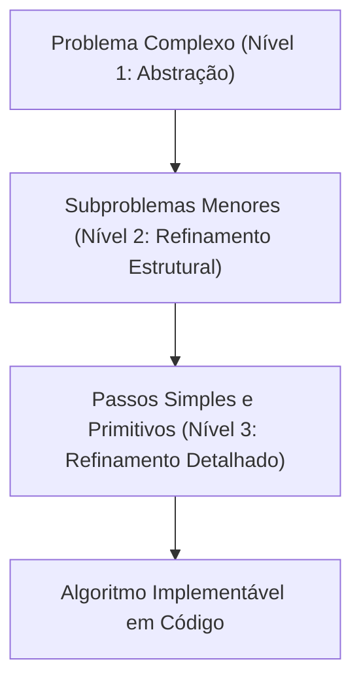

### Exemplo guiado: Cálculo da média de três notas

- **Nível 1 (Abstração):**
  Calcular a média das notas de um aluno.

- **Nível 2 (Refinamento):**
  1. Obter as três notas.
  2. Somar as notas.
  3. Dividir a soma por três.
  4. Exibir a média calculada.

- **Nível 3 (Algorítmico Implementável):**
  ```pseudocode
  algoritmo CalcularMedia
  início
      real: nota1, nota2, nota3, soma, media
      
      leia(nota1)
      leia(nota2)
      leia(nota3)
      
      soma <- nota1 + nota2 + nota3
      media <- soma / 3.0
      
      escreva("A média é: ", media)
  fim
  ```

### Tabela comparativa dos níveis de refinamento

| Nível | Foco Principal | Público / Contexto | Nível de Detalhe |
| :--- | :--- | :--- | :--- |
| **Nível 1 (Abstração)** | O que precisa ser feito | Regra de negócio / Usuário | Baixo (visão holística) |
| **Nível 2 (Refinamento)** | Etapas conceituais da solução | Arquitetura / Especificação | Médio (visão procedural) |
| **Nível 3 (Implementável)** | Operações primitivas, variáveis | Programador / Compilador | Alto (instruções executáveis) |

### Contraexemplo e armadilhas
- **Contraexemplo:** Pular do Nível 1 diretamente para o código, tentando escrever estruturas de repetição complexas sem antes rascunhar o fluxo de dados.
- **Armadilha do refinamento excessivo inicial:** Descer prematuramente a detalhes irrelevantes (como formatação de strings de exibição ou validações de hardware) antes que a lógica de resolução matemática e o fluxo do problema estejam validados.

---

## Tipos Abstratos de Dados

### Definição
Um Tipo Abstrato de Dados (TAD) é uma formulação matemática que especifica:
1. O conjunto de dados que existem na estrutura (o domínio dos valores).
2. O conjunto de operações que podem ser aplicadas a esses dados.
3. O comportamento esperado dessas operações (suas pré-condições, pós-condições e invariantes).

Crucialmente, o TAD estabelece essas regras **sem definir como os dados serão armazenados fisicamente na memória** e **sem definir como os algoritmos das operações serão implementados internamente**.

### Motivação
No desenvolvimento de software, os requisitos e a escala mudam frequentemente. Ao desacoplar o contrato (o que a estrutura oferece) da realização técnica (como ela funciona internamente), o código cliente que consome o TAD torna-se imune a mudanças internas de otimização, troca de vetores por ponteiros ou reestruturação de algoritmos.

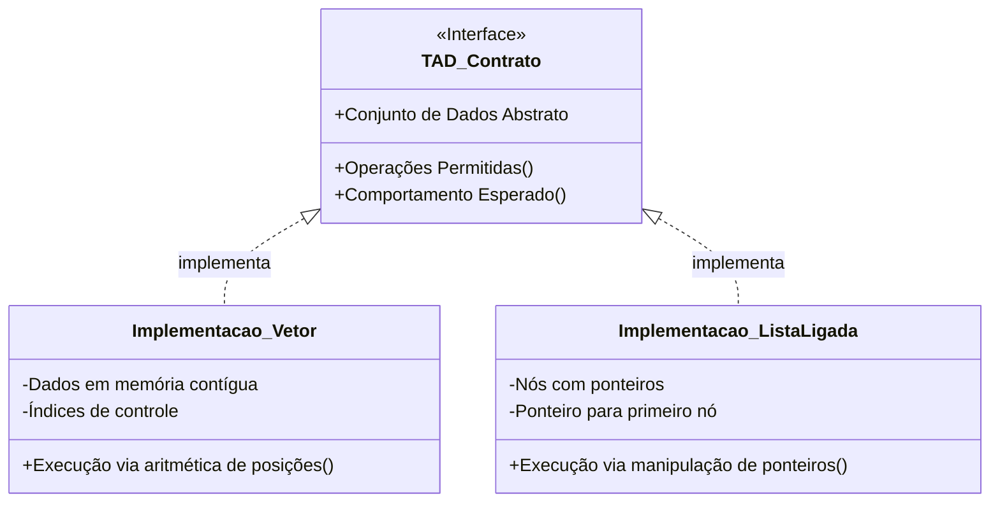

### Exemplo e formalização conceitual
Considere o TAD Ponto no plano cartesiano bidimensional.
- **Dados:** Par ordenado de números reais $(x, y)$.
- **Operações:**
  - `Criar(x, y)`: Instancia e retorna um novo ponto.
  - `Distancia(p1, p2)`: Retorna a distância euclidiana entre dois pontos.
  - `ObterX(p)`, `ObterY(p)`: Retorna as coordenadas.
- **Independência:** O ponto pode ser internamente guardado como dois números `float`, como um vetor de 2 posições `float[2]`, ou mesmo em coordenadas polares (raio e ângulo). Para o código cliente que chama `Distancia(p1, p2)`, essa representação física é inteiramente transparente.

### Contraexemplo e armadilhas
- **Contraexemplo:** Criar uma `struct` em linguagem C com campos públicos `x` e `y` e deixar que qualquer função externa altere livremente esses campos diretamente via ponteiro (`p->x = 10`), sem passar por funções controladas de interface.
- **Armadilha comum:** Confundir TAD com "Classe" de linguagens orientadas a objetos. Uma classe é um recurso sintático de certas linguagens; um TAD é um conceito formal da ciência da computação que pode ser perfeitamente implementado em linguagens puramente procedurais (como C), funcionais ou orientadas a objetos.

---

## Abstração e encapsulamento

### Definição
- **Abstração:** Mecanismo cognitivo de separação entre o **QUE** uma entidade de software faz (sua interface pública acessível) e o **COMO** ela realiza suas funções internamente (sua implementação privada).
- **Encapsulamento:** Prática de engenharia de software de esconder e blindar a estrutura física dos dados e as rotinas auxiliares de uma estrutura, impedindo o acesso ou a modificação direta por módulos externos, garantindo que o estado interno só seja manipulado por operações autorizadas.

### Motivação
Garantir a integridade das invariantes estruturais. Por exemplo, em uma estrutura de Pilha, o topo nunca pode apontar para uma posição inválida. Se o usuário puder modificar a variável de controle `topo` diretamente, a consistência de toda a estrutura pode ser destruída.

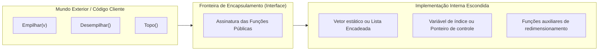

### O caso clássico do TAD Pilha
Uma Pilha é definida pelo comportamento LIFO (*Last In, First Out* — o último que entra é o primeiro que sai).

Suas operações fundamentais são:
- `Empilhar(elemento)` (ou `Push`): Adiciona um novo elemento ao topo.
- `Desempilhar()` (ou `Pop`): Remove e retorna o elemento atualmente no topo.
- `Topo()` (ou `Peek`): Consulta o elemento do topo sem removê-lo.

Internamente, uma pilha pode ser construída alocando:
1. Um **vetor sequencial** com um índice inteiro `topo_idx`.
2. Uma **lista encadeada** com um ponteiro apontando para o nó `primeiro_no`.

Para o usuário que chama `Empilhar(valor)`, a experiência de uso, a assinatura e as regras de negócio permanecem rigorosamente idênticas.

### Tabela comparativa: Interface vs. Implementação

| Dimensão | Interface (O QUE faz) | Implementação (COMO faz) |
| :--- | :--- | :--- |
| **Visibilidade** | Pública (exportada nos cabeçalhos) | Privada (escondida no arquivo de código) |
| **Modificabilidade** | Rígida e estável (contrato público) | Flexível (pode ser refatorada a qualquer momento) |
| **Dependência** | O cliente acopla-se a ela | O cliente sequer sabe como foi escrita |
| **Exemplo na Pilha** | `bool Empilhar(Pilha* p, int valor)` | Manipulação do índice: `p->vetor[++p->topo] = valor` |

### Contraexemplo e armadilhas
- **Contraexemplo:** Uma aplicação bancária onde o saldo de uma conta-corrente é uma variável pública que qualquer tela do sistema pode alterar fazendo `conta.saldo += valor`, em vez de invocar `conta_depositar(&conta, valor)`.
- **Armadilha:** Vazamento de abstração (*leaky abstraction*). Isso ocorre quando detalhes da implementação transparecem na interface. Exemplo: um método de pilha que retorna um índice inteiro do vetor interno, quebrando o encapsulamento caso a pilha seja posteriormente convertida para lista encadeada.

---

## Escolha de representação de dados

### Definição
A escolha de representação de dados é o processo de engenharia que consiste em selecionar a estrutura física e lógica ideal para organizar os dados na memória do computador, avaliando as características do problema, o volume esperado de elementos e a frequência das operações fundamentais (leitura, busca, inserção e remoção).

### Motivação
Não existe uma "superestrutura" de dados perfeita para todos os cenários. Uma representação altamente eficiente para leitura rápida pode ser péssima para inserções frequentes no meio da coleção. O engenheiro precisa ponderar os *trade-offs* (concessões) de desempenho e uso de memória.

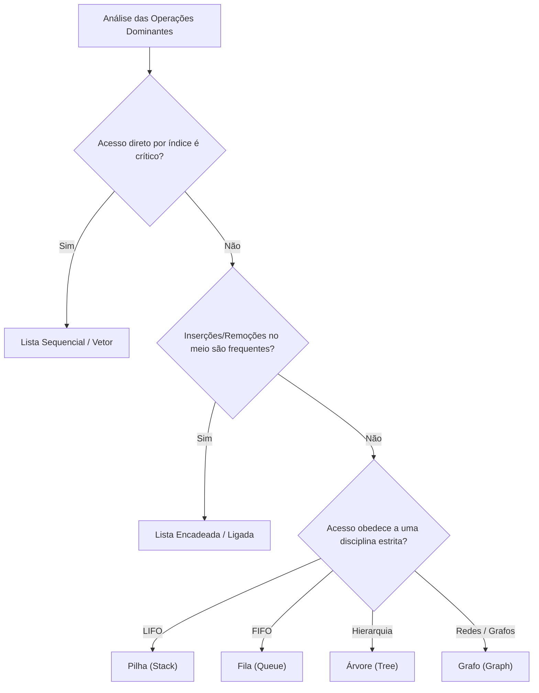

### Matriz de decisão estrutural (Material da aula)
O quadro a seguir sistematiza as recomendações apresentadas no material didático para mapear necessidades de sistema para as respectivas estruturas de dados:

| Necessidade da Aplicação | Estrutura Recomendada | Justificativa Técnica |
| :--- | :--- | :--- |
| **Acesso imediato por posição/índice** | Lista sequencial (Vetor/Array) | Endereçamento contíguo via cálculo de ponteiro em tempo constante. |
| **Inserção e remoção frequentes no meio** | Lista ligada (Encadeada) | Ajuste pontual de ponteiros sem deslocamento de blocos de memória. |
| **Último a entrar, primeiro a sair (LIFO)** | Pilha (*Stack*) | Inserções e remoções restritas a uma única extremidade (topo). |
| **Primeiro a entrar, primeiro a sair (FIFO)** | Fila (*Queue*) | Inserção no fim e remoção no início garantem ordem estrita de chegada. |
| **Relações hierárquicas** | Árvore (*Tree*) | Organização em níveis com raiz, nós pais, filhos e subárvores. |
| **Relações genéricas entre elementos (redes)** | Grafo (*Graph*) | Mapeamento de nós (vértices) e conexões arbitrárias (arestas). |

### Contraexemplo e armadilhas
- **Contraexemplo:** Usar uma lista simplesmente encadeada para implementar um algoritmo que precisa consultar repetidamente elementos aleatórios por índice (ex.: acessar posição 500, depois 12, depois 890), forçando o programa a percorrer os ponteiros desde o início a cada consulta.
- **Armadilha:** Esquecer o custo indireto de memória (*memory overhead*). Vetores contíguos armazenam apenas os dados puros, enquanto listas encadeadas exigem espaço extra para armazenar um ou dois ponteiros para cada elemento guardado, o que pode impactar a utilização do cache da CPU.

---

## Introdução à análise de algoritmos

### Definição
A análise de algoritmos é a disciplina da ciência da computação teórica dedicada a estudar e prever os recursos computacionais (principalmente tempo de processamento e espaço de memória) exigidos por um algoritmo para executar sua tarefa, permitindo comparar de forma objetiva diferentes soluções para o mesmo problema.

### Motivação
A máxima central apresentada pelo Prof. Wesley sintetiza a disciplina:
> *"Dois algoritmos podem resolver o mesmo problema, mas não necessariamente com o mesmo custo."*

Para volumes pequenos de dados ($n = 10$), a maioria dos algoritmos parece rápida e eficiente. No entanto, em sistemas reais de produção que lidam com milhões ou bilhões de registros, uma escolha algorítmica ineficiente pode inviabilizar a operação do sistema, tornando o tempo de execução inaceitavelmente longo.

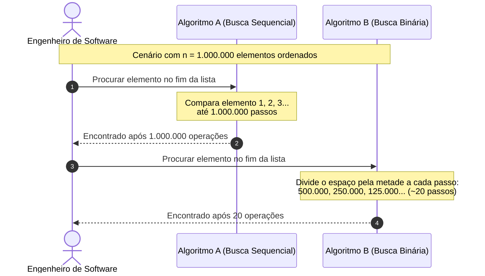

### O exemplo dos slides: Pesquisa Sequencial vs. Pesquisa Binária
Considere o problema clássico de localizar se determinado valor inteiro existe em uma base de dados previamente ordenada:
- **Algoritmo A (Pesquisa Sequencial):** Percorre a lista elemento por elemento, do primeiro ao último.
  - Para $n = 10$: realiza até 10 comparações.
  - Para $n = 1.000.000$: realiza até 1.000.000 comparações.
- **Algoritmo B (Pesquisa Binária):** Compara o valor buscado com o elemento central da lista ordenada. Se for menor, descarta toda a metade superior; se for maior, descarta toda a metade inferior. Repete o processo com a metade restante.
  - Para $n = 10$: realiza no máximo 4 comparações.
  - Para $n = 1.000.000$: realiza no máximo $\lceil \log_2(1.000.000) \rceil \approx 20$ comparações.

A diferença entre 20 comparações e 1.000.000 de comparações é a diferença entre uma resposta instantânea em frações de microssegundo e um travamento perceptível em lote.

### Tabela comparativa: Algoritmo A vs. Algoritmo B

| Tamanho da Entrada ($n$) | Algoritmo A: Linear (um por um) | Algoritmo B: Logarítmico (divide ao meio) | Diferença Relativa |
| :--- | :--- | :--- | :--- |
| **$n = 10$** | 10 operações | ~4 operações | 2,5 vezes mais rápido |
| **$n = 100$** | 100 operações | ~7 operações | 14 vezes mais rápido |
| **$n = 1.000$** | 1.000 operações | ~10 operações | 100 vezes mais rápido |
| **$n = 1.000.000$** | 1.000.000 operações | ~20 operações | **50.000 vezes mais rápido** |

### Contraexemplo e armadilhas
- **Contraexemplo:** Avaliar a eficiência de um algoritmo olhando apenas para o tamanho do código-fonte (quantidade de linhas). Um algoritmo com poucas linhas (como um laço aninhado recursivo ingênuo) pode ter custo astronômico, enquanto um código mais extenso e bem modularizado pode executar em tempo logarítmico.
- **Armadilha:** Assumir que o Algoritmo B é sempre a escolha correta. A busca binária exige que a lista esteja previamente ordenada. Se a lista sofrer inserções contínuas desordenadas e pouquíssimas consultas, o custo acumulado de ordenar a lista pode superar a economia das buscas.

---

## Custo computacional e tamanho da entrada

### Definição
- **Tamanho da entrada ($n$):** A medida quantitativa do volume de dados fornecido ao algoritmo para ser processado (ex.: quantidade de números a somar, registros a pesquisar ou caracteres de um texto).
- **Custo computacional:** A quantidade de recursos físicos do sistema computacional necessários para executar o algoritmo até a sua conclusão. Divide-se essencialmente em:
  - **Complexidade temporal:** A quantidade de passos/operações fundamentais executadas ao longo do tempo.
  - **Complexidade espacial:** A quantidade de memória auxiliar necessária para alocar variáveis e estruturas durante a execução.

### Por que não medir o tempo em segundos?
Uma abordagem intuitiva de quem está iniciando na programação é cronometrar o código:
> *"Executei meu algoritmo e ele levou 0,5 segundos."*

Como explicitado no material da aula, **essa abordagem empírica é frágil e insuficiente** para a ciência da computação, pois o tempo de relógio é afetado por uma miríade de fatores externos completamente alheios ao algoritmo:
- Potência e arquitetura do processador (clock, número de núcleos, instruções vetoriais).
- Memória disponível, latência do barramento e hierarquia de cache (L1, L2, L3).
- Linguagem de programação escolhida (interpretada vs. compilada).
- Nível de otimização ativado no compilador (`-O0`, `-O2`, `-O3`).
- Sistema operacional e tarefas concorrentes em segundo plano no momento do teste.

Por isso, **não queremos depender do computador físico**. Substituímos a pergunta *"Quanto tempo em segundos o programa levou?"* pela pergunta matematicamente sólida: **"Quantas operações o algoritmo precisa realizar à medida que o tamanho da entrada ($n$) cresce?"**

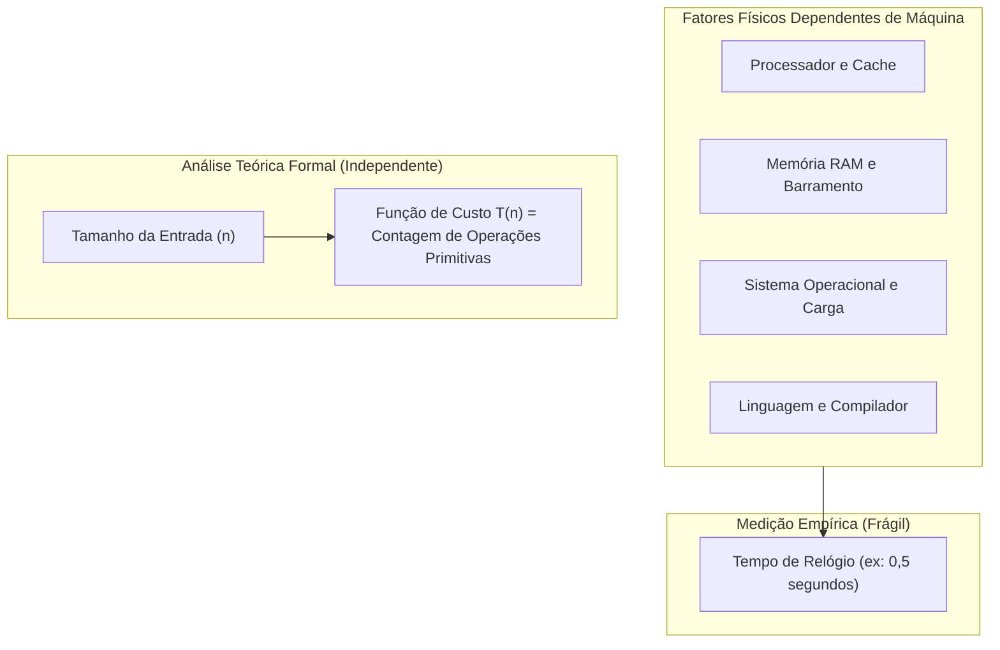

### Exemplos do tamanho da entrada $n$
- Somar 10 números: $n = 10$.
- Pesquisar em uma base de funcionários com 1.000 cadastros: $n = 1.000$.
- Ordenar uma base de telemetria com 50.000 eventos: $n = 50.000$.

### Tabela comparativa: Medição empírica vs. Análise teórica

| Característica | Medição Empírica (Benchmarking) | Análise Teórica (Complexidade) |
| :--- | :--- | :--- |
| **Unidade de medida** | Segundos, milissegundos, microssegundos | Número de operações primitivas $T(n)$ |
| **Dependência de hardware** | Totalmente dependente do ambiente | Completamente independente de máquina |
| **Reprodutibilidade** | Baixa (varia a cada execução) | Universal e matematicamente exata |
| **Previsibilidade de escala**| Difícil prever comportamento para $n \to \infty$ | Modela o comportamento assintótico perfeitamente |

### Contraexemplo e armadilhas
- **Contraexemplo:** Executar um algoritmo de ordenação ingênuo em um computador de ponta com processador topo de linha e declarar que ele é mais eficiente do que um algoritmo ótimo executado em um smartphone antigo.
- **Armadilha:** Desconsiderar o uso de memória (complexidade espacial). Muitas vezes, um algoritmo consegue ser extremamente rápido ao custo de alocar cópias massivas de dados na memória RAM, o que pode provocar estouro de memória (*Out of Memory*) quando $n$ atinge escalas elevadas.

---

## Contagem de operações

### Definição
A contagem de operações consiste em expressar o tempo de execução de um algoritmo como uma função matemática $T(n)$, somando a quantidade de operações primitivas que o algoritmo executa em função do tamanho da entrada $n$. No modelo teórico clássico (máquina RAM — *Random Access Machine*), considera-se que cada operação elementar (atribuição, comparação, operação aritmética básica, leitura/escrita) possui custo unitário constante.

### Motivação
Traduzir o código imperativo em uma equação matemática que descreva seu comportamento e permita calcular com precisão como o esforço de processamento cresce.

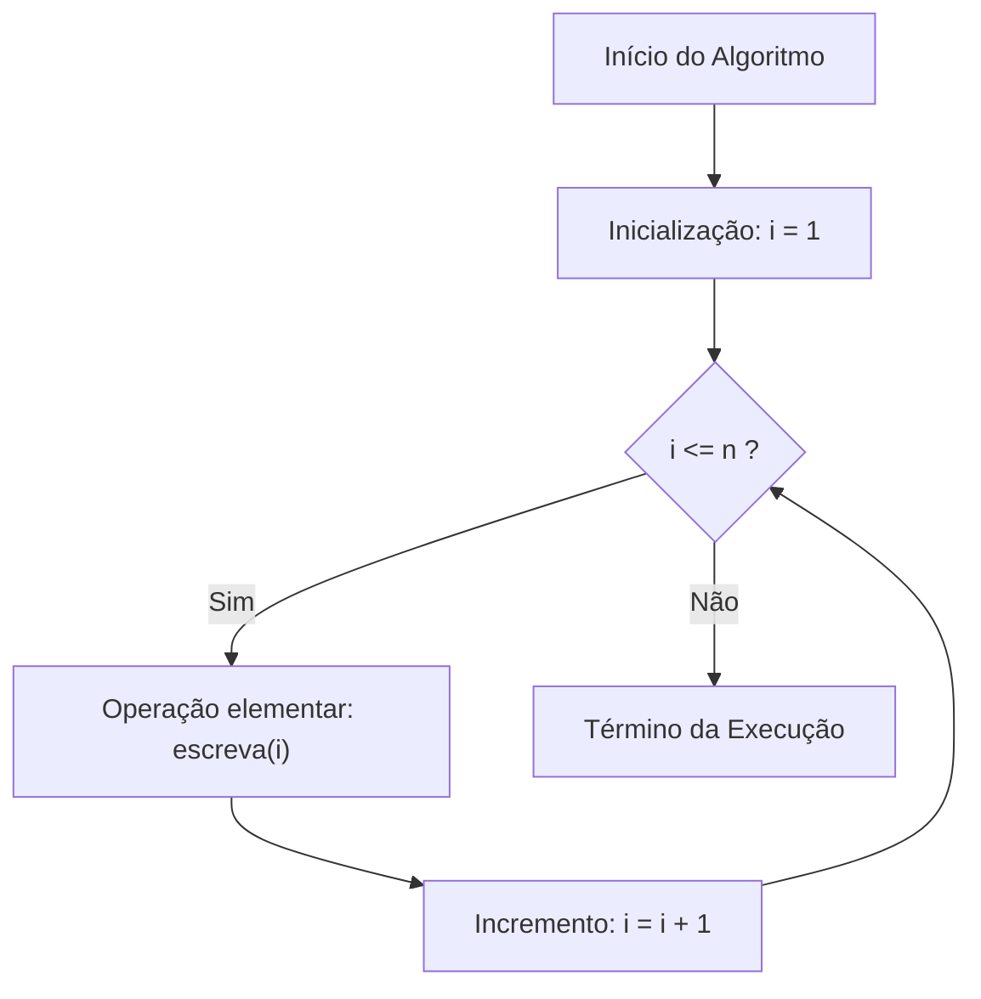

### Exemplo 1: Laço simples
Analise o algoritmo clássico apresentado nos slides:
```pseudocode
para i = 1 até n faça
    escreva(i)
fim
```
- **Raciocínio:** O comando `escreva(i)` é executado exatamente 1 vez para cada valor de $i$ variando de $1$ a $n$.
- **Custo:** $T(n) = n$ operações.
- **Projeção:** Se $n = 10$, temos 10 operações. Se $n = 1.000$, temos 1.000 operações. O crescimento é perfeitamente linear e proporcional a $n$.

### Exemplo 2: Dois laços sequenciais independentes
Considere agora a sequência de repetições:
```pseudocode
para i = 1 até n faça
    escreva(i)
fim

para j = 1 até n faça
    escreva(j)
fim
```
- **Raciocínio:**
  - O primeiro laço executa `escreva(i)` exatamente $n$ vezes.
  - O segundo laço executa `escreva(j)` exatamente $n$ vezes.
  - Custo total: $T(n) = n + n = 2n$.
- **Reflexão proposta pelo material:** Se dobrarmos o tamanho da entrada de $n$ para $2n$, o custo computacional passará de $2n$ para $4n$, mantendo a proporção de crescimento constante.

### Tabela comparativa de funções de custo por contagem direta

| Trecho de Código | Contagem Exata $T(n)$ | Comportamento quando $n$ dobra |
| :--- | :--- | :--- |
| Instrução única de atribuição | $T(n) = 1$ | Permanece inalterado |
| Laço único de $1$ a $n$ | $T(n) = n$ | Dobra |
| Dois laços sequenciais de $1$ a $n$ | $T(n) = 2n$ | Dobra |
| Três laços sequenciais de $1$ a $n$ com inicializações | $T(n) = 3n + 5$ | Dobra assintoticamente |

### Contraexemplo e armadilhas
- **Contraexemplo:** Contar o número de caracteres digitados no código em vez do número de vezes que a linha é percorrida pelo fluxo da CPU em tempo de execução.
- **Armadilha:** Contar laços aninhados como se fossem somas. Se um laço está dentro de outro laço, o custo é multiplicativo, e não aditivo (como será visto em detalhes nas seções a seguir).

---

## Análise assintótica

### Definição
A análise assintótica é o estudo do comportamento de uma função $T(n)$ quando o seu parâmetro $n$ tende ao infinito ($n \to \infty$). Em vez de calcular o valor exato de todas as operações com precisão aritmética absoluta, a análise assintótica foca na **taxa de crescimento** da função, descartando constantes multiplicativas e termos de menor ordem que se tornam irrelevantes para entradas gigantescas.

### Motivação
Como questionado no slide 25: *"Precisamos realmente nos preocupar com o número 2 em $T(n) = 2n$?"*

A resposta da engenharia é: **não para fins de classificação assintótica**. Quando comparamos um algoritmo que realiza $2n$ passos com um que realiza $n^2$ passos, para $n = 1.000.000$, temos:
- $T_1(1.000.000) = 2.000.000$ operações.
- $T_2(1.000.000) = 1.000.000.000.000$ (um trilhão) de operações.

O multiplicador constante $2$ perde qualquer significância diante da diferença astronômica das ordens de crescimento estruturais.

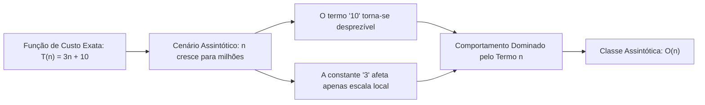

### Regras de simplificação assintótica
1. **Regra do Termo Dominante:** Em um polinômio, quando $n \to \infty$, o termo de maior expoente domina completamente a magnitude da função. Todos os termos de menor ordem podem ser descartados.
   - Exemplo do slide: $T(n) = 3n + 10 \implies$ O termo $10$ torna-se insignificante; a função é dominada por $n$. Portanto, pertence a $O(n)$.
2. **Descarte de Constantes Multiplicativas:** Constantes que multiplicam o termo dominante não alteram a forma da curva de crescimento assintótico.
   - $T(n) = 5n \implies O(n)$
   - $T(n) = 100n + 50 \implies O(n)$
   - $T(n) = 0.001n^2 + 500n \implies O(n^2)$ (pois para $n$ suficientemente grande, $n^2$ supera qualquer valor linear).

### Tabela comparativa de simplificação assintótica

| Equação de Custo Exato $T(n)$ | Termo Dominante | Termos Descartados | Classificação Assintótica |
| :--- | :--- | :--- | :--- |
| $T(n) = 45$ | Constante | Nenhum | $O(1)$ |
| $T(n) = 3n + 10$ | $3n$ | $+ 10$ | $O(n)$ |
| $T(n) = 5n^2 + 100n + 500$ | $5n^2$ | $+ 100n + 500$ | $O(n^2)$ |
| $T(n) = 2^n + 1000n^3$ | $2^n$ | $+ 1000n^3$ | $O(2^n)$ |

### Contraexemplo e armadilhas
- **Contraexemplo:** Escrever a complexidade de um algoritmo como $O(3n + 12)$. Isso revela incompreensão teórica: a notação $O$ existe justamente para representar a classe assintótica simplificada, devendo ser escrita estritamente como $O(n)$.
- **Armadilha:** Achar que constantes nunca importam na prática. A análise assintótica garante que um algoritmo $O(n)$ vencerá um $O(n^2)$ *a partir de um determinado valor de $n$*. Porém, para entradas muito pequenas ($n = 3$), um algoritmo $O(n^2)$ com constantes minúsculas pode rodar mais rápido do que um $O(n)$ com uma constante oculta gigantesca ($T(n) = 10.000n$). A análise assintótica mira no comportamento de grande escala.

---

## Notação Big O

### Definição formal
A Notação Big O (representada por $O$) formaliza o conceito de **limite superior assintótico** (teto de crescimento).

Dizemos matematicamente que uma função de custo $T(n)$ pertence à ordem $O(g(n))$, denotado por:
$$T(n) \in O(g(n)) \quad \text{ou informalmente} \quad T(n) = O(g(n))$$
se, e somente se, existirem duas constantes positivas estritas $c > 0$ e $n_0 \ge 1$ tais que:
$$0 \le T(n) \le c \cdot g(n), \quad \forall n \ge n_0$$

Em termos conceituais: para entradas suficientemente grandes ($n \ge n_0$), o custo real do algoritmo $T(n)$ nunca ultrapassa a função $g(n)$ multiplicada por uma constante fixa $c$. O Big O estabelece uma garantia de que o algoritmo **não terá desempenho pior do que essa curva**.

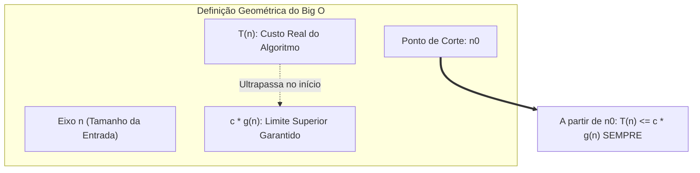

### Compreendendo a Notação Big Omega ($\Omega$)
Conforme estabelecido nos objetivos da aula (*"Compreender a ideia da notação $\Omega$"*):
- Enquanto a Notação $O$ estabelece uma **cota superior** (o algoritmo não gasta mais do que isso), a **Notação $\Omega$ (Big Omega)** estabelece uma **cota inferior** (o algoritmo gasta no mínimo isso).
- Formalmente: $T(n) \in \Omega(g(n))$ se existirem constantes $c > 0$ e $n_0$ tais que $T(n) \ge c \cdot g(n)$ para todo $n \ge n_0$.
- Uma analogia direta: o Big O é como o teto de um orçamento (você garante que não gastará mais do que X); o Big Omega é o piso de custo (você garante que terá que gastar ao menos Y).

### Exemplos do material didático
Observe as funções lineares analisadas pelo professor nos slides:
- $T(n) = 5n \implies O(n)$
- $T(n) = 3n + 20 \implies O(n)$
- $T(n) = 100n + 50 \implies O(n)$

Todas essas funções pertencem à mesma classe de complexidade assintótica $O(n)$ porque todas crescem em taxa estritamente linear quando $n$ se expande.

### Tabela comparativa: Família de notações assintóticas

| Notação | Nome | Significado Conceitual | Expressão Matemática |
| :--- | :--- | :--- | :--- |
| **$O$** | Big O | Cota Superior (*Worst-case limit*) | $T(n) \le c \cdot g(n)$ |
| **$\Omega$** | Big Omega | Cota Inferior (*Best-case limit*) | $T(n) \ge c \cdot g(n)$ |
| **$\Theta$** | Big Theta | Cota Justa / Exata (*Tight bound*) | $c_1 \cdot g(n) \le T(n) \le c_2 \cdot g(n)$ |

*(Nota: O material da aula enfatiza formalmente o Big O e a intuição do $\Omega$, servindo a tabela acima para consolidar a taxonomia completa da literatura técnica).*

### Contraexemplo e armadilhas
- **Contraexemplo:** Dizer que um algoritmo de busca sequencial é $O(1)$ porque em um teste pontual o elemento procurado estava na primeira posição. O Big O caracteriza o comportamento assintótico de uma função para todo $n$ genérico, e não uma coincidência para uma única instância favorável.
- **Armadilha:** Achar que $O(g(n))$ representa exclusivamente o pior caso. A notação Big O é uma ferramenta matemática de limitação superior; ela pode ser aplicada para expressar a cota superior do pior caso, a cota superior do melhor caso ou a cota superior do caso médio.

---

## Melhor caso, pior caso e caso médio

### Definição
Mesmo para uma entrada de tamanho fixo $n$, a disposição física e o conteúdo dos dados podem alterar drasticamente a quantidade de passos que o algoritmo precisa executar. Portanto, decompomos a análise em três cenários fundamentais:

1. **Melhor Caso:** A configuração de entrada que exige a **menor** quantidade possível de operações para resolver o problema. Representa o cenário ideal.
2. **Pior Caso:** A configuração de entrada que exige a **maior** quantidade de operações para resolver o problema. Fornece uma **garantia estrita de desempenho**: o sistema nunca demorará mais do que isso.
3. **Caso Médio:** O número esperado de operações calculadas probabilisticamente sobre todas as entradas possíveis de tamanho $n$, considerando uma determinada distribuição de probabilidade (geralmente equiprovável).

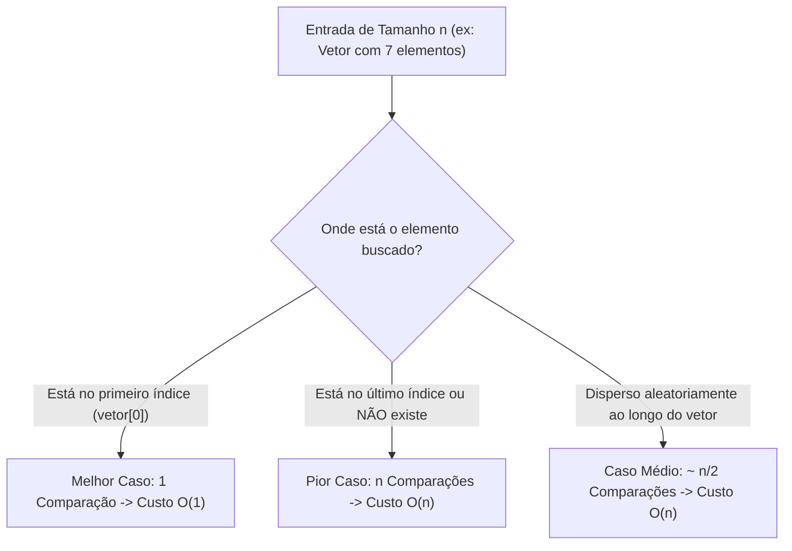

### O caso prático do slide: Pesquisa Sequencial
Considere o vetor do slide 26:
$$\text{Vetor: } [10, 25, 31, 42, 58, 70, 81] \quad (n = 7)$$

- **Cenário 1 — Elemento procurado: 10**
  O algoritmo inspeciona a primeira posição e encontra o valor imediatamente.
  - Comparações: 1
  - Classificação: **Melhor caso** $\implies O(1)$.
- **Cenário 2 — Elemento procurado: 81 ou inexistente (ex.: 99)**
  O algoritmo precisa percorrer todo o arranjo até a última posição para localizar o valor ou constatar sua ausência.
  - Comparações: $n$
  - Classificação: **Pior caso** $\implies O(n)$.
- **Cenário 3 — Elemento qualquer (análise média)**
  Assumindo que o elemento tenha probabilidades iguais de estar em qualquer uma das $n$ posições:
  $$\text{Média} = \frac{1 + 2 + 3 + \dots + n}{n} = \frac{\frac{n(n+1)}{2}}{n} = \frac{n + 1}{2}$$
  Assintoticamente, $\frac{n+1}{2}$ cresce proporcionalmente a $n$. Portanto, o caso médio também é $O(n)$.

### Tabela comparativa dos cenários de execução

| Cenário | Descrição | Importância Prática | Complexidade na Busca Linear |
| :--- | :--- | :--- | :--- |
| **Melhor Caso** | Menor consumo de recursos | Útil para validar atalhos ou condições de parada | $O(1)$ |
| **Pior Caso** | Maior consumo de recursos | **Padrão na engenharia**: fornece garantia máxima para SLAs e sistemas de missão crítica | $O(n)$ |
| **Caso Médio** | Comportamento estatístico típico | Modela o desempenho real no dia a dia operacional | $O(n)$ |

### Contraexemplo e armadilhas
- **Contraexemplo:** Dimensionar a infraestrutura de servidores de um hospital ou banco baseando-se apenas no melhor caso do algoritmo ("se der sorte, executa em 1 milissegundo").
- **Armadilha:** Ignorar a premissa de distribuição do caso médio. O caso médio assume que os dados chegam de forma uniformemente distribuída. Se a entrada do mundo real for viciada (ex.: 99% das buscas procuram itens que nunca existem no sistema), o comportamento real coincidirá rotineiramente com o pior caso.

---

## Classes de complexidade

### Definição
As classes de complexidade agrupam funções matemáticas que compartilham a mesma taxa fundamental de crescimento assintótico. Elas servem como uma régua universal para categorizar algoritmos do mais eficiente ao computacionalmente inviável.

### Hierarquia de eficiência
Da mais eficiente (crescimento mais lento) para a menos eficiente (crescimento explosivo):
$$O(1) < O(\log n) < O(n) < O(n \log n) < O(n^2) < O(n^3) < O(2^n) < O(n!)$$

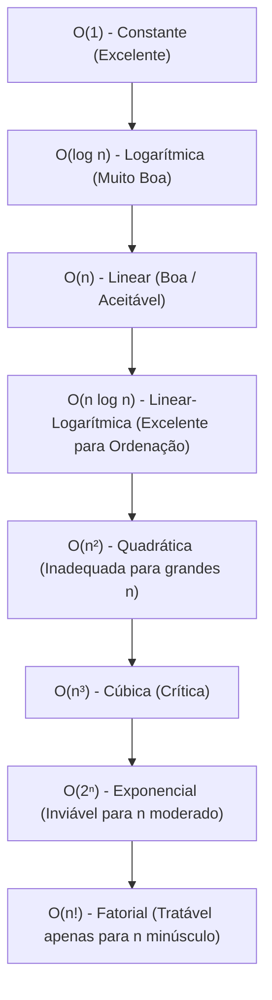

### Análise aprofundada de cada classe

#### 1. $O(1)$: Complexidade Constante
- **Conceito:** O número de operações necessárias é fixo e independente do tamanho da entrada $n$. Quer o vetor possua 5 elementos ou 500 milhões de elementos, a execução realiza exatamente a mesma quantidade de passos primitivos.
- **Exemplo clássico dos slides:** `x = vetor[5]`. O acesso a uma posição de um vetor sequencial é resolvido em uma única operação de cálculo de endereço: $\text{Endereço} = \text{Base} + (\text{Índice} \times \text{Tamanho\_Elemento})$.
- **Outros exemplos:** Consulta simples a variáveis, inserção/remoção no topo de uma pilha implementada com ponteiro direto.

#### 2. $O(\log n)$: Complexidade Logarítmica
- **Conceito:** O algoritmo resolve o problema dividindo o espaço de busca ou o volume de processamento sucessivamente por uma constante (tipicamente dividindo pela metade) a cada passo.
- **Exemplo dos slides:** Pesquisa binária em 1.000.000 de elementos ordenados.
  - Passo 1: 1.000.000 $\to$ 500.000
  - Passo 2: 500.000 $\to$ 250.000
  - Passo 3: 250.000 $\to$ 125.000
  - ... após cerca de 20 passos, atinge-se 1 elemento.
- **Crescimento:** Extremamente lento. Dobrar o tamanho de $n$ acrescenta apenas uma única operação adicional ao custo total.

#### 3. $O(n)$: Complexidade Linear
- **Conceito:** O esforço computacional cresce de forma perfeitamente proporcional ao tamanho da entrada. Se $n$ dobra, o trabalho dobra.
- **Exemplo dos slides:** Laço simples de varredura:
  ```pseudocode
  para cada elemento da lista faça
      verificar se elemento é o procurado
  fim
  ```
- **Aplicações:** Pesquisa sequencial, cálculo de média de uma lista de valores, leitura sequencial de arquivo.

#### 4. $O(n \log n)$: Complexidade Linear-Logarítmica (Quasilinear)
- **Conceito:** Algoritmos eficientes de ordenação que utilizam a estratégia de "divisão e conquista" (como Merge Sort e Quick Sort em seu caso típico). O algoritmo quebra o conjunto de dados em subproblemas logarítmicos e realiza um trabalho linear para combinar os resultados.
- *(Nota: Tópico fundamental de ordenação introduzido conceitualmente na tabela comparativa dos slides).*

#### 5. $O(n^2)$: Complexidade Quadrática
- **Conceito:** O tempo de execução cresce proporcionalmente ao quadrado do tamanho da entrada. Decorre caracteristicamente da presença de dois laços de repetição aninhados, onde o laço interno executa $n$ vezes para cada uma das $n$ iterações do laço externo ($n \times n = n^2$).
- **Exemplo dos slides:**
  ```pseudocode
  para i = 1 até n faça
      para j = 1 até n faça
          operação_elementar()
      fim
  fim
  ```
- **Aplicações e algoritmos reais:** Algoritmos elementares de ordenação como Bubble Sort, Selection Sort e Insertion Sort em seus piores casos.
- **Caso da metade das execuções (Slide 42):** Se o segundo laço executar apenas metade das vezes (ex.: $j$ de $1$ até $i$ ou até $n/2$), o número de operações é $\frac{n^2}{2}$. Conforme a regra de descarte de constantes da análise assintótica:
  $$\frac{n^2}{2} = \frac{1}{2} \cdot n^2 \implies O(n^2)$$
  A complexidade continua sendo estritamente quadrática!

#### 6. Classes Superpolinomiais: $O(2^n)$ e $O(n!)$
- **Conceito:** Crescimento explosivo. Tornam-se computacionalmente intratáveis mesmo para valores pequenos de $n$ ($n > 50$).
- **Exemplos:** Algoritmos de força bruta que testam todas as combinações possíveis (Problema da Mochila booleana sem programação dinâmica $\implies O(2^n)$) ou que testam todas as permutações possíveis de cidades (Problema do Caixeiro Viajante ingênuo $\implies O(n!)$).

### Tabela comparativa de crescimento (Dados do Slide 38)
O quadro a seguir reproduz a demonstração dos slides, ilustrando a divergência de operações conforme $n$ cresce:

| $n$ | $O(1)$ | $O(\log_2 n)$ | $O(n)$ | $O(n^2)$ |
| :---: | :---: | :---: | :---: | :---: |
| **10** | 1 | ~3 | 10 | 100 |
| **100** | 1 | ~7 | 100 | 10.000 |
| **1.000** | 1 | ~10 | 1.000 | 1.000.000 |
| **10.000** | 1 | ~13 | 10.000 | 100.000.000 |

### Contraexemplo e armadilhas
- **Contraexemplo:** Supor que um algoritmo com dois laços consecutivos independentes (um após o outro) seja $O(n^2)$. Se os laços não estão aninhados, seus custos somam ($n + n = 2n \implies O(n)$). Para ser quadrático, o laço deve estar **aninhado** (um dentro do outro).
- **Armadilha:** Achar que $O(1)$ significa "instantâneo" ou "zero microssegundos". Uma função que realiza 1 milhão de operações fixas sem qualquer repetição que dependa de $n$ é rigorosamente $O(1)$, pois seu tempo é constante e não varia se a base do cliente tiver 1 ou 10 bilhões de itens.

---

## Código da aula

*(Nota de Contexto: O material da Aula 02 é essencialmente conceitual e analítico, sem arquivos de código-fonte avulsos anexados. Para consolidar a ponte entre teoria e implementação, apresentamos a seguir a formalização dos dois pilares da aula: o encapsulamento de um TAD com interface estrita e a implementação didática dos padrões algorítmicos analisados nas seções de complexidade).*

### 1. TAD Pilha (Abstração e Encapsulamento em C)
O exemplo a seguir ilustra a separação rigorosa entre interface (`pilha.h`) e implementação interna (`pilha.c`), conforme ensinado nos slides 6 a 8.

```c
/* =========================================================================
 * ARQUIVO: pilha.h (INTERFACE PÚBLICA - O QUE O TAD FAZ)
 * ========================================================================= */
#ifndef PILHA_H
#define PILHA_H

#include <stdbool.h>

#define CAPACIDADE_MAX 100

/* Definição do Tipo Abstrato de Dados encapsulado */
typedef struct {
    int itens[CAPACIDADE_MAX]; /* Vetor de armazenamento interno */
    int topo_idx;              /* Índice de controle do topo */
} Pilha;

/* Operações públicas do TAD */
void pilha_inicializar(Pilha* p);
bool pilha_vazia(const Pilha* p);
bool pilha_cheia(const Pilha* p);
bool pilha_empilhar(Pilha* p, int elemento);   /* Custo assintótico: O(1) */
bool pilha_desempilhar(Pilha* p, int* saida);  /* Custo assintótico: O(1) */
bool pilha_topo(const Pilha* p, int* saida);   /* Custo assintótico: O(1) */

#endif
```

```c
/* =========================================================================
 * ARQUIVO: pilha.c (IMPLEMENTAÇÃO INTERNA - COMO O TAD FAZ)
 * ========================================================================= */
#include "pilha.h"

void pilha_inicializar(Pilha* p) {
    p->topo_idx = -1; /* -1 indica pilha vazia */
}

bool pilha_vazia(const Pilha* p) {
    return p->topo_idx == -1;
}

bool pilha_cheia(const Pilha* p) {
    return p->topo_idx == CAPACIDADE_MAX - 1;
}

/* Inserção no topo: realiza operações elementares em tempo constante O(1) */
bool pilha_empilhar(Pilha* p, int elemento) {
    if (pilha_cheia(p)) {
        return false; /* Erro: estouro de pilha (overflow) */
    }
    p->topo_idx++;
    p->itens[p->topo_idx] = elemento;
    return true;
}

/* Remoção do topo: tempo constante O(1) */
bool pilha_desempilhar(Pilha* p, int* saida) {
    if (pilha_vazia(p)) {
        return false; /* Erro: pilha vazia (underflow) */
    }
    *saida = p->itens[p->topo_idx];
    p->topo_idx--;
    return true;
}

/* Consulta do topo: tempo constante O(1) */
bool pilha_topo(const Pilha* p, int* saida) {
    if (pilha_vazia(p)) {
        return false;
    }
    *saida = p->itens[p->topo_idx];
    return true;
}
```

### 2. Implementação dos Padrões de Complexidade
O programa a seguir consolida em pseudocódigo comentado os blocos básicos de repetição analisados em aula:

```pseudocode
// Padrão 1: Acesso direto a posição de vetor -> O(1)
função AcessoDireto(vetor: Lista, indice: Inteiro): Inteiro
início
    retorne vetor[indice] // Cálculo imediato de deslocamento de memória
fim

// Padrão 2: Laço Simples -> O(n)
procedimento LacoSimples(n: Inteiro)
início
    para i de 1 até n faça
        escreva(i) // Executa exatamente n vezes
    fim
fim

// Padrão 3: Laços Aninhados Quadráticos -> O(n²)
procedimento LacoQuadratico(n: Inteiro)
início
    para i de 1 até n faça
        para j de 1 até n faça
            escreva(i, j) // Executa n * n = n² vezes
        fim
    fim
fim

// Padrão 4: Laço Triangular (Metade das operações) -> O(n²)
procedimento LacoTriangular(n: Inteiro)
início
    para i de 1 até n faça
        para j de 1 até i faça
            escreva(i, j) // Executa 1 + 2 + ... + n = n(n+1)/2 vezes -> O(n²)
        fim
    fim
fim
```

---

## Exercícios

### Exercício 1: Refinando um Problema de Fila de Atendimento (Slide 4)
**Enunciado:**
Desenvolver um algoritmo para controlar uma fila de atendimento em um banco ou repartição pública. Identifique e refine progressivamente:
1. Quais dados precisam ser armazenados?
2. Como uma pessoa entra na fila?
3. Como uma pessoa sai da fila?
4. Quem deve ser atendido primeiro?

**Raciocínio:**
- *Nível 1 (Abstração):* Controlar a ordem de chegada e chamada de clientes em um guichê.
- *Nível 2 (Identificação do TAD):* A disciplina de acesso deve ser estritamente FIFO (*First In, First Out*).
- *Nível 3 (Refinamento das Operações):*
  1. *Dados:* Identificador da pessoa (senha, CPF ou nome) e apontadores/índices para o início e o fim da estrutura.
  2. *Entrada (Enfileirar):* Um novo cliente chega e é inserido exclusivamente no final da fila.
  3. *Saída (Desenfileirar):* O cliente chamado é retirado exclusivamente do início da fila.
  4. *Prioridade de atendimento:* A pessoa que chegou há mais tempo (a mais antiga na estrutura).

**Resolução comentada em pseudocódigo:**
```pseudocode
TAD FilaAtendimento
    dados_internos:
        vetor de senhas: inteiros
        inicio_fila: inteiro
        fim_fila: inteiro
        tamanho: inteiro
        
    operacao CriarFila():
        inicio_fila <- 0
        fim_fila <- -1
        tamanho <- 0
        
    operacao EntrarNaFila(nova_senha: inteiro):
        se fila_nao_cheia entao
            fim_fila <- fim_fila + 1
            vetor[fim_fila] <- nova_senha
            tamanho <- tamanho + 1
        fim
        
    operacao ChamarProximo(): inteiro
        se fila_nao_vazia entao
            senha_atendida <- vetor[inicio_fila]
            inicio_fila <- inicio_fila + 1
            tamanho <- tamanho - 1
            retorne senha_atendida
        fim
fim
```

---

### Exercício 2: Complexidade de Acesso Direto (Slide 39)
**Enunciado:**
Qual é a complexidade assintótica (Notação Big O) da operação de acesso direto:
```pseudocode
x = vetor[10]
```

**Raciocínio:**
- A estrutura de dados subjacente é um vetor contíguo em memória.
- Para encontrar o elemento no índice 10, o processador não precisa percorrer os índices $0, 1, 2, \dots, 9$.
- A arquitetura da CPU aplica diretamente a fórmula de endereçamento:
  $$\text{Endereço} = \text{Endereço\_Base} + (10 \times \text{Tamanho\_do\_Tipo})$$
- Essa expressão realiza uma multiplicação e uma adição de inteiros, que são instruções elementares de tempo fixo no processador.
- Como o tempo gasto é totalmente independente do número total de elementos contidos no vetor, o custo é constante.

**Classificação Assintótica:**
$$O(1)$$

---

### Exercício 3: Complexidade de Laço Simples (Slide 40)
**Enunciado:**
Qual é a complexidade assintótica (Notação Big O) do seguinte algoritmo?
```pseudocode
para i = 1 até n faça
    escreva(i)
fim
```

**Raciocínio:**
- A variável de controle $i$ assume sucessivamente os valores $1, 2, 3, \dots, n$.
- Em cada iteração, o bloco interno executa a chamada primitiva `escreva(i)`, cujo custo é unitário (1 operação).
- O número total de iterações executadas é rigorosamente igual a $n$.
- A função exata de tempo é $T(n) = n$.
- Pela definição de Big O, para $c = 1$ e $n_0 = 1$, temos $T(n) \le 1 \cdot n$.

**Classificação Assintótica:**
$$O(n) \quad \text{(Complexidade Linear)}$$

---

### Exercício 4: Complexidade de Laços Aninhados (Slide 41)
**Enunciado:**
Qual é a complexidade assintótica (Notação Big O) do seguinte algoritmo?
```pseudocode
para i = 1 até n faça
    para j = 1 até n faça
        escreva(i, j)
    fim
fim
```

**Raciocínio:**
- O laço externo é controlado pela variável $i$, iterando $n$ vezes.
- Para **cada uma** das $n$ iterações do laço externo, o laço interno controlado por $j$ também itera $n$ vezes completas.
- A instrução elementar `escreva(i, j)` será executada $n \times n = n^2$ vezes.
- A função de custo total é $T(n) = n^2$.
- Dobrar o tamanho da entrada de $n$ para $2n$ quadruplica o trabalho computacional: $(2n)^2 = 4n^2$.

**Classificação Assintótica:**
$$O(n^2) \quad \text{(Complexidade Quadrática)}$$

---

### Exercício 5: Variação de Laço com Metade das Execuções (Slide 42)
**Enunciado:**
O que aconteceria com a complexidade assintótica se o laço aninhado interno fosse executado apenas metade das vezes (ou seja, de $1$ até $n/2$)?

**Raciocínio:**
- O laço externo roda $n$ vezes.
- O laço interno roda $\frac{n}{2}$ vezes para cada iteração externa.
- A contagem total de operações executadas é expressa por:
  $$T(n) = n \times \frac{n}{2} = \frac{n^2}{2} = \frac{1}{2} \cdot n^2$$
- Na análise assintótica, aplicamos a regra de descarte de constantes multiplicativas. O coeficiente $\frac{1}{2}$ é uma constante positiva independente de $n$.
- Para $n \to \infty$, o crescimento da curva continua atrelado estritamente à função quadrática $n^2$.

**Classificação Assintótica:**
$$O(n^2) \quad \text{(Continua sendo Complexidade Quadrática)}$$

---

## Erros comuns e boas práticas

### Erros comuns (Armadilhas conceituais)
1. **Confundir tempo de máquina com complexidade de algoritmo:** Achar que medir segundos em uma máquina local com cronômetro substitui a análise analítica de operações.
2. **Manter constantes na Notação Big O:** Escrever resultados como $O(2n)$, $O(5n^2)$ ou $O(n + 15)$. O correto é descartar constantes e termos menores: $O(n)$ e $O(n^2)$.
3. **Equiparar Big O ao pior caso por definição:** Achar que Big O significa "pior caso". O Big O é uma ferramenta matemática de limite superior ($ \le $). É possível expressar o limite superior do melhor caso como sendo $O(1)$, ou o limite superior do pior caso como sendo $O(n)$.
4. **Violar o encapsulamento do TAD:** Acessar diretamente campos internos de estruturas (como `pilha->itens[3]` ou `pilha->topo_idx = 0`) no código principal, ignorando as funções públicas `Empilhar()` e `Desempilhar()`.
5. **Assumir que laços sequenciais são multiplicativos:** Somar laços independentes como se fossem aninhados. Dois laços sequenciais de $n$ custam $n + n = 2n \implies O(n)$, enquanto laços aninhados custam $n \times n = n^2 \implies O(n^2)$.

### Boas práticas de projeto e análise
1. **Sempre aplicar o refinamento sucessivo:** Antes de digitar código, escreva a solução em linguagem natural (Nível 1), quebre em etapas lógicas (Nível 2) e converta em passos primitivos (Nível 3).
2. **Programar para a interface, não para a implementação:** Ao criar uma estrutura de dados, disponibilize um arquivo de cabeçalho (`.h`) contendo apenas as assinaturas das funções e esconda a alocação física no arquivo de implementação (`.c`).
3. **Projetar considerando o pior caso:** Salvo em situações muito específicas onde o caso médio tenha garantia matemática de distribuição uniforme, dimensione os sistemas baseando-se no limite do pior caso para assegurar estabilidade.
4. **Priorizar algoritmos de classes inferiores:** Sempre que possível, prefira soluções $O(\log n)$ a $O(n)$, e soluções $O(n \log n)$ a $O(n^2)$.

---

## Links e materiais complementares

- **Visualização de Algoritmos e Estruturas (VisuAlgo):** Plataforma interativa que exibe passo a passo a execução de estruturas lineares, pilhas, filas e ordenação: https://visualgo.net/
- **Big-O Cheat Sheet:** Tabela periódica interativa de complexidade assintótica de estruturas de dados e algoritmos de busca e ordenação: https://www.bigocheatsheet.com/
- **Cormen, T. H. et al. — Algoritmos: Teoria e Prática (Livro Texto Clássico):** Referência internacional para o estudo formal do modelo RAM, análise assintótica e notações $O, \Omega, \Theta$.
- **Ziviani, N. — Projeto de Algoritmos (com implementações em C):** Literatura fundamental brasileira com foco em tipos abstratos de dados e estruturas lineares estáticas e dinâmicas.

---

## Mapa da aula

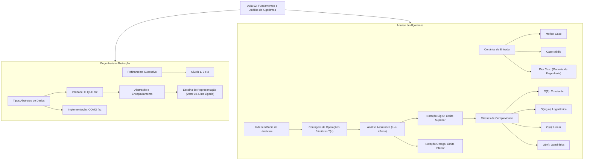

---

## Glossário

| Termo | Definição Técnica |
| :--- | :--- |
| **Refinamento Sucessivo** | Estratégia de projeto *top-down* que decompõe progressivamente um problema amplo até instruções primitivas. |
| **Tipo Abstrato de Dados (TAD)** | Modelo formal que especifica dados e operações públicas, omitindo os detalhes de armazenamento e algoritmo. |
| **Encapsulamento** | Mecanismo que restringe o acesso direto aos estados internos e representações físicas de uma estrutura. |
| **Tamanho da Entrada ($n$)** | Quantidade escalar de elementos ou registros submetidos ao processamento de um algoritmo. |
| **Complexidade Temporal** | Relação matemática entre o tamanho da entrada e o número de operações elementares executadas. |
| **Complexidade Espacial** | Volume de memória física auxiliar exigido pelo algoritmo durante sua computação em função de $n$. |
| **Análise Assintótica** | Estudo do comportamento assintótico de funções quando a variável independente tende ao infinito ($n \to \infty$). |
| **Notação Big O ($O$)** | Delimitação matemática do limite superior (teto assintótico) da taxa de crescimento de um algoritmo. |
| **Notação Big Omega ($\Omega$)** | Delimitação matemática do limite inferior (piso assintótico) de custo de um algoritmo. |
| **Pior Caso** | Instância de entrada de tamanho $n$ que induz o algoritmo a realizar a maior quantidade possível de passos. |
| **LIFO** | *Last In, First Out*: disciplina de acesso onde o último elemento inserido é o primeiro a ser retirado (Pilha). |
| **FIFO** | *First In, First Out*: disciplina de acesso onde o primeiro elemento inserido é o primeiro a ser retirado (Fila). |

---

## Pontos-chave para a prova

1. **Refinamento sucessivo:** Saber transitar do Nível 1 (Abstração) até o Nível 3 (Instruções detalhadas). Em questões dissertativas, estruture a resposta iniciando pela declaração clara das entradas, processamento e saídas.
2. **Definição estrita de TAD:** Lembre-se das três perguntas: quais dados existem, quais operações existem e qual o comportamento esperado. Não mencione vetores ou ponteiros na definição conceitual do TAD.
3. **Diferença entre Interface e Implementação:** Interface = O QUE (métodos públicos); Implementação = COMO (vetor, lista, ponteiros escondidos).
4. **Por que não medir tempo de relógio?** Cite pelo menos 3 fatores de dependência de máquina: velocidade da CPU, carga concorrente do SO e flags de otimização do compilador.
5. **Regras de simplificação Big O:**
   - Descartar termos não dominantes: $3n^2 + 50n + 100 \implies O(n^2)$.
   - Descartar coeficientes constantes: $1000n \implies O(n)$.
6. **Laços aninhados:** 
   - Laço de $1$ a $n$ dentro de laço de $1$ a $n \implies O(n^2)$.
   - Laço com limite interno até $\frac{n}{2} \implies \frac{n^2}{2} \implies O(n^2)$.
7. **Busca Sequencial vs. Binária:**
   - Busca Sequencial: Pior caso = $O(n)$, Melhor caso = $O(1)$.
   - Busca Binária: Exige dados previamente ordenados; Pior caso = $O(\log n)$.

---

## Perguntas e respostas (JSONL)

```jsonl
{"pergunta": "O que caracteriza o processo de refinamento sucessivo?", "resposta": "A decomposição progressiva de um problema geral e abstrato em subproblemas menores até atingir instruções primitivas diretamente implementáveis.", "dificuldade": "facil"}
{"pergunta": "Quais são os três elementos formais definidos por um Tipo Abstrato de Dados (TAD)?", "resposta": "Os dados existentes, as operações que podem ser realizadas sobre eles e o comportamento esperado dessas operações.", "dificuldade": "facil"}
{"pergunta": "Qual a diferença conceitual entre interface e implementação em um TAD?", "resposta": "A interface define O QUE a estrutura faz (operações públicas visíveis), enquanto a implementação define COMO ela faz internamente (código e estruturas escondidas).", "dificuldade": "medio"}
{"pergunta": "Por que a medição de tempo em segundos é inadequada para a análise formal de algoritmos?", "resposta": "Porque o tempo de relógio varia conforme o processador, memória, sistema operacional, linguagem de programação e condições de execução concorrente.", "dificuldade": "facil"}
{"pergunta": "O que representa a variável n na análise de algoritmos?", "resposta": "Representa o tamanho da entrada, ou seja, a quantidade de dados que o algoritmo precisa processar.", "dificuldade": "facil"}
{"pergunta": "Qual é a complexidade temporal da operação de acesso direto x = vetor[i] e por que?", "resposta": "O(1) (constante), pois o endereço é calculado diretamente por fórmula aritmética em tempo fixo, sem necessidade de varrer os elementos anteriores.", "dificuldade": "medio"}
{"pergunta": "Qual a ordem de complexidade resultante de dois laços simples independentes executados em sequência, cada um iterando de 1 até n?", "resposta": "O(n), pois a contagem total de operações é n + n = 2n, e constantes multiplicativas são desconsideradas na análise assintótica.", "dificuldade": "medio"}
{"pergunta": "Por que descartamos as constantes na análise assintótica de algoritmos?", "resposta": "Porque para valores de n tendendo ao infinito, o comportamento do termo dominante dita a ordem de grandeza, tornando as constantes irrelevantes na comparação.", "dificuldade": "medio"}
{"pergunta": "O que define a Notação Big O (O)?", "resposta": "Define o limite superior assintótico da função de custo, garantindo que o algoritmo não crescerá a uma taxa maior do que a função delimitadora para entradas grandes.", "dificuldade": "medio"}
{"pergunta": "Qual é a intuição por trás da Notação Big Omega (Ω)?", "resposta": "Representa o limite inferior assintótico (piso de custo), delimitando o esforço mínimo que o algoritmo precisa despender para executar a tarefa.", "dificuldade": "medio"}
{"pergunta": "No contexto da busca sequencial em uma lista desordenada, qual é o melhor caso e qual a sua complexidade?", "resposta": "O melhor caso ocorre quando o elemento procurado está na primeira posição inspecionada, resultando em complexidade O(1).", "dificuldade": "facil"}
{"pergunta": "No contexto da busca sequencial, qual é o pior caso e qual a sua complexidade?", "resposta": "O pior caso ocorre quando o elemento está na última posição ou não existe na lista, resultando em n comparações e complexidade O(n).", "dificuldade": "facil"}
{"pergunta": "Por que o caso médio da busca linear é O(n) se ele encontra o elemento aproximadamente na posição n/2?", "resposta": "Porque n/2 é equivalente a (1/2) * n, e na análise assintótica o fator constante 1/2 é descartado, mantendo a classe linear O(n).", "dificuldade": "medio"}
{"pergunta": "Ordene as seguintes classes de complexidade da mais eficiente para a menos eficiente: O(n²), O(1), O(n!), O(n), O(log n).", "resposta": "O(1) < O(log n) < O(n) < O(n²) < O(n!).", "dificuldade": "medio"}
{"pergunta": "Como se comporta o custo de um algoritmo de complexidade O(log n) quando dobramos o tamanho da entrada n?", "resposta": "O custo sofre apenas um acréscimo fixo e pequeno (geralmente uma única operação a mais), mantendo o crescimento extremamente lento.", "dificuldade": "dificil"}
{"pergunta": "Qual a complexidade de um algoritmo composto por dois laços aninhados, ambos variando de 1 até n?", "resposta": "O(n²), pois para cada uma das n iterações do laço externo, o laço interno executa n vezes (n * n = n²).", "dificuldade": "facil"}
{"pergunta": "Se um laço aninhado executa de 1 até n/2 enquanto o externo executa de 1 até n, qual a complexidade final?", "resposta": "O(n²), pois n * (n/2) = (1/2)n², que pertence à classe O(n²) após a eliminação da constante multiplicativa.", "dificuldade": "medio"}
{"pergunta": "Por que uma Pilha pode ser implementada tanto com vetor quanto com lista ligada sem afetar quem a utiliza?", "resposta": "Devido à abstração e encapsulamento: a interface pública (Empilhar, Desempilhar) permanece idêntica, isolando a implementação física.", "dificuldade": "medio"}
{"pergunta": "Qual estrutura de dados linear é indicada para uma necessidade de atendimento estritamente em ordem de chegada?", "resposta": "Fila (Queue), pois seu comportamento é do tipo FIFO (First In, First Out).", "dificuldade": "facil"}
{"pergunta": "Qual estrutura de dados linear é indicada para uma necessidade de acesso do tipo último que entra é o primeiro a sair?", "resposta": "Pilha (Stack), pois seu comportamento é do tipo LIFO (Last In, First Out).", "dificuldade": "facil"}
```

---

## Checklist de revisão

- [ ] Sei explicar a diferença entre Nível 1, Nível 2 e Nível 3 no refinamento sucessivo.
- [ ] Compreendo a definição formal de Tipo Abstrato de Dados (TAD) e por que ele não depende da linguagem de programação.
- [ ] Sei diferenciar com precisão os papéis da interface (pública) e da implementação (privada).
- [ ] Compreendo por que a estrutura de Pilha opera sob a política LIFO e a Fila opera sob FIFO.
- [ ] Sei justificar por que medir tempo em segundos no cronômetro do computador não é um método científico de análise de algoritmos.
- [ ] Compreendo o significado da variável $n$ e do conceito de complexidade temporal e espacial.
- [ ] Sei calcular a função exata de contagem de passos $T(n)$ para laços simples e laços sequenciais.
- [ ] Sei aplicar a regra do descarte de termos de menor ordem e de constantes multiplicativas.
- [ ] Sei enunciar formalmente a definição da Notação Big O ($O$) e intuitivamente da Notação Big Omega ($\Omega$).
- [ ] Compreendo como identificar o melhor caso, o pior caso e o caso médio de um algoritmo de busca.
- [ ] Sei de memória a hierarquia das classes de complexidade: $O(1) < O(\log n) < O(n) < O(n \log n) < O(n^2) < O(2^n) < O(n!)$.
- [ ] Sei deduzir por que a busca binária é $O(\log n)$ e a busca sequencial é $O(n)$ no pior caso.
- [ ] Sei deduzir por que um laço aninhado que roda $\frac{n^2}{2}$ vezes continua sendo categorizado como $O(n^2)$.

## Código prático de apoio

Implementações em Java que tornam executáveis os conceitos desta unidade (compilar com `javac *.java`):

- [`MediaTresNotas.java`](codigo/MediaTresNotas.java)
- [`PilhaTAD.java`](codigo/PilhaTAD.java)

