# Aula 03 — Listas ligadas dinâmicas

> **Professor:** Wesley Soares  
> **Disciplina:** Estrutura de Dados I (4º Semestre)  
> **Tema:** Transição de estruturas lineares sequenciais para listas encadeadas dinâmicas em Java, anatomia do nó na memória Heap e análise assintótica de operações fundamentais

---

## Sumário

- [Objetivo da aula](#objetivo-da-aula)
- [Contexto e pré-requisitos](#contexto-e-pré-requisitos)
- [O problema do deslocamento na lista sequencial](#o-problema-do-deslocamento-na-lista-sequencial)
- [Conceito de Nó (Node) e referências em memória](#conceito-de-nó-node-e-referências-em-memória)
- [Alocação dinâmica de objetos na memória Heap](#alocação-dinâmica-de-objetos-na-memória-heap)
- [Estrutura da classe ListaLigada](#estrutura-da-classe-listaligada)
- [Inserção no final com complexidade O(n) e otimização para O(1) usando ponteiro de fim](#inserção-no-final-com-complexidade-on-e-otimização-para-o1-usando-ponteiro-de-fim)
- [Inserção no início com complexidade O(1)](#inserção-no-início-com-complexidade-o1)
- [Busca por índice com complexidade O(n)](#busca-por-índice-com-complexidade-on)
- [Remoção no início com complexidade O(1) e atuação do Garbage Collector](#remoção-no-início-com-complexidade-o1-e-atuação-do-garbage-collector)
- [Remoção no meio e fim com complexidade O(n)](#remoção-no-meio-e-fim-com-complexidade-on)
- [Comparativo de complexidade: Sequencial vs Ligada](#comparativo-de-complexidade-sequencial-vs-ligada)
- [Código da aula](#código-da-aula)
- [Exercícios](#exercícios)
- [Erros comuns e boas práticas](#erros-comuns-e-boas-práticas)
- [Links e materiais complementares](#links-e-materiais-complementares)
- [Mapa da aula](#mapa-da-aula)
- [Glossário](#glossário)
- [Pontos-chave para a prova](#pontos-chave-para-a-prova)
- [Perguntas e respostas (JSONL)](#perguntas-e-respostas-jsonl)
- [Checklist de revisão](#checklist-de-revisão)

---

## Objetivo da aula

- Compreender a falha arquitetural e o gargalo de desempenho das listas sequenciais baseadas em vetores estáticos (arrays) perante operações de inserção e remoção no início ou meio.
- Relacionar a gestão de memória em tempo de execução (segmentos Stack e Heap) ao conceito de referências de objetos da linguagem Java.
- Construir conceitualmente a estrutura atômica de um Nó (*Node*) capaz de auto-referenciar instâncias de sua própria classe.
- Implementar manualmente cadeias de nós encadeados e compreender a topologia de ponteiros na memória.
- Desenvolver a estrutura completa da classe `ListaLigada`, analisando passo a passo as rotinas de inserção, busca e remoção.
- Aplicar a notação Big-O para provar a redução de complexidade de operações críticas, como a otimização de inserção no final de $O(n)$ para $O(1)$ por meio de um ponteiro de cauda (`fim`).
- Entender o ciclo de vida dos objetos abandonados e os gatilhos de atuação do coletor de lixo (*Garbage Collector*).

---

## Contexto e pré-requisitos

Nas Aulas 03 e 04, foram sedimentados os pilares da representação de dados em memória pelo Java:
1. **Memória Stack (Pilha):** Área de alta performance dedicada ao controle de escopo, registros de ativação de métodos e armazenamento de variáveis locais primitivas ou ponteiros de referência.
2. **Memória Heap (Monte):** Região global onde vivem os objetos e matrizes instanciados via operador `new`. Sua alocação é dinâmica, permitindo crescimento em tempo de execução conforme a demanda.
3. **Listas Lineares Sequenciais:** Estruturas baseadas em arrays primitivos (`int[]`, `Object[]`). Embora garantam acesso imediato $O(1)$ por meio de aritmética de ponteiros baseada em índice físico, impõem capacidade fixa inicial e exigem remanejamento em bloco de elementos adjacentes para inserções e exclusões não terminais.

Para absorver a Aula 05, o estudante deve ter domínio pleno sobre o uso de referências, comportamento do ponteiro `null`, exceção `NullPointerException` e análise assintótica básica ($O(1)$, $O(n)$ e $O(n^2)$).

---

## O problema do deslocamento na lista sequencial

### Definição e Motivação

Uma lista linear sequencial organiza seus dados em endereços contíguos de memória física. Isso viabiliza o acesso direto a qualquer posição através da fórmula matemática:

$$\text{Endereço}(i) = \text{EndereçoBase} + (i \times \text{TamanhoElemento})$$

Entretanto, essa contiguidade física cobra um preço computacional severo quando precisamos inserir ou remover um dado sem violar a ordenação relativa dos itens preexistentes.

Considere um vetor com capacidade para 10 inteiros contendo 6 valores ordenados: `[10, 20, 30, 40, 50, 60]`. Se desejarmos inserir o valor `5` na primeira posição física (índice 0), não podemos simplesmente sobrescrever o valor `10`. É mandatário abrir espaço.

### Custo Computacional do Deslocamento

Para abrir a vaga no índice 0, cada elemento atual deve ser copiado para a casa da direita, operando de trás para frente para evitar sobreposição destrutiva:
- Elemento no índice 5 (60) vai para o índice 6;
- Elemento no índice 4 (50) vai para o índice 5;
- ...
- Elemento no índice 0 (10) vai para o índice 1.

Se a lista possuir $N$ elementos, essa operação executará rigorosamente $N$ cópias de memória, caracterizando uma complexidade temporal no pior caso de $O(n)$.

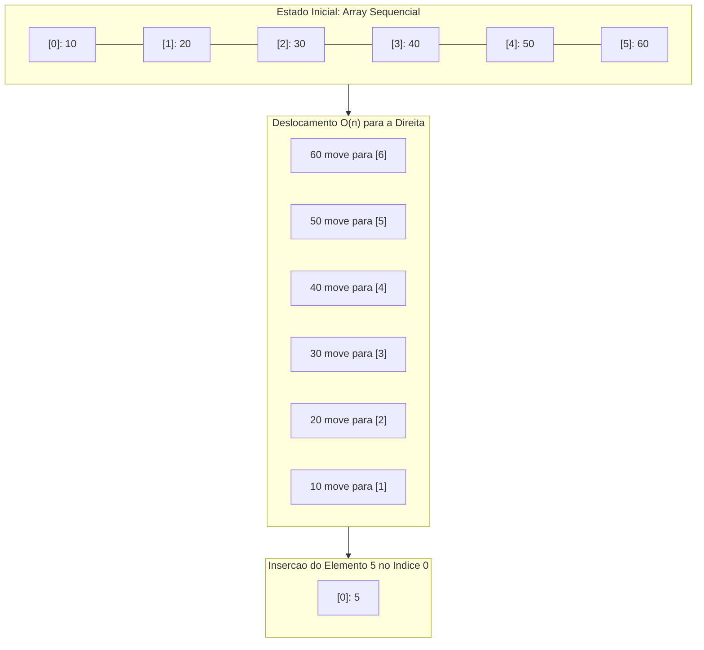

### Tabela de Custos do Array Sequencial

| Operação | Melhor Caso | Caso Médio | Pior Caso | Motivo do Custo |
| :--- | :--- | :--- | :--- | :--- |
| Inserção no Fim (com espaço) | $O(1)$ | $O(1)$ | $O(1)$ | Inserção direta no índice apontado por `tamanho`. |
| Inserção no Início | $O(n)$ | $O(n)$ | $O(n)$ | Deslocamento de todos os $N$ elementos para a direita. |
| Inserção no Meio (posição $k$) | $O(1)$ (se $k = n$) | $O(n)$ | $O(n)$ | Deslocamento de $(N - k)$ elementos. |
| Remoção no Início | $O(n)$ | $O(n)$ | $O(n)$ | Deslocamento de todos os $(N - 1)$ elementos para a esquerda. |

### Contraexemplo e Armadilhas

- **Armadilha do "Aumento de Capacidade Transparente":** Quando o vetor atinge `tamanho == capacidade`, a inserção no final deixa de ser puramente $O(1)$ pontual, exigindo a alocação de um novo array maior (geralmente o dobro do tamanho) e a cópia integral de todos os itens antigos, custando $O(n)$ naquela iteração específica (custo amortizado $O(1)$).
- **Deslocamento incorreto:** Deslocar da esquerda para a direita sobrescreve o valor seguinte com o valor anterior repetidas vezes, corrompendo toda a estrutura de dados.

---

## Conceito de Nó (Node) e referências em memória

### A Mudança de Paradigma

A pergunta fundacional apresentada pelo Prof. Wesley é:
> *"E se não precisarmos realizar o deslocamento? Imagine que cada elemento soubesse: Onde está o próximo elemento?"*

Eliminando o requisito de que os dados ocupem gavetas físicas contíguas de memória, passamos a permitir que os elementos fiquem espalhados em quaisquer endereços disponíveis na memória Heap. A ordem lógica da coleção deixa de depender da vizinhança física e passa a ser garantida por elos lógicos explícitos: **referências de ponteiro**.

### Anatomia da Classe Nó

O Nó (*Node*) é o átomo constituinte de qualquer lista dinâmica encadeada. Trata-se de uma classe simples que encapsula duas partes fundamentais:
1. **Carga Útil (*Payload* ou Valor):** O dado de interesse que a estrutura transporta (neste estágio didático, um número inteiro primitivo `int`).
2. **Elo de Encadeamento (`proximo`):** Uma variável do tipo referência que aponta para outro objeto da mesma classe `No`, ou armazena o literal `null` caso represente a terminação da cadeia.

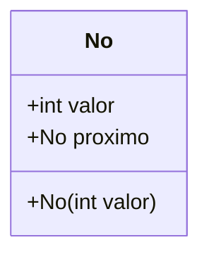

```java
// Implementação didática da unidade básica da lista
public class No {
    public int valor;    // Carga útil armazenada
    public No proximo;   // Referência para a próxima instância de No no Heap

    // Construtor: obriga a passagem do dado e inicializa o elo como nulo
    public No(int valor) {
        this.valor = valor;
        this.proximo = null;
    }
}
```

### Encadeamento Manual Passo a Passo

Para materializar o conceito sem o encapsulamento de uma classe controladora, podemos conectar instâncias manualmente:

```java
// Alocação de dois nós desacoplados no Heap
No primeiro = new No(10);
No segundo = new No(20);

// Criação do elo lógico de amarração
primeiro.proximo = segundo;
```

Nesse momento, a variável local `primeiro` (residente na Stack) detém o endereço do objeto que guarda o valor `10`. O campo interno `proximo` desse primeiro objeto recebe o endereço contido na variável `segundo`. O campo `segundo.proximo` permanece como `null`, determinando formalmente o encerramento da lista.

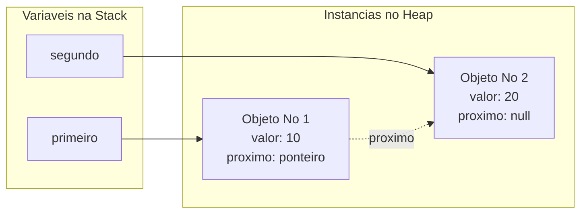

---

## Alocação dinâmica de objetos na memória Heap

### Comparativo Físico: Tipos Primitivos vs. Referências

Conforme explorado na Aula 03, é imperativo distinguir onde reside o valor propriamente dito:
- **Variáveis Primitivas (`int x = 10;`):** O identificador na Stack reserva um espaço de 32 bits e grava diretamente o valor binário `10`.
- **Variáveis de Referência (`No n = new No(10);`):** A variável `n` na Stack reserva apenas o tamanho de um ponteiro de endereço (ex: 64 bits em arquiteturas x86-64). O operador `new` aciona o alocador do Java Runtime no Heap, encontra um bloco livre contendo espaço para a classe `No`, inicializa o objeto e devolve seu endereço hexadecimal (ex: `0x7A01F`), que é atribuído à variável `n`.

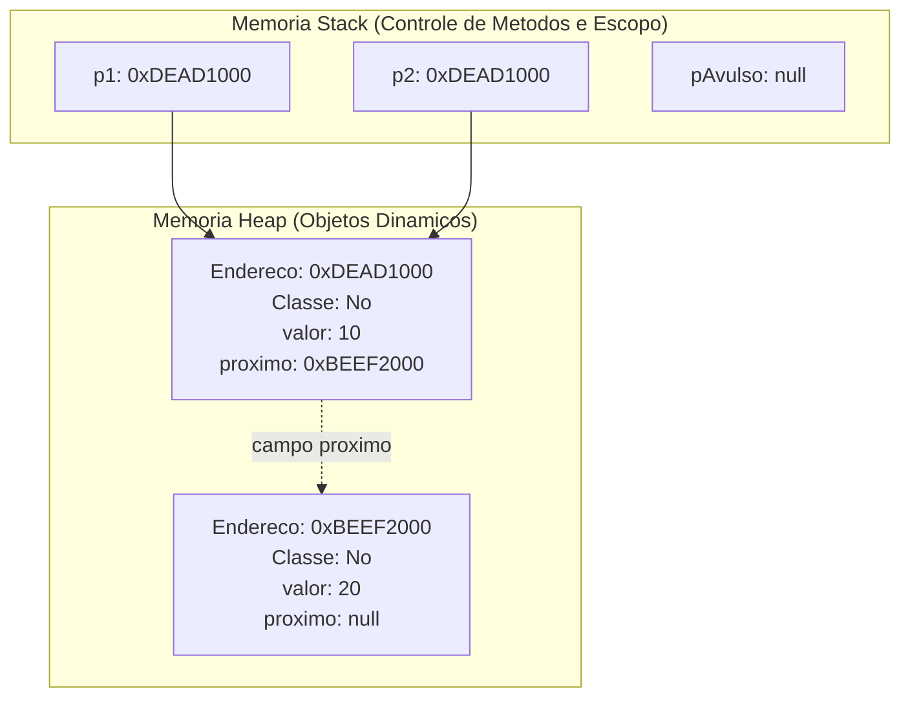

*(Nota de aprofundamento de Engenharia de Software):* Se executarmos `No p2 = p1;`, **nenhum novo objeto é criado no Heap**. O que ocorre é uma cópia da referência de endereço. Ambas as variáveis da Stack passam a apontar para o mesmo objeto no Heap. Qualquer mutação realizada por meio de `p2.valor` ou `p2.proximo` refletirá imediatamente ao inspecionar `p1`.

### A Natureza Descontínua da Lista Ligada

Ao contrário do array sequencial, que demanda da Máquina Virtual Java (JVM) um bloco contíguo ininterrupto de bytes na memória, os nós de uma lista ligada podem ser alocados em regiões fisicamente distantes e fragmentadas do Heap. 

**Vantagem Arquitetural:** Não há necessidade de reorganizar a memória ou reservar lotes maciços de antemão. Cada novo elemento consome apenas a quantidade estrita necessária para si e seu ponteiro.  
**Desvantagem de Hardware:** Perda de localidade espacial de referência de cache (*CPU Cache Locality*), tornando iterações sequenciais ligeiramente mais lentas por ciclo de clock se comparadas a iterações sobre vetores compactos.

---

## Estrutura da classe ListaLigada

### O Papel do Controlador de Estrutura

Manipular nós diretamente através de referências expostas (`primeiro.proximo.proximo...`) é inseguro, frágil e viola os princípios de encapsulamento da Orientação a Objetos. Torna-se imperativo encapsular o comportamento de navegação e integridade em uma classe controladora: a `ListaLigada`.

A propriedade elementar dessa classe é a referência para o primeiro elemento, universalmente denominada `inicio` (ou `head`).

```java
public class ListaLigada {
    // Referencia para o primeiro no da cadeia
    private No inicio;
    
    // Construtor: instancia uma lista inicialmente vazia
    public ListaLigada() {
        this.inicio = null;
    }
}
```

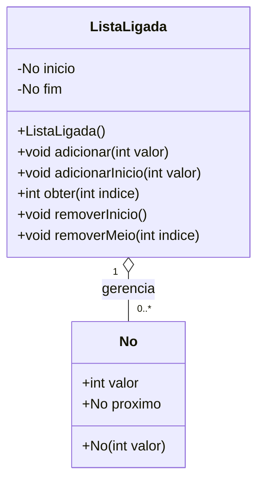

Quando criamos uma instância:
```java
ListaLigada lista = new ListaLigada();
```
Temos na Stack a variável `lista` apontando para o objeto controlador no Heap, cujo atributo interno `inicio` contém `null`. A verificação canônica para saber se uma lista está vazia consiste em validar a condição `this.inicio == null`.

---

## Inserção no final com complexidade O(n) e otimização para O(1) usando ponteiro de fim

### Abordagem Ingênua: Percorrendo a Lista ($O(n)$)

Sem um mecanismo que memorize onde a lista termina, qualquer inclusão no final exige partir do `inicio` e navegar salto a salto até atingir o nó cujo campo `proximo` aponte para `null`.

```java
// Versao preliminar e ineficiente de insercao no final
public void adicionarIngenuo(int valor) {
    No novo = new No(valor);

    // Se a lista estiver vazia, o novo no passa a ser o inicio
    if (this.inicio == null) {
        this.inicio = novo;
        return;
    }

    // Ponteiro auxiliar para navegacao
    No atual = this.inicio;

    // Laco de busca: avanca enquanto houver um proximo no
    while (atual.proximo != null) {
        atual = atual.proximo;
    }

    // Conecta o novo no na cauda da lista
    atual.proximo = novo;
}
```

**Análise de Desempenho:** Se a lista contiver 1.000.000 de nós, o laço `while` iterará 999.999 vezes antes de acoplar o novo elemento. Conforme $N$ cresce, o tempo de execução escala de forma estritamente proporcional: complexidade assintótica $O(n)$.

### Otimização Arquitetural: O Ponteiro `fim` ($O(1)$)

Podemos eliminar o laço de busca mantendo um atributo adicional na classe controladora: `private No fim;` (frequentemente chamado de `tail`). Este ponteiro sempre manterá o endereço do nó terminal.

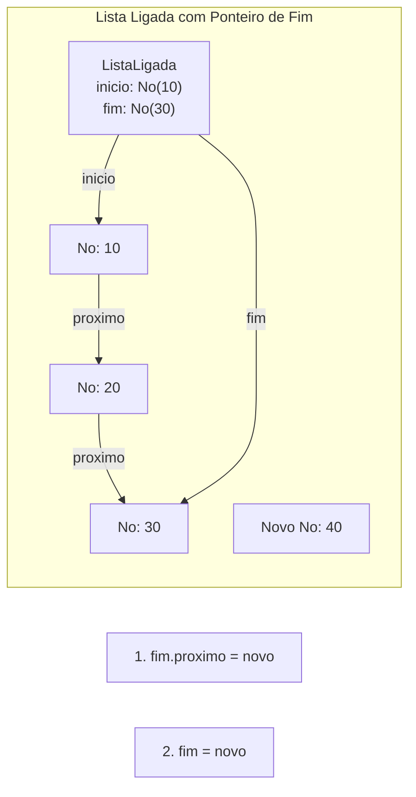

```java
public class ListaLigada {
    private No inicio;
    private No fim; // Ponteiro de cauda para otimizacao O(1)

    public void adicionar(int valor) {
        No novo = new No(valor);

        // Caso 1: Lista Vazia
        if (this.inicio == null) {
            this.inicio = novo;
            this.fim = novo;
            return;
        }

        // Caso 2: Lista com 1 ou mais elementos
        this.fim.proximo = novo; // O antigo ultimo aponta para o recem-chegado
        this.fim = novo;         // O ponteiro fim passa a apontar para o novo ultimo
    }
}
```

### Comparativo da Inserção no Fim

| Estratégia | Instruções Executadas | Complexidade | Escalabilidade |
| :--- | :--- | :--- | :--- |
| Sem ponteiro de cauda | $N$ iterações no laço `while` | $O(n)$ | Degrada com o aumento da lista |
| Com ponteiro de cauda (`fim`) | 2 reatribuições diretas de ponteiro | $O(1)$ | Desempenho constante e instantâneo |

---

## Inserção no início com complexidade O(1)

### O Algoritmo de Inserção na Cabeça

Diferente do array sequencial, onde a inserção no índice 0 exige empurrar $N$ posições para a direita, na lista encadeada dinâmica a inserção no início resume-se a reorganizar dois apontamentos de memória, independentemente de a lista ter dez ou dez bilhões de nós.

O processo exige estrita obediência à ordem de execução:
1. Instanciar o `No novo = new No(valor);`
2. Apontar o elo `novo.proximo` para o atual `inicio` da lista;
3. Atualizar o ponteiro `inicio` da classe controladora para assumir o `novo`.
4. *(Tratamento de integridade):* Se a lista estava vazia antes da operação, o ponteiro `fim` também deve passar a apontar para esse mesmo nó.

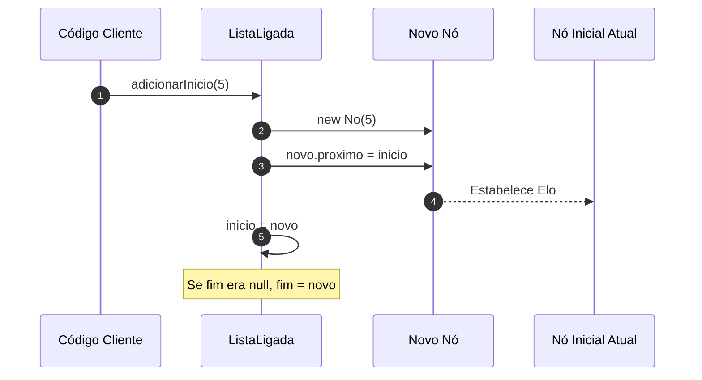

```java
public void adicionarInicio(int valor) {
    No novo = new No(valor);

    // O novo no deve apontar para onde a lista comecava
    novo.proximo = this.inicio;

    // O controlador agora reconhece o novo elemento como o inicio
    this.inicio = novo;

    // Se a lista estava vazia, o primeiro tambem se torna o ultimo
    if (this.fim == null) {
        this.fim = novo;
    }
}
```

### Armadilha Crítica: Inversão de Atribuições

Se a ordem for invertida de maneira descuidada:
```java
// CODIGO COM DEFEITO CATASTROFICO:
this.inicio = novo;
novo.proximo = this.inicio; // novo.proximo aponta para si mesmo!
```
Ao executar `inicio = novo` primeiro, perde-se a referência da antiga cabeça da lista. Ao tentar fazer `novo.proximo = inicio`, você conecta o nó a si mesmo, gerando uma referência circular infinita e perdendo irreparavelmente todos os nós subsequentes da lista no Heap.

---

## Busca por índice com complexidade O(n)

### A Perda do Acesso Aleatório

No array, a consulta por índice é $O(1)$ porque o endereço físico exato de cada célula é derivado matematicamente pelo compilador. Na lista encadeada dinâmica, **o índice não existe fisicamente gravado na memória**. Ele é apenas um conceito abstrato que indica quantos saltos de elo a partir de `inicio` são necessários para alcançar a posição almejada.

Para obter o dado residente no "índice 4", o algoritmo precisa obrigatoriamente visitar os índices 0, 1, 2 e 3 em sequência obrigatória.

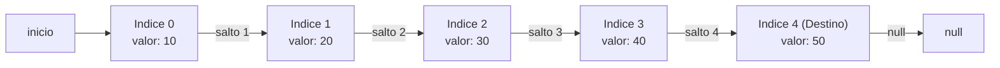

```java
public int obter(int indice) {
    // Validacao preliminar de indices negativos
    if (indice < 0) {
        throw new IndexOutOfBoundsException("Indice invalido: " + indice);
    }

    No atual = this.inicio;

    // Caminha exatamente a quantidade de passos requerida pelo indice
    for (int i = 0; i < indice; i++) {
        if (atual == null) {
            throw new IndexOutOfBoundsException("Indice fora dos limites da lista: " + indice);
        }
        atual = atual.proximo;
    }

    // Se apos os saltos o no atual for nulo, a lista acabou prematuramente
    if (atual == null) {
        throw new IndexOutOfBoundsException("Indice fora dos limites da lista: " + indice);
    }

    return atual.valor;
}
```

### Análise Assintótica da Busca

- **Melhor Caso:** Obter o índice 0 (cabeça). Executa 0 passos no laço: $O(1)$.
- **Pior Caso:** Obter o índice $(N - 1)$ ou tentar acessar um índice que não existe no final da lista. Percorre integralmente os nós: $O(n)$.
- **Caso Médio:** Navegar até $N/2$ nós: $\frac{N}{2}$ passos assintoticamente equivalente a $O(n)$.

---

## Remoção no início com complexidade O(1) e atuação do Garbage Collector

### Mecanismo de Remoção da Cabeça

Descartar o primeiro item da lista ligada requer apenas avançar a referência `inicio` para o segundo nó da fila (`inicio = inicio.proximo`). Com isso, a lista dinamicamente "esquece" o nó anterior.

```java
public void removerInicio() {
    // Caso 1: Lista vazia nao ha o que remover
    if (this.inicio == null) {
        return;
    }

    // Caso 2: Avanca o ponteiro de inicio para o proximo elemento
    this.inicio = this.inicio.proximo;

    // Caso 3: Se a lista continha apenas um elemento e agora ficou vazia
    if (this.inicio == null) {
        this.fim = null;
    }
}
```

### A Ação do Garbage Collector (GC)

Diferente de linguagens de baixo nível como C (onde seria compulsório invocar funções manuais como `free(ptr)` sob risco de vazamento de memória / *memory leak*), o Java implementa uma esteira automática de coleta de lixo.

O coletor de lixo da JVM emprega algoritmos baseados em grafos de acessibilidade (*Reachability Analysis* a partir de *GC Roots*).
1. Enquanto o nó estava no início, ele podia ser alcançado pela variável `lista` (na Stack) através do atributo `inicio`.
2. Ao realizar `inicio = inicio.proximo;`, o nó desanexado fica isolado no Heap: não existe mais nenhuma variável local ou estática da Stack capaz de traçar um caminho navegável até ele.
3. O nó torna-se imediatamente elegível para coleta. Em um ciclo futuro, o GC reciclará o espaço ocupado por aquele objeto no Heap de forma assíncrona.

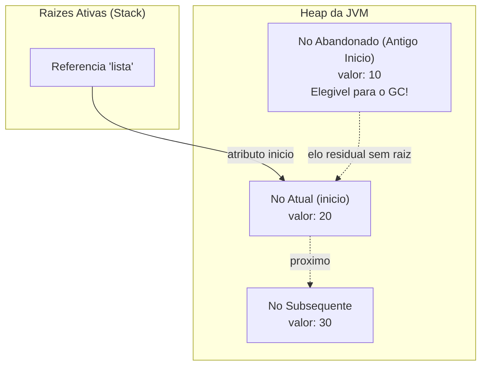

---

## Remoção no meio e fim com complexidade O(n)

### A Lógica do "Bypass" (Desvio de Ponteiro)

Para remover um nó situado em uma posição intermediária $k$ da lista, precisamos que o nó antecessor ($k - 1$) aponte diretamente para o nó sucessor ($k + 1$). O nó alvo fica "ignorado" no meio do caminho e se desvincula da sequência.

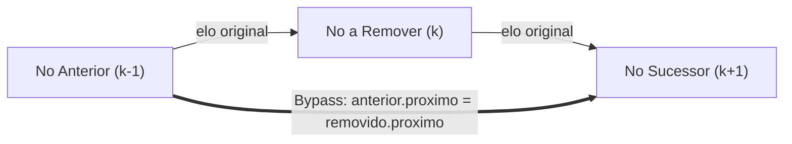

### Algoritmo Completo de Remoção por Posição

```java
public void removerMeio(int indice) {
    // 1. Verificacao de lista vazia ou indice invalido
    if (this.inicio == null || indice < 0) {
        return;
    }

    // 2. Se a remocao for no indice zero, delega para a rotina O(1)
    if (indice == 0) {
        removerInicio();
        return;
    }

    No atual = this.inicio;

    // 3. Percorre ate encontrar o no ANTERIOR ao alvo que sera excluido (indice - 1)
    for (int i = 0; i < indice - 1; i++) {
        if (atual.proximo == null) {
            return; // Indice solicitado alem dos limites existentes
        }
        atual = atual.proximo;
    }

    // 4. Se nao existe o proximo no, o indice alvo nao existe
    if (atual.proximo == null) {
        return;
    }

    // 5. Captura o no a ser removido
    No removido = atual.proximo;

    // 6. Realiza o desvio ("pula" o no removido)
    atual.proximo = removido.proximo;

    // 7. Atualizacao de integridade: se removemos o ultimo elemento, atualiza fim
    if (removido == this.fim) {
        this.fim = atual;
    }
}
```

### Por que a Remoção no Meio é O(n)?

A manipulação de referências `atual.proximo = removido.proximo;` custa rigorosamente $O(1)$ de tempo de processamento. No entanto, a necessidade incontornável de **encontrar o nó antecessor** através de um laço linear que parte da cabeça impõe um custo de varredura prévio proporcional ao índice buscado. Pela regra de análise de algoritmos:

$$\text{Tempo Total} = \underbrace{O(n)}_{\text{Busca do antecessor}} + \underbrace{O(1)}_{\text{Desvio de elo}} = O(n)$$

---

## Comparativo de complexidade: Sequencial vs Ligada

A decisão entre adotar uma representação sequencial ou uma lista ligada é uma clássica escolha de engenharia de software (*trade-off*), dependendo das operações mais frequentes da aplicação.

### Matriz de Complexidade Temporal e Espacial

| Operação | Lista Sequencial (Array) | Lista Ligada Dinâmica | Vencedor e Racional |
| :--- | :--- | :--- | :--- |
| **Acesso por Índice** | $O(1)$ | $O(n)$ | **Sequencial:** Acesso direto via cálculo de offset em hardware. |
| **Inserção no Início** | $O(n)$ | $O(1)$ | **Ligada:** Ajuste imediato do elo de ponteiro sem deslocar elementos. |
| **Inserção no Fim** | $O(1)$ amortizado | $O(1)$ com `fim` | **Empate:** Ambas operam em tempo constante se a ligada tiver cauda. |
| **Inserção no Meio** | $O(n)$ | $O(n)$ | **Empate técnico:** Ambos são $O(n)$, mas o array gasta tempo movendo bytes e a ligada gasta tempo navegando nós. |
| **Remoção no Início** | $O(n)$ | $O(1)$ | **Ligada:** Sem necessidade de puxar a fila de dados para trás. |
| **Remoção no Fim** | $O(1)$ | $O(n)$ em simplesmente ligada | **Sequencial:** Reduz o contador `tamanho--`. Na ligada simples, precisa achar o penúltimo nó. |
| **Uso de Memória** | Mínimo por elemento; desperdício em espaço ocioso do array | Sobrecarga de ponteiro (4 a 8 bytes extras por nó) | **Depende:** Arrays desperdiçam se superdimensionados; ligadas gastam com ponteiros. |

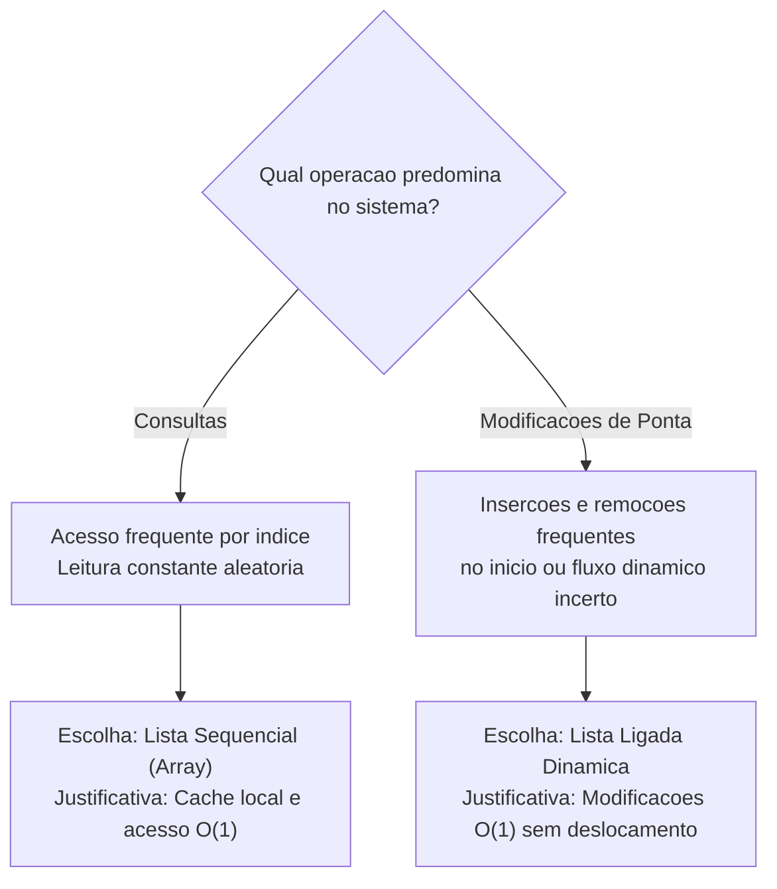

---

## Código da aula

Os três arquivos essenciais da aula foram estruturados em conformidade com o material do professor e as melhores práticas de encapsulamento em Java:

### 1. Classe `No.java`
Localização relativa: [./codigo/No.java](./codigo/No.java)

Esta classe modela o nó elementar. Ela não possui inteligência sobre a lista, servindo exclusivamente como agregador de dados e ponteiro de elo.

```java
package codigo;

/**
 * Representa a unidade basica de armazenamento de uma lista ligada.
 */
public class No {
    public int valor;    // Carga util (dado manipulado)
    public No proximo;   // Referencia para o proximo objeto No na memoria Heap

    /**
     * Construtor que recebe obrigatoriamente o valor do elemento.
     * O ponteiro de encadeamento 'proximo' e inicializado como nulo por padrao.
     */
    public No(int valor) {
        this.valor = valor;
        this.proximo = null;
    }
}
```

### 2. Classe `ListaLigada.java`
Localização relativa: [./codigo/ListaLigada.java](./codigo/ListaLigada.java)

Implementa a lista encadeada dinâmica completa, encapsulando as referências `inicio` e `fim`, provendo métodos protegidos para modificação e consulta.

```java
package codigo;

/**
 * Estrutura de Lista Dinamica Simplesmente Encadeada.
 */
public class ListaLigada {
    private No inicio; // Aponta para a cabeca da lista
    private No fim;    // Aponta para a cauda da lista (otimizacao O(1))

    public ListaLigada() {
        this.inicio = null;
        this.fim = null;
    }

    /**
     * Insere um novo no no final da lista com complexidade O(1).
     */
    public void adicionar(int valor) {
        No novo = new No(valor);

        if (this.inicio == null) {
            this.inicio = novo;
            this.fim = novo;
            return;
        }

        this.fim.proximo = novo;
        this.fim = novo;
    }

    /**
     * Insere um novo no no comeco da lista com complexidade O(1).
     */
    public void adicionarInicio(int valor) {
        No novo = new No(valor);
        novo.proximo = this.inicio;
        this.inicio = novo;

        if (this.fim == null) {
            this.fim = novo;
        }
    }

    /**
     * Recupera o valor armazenado em um determinado indice logico (complexidade O(n)).
     */
    public int obter(int indice) {
        if (indice < 0) {
            throw new IndexOutOfBoundsException("Indice negativo: " + indice);
        }

        No atual = this.inicio;
        for (int i = 0; i < indice; i++) {
            if (atual == null) {
                throw new IndexOutOfBoundsException("Indice extrapola o tamanho: " + indice);
            }
            atual = atual.proximo;
        }

        if (atual == null) {
            throw new IndexOutOfBoundsException("Indice extrapola o tamanho: " + indice);
        }

        return atual.valor;
    }

    /**
     * Remove o primeiro no da lista com complexidade O(1).
     */
    public void removerInicio() {
        if (this.inicio == null) {
            return;
        }

        this.inicio = this.inicio.proximo;

        // Se a lista esvaziou por completo, sincroniza o ponteiro de fim
        if (this.inicio == null) {
            this.fim = null;
        }
    }

    /**
     * Remove o elemento de uma posicao logica especifica (complexidade O(n)).
     */
    public void removerMeio(int indice) {
        if (this.inicio == null || indice < 0) {
            return;
        }

        if (indice == 0) {
            removerInicio();
            return;
        }

        No atual = this.inicio;
        for (int i = 0; i < indice - 1; i++) {
            if (atual.proximo == null) {
                return;
            }
            atual = atual.proximo;
        }

        if (atual.proximo == null) {
            return;
        }

        No removido = atual.proximo;
        atual.proximo = removido.proximo;

        if (removido == this.fim) {
            this.fim = atual;
        }
    }

    /**
     * Metodo utilitario para inspecao visual da estrutura no terminal.
     */
    public void imprimir() {
        No atual = this.inicio;
        System.out.print("Lista: [ ");
        while (atual != null) {
            System.out.print(atual.valor + " -> ");
            atual = atual.proximo;
        }
        System.out.println("null ]");
    }
}
```

### 3. Classe `Main.java`
Localização relativa: [./codigo/Main.java](./codigo/Main.java)

Ponto de entrada do sistema para executar o teste dos métodos e validar os exercícios práticos de fixação.

```java
package codigo;

public class Main {
    public static void main(String[] args) {
        System.out.println("=== TESTE DA LISTA LIGADA DINAMICA ===");
        ListaLigada lista = new ListaLigada();

        // Testando insercao no fim O(1)
        lista.adicionar(10);
        lista.adicionar(20);
        lista.adicionar(30);
        lista.adicionar(40);
        lista.adicionar(50);
        lista.adicionar(60);
        lista.imprimir(); // Esperado: 10 -> 20 -> 30 -> 40 -> 50 -> 60 -> null

        // Insercao no inicio O(1)
        System.out.println("\nInserindo o valor 5 no inicio...");
        lista.adicionarInicio(5);
        lista.imprimir(); // Esperado: 5 -> 10 -> 20 -> 30 -> 40 -> 50 -> 60 -> null

        // Testando consulta por indice O(n)
        System.out.println("\nValor no indice 0: " + lista.obter(0)); // 5
        System.out.println("Valor no indice 3: " + lista.obter(3)); // 20

        // Testando remocao do inicio O(1)
        System.out.println("\nRemovendo do inicio...");
        lista.removerInicio();
        lista.imprimir(); // Esperado: 10 -> 20 -> 30 -> 40 -> 50 -> 60 -> null

        // Testando remocao intermediaria O(n) (remover valor 30 que esta no indice 2)
        System.out.println("\nRemovendo o elemento do indice 2 (valor 30)...");
        lista.removerMeio(2);
        lista.imprimir(); // Esperado: 10 -> 20 -> 40 -> 50 -> 60 -> null
    }
}
```

---

## Exercícios

### Exercício 1: Criação da Classe Nó e Lista Manual
*(Original do material do Prof. Wesley Soares)*

**Enunciado:**  
Crie uma classe chamada `No` em Java com atributos `valor` (int) e `proximo` (`No`). Ela deverá ter um construtor inicializando o valor. Em seguida, crie manualmente em um método `main` uma cadeia conectando os nós com os valores 1, 2 e 3 sem utilizar a classe `ListaLigada`.

**Raciocínio:**  
Para instanciar três nós independentes no Heap, precisamos invocar o construtor três vezes com o operador `new`. Para transformá-los em uma lista conexa, devemos amarrar a referência `proximo` do primeiro ao segundo nó, e a do segundo ao terceiro nó. O terceiro nó manterá seu campo `proximo` como `null`.

**Resolução:**
```java
// Criacao das variaveis locais de referencia e alocacao dos tres objetos no Heap
No n1 = new No(1);
No n2 = new No(2);
No n3 = new No(3);

// Conectando os nos manualmente
n1.proximo = n2; // n1 aponta para n2
n2.proximo = n3; // n2 aponta para n3
// n3.proximo permanece null, sinalizando o fim da lista
```
Código de validação presente em: [./codigo/Main.java](./codigo/Main.java)

---

### Exercício 2: Análise de Referências e Garbage Collector
*(Original do material do Prof. Wesley Soares)*

**Enunciado:**  
Considerando o código de criação manual da lista ligada com três nós (`n1`, `n2` e `n3`):
```java
No n1 = new No(10);
No n2 = new No(20);
No n3 = new No(30);
n1.proximo = n2;
n2.proximo = n3;
```
Responda tecnicamente:
1. Quantos objetos foram criados no Heap?
2. Quantas referências do tipo `No` existem no programa?
3. Qual é o valor retornado por: `n1.proximo.valor`?
4. Qual é o valor retornado por: `n1.proximo.proximo.valor`?
5. O que acontece com a lista e a memória se executarmos: `n2 = null;`?

**Raciocínio e Resolução Detalhada:**
1. **Foram criados 3 objetos no Heap.** Cada invocação explícita de `new No(...)` materializa uma nova instância no Heap.
2. **Existem 5 variáveis de referência no total:**
   - 3 variáveis locais de referência na Stack: `n1`, `n2` e `n3`.
   - 2 variáveis internas de referência encapsuladas nos objetos do Heap: `n1.proximo` e `n2.proximo`. (O campo `n3.proximo` contém o literal `null`).
3. **Retorna o valor inteiro `20`.** `n1.proximo` alcança o segundo objeto, cujo atributo `valor` armazena 20.
4. **Retorna o valor inteiro `30`.** `n1.proximo` atinge o segundo objeto, e `.proximo` a partir deste atinge o terceiro objeto, cujo `valor` é 30.
5. **Nenhum nó é coletado pelo Garbage Collector e a lista permanece intacta.** Ao fazer `n2 = null;`, destruímos apenas o ponteiro direto da variável local `n2` da Stack para o segundo objeto. Contudo, o segundo nó **continua perfeitamente acessível** através do caminho `n1.proximo`. Por transitividade de alcance a partir do GC Root `n1`, o segundo nó não está órfão e não se torna elegível para o Garbage Collector.

---

### Exercício 3: Desafio Final de Referências
*(Original do material do Prof. Wesley Soares)*

**Enunciado:**  
Analise o seguinte trecho de código:
```java
No n1 = new No(10);
No n2 = new No(20);
No n3 = new No(30);
n1.proximo = n2;
n2.proximo = n3;
n2 = null;
```
Explique o que acontece com a acessibilidade dos nós e se algum deles se torna elegível para o Garbage Collector.

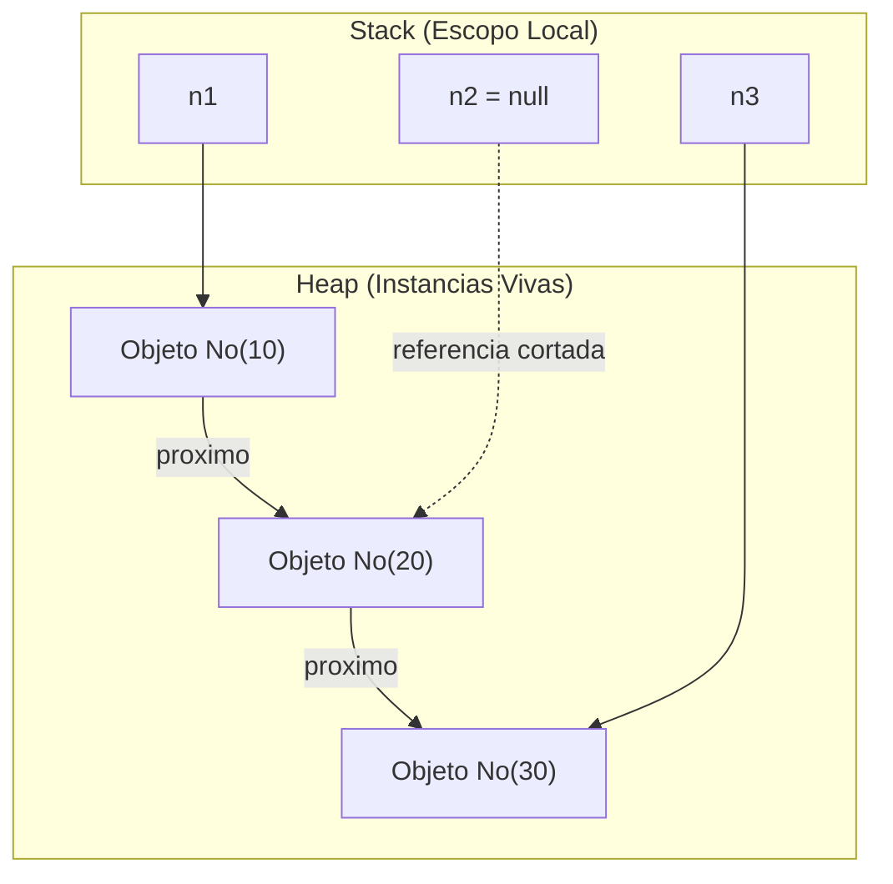

**Raciocínio e Resolução:**  
- **Objeto 1 (10):** Acessível diretamente via `n1`.
- **Objeto 2 (20):** Embora a variável local `n2` tenha sido anulada, o objeto ainda tem uma referência ativa vinda de `n1.proximo`. Portanto, ele é acessível por encadeamento.
- **Objeto 3 (30):** É duplamente acessível: de forma direta pela variável de referência `n3`, e de forma indireta pela cadeia `n1.proximo.proximo`.
- **Conclusão:** Nenhum dos três nós se torna elegível para o Garbage Collector, pois todos possuem rotas ativas de acessibilidade a partir de referências ativas na pilha de execução (Stack).

---

### Exercício 4: Implementação Completa da Lista Ligada
*(Exercício Prático de Fixação)*

**Enunciado:**  
Implemente a estrutura completa da classe `ListaLigada` em Java contendo todos os métodos abordados: inserção no fim otimizada $O(1)$, inserção no início $O(1)$, consulta por índice $O(n)$, remoção no início $O(1)$ e remoção no meio $O(n)$. Adicione uma classe `Main` demonstrando a manipulação e a integridade da lista após operações sucessivas.

**Raciocínio:**  
A integridade dos ponteiros de ponta (`inicio` e `fim`) deve ser preservada em todos os cenários limite: quando a lista estiver vazia, quando contiver apenas um nó e quando a remoção atingir o último item.

**Resolução:**  
Implementação completa e modularizada demonstrada integralmente na seção [Código da aula](#código-da-aula) e validada em [./codigo/ListaLigada.java](./codigo/ListaLigada.java).

---

## Erros comuns e boas práticas

### 1. Inversão na Inserção da Cabeça (Criação de Laço Circular)
- **Erro:** Fazer `inicio = novo;` antes de `novo.proximo = inicio;`.
- **Consequência:** `novo.proximo` aponta para si mesmo. A lista vira um ciclo infinito de tamanho 1 e todo o restante dos dados antigos é desalocado pelo GC.
- **Boa Prática:** Sempre aponte os elos do nó recém-criado para a estrutura existente antes de redirecionar as referências principais da classe.

### 2. Esquecer de Sincronizar o Ponteiro `fim`
- **Erro:** Remover o último nó da lista em `removerInicio()` e não definir `fim = null;`, ou em `removerMeio()` e não apontar `fim` para o penúltimo.
- **Consequência:** O ponteiro `fim` torna-se um ponteiro órfão ou inconsistente (*dangling pointer* lógico), quebrando a próxima chamada de `adicionar()`.
- **Boa Prática:** Sempre que a lista esvaziar ou o nó terminal for removido, atualize expressamente `fim`.

### 3. Iterar com `for` Usando `obter(i)` em Sequência
- **Erro Comum de Performance:**
  ```java
  // ANTIPADRAO GRAVE DE DESEMPENHO:
  for (int i = 0; i < n; i++) {
      System.out.println(lista.obter(i));
  }
  ```
- **Consequência:** Cada chamada a `obter(i)` recomeça a busca do início da lista. Para percorrer a lista inteira dessa forma, o algoritmo executa $0 + 1 + 2 + \dots + (N - 1)$ passos, transformando uma simples leitura em um desastre de performance quadrática: **$O(n^2)$**!
- **Boa Prática:** Use um ponteiro auxiliar temporário (`No atual = inicio; while (atual != null)...`) para navegar pela lista com complexidade linear $O(n)$, ou implemente a interface `Iterable` do Java.

### 4. `NullPointerException` ao Percorrer a Lista
- **Erro:** Avaliar `atual.proximo.valor` sem antes verificar se `atual` ou `atual.proximo` é diferente de `null`.
- **Boa Prática:** Sempre estruture a guarda do laço com `while (atual != null)` (para processar todos os nós) ou `while (atual.proximo != null)` (quando precisar parar exatamente no último nó).

---

## Links e materiais complementares

- **Notion Oficial da Aula (Prof. Wesley Soares):** [ED I Aula 05 - Listas ligadas dinâmicas](https://outgoing-salt-444.notion.site/ED-I-Aula-05-Ligas-ligadas-din-micas-3ce8a4f8f8a780658e71e231669cbb5f) — Contém as ilustrações originais da lousa e sequenciamento didático do curso.
- **Documentação Oficial Java SE (`java.util.LinkedList`):** [Oracle Java Documentation](https://docs.oracle.com/en/java/javase/17/docs/api/java.base/java/util/LinkedList.html) — Especificação oficial da biblioteca padrão de listas duplamente encadeadas da linguagem Java.
- **Visualgo - Visualização de Estruturas de Dados:** [Visualgo Linked List](https://visualgo.net/en/list) — Simulador interativo em tempo real para visualizar a reorganização dos elos de ponteiro na memória durante inserções e deleções.
- **Artigo Técnico JVM Anatomy Park:** Exploração detalhada de como ponteiros comprimidos (*Compressed OOPs*) e o layout de cabeçalho de objetos (*Object Headers*) se comportam na memória Heap.

---

## Mapa da aula

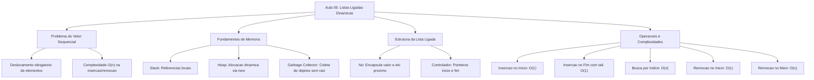

---

## Glossário

| Termo | Definição Técnica |
| :--- | :--- |
| **Nó (*Node*)** | Unidade atômica estrutural que encapsula um dado (valor) e pelo menos uma referência de ponteiro para outro nó. |
| **Ponteiro / Referência** | Variável cujo conteúdo é o endereço físico ou lógico de um objeto residente na memória Heap. |
| **Memória Stack** | Região da memória utilizada para gerenciar chamadas de métodos, escopos de execução e variáveis primitivas ou locais. |
| **Memória Heap** | Segmento global de memória gerenciado pela JVM onde são instanciados todos os objetos e arrays dinâmicos. |
| **Garbage Collector (GC)** | Processo automático da máquina virtual Java responsável por identificar e desalocar memória de objetos inacessíveis. |
| **Deslocamento (*Shift*)** | Operação mecânica necessária em arrays sequenciais para abrir espaço ou fechar lacunas de elementos. |
| **Ponteiro de Cauda (*Tail / Fim*)** | Referência adicional mantida na classe controladora que aponta para o último nó, viabilizando inserção em $O(1)$. |
| **NullPointerException** | Exceção disparada em tempo de execução ao tentar desreferenciar (acessar campos ou métodos de) uma referência nula. |
| **Complexidade Amortizada** | Média ponderada do custo de uma operação ao longo de uma sequência extensa de execuções (ex: redimensionamento de array). |
| **Localidade de Referência** | Princípio de hardware pelo qual dados dispostos sequencialmente em blocos contíguos aproveitam melhor a cache da CPU. |

---

## Pontos-chave para a prova

- **Inserção no Início:** Enquanto no vetor tradicional ela é $O(n)$ devido ao deslocamento físico de todos os itens, na lista ligada ela é **$O(1)$** porque envolve apenas conectar o novo nó ao antigo início e mover a referência `inicio`.
- **Acesso Aleatório por Posição:** No array é **$O(1)$** graças ao cálculo de offset na memória contígua. Na lista encadeada dinâmica é **$O(n)$**, pois é obrigatório caminhar sequencialmente nó por nó desde a cabeça (`inicio`).
- **Otimização do Ponteiro `fim`:** Sem o ponteiro `fim`, a inserção na cauda exige laço de repetição `while(atual.proximo != null)` sendo $O(n)$. Com o ponteiro `fim`, a inserção cai para **$O(1)$**.
- **Garbage Collector:** Um nó só é recolhido pelo coletor de lixo se não houver **nenhuma rota de referências ativas** partindo da Stack (GC Roots) até ele. Fazer uma referência local receber `null` não elimina o objeto se ele ainda estiver conectado ao elo de outro nó ativo.
- **Ordem dos Ponteiros:** Na inserção no início, a ordem das atribuições é estrita: primeiro faz-se `novo.proximo = inicio;` e somente depois `inicio = novo;`. A inversão destrói a lista e gera um ciclo fechado.

---

## Perguntas e respostas (JSONL)

```jsonl
{"pergunta": "Qual a principal desvantagem da lista linear sequencial na inserção no início?", "resposta": "A necessidade de deslocar todos os N elementos existentes para a direita, gerando complexidade O(n).", "dificuldade": "facil"}
{"pergunta": "O que constitui a classe No em uma lista ligada simples?", "resposta": "Um campo para armazenar o dado (valor) e uma referência de ponteiro para o próximo nó da mesma classe.", "dificuldade": "facil"}
{"pergunta": "Onde residem os objetos instanciados com o operador new em Java?", "resposta": "Na memória Heap.", "dificuldade": "facil"}
{"pergunta": "Qual a complexidade de tempo da inserção no final de uma lista ligada que não possui o ponteiro fim?", "resposta": "O(n), pois é necessário percorrer toda a lista do início até o último nó.", "dificuldade": "facil"}
{"pergunta": "Como o ponteiro fim otimiza a inserção no final de uma lista ligada?", "resposta": "Permite anexar o novo elemento diretamente no último nó sem percorrer a lista, reduzindo a complexidade para O(1).", "dificuldade": "facil"}
{"pergunta": "Por que a busca por índice na lista ligada dinâmica é O(n)?", "resposta": "Porque a lista não possui endereçamento físico contíguo, exigindo navegação sequencial nó a nó a partir do início.", "dificuldade": "medio"}
{"pergunta": "O que acontece em tempo de execução se invertermos as linhas de inserção no início para: inicio = novo; novo.proximo = inicio;?", "resposta": "Cria-se um nó com referência circular para si mesmo e perde-se a referência para o restante dos nós da lista original.", "dificuldade": "medio"}
{"pergunta": "Qual a complexidade da remoção no início de uma lista dinâmica?", "resposta": "O(1), pois basta redirecionar o ponteiro de início para o segundo nó da cadeia.", "dificuldade": "facil"}
{"pergunta": "Qual critério o Garbage Collector do Java utiliza para desalocar um nó da memória?", "resposta": "A inacessibilidade do objeto a partir das raízes de execução ativas (GC Roots) na memória Stack.", "dificuldade": "medio"}
{"pergunta": "Se temos n1 apontando para o Nó A, e A.proximo apontando para o Nó B, o que ocorre ao fazermos n1 = null?", "resposta": "Tanto o Nó A quanto o Nó B tornam-se inacessíveis para o programa e elegíveis para desalocação pelo Garbage Collector.", "dificuldade": "medio"}
{"pergunta": "Se fizermos n2 = null em uma cadeia n1 -> n2 -> n3, por que o nó que era apontado por n2 não é coletado pelo GC?", "resposta": "Porque ele continua referenciado pelo elo proximo do nó n1, permanecendo acessível a partir da Stack via n1.", "dificuldade": "medio"}
{"pergunta": "Por que a remoção no meio de uma lista ligada é O(n) se o ajuste do ponteiro é O(1)?", "resposta": "Porque o custo assintótico é dominado pelo tempo necessário para percorrer a lista e localizar o nó anterior ao que será removido.", "dificuldade": "medio"}
{"pergunta": "O que ocorre se tentarmos acessar o valor de um nó cujo ponteiro de referência é null?", "resposta": "A máquina virtual Java lança a exceção NullPointerException.", "dificuldade": "facil"}
{"pergunta": "Por que arrays têm melhor desempenho em laços de repetição sequenciais em comparação a listas ligadas?", "resposta": "Devido à localidade de referência espacial, que aproveita o carregamento de linhas de cache da CPU.", "dificuldade": "dificil"}
{"pergunta": "Como deve ser atualizado o ponteiro fim na remoção do último elemento em removerMeio?", "resposta": "O ponteiro fim deve passar a apontar para o nó anterior que agora se tornou a cauda da lista.", "dificuldade": "dificil"}
{"pergunta": "O que representa o valor null no atributo proximo de um nó?", "resposta": "Indica a ausência de um nó sucessor, marcando formalmente o final da lista ligada.", "dificuldade": "facil"}
{"pergunta": "Qual a complexidade assintótica de iterar sobre uma lista ligada de N elementos chamando lista.obter(i) dentro de um for de 0 a N-1?", "resposta": "Complexidade O(n^2), pois cada chamada ao método obter recomeça a caminhada desde a cabeça da lista.", "dificuldade": "dificil"}
```

---

## Checklist de revisão

- [ ] Sei explicar a limitação fundamental do deslocamento $O(n)$ em listas sequenciais.
- [ ] Entendo com precisão a diferença física entre as memórias Stack (referências locais) e Heap (objetos).
- [ ] Consigo desenhar o diagrama de objetos em memória após a criação e amarração manual de nós.
- [ ] Sei implementar do zero a classe `No` com seus atributos e construtor.
- [ ] Compreendo a importância de encapsular o nó dentro de uma classe controladora `ListaLigada`.
- [ ] Sei justificar teoricamente e provar no código por que o ponteiro `fim` transforma a inserção de $O(n)$ em $O(1)$.
- [ ] Compreendo a ordem mandatória de atribuição na inserção do início para evitar referências cíclicas.
- [ ] Sei explicar por que a busca por índice na lista dinâmica é $O(n)$ e não $O(1)$.
- [ ] Entendo como a anulação de referências torna objetos elegíveis para o Garbage Collector do Java.
- [ ] Sei realizar o algoritmo de "bypass" de ponteiros para remover nós intermediários e atualizar a cauda quando necessário.
- [ ] Conheço a armadilha do laço `for` com `obter(i)` que degrada a navegação para $O(n^2)$.
