# Aula 04 — Fundamentos de Estruturas Lineares e Complexidade

> **Professor:** Wesley Soares
> **Disciplina:** Estrutura de Dados I (4º Semestre)
> **Tema:** Refinamento algorítmico, análise assintótica de complexidade com notação Big O, modelo de memória Stack e Heap em Java, e implementação de estruturas de dados lineares sequenciais e encadeadas.

---

## Sumário

- [Objetivo da aula](#objetivo-da-aula)
- [Contexto e pré-requisitos](#contexto-e-pré-requisitos)
- [Refinamento sucessivo de algoritmos](#refinamento-sucessivo-de-algoritmos)
- [Tipos Abstratos de Dados (TAD)](#tipos-abstratos-de-dados-tad)
- [Abstração e encapsulamento de estruturas](#abstração-e-encapsulamento-de-estruturas)
- [Análise de complexidade de algoritmos e notação Big O](#análise-de-complexidade-de-algoritmos-e-notação-big-o)
- [Classes de complexidade (constante, linear, quadrática, logarítmica)](#classes-de-complexidade-constante-linear-quadrática-logarítmica)
- [Gerenciamento de memória: Stack vs Heap](#gerenciamento-de-memória-stack-vs-heap)
- [Tipos primitivos vs referências em Java](#tipos-primitivos-vs-referências-em-java)
- [Alocação dinâmica de memória e Garbage Collector](#alocação-dinâmica-de-memória-e-garbage-collector)
- [Implementação de Nós (No) e Listas Ligadas](#implementação-de-nós-no-e-listas-ligadas)
- [Lista Linear Sequencial: capacidade, tamanho, inserção, busca e remoção](#lista-linear-sequencial-capacidade-tamanho-inserção-busca-e-remoção)
- [Código da aula](#código-da-aula)
- [Exercícios](#exercícios)
- [Erros comuns e boas práticas](#erros-comuns-e-boas-práticas)
- [Links e materiais complementares](#links-e-materiais-complementares)
- [Mapa da aula](#mapa-da-aula)
- [Glossário](#glossário)
- [Pontos-chave para a prova](#pontos-chave-para-a-prova)
- [Perguntas e respostas (JSONL)](#perguntas-e-respostas-jsonl)
- [Checklist de revisão](#checklist-de-revisão)

---

## Objetivo da aula

- Compreender a técnica de refinamento sucessivo para decomposição de problemas computacionais complexos em passos elementares implementáveis.
- Formalizar a distinção entre Tipo Abstrato de Dados (TAD) — especificação matemática e contratual de operações — e estrutura de dados concreta — implementação em memória.
- Avaliar a eficiência de algoritmos de forma independente de hardware, linguagem ou sistema operacional através da contagem de operações fundamentais e da análise assintótica com a notação Big O.
- Identificar e classificar as ordens de complexidade fundamentais: constante $O(1)$, logarítmica $O(\log n)$, linear $O(n)$ e quadrática $O(n^2)$, compreendendo o impacto do crescimento da entrada $n$ no consumo de tempo.
- Compreender o modelo de memória da Máquina Virtual Java (JVM), distinguindo as responsabilidades e ciclos de vida da memória de execução (Stack) e da memória de alocação de objetos (Heap).
- Rastrear a semântica de ponteiros e referências em Java, diferenciando a atribuição por valor de tipos primitivos da manipulação de endereços em tipos por referência.
- Analisar a dinâmica do Garbage Collector (GC) na detecção de objetos inalcançáveis e liberação automática de recursos no Heap.
- Implementar a estrutura elementar de encadeamento dinâmico baseada na classe `No`, dominando o apontamento sequencial de elementos em memória não contígua.
- Projetar, construir e validar uma Lista Linear Sequencial baseada em vetor estático, diferenciando rigorosamente capacidade máxima de tamanho ocupado, e analisando o custo de deslocamento de elementos em inserções e remoções.

---

## Contexto e pré-requisitos

Para o pleno aproveitamento deste conteúdo, é pressuposto o domínio dos fundamentos de Programação Orientada a Objetos (POO) em Java, incluindo:
- Declaração de classes, atributos, métodos, modificadores de acesso e métodos construtores.
- Manipulação de tipos de dados primitivos (`int`, `double`, `boolean`) e estruturas de controle de fluxo (`if-else`, laços `for` e `while`).
- Utilização básica de arranjos unidimensionais (vetores/arrays nativos da linguagem: `int[]`).
- Noções fundamentais de compilação e execução sob o ecossistema da JVM.

---

## Refinamento sucessivo de algoritmos

### Definição e motivação

O refinamento sucessivo (também conhecido como projeto descendente ou abordagem *top-down*) é uma estratégia metodológica de engenharia de software e projeto de algoritmos. O princípio fundamental consiste em partir de uma especificação geral e abstrata de um problema e, progressivamente, subdividi-la em etapas menores e mais específicas até que cada instrução atinja o nível de granularidade de comandos diretamente executáveis por uma linguagem de programação.

Sem essa metodologia, desenvolvedores frequentemente cometem o erro de iniciar a codificação prematuramente, gerando soluções acopladas, confusas e com falhas de tratamento de casos de borda.

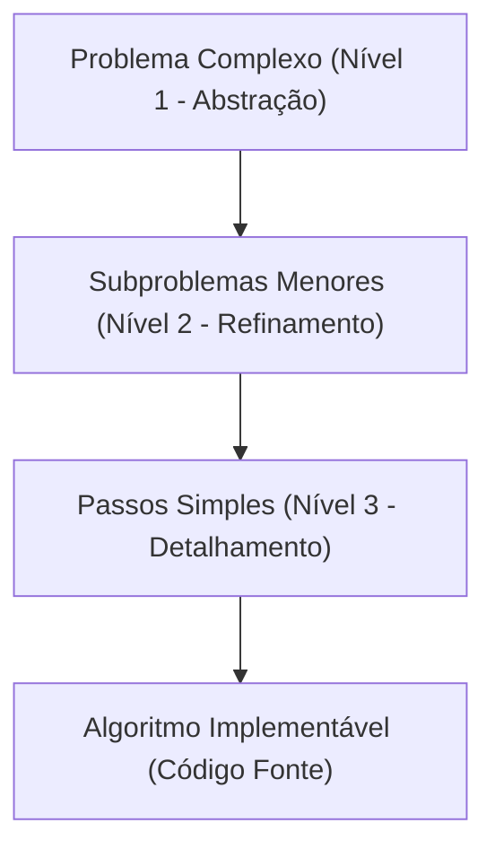

### Níveis de abstração aplicados ao cálculo da média

Conforme apresentado no material instrucional, considere o problema clássico de calcular a média aritmética de três notas escolares:

1. **Nível 1 — Abstração pura:**
   - Enunciado da meta de alto nível: "Calcular a média de três notas".
   - Não há detalhes de entrada, processamento ou saída.
2. **Nível 2 — Decomposição em etapas lógicas:**
   - 1. Obter as três notas.
   - 2. Somar as notas.
   - 3. Dividir a soma por três.
   - 4. Exibir a média calculada.
3. **Nível 3 — Refinamento imperativo para pseudoalgoritmo:**
   - 1. Ler `nota1`
   - 2. Ler `nota2`
   - 3. Ler `nota3`
   - 4. `soma <- nota1 + nota2 + nota3`
   - 5. `media <- soma / 3`
   - 6. Exibir `media`

### Atividade de modelagem: controle de fila de atendimento

Quando o refinamento é aplicado a um domínio operacional mais rico — como o controle de uma fila de atendimento —, quatro perguntas arquiteturais fundamentais devem ser respondidas antes de qualquer decisão de código:

- **Quais dados precisam ser armazenados?** Informações cadastrais do cliente (identificador, nome, horário de chegada, categoria de prioridade).
- **Como uma pessoa entra na fila?** Inserção no final da estrutura (operação de enfileiramento ou *enqueue*).
- **Como uma pessoa sai da fila?** Remoção no início da estrutura após a conclusão do atendimento (operação de desenfileiramento ou *dequeue*).
- **Quem deve ser atendido primeiro?** O elemento que ingressou há mais tempo na fila, respeitando o princípio FIFO (*First-In, First-Out*).

| Nível de Refinamento | Escopo de Visão | Público / Foco | Artefato Gerado |
| :--- | :--- | :--- | :--- |
| **Nível 1 (Abstração)** | Holístico / Negócio | Usuário final e analista | Requisitos de alto nível |
| **Nível 2 (Refinamento)** | Fluxo de Controle | Arquiteto de software | Diagrama de fluxo / Casos de uso |
| **Nível 3 (Detalhamento)** | Primitivas de Computação | Desenvolvedor / Engenheiro | Pseudocódigo e algoritmos |

---

## Tipos Abstratos de Dados (TAD)

### Definição formal

Um Tipo Abstrato de Dados (TAD) é uma formulação matemática que especifica:
1. O conjunto de dados existentes e seus domínios de valores válidos.
2. O conjunto de operações que podem ser executadas sobre esses dados.
3. O comportamento esperado e as invariantes que essas operações devem preservar.

O ponto definidor do conceito de TAD é a **independência de representação**: a definição não estabelece como os dados serão organizados fisicamente na memória do computador, tampouco como os algoritmos internos das operações serão codificados.

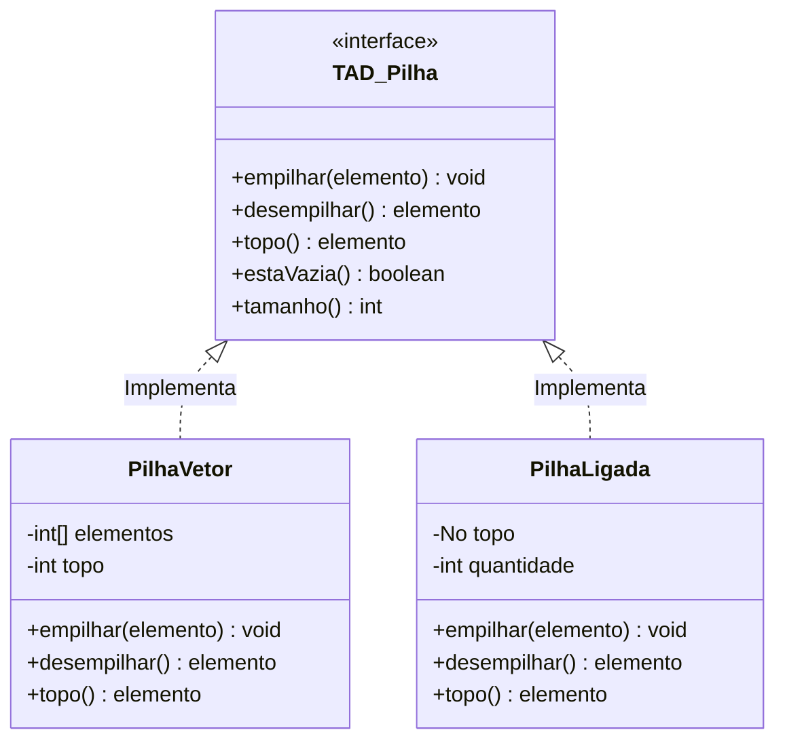

### Separação entre interface e implementação

- **Interface:** Responde estritamente à pergunta **"O QUE"** a estrutura faz. É a assinatura de métodos públicos, parâmetros aceitos, retornos entregues e exceções disparadas.
- **Implementação:** Responde à pergunta **"COMO"** a estrutura cumpre o contrato. Envolve detalhes concretos, tais como uso de blocos contíguos de memória (vetores nativos) ou nós com ponteiros alocados no Heap.

### Seleção de estruturas baseada em requisitos operacionais

A escolha da representação concreta de um TAD é orientada pelas necessidades de complexidade de tempo e espaço de cada aplicação:

| Necessidade da Aplicação | Estrutura de Dados Indicada | Justificativa Técnica |
| :--- | :--- | :--- |
| Acesso instantâneo por posição/índice | **Lista Sequencial (Vetor)** | Aritmética de ponteiros / cálculo direto de índice em $O(1)$. |
| Inserção e remoção frequente no início/meio | **Lista Ligada (Encadeada)** | Reajuste pontual de referências de ponteiros sem deslocamento de elementos. |
| Política LIFO (*Last-In, First-Out*) | **Pilha** | Inserções e remoções restritas a uma única extremidade (topo). |
| Política FIFO (*First-In, First-Out*) | **Fila** | Inserções no final (cauda) e remoções no início (cabeça). |
| Representação de relações hierárquicas | **Árvore** | Estrutura não linear com nós pais e múltiplos nós filhos. |
| Modelagem de redes e interconexões arbitrárias | **Grafo** | Conjunto arbitrário de vértices e arestas com possíveis ciclos. |

---

## Abstração e encapsulamento de estruturas

### O princípio da caixa preta

O encapsulamento oculta a complexidade interna de uma estrutura de dados por trás de uma interface estável. O código cliente que consome um TAD não deve conhecer nem depender da forma como os bytes ou nós são manipulados internamente. 

Caso um sistema utilize uma Pilha com base em vetor e, por motivos de escalabilidade, a engenharia decida migrar a implementação interna para uma lista duplamente ligada, nenhuma linha de código cliente deve necessitar de alteração, desde que a interface pública do TAD (`empilhar()`, `desempilhar()`, `topo()`) seja preservada.

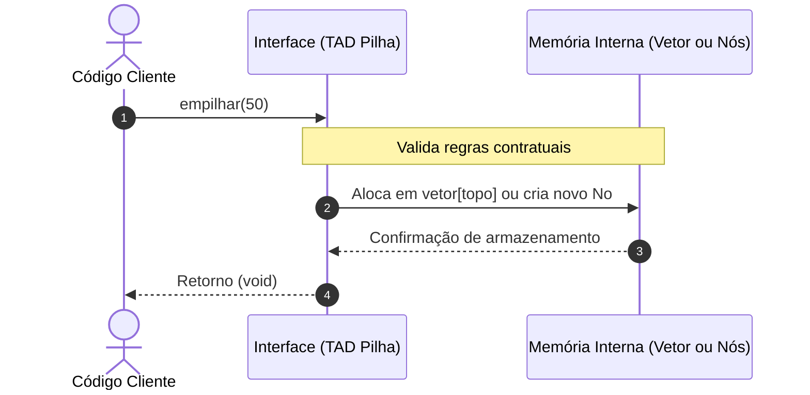

### Contraexemplo: quebra de encapsulamento

Quando um desenvolvedor expõe diretamente arranjos internos ou atributos de controle (como deixar o array `int[] elementos` ou a variável de controle `int topo` com visibilidade pública), o código cliente adquire acoplamento patológico com a implementação. Se o cliente manipular os índices do vetor manualmente, o estado interno da estrutura de dados é corrompido, invalidando invariantes como a contagem correta do número de itens.

---

## Análise de complexidade de algoritmos e notação Big O

### Por que analisar algoritmos de forma assintótica?

Dois algoritmos podem produzir rigorosamente o mesmo resultado final para um dado problema, porém exigindo quantidades drasticamente distintas de recursos computacionais. 

Uma abordagem ingênua consistiria em rodar ambos os programas em um computador e cronometrar o tempo de execução (tempo de relógio em segundos ou milissegundos). Essa medição empírica é tecnicamente falha para a ciência da computação, pois depende criticamente de fatores externos variáveis:
- Potência e arquitetura do processador (CPU);
- Frequência de clock e quantidade de núcleos;
- Memória cache e latência da RAM;
- Sistema operacional e processos concorrentes em execução;
- Versão da Máquina Virtual Java e otimizações do compilador JIT (*Just-In-Time*);
- Volume específico e organização prévia da massa de dados testada.

A análise teórica de complexidade contorna essas limitações substituindo medições de relógio pela contagem do **número de operações fundamentais** executadas pelo algoritmo em função do tamanho da entrada ($n$).

### O tamanho da entrada ($n$)

O tamanho da entrada representa o volume de dados sobre o qual o algoritmo atuará:
- Somar $10$ números: $n = 10$;
- Realizar busca linear em $1.000$ registros: $n = 1.000$;
- Ordenar uma base cadastral de $50.000$ elementos: $n = 50.000$.

A questão central da disciplina é: **à medida que $n$ cresce indefinidamente ($n \to \infty$), com que velocidade o trabalho do algoritmo se multiplica?**

### Contagem de operações fundamentais

Considere a instrução elementar de impressão executada em um laço:

```text
para i = 1 ate n faca
    escreva(i)
fim
```
O corpo do laço é executado $n$ vezes. Logo, o custo temporal total é expresso pela função $T(n) = n$.

Quando dois laços independentes ocorrem sequencialmente:
```text
para i = 1 ate n faca
    escreva(i)
fim

para j = 1 ate n faca
    escreva(j)
fim
```
O primeiro laço executa $n$ operações e o segundo executa mais $n$ operações:
$$T(n) = n + n = 2n$$

### O papel da análise assintótica e descarte de constantes

Na análise de desempenho para grandes entradas, constantes multiplicativas e termos de menor ordem perdem relevância comparativa diante do termo que dita o crescimento dominante. 

Considerando $T(n) = 2n$, à medida que $n$ atinge valores da ordem de milhões ou bilhões, o fator multiplicativo $2$ não altera o fato estrutural de que dobrar $n$ dobra o trabalho total. Portanto, abstraímos a constante e categorizamos a complexidade do algoritmo simplesmente como $O(n)$ (crescimento linear).

Se uma função de custo for $T(n) = 3n + 10$:
- Para $n = 1.000$: $3(1.000) + 10 = 3.010$. O termo $3n$ responde por mais de $99,6\%$ de todo o custo computacional. O termo $+10$ é desprezível.
- Assim, $T(n) = 3n + 10$ pertence à classe assintótica $O(n)$.

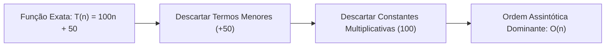

### Espectro de análise: melhor caso, pior caso e caso médio

Considere a busca linear por um valor em um vetor não ordenado contendo $n$ elementos: `[10, 25, 31, 42, 58, 70, 81]`.

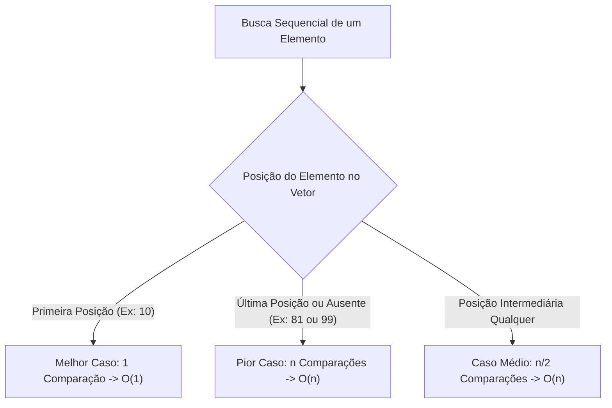

- **Melhor caso:** O elemento procurado é exatamente o primeiro do vetor. O algoritmo encerra sua execução após $1$ única comparação, independentemente de haver $10$ ou $10.000.000$ de posições no arranjo. Custo: $O(1)$.
- **Pior caso:** O elemento procurado está na última posição do vetor ou simplesmente não existe na coleção. O algoritmo é obrigado a percorrer todas as $n$ posições antes de encerrar. Custo: $O(n)$.
- **Caso médio:** Supondo distribuição uniforme de probabilidade, o elemento será encontrado após percorrer aproximadamente metade do vetor ($\frac{n}{2}$ comparações). Como $\frac{n}{2} = \frac{1}{2} \cdot n$, eliminamos a constante $\frac{1}{2}$, resultando também em complexidade $O(n)$.

> **Nota sobre notações formais:** O material de apoio introduz a ideia da notação $\Omega$ (Omega). Enquanto a notação Big O ($O$) define o **limite superior assintótico** (o teto máximo de custo que o algoritmo não ultrapassa no pior cenário), a notação Big $\Omega$ estabelece o **limite inferior assintótico** (o piso mínimo de custo operacional que o algoritmo sempre consumirá, independentemente da entrada).

---

## Classes de complexidade (constante, linear, quadrática, logarítmica)

As classes de complexidade determinam o comportamento assintótico das famílias de algoritmos à medida que o tamanho da entrada cresce:

```text
O(1) < O(log n) < O(n) < O(n log n) < O(n²) < O(n³) < O(2ⁿ) < O(n!)
[Mais Eficiente / Menor Custo] ---------------------> [Menos Eficiente / Maior Custo]
```

### Complexidade constante: $O(1)$

O consumo de tempo ou operações independe totalmente da quantidade de dados manipulada.
- **Exemplo clássico:** Acesso direto a uma posição indexada de um array (`x = vetor[5]`).
- **Comportamento:** Se o vetor possuir $10$ elementos, o acesso consome uma única instrução de cálculo de endereço em memória. Se possuir $10.000.000$ de elementos, o custo permanece rigorosamente o mesmo.

```java
// Exemplo de Complexidade O(1)
public int obterPrimeiroElemento(int[] vetor) {
    return vetor[0]; // Operação direta e imediata de memória
}
```

### Complexidade logarítmica: $O(\log n)$

O custo operacional cresce a uma taxa extremamente lenta em relação ao aumento de $n$. É a marca registrada de algoritmos que empregam a técnica de divisão e conquista, reduzindo pela metade o espaço de busca restante a cada passo executado.
- **Exemplo clássico:** Busca binária em um vetor pré-ordenado.
- **Comportamento:** Para pesquisar entre $1.000.000$ de itens, enquanto a busca linear pode exigir até $1.000.000$ de verificações, a busca logarítmica resolve a localização em no máximo $\approx 20$ comparações ($\log_2(1.000.000) \approx 19,93$).

### Complexidade linear: $O(n)$

O tempo total de execução varia em proporção direta ao tamanho da entrada $n$. Se o volume de dados dobra, a quantidade de passos necessários para concluir o procedimento também dobra.
- **Exemplo clássico:** Busca sequencial em lista não ordenada ou iteração de leitura em vetor.

```java
// Exemplo de Complexidade O(n)
public void imprimirTodos(int[] vetor) {
    for (int i = 0; i < vetor.length; i++) { // Executa n vezes
        System.out.println(vetor[i]);
    }
}
```

### Complexidade quadrática: $O(n^2)$

O tempo de processamento é proporcional ao quadrado do tamanho da entrada. É comum quando o algoritmo executa laços aninhados de iteração sobre o conjunto de dados.
- **Exemplo clássico:** Algoritmos básicos de ordenação como Bubble Sort, Insertion Sort e Selection Sort.
- **Comportamento:** Se $n = 1.000$, o número de iterações atinge $1.000.000$. Se $n$ for multiplicado por $10$ ($n = 10.000$), o trabalho computacional é multiplicado por $100$ ($100.000.000$ de passos).

```java
// Exemplo de Complexidade O(n²)
public void compararPares(int[] vetor) {
    int n = vetor.length;
    for (int i = 0; i < n; i++) {         // Laço externo: n vezes
        for (int j = 0; j < n; j++) {     // Laço interno: n vezes
            System.out.println(vetor[i] + " com " + vetor[j]);
        }
    }
}
```

> **Atenção — Variação de limites internos:** Conforme destacado na Aula 02 (página 42), se o segundo laço executar apenas metade das iterações:
> ```text
> para i = 1 ate n faca
>     para j = 1 ate n/2 faca
>         escreva(i, j)
>     fim
> fim
> ```
> O número total de iterações é $\frac{n \times n}{2} = \frac{n^2}{2}$. Como constantes multiplicativas são desprezadas na análise assintótica ($\frac{1}{2} \cdot n^2$), a complexidade assintótica permanece estritamente **$O(n^2)$**.

### Tabela comparativa de explosão do custo assintótico

| Entrada ($n$) | Constante $O(1)$ | Logarítmica $O(\log_2 n)$ | Linear $O(n)$ | Quadrática $O(n^2)$ |
| :--- | :--- | :--- | :--- | :--- |
| **$10$** | $1$ | $\approx 3$ | $10$ | $100$ |
| **$100$** | $1$ | $\approx 7$ | $100$ | $10.000$ |
| **$1.000$** | $1$ | $\approx 10$ | $1.000$ | $1.000.000$ |
| **$10.000$** | $1$ | $\approx 13$ | $10.000$ | $100.000.000$ |

---

## Gerenciamento de memória: Stack vs Heap

O estudo de estruturas de dados exige a compreensão do comportamento da memória do computador durante a execução do software. A memória RAM pode ser modelada como uma vasta sequência de endereços numerados, cada qual armazenando uma palavra de dados binários. Na arquitetura da JVM, a memória é segregada em dois espaços de armazenamento fundamentais com propósitos distintos: **Stack** e **Heap**.

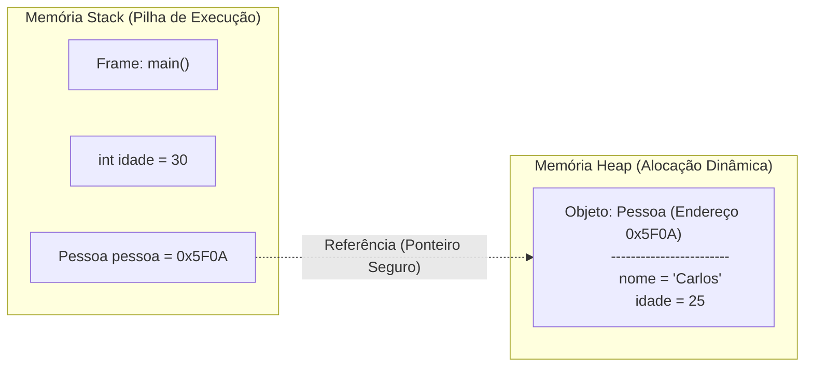

### Características da memória Stack

- **Estruturação:** Organizada rigidamente segundo a disciplina LIFO (*Last-In, First-Out*).
- **Conteúdo:** Armazena *stack frames* (quadros de execução) criados a cada chamada de método. Dentro de cada frame residem as variáveis locais do método e os parâmetros passados.
- **Tipos armazenados:** Variáveis locais de tipo primitivo (`int`, `double`, `boolean`) e as **referências** (endereços/ponteiros) que apontam para objetos existentes no Heap.
- **Ciclo de vida:** Imediato e determinístico. Quando o fluxo de execução finaliza um método, seu quadro correspondente é instantaneamente desempilhado da Stack, e toda a memória de suas variáveis locais é liberada a custo de tempo insignificante ($O(1)$).

### Características da memória Heap

- **Estruturação:** Área ampla de armazenamento global gerenciada dinamicamente em tempo de execução.
- **Conteúdo:** Todos os objetos criados mediante o operador `new`, instâncias de classes e arranjos (*arrays*).
- **Ciclo de vida:** Dinâmico e não determinístico. O tempo de existência de um objeto no Heap não está vinculado ao retorno de um método específico. Um objeto sobrevive enquanto houver pelo menos uma referência ativa alcançável apontando para ele a partir de raízes de execução (Stack, registradores ou variáveis estáticas).

| Característica | Memória Stack | Memória Heap |
| :--- | :--- | :--- |
| **Tipo de Acesso** | Sequencial LIFO (muito rápido) | Acesso por endereçamento indireto |
| **Dados Armazenados** | Variáveis locais primitivas e referências | Instâncias de objetos e arrays |
| **Gerenciamento** | Automático pela CPU / retorno de escopo | Coleta automática pelo Garbage Collector |
| **Falha de Esgotamento**| `java.lang.StackOverflowError` | `java.lang.OutOfMemoryError` |
| **Compartilhamento** | Privada de cada Thread de execução | Compartilhada entre todas as Threads |

---

## Tipos primitivos vs referências em Java

Java categoriza rigorosamente suas variáveis em duas naturezas fundamentais: tipos primitivos e tipos por referência.

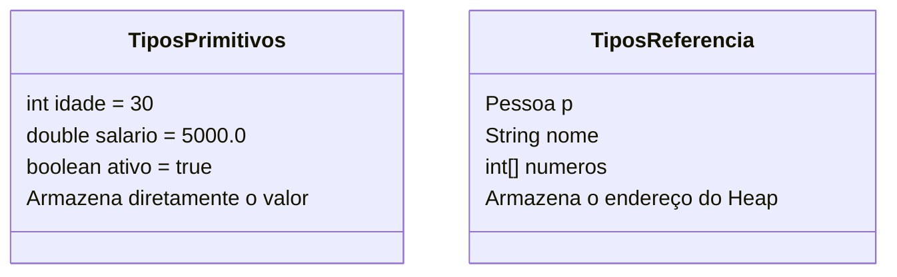

### Tipos primitivos: armazenamento por valor

Declarar uma variável primitiva aloca diretamente o espaço de bytes necessário no quadro atual da Stack para guardar o próprio valor:

```java
int idade = 30;
double salario = 5000.0;
boolean ativo = true;
```

A operação de atribuição entre variáveis primitivas gera uma cópia independente de valor binário:
```java
int a = 10;
int b = a; // 'b' recebe uma cópia do valor 10
b = 99;    // 'a' continua valendo 10 intacto
```

### Tipos por referência: armazenamento por endereço

Declarar uma variável associada a uma classe não cria o objeto na memória; cria unicamente uma variável na Stack capaz de reter o endereço de memória de um objeto compatível no Heap:

```java
Pessoa pessoa; // Referência declarada, valor inicial padrão é null
pessoa = new Pessoa(); // new aloca no Heap e devolve o endereço para a Stack
```

### O fenômeno da aliasing (duas referências para o mesmo objeto)

Quando atribuímos uma variável de referência a outra, o Java **não duplica o objeto no Heap**, mas sim duplica o endereço armazenado na Stack. Como consequência, ambas as variáveis passam a apontar para a mesmíssima instância no Heap:

```java
Pessoa p1 = new Pessoa();
p1.setNome("Ana");

Pessoa p2 = p1; // Copia a referência (endereço) de p1 para p2
p2.setNome("Carlos");

// O que será exibido em p1.getNome()?
System.out.println(p1.getNome()); // Exibirá "Carlos"!
```

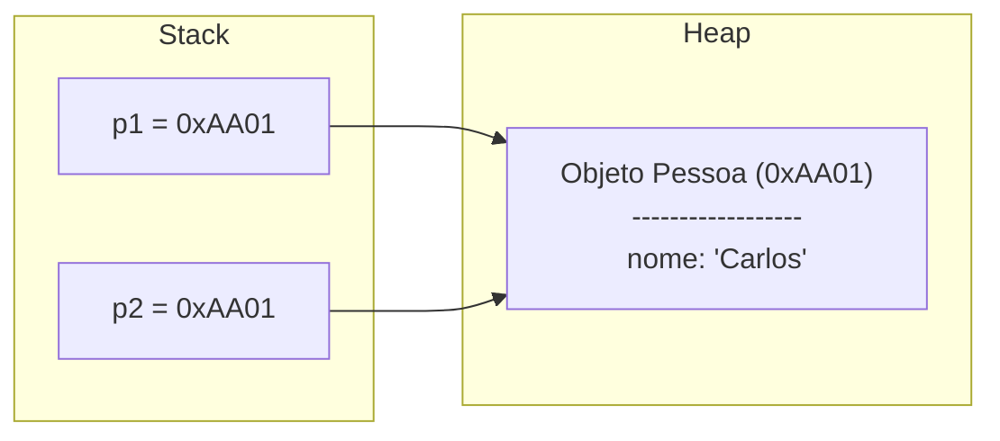

### O valor `null` e o `NullPointerException`

O literal `null` é um endereço especial que representa a ausência voluntária de apontamento para qualquer objeto real no Heap:

```java
Pessoa pessoa = null; // A variável reside na Stack, mas não referencia nenhum objeto
pessoa.getNome();     // Dispara em tempo de execução: java.lang.NullPointerException
```
Tentar acessar atributos ou invocar métodos a partir de uma referência que contém `null` é uma das causas mais recorrentes de travamento de software em linguagens orientadas a objetos com ponteiros implícitos.

---

## Alocação dinâmica de memória e Garbage Collector

### Alocação dinâmica com o operador `new`

Alocação dinâmica é a capacidade de um programa requisitar espaço de memória ao sistema operacional em tempo de execução, conforme a demanda de trabalho, em vez de depender de arranjos com tamanho estático pré-fixado em tempo de compilação.

Quando a instrução `new Pessoa[3]` é executada:
1. Um array de três posições é alocado no Heap.
2. Cada uma das três posições do array é inicializada pelo compilador com o valor padrão `null`.
3. Os objetos `Pessoa` reais somente passam a existir quando explicitamente instanciados:

```java
Pessoa[] pessoas = new Pessoa[3]; // Heap cria array contendo [null, null, null]
pessoas[0] = new Pessoa();        // Heap instancia o primeiro objeto Pessoa
pessoas[1] = new Pessoa();        // Heap instancia o segundo objeto Pessoa
```

### Comparação: gerenciamento de memória em C vs Java

- **Em Linguagem C:** O desenvolvedor é obrigado a calcular o tamanho em bytes e requisitar a alocação manualmente via chamada `malloc()`. Concluído o uso, é obrigatório invocar explicitamente `free()`. O esquecimento gera vazamento crônico de memória (*memory leak*), enquanto liberar um bloco antes do término causa ponteiros soltos (*dangling pointers*) e corrupção de sistema.
- **Em Java:** A Máquina Virtual Java emprega o **Garbage Collector (GC)**. O desenvolvedor realiza alocações dinâmicas através do operador `new`, e a JVM monitora autonomamente a topologia das referências.

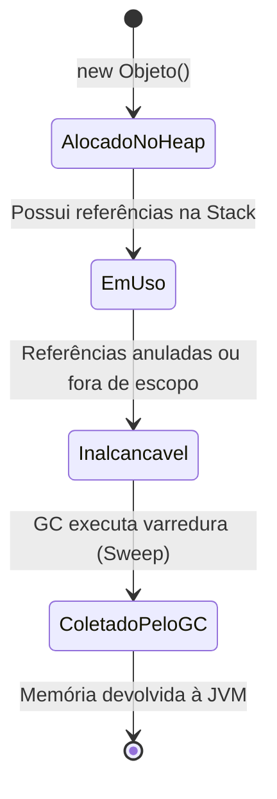

### Como o Garbage Collector analisa a elegibilidade

O Garbage Collector não exclui um objeto no instante exato em que uma referência é anulada (`p = null`). A instrução `p = null` apenas rompe a ligação entre a Stack e o Heap.

O coletor de lixo utiliza algoritmos de rastreabilidade (como o *Mark-and-Sweep*). A partir das raízes de execução (variáveis locais da Stack e variáveis globais estáticas ativas), o GC percorre o grafo de objetos navegáveis. Qualquer objeto no Heap que não possa ser alcançado por nenhum caminho a partir de uma raiz é classificado como **inalcançável** e torna-se elegível para coleta em ciclos futuros de limpeza.

---

## Implementação de Nós (No) e Listas Ligadas

### Conceito de estrutura auto-referencial

Para superar a rigidez de alocação de vetores em posições contíguas de memória, estruturas dinâmicas empregam células elementares denominadas **Nós**.

Um nó é um objeto que encapsula dois componentes essenciais:
1. **Valor:** A carga útil com a informação relevante a ser armazenada (ex: `int`, `String` ou objeto de negócio).
2. **Próximo:** Uma variável de referência que armazena o endereço do próximo nó da cadeia. Por apontar para outro objeto da mesma classe, trata-se de uma classe auto-referencial.

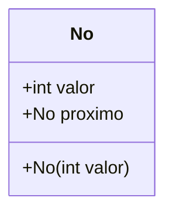

```java
public class No {
    public int valor;
    public No proximo;

    public No(int valor) {
        this.valor = valor;
        this.proximo = null; // Inicialmente desacoplado
    }
}
```

### Encadeamento de nós em memória

Ao encadear três nós sucessivos, a memória Heap acomoda três instâncias distintas em posições arbitrárias, interligadas exclusivamente através dos seus atributos `proximo`:

```java
No n1 = new No(10);
No n2 = new No(20);
No n3 = new No(30);

n1.proximo = n2; // n1 aponta para n2
n2.proximo = n3; // n2 aponta para n3
```

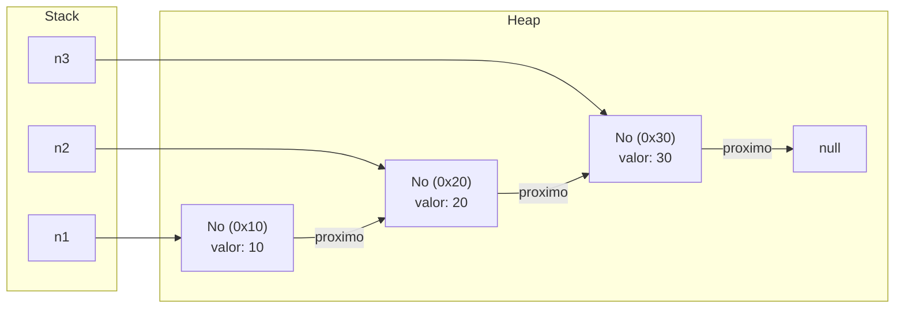

### Navegação por referências encadeadas

O acesso aos dados a partir da referência inicial `n1` é realizado por navegação encadeada (*dereferencing*):
- `n1.valor` $\to 10$
- `n1.proximo.valor` $\to 20$ (acessa o valor do nó apontado por `n1`, que é `n2`)
- `n1.proximo.proximo.valor` $\to 30$ (acessa o nó `n3` a partir de `n1`)

Se atribuirmos `n2 = null`, a variável local `n2` na Stack deixa de apontar diretamente para a instância `0x20`. Todavia, o nó `0x20` **não é coletado pelo Garbage Collector**, pois continua perfeitamente alcançável na memória através do elo `n1.proximo`.

---

## Lista Linear Sequencial: capacidade, tamanho, inserção, busca e remoção

### Fundamentação: Lista (TAD) vs Vetor (Array)

- **Lista:** Coleção linear abstrata cujos elementos mantêm uma ordem sequencial explícita. Permite operações de inserção, exclusão, consulta e contagem.
- **Array (Vetor):** Mecanismo concreto de armazenamento provido pelo compilador e pelo sistema operacional, caracterizado por alocar um bloco de memória estritamente contínuo, com tamanho fixo imutável determinado no momento da instanciação.

### Capacidade vs Tamanho: o invariante de controle

Uma falha conceitual grave em estruturas sequenciais é confundir o comprimento do vetor de suporte com a quantidade de itens reais armazenados:
- **Capacidade (`elementos.length`):** A quantidade total de compartimentos de memória reservados no Heap para o array interno.
- **Tamanho (`tamanho`):** O número de elementos úteis presentes na lista em determinado momento.

Deve ser preservado o seguinte invariante em tempo de execução:
$$0 \le tamanho \le capacidade$$

```text
Representação de Lista com Capacidade = 10 e Tamanho = 4:
Índices:     [ 0 ]   [ 1 ]   [ 2 ]   [ 3 ]   [ 4 ]   [ 5 ]   [ 6 ]   [ 7 ]   [ 8 ]   [ 9 ]
Elementos:  |  10  |  20  |  30  |  40  | null | null | null | null | null | null |
             <--- Ocupados (tamanho = 4) ---> <------- Disponíveis (capacidade = 10) ------->
```

### Operações fundamentais e análise de custo assintótico

#### 1. Consulta por posição (`obter(posicao)`)
Como a estrutura assenta sobre um array contíguo, o acesso a qualquer posição arbitrária ocorre por cálculo de deslocamento base em $O(1)$:
$$\text{Endereço}(i) = \text{Endereço Base} + (i \times \text{Tamanho do Tipo})$$

#### 2. Pesquisa por conteúdo (`buscar(valor)`)
Como os dados não estão necessariamente ordenados, é imperativo inspecionar sequencialmente os itens de $0$ até $tamanho - 1$. No pior caso (elemento ausente ou no último índice), são necessárias $n$ verificações: complexidade $O(n)$.

#### 3. Inserção no final
Se $tamanho < capacidade$, basta colocar o novo item no índice indicado por `tamanho` e incrementá-lo:
```java
elementos[tamanho] = novoValor;
tamanho++;
```
Custo temporal: **$O(1)$ constante**.

#### 4. Inserção no meio ou início (`inserir(posicao, novoValor)`)
Para inserir um elemento em um índice intermediário $i$, é obrigatório deslocar todos os elementos já existentes de $i$ até $tamanho - 1$ uma casa para a direita (*shift right*), abrindo espaço sem sobreposição.

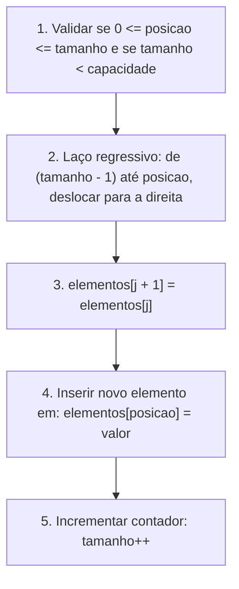

No pior cenário (inserção na posição $0$), todos os $n$ elementos da lista são movidos uma casa à direita. Complexidade: **$O(n)$ linear**.

#### 5. Remoção por posição (`remover(posicao)`)
Para remover o item de um índice intermediário sem deixar lacunas vazias na estrutura contígua, todos os elementos subsequentes (de $posicao + 1$ até $tamanho - 1$) devem ser deslocados uma casa para a esquerda (*shift left*):

```text
Remoção no índice 1:
Antes:   [ 10 ][ 20 ][ 30 ][ 40 ][ null ] (tamanho = 4)
             ^ remover este

Deslocamento para a esquerda:
Passo 1: elementos[1] = elementos[2] (valor 30 move para índice 1)
Passo 2: elementos[2] = elementos[3] (valor 40 move para índice 2)
Passo 3: tamanho-- (tamanho passa a ser 3)

Depois:  [ 10 ][ 30 ][ 40 ][ null ][ null ] (tamanho = 3)
```

Complexidade no pior caso (remoção no índice $0$): **$O(n)$ linear**.

### Tabela resumo de complexidade na Lista Linear Sequencial

| Operação | Melhor Caso | Pior Caso | Caso Médio | Justificativa |
| :--- | :--- | :--- | :--- | :--- |
| **Acessar por índice** | $O(1)$ | $O(1)$ | $O(1)$ | Cálculo aritmético direto de ponteiro em memória contígua. |
| **Pesquisar por valor**| $O(1)$ | $O(n)$ | $O(n)$ | Encontrar no primeiro índice vs percorrer a totalidade dos itens. |
| **Inserir no final** | $O(1)$ | $O(1)$ | $O(1)$ | Acesso imediato pelo índice apontado por `tamanho`. |
| **Inserir no início** | $O(n)$ | $O(n)$ | $O(n)$ | Deslocamento obrigatório de todos os $n$ itens para a direita. |
| **Remover do início** | $O(n)$ | $O(n)$ | $O(n)$ | Deslocamento obrigatório de todos os $n-1$ itens para a esquerda. |
| **Remover do final** | $O(1)$ | $O(1)$ | $O(1)$ | Apenas decrementa a variável de controle `tamanho`. |

---

## Código da aula

Nesta seção, analisamos detalhadamente a implementação das classes estruturais e de teste.

### Estrutura de arquivos gerada

- [`./codigo/No.java`](file:///./codigo/No.java): Implementação da célula de encadeamento dinâmico.
- [`./codigo/ListaSequencial.java`](file:///./codigo/ListaSequencial.java): Estrutura de dados completa de Lista Linear Sequencial sobre vetor, com tratamento de índices, operações de inserção, remoção, busca e redimensionamento dinâmico de capacidade.
- [`./codigo/ResolucaoExercicios.java`](file:///./codigo/ResolucaoExercicios.java): Suíte de testes e resolução prática dos exercícios propostos em sala.

### Análise detalhada de `./codigo/No.java`

A classe [`No.java`](file:///./codigo/No.java) encapsula o nó fundamental de encadeamento:

```java
package codigo;

/**
 * Representa um No de uma estrutura encadeada.
 * Possui carga util (valor inteiro) e referencia para o proximo No.
 */
public class No {
    public int valor;      // Carga util do no
    public No proximo;     // Apontamento para o proximo elemento da cadeia

    /**
     * Construtor que inicializa a carga util.
     * O proximo no e implicitamente inicializado como null.
     */
    public No(int valor) {
        this.valor = valor;
        this.proximo = null;
    }
}
```

- **Linhas 7-8:** Declaração de `valor` (carga útil primitiva de dados) e `proximo` (referência auto-referencial para outro objeto do tipo `No`).
- **Linhas 14-17:** Construtor que recebe o valor do nó e estabelece o ponteiro de ligação como `null`, garantindo que um nó nasce desacoplado de qualquer cadeia.

---

### Análise detalhada de `./codigo/ListaSequencial.java`

A classe [`ListaSequencial.java`](file:///./codigo/ListaSequencial.java) implementa a especificação completa de um TAD Lista sobre um vetor nativo:

```java
package codigo;

public class ListaSequencial {
    private int[] elementos;
    private int tamanho;

    public ListaSequencial(int capacidadeInicial) {
        if (capacidadeInicial <= 0) {
            throw new IllegalArgumentException("Capacidade deve ser maior que zero.");
        }
        this.elementos = new int[capacidadeInicial];
        this.tamanho = 0;
    }

    public int getTamanho() {
        return this.tamanho;
    }

    public int getCapacidade() {
        return this.elementos.length;
    }

    public void adicionar(int valor) {
        if (this.tamanho == this.elementos.length) {
            aumentarCapacidade();
        }
        this.elementos[this.tamanho] = valor;
        this.tamanho++;
    }

    public void inserir(int posicao, int valor) {
        if (posicao < 0 || posicao > this.tamanho) {
            throw new IndexOutOfBoundsException("Posicao invalida: " + posicao);
        }
        if (this.tamanho == this.elementos.length) {
            aumentarCapacidade();
        }
        // Deslocamento para a direita (Shift Right)
        for (int i = this.tamanho - 1; i >= posicao; i--) {
            this.elementos[i + 1] = this.elementos[i];
        }
        this.elementos[posicao] = valor;
        this.tamanho++;
    }

    public int obter(int posicao) {
        validarIndiceExistente(posicao);
        return this.elementos[posicao];
    }

    public int buscar(int valor) {
        for (int i = 0; i < this.tamanho; i++) {
            if (this.elementos[i] == valor) {
                return i; // Retorna o indice da primeira ocorrencia
            }
        }
        return -1; // Elemento nao encontrado
    }

    public int remover(int posicao) {
        validarIndiceExistente(posicao);
        int elementoRemovido = this.elementos[posicao];
        // Deslocamento para a esquerda (Shift Left)
        for (int i = posicao; i < this.tamanho - 1; i++) {
            this.elementos[i] = this.elementos[i + 1];
        }
        this.tamanho--;
        return elementoRemovido;
    }

    private void aumentarCapacidade() {
        int novaCapacidade = this.elementos.length * 2;
        int[] novoVetor = new int[novaCapacidade];
        for (int i = 0; i < this.tamanho; i++) {
            novoVetor[i] = this.elementos[i];
        }
        this.elementos = novoVetor; // Redireciona a referencia
    }

    private void validarIndiceExistente(int posicao) {
        if (posicao < 0 || posicao >= this.tamanho) {
            throw new IndexOutOfBoundsException("Indice fora dos limites: " + posicao);
        }
    }
}
```

- **Linhas 4-5:** Encapsulamento dos atributos privados: o vetor `elementos` para suporte físico e a variável `tamanho` para controle lógico.
- **Linhas 21-27:** Método `adicionar(valor)` com inserção ao final em $O(1)$. Trata saturação com redimensionamento dinâmico.
- **Linhas 29-43:** Método `inserir(posicao, valor)` com laço regressivo garantindo que elementos sejam movidos à direita sem perdas.
- **Linhas 54-65:** Método `remover(posicao)` com deslocamento à esquerda e devolução do valor excluído.
- **Linhas 67-74:** Método `aumentarCapacidade()`, dobrando a capacidade do vetor interno mediante alocação de um novo array e cópia dos dados antigos.

---

### Análise detalhada de `./codigo/ResolucaoExercicios.java`

O arquivo [`ResolucaoExercicios.java`](file:///./codigo/ResolucaoExercicios.java) centraliza a demonstração dos exercícios da lista:

```java
package codigo;

public class ResolucaoExercicios {
    public static void main(String[] args) {
        System.out.println("=== EXERCICIO 1 & 2: MANIPULACAO DE NOS ===");
        No n1 = new No(1);
        No n2 = new No(2);
        No n3 = new No(3);

        n1.proximo = n2;
        n2.proximo = n3;

        System.out.println("n1.proximo.valor: " + n1.proximo.valor);
        System.out.println("n1.proximo.proximo.valor: " + n1.proximo.proximo.valor);

        // Simulacao do exercicio de anulacao
        n2 = null;
        System.out.println("Apos n2 = null, n1.proximo.valor continua: " + n1.proximo.valor);

        System.out.println("\n=== EXERCICIO 3: DESAFIO FINAL DE REFERENCIAS ===");
        executarDesafioFinal();

        System.out.println("\n=== EXERCICIO 4: LISTA SEQUENCIAL ===");
        ListaSequencial lista = new ListaSequencial(3);
        lista.adicionar(10);
        lista.adicionar(20);
        lista.adicionar(30);
        System.out.println("Capacidade antes da expansao: " + lista.getCapacidade());
        lista.adicionar(40); // Forca a duplicacao dinamica de capacidade
        System.out.println("Capacidade apos expansao: " + lista.getCapacidade());
        System.out.println("Elemento no indice 2: " + lista.obter(2));
    }

    private static void executarDesafioFinal() {
        No d1 = new No(10);
        No d2 = new No(20);
        No d3 = new No(30);

        d1.proximo = d2;
        d2.proximo = d3;
        d2 = null;

        System.out.println("Objeto 1 contem: " + d1.valor);
        System.out.println("Objeto 2 acessado via d1: " + d1.proximo.valor);
        System.out.println("Objeto 3 acessado via d1: " + d1.proximo.proximo.valor);
    }
}
```

---

## Exercícios

### Exercício 1: Implementação de Nó e Lista Ligada

**Enunciado oficial:**
Crie uma classe chamada `No` em Java com `valor` (`int`) e `proximo` (`No`). Deverá ter um construtor inicializando `valor`. Em seguida, crie uma lista ligada com os nós 1, 2 e 3.

**Raciocínio:**
1. A classe `No` exige um atributo do tipo primitivo inteiro (`valor`) e um atributo de referência auto-referencial (`proximo`).
2. O construtor deve receber um inteiro e atribuí-lo a `this.valor`, mantendo `proximo` com `null`.
3. Para compor a lista encadeada no programa principal, instanciam-se três objetos independentes no Heap (`n1`, `n2` e `n3`).
4. O encadeamento é concluído associando a referência de `n2` ao campo `n1.proximo` e a referência de `n3` ao campo `n2.proximo`.

**Resolução completa comentada:**

```java
// Definicao da classe No
public class No {
    public int valor;
    public No proximo;

    public No(int valor) {
        this.valor = valor;
        this.proximo = null;
    }
}

// Codigo de instanciacao e ligacao
public class TesteListaLigada {
    public static void main(String[] args) {
        // Criacao dos tres objetos independentes no Heap
        No n1 = new No(1);
        No n2 = new No(2);
        No n3 = new No(3);

        // Estabelecimento dos elos de encadeamento
        n1.proximo = n2;
        n2.proximo = n3;
    }
}
```
*Consulte o código correspondente em:* [`./codigo/No.java`](file:///./codigo/No.java) e [`./codigo/ResolucaoExercicios.java`](file:///./codigo/ResolucaoExercicios.java).

---

### Exercício 2: Análise de Referências e Objetos

**Enunciado oficial:**
Considerando a lista ligada criada com os nós `n1`, `n2` e `n3` (onde `n1` aponta para `n2`, e `n2` aponta para `n3`), responda:
1. Quantos objetos foram criados?
2. Quantas referências `No` existem?
3. Qual é o valor de: `n1.proximo.valor`?
4. Qual é o valor de: `n1.proximo.proximo.valor`?
5. O que acontece se fizermos: `n2 = null;`?

**Raciocínio e respostas fundamentadas:**

1. **Quantos objetos foram criados?**
   - **Resposta:** Foram criados **3 objetos**.
   - *Fundamentação:* O operador `new` foi invocado exatamente três vezes (`new No(1)`, `new No(2)`, `new No(3)`), alocando três instâncias distintas da classe `No` no Heap.
2. **Quantas referências `No` existem?**
   - **Resposta:** Existem **5 referências** do tipo `No`.
   - *Fundamentação:*
     - 3 referências na memória **Stack**: as variáveis locais `n1`, `n2` e `n3`.
     - 2 referências na memória **Heap**: o atributo `proximo` interno ao objeto `n1` e o atributo `proximo` interno ao objeto `n2`. (O atributo `n3.proximo` contém `null`, isto é, aponta para o endereço vazio).
3. **Qual é o valor de: `n1.proximo.valor`?**
   - **Resposta:** O valor retornado é **`2`**.
   - *Fundamentação:* `n1.proximo` resolve a referência para a instância `n2`. O atributo `valor` dessa instância é `2`.
4. **Qual é o valor de: `n1.proximo.proximo.valor`?**
   - **Resposta:** O valor retornado é **`3`**.
   - *Fundamentação:* `n1.proximo` navega até `n2`, e o ponteiro subsequente `n2.proximo` navega até `n3`. O campo `valor` de `n3` é `3`.
5. **O que acontece se fizermos: `n2 = null;`?**
   - **Resposta:** A variável local `n2` na Stack perde o apontamento direto para o objeto `2`. No entanto, **o objeto contendo o valor 2 NÃO é apagado nem coletado pelo Garbage Collector**, pois ele permanece perfeitamente acessível no Heap através do ponteiro `n1.proximo`. A integridade da lista é integralmente preservada.

---

### Exercício 3: Desafio Final de Referências

**Enunciado oficial:**
Analise o seguinte trecho de código e descreva o estado final da memória Stack e Heap:
```java
No n1 = new No(10);
No n2 = new No(20);
No n3 = new No(30);
n1.proximo = n2;
n2.proximo = n3;
n2 = null;
```

**Raciocínio:**
1. Três invocações de `new No(...)` criam três objetos independentes no Heap nos endereços hipotéticos `0x100`, `0x200` e `0x300`.
2. As variáveis locais na Stack guardam inicialmente: `n1 = 0x100`, `n2 = 0x200` e `n3 = 0x300`.
3. `n1.proximo = n2` faz com que o campo `proximo` do objeto `0x100` receba o endereço `0x200`.
4. `n2.proximo = n3` faz com que o campo `proximo` do objeto `0x200` receba o endereço `0x300`.
5. `n2 = null` apaga o conteúdo da variável `n2` na Stack, atribuindo-lhe `null`.

**Descrição detalhada do estado final:**

- **Memória Stack:**
  - `n1`: Contém o endereço `0x100` (referenciando o nó com valor `10`).
  - `n2`: Contém o valor literal `null` (não referencia endereço de memória válido).
  - `n3`: Contém o endereço `0x300` (referenciando diretamente o nó com valor `30`).
- **Memória Heap:**
  - Objeto `0x100`: `valor = 10`, `proximo = 0x200`. (Alcançável via `n1`).
  - Objeto `0x200`: `valor = 20`, `proximo = 0x300`. (Alcançável indiretamente via `n1.proximo`).
  - Objeto `0x300`: `valor = 30`, `proximo = null`. (Alcançável diretamente via `n3` e indiretamente via `n1.proximo.proximo`).
- **Comportamento do Garbage Collector:** Nenhum dos três objetos é destruído pelo coletor de lixo, pois todos possuem rotas ativas de alcance partindo das raízes da Stack (`n1` e `n3`).

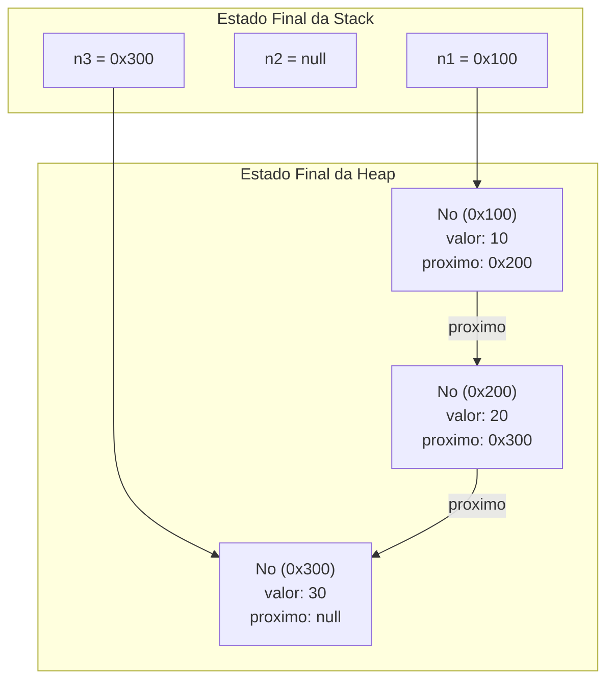

---

### Exercício 4: Lista Sequencial Dinâmica

**Enunciado oficial:**
Faça o mesmo processo de manipulação de lista (inserir, remover, buscar, obter) utilizando uma lista dinâmica baseada em array com redimensionamento.

**Raciocínio:**
Quando um array estático atinge sua capacidade máxima (`tamanho == elementos.length`), uma inserção comum causaria `ArrayIndexOutOfBoundsException`. A solução técnica padrão (adotada internamente por coleções como o `ArrayList` do Java) consiste em alocar dinamicamente um novo array com o dobro da capacidade original, copiar os elementos do array antigo para o novo e atualizar a referência interna da classe.

**Resolução comentada:**

```java
// Metodo de expansao automatica de capacidade
private void aumentarCapacidade() {
    int novaCapacidade = this.elementos.length * 2;
    int[] novoArray = new int[novaCapacidade];
    
    // Transfere os elementos da memoria antiga para a nova area
    for (int i = 0; i < this.tamanho; i++) {
        novoArray[i] = this.elementos[i];
    }
    
    // O array antigo perde a referencia e se torna elegivel para o Garbage Collector
    this.elementos = novoArray;
}
```
*Consulte a implementação completa em:* [`./codigo/ListaSequencial.java`](file:///./codigo/ListaSequencial.java).

---

## Erros comuns e boas práticas

### 1. Confusão entre `tamanho` e `capacidade` (`length`)
- **Erro comum:** Percorrer a lista utilizando o atributo `.length` do vetor em vez da variável de controle `tamanho`. Isso provoca leitura indevida de posições não inicializadas ou com lixo lógico (`0` ou `null`).
- **Boa prática:** Sempre controlar laços externos e limites de validação estritamente através da variável `tamanho`. O atributo `length` deve ser consultado exclusivamente para avaliar saturação de capacidade.

### 2. Disparo de `NullPointerException` ao navegar em nós encadeados
- **Erro comum:** Executar expressões profundas como `n.proximo.proximo.valor` sem verificar previamente se `n` ou `n.proximo` são nulos. Se o penúltimo elo for `null`, a JVM encerra a execução com erro fatal.
- **Boa prática:** Aplicar checagem defensiva de sentinela antes do desreferenciamento:
  ```java
  if (n != null && n.proximo != null) {
      int val = n.proximo.valor;
  }
  ```

### 3. Cópia inadvertida de referências achando que se está clonando o objeto
- **Erro comum:** Fazer `ListaSequencial l2 = l1;` e imaginar que modificações em `l2` não afetarão `l1`.
- **Boa prática:** Compreender que o operador `=` aplicado a objetos copia apenas o endereço da Stack. Para clonar dados, deve-se instanciar explicitamente um novo objeto com `new` e copiar seus elementos.

### 4. Erros de sentido nos laços de deslocamento (*Shift*)
- **Erro na inserção:** Percorrer o laço de deslocamento para a direita de forma progressiva (`i = posicao; i < tamanho; i++`). Isso sobrescreve o próximo elemento antes que ele seja movido, duplicando o valor inicial por toda a extensão do vetor.
- **Correção:** Na inserção, o deslocamento (*shift right*) é obrigatoriamente **regressivo** (do fim para o início). Na remoção, o deslocamento (*shift left*) é obrigatoriamente **progressivo** (do início para o fim).

---

## Links e materiais complementares

- **Documentação Oficial da Máquina Virtual Java (JVM):** Especificação técnica sobre gerenciamento de memória, ciclo de execução de threads, organização de frames na Stack e especificações do Heap. Disponível em: [Oracle Java SE Specifications](https://docs.oracle.com/javase/specs/).
- **Guia de Estruturas de Dados e Algoritmos — GeeksforGeeks:** Referência para visualização de operações sobre vetores, nós encadeados e listas sequenciais. Disponível em: [GeeksforGeeks - Data Structures](https://www.geeksforgeeks.org/data-structures/).
- **Visualgo — Ferramenta de Visualização de Estruturas de Dados:** Plataforma interativa para rastrear visualmente animações de complexidade, deslocamentos em arrays e ligação de ponteiros em tempo real. Disponível em: [Visualgo.net](https://visualgo.net/).
- **Livro Texto Recomendado:** CORMEN, T. H. et al. *Algoritmos: Teoria e Prática*. 3ª Edição. Rio de Janeiro: Elsevier, 2012. (Capítulos 1 a 3: Fundamentos e Notação Assintótica; Capítulo 10: Estruturas de Dados Elementares).
- **Repositório de Códigos da Disciplina:** Códigos-fonte completos dos exemplos desta aula disponíveis no diretório local do projeto em [`./codigo/`](file:///./codigo/).

---

## Mapa da aula

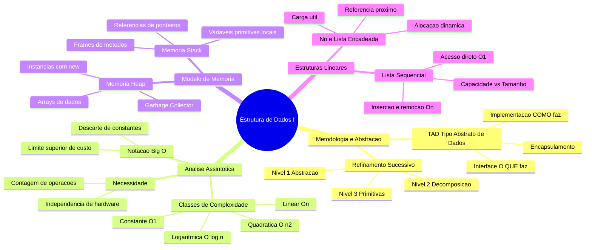

---

## Glossário

| Termo | Definição Técnica |
| :--- | :--- |
| **Refinamento Sucessivo** | Abordagem descendente (*top-down*) de decomposição de problemas em níveis crescentes de detalhamento técnico. |
| **TAD (Tipo Abstrato de Dados)** | Especificação formal de um modelo de dados e do conjunto de operações permitidas, desacoplada da implementação física. |
| **Complexidade Assintótica** | Estudo do comportamento de crescimento do custo temporal ou espacial de um algoritmo quando a entrada tende ao infinito ($n \to \infty$). |
| **Notação Big O ($O$)** | Representação assintótica que expressa o limite superior (*upper bound*) do número de passos de um algoritmo no pior cenário. |
| **Notação Big $\Omega$ (Omega)**| Representação assintótica que define o limite inferior (*lower bound*) mínimo de operações executadas por um algoritmo. |
| **Stack (Pilha de Execução)** | Área de memória estruturada em LIFO utilizada pela JVM para alocar quadros de métodos, variáveis locais e ponteiros. |
| **Heap** | Grande área de memória global da JVM onde todos os objetos e arrays dinâmicos são instanciados via operador `new`. |
| **Referência** | Endereço ou identificador seguro de memória que armazena a localização de um objeto hospedado no Heap. |
| **Aliasing** | Fenômeno no qual duas ou mais variáveis de referência armazenam o mesmo endereço de memória, apontando para a mesma instância. |
| **Garbage Collector (GC)** | Mecanismo automático da JVM que rastreia, identifica e desaloca a memória de objetos que não podem mais ser alcançados. |
| **Nó (Node)** | Estrutura auto-referencial elementar contendo um campo de dados (carga útil) e uma referência para o próximo elemento da cadeia. |
| **Capacidade** | O tamanho total do vetor de suporte físico alocado na criação de uma estrutura sequencial (`vetor.length`). |
| **Tamanho** | A quantidade real de elementos úteis logicamente preenchidos em uma estrutura em um dado instante ($0 \le tamanho \le capacidade$). |
| **Shift (Deslocamento)** | Operação de mover elementos adjacentes de um array contíguo para a direita (inserção) ou para a esquerda (remoção). |

---

## Pontos-chave para a prova

- **Tempo de relógio não avalia algoritmo:** Medir execução em segundos mede a máquina (processador, memória, sistema operacional), não o algoritmo. O algoritmo é avaliado teoricamente pelo número de operações em função de $n$.
- **Descarte de termos na notação Big O:** Na análise assintótica, constantes multiplicativas e termos de menor ordem são eliminados. Exemplo: $T(n) = 5n^2 + 100n + 30 \implies O(n^2)$.
- **Laços aninhados com frações:** Se um laço aninhado for executado $n \times \frac{n}{2}$ vezes, o total de operações é $\frac{n^2}{2}$. Como a constante $\frac{1}{2}$ é descartada, a complexidade é rigorosamente **$O(n^2)$**.
- **Stack guarda primitivos e ponteiros; Heap guarda instâncias:** Variáveis locais residem na Stack. Se forem primitivas, guardam o próprio valor numérico; se forem objetos, guardam o endereço do Heap.
- **Atribuição entre referências (`p2 = p1`):** Não cria um novo objeto. Apenas copia o endereço da Stack. Alterações feitas através de `p2` refletem imediatamente nas consultas via `p1`.
- **Efeito de `variavel = null`:** Não destrói o objeto no ato. Apenas remove o vínculo daquela variável da Stack com o Heap. Se houver outros ponteiros (ex: `n1.proximo`) alcançando a instância, ela não pode ser coletada pelo GC.
- **Diferença vital: Capacidade vs Tamanho:** A capacidade é o tamanho físico total do vetor (`elementos.length`), enquanto o tamanho é o número de itens válidos ocupados. Inserções e percursos devem respeitar estritamente o `tamanho`.
- **Custos da Lista Sequencial:**
  - Acesso por índice: $O(1)$ constante (imediato).
  - Busca sequencial por valor: $O(n)$ linear no pior caso.
  - Inserção e remoção no início/meio: $O(n)$ linear devido à necessidade obrigatória de deslocamento (*shift*).
  - Inserção e remoção no final: $O(1)$ constante (quando há capacidade livre).

---

## Perguntas e respostas (JSONL)

```jsonl
{"pergunta": "O que é um Tipo Abstrato de Dados (TAD)?", "resposta": "É uma especificação conceitual que define um conjunto de dados e as operações possíveis sobre eles, sem determinar a implementação interna ou a organização física de memória.", "dificuldade": "facil"}
{"pergunta": "Qual é a principal diferença conceitual entre interface e implementação em um TAD?", "resposta": "A interface define O QUE a estrutura de dados é capaz de realizar (contrato público), enquanto a implementação determina COMO ela executa essas tarefas internamente.", "dificuldade": "facil"}
{"pergunta": "Por que a medição de tempo de execução em segundos não é adequada para analisar a eficiência de um algoritmo?", "resposta": "Porque o tempo em segundos depende do hardware, compilador, sistema operacional e concorrência da máquina. A análise assintótica foca no número de passos fundamentais em relação ao tamanho da entrada n.", "dificuldade": "facil"}
{"pergunta": "O que a notação Big O expressa na análise assintótica?", "resposta": "Expressa o limite superior (teto) da taxa de crescimento do custo computacional do algoritmo no pior cenário à medida que o tamanho da entrada n tende ao infinito.", "dificuldade": "media"}
{"pergunta": "Qual é a ordem de complexidade temporal da busca binária em um vetor pré-ordenado e por quê?", "resposta": "É O(log n), pois o algoritmo divide o espaço de busca restante pela metade a cada comparação realizada.", "dificuldade": "media"}
{"pergunta": "Qual é a complexidade assintótica de dois laços for aninhados onde o externo roda n vezes e o interno roda n/2 vezes?", "resposta": "A complexidade é O(n²), pois (n * n)/2 = (1/2)n², e as constantes multiplicativas como 1/2 são descartadas na análise assintótica.", "dificuldade": "media"}
{"pergunta": "Quais dados residem tipicamente na memória Stack da JVM?", "resposta": "Quadros (frames) de métodos contendo parâmetros de execução, variáveis locais de tipo primitivo e as referências (endereços) para objetos no Heap.", "dificuldade": "facil"}
{"pergunta": "O que é armazenado na memória Heap da JVM?", "resposta": "Todos os objetos instanciados pelo operador new, instâncias de classes e arrays alocados dinamicamente.", "dificuldade": "facil"}
{"pergunta": "O que ocorre na memória quando executamos a atribuição 'Pessoa p2 = p1;' em Java?", "resposta": "Copia-se o endereço de memória contido em p1 para p2 na Stack. Ambas as variáveis passam a apontar para o mesmo objeto no Heap (aliasing).", "dificuldade": "media"}
{"pergunta": "Qual é a causa e o significado de uma exceção NullPointerException?", "resposta": "Ocorre quando o programa tenta acessar um atributo ou executar um método através de uma variável de referência cujo valor é null (não aponta para nenhum objeto real no Heap).", "dificuldade": "facil"}
{"pergunta": "O comando 'p = null;' remove imediatamente um objeto do Heap da JVM?", "resposta": "Não. Ele apenas anula a referência da Stack. O objeto é coletado pelo Garbage Collector posteriormente, e apenas se não houver outra referência alcançável apontando para ele.", "dificuldade": "media"}
{"pergunta": "Por que a busca por índice em uma Lista Linear Sequencial possui custo O(1)?", "resposta": "Porque os elementos ocupam posições contíguas de memória, permitindo o cálculo matemático direto do endereço de destino a partir do índice.", "dificuldade": "facil"}
{"pergunta": "Qual é a complexidade temporal da inserção no início de uma Lista Linear Sequencial de tamanho n?", "resposta": "É O(n), pois todos os n elementos preexistentes precisam ser deslocados uma posição para a direita no vetor para abrir espaço.", "dificuldade": "media"}
{"pergunta": "Por que na remoção em Lista Sequencial o deslocamento dos elementos é feito do início para o final (shift left progressivo)?", "resposta": "Para puxar cada elemento subsequente para a casa imediatamente anterior sem sobrescrever os itens adjacentes antes da hora, preenchendo a lacuna deixada pelo removido.", "dificuldade": "dificil"}
{"pergunta": "Qual a diferença entre a capacidade de um vetor e o tamanho de uma Lista Linear Sequencial?", "resposta": "Capacidade é a quantidade física máxima de compartimentos do array (length), enquanto tamanho é a quantidade lógica de elementos reais atualmente armazenados.", "dificuldade": "facil"}
{"pergunta": "Em uma cadeia de nós 'n1 -> n2 -> n3', se fizermos 'n2 = null;', a ligação da lista se perde?", "resposta": "Não, pois o nó original referenciado por n2 permanece acessível e conectado através do campo n1.proximo.", "dificuldade": "dificil"}
{"pergunta": "Qual a finalidade de uma classe auto-referencial na implementação de estruturas de dados dinâmicas?", "resposta": "Permitir que um nó armazene uma referência para outro objeto da mesma classe, viabilizando o encadeamento dinâmico de células em posições arbitrárias de memória.", "dificuldade": "media"}
{"pergunta": "Qual é o custo da operação de redimensionamento dinâmico de uma Lista Sequencial que dobra de capacidade ao atingir o limite?", "resposta": "A operação de redimensionamento individual consome tempo O(n) devido à necessidade de copiar todos os n elementos do array antigo para o novo array.", "dificuldade": "dificil"}
```

---

## Checklist de revisão

- [ ] Compreendi o método de refinamento sucessivo e sei aplicá-lo decompondo problemas em níveis de abstração.
- [ ] Sei definir formalmente o que é um Tipo Abstrato de Dados (TAD) e discernir entre interface e implementação.
- [ ] Entendo por que a avaliação assintótica com a contagem de instruções é o método científico correto para medir algoritmos.
- [ ] Domino o cálculo da notação Big O simplificando funções de custo, descartando constantes e termos menores.
- [ ] Sei ordenar as classes de complexidade fundamentais: $O(1) < O(\log n) < O(n) < O(n \log n) < O(n^2)$.
- [ ] Reconheço que laços que processam frações da entrada (como $n \times \frac{n}{2}$) permanecem assintoticamente quadráticos $O(n^2)$.
- [ ] Sei desenhar e mapear com precisão o estado das memórias Stack e Heap para qualquer bloco de código Java.
- [ ] Diferencio o comportamento de cópia por valor de tipos primitivos da cópia de referências de ponteiros.
- [ ] Sei rastrear o ciclo de vida de objetos no Heap e determinar o momento exato em que se tornam elegíveis para o Garbage Collector.
- [ ] Sei implementar a classe `No` e realizar conexões encadeadas entre múltiplos nós.
- [ ] Sei navegar por ponteiros compostos (`n1.proximo.proximo.valor`) e prever estados de memória após anulação de referências (`n2 = null`).
- [ ] Sei implementar uma Lista Linear Sequencial completa com operações de `adicionar`, `inserir`, `obter`, `buscar` e `remover`.
- [ ] Compreendo a distinção obrigatória entre capacidade (`elementos.length`) e tamanho preenchido (`tamanho`).
- [ ] Sei explicar tecnicamente por que inserções e remoções no início ou meio de listas sequenciais possuem custo $O(n)$ devido ao deslocamento (*shift*).
