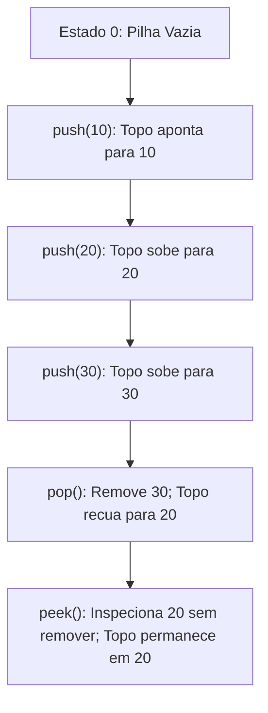
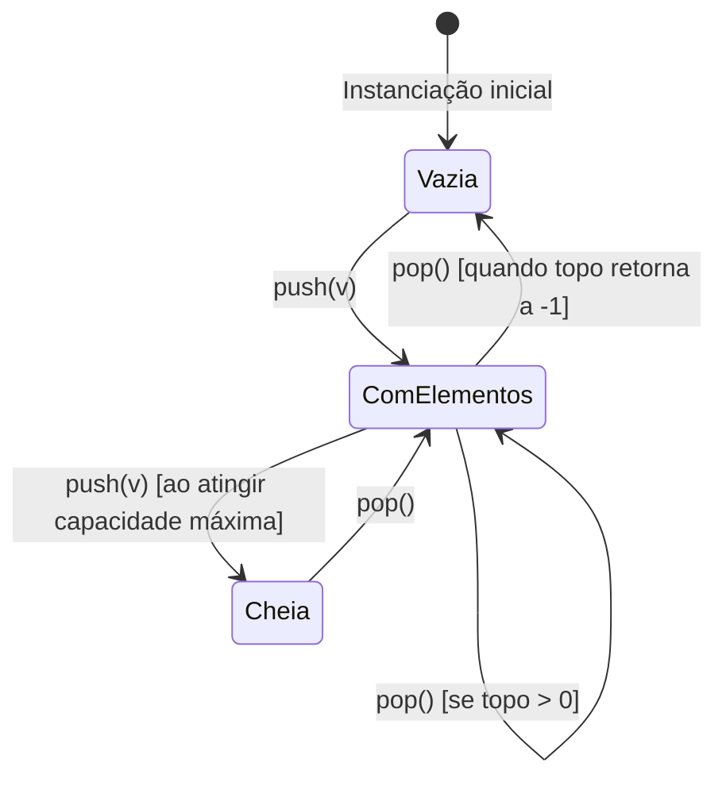
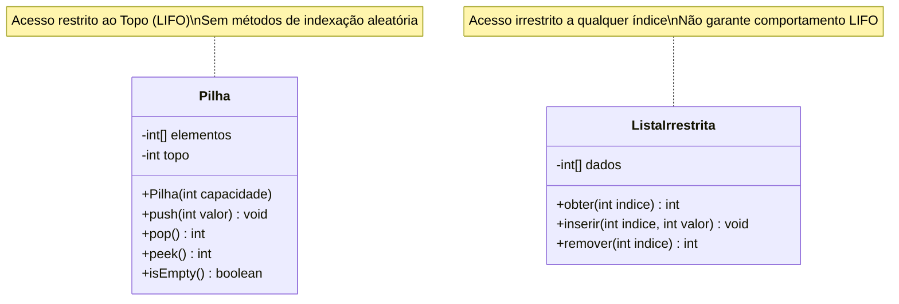
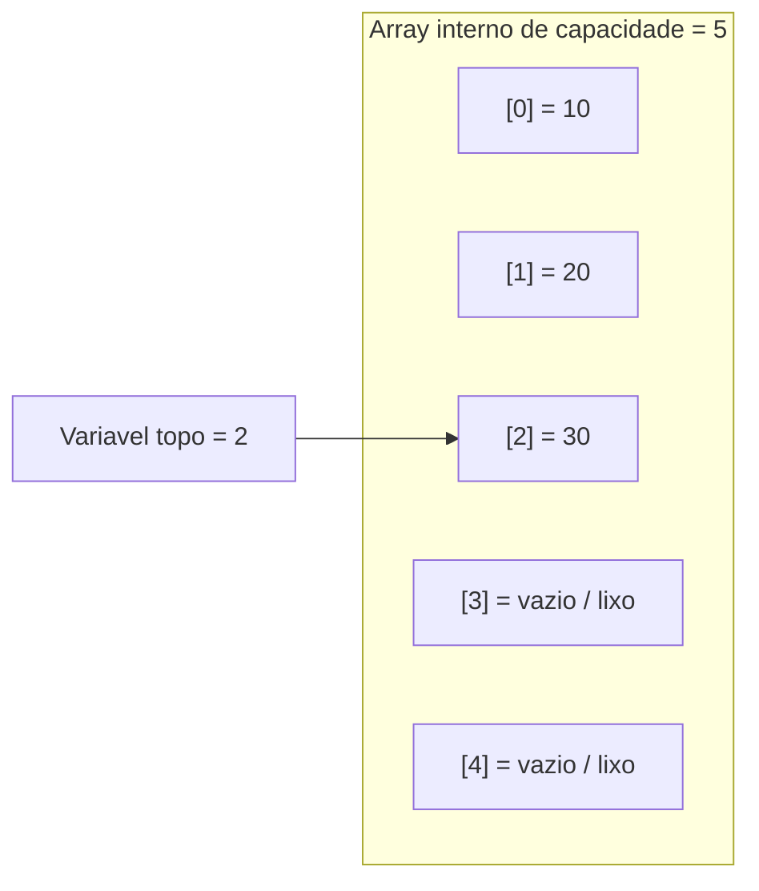
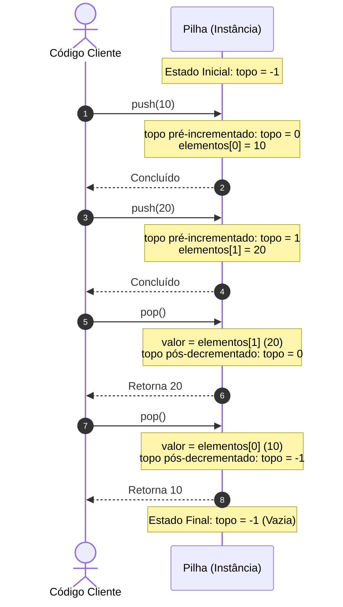
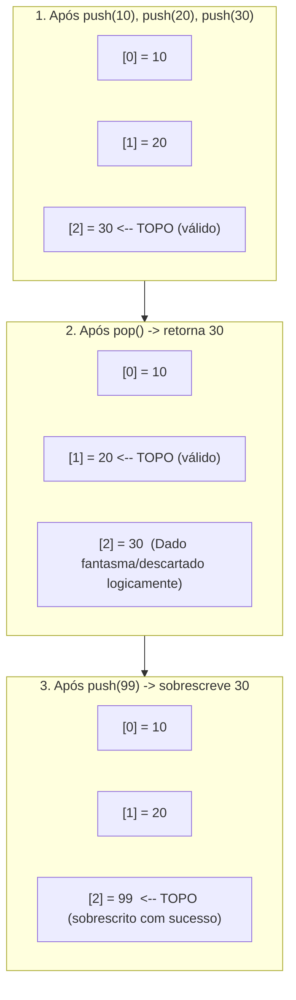

# Aula 06 — Pilhas Conceito e Implementacao

> **Professor:** Wesley Soares  
> **Disciplina:** Estrutura de Dados I (4º Semestre)  
> **Tema:** Estrutura de dados linear restrita, princípio LIFO e implementação estática sequencial em memória com arrays.

---

## Sumário

- [Objetivo da aula](#objetivo-da-aula)
- [Contexto e pré-requisitos](#contexto-e-pré-requisitos)
- [Conceito de Pilha e Principio LIFO](#conceito-de-pilha-e-principio-lifo)
  - [Definição formal](#definição-formal)
  - [Motivação e semântica de funcionamento](#motivação-e-semântica-de-funcionamento)
  - [Exemplos práticos e contraexemplos](#exemplos-práticos-e-contraexemplos)
  - [Armadilhas conceituais](#armadilhas-conceituais)
  - [Diagrama de fluxo operacional](#diagrama-de-fluxo-operacional)
  - [Comparativo estrutural de TADs](#comparativo-estrutural-de-tads)
- [Operacoes Fundamentais (push, pop, peek, isEmpty)](#operacoes-fundamentais-push-pop-peek-isempty)
  - [Operacao push](#operacao-push)
  - [Operacao pop](#operacao-pop)
  - [Operacao peek](#operacao-peek)
  - [Operacao isEmpty](#operacao-isempty)
  - [Ciclo de vida dos estados da pilha](#ciclo-de-vida-dos-estados-da-pilha)
  - [Tabela consolidada das operacoes](#tabela-consolidada-das-operacoes)
- [Restricao de Acesso aos Dados](#restricao-de-acesso-aos-dados)
  - [O princípio do encapsulamento restritivo](#o-princípio-do-encapsulamento-restritivo)
  - [Por que proibir a indexação arbitrária](#por-que-proibir-a-indexação-arbitrária)
  - [Diagrama de classes do modelo conceitual](#diagrama-de-classes-do-modelo-conceitual)
  - [Comparativo de acesso e proteção](#comparativo-de-acesso-e-proteção)
- [Implementacao de Pilha com Array](#implementacao-de-pilha-com-array)
  - [Estrutura da classe e alocação sequencial](#estrutura-da-classe-e-alocação-sequencial)
  - [Análise assintótica de complexidade](#análise-assintótica-de-complexidade)
  - [Diagrama estrutural de memória](#diagrama-estrutural-de-memória)
  - [Trade-offs: Array estático vs. Lista encadeada](#trade-offs-array-estático-vs-lista-encadeada)
- [Representacao de Pilha Vazia com Indice -1](#representacao-de-pilha-vazia-com-indice--1)
  - [A matemática da indexação baseada em zero](#a-matemática-da-indexação-baseada-em-zero)
  - [Transição do ponteiro topo](#transição-do-ponteiro-topo)
  - [Diagrama de sequência de transição do topo](#diagrama-de-sequência-de-transição-do-topo)
  - [Mapeamento de estados do topo](#mapeamento-de-estados-do-topo)
- [Gerenciamento do Topo e Persistencia Fisica de Dados no Array](#gerenciamento-do-topo-e-persistencia-fisica-de-dados-no-array)
  - [Exclusão lógica versus exclusão física](#exclusão-lógica-versus-exclusão-física)
  - [Sobrescrita segura e reaproveitamento](#sobrescrita-segura-e-reaproveitamento)
  - [Complemento técnico: Vazamento de referências na JVM](#complemento-técnico-vazamento-de-referências-na-jvm)
  - [Diagrama de transição física vs lógica](#diagrama-de-transição-física-vs-lógica)
- [Código da aula](#código-da-aula)
  - [Arquivo Pilha.java](#arquivo-pilhajava)
  - [Arquivo ExerciciosResolvidos.java](#arquivo-exerciciosresolvidosjava)
- [Exercícios](#exercícios)
  - [Exercício 1: Inversão de Palavras com Pilha](#exercício-1-inversão-de-palavras-com-pilha)
  - [Exercício 2: Verificador de Delimitadores Balanceados](#exercício-2-verificador-de-delimitadores-balanceados)
  - [Exercício 3: Pilha Dinâmica com Redimensionamento Automático](#exercício-3-pilha-dinâmica-com-redimensionamento-automático)
- [Erros comuns e boas práticas](#erros-comuns-e-boas-práticas)
- [Links e materiais complementares](#links-e-materiais-complementares)
- [Mapa da aula](#mapa-da-aula)
- [Glossário](#glossário)
- [Pontos-chave para a prova](#pontos-chave-para-a-prova)
- [Perguntas e respostas (JSONL)](#perguntas-e-respostas-jsonl)
- [Checklist de revisão](#checklist-de-revisão)

---

## Objetivo da aula

Ao concluir o estudo deste material, o estudante será capaz de:
- Compreender formalmente o conceito de **Pilha (Stack)** como um Tipo Abstrato de Dados (TAD) linear e restrito.
- Explicar com rigor matemático e algorítmico o princípio **LIFO (Last In, First Out)**.
- Identificar e implementar as operações fundamentais de uma pilha: `push`, `pop`, `peek` e `isEmpty`.
- Construir uma implementação robusta em linguagem Java utilizando alocação estática sequencial baseada em **array**.
- Conceituar as diferenças de design entre pilhas baseadas em array e pilhas construídas sobre listas ligadas/encadeadas.
- Analisar a complexidade assintótica de tempo e espaço de cada operação através da notação Big-O.
- Identificar casos de uso reais da estrutura de pilha na arquitetura de sistemas operacionais, compiladores e engines de navegadores.

---

## Contexto e pré-requisitos

Para acompanhar este material adequadamente, o estudante deve possuir domínio prévio dos seguintes tópicos:
- **Programação Orientada a Objetos em Java**: Criação de classes, visibilidade e modificadores de acesso (`private`, `public`), métodos, construtores e instanciação via operador `new`.
- **Vetores e Matrizes (Arrays)**: Alocação estática de memória, indexação baseada em zero (`0` a `N - 1`), limites de vetores e a exceção `ArrayIndexOutOfBoundsException`.
- **Tratamento de Exceções**: Lançamento de exceções com `throw new IllegalStateException(...)` para salvaguarda de invariantes de dados.
- **Análise Básica de Algoritmos**: Noções elementares de contagem de instruções e consumo de tempo em tempo constante $O(1)$.

---

## Conceito de Pilha e Principio LIFO

### Definição formal
Uma **Pilha** (ou *Stack*) é um Tipo Abstrato de Dados (TAD) linear no qual todas as inserções, remoções e inspeções de elementos são realizadas exclusivamente em uma única extremidade denominada **Topo** (*top*). A extremidade oposta, permanentemente inacessível para mutações diretas, é denominada **Base** (*base* ou *bottom*).

### Motivação e semântica de funcionamento
Em estruturas como listas convencionais ou vetores de acesso livre, um desenvolvedor pode injetar ou remover um elemento em qualquer posição arbitrária (início, meio ou fim). Contudo, muitos problemas computacionais exigem uma disciplina rígida de reversibilidade e empilhamento contextual.

A pilha impõe essa disciplina através do princípio:

> **LIFO — Last In, First Out**  
> *O último elemento inserido é obrigatoriamente o primeiro elemento a ser removido.*

Pense na metáfora de uma pilha de pratos de porcelana pesados:
1. Um novo prato limpo é colocado sobre o prato anterior (no topo).
2. Se você precisar de um prato, retira com segurança o que está no topo.
3. Tentar puxar um prato do meio quebra a pilha e desrespeita a estrutura.

### Exemplos práticos e contraexemplos
- **Exemplo do mundo real:** Histórico de navegação do browser (o botão Voltar leva à última página visitada); recurso "Desfazer" (*Undo/Ctrl+Z*) em editores de texto; pilha de chamadas da Máquina Virtual Java (*Call Stack* da JVM), onde cada chamada de método empilha um *stack frame* com variáveis locais e desempilha ao atingir o `return`.
- **Contraexemplo:** Fila de banco ou fila de impressão. Numa fila, o primeiro a chegar deve ser o primeiro a ser atendido (**FIFO — First In, First Out**). Remover o último chegado numa fila de atendimento constitui uma quebra de regra de negócio.

### Armadilhas conceituais
- **Acesso aleatório acidental:** Imaginar que podemos consultar diretamente o elemento intermediário da pilha sem desempilhar os que estão acima dele. Na pilha pura, isso é expressamente proibido.
- **Confusão de extremidades:** Achar que a remoção acontece pela base e a inserção pelo topo. Ambas as operações concorrem na mesma e única extremidade: o **topo**.

### Diagrama de fluxo operacional



### Comparativo estrutural de TADs

| Característica | Pilha (*Stack*) | Fila (*Queue*) | Lista Genérica (*List*) |
| :--- | :--- | :--- | :--- |
| **Princípio de Ordenação** | LIFO (*Last In, First Out*) | FIFO (*First In, First Out*) | Ordenação por índice ou chave |
| **Ponto de Inserção** | Exclusivamente no Topo | No Final (*Tail/Rear*) | Qualquer índice válido |
| **Ponto de Remoção** | Exclusivamente no Topo | No Início (*Head/Front*) | Qualquer índice válido |
| **Acesso Arbitrário** | Não permitido | Não permitido | Permitido via índice |
| **Complexidade Inserção/Remoção** | $O(1)$ | $O(1)$ | $O(1)$ no fim, $O(N)$ no meio/início |

---

## Operacoes Fundamentais (push, pop, peek, isEmpty)

As operações básicas de uma pilha delimitam completamente seu comportamento. Elas formam o contrato estrito que todo cliente consumidor do TAD deve respeitar.

### Operacao push
A operação `push(valor)` (empilhar) recebe um elemento e o posiciona no topo da pilha.
- **Pré-condição:** A pilha não pode estar cheia (caso estejamos utilizando uma implementação estática limitada). Se estiver cheia, ocorre o evento conhecido como **Stack Overflow** (estouro de capacidade).
- **Pós-condição:** A quantidade de elementos aumenta em 1, e o novo elemento passa a ser o topo atual.
- **Complexidade:** $O(1)$ de tempo (tempo constante, pois não requer deslocamento de elementos adjacentes).

### Operacao pop
A operação `pop()` (desempilhar) retira o elemento atualmente situado no topo e o retorna ao chamador.
- **Pré-condição:** A pilha não pode estar vazia. Chamar `pop()` sobre uma pilha sem elementos causa o evento **Stack Underflow** (subfluxo de dados).
- **Pós-condição:** O elemento é retirado da visão lógica da pilha, o ponteiro de topo regride uma unidade e o tamanho total decresce em 1.
- **Complexidade:** $O(1)$ de tempo.

### Operacao peek
A operação `peek()` (ou `top()`) permite inspecionar o valor situado no topo da pilha sem desempilhá-lo.
- **Diferença crucial:**
  - `pop()`: Consulta o elemento do topo **e remove** esse elemento da estrutura.
  - `peek()`: Apenas **consulta** o elemento do topo, mantendo a estrutura rigorosamente intacta.
- **Pré-condição:** Pilha não vazia (lança exceção em caso de vacuidade).
- **Complexidade:** $O(1)$ de tempo.

### Operacao isEmpty
A função booleana `isEmpty()` retorna `true` se a pilha não contiver nenhum elemento válido e `false` caso contenha ao menos um elemento.
- É a operação guardiã fundamental utilizada antes de qualquer invocação de `pop()` ou `peek()` para evitar exceções em tempo de execução.
- **Complexidade:** $O(1)$ de tempo.

### Ciclo de vida dos estados da pilha



### Tabela consolidada das operacoes

| Operação | Parâmetros | Retorno | Modifica a Pilha? | Condição de Erro | Complexidade Temporal |
| :--- | :--- | :--- | :--- | :--- | :--- |
| `push(valor)` | `int valor` | `void` | Sim (adiciona elemento e avança topo) | Stack Overflow (`topo == length - 1`) | $O(1)$ |
| `pop()` | Nenhum | `int` | Sim (remove elemento e recua topo) | Stack Underflow (`isEmpty() == true`) | $O(1)$ |
| `peek()` | Nenhum | `int` | Não (apenas leitura do elemento no topo) | Stack Underflow (`isEmpty() == true`) | $O(1)$ |
| `isEmpty()`| Nenhum | `boolean` | Não (inspeção de predicado lógico) | Nenhuma | $O(1)$ |

---

## Restricao de Acesso aos Dados

### O princípio do encapsulamento restritivo
Uma dúvida frequente de estudantes de graduação é: *"Se por baixo dos panos estamos utilizando um array em Java, por que simplesmente não oferecemos um método `obter(int indice)` para ler qualquer posição?"*

A resposta reside no cerne da engenharia de software e da teoria dos Tipos Abstratos de Dados: **garantia de invariantes**.

Quando um sistema opta por modelar um problema através de uma pilha, ele confia que elementos anteriores não sofrerão mutação nem leitura fora de ordem. Se permitíssemos o acesso arbitrário via índice, destruiríamos o modelo mental LIFO.

> A pilha restringe deliberadamente a liberdade de acesso para assegurar a corretude lógica e simplificar a resolução de algoritmos que exigem rastreabilidade reversa.

### Por que proibir a indexação arbitrária
Imagine um mecanismo de transações de banco de dados onde cada operação executada gera um ponto de restauração (*savepoint*) em uma pilha. Se um método externo pudesse remover ou alterar arbitrariamente um *savepoint* no meio da pilha, o processo de *rollback* entraria em estado inconsistente e corromperia os dados do banco.

A restrição transforma potenciais erros de lógica em violações impossíveis de serem expressas no código, pois a interface pública do TAD simplesmente não expõe operações de índice.

### Diagrama de classes do modelo conceitual



### Comparativo de acesso e proteção

| Aspecto | Pilha (*Acesso Restrito*) | Array / Lista (*Acesso Livre*) |
| :--- | :--- | :--- |
| **Visibilidade de Dados** | Somente o elemento no topo é visível | Todos os elementos são visíveis por índice |
| **Risco de Corrupção de Estado** | Nulo: impossível alterar elementos do meio | Alto: qualquer trecho do código pode sobrescrever índices |
| **Sobrecarga Cognitiva** | Mínima: apenas 4 operações fundamentais | Média/Alta: múltiplos métodos de inserção, busca e ordenação |
| **Garantia Arquitetural** | Ordem de saída estritamente invertida da entrada | Ordem depende da manipulação do desenvolvedor |

---

## Implementacao de Pilha com Array

### Estrutura da classe e alocação sequencial
Na implementação baseada em array (também conhecida como pilha estática ou sequencial), os elementos são armazenados em posições contíguas de memória física. 

A estrutura é composta essencialmente por dois atributos privados:
1. `private int[] elementos`: O vetor unidimensional que armazena os valores primitivos.
2. `private int topo`: Um inteiro que atua como marcador/ponteiro indicando o índice da posição atualmente ocupada no topo da pilha.

```java
public class Pilha {
    private int[] elementos;
    private int topo;

    public Pilha(int capacidade) {
        if (capacidade <= 0) {
            throw new IllegalArgumentException("A capacidade deve ser maior que zero.");
        }
        this.elementos = new int[capacidade];
        this.topo = -1; // Pilha vazia
    }
}
```

### Análise assintótica de complexidade
A implementação sobre array garante máxima eficiência para todas as operações fundamentais:
- **`push(valor)`**: Envolve uma comparação condicional, um incremento de variável escalar (`topo++`) e uma atribuição indexada direta (`elementos[topo] = valor`). Todas são instruções de tempo constante. Logo, complexidade **$O(1)$**.
- **`pop()`**: Envolve checagem de predicado, leitura de índice, decremento escalar (`topo--`) e retorno. Nenhuma iteração. Logo, complexidade **$O(1)$**.
- **`peek()`**: Apenas acesso direto via índice `elementos[topo]`. Complexidade **$O(1)$**.
- **`isEmpty()`**: Avaliação do operador de igualdade relacional `topo == -1`. Complexidade **$O(1)$**.
- **Consumo Espacial:** A estrutura consome $O(N)$ de memória contígua fixa, onde $N$ é a capacidade máxima alocada no momento da instanciação.

### Diagrama estrutural de memória



### Trade-offs: Array estático vs. Lista encadeada
*(Complemento técnico para enriquecimento conceitual com base no objetivo formal da ementa)*

| Critério de Comparação | Implementação com Array Estático | Implementação com Lista Encadeada |
| :--- | :--- | :--- |
| **Flexibilidade de Tamanho** | Tamanho fixo; sofre de *Stack Overflow* se subdimensionado. | Totalmente dinâmica; cresce conforme a demanda de nós. |
| **Localidade de Referência** | Excelente (elementos contíguos na memória, aproveita o cache L1/L2 da CPU). | Baixa (nós alocados dispersamente na Heap; quebra de cache). |
| **Sobrecarga de Memória por Item** | Nula (apenas o espaço do dado primitivo `int`). | Alta (cada nó exige espaço para o dado + ponteiro de referência `next`). |
| **Custo de Alocação** | Pago uma única vez na criação do array. | Pago a cada `push` (instanciação contínua de objetos `Node`). |

---

## Representacao de Pilha Vazia com Indice -1

### A matemática da indexação baseada em zero
Em linguagens modernas descendentes da sintaxe C (como Java, C++, C# e Python), os arrays são indexados a partir de zero:
- Se uma pilha possui 1 elemento, esse elemento reside em `elementos[0]`. Consequentemente, para 1 elemento, `topo = 0`.
- Se a pilha possui 2 elementos, o elemento do topo reside em `elementos[1]`. Consequentemente, `topo = 1`.
- Generalizando: para uma pilha com $K$ elementos, o topo estará sempre na posição de índice $K - 1$.

Seguindo essa lógica matemática regressiva:
- Se uma pilha possui 0 elementos (está vazia), temos $K = 0$.
- O valor do índice de topo deve ser $0 - 1 = -1$.

> O valor `topo = -1` é a sentinela canônica que indica a ausência total de elementos úteis na pilha.

### Transição do ponteiro topo
A evolução do índice durante a inserção e remoção segue uma ordem estrita que jamais deve ser invertida:

1. **Ao Empilhar (`push`):**
   - Primeiro: Incrementa-se o índice (`topo++`). Isso desloca o apontador para a primeira posição desocupada.
   - Segundo: Atribui-se o dado (`elementos[topo] = valor`).
2. **Ao Desempilhar (`pop`):**
   - Primeiro: Captura-se o valor de retorno (`int valor = elementos[topo]`).
   - Segundo: Decrementa-se o índice (`topo--`).

Se tentássemos salvar o valor antes de incrementar no `push`, gravaríamos na posição `elementos[-1]`, disparando imediatamente um erro de execução do runtime (`ArrayIndexOutOfBoundsException: Index -1 out of bounds for length N`).

### Diagrama de sequência de transição do topo



### Mapeamento de estados do topo

Para um array de capacidade igual a 4:

| Valor da variável `topo` | Quantidade de Itens Válidos | Estado Lógico | Posição Acessível | É seguro executar `push`? | É seguro executar `pop`? |
| :---: | :---: | :--- | :---: | :---: | :---: |
| `-1` | 0 | Vazia | Nenhuma | Sim | Não (Lança exceção) |
| `0` | 1 | Com dados | `elementos[0]` | Sim | Sim |
| `1` | 2 | Com dados | `elementos[1]` | Sim | Sim |
| `2` | 3 | Com dados | `elementos[2]` | Sim | Sim |
| `3` | 4 | Cheia | `elementos[3]` | Não (Lança exceção) | Sim |

---

## Gerenciamento do Topo e Persistencia Fisica de Dados no Array

### Exclusão lógica versus exclusão física
Uma das descobertas mais esclarecedoras para os alunos de estruturas de dados é entender o que acontece fisicamente na memória de um computador quando executamos o método `pop()`.

Observe o método lecionado pelo professor:
```java
public int pop() {
    if (isEmpty()) {
        throw new IllegalStateException("Pilha vazia");
    }
    int valor = elementos[topo];
    topo--;
    return valor;
}
```

Perceba que a instrução de remoção é unicamente `topo--`. Em momento algum o código executa comandos de "limpeza", como tentar atribuir zero ou deletar o slot de memória.

> **Exclusão Lógica:** O dado ainda reside fisicamente nos circuitos de memória do array, mas deixou de existir para o sistema porque o ponteiro de fronteira (`topo`) recuou. O estado lógico da pilha é determinado unicamente pelo intervalo fechado `[0 .. topo]`.

### Sobrescrita segura e reaproveitamento
Não há necessidade de gastar ciclos de processador limpando dados antigos da memória. Se uma nova chamada `push(99)` for executada logo após um `pop()`, o `topo` será incrementado de volta àquela posição e o valor `99` simplesmente sobrescreverá o dado residual.

Isso garante que a operação `pop()` mantenha estritamente o tempo de execução $O(1)$, evitando loops desnecessários de sanitização.

### Complemento técnico: Vazamento de referências na JVM
*(Aprofundamento de Engenharia de Software Sênior)*

No código de aula, o array armazena o tipo primitivo `int` (`int[] elementos`). Para tipos primitivos, a exclusão lógica pura é a abordagem ideal e mais rápida.

No entanto, caso a pilha fosse projetada para armazenar referências a objetos (ex: `Object[] elementos` ou genéricos `<T>`):
- Manter o objeto referenciado na posição `elementos[topo + 1]` impede que o coletor de lixo da JVM (*Garbage Collector*) identifique aquele objeto como inalcançável.
- Esse cenário gera o clássico **Memory Leak** (vazamento de memória) abordado por Joshua Bloch na obra *Effective Java* (Item 7: Elimine referências obsoletas a objetos).
- **Solução profissional para objetos:** Em pilhas de objetos, após capturar o valor no `pop()`, deve-se anular explicitamente a posição:
  ```java
  elementos[topo] = null; // Libera o objeto para o Garbage Collector
  topo--;
  ```

### Diagrama de transição física vs lógica



---

## Código da aula

Nesta seção, consolidamos a implementação da classe `Pilha` e a estrutura de resolução dos exercícios sugeridos, estruturados como artefatos de código prontos para compilação.

### Arquivo Pilha.java
O arquivo localizado em [./codigo/Pilha.java](file:///codigo/Pilha.java) reflete a implementação fiel do professor Wesley Soares, estruturada com documentação técnica completa.

```java
// Arquivo: ./codigo/Pilha.java

/**
 * Implementação de uma Pilha Estática Linear baseada em Array.
 * Disciplina: Estrutura de Dados I - UniFEF
 * Professor: Wesley Soares
 */
public class Pilha {

    // Vetor interno para armazenamento dos dados em memória contígua
    private int[] elementos;
    
    // Índice que monitora o elemento situado no topo da pilha
    private int topo;

    /**
     * Construtor da Pilha com dimensionamento estático fixo.
     * @param capacidade Quantidade máxima de elementos que a pilha comporta.
     */
    public Pilha(int capacidade) {
        if (capacidade <= 0) {
            throw new IllegalArgumentException("A capacidade da pilha deve ser superior a zero.");
        }
        elementos = new int[capacidade];
        topo = -1; // -1 indica formalmente que a pilha está vazia
    }

    /**
     * Verifica se a pilha contém elementos válidos.
     * @return true se vazia, false se possuir um ou mais elementos.
     */
    public boolean isEmpty() {
        return topo == -1;
    }

    /**
     * Insere um novo elemento no topo da pilha.
     * @param valor Número inteiro a ser empilhado.
     * @throws IllegalStateException se a pilha estiver cheia (Stack Overflow).
     */
    public void push(int valor) {
        // Validação de limite superior do vetor
        if (topo == elementos.length - 1) {
            throw new IllegalStateException("Pilha cheia");
        }

        topo++; // Pré-incremento do ponteiro
        elementos[topo] = valor; // Inserção física na posição correta
    }

    /**
     * Remove e retorna o elemento atualmente posicionado no topo.
     * @return O valor inteiro removido do topo.
     * @throws IllegalStateException se a pilha estiver vazia (Stack Underflow).
     */
    public int pop() {
        if (isEmpty()) {
            throw new IllegalStateException("Pilha vazia");
        }

        int valor = elementos[topo]; // Captura o valor antes do recuo
        topo--;                      // Exclusão lógica por decremento

        return valor;
    }

    /**
     * Inspeciona o elemento posicionado no topo sem alterar a estrutura da pilha.
     * @return O valor inteiro presente no topo.
     * @throws IllegalStateException se a pilha estiver vazia.
     */
    public int peek() {
        if (isEmpty()) {
            throw new IllegalStateException("Pilha vazia");
        }

        return elementos[topo]; // Retorna a referência do topo sem modificar o índice
    }

    /**
     * Método utilitário complementar para depuração: retorna a quantidade de itens na pilha.
     * @return Tamanho lógico atual da estrutura.
     */
    public int size() {
        return topo + 1;
    }
}
```

#### Análise detalhada dos trechos essenciais
1. **Linha `topo = -1;` no construtor:** Garante o alinhamento da convenção de índice. Como o array tem base 0, o índice anterior a zero é a sentinela lógica que representa vazio.
2. **Linha `if (topo == elementos.length - 1)`:** `elementos.length - 1` é o índice máximo permitido do array. Se `topo` já atingiu esse índice, não existem slots livres subsequentes; chamar `topo++` causaria estouro de índice de memória física.
3. **Sequência `int valor = elementos[topo]; topo--;`:** A ordem é inviolável. Se executássemos `topo--` antes, estaríamos capturando o elemento do penúltimo nível, e se a pilha tivesse apenas 1 elemento, acessaríamos `elementos[-1]`, quebrando a aplicação.

---

### Arquivo ExerciciosResolvidos.java
O arquivo localizado em [./codigo/ExerciciosResolvidos.java](file:///codigo/ExerciciosResolvidos.java) reúne as respostas completas dos três exercícios práticos sugeridos no plano de aula.

```java
// Arquivo: ./codigo/ExerciciosResolvidos.java

/**
 * Resolução comentada dos exercícios práticos propostos para a aula de Pilhas.
 * Disciplina: Estrutura de Dados I - UniFEF
 */
public class ExerciciosResolvidos {

    // =========================================================================
    // EXERCÍCIO 1: Inversão de Palavras utilizando Pilha de Caracteres
    // =========================================================================
    public static class PilhaCaracteres {
        private char[] dados;
        private int topo;

        public PilhaCaracteres(int capacidade) {
            dados = new char[capacidade];
            topo = -1;
        }

        public boolean isEmpty() {
            return topo == -1;
        }

        public void push(char c) {
            if (topo == dados.length - 1) {
                throw new IllegalStateException("Pilha cheia");
            }
            dados[++topo] = c;
        }

        public char pop() {
            if (isEmpty()) {
                throw new IllegalStateException("Pilha vazia");
            }
            return dados[topo--];
        }
    }

    /**
     * Inverte uma palavra utilizando a propriedade LIFO da pilha.
     * @param palavra Texto de entrada a ser invertido.
     * @return String invertida.
     */
    public static String inverterPalavra(String palavra) {
        if (palavra == null || palavra.isEmpty()) {
            return palavra;
        }

        PilhaCaracteres pilha = new PilhaCaracteres(palavra.length());

        // Passo 1: Empilhar cada caractere individualmente
        for (int i = 0; i < palavra.length(); i++) {
            pilha.push(palavra.charAt(i));
        }

        // Passo 2: Desempilhar para reconstruir a string invertida
        StringBuilder invertida = new StringBuilder();
        while (!pilha.isEmpty()) {
            invertida.append(pilha.pop());
        }

        return invertida.toString();
    }

    // =========================================================================
    // EXERCÍCIO 2: Verificador de Delimitadores Balanceados: ( ) e [ ]
    // =========================================================================
    /**
     * Valida se parênteses e colchetes estão corretamente balanceados.
     * @param expressao Expressão matemática contendo caracteres e delimitadores.
     * @return true se estiver balanceada; false caso contrário.
     */
    public static boolean verificarBalanceamento(String expressao) {
        if (expressao == null) return false;

        PilhaCaracteres pilha = new PilhaCaracteres(expressao.length());

        for (int i = 0; i < expressao.length(); i++) {
            char c = expressao.charAt(i);

            // Caracteres de abertura são empilhados para criar o contexto esperado
            if (c == '(' || c == '[') {
                pilha.push(c);
            } 
            // Caracteres de fechamento exigem desempilhamento imediato e checagem
            else if (c == ')' || c == ']') {
                // Se fechou sem ter nada aberto antes, está desbalanceada
                if (pilha.isEmpty()) {
                    return false;
                }

                char abertura = pilha.pop();

                // Verifica se o par desempilhado corresponde ao fechamento atual
                if (c == ')' && abertura != '(') {
                    return false;
                }
                if (c == ']' && abertura != '[') {
                    return false;
                }
            }
        }

        // A expressão só é estritamente válida se nenhum delimitador ficar pendente
        return pilha.isEmpty();
    }

    // =========================================================================
    // EXERCÍCIO 3: Pilha com Redimensionamento Dinâmico Automático
    // =========================================================================
    public static class PilhaDinamica {
        private int[] elementos;
        private int topo;

        public PilhaDinamica(int capacidadeInicial) {
            if (capacidadeInicial <= 0) capacidadeInicial = 4;
            this.elementos = new int[capacidadeInicial];
            this.topo = -1;
        }

        public boolean isEmpty() {
            return topo == -1;
        }

        public int size() {
            return topo + 1;
        }

        /**
         * Insere um elemento dobrando o array se a capacidade esgotar.
         */
        public void push(int valor) {
            if (topo == elementos.length - 1) {
                redimensionar(elementos.length * 2);
            }
            elementos[++topo] = valor;
        }

        public int pop() {
            if (isEmpty()) {
                throw new IllegalStateException("Pilha vazia");
            }
            return elementos[topo--];
        }

        public int peek() {
            if (isEmpty()) {
                throw new IllegalStateException("Pilha vazia");
            }
            return elementos[topo];
        }

        public int getCapacidade() {
            return elementos.length;
        }

        /**
         * Realoca a memória interna para um novo tamanho e copia os dados existentes.
         */
        private void redimensionar(int novaCapacidade) {
            int[] novoVetor = new int[novaCapacidade];
            // Copia os dados existentes para o novo vetor
            System.arraycopy(elementos, 0, novoVetor, 0, topo + 1);
            this.elementos = novoVetor; // Redireciona a referência interna
        }
    }

    // =========================================================================
    // Método Main para Execução e Testes de Validação
    // =========================================================================
    public static void main(String[] args) {
        System.out.println("=== TESTE EXERCÍCIO 1: INVERSÃO ===");
        String palavra = "JAVA";
        System.out.println("Original: " + palavra + " -> Invertida: " + inverterPalavra(palavra));

        System.out.println("\n=== TESTE EXERCÍCIO 2: BALANCEAMENTO ===");
        String exp1 = "[(a+b)*c]";
        String exp2 = "[(a+b]";
        String exp3 = "([)]";
        System.out.println(exp1 + " é balanceada? " + verificarBalanceamento(exp1)); // true
        System.out.println(exp2 + " é balanceada? " + verificarBalanceamento(exp2)); // false
        System.out.println(exp3 + " é balanceada? " + verificarBalanceamento(exp3)); // false

        System.out.println("\n=== TESTE EXERCÍCIO 3: REDIMENSIONAMENTO ===");
        PilhaDinamica pd = new PilhaDinamica(2);
        System.out.println("Capacidade inicial: " + pd.getCapacidade());
        pd.push(10);
        pd.push(20);
        System.out.println("Inseridos 10 e 20. Tamanho: " + pd.size() + ", Capacidade: " + pd.getCapacidade());
        pd.push(30); // Dispara redimensionamento para 4
        System.out.println("Inserido 30. Tamanho: " + pd.size() + ", Nova Capacidade: " + pd.getCapacidade());
        System.out.println("Elemento no topo (peek): " + pd.peek());
    }
}
```

---

## Exercícios

### Exercício 1: Inversão de Palavras com Pilha
- **Enunciado:** Implemente um algoritmo que utilize a estrutura de Pilha desenvolvida em aula para inverter as letras de uma palavra fornecida pelo usuário. Por exemplo, ao receber `"JAVA"`, o programa deve empilhar cada caractere e desempilhar gerando `"AVAJ"`.
- **Raciocínio Algorítmico:**
  1. A propriedade LIFO garante que o último elemento empilhado é o primeiro a ser desempilhado.
  2. Logo, se iterarmos pela string do início ao fim empilhando cada caractere, o primeiro caractere (`'J'`) ficará na base da pilha (`topo = 0`), e o último (`'A'`) ficará no topo.
  3. Ao realizarmos sucessivos `pop()` até que `isEmpty()` seja verdadeiro, retiramos a palavra exatamente em ordem inversa à sua leitura original.
- **Resolução comentada:** Implementada na classe `ExerciciosResolvidos.inverterPalavra(String palavra)` no arquivo [./codigo/ExerciciosResolvidos.java](file:///codigo/ExerciciosResolvidos.java).

```java
// Trecho explicativo do Exercício 1:
PilhaCaracteres pilha = new PilhaCaracteres(palavra.length());
for (int i = 0; i < palavra.length(); i++) {
    pilha.push(palavra.charAt(i)); // 'J', depois 'A', depois 'V', depois 'A' no topo
}
StringBuilder invertida = new StringBuilder();
while (!pilha.isEmpty()) {
    invertida.append(pilha.pop()); // Desempilha: 'A', depois 'V', depois 'A', depois 'J'
}
```

---

### Exercício 2: Verificador de Delimitadores Balanceados
- **Enunciado:** Crie uma função que utilize uma pilha para verificar se uma expressão matemática contendo parênteses `'('`, `')'` e colchetes `'['`, `']'` está balanceada corretamente. Exemplo: `"[(a+b)*c]"` é válido, enquanto `"[(a+b]"` e `"([)]"` são inválidos.
- **Raciocínio Algorítmico:**
  1. Percorremos a expressão símbolo a símbolo da esquerda para a direita.
  2. Ao encontrar um delimitador de abertura (`'('` ou `'['`), fazemos `push(delimitador)`. Isso cria um compromisso contextual de fechamento.
  3. Ao encontrar um delimitador de fechamento (`')'` ou `']'`):
     - Verificamos se a pilha está vazia. Se estiver, significa que temos um fechamento sem abertura prévia (expressão inválida).
     - Se não estiver vazia, fazemos `pop()`. O caractere desempilhado **deve obrigatoriamente** corresponder ao tipo de fechamento encontrado. Se fechamos com `')'`, a abertura desempilhada deve ser `'('`. Se não for, temos cruzamento indevido como `"([)]"`, que invalida a sintaxe.
  4. Ao término da varredura, a pilha **deve estar vazia**. Se sobrar algo na pilha (como em `"[(a+b]"`), significa que uma abertura nunca foi fechada.
- **Tabela de casos de teste:**

| Expressão de Teste | Comportamento Esperado | Causa da Decisão |
| :--- | :---: | :--- |
| `"[(a+b)*c]"` | `true` (Válida) | Todos os delimitadores fecharam na ordem aninhada correta. |
| `"[(a+b]"` | `false` (Inválida) | Faltou fechar o colchete inicial; pilha termina com `[` residual. |
| `"([)]"` | `false` (Inválida) | Fechamento prematuro de `)` enquanto o topo esperava fechar `]`. |
| `")a+b("` | `false` (Inválida) | Chamada de `pop()` sobre pilha vazia logo no primeiro caractere. |
| `"a+b"` | `true` (Válida) | Nenhuma abertura incorreta; pilha termina vazia. |

- **Resolução comentada:** Implementada na função `ExerciciosResolvidos.verificarBalanceamento(String expressao)` no arquivo [./codigo/ExerciciosResolvidos.java](file:///codigo/ExerciciosResolvidos.java).

---

### Exercício 3: Pilha Dinâmica com Redimensionamento Automático
- **Enunciado:** Modifique a classe Pilha implementada com Array para que, em vez de lançar uma exceção de `"Pilha cheia"` ao estourar a capacidade, ela dobre o tamanho do array interno automaticamente, permitindo novos empilhamentos.
- **Raciocínio Algorítmico:**
  1. Na computação, a técnica de alocação geométrica (dobrar a capacidade quando o vetor satura) garante um custo amortizado de inserção de $O(1)$.
  2. Quando `topo == elementos.length - 1`, antes de rejeitar com erro, alocamos um novo vetor temporário com tamanho `elementos.length * 2`.
  3. Copiamos todos os elementos válidos de `0` até `topo` para o novo array (utilizando `System.arraycopy` para máxima performance em nível nativo).
  4. Redirecionamos a referência `this.elementos` para o novo array.
  5. Prosseguimos normalmente com a operação `push`.
- **Resolução comentada:** Implementada na classe `ExerciciosResolvidos.PilhaDinamica` no arquivo [./codigo/ExerciciosResolvidos.java](file:///codigo/ExerciciosResolvidos.java).

---

## Erros comuns e boas práticas

### Erros comuns cometidos por estudantes

1. **Confundir a exceção de negócio com erro da JVM:**
   - *Erro:* Achar que `throw new IllegalStateException("Pilha cheia")` é a mesma coisa que `java.lang.StackOverflowError`.
   - *Correção:* `IllegalStateException` é uma regra de negócio criada pelo desenvolvedor para informar que o array estático do TAD atingiu o limite configurado. `StackOverflowError` é um erro fatal da Máquina Virtual Java quando a pilha física de chamadas de métodos esgota a memória de threads (geralmente por recursão infinita).

2. **Off-by-One na validação de capacidade máxima:**
   - *Erro:* Escrever `if (topo == elementos.length)` no método `push`.
   - *Correção:* Em um array de tamanho 5, os índices vão de 0 a 4. Logo, o último índice é `elementos.length - 1`. Testar contra `length` permitirá que o código tente executar `elementos[5]`, causando `ArrayIndexOutOfBoundsException`.

3. **Operar `pop` ou `peek` sem verificar vacuidade:**
   - *Erro:* Não validar `isEmpty()` e tentar acessar `elementos[topo]` quando `topo == -1`.
   - *Correção:* Sempre implementar a salvaguarda defensiva com lançamento de exceção no início do método.

4. **Inverter a ordem de incremento/decremento:**
   - *Erro:* Fazer `elementos[topo] = valor; topo++;` no `push`.
   - *Correção:* Isso sobrescreveria o topo anterior caso o índice inicial não fosse -1, ou geraria erro de índice negativo `-1` logo na largada. A regra correta é: **no push, incrementa antes; no pop, decrementa depois**.

5. **Exposição indevida do array interno:**
   - *Erro:* Declarar `public int[] elementos;`.
   - *Correção:* Deixar os dados públicos permite que qualquer classe consumidora modifique valores internos sem atualizar o `topo`, corrompendo a estrutura. O encapsulamento com `private` é indispensável.

### Boas práticas recomendadas
- **Defesa prévia invariante:** Lançar exceções claras que comuniquem com precisão o estado inconsistente (`IllegalStateException` para subfluxo e transbordamento).
- **Separação de responsabilidades:** Nunca coloque comandos de saída de terminal (`System.out.println`) dentro dos métodos operacionais (`push`, `pop`, `peek`). O TAD deve ser reutilizável em aplicações gráficas, APIs web ou console; quem consome a pilha decide como exibir mensagens.
- **Uso de tipos adequados:** Para contadores de tamanho e índices, utilize tipos primitivos escalares (`int`) que possuem baixo custo de hardware.

---

## Links e materiais complementares

- **Documentação Oficial do Java (Oracle):**
  - [Interface java.util.Deque](https://docs.oracle.com/javase/8/docs/api/java/util/Deque.html): Explicação oficial da arquitetura Java Collections sobre por que a classe clássica `java.util.Stack` é considerada obsoleta e por que se recomenda o uso de implementações lineares como `ArrayDeque` para pilhas modernas.
- **Visualizadores Interativos de Algoritmos:**
  - [VisuAlgo — Visualising Data Structures and Algorithms](https://visualgo.net/en/list): Ferramenta interativa gráfica que permite simular em tempo real as operações de `push`, `pop` e inspeção de índices de pilhas baseadas em array e listas encadeadas.
- **Livros e Referências Acadêmicas de Engenharia de Software:**
  - *SEDGEWICK, Robert; WAYNE, Kevin.* Algorithms, 4th Edition. Addison-Wesley, 2011. (Capítulo 1.3: Bags, Queues, and Stacks — excelente abordagem sobre implementação com arrays redimensionáveis).
  - *BLOCH, Joshua.* Effective Java, 3rd Edition. Addison-Wesley, 2018. (Item 7: Eliminate obsolete object references — detalhamento clássico do vazamento de memória em pilhas baseadas em arrays de objetos).

---

## Mapa da aula

```mermaid
flowchart TD
    A["TAD Pilha (Stack)"] --> B["Conceito e Regra"]
    A --> C["Operações Básicas O(1)"]
    A --> D["Implementação com Array"]
    A --> E["Aplicações Práticas"]

    B --> B1["Semântica LIFO (Last In, First Out)"]
    B --> B2["Extremidade Única: TOPO"]
    B --> B3["Acesso Restrito: Sem índices livres"]

    C --> C1["push(v): Empilha no topo"]
    C --> C2["pop(): Desempilha e retorna o topo"]
    C --> C3["peek(): Consulta sem remover"]
    C --> C4["isEmpty(): Verifica vacuidade"]

    D --> D1["Array contíguo: int[] elementos"]
    D --> D2["Ponteiro escalar: int topo"]
    D --> D3["Pilha vazia: topo = -1"]
    D --> D4["Exclusão Lógica: apenas decrementa topo"]

    E --> E1["Inversão de palavras e dados"]
    E --> E2["Casamento de delimitadores (), []"]
    E --> E3["Call Stack da JVM e botão Voltar"]
```



---

## Glossário

| Termo | Definição Técnica |
| :--- | :--- |
| **TAD (Tipo Abstrato de Dados)** | Modelo matemático de dados definido pelo seu comportamento (operações disponíveis e invariantes) e não pela implementação concreta de baixo nível. |
| **LIFO** | Acrônimo para *Last In, First Out*. Regra de escalonamento onde o último dado inserido em uma estrutura é o primeiro a ser desalojado. |
| **Topo (*Top*)** | O único índice ou endereço de extremidade acessível de uma pilha, onde acontecem todas as operações de entrada e saída. |
| **Base (*Bottom*)** | Posição inicial onde reside o primeiro elemento inserido na pilha (índice 0 no array). Inacessível até que todos os elementos acima dele sejam desempilhados. |
| **Push** | Ação atômica de posicionar um novo item sobre o topo da pilha. |
| **Pop** | Ação atômica de extrair e retornar o elemento que está ocupando o topo atual da pilha. |
| **Peek** | Ação de leitura que inspeciona o valor presente no topo sem alterar o ponteiro de topo nem remover o elemento. |
| **Stack Overflow** | Condição de erro ou falha gerada pela tentativa de inserir um elemento em uma pilha que já atingiu sua capacidade física máxima. |
| **Stack Underflow** | Condição de erro gerada pela tentativa de remover (`pop`) ou consultar (`peek`) um elemento em uma pilha que não possui dados (`isEmpty() == true`). |
| **Exclusão Lógica** | Técnica onde um registro não é sanitizado ou apagado fisicamente da memória; ele simplesmente é desconsiderado pelo recuo de um apontador de fronteira. |
| **Complexidade $O(1)$** | Notação assintótica que expressa que o algoritmo consome tempo constante, independentemente de haver 1 ou 1.000.000 de itens armazenados. |

---

## Pontos-chave para a prova

1. **Princípio Fundamental:** Pilha é estritamente **LIFO** (*Last In, First Out*). Não confunda com Fila (**FIFO**).
2. **Valor do Topo Inicial:** Em uma implementação baseada em array com indexação baseada em zero, uma pilha vazia é modelada exclusivamente por `topo = -1`.
3. **Ordem de Operações no `push`:** Primeiro realiza-se a checagem de transbordamento (`topo == length - 1`), depois incrementa-se o topo (`topo++`), e por fim atribui-se o elemento no array.
4. **Ordem de Operações no `pop`:** Primeiro valida-se se a pilha não está vazia (`isEmpty()`), em seguida armazena-se o elemento atual de `elementos[topo]`, decrementa-se o topo (`topo--`) e, finalmente, retorna-se o valor.
5. **Diferença entre `pop` e `peek`:** O `pop()` remove o dado da visão lógica da pilha diminuindo o topo; o `peek()` apenas retorna o valor da posição do topo mantendo o índice inalterado.
6. **Remoção sem limpeza:** Na implementação primitiva de array, o `pop()` não zera nem limpa o valor fisicamente do array; ele apenas decrementa o `topo`, caracterizando uma exclusão lógica de custo $O(1)$.
7. **Complexidade de Tempo:** Todas as quatro operações fundamentais (`push`, `pop`, `peek`, `isEmpty`) executam em complexidade de tempo constante **$O(1)$**.
8. **Restrição de Acesso:** Métodos como `obter(indice)` ou busca por varredura aberta quebram a definição do TAD Pilha e não fazem parte da sua interface padrão.

---

## Perguntas e respostas (JSONL)

```jsonl
{"pergunta": "O que significa a sigla LIFO no contexto de pilhas?", "resposta": "Last In, First Out (Último a entrar, primeiro a sair).", "dificuldade": "facil"}
{"pergunta": "Por que o atributo topo é iniciado com o valor -1 na implementação com array?", "resposta": "Porque os arrays em Java iniciam no índice 0. O valor -1 serve como sentinela indicando que a pilha está vazia.", "dificuldade": "facil"}
{"pergunta": "Qual a diferença conceitual e prática entre os métodos pop() e peek()?", "resposta": "pop() consulta e remove o elemento do topo decrementando o ponteiro; peek() apenas consulta o valor do topo sem alterar a estrutura da pilha.", "dificuldade": "facil"}
{"pergunta": "Qual é a complexidade assintótica de tempo da operação push() em uma pilha implementada com array?", "resposta": "O(1) ou tempo constante, pois a inserção ocorre diretamente no índice apontado por topo sem necessidade de deslocamento de outros elementos.", "dificuldade": "facil"}
{"pergunta": "O que caracteriza o erro de Stack Overflow em uma pilha estática?", "resposta": "A tentativa de executar a operação push em uma pilha que já atingiu o limite máximo da sua capacidade física.", "dificuldade": "facil"}
{"pergunta": "O que caracteriza o erro de Stack Underflow?", "resposta": "A tentativa de executar pop() ou peek() em uma pilha que está vazia.", "dificuldade": "facil"}
{"pergunta": "Ao executar a operação pop(), por que o valor não precisa ser fisicamente apagado da memória do array?", "resposta": "Porque a exclusão é lógica: decrementar a variável topo garante que o slot não faça mais parte da pilha e possa ser futuramente sobrescrito por um novo push.", "dificuldade": "medio"}
{"pergunta": "Qual condição lógica define que uma pilha estática baseada em array está completamente cheia?", "resposta": "topo == elementos.length - 1.", "dificuldade": "medio"}
{"pergunta": "Por que a estrutura de pilha proíbe métodos de acesso aleatório como obter(int indice)?", "resposta": "Para preservar o encapsulamento e a integridade da semântica LIFO, impedindo que partes externas do software corrompam ou manipulem estados intermediários.", "dificuldade": "medio"}
{"pergunta": "Como uma pilha pode ser usada para inverter a ordem dos elementos de uma sequência?", "resposta": "Empilhando todos os elementos na ordem em que chegam e em seguida desempilhando-os até a pilha esvaziar, aproveitando a natureza LIFO.", "dificuldade": "medio"}
{"pergunta": "Qual o perigo de executar a instrução topo-- antes de capturar o dado no método pop()?", "resposta": "O método retornará o dado da posição inferior errada e causará ArrayIndexOutOfBoundsException caso a pilha tivesse apenas um elemento.", "dificuldade": "medio"}
{"pergunta": "Em linguagens com Garbage Collector, qual problema pode ocorrer se fizermos exclusão puramente lógica em uma pilha de objetos (não primitivos)?", "resposta": "Pode ocorrer vazamento de memória (memory leak), pois a referência residual no array impede o Garbage Collector de coletar o objeto desempilhado.", "dificuldade": "dificil"}
{"pergunta": "Como funciona o algoritmo de verificação de delimitadores aninhados utilizando pilhas?", "resposta": "Empilha-se cada símbolo de abertura encontrado; ao encontrar um fechamento, desempilha-se e verifica-se se há correspondência de tipo; a expressão é válida se a pilha terminar vazia.", "dificuldade": "dificil"}
{"pergunta": "Qual a vantagem de dobrar a capacidade do array interno em uma pilha dinâmica em vez de aumentar uma posição por vez?", "resposta": "Dobrar a capacidade garante que o custo amortizado das operações de push permaneça O(1), enquanto aumentar de um em um gera um custo inaceitável de O(N^2) no total.", "dificuldade": "dificil"}
{"pergunta": "Qual a principal vantagem de uma pilha implementada sobre array em comparação a uma pilha sobre lista encadeada?", "resposta": "Melhor localidade de referência na memória física (cache locality da CPU) e zero sobrecarga de memória com nós e referências adicionais de ponteiros.", "dificuldade": "dificil"}
```

---

## Checklist de revisão

- [ ] Compreendi a definição formal de Pilha como Tipo Abstrato de Dados (TAD).
- [ ] Sei explicar com minhas próprias palavras o princípio LIFO (*Last In, First Out*).
- [ ] Entendi por que o `topo` começa com o valor `-1` em arrays indexados a partir de zero.
- [ ] Sei escrever de memória o código do método `push(int valor)` com verificação de pilha cheia.
- [ ] Sei escrever de memória o código do método `pop()` com verificação de pilha vazia.
- [ ] Compreendo a diferença fundamental entre `pop()` e `peek()`.
- [ ] Entendi o conceito de exclusão lógica versus exclusão física no método `pop()`.
- [ ] Sei justificar por que todas as operações básicas de uma pilha executam em tempo constante $O(1)$.
- [ ] Entendi por que uma pilha não deve permitir acesso a elementos do meio via índice.
- [ ] Sei aplicar a estrutura de pilha para resolver o problema clássico de inversão de strings.
- [ ] Sei aplicar a estrutura de pilha para resolver o algoritmo de validação de parênteses e colchetes.
- [ ] Compreendi o mecanismo de redimensionamento geométrico do array interno para suportar pilhas dinâmicas.
