# Aula 07 — Operações em Lista Ligada e Desempenho

> **Professor:** Wesley Soares
> **Disciplina:** Estrutura de Dados I (4º Semestre)
> **Tema:** Implementação de operações fundamentais em listas simplesmente ligadas, análise assintótica de complexidade Big-O e matriz comparativa com listas sequenciais.

---

## Sumário

- [Objetivo da aula](#objetivo-da-aula)
- [Contexto e pré-requisitos](#contexto-e-pré-requisitos)
- [Estrutura da classe ListaLigada com ponteiros para início, fim e tamanho](#estrutura-da-classe-listaligada-com-ponteiros-para-início-fim-e-tamanho)
- [Inserção no fim com tempo constante O(1) e análise de ausência do ponteiro fim O(n)](#inserção-no-fim-com-tempo-constante-o1-e-análise-de-ausência-do-ponteiro-fim-on)
- [Inserção ordenada no meio: separação entre custo de localização O(n) e religamento O(1)](#inserção-ordenada-no-meio-separação-entre-custo-de-localização-on-e-religamento-o1)
- [Busca linear por valor e tratamento de elemento inexistente O(n)](#busca-linear-por-valor-e-tratamento-de-elemento-inexistente-on)
- [Atualização de elemento por índice com validação de limites e navegação sequencial](#atualização-de-elemento-por-índice-com-validação-de-limites-e-navegação-sequencial)
- [Trade-offs e critérios de decisão entre lista sequencial e lista ligada](#trade-offs-e-critérios-de-decisão-entre-lista-sequencial-e-lista-ligada)
- [Roteiro de revisão para prova: identificação de entrada, operações, repetições, estrutura, complexidade e memória](#roteiro-de-revisão-para-prova-identificação-de-entrada-operações-repetições-estrutura-complexidade-e-memória)
- [Ordens de complexidade assintótica Big-O: O(1), O(log n), O(n) e O(n²)](#ordens-de-complexidade-assintótica-big-o-o1-olog-n-on-e-on)
- [Deslocamento de elementos na inserção intermediária em lista linear sequencial](#deslocamento-de-elementos-na-inserção-intermediária-em-lista-linear-sequencial)
- [Mecanismo de redimensionamento dinâmico em lista sequencial: alocação, cópia e inserção](#mecanismo-de-redimensionamento-dinâmico-em-lista-sequencial-alocação-cópia-e-inserção)
- [Matriz comparativa de complexidade assintótica entre lista sequencial e lista ligada](#matriz-comparativa-de-complexidade-assintótica-entre-lista-sequencial-e-lista-ligada)
- [Código da aula](#código-da-aula)
- [Exercícios](#exercícios)
- [Erros comuns e boas práticas](#erros-comuns-e-boas-práticas)
- [Links e materiais complementares](#links-e-materiais-complementares)
- [Mapa da aula](#mapa-da-aula)
- [Glossário](#glossário)
- [Pontos-chave para a prova](#pontos-chave-para-a-prova)
- [Perguntas e respostas (JSONL)](#perguntas-e-respostas-jsonl)
- [Checklist de revisão](#checklist-de-revisão)

---

## Objetivo da aula

Esta aula consolida a transição entre estruturas de dados contíguas e estruturas dinâmicas encadeadas. Ao final desta unidade, o estudante de Sistemas de Informação deverá ser capaz de:

1. Compreender a arquitetura interna de uma lista simplesmente ligada mantendo referências explícitas para o primeiro elemento (`inicio`), último elemento (`fim`) e contador de cardinalidade (`tamanho`).
2. Implementar algoritmos robustos de manipulação de nós em memória dinâmica (inserção no início, inserção no fim, inserção ordenada, busca linear e atualização por índice) em linguagem Java.
3. Diferenciar com rigor analítico o custo de localização de um elemento (busca por valor ou deslocamento posicional) do custo de manipulação de ponteiros/referências.
4. Identificar as implicações assintóticas de cada operação utilizando a notação Big-O, contrastando as classes fundamentais $O(1)$, $O(\log n)$, $O(n)$ e $O(n^2)$.
5. Aplicar o roteiro sistemático de revisão de seis passos para avaliação de algoritmos e estruturas de dados em avaliações formais e projetos de software.
6. Avaliar os trade-offs de engenharia de software envolvendo consumo de memória, overhead de ponteiros, localidade de referência de cache e fragmentação da memória heap ao escolher entre listas sequenciais e encadeadas.

---

## Contexto e pré-requisitos

Para acompanhar este módulo com profundidade, é fundamental dominar os seguintes conceitos abordados nas aulas anteriores:

- **Alocação de Memória em Tempo de Execução:** Compreensão da separação entre a pilha de execução (*Call Stack*), onde residem as variáveis locais e referências a objetos, e o monte (*Heap*), onde instâncias de classes e arrays são alocados dinamicamente.
- **Conceito de Ponteiro/Referência:** Compreensão de que variáveis de tipos não primitivos em Java armazenam endereços lógicos que apontam para a posição de memória onde os dados reais residem, e que a atribuição de referências copia apenas o endereço, não o conteúdo subjacente.
- **Estruturas Sequenciais Lineares:** Experiência prévia com vetores estáticos (*arrays*) e listas sequenciais (`ArrayList`), compreendendo a indexação contígua em memória onde o endereço do elemento $i$ é calculado por aritmética direta: $\text{Base} + (i \times \text{tamanho\_tipo})$.
- **Operação de Inserção no Início:** Recordatório da operação `adicionarInicio(int valor)` vista na aula anterior, onde um novo nó é criado, seu ponteiro `proximo` é direcionado para o atual `inicio`, e a referência `inicio` é atualizada, operando em tempo constante $O(1)$.

---

## Estrutura da classe ListaLigada com ponteiros para início, fim e tamanho

### Definição e Motivação Estrutural

Uma lista simplesmente ligada é uma coleção linear de elementos denominados **nós** (*nodes*). Ao contrário dos vetores, os nós não ocupam posições contíguas na memória física; cada nó armazena seu próprio dado útil (*payload*) e uma referência explícita para o próximo nó da sequência.

A classe `ListaLigada` atua como a controladora da estrutura, mantendo o estado global da coleção por meio de três atributos privados:

1. `No inicio`: Referência direta para o primeiro nó da lista. Permite o ponto de entrada para percursos sequenciais.
2. `No fim`: Referência direta para o último nó da lista (nó cujo campo `proximo` aponta para `null`). Sua presença permite inserções na cauda em tempo estritamente constante $O(1)$.
3. `int tamanho`: Variável inteira que armazena a quantidade corrente de nós ativos, permitindo consultas de cardinalidade em $O(1)$ sem a necessidade de contagem iterativa $O(n)$.

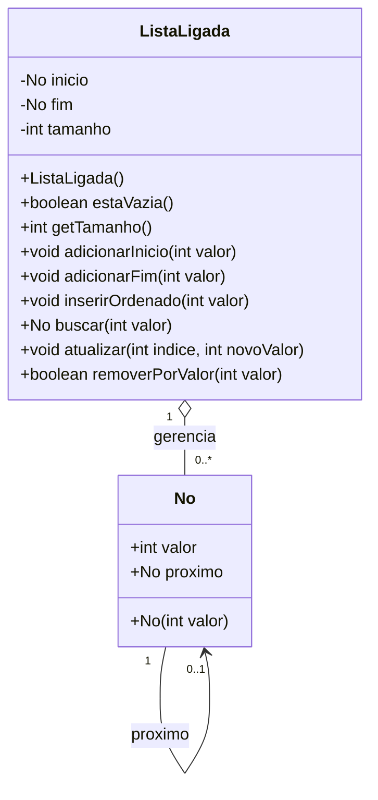

### Representação em Memória Heap

Cada elemento da estrutura reside de forma dispersa no Heap do Java. O encadeamento lógico é mantido exclusivamente pela cadeia de ponteiros:

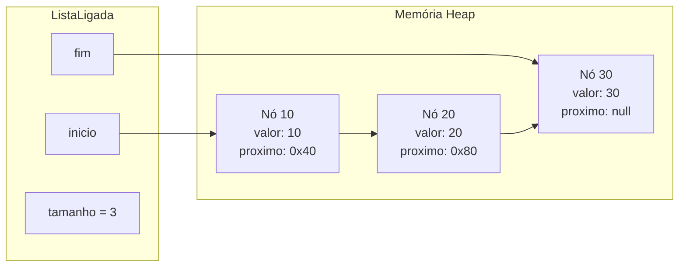

### Implementação Base da Estrutura

```java
public class No {
    public int valor;
    public No proximo;

    public No(int valor) {
        this.valor = valor;
        this.proximo = null;
    }
}

public class ListaLigada {
    private No inicio;
    private No fim;
    private int tamanho;

    public ListaLigada() {
        this.inicio = null;
        this.fim = null;
        this.tamanho = 0;
    }

    public boolean estaVazia() {
        return this.inicio == null;
    }

    public int getTamanho() {
        return this.tamanho;
    }
}
```

### Armadilhas e Invariantes da Estrutura
- **Invariante de Lista Vazia:** Se `tamanho == 0`, obrigatoriamente `inicio == null` e `fim == null`.
- **Invariante de Lista Unitária:** Se `tamanho == 1`, obrigatoriamente `inicio == fim`, e `inicio.proximo == null`.
- **Quebra de Invariante:** Se qualquer método adicionar ou remover nós sem atualizar simultaneamente o ponteiro `fim` ou o contador `tamanho`, a estrutura entra em estado inconsistente, gerando `NullPointerException` ou relatórios falsos de capacidade.

---

## Inserção no fim com tempo constante O(1) e análise de ausência do ponteiro fim O(n)

### Análise Conceitual e Casos Limítrofes

A operação de inserção no final de uma lista ligada tem por objetivo anexar um novo nó após o atual último elemento, tornando esse novo nó o novo término da coleção.

No material apresentado em aula, foi destacado o seguinte trecho:

```java
public void adicionarFim(int valor) {
    No novo = new No(valor);
    fim.proximo = novo;
    fim = novo;
}
```

**Análise Crítica do Trecho:** Este código demonstra com perfeição o mecanismo de religamento de ponteiros em tempo constante. No entanto, ele assume implicitamente que a lista já possui elementos (`fim != null`). Caso a lista esteja inicialmente vazia, a linha `fim.proximo = novo` dispara imediatamente uma exceção `NullPointerException`, pois `fim` é `null`. 

Portanto, em implementações robustas de engenharia de software, é indispensável tratar a ramificação de lista vazia e manter a contagem de `tamanho`.

### Implementação Robusta em Tempo O(1)

```java
public void adicionarFim(int valor) {
    No novo = new No(valor);

    if (estaVazia()) {
        // Caso especial: lista inicialmente vazia
        // O novo elemento se torna simultaneamente o início e o fim
        this.inicio = novo;
        this.fim = novo;
    } else {
        // Caso geral: encadeia o novo nó após o último e atualiza o ponteiro de cauda
        this.fim.proximo = novo;
        this.fim = novo;
    }

    this.tamanho++;
}
```

### Análise Comparativa: Presença vs. Ausência do Ponteiro Fim

A manutenção do atributo `fim` é uma decisão de projeto (*design decision*) clássica em estruturas de dados. Vejamos a implicação de não possuir este atributo:

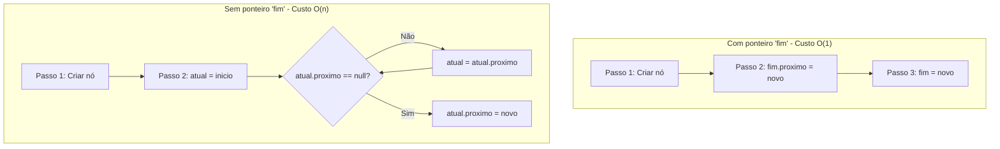

| Critério | Lista Ligada com Ponteiro `fim` | Lista Ligada SEM Ponteiro `fim` |
| :--- | :--- | :--- |
| **Complexidade Temporal** | $O(1)$ constante estrito | $O(n)$ linear dependente do tamanho |
| **Operações Executadas** | Exatamente 2 a 3 atribuições de ponteiro | $n-1$ iterações de laço + atribuição final |
| **Custo de Espaço Adicional** | 1 referência adicional (4 a 8 bytes na controladora) | Zero bytes adicionais na controladora |
| **Uso em Filas (Queues)** | Extremamente eficiente (inserção na cauda em $O(1)$) | Inviável para alto volume de dados |

Se a lista possuir $n = 1.000.000$ de elementos, a versão sem ponteiro `fim` precisará percorrer um milhão de referências em memória antes de conseguir efetuar a inserção, transformando uma operação trivial em um gargalo severo de processamento.

---

## Inserção ordenada no meio: separação entre custo de localização O(n) e religamento O(1)

### O Problema da Inserção em Lista Ordenada

Conforme exposto pelo professor na aula, considere uma lista que mantém seus elementos em ordem crescente: `[10, 20, 30, 40]`. Deseja-se inserir o valor `35`.

Para inserir o valor na posição correta, a operação se desdobra em duas etapas conceitualmente distintas:

1. **Etapa de Localização:** Percorrer a estrutura até identificar o ponto de inserção adequado (o nó anterior ao local onde o 35 deve ficar, ou seja, o nó com valor `30`). Esta busca é sequencial, exigindo percorrer nós um a um: complexidade temporal **$O(n)$**.
2. **Etapa de Religamento:** Criar o novo nó e ajustar os ponteiros para integrá-lo à cadeia: complexidade temporal **$O(1)$**.

Pela regra da análise assintótica, onde o termo dominante dita o comportamento global do método:
$$\text{Complexidade Total} = O(n) + O(1) = O(n)$$

### Sequência Crítica de Religamento de Ponteiros

O erro mais catastrófico em listas simplesmente ligadas é inverter a ordem de atribuição dos ponteiros durante a inserção no meio, o que causa a perda irremediável da referência para o restante da lista (*dangling list* / vazamento de memória).

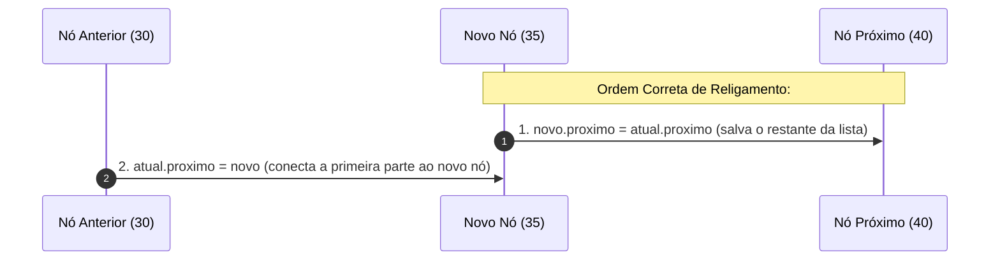

Se o programador executar o passo 2 antes do passo 1 (`atual.proximo = novo`), a referência que apontava para o nó `40` é sobrescrita imediatamente. O nó `40` e todos os subsequentes tornam-se inacessíveis e serão eventualmente recolhidos pelo Garbage Collector.

### Implementação Completa da Inserção Ordenada

```java
public void inserirOrdenado(int valor) {
    No novo = new No(valor);

    // Caso 1: Lista vazia ou novo elemento menor que o primeiro (inserção no início)
    if (estaVazia() || valor <= this.inicio.valor) {
        novo.proximo = this.inicio;
        this.inicio = novo;
        if (this.fim == null) {
            this.fim = novo;
        }
        this.tamanho++;
        return;
    }

    // Caso 2: Busca pelo ponto de inserção no meio ou no fim
    No atual = this.inicio;
    while (atual.proximo != null && atual.proximo.valor < valor) {
        atual = atual.proximo;
    }

    // Caso 3: Religamento dos ponteiros (O(1))
    novo.proximo = atual.proximo;
    atual.proximo = novo;

    // Caso 4: Se inserido após o último elemento, atualiza o ponteiro fim
    if (novo.proximo == null) {
        this.fim = novo;
    }

    this.tamanho++;
}
```

---

## Busca linear por valor e tratamento de elemento inexistente O(n)

### Funcionamento do Algoritmo

Em uma lista simplesmente ligada, os nós não possuem índices físicos na memória. O único mecanismo para determinar se um valor existe na estrutura é iniciar pelo nó referenciado por `inicio` e avançar iterativamente por meio de `atual = atual.proximo`.

O algoritmo apresentado na aula possui a seguinte anatomia:

```java
public No buscar(int valor) {
    No atual = inicio;

    while (atual != null) {
        if (atual.valor == valor) {
            return atual;
        }
        atual = atual.proximo;
    }

    return null;
}
```

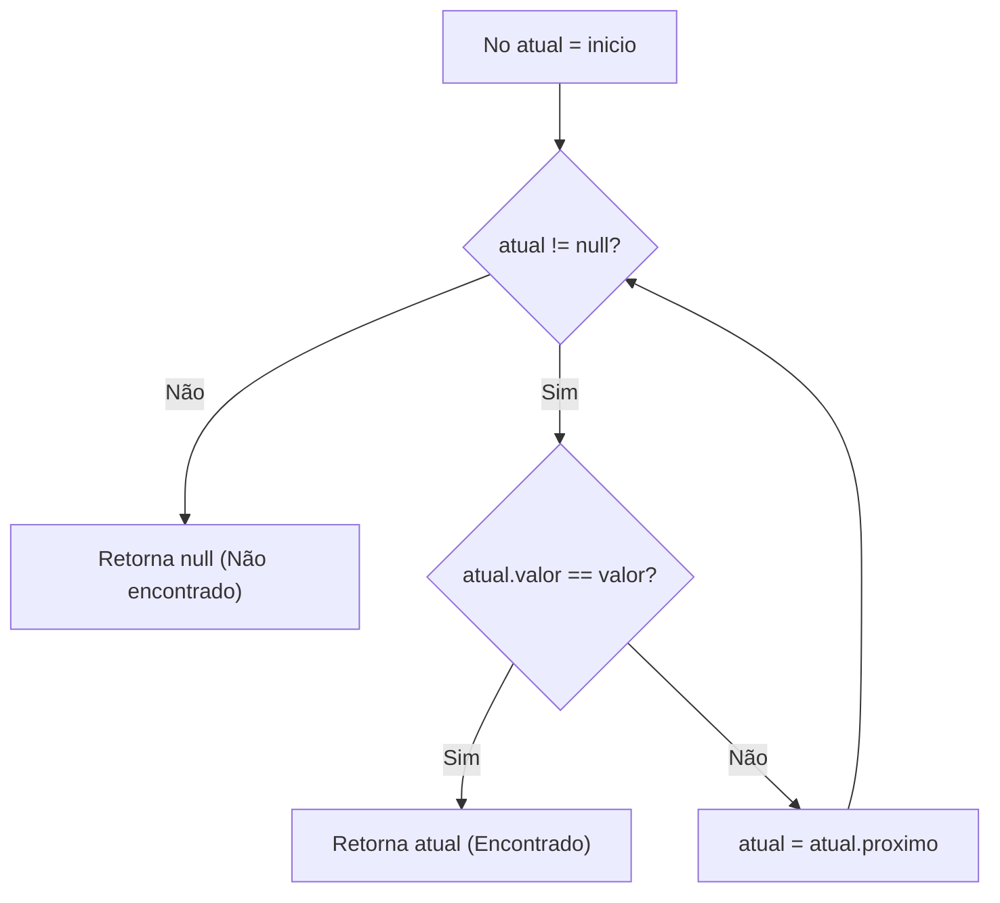

### Análise Assintótica dos Casos
- **Melhor Caso ($\Omega(1)$):** O elemento buscado reside exatamente no primeiro nó da lista (`inicio.valor == valor`). O laço executa apenas uma comparação.
- **Pior Caso ($O(n)$):** O elemento buscado está situado no último nó da lista ou simplesmente não existe na estrutura. O algoritmo é obrigado a percorrer todos os $n$ nós, executando $n$ verificações de condição de laço e $n$ comparações de valor antes de atingir a condição de parada `atual == null`.
- **Caso Médio ($\Theta(n)$):** Assumindo distribuição uniforme de probabilidade, o elemento será encontrado após percorrer aproximadamente $\frac{n}{2}$ nós, o que assintoticamente pertence à classe linear $O(n)$.

---

## Atualização de elemento por índice com validação de limites e navegação sequencial

### O Mecanismo de Acesso Posicional em Estruturas Ligadas

Diferente de um vetor onde `vetor[indice]` é resolvido em hardware em tempo $O(1)$, em uma lista ligada o "índice" é apenas uma abstração lógica. Para alcançar a posição $k$, o algoritmo deve realizar $k$ saltos de ponteiro a partir do `inicio`.

A aula apresentou a seguinte implementação:

```java
public void atualizar(int indice, int novoValor) {
    if (indice < 0) {
        throw new IndexOutOfBoundsException("Índice inválido");
    }

    No atual = inicio;

    for (int i = 0; i < indice; i++) {
        if (atual == null) {
            throw new IndexOutOfBoundsException("Índice fora da lista");
        }
        atual = atual.proximo;
    }

    if (atual == null) {
        throw new IndexOutOfBoundsException("Índice fora da lista");
    }

    atual.valor = novoValor;
}
```

### Análise de Complexidade e Camadas de Verificação

A atualização do valor primitivo `atual.valor = novoValor` é uma operação elementar executada em tempo estritamente constante $O(1)$. No entanto, para chegar até o nó de índice especificado, o laço `for` realiza até $k$ iterações. No pior caso (atualizar o último elemento ou índice inexistente maior que $n$), o número de passos é proporcional ao tamanho da lista. Logo, a complexidade final é **$O(n)$**.

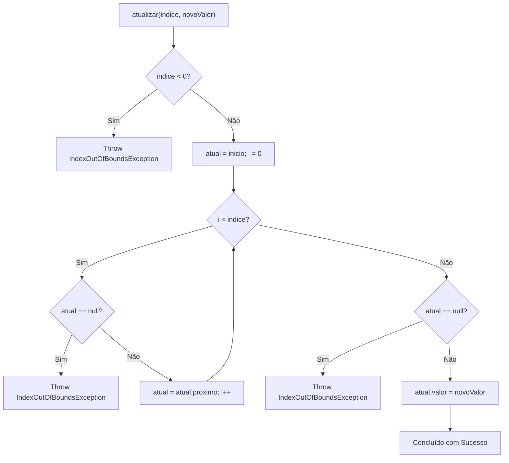

### Otimização com o Atributo `tamanho` (Complemento Técnico)
Se a classe mantém o atributo `tamanho`, é possível validar os limites antes de iniciar qualquer percurso:
```java
if (indice < 0 || indice >= this.tamanho) {
    throw new IndexOutOfBoundsException("Índice " + indice + " fora dos limites (tamanho: " + this.tamanho + ")");
}
```
Essa validação prévia evita percorrer a lista inutilmente caso o índice fornecido seja flagrantemente inválido (por exemplo, pedir o índice 500 em uma lista de 10 elementos).

---

## Trade-offs e critérios de decisão entre lista sequencial e lista ligada

A escolha entre uma lista baseada em vetor contíguo (lista sequencial / `ArrayList`) e uma lista encadeada por nós dinâmicos (`ListaLigada` / `LinkedList`) é uma das decisões arquiteturais mais recorrentes na engenharia de software. Conforme sintetizado pelo Prof. Wesley Soares em aula:

### Lista Sequencial (Vetor Estático ou Dinâmico)
É a estrutura recomendada quando:
- **Acesso aleatório frequente:** Necessidade constante de consultar elementos em índices arbitrários (`get(i)` ou `lista[i]`) em tempo $O(1)$.
- **Baixa taxa de inserções e remoções intermediárias:** As mutações ocorrem quase que exclusivamente no fim da estrutura.
- **Aproveitamento de cache e localidade espacial:** Os elementos adjacentes são carregados em bloco nas linhas de cache L1/L2/L3 da CPU (*cache prefetching*), proporcionando altíssima vazão de iteração.
- **Sobrecarga de memória mínima:** Não consome memória extra com ponteiros; armazena apenas os dados brutos e eventual folga de redimensionamento.

### Lista Ligada (Nós Encadeados)
É a estrutura recomendada quando:
- **Inserções e remoções frequentes em posições conhecidas:** Inserir ou remover elementos na cabeça (ou cauda, com ponteiro `fim`) ocorre em $O(1)$ sem necessidade de deslocar nenhum outro elemento.
- **Ausência de deslocamento de dados:** Elimina completamente o custo de realocar elementos vizinhos para abrir ou fechar lacunas na memória.
- **Crescimento granular e imprevisível:** A estrutura cresce nó a nó, consumindo exatamente o necessário a cada inserção, sem exigir blocos gigantescos de memória física estritamente contígua.
- **Tamanho final desconhecido:** Não sofre paradas bruscas causadas pelo processo de redimensionamento e cópia integral de vetores.

---

## Roteiro de revisão para prova: identificação de entrada, operações, repetições, estrutura, complexidade e memória

No material de revisão apresentado para a avaliação formal (Slide 2), o professor estabeleceu um protocolo de raciocínio estruturado em seis dimensões analíticas. Diante de qualquer algoritmo ou questão teórica na prova, o aluno deve identificar sistematicamente:

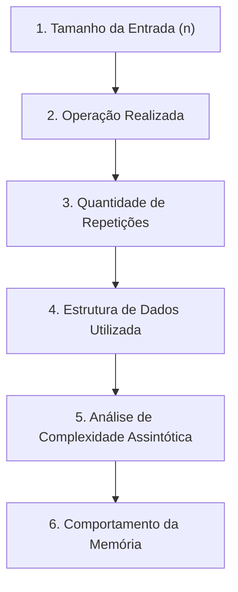

### Guia de Aplicação do Roteiro

1. **Tamanho da Entrada ($n$):**
   - O que define a escala do problema? É o número de elementos na lista? O índice fornecido? O valor numérico de um parâmetro?
2. **Operação Realizada:**
   - Qual é a operação crítica sob análise? Leitura de posição? Comparação de chaves? Atribuição de ponteiro? Deslocamento físico de bytes?
3. **Quantidade de Vezes que a Operação Ocorre:**
   - A operação ocorre uma única vez? Ocorre dentro de um laço de 0 até $n$? Executa em laços aninhados ($n \times n$)? Executa em divisão sucessiva ($\frac{n}{2}$)?
4. **Estrutura de Dados Utilizada:**
   - Os dados estão em um vetor sequencial contíguo com índice direto? Em uma lista simplesmente ligada com nós e ponteiros? A lista mantém referência para o `fim`?
5. **Complexidade (Notação Big-O):**
   - Qual é a classe assintótica no pior caso? $O(1)$? $O(\log n)$? $O(n)$? $O(n^2)$?
6. **Comportamento da Memória:**
   - A alocação é estática ou dinâmica? Há necessidade de blocos contíguos? Haverá realocação e cópia de array (*overhead* de redimensionamento)? Há consumo adicional por ponteiros (*heap overhead*)?

---

## Ordens de complexidade assintótica Big-O: O(1), O(log n), O(n) e O(n²)

A análise assintótica descreve como o tempo de execução ou o consumo de memória de um algoritmo escala à medida que o tamanho da entrada $n$ tende ao infinito ($n \to \infty$).

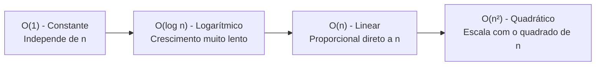

### Detalhamento das Classes de Complexidade

| Notação | Classificação | Comportamento com Crescimento de $n$ | Exemplo Clássico em Estruturas Lineares |
| :--- | :--- | :--- | :--- |
| **$O(1)$** | Constante | O tempo de resposta permanece rigorosamente o mesmo, independentemente de $n$ ser 10 ou 10.000.000. | Acesso por índice em vetor (`vetor[i]`); inserção no início de lista ligada; inserção no fim com ponteiro `fim`. |
| **$O(\log n)$** | Logarítmico | O tempo cresce de forma extremamente lenta. Dobrar o tamanho da entrada acrescenta apenas um número fixo de passos elementares. | Busca binária em vetor sequencial previamente ordenado. |
| **$O(n)$** | Linear | O tempo cresce em proporção direta ao número de elementos. Se $n$ dobra, o número de operações dobra. | Busca linear em vetor ou lista ligada; percurso de nós; deslocamento de elementos em inserção intermediária em vetor. |
| **$O(n^2)$** | Quadrático | O tempo escala com o quadrado da entrada. Se a entrada é multiplicada por 10, o tempo é multiplicado por 100. | Algoritmos de ordenação elementares com laços aninhados (Bubble Sort, Selection Sort, Insertion Sort). |

---

## Deslocamento de elementos na inserção intermediária em lista linear sequencial

### O Mecanismo de Deslocamento (*Shifting*)

Em uma lista linear sequencial implementada sobre um vetor contíguo, os elementos estão dispostos em células contíguas de memória. Conforme demonstrado no Slide 4 da aula:

Considere o vetor com capacidade para 6 elementos contendo:
```text
Índices:   [ 0 ]   [ 1 ]   [ 2 ]   [ 3 ]   [ 4 ]   [ 5 ]
Valores:    10      20      30     null    null    null
```

Deseja-se inserir o valor `15` entre o `10` e o `20` (ou seja, no índice `1`):

1. O elemento `10` permanece no índice `0`.
2. Para que o índice `1` fique livre, o elemento `20` não pode ser simplesmente sobrescrito. Ele deve ser movido para o índice `2`.
3. Porém, o índice `2` já está ocupado pelo `30`. Logo, o `30` deve ser movido primeiro para o índice `3`.
4. Os deslocamentos devem ser processados obrigatoriamente **da direita para a esquerda** (do final para o início):
   - `vetor[3] = vetor[2]` (o valor 30 move-se para a posição 3)
   - `vetor[2] = vetor[1]` (o valor 20 move-se para a posição 2)
5. Com a posição 1 liberada, grava-se: `vetor[1] = 15`.

```text
Estado Final:
Índices:   [ 0 ]   [ 1 ]   [ 2 ]   [ 3 ]   [ 4 ]   [ 5 ]
Valores:    10      15      20      30     null    null
```

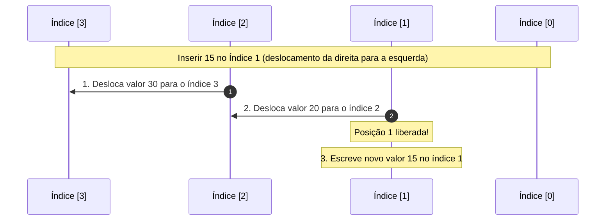

### Análise de Complexidade do Deslocamento
Se a lista contém $n$ elementos e a inserção ocorre no índice $k$, o número de deslocamentos necessários é exatamente:
$$\text{Deslocamentos} = n - k$$

- **Inserção no Início ($k = 0$):** Requer deslocar todos os $n$ elementos. Custo de pior caso: **$O(n)$**.
- **Inserção no Meio ($k \approx \frac{n}{2}$):** Requer deslocar metade dos elementos. Custo médio: **$O(n)$**.
- **Inserção no Fim ($k = n$):** Requer zero deslocamentos (se houver capacidade). Custo de melhor caso: **$O(1)$**.

---

## Mecanismo de redimensionamento dinâmico em lista sequencial: alocação, cópia e inserção

### O Problema do Esgotamento de Capacidade

Vetores em nível de sistema operacional e máquina virtual possuem tamanho fixo alocado no momento da instanciação. Quando uma lista sequencial dinâmica (como a classe interna do `ArrayList`) preenche todas as suas posições e uma nova inserção é solicitada, a estrutura precisa se redimensionar.

Conforme delineado no Slide 5 da revisão, o processo envolve três etapas mandatórias:

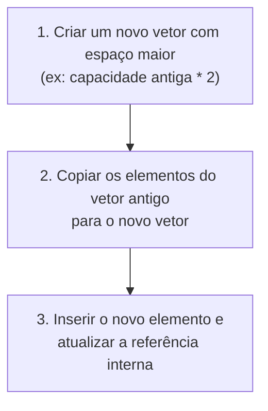

### Visualização do Redimensionamento em Memória

```text
Vetor Antigo (Capacidade = 3, Cheio):
Endereço 0x100: [ 10 | 20 | 30 ]

1. Alocação de Novo Bloco Contíguo (Capacidade = 6):
Endereço 0x500: [ null | null | null | null | null | null ]

2. Cópia Elemento a Elemento:
Endereço 0x500: [ 10 | 20 | 30 | null | null | null ]

3. Inserção do Novo Elemento (40) e Descarte do Bloco 0x100:
Endereço 0x500: [ 10 | 20 | 30 | 40 | null | null ]
```

### Análise de Custo Assintótico e Amortizado (Complemento Técnico)
- **Custo de um Redimensionamento Isolado:** Para copiar $n$ elementos do array antigo para o novo array, são realizadas $n$ leituras e $n$ gravações. Logo, o custo pontual dessa inserção é **$O(n)$**.
- **Custo Amortizado:** Se a estratégia de expansão duplicar a capacidade (fator multiplicador $2\times$), o redimensionamento ocorrerá com frequência decrescente à medida que $n$ cresce. A análise amortizada demonstra que, distribuindo o custo da cópia pelas $n$ inserções anteriores que ocorreram em $O(1)$, o custo médio por operação permanece **$O(1)$ amortizado**.
- **Impacto em Sistemas de Tempo Real:** Apesar do custo amortizado ser $O(1)$, a latência de pico de uma inserção que dispara o redimensionamento é $O(n)$, o que pode causar travamentos indesejados (*latency spikes*) em sistemas de alta frequência ou jogos eletrônicos.

---

## Matriz comparativa de complexidade assintótica entre lista sequencial e lista ligada

A tabela a seguir consolida os conceitos do Slide 6 da aula com complementos técnicos aprofundados sobre as operações fundamentais em ambas as estruturas de dados:

| Operação | Lista Sequencial (Vetor) | Lista Ligada Simples (com ponteiro `fim`) | Justificativa Teórica |
| :--- | :--- | :--- | :--- |
| **Acesso por Índice** | **$O(1)$** | **$O(n)$** | O vetor calcula o endereço via aritmética direta de ponteiros. A lista ligada precisa saltar de nó em nó a partir da cabeça. |
| **Busca por Valor** | **$O(n)$** | **$O(n)$** | Ambas precisam verificar elemento por elemento no pior caso (se a lista sequencial estiver desordenada). |
| **Inserção no Início** | **$O(n)$** | **$O(1)$** | O vetor precisa deslocar todos os $n$ elementos para a direita. A lista ligada apenas religa o ponteiro `inicio`. |
| **Remoção no Início** | **$O(n)$** | **$O(1)$** | O vetor precisa deslocar todos os elementos restantes para a esquerda. A lista ligada apenas faz `inicio = inicio.proximo`. |
| **Inserção no Fim** | **$O(1)$** (se houver vaga) | **$O(1)$** | No vetor, grava diretamente no índice vago. Na lista ligada, atualiza `fim.proximo = novo` e `fim = novo`. |
| **Remoção no Fim** | **$O(1)$** | **$O(n)$** | No vetor, basta decrementar o tamanho. Na lista simplesmente ligada, é preciso percorrer até o penúltimo nó para atualizar o `fim`. |
| **Inserção no Meio** | **$O(n)$** (deslocamento) | **$O(n)$** (busca) + **$O(1)$** (religamento) | Ambas são $O(n)$ no cômputo geral, mas por razões distintas: vetor gasta em cópia de dados; lista ligada gasta em navegação de ponteiros. |
| **Memória Contígua** | **Sim** | **Não necessariamente** | Vetores exigem um bloco físico único e contínuo. Nós de listas ligadas residem dispersos no Heap. |
| **Overhead de Memória** | Baixo (apenas capacidade não utilizada) | Alto (cada nó gasta 4 a 8 bytes extras apenas para armazenar referências) | Em nós pequenos (como um `int`), o ponteiro consome tanta ou mais memória que o próprio dado útil. |

---

## Código da aula

O código pedagógico desenvolvido para este módulo está estruturado em dois arquivos autocontidos e compiláveis:

1. [./codigo/ExemplosAula.java](file:///./codigo/ExemplosAula.java): Implementação completa da classe `ListaLigada` com os métodos apresentados em aula: estrutura de nó, inserção no início, inserção no fim em $O(1)$, busca linear e atualização por índice com tratamento rigoroso de exceções.
2. [./codigo/Exercicios.java](file:///./codigo/Exercicios.java): Solução dos exercícios propostos com cenários de testes exaustivos e medição comparativa de operações.

### Destaques do Arquivo `ExemplosAula.java`

Abaixo estão os trechos essenciais do arquivo [./codigo/ExemplosAula.java](file:///./codigo/ExemplosAula.java), comentados linha a linha para demonstrar o controle de integridade da estrutura:

```java
// Trecho de Inserção no Fim em O(1) com manutenção de invariantes
public void adicionarFim(int valor) {
    No novo = new No(valor); // Instancia o nó no Heap (novo.proximo é null)

    if (estaVazia()) {
        // Se a lista não tinha elementos, novo nó é tanto início quanto fim
        this.inicio = novo;
        this.fim = novo;
    } else {
        // Se já existiam nós, o atual fim aponta para o novo nó
        this.fim.proximo = novo;
        // O ponteiro fim passa a ser o novo nó
        this.fim = novo;
    }

    this.tamanho++; // Mantém a cardinalidade atualizada em O(1)
}

// Trecho de Atualização por Índice com Validação Estrita
public void atualizar(int indice, int novoValor) {
    // Validação de limite inferior
    if (indice < 0) {
        throw new IndexOutOfBoundsException("Índice não pode ser negativo: " + indice);
    }

    No atual = this.inicio;

    // Navega sequencialmente até o nó de índice desejado
    for (int i = 0; i < indice; i++) {
        if (atual == null) {
            // Interrompe se a lista terminar antes do índice requisitado
            throw new IndexOutOfBoundsException("Índice fora dos limites da lista: " + indice);
        }
        atual = atual.proximo;
    }

    // Validação caso a lista esteja vazia ou o índice seja exatamente igual ao tamanho
    if (atual == null) {
        throw new IndexOutOfBoundsException("Índice fora dos limites da lista: " + indice);
    }

    // Operação elementar de mutação em tempo O(1)
    atual.valor = novoValor;
}
```

---

## Exercícios

### Exercício 1: Inserção Robusta no Fim com Manutenção de Ponteiros

**Enunciado:**  
Implemente na classe de lista ligada o método `adicionarFim(int valor)` que trate de forma robusta o caso de inserção em lista inicialmente vazia (quando `inicio == null`), atualize corretamente as referências de `inicio` e `fim`, e incremente a contagem de `tamanho`, garantindo complexidade de tempo constante $O(1)$.

**Raciocínio Algorítmico:**
1. Instanciar o novo nó contendo o valor solicitado.
2. Checar a invariante de lista vazia (`inicio == null` ou `tamanho == 0`).
3. Se vazia, atribuir tanto `inicio` quanto `fim` ao novo nó.
4. Se não vazia, encadear o nó no sucessor do atual fim (`fim.proximo = novo`) e atualizar a cauda (`fim = novo`).
5. Incrementar o atributo `tamanho`.

**Resolução Completa em Java:**
```java
public void adicionarFimRobusto(int valor) {
    No novo = new No(valor);

    if (this.inicio == null) {
        this.inicio = novo;
        this.fim = novo;
    } else {
        this.fim.proximo = novo;
        this.fim = novo;
    }

    this.tamanho++;
}
```
*Código completo disponível em:* [./codigo/Exercicios.java](file:///./codigo/Exercicios.java)

---

### Exercício 2: Inserção Ordenada no Meio da Lista Ligada

**Enunciado:**  
Considerando uma lista com elementos em ordem crescente, implemente o método `inserirOrdenado(int valor)` conforme discutido em aula para o elemento `35`. O algoritmo deve localizar a posição correta navegando pelos nós com custo $O(n)$ e inserir o novo nó ajustando os ponteiros em $O(1)$, cobrindo adequadamente os casos de inserção no início, no meio e no fim.

**Raciocínio Algorítmico:**
1. Tratar inserção na cabeça se a lista estiver vazia ou se o novo valor for menor ou igual a `inicio.valor`.
2. Caso contrário, utilizar um ponteiro auxiliar `atual = inicio`.
3. Avançar enquanto `atual.proximo != null` e `atual.proximo.valor < valor`. A parada ocorre exatamente no nó predecessor do ponto de inserção.
4. Realizar o religamento seguro: `novo.proximo = atual.proximo`, seguido de `atual.proximo = novo`.
5. Se o novo nó foi adicionado após o último elemento (`novo.proximo == null`), atualizar o ponteiro `fim = novo`.
6. Incrementar `tamanho`.

**Resolução Completa em Java:**
```java
public void inserirOrdenado(int valor) {
    No novo = new No(valor);

    // Caso A: Inserção na cabeça (lista vazia ou valor menor que o início)
    if (this.inicio == null || valor <= this.inicio.valor) {
        novo.proximo = this.inicio;
        this.inicio = novo;
        if (this.fim == null) {
            this.fim = novo;
        }
        this.tamanho++;
        return;
    }

    // Caso B: Busca do predecessor no meio da lista
    No atual = this.inicio;
    while (atual.proximo != null && atual.proximo.valor < valor) {
        atual = atual.proximo;
    }

    // Caso C: Religamento de ponteiros O(1)
    novo.proximo = atual.proximo;
    atual.proximo = novo;

    // Caso D: Inserção na cauda (atualização de fim)
    if (novo.proximo == null) {
        this.fim = novo;
    }

    this.tamanho++;
}
```
*Código completo disponível em:* [./codigo/Exercicios.java](file:///./codigo/Exercicios.java)

---

### Exercício 3: Busca e Remoção de Elemento por Valor

**Enunciado:**  
Implemente o método `removerPorValor(int valor)` que localiza e remove a primeira ocorrência de um determinado valor em uma lista simplesmente ligada. O algoritmo deve percorrer a lista mantendo a referência do nó anterior, ajustar as referências de `proximo`, atualizar os ponteiros `inicio` ou `fim` se o nó removido for uma das extremidades, decrementar o `tamanho` e retornar `true` em caso de sucesso ou `false` se o elemento não for encontrado.

**Raciocínio Algorítmico:**
1. Se a lista estiver vazia, retornar imediatamente `false`.
2. Se o nó a ser removido for o primeiro (`inicio.valor == valor`), avançar o `inicio` para `inicio.proximo`. Se a lista ficou vazia, setar `fim = null`. Decrementar `tamanho` e retornar `true`.
3. Caso contrário, manter dois ponteiros durante o percurso: `anterior` e `atual`.
4. Avançar até encontrar `atual.valor == valor` ou `atual == null`.
5. Se encontrado, desviar o encadeamento: `anterior.proximo = atual.proximo`.
6. Se o nó removido for o último (`atual == fim`), atualizar `fim = anterior`.
7. Decrementar `tamanho` e retornar `true`.

**Resolução Completa em Java:**
```java
public boolean removerPorValor(int valor) {
    if (this.inicio == null) {
        return false;
    }

    // Remoção na cabeça
    if (this.inicio.valor == valor) {
        this.inicio = this.inicio.proximo;
        if (this.inicio == null) {
            this.fim = null;
        }
        this.tamanho--;
        return true;
    }

    // Busca do elemento com rastreamento do nó anterior
    No anterior = this.inicio;
    No atual = this.inicio.proximo;

    while (atual != null && atual.valor != valor) {
        anterior = atual;
        atual = atual.proximo;
    }

    // Se o valor não existe na lista
    if (atual == null) {
        return false;
    }

    // Bypass do nó atual
    anterior.proximo = atual.proximo;

    // Se removeu o último nó, atualiza o ponteiro de cauda
    if (atual == this.fim) {
        this.fim = anterior;
    }

    this.tamanho--;
    return true;
}
```
*Código completo disponível em:* [./codigo/Exercicios.java](file:///./codigo/Exercicios.java)

---

### Exercício 4: Simulação Comparativa de Custo: Deslocamento vs Percurso

**Enunciado:**  
Desenvolva um programa que compare a quantidade de operações elementares executadas ao inserir um elemento na posição central de uma lista sequencial baseada em vetor (contando a quantidade de deslocamentos de elementos à direita) versus uma lista simplesmente ligada (contando os nós percorridos até o ponto de inserção), demonstrando numericamente as implicações de desempenho abordadas na revisão da prova.

**Raciocínio Algorítmico:**
1. Criar um vetor populado com $n$ elementos e simular a inserção no índice $\frac{n}{2}$. Contar o número de movimentações de memória necessárias da posição $n-1$ até $\frac{n}{2}$.
2. Criar uma lista ligada com $n$ elementos e simular a inserção no índice $\frac{n}{2}$. Contar quantos saltos de ponteiro são realizados da cabeça até o nó anterior à posição central.
3. Exibir e comparar as métricas para diferentes valores de $n$ (ex: $n = 10$, $n = 1.000$, $n = 100.000$).

**Resolução Completa em Java:**
```java
public class ComparativoOperacoes {
    public static void simular(int n) {
        int indiceInsercao = n / 2;

        // 1. Simulação na Lista Sequencial (Vetor)
        // Quantidade de deslocamentos para abrir espaço no índice n/2
        long deslocamentosVetor = 0;
        for (int i = n - 1; i >= indiceInsercao; i--) {
            deslocamentosVetor++;
        }

        // 2. Simulação na Lista Ligada
        // Quantidade de saltos de ponteiro até atingir o nó antecessor
        long saltosListaLigada = 0;
        for (int i = 0; i < indiceInsercao; i++) {
            saltosListaLigada++;
        }

        System.out.println("Tamanho n = " + n + " | Insercao no indice = " + indiceInsercao);
        System.out.println(" - Vetor (Deslocamentos de memoria): " + deslocamentosVetor + " operacoes.");
        System.out.println(" - Lista Ligada (Passos de percurso de nos): " + saltosListaLigada + " operacoes.");
        System.out.println(" Ambos operam com custo O(n), porem com overheads de hardware distintos.\n");
    }
}
```
*Código completo disponível em:* [./codigo/Exercicios.java](file:///./codigo/Exercicios.java)

---

## Erros comuns e boas práticas

### Erros Comuns Identificados em Laboratório e Provas

1. **Inversão da Ordem de Ponteiros na Inserção:**  
   Escrever `atual.proximo = novo` antes de `novo.proximo = atual.proximo`.  
   *Consequência:* Perda irreversível de todos os nós subsequentes da lista.
2. **Esquecer de Tratar Lista Inicialmente Vazia:**  
   Fazer `fim.proximo = novo` diretamente sem checar se `fim == null`.  
   *Consequência:* Disparo imediato de `NullPointerException`.
3. **Esquecer de Atualizar o Ponteiro `fim`:**  
   Inserir um nó no final da lista ou no meio (quando o elemento inserido passa a ser o último) e esquecer de redirecionar o ponteiro `fim`.  
   *Consequência:* O ponteiro `fim` fica apontando para o antigo penúltimo nó, corrompendo futuras inserções na cauda.
4. **Deslocamento na Direção Incorreta em Vetores:**  
   Ao abrir espaço em um vetor para inserção intermediária, iterar do índice de inserção para o final (`for (int i = indice; i < tamanho; i++) vetor[i+1] = vetor[i]`).  
   *Consequência:* O valor do elemento em `indice` é copiado em cascata por todo o restante do vetor, destruindo todos os dados originais. O deslocamento deve ser sempre do final para o início.
5. **Acesso Além dos Limites do Laço de Percurso:**  
   Utilizar `while (atual.valor != valor)` sem verificar previamente `while (atual != null)`.  
   *Consequência:* Se o elemento não existir, `atual` torna-se `null` e a consulta a `atual.valor` lança `NullPointerException`.

### Boas Práticas de Engenharia de Software

- **Modularização de Casos Limítrofes:** Crie métodos auxiliares claros como `estaVazia()` para simplificar o controle de fluxo.
- **Sempre Atualizar o Contador `tamanho`:** Cada método de mutação (`adicionar`, `remover`) deve conter exatamente um incremento ou decremento de `tamanho`.
- **Validação Antecipada (*Fail-Fast*):** Valide parâmetros negativos ou índices inconsistentes logo na primeira linha do método antes de alocar memória ou iniciar laços de repetição.
- **Isolamento do Nó:** Mantenha a classe `No` o mais enxuta possível, deixando toda a lógica de negócio e manipulação de estado restrita à controladora `ListaLigada`.

---

## Links e materiais complementares

- **Notion da Disciplina (ED I Aula 06):** Notas oficiais da aula ministrada pelo Prof. Wesley Soares sobre operações em lista ligada e análise de desempenho:  
  [https://outgoing-salt-444.notion.site/ED-I-Aula-06-Lista-Ligada-Opera-es-e-An-lise-de-Desempenho-3d58a4f8f8a7804fba27f2e83e8f9aec](https://outgoing-salt-444.notion.site/ED-I-Aula-06-Lista-Ligada-Opera-es-e-An-lise-de-Desempenho-3d58a4f8f8a7804fba27f2e83e8f9aec)
- **Documentação Oficial Java - `java.util.LinkedList`:** Referência oficial do OpenJDK detalhando a implementação padrão de lista duplamente encadeada:  
  [https://docs.oracle.com/en/java/javase/17/docs/api/java.base/java/util/LinkedList.html](https://docs.oracle.com/en/java/javase/17/docs/api/java.base/java/util/LinkedList.html)
- **Documentação Oficial Java - `java.util.ArrayList`:** Referência oficial da implementação padrão de lista linear baseada em vetor redimensionável:  
  [https://docs.oracle.com/en/java/javase/17/docs/api/java.base/java/util/ArrayList.html](https://docs.oracle.com/en/java/javase/17/docs/api/java.base/java/util/ArrayList.html)
- **Visualgo - Visualização Interativa de Listas Ligadas:** Ferramenta gráfica para simulação de inserções, remoções e percursos de ponteiros em tempo real:  
  [https://visualgo.net/en/list](https://visualgo.net/en/list)
- **Big-O Cheat Sheet:** Tabela consolidada de complexidade temporal e espacial para todas as estruturas clássicas da computação:  
  [https://www.bigocheatsheet.com/](https://www.bigocheatsheet.com/)

---

## Mapa da aula

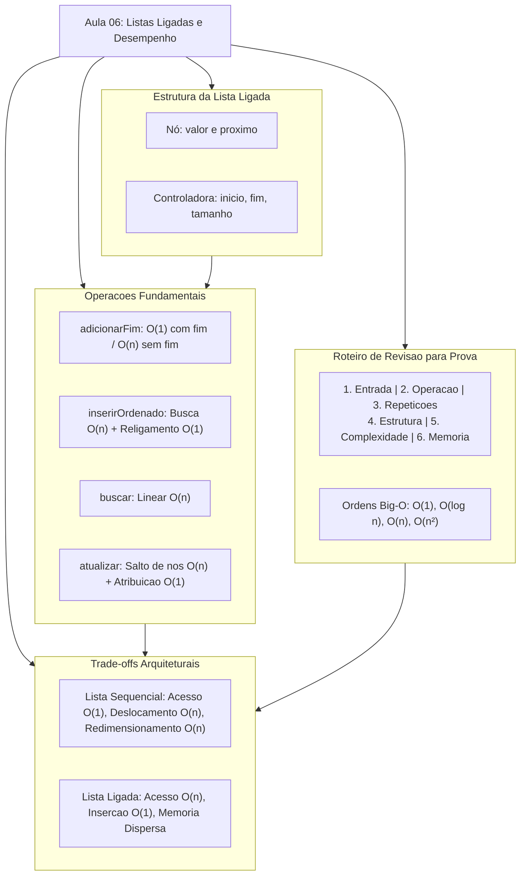

---

## Glossário

| Termo | Definição Técnica |
| :--- | :--- |
| **Nó (*Node*)** | Unidade elementar de alocação de uma lista ligada. Armazena o dado útil (*payload*) e ao menos um ponteiro de referência para o próximo elemento. |
| **Ponteiro / Referência** | Variável cujo valor é o endereço de memória de outra estrutura ou objeto no *Heap*. Em Java, manipulado de forma transparente e segura sem aritmética de ponteiros crua. |
| **Ponteiro de Cauda (`fim`)** | Atributo mantido pela controladora da lista que aponta diretamente para o último elemento da sequência, viabilizando inserções em cauda em $O(1)$. |
| **Complexidade Assintótica** | Estudo do comportamento de recursos computacionais (tempo ou memória) exigidos por um algoritmo quando o tamanho da entrada cresce indefinidamente. |
| **Notação Big-O ($O$)** | Notação matemática que expressa o limite superior (*upper bound*) assintótico do tempo de execução de um algoritmo no pior caso. |
| **Tempo Constante $O(1)$** | Algoritmo cujo tempo de processamento independe totalmente da quantidade de dados armazenada na estrutura. |
| **Tempo Linear $O(n)$** | Algoritmo cujo tempo de execução cresce em proporção direta e linear à quantidade de elementos presentes na estrutura. |
| **Deslocamento (*Shifting*)** | Operação necessária em listas sequenciais que consiste em mover fisicamente elementos adjacentes para posições vizinhas a fim de abrir ou fechar vagas. |
| **Redimensionamento** | Processo executado por listas sequenciais dinâmicas ao atingirem capacidade máxima, envolvendo alocação de novo array maior e cópia integral dos dados. |
| **Localidade de Referência** | Princípio de hardware em que o acesso a um endereço de memória torna muito provável o acesso a endereços fisicamente vizinhos em instantes futuros, beneficiando vetores via cache. |
| **Overhead de Ponteiros** | Custo de memória suplementar gasto exclusivamente para armazenar as referências (`proximo`), sem agregar informação de negócio diretamente. |

---

## Pontos-chave para a prova

Para garantir pontuação máxima nas avaliações do Prof. Wesley Soares, memorize os seguintes pontos de atenção:

1. **Os 6 Passos de Avaliação de Algoritmos:** Diante de qualquer trecho de código, identifique na ordem: tamanho da entrada ($n$), operação realizada, quantidade de repetições, estrutura utilizada, complexidade Big-O e comportamento da memória.
2. **Por que a inserção no fim é $O(1)$ com `fim` e $O(n)$ sem `fim`:** Com o ponteiro `fim`, o acesso ao último nó é imediato. Sem ele, é obrigatório iterar nó a nó desde `inicio` até encontrar `atual.proximo == null`.
3. **Diferenciação entre Localização e Modificação:** Inserir no meio de uma lista ligada tem custo de modificação de ponteiros $O(1)$, mas o custo de localização da posição correta é $O(n)$, tornando o método global $O(n)$.
4. **Deslocamento em Lista Sequencial:** Inserir no meio de um vetor exige deslocar $(n - k)$ elementos para a direita. Para evitar sobrescrever dados, o laço de deslocamento deve rodar **obrigatoriamente da direita para a esquerda**.
5. **Redimensionamento em 3 Fases:** Para expandir um vetor cheio: (1) aloca novo vetor com capacidade maior; (2) copia todos os elementos do vetor antigo; (3) insere o novo elemento e atualiza a referência.
6. **Acesso Aleatório por Índice:** É $O(1)$ em listas sequenciais (endereçamento aritmético contíguo) e $O(n)$ em listas ligadas (necessidade de percorrer a cadeia de referências nó a nó).

---

## Perguntas e respostas (JSONL)

```jsonl
{"pergunta": "Qual a complexidade temporal da inserção no fim em uma lista ligada que não possui o ponteiro fim?", "resposta": "O(n), pois é necessário percorrer toda a lista a partir do início até encontrar o nó cujo campo próximo seja nulo.", "dificuldade": "facil"}
{"pergunta": "Qual a complexidade temporal da inserção no fim em uma lista ligada que possui o ponteiro fim?", "resposta": "O(1), pois a referência fim permite ligar o novo nó diretamente ao último em tempo constante.", "dificuldade": "facil"}
{"pergunta": "Por que a inserção no meio de uma lista ligada possui complexidade total O(n)?", "resposta": "Porque embora o religamento dos ponteiros seja O(1), a busca sequencial para localizar a posição correta de inserção consome tempo O(n).", "dificuldade": "media"}
{"pergunta": "Em uma lista sequencial com n elementos, quantos deslocamentos ocorrem ao inserir no índice 0?", "resposta": "Exatamente n deslocamentos, pois todos os elementos existentes devem ser movidos uma posição para a direita.", "dificuldade": "facil"}
{"pergunta": "Qual a ordem correta para deslocar elementos em um vetor durante uma inserção intermediária?", "resposta": "Do final para o início (da direita para a esquerda), evitando a sobrescrita prematura dos elementos vizinhos.", "dificuldade": "media"}
{"pergunta": "Quais são as três etapas do redimensionamento dinâmico em uma lista sequencial baseada em vetor?", "resposta": "1. Alocar um novo vetor com capacidade maior; 2. Copiar os elementos do vetor antigo para o novo; 3. Inserir o novo elemento e atualizar a referência.", "dificuldade": "media"}
{"pergunta": "Qual estrutura apresenta melhor localidade de referência espacial em hardware: lista sequencial ou ligada?", "resposta": "Lista sequencial, pois seus elementos residem em células de memória estritamente contíguas, favorecendo o cache da CPU.", "dificuldade": "media"}
{"pergunta": "Qual a complexidade do acesso por índice get(i) em uma lista ligada?", "resposta": "O(n), pois a estrutura precisa navegar sequencialmente por i nós a partir da cabeça da lista.", "dificuldade": "facil"}
{"pergunta": "Qual a complexidade do acesso por índice get(i) em uma lista sequencial baseada em vetor?", "resposta": "O(1), pois a posição de memória é calculada instantaneamente através de aritmética direta de ponteiros.", "dificuldade": "facil"}
{"pergunta": "O que acontece se a atribuição 'atual.proximo = novo' for feita antes de 'novo.proximo = atual.proximo' na inserção?", "resposta": "Ocorre a perda irremediável da referência para o restante da lista ligada, causando vazamento de memória dos nós subsequentes.", "dificuldade": "dificil"}
{"pergunta": "Quais são os 6 pontos do roteiro de análise de algoritmos para prova ensinados pelo Prof. Wesley?", "resposta": "Tamanho da entrada, operação realizada, quantidade de repetições, estrutura utilizada, complexidade e comportamento da memória.", "dificuldade": "media"}
{"pergunta": "O que representa uma complexidade assintótica O(log n)?", "resposta": "Um algoritmo cujo tempo de execução cresce de forma muito lenta à medida que a entrada aumenta, típico de buscas binárias.", "dificuldade": "facil"}
{"pergunta": "Qual a complexidade da remoção no início em uma lista simplesmente ligada?", "resposta": "O(1), bastando atualizar a referência de início para inicio.proximo.", "dificuldade": "facil"}
{"pergunta": "Qual a complexidade da remoção no início em uma lista sequencial baseada em vetor?", "resposta": "O(n), pois todos os n-1 elementos restantes precisam ser deslocados uma posição para a esquerda.", "dificuldade": "facil"}
{"pergunta": "Qual a complexidade da remoção no final em uma lista simplesmente ligada mantendo ponteiros inicio e fim?", "resposta": "O(n), pois mesmo tendo o ponteiro fim, é necessário percorrer desde o início para descobrir o penúltimo nó e atualizar seu ponteiro proximo para null.", "dificuldade": "dificil"}
{"pergunta": "Quando a lista ligada é mais vantajosa que a lista sequencial?", "resposta": "Quando ocorrem frequentes inserções e remoções no início ou em posições já conhecidas, ou quando o tamanho final da coleção é desconhecido.", "dificuldade": "facil"}
{"pergunta": "O que ocorre se o método adicionarFim for executado sem tratar lista vazia com a instrução fim.proximo = novo?", "resposta": "Dispara NullPointerException, pois fim aponta para null.", "dificuldade": "media"}
{"pergunta": "Qual a desvantagem de memória de uma lista ligada em relação a um vetor para armazenar inteiros primitivos?", "resposta": "Alto overhead de memória, pois cada nó precisa alocar referências adicionais (4 a 8 bytes) além do dado primitivo.", "dificuldade": "media"}
{"pergunta": "Como a presença da variável 'tamanho' otimiza a verificação de limites em métodos indexados de lista ligada?", "resposta": "Permite validar em O(1) se o índice solicitado é menor que zero ou maior/igual ao tamanho antes de iniciar qualquer laço.", "dificuldade": "facil"}
{"pergunta": "Qual a complexidade de tempo amortizada da inserção no fim de uma lista sequencial com estratégia de duplicação?", "resposta": "O(1) amortizado, pois o custo pesado de O(n) do redimensionamento ocorre raramente e é diluído entre muitas inserções baratas.", "dificuldade": "dificil"}
```

---

## Checklist de revisão

Marque cada item conforme consolidar os conhecimentos para a avaliação formal:

- [ ] Sei implementar a classe `No` contendo `valor` e `proximo`.
- [ ] Compreendo o papel dos atributos `inicio`, `fim` e `tamanho` na controladora `ListaLigada`.
- [ ] Sei implementar `adicionarFim(int valor)` tratando tanto o caso geral quanto o caso de lista vazia.
- [ ] Consigo explicar verbalmente por que a ausência do ponteiro `fim` degrada a inserção na cauda de $O(1)$ para $O(n)$.
- [ ] Compreendo a ordem estrita de religamento na inserção intermediária: primeiro `novo.proximo = atual.proximo`, depois `atual.proximo = novo`.
- [ ] Sei diferenciar o custo de localização $O(n)$ do custo de modificação estrutural $O(1)$ na inserção ordenada.
- [ ] Sei implementar a busca linear por valor tratando o caso em que o elemento não está presente na lista.
- [ ] Sei implementar o método `atualizar(indice, novoValor)` com validação de limites inferiores e superiores.
- [ ] Domino os seis passos do roteiro de análise de algoritmos do Prof. Wesley Soares para responder questões de prova.
- [ ] Sei classificar e ordenar as classes assintóticas: $O(1) < O(\log n) < O(n) < O(n^2)$.
- [ ] Sei explicar por que o deslocamento de elementos em inserções intermediárias em vetores deve ocorrer da direita para a esquerda.
- [ ] Consigo descrever as três fases do redimensionamento dinâmico em listas sequenciais (alocação, cópia e inserção).
- [ ] Conheço a matriz comparativa completa entre listas sequenciais e ligadas para acesso, busca, inserção e remoção nas extremidades.
- [ ] Sei explicar as diferenças de localidade de referência de cache e fragmentação de memória entre as duas estruturas.
