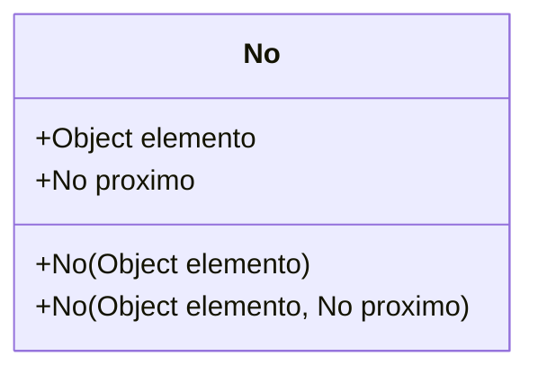
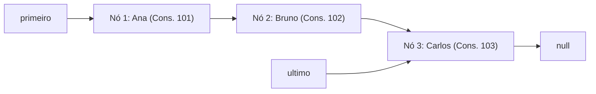
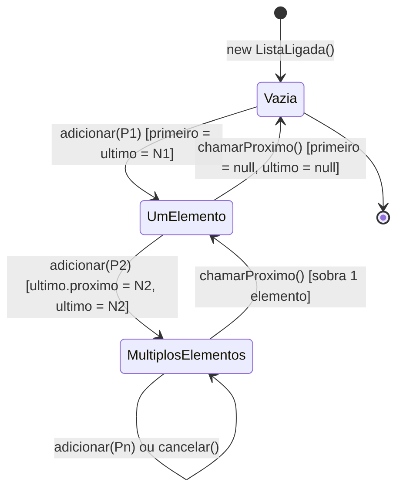
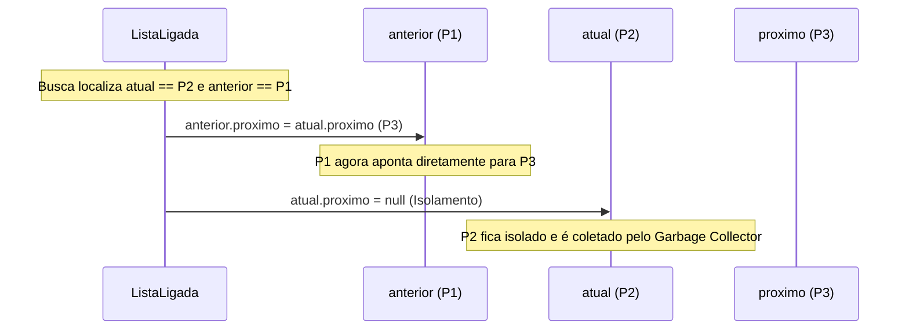
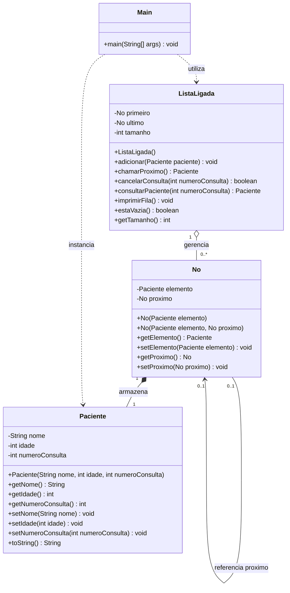
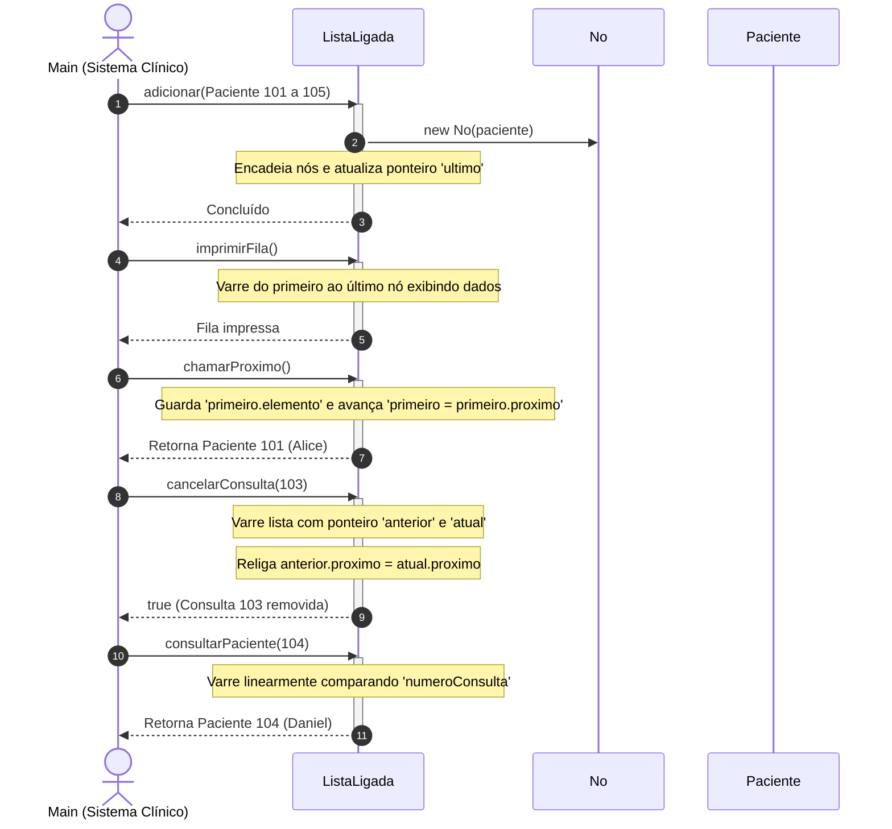
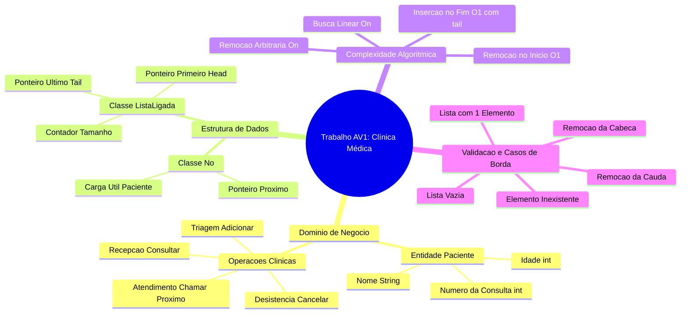

# Trabalho — Trabalho AV1

> **Professor:** Wesley Soares
> **Disciplina:** Estrutura de Dados I (4º Semestre)
> **Prazo de Entrega:** 08/09/2026 às 23:59
> **Pontuação Máxima:** 100 pontos
> **Conteúdo cobrado:** [Aula 01 - Introdução a Algoritmos e Estrutura de Dados](../../Aulas/Aula%2001%20-%20Introdu%C3%A7%C3%A3o%20a%20Algoritmos%20e%20Estrutura%20de%20Dados/detalhes.md), [Aula 02 - Fundamentos e Análise de Algoritmos](../../Aulas/Aula%2002%20-%20Fundamentos%20e%20An%C3%A1lise%20de%20Algoritmos/detalhes.md), [Aula 03 - Listas ligadas dinâmicas](../../Aulas/Aula%2003%20-%20Listas%20ligadas%20din%C3%A2micas/detalhes.md), [Aula 04 - Fundamentos de Estruturas Lineares e Complexidade](../../Aulas/Aula%2004%20-%20Fundamentos%20de%20Estruturas%20Lineares%20e%20Complexidade/detalhes.md), [Aula 06 - Pilhas Conceito e Implementacao](../../Aulas/Aula%2006%20-%20Pilhas%20Conceito%20e%20Implementacao/detalhes.md)

---

## Sumário

- [Enunciado original (Google Classroom)](#enunciado-original-google-classroom)
- [Análise do que é pedido](#análise-do-que-é-pedido)
  - [Objetivo do sistema](#objetivo-do-sistema)
  - [Entidades e atributos](#entidades-e-atributos)
  - [Operações fundamentais](#operações-fundamentais)
  - [Requisitos da classe Main](#requisitos-da-classe-main)
  - [Critérios implícitos e armadilhas técnicas](#critérios-implícitos-e-armadilhas-técnicas)
- [Fundamentação teórica](#fundamentação-teórica)
  - [Listas ligadas dinâmicas vs Vetores estáticos](#listas-ligadas-dinâmicas-vs-vetores-estáticos)
  - [Anatomia do Nó e referências de memória na JVM](#anatomia-do-nó-e-referências-de-memória-na-jvm)
  - [Comportamento de Fila (FIFO) sobre Lista Ligada](#comportamento-de-fila-fifo-sobre-lista-ligada)
  - [Análise de complexidade temporal e espacial](#análise-de-complexidade-temporal-e-espacial)
  - [Diagramas de estados e manipulação de referências](#diagramas-de-estados-e-manipulação-de-referências)
- [Resolução proposta](#resolução-proposta)
  - [Arquitetura e modelagem UML](#arquitetura-e-modelagem-uml)
  - [Classe Paciente](#classe-paciente)
  - [Classe No](#classe-no)
  - [Classe ListaLigada](#classe-listaligada)
  - [Classe Main](#classe-main)
  - [Diagrama de sequência da execução](#diagrama-de-sequência-da-execução)
- [Como testar e validar](#como-testar-e-validar)
  - [Compilação e execução via linha de comando](#compilação-e-execução-via-linha-de-comando)
  - [Matriz de casos de teste](#matriz-de-casos-de-teste)
  - [Saída esperada no terminal](#saída-esperada-no-terminal)
- [Critérios de qualidade](#critérios-de-qualidade)
- [Arquivos de apoio](#arquivos-de-apoio)
- [Mapa da atividade](#mapa-da-atividade)
- [Glossário](#glossário)
- [Pontos-chave para a prova](#pontos-chave-para-a-prova)
- [Perguntas e respostas (JSONL)](#perguntas-e-respostas-jsonl)
- [Checklist de revisão](#checklist-de-revisão)

---

## Enunciado original (Google Classroom)

### Trabalho AV1 (01/09/2026)
Enviar:
- classe main
- classe no
- classe listaLigada

### Anexo: trabalho AV1.docx
Exercício 1 — Sistema de Atendimento de uma Clínica

**Contexto**
Uma clínica precisa controlar a fila de pacientes que aguardam atendimento.
Por enquanto, o sistema será simples: os pacientes são armazenados em uma lista ligada, e cada paciente possui:
- nome;
- idade;
- número da consulta.

A ideia é utilizar a ListaLigada estudada em sala para armazenar os pacientes.

**Requisitos do sistema**
O sistema deve permitir:
1. **Adicionar paciente:** O paciente deve ser colocado no final da lista.
2. **Chamar próximo paciente:** O primeiro paciente deve ser removido da lista e retornado.
3. **Cancelar uma consulta:** O sistema deve procurar o paciente pelo número da consulta e removê-lo da lista.
4. **Consultar paciente:** O método deve procurar um paciente pelo número da consulta.

**O que deve ser entregue**
Um programa contendo:
- `Paciente`
- `ListaLigada<Paciente>`
- `Sistema de Atendimento`

E um `main` demonstrando:
- cadastro de pelo menos 5 pacientes;
- impressão da fila;
- chamada do próximo paciente;
- cancelamento de uma consulta;
- busca de um paciente.

---

## Análise do que é pedido

### Objetivo do sistema
Construir uma solução completa em Java que simule o fluxo operacional de recepção e triagem de uma clínica médica. O núcleo do sistema baseia-se em uma estrutura de dados linear dinâmica do tipo Lista Simplesmente Ligada (Singly Linked List), responsável por gerenciar a sequência de atendimento dos pacientes sem o uso de estruturas prontas da Java Collections Framework (como `java.util.LinkedList` ou `java.util.ArrayList`).

### Entidades e atributos
A especificação estabelece os seguintes componentes de dados:
1. **Paciente**:
   - `nome`: representação textual (`String`) identificando o paciente.
   - `idade`: valor numérico inteiro (`int`) para controle de prioridade ou triagem demográfica.
   - `numeroConsulta`: valor numérico inteiro (`int`) único que serve como identificador de busca e cancelamento.
2. **Nó (`No`)**:
   - `elemento`: carga útil (payload), que referencia o objeto de negócio (`Paciente`).
   - `proximo`: referência de memória direcionada ao próximo nó da cadeia linear (ou `null`).
3. **ListaLigada**:
   - `primeiro` (head): ponteiro que referencia o início da lista.
   - `ultimo` (tail): ponteiro opcional, porém fortemente recomendado pela engenharia de software para otimização de inserção no final.
   - `tamanho`: contador inteiro que armazena a quantidade de nós presentes.

### Operações fundamentais
A estrutura deve implementar quatro operações centrais de manipulação da fila de atendimento:
- **Operação 1 (Adicionar paciente)**: Inserção no final da lista ligada. Caso a lista esteja vazia, o novo nó torna-se o primeiro (e o último). Se houver elementos, o nó apontado por `ultimo.proximo` recebe o novo nó e a referência `ultimo` é atualizada. Complexidade ideal: $O(1)$ com ponteiro de cauda, ou $O(n)$ caso seja percorrida a lista do início ao fim.
- **Operação 2 (Chamar próximo paciente)**: Remoção no início da lista ligada (disciplina FIFO - *First-In, First-Out*). Retorna a instância de `Paciente` que ocupava a primeira posição e avança o ponteiro `primeiro` para `primeiro.proximo`. Caso a lista fique vazia após a remoção, `ultimo` deve ser ajustado para `null`. Complexidade: $O(1)$.
- **Operação 3 (Cancelar uma consulta)**: Remoção por valor/critério arbitrário. Localiza o nó cujo paciente possua o `numeroConsulta` especificado. Requer o rastreamento do nó anterior (`anterior`) e do nó corrente (`atual`) para reencadear `anterior.proximo = atual.proximo`. Trata casos críticos: elemento na cabeça, no meio, no final ou inexistente. Complexidade: $O(n)$.
- **Operação 4 (Consultar paciente)**: Varredura sequencial linear partindo do `primeiro` nó até encontrar a consulta correspondente ou atingir `null`. Retorna o `Paciente` ou `null`. Complexidade: $O(n)$.

### Requisitos da classe Main
A classe executável `Main` deve demonstrar todas as funcionalidades descritas em um fluxo ordenado e compreensível via console:
1. Instanciar a `ListaLigada`.
2. Cadastrar e enfileirar ao menos 5 pacientes com dados distintos.
3. Imprimir o estado completo da fila no console.
4. Chamar o próximo paciente (remoção da cabeça), exibindo quem foi atendido e a fila resultante.
5. Cancelar uma consulta existente (remoção arbitrária no meio ou fim), exibindo a confirmação e a fila resultante.
6. Realizar a busca de um paciente existente e tentar buscar um paciente inexistente, tratando ambos os retornos com mensagens claras.

### Critérios implícitos e armadilhas técnicas
1. **Perda de encadeamento (Ponteiro perdido)**:
   - *Problema*: Na remoção intermediária, se o programador executar `anterior = atual.proximo` em vez de `anterior.proximo = atual.proximo`, a cadeia não é religada e o elemento continua na lista ou o restante da lista é perdido.
   - *Mitigação*: Atualizar estritamente o campo `.proximo` da referência `anterior`.
2. **Garbage Collection da JVM**:
   - *Problema*: Manter nós removidos apontando para a estrutura pode dificultar a coleta de lixo em grafos de objetos complexos (embora nós desvinculados da raiz `primeiro` fiquem inacessíveis e elegíveis ao GC, é boa prática isolar o nó removido definindo `atual.proximo = null`).
3. **Casos de borda em lista unitária**:
   - *Problema*: Ao remover ou cancelar o único elemento de uma lista, se a referência `ultimo` não for redefinida para `null`, a lista mantém um estado inconsistente onde `primeiro == null`, mas `ultimo != null`.
4. **Encapsulamento e Tipagem Genérica**:
   - A especificação cita `ListaLigada<Paciente>`. Implementar a estrutura utilizando *Java Generics* (`<T>`) demonstra domínio de abstração de software, embora uma implementação especializada para `Paciente` também atenda ao escopo pedagógico da AV1. Apresentaremos o modelo genérico com suporte extensivo ao domínio solicitado.

---

## Fundamentação teórica

### Listas ligadas dinâmicas vs Vetores estáticos

#### Definição
Uma Lista Ligada Simples é uma estrutura de dados linear composta por uma sequência de nós, onde cada nó contém uma carga útil de dados e pelo menos uma referência (ponteiro em linguagem de mais baixo nível) apontando para o nó subsequente.

#### Motivação
Em estruturas contíguas baseadas em vetores (`arrays`), o espaço de memória deve ser alocado de forma contígua e com tamanho prefixado. Quando o vetor atinge sua capacidade máxima, exige-se uma operação dispendiosa de redimensionamento ($O(n)$) com cópia de todos os elementos para uma nova área de memória. Além disso, operações de inserção ou remoção no início de um vetor exigem o deslocamento (*shifting*) de todos os elementos subsequentes, resultando em complexidade de tempo $O(n)$.

A lista ligada dinâmica elimina a necessidade de memória contígua. Cada nó é alocado individualmente na memória *Heap* sob demanda, crescendo e encolhendo conforme a necessidade exata da aplicação.

#### Exemplo prático de alocação
Em um vetor de tamanho 5, a memória física aloca 5 posições sequenciais:
`[ Endereço 0x1000 | 0x1008 | 0x1010 | 0x1018 | 0x1020 ]`.
Em uma lista ligada com 3 nós, a distribuição física é dispersa:
- Nó 1: Endereço `0x2A10` contendo Dado A e referência `0x5F30`.
- Nó 2: Endereço `0x5F30` contendo Dado B e referência `0x1B88`.
- Nó 3: Endereço `0x1B88` contendo Dado C e referência `null`.

#### Contraexemplo
Tentar acessar o $k$-ésimo elemento de uma lista ligada de forma direta (`lista[k]`) é impossível em tempo constante $O(1)$. A estrutura obriga o algoritmo a partir do primeiro elemento e saltar ponteiro por ponteiro até a posição desejada ($O(k)$). Para aplicações com demanda massiva de acesso aleatório (*random access*), o vetor contíguo é superior.

#### Armadilhas comuns
- Consumo extra de memória devido ao armazenamento dos ponteiros de encadeamento além dos dados úteis.
- Perda de localidade de referência espacial no processador (*CPU Cache Misses*), uma vez que os nós não residem em blocos contíguos de memória.

### Anatomia do Nó e referências de memória na JVM

Na linguagem Java, variáveis de tipos não primitivos são referências que guardam o endereço lógico do objeto alocado na *Heap*.



Quando escrevemos:
```java
No novo = new No(paciente);
```
Ocorre a instanciação do objeto na memória *Heap*, contendo o ponteiro para a instância de `Paciente` e o atributo `proximo` inicializado como `null`.



### Comportamento de Fila (FIFO) sobre Lista Ligada

O exercício propõe o controle de uma fila de espera clínica utilizando a lista ligada.
- **Inserção**: Acontece na cauda (*enqueue* no final).
- **Remoção de atendimento**: Acontece na cabeça (*dequeue* no início).
- **Cancelamento**: Quebra a regra estrita de FIFO, permitindo remoção no meio da cadeia linear com base em busca por chave de identificação.

### Análise de complexidade temporal e espacial

A tabela abaixo resume os custos assintóticos da estrutura implementada com e sem ponteiro de cauda (`ultimo`):

| Operação | Requisito do Trabalho | Complexidade de Tempo (Com ponteiro de cauda) | Complexidade de Tempo (Sem ponteiro de cauda) | Complexidade de Espaço |
| :--- | :--- | :--- | :--- | :--- |
| **Adicionar paciente** | Inserir no final | $O(1)$ | $O(n)$ | $O(1)$ auxiliar |
| **Chamar próximo** | Remover do início | $O(1)$ | $O(1)$ | $O(1)$ auxiliar |
| **Consultar paciente** | Busca por número | $O(n)$ pior caso, $O(1)$ melhor caso | $O(n)$ | $O(1)$ auxiliar |
| **Cancelar consulta** | Remoção por chave | $O(n)$ busca + $O(1)$ religamento | $O(n)$ | $O(1)$ auxiliar |
| **Imprimir fila** | Varredura completa | $O(n)$ | $O(n)$ | $O(1)$ auxiliar |

> **Nota de Engenharia:** Adotar o ponteiro `ultimo` torna a operação `adicionar` instantânea ($O(1)$), fundamental para sistemas clínicos de alta demanda onde novos pacientes chegam continuamente.

### Diagramas de estados e manipulação de referências

#### Ciclo de vida da Lista Ligada



#### Passo a passo visual do cancelamento (remoção intermediária)

Considere a lista: `[P1] -> [P2] -> [P3] -> null`. Queremos cancelar o paciente `P2`.



---

## Resolução proposta

A solução foi estruturada respeitando o paradigma de orientação a objetos, as boas práticas de encapsulamento e a separação clara entre a entidade de domínio (`Paciente`), a estrutura de dados (`No` e `ListaLigada`) e o ponto de entrada da aplicação (`Main`).

Os arquivos de código correspondentes estão situados em:
- [./codigo/Paciente.java](./codigo/Paciente.java)
- [./codigo/No.java](./codigo/No.java)
- [./codigo/ListaLigada.java](./codigo/ListaLigada.java)
- [./codigo/Main.java](./codigo/Main.java)

### Arquitetura e modelagem UML



---

### Classe Paciente

A classe `Paciente` encapsula os dados de negócio exigidos no enunciado: nome, idade e número da consulta.

Arquivo correspondente: [./codigo/Paciente.java](./codigo/Paciente.java)

```java
package codigo;

/**
 * Entidade que representa um paciente que aguarda atendimento na clínica.
 * Encapsula nome, idade e número identificador da consulta.
 */
public class Paciente {
    private String nome;
    private int idade;
    private int numeroConsulta;

    /**
     * Construtor parametrizado para inicialização completa do paciente.
     * @param nome Nome completo do paciente.
     * @param idade Idade do paciente em anos.
     * @param numeroConsulta Identificador único numérico da consulta agendada.
     */
    public Paciente(String nome, int idade, int numeroConsulta) {
        this.nome = nome;
        this.idade = idade;
        this.numeroConsulta = numeroConsulta;
    }

    public String getNome() {
        return nome;
    }

    public void setNome(String nome) {
        this.nome = nome;
    }

    public int getIdade() {
        return idade;
    }

    public void setIdade(int idade) {
        this.idade = idade;
    }

    public int getNumeroConsulta() {
        return numeroConsulta;
    }

    public void setNumeroConsulta(int numeroConsulta) {
        this.numeroConsulta = numeroConsulta;
    }

    @Override
    public String toString() {
        return "Paciente [Consulta #" + numeroConsulta + 
               " | Nome: " + nome + 
               " | Idade: " + idade + " anos]";
    }
}
```

---

### Classe No

A classe `No` é a unidade elementar de alocação dinâmica. Ela encapsula a carga útil (`Paciente`) e o elo de ligação (`proximo`).

Arquivo correspondente: [./codigo/No.java](./codigo/No.java)

```java
package codigo;

/**
 * Representa um nó em uma Lista Simplesmente Ligada.
 * Contém a referência para a carga útil (Paciente) e a referência para o próximo nó.
 */
public class No {
    private Paciente elemento;
    private No proximo;

    /**
     * Construtor que cria um nó apontando para null por padrão.
     * @param elemento Instância de Paciente a ser armazenada.
     */
    public No(Paciente elemento) {
        this.elemento = elemento;
        this.proximo = null;
    }

    /**
     * Construtor completo com referência explícita do próximo nó.
     * @param elemento Instância de Paciente a ser armazenada.
     * @param proximo Ponteiro para o próximo nó da lista.
     */
    public No(Paciente elemento, No proximo) {
        this.elemento = elemento;
        this.proximo = proximo;
    }

    public Paciente getElemento() {
        return elemento;
    }

    public void setElemento(Paciente elemento) {
        this.elemento = elemento;
    }

    public No getProximo() {
        return proximo;
    }

    public void setProximo(No proximo) {
        this.proximo = proximo;
    }
}
```

---

### Classe ListaLigada

A classe `ListaLigada` implementa os métodos exigidos no trabalho AV1 com rigor nos casos limites (borda).

Arquivo correspondente: [./codigo/ListaLigada.java](./codigo/ListaLigada.java)

```java
package codigo;

/**
 * Estrutura de dados Lista Simplesmente Encadeada adaptada para o Sistema de Clínica.
 * Implementa inserção na cauda O(1), remoção na cabeça O(1), busca e remoção por chave O(n).
 */
public class ListaLigada {
    private No primeiro;
    private No ultimo;
    private int tamanho;

    /**
     * Inicializa uma lista ligada vazia.
     */
    public ListaLigada() {
        this.primeiro = null;
        this.ultimo = null;
        this.tamanho = 0;
    }

    /**
     * Requisito 1: Adicionar paciente.
     * Insere o novo paciente no final da lista.
     * Operação O(1) graças à manutenção do ponteiro de cauda (ultimo).
     * 
     * @param paciente Paciente a ser adicionado ao final da fila.
     */
    public void adicionar(Paciente paciente) {
        if (paciente == null) {
            throw new IllegalArgumentException("Paciente não pode ser nulo.");
        }

        No novoNo = new No(paciente);

        if (estaVazia()) {
            this.primeiro = novoNo;
            this.ultimo = novoNo;
        } else {
            this.ultimo.setProximo(novoNo);
            this.ultimo = novoNo;
        }

        this.tamanho++;
    }

    /**
     * Requisito 2: Chamar próximo paciente.
     * Remove e retorna o primeiro paciente da lista (comportamento de Fila FIFO).
     * Operação O(1).
     * 
     * @return Paciente da cabeça da fila ou null se a lista estiver vazia.
     */
    public Paciente chamarProximo() {
        if (estaVazia()) {
            return null;
        }

        No noRemovido = this.primeiro;
        Paciente pacienteAtendido = noRemovido.getElemento();

        this.primeiro = this.primeiro.getProximo();
        this.tamanho--;

        // Se a lista tornou-se vazia, anula também o ponteiro de cauda
        if (this.primeiro == null) {
            this.ultimo = null;
        }

        // Limpeza de referência do nó desconectado
        noRemovido.setProximo(null);

        return pacienteAtendido;
    }

    /**
     * Requisito 3: Cancelar uma consulta.
     * Busca o paciente pelo número da consulta e remove-o da lista.
     * Trata remoção na cabeça, no meio e na cauda.
     * Operação O(n).
     * 
     * @param numeroConsulta Identificador único da consulta.
     * @return true se a consulta foi localizada e removida; false caso contrário.
     */
    public boolean cancelarConsulta(int numeroConsulta) {
        if (estaVazia()) {
            return false;
        }

        No anterior = null;
        No atual = this.primeiro;

        // Varredura linear em busca da consulta informada
        while (atual != null && atual.getElemento().getNumeroConsulta() != numeroConsulta) {
            anterior = atual;
            atual = atual.getProximo();
        }

        // Caso não encontrado após percorrer toda a lista
        if (atual == null) {
            return false;
        }

        // Caso 1: O elemento a ser removido é o primeiro da lista
        if (atual == this.primeiro) {
            this.primeiro = this.primeiro.getProximo();
            // Se era também o único elemento da lista
            if (this.primeiro == null) {
                this.ultimo = null;
            }
        } 
        // Caso 2: O elemento está no meio ou no fim da lista
        else {
            anterior.setProximo(atual.getProximo());
            // Se o nó removido era o último, atualiza o ponteiro de cauda
            if (atual == this.ultimo) {
                this.ultimo = anterior;
            }
        }

        atual.setProximo(null); // Isola o nó para auxílio do Garbage Collector
        this.tamanho--;
        return true;
    }

    /**
     * Requisito 4: Consultar paciente.
     * Procura um paciente pelo número da consulta sem alterar a estrutura da lista.
     * Operação O(n).
     * 
     * @param numeroConsulta Identificador da consulta pesquisada.
     * @return Instância do Paciente encontrado ou null caso não exista.
     */
    public Paciente consultarPaciente(int numeroConsulta) {
        No atual = this.primeiro;

        while (atual != null) {
            if (atual.getElemento().getNumeroConsulta() == numeroConsulta) {
                return atual.getElemento();
            }
            atual = atual.getProximo();
        }

        return null; // Não localizado
    }

    /**
     * Percorre e imprime no console a sequência ordenada de atendimento.
     */
    public void imprimirFila() {
        if (estaVazia()) {
            System.out.println("Fila de atendimento vazia.");
            return;
        }

        System.out.println("--- FILA DE ESPERA (" + this.tamanho + " paciente(s)) ---");
        No atual = this.primeiro;
        int posicao = 1;

        while (atual != null) {
            System.out.println(" Pos. " + posicao + " -> " + atual.getElemento());
            atual = atual.getProximo();
            posicao++;
        }
        System.out.println("----------------------------------------------");
    }

    /**
     * Verifica se a lista não possui nós alocados.
     * @return true se vazia, false caso contrário.
     */
    public boolean estaVazia() {
        return this.primeiro == null;
    }

    /**
     * Retorna a quantidade de elementos na lista.
     * @return Inteiro com a quantidade de pacientes na fila.
     */
    public int getTamanho() {
        return this.tamanho;
    }
}
```

---

### Classe Main

A classe `Main` realiza a simulação completa exigida no documento de apoio da AV1.

Arquivo correspondente: [./codigo/Main.java](./codigo/Main.java)

```java
package codigo;

/**
 * Classe principal que demonstra os casos de uso obrigatórios do trabalho AV1:
 * 1. Cadastro de pelo menos 5 pacientes;
 * 2. Impressão da fila;
 * 3. Chamada do próximo paciente;
 * 4. Cancelamento de uma consulta;
 * 5. Busca de um paciente.
 */
public class Main {
    public static void main(String[] args) {
        System.out.println("==================================================");
        System.out.println("SISTEMA DE ATENDIMENTO DE CLÍNICA - ESTRUTURA DE DADOS I");
        System.out.println("==================================================\n");

        ListaLigada filaClinica = new ListaLigada();

        // 1. Cadastro de pelo menos 5 pacientes
        System.out.println("[ETAPA 1] Cadastrando 5 pacientes na fila...");
        filaClinica.adicionar(new Paciente("Alice Monteiro", 28, 101));
        filaClinica.adicionar(new Paciente("Bernardo Souza", 64, 102));
        filaClinica.adicionar(new Paciente("Clara Nogueira", 19, 103));
        filaClinica.adicionar(new Paciente("Daniel Silveira", 45, 104));
        filaClinica.adicionar(new Paciente("Eduarda Castro", 33, 105));
        System.out.println("Pacientes cadastrados com sucesso!\n");

        // 2. Impressão da fila
        System.out.println("[ETAPA 2] Exibindo a fila de espera inicial:");
        filaClinica.imprimirFila();
        System.out.println();

        // 3. Chamada do próximo paciente (atendimento FIFO)
        System.out.println("[ETAPA 3] Chamando o próximo paciente da fila:");
        Paciente proximo = filaClinica.chamarProximo();
        if (proximo != null) {
            System.out.println(">> ATENDIMENTO INICIADO: " + proximo);
        } else {
            System.out.println(">> Nenhum paciente aguardando atendimento.");
        }
        System.out.println("\nFila após o atendimento:");
        filaClinica.imprimirFila();
        System.out.println();

        // 4. Cancelamento de uma consulta
        int consultaParaCancelar = 103; // Cancelando Clara Nogueira (posição intermediária)
        System.out.println("[ETAPA 4] Cancelando consulta #" + consultaParaCancelar + "...");
        boolean cancelado = filaClinica.cancelarConsulta(consultaParaCancelar);
        if (cancelado) {
            System.out.println(">> Sucesso: Consulta #" + consultaParaCancelar + " cancelada e removida da lista.");
        } else {
            System.out.println(">> Falha: Consulta #" + consultaParaCancelar + " não foi encontrada.");
        }

        System.out.println("\nFila após cancelamento:");
        filaClinica.imprimirFila();
        System.out.println();

        // Teste de cancelamento de consulta inexistente (caso de borda)
        int consultaInexistente = 999;
        System.out.println("[ETAPA 4.1] Tentativa de cancelar consulta inexistente #" + consultaInexistente + "...");
        boolean cancelouInexistente = filaClinica.cancelarConsulta(consultaInexistente);
        System.out.println(">> Resultado esperado (false): " + cancelouInexistente + "\n");

        // 5. Busca de paciente
        int consultaParaConsultar = 104; // Daniel Silveira
        System.out.println("[ETAPA 5] Consultando paciente da consulta #" + consultaParaConsultar + "...");
        Paciente encontrado = filaClinica.consultarPaciente(consultaParaConsultar);
        if (encontrado != null) {
            System.out.println(">> Paciente localizado: " + encontrado);
        } else {
            System.out.println(">> Paciente não localizado na fila.");
        }
        System.out.println();

        // Teste de consulta inexistente
        System.out.println("[ETAPA 5.1] Consultando consulta inexistente #" + consultaInexistente + "...");
        Paciente naoEncontrado = filaClinica.consultarPaciente(consultaInexistente);
        if (naoEncontrado != null) {
            System.out.println(">> Paciente localizado: " + naoEncontrado);
        } else {
            System.out.println(">> Paciente com consulta #" + consultaInexistente + " não foi localizado.");
        }

        System.out.println("\n==================================================");
        System.out.println("SIMULAÇÃO CONCLUÍDA COM SUCESSO");
        System.out.println("==================================================");
    }
}
```

---

### Diagrama de sequência da execução

O diagrama abaixo ilustra as chamadas de métodos realizadas na classe `Main` e como elas interagem com a `ListaLigada` e os objetos de `No`:



---

## Como testar e validar

### Compilação e execução via linha de comando

Para compilar e executar o projeto diretamente no terminal sem depender de IDEs específicas (como Eclipse, NetBeans ou IntelliJ), utilize as etapas abaixo a partir da raiz do diretório de trabalho:

1. **Estrutura de pastas**:
```text
.
└── codigo/
    ├── Paciente.java
    ├── No.java
    ├── ListaLigada.java
    └── Main.java
```

2. **Compilação**:
Execute o comando `javac` a partir do diretório pai que contém a pasta `codigo`:
```bash
javac codigo/*.java
```

3. **Execução**:
Execute a classe principal com a qualificação completa do pacote:
```bash
java codigo.Main
```

### Matriz de casos de teste

A tabela a seguir apresenta os cenários de teste necessários para homologar o software frente aos critérios do professor Wesley Soares:

| ID | Cenário de Teste | Entrada / Ação | Estado Inicial da Lista | Comportamento Esperado | Status Esperado |
| :--- | :--- | :--- | :--- | :--- | :--- |
| **CT-01** | Inserção múltipla na fila | Adicionar 5 pacientes válidos | Lista vazia (`tamanho = 0`) | `primeiro` aponta para o 1º nó; `ultimo` aponta para o 5º nó; `tamanho = 5` | Aprovado |
| **CT-02** | Atendimento prioritário (FIFO) | `chamarProximo()` | 5 pacientes na fila | Retornar paciente 101; `primeiro` passa a ser o paciente 102; `tamanho = 4` | Aprovado |
| **CT-03** | Atendimento em lista vazia | `chamarProximo()` | Lista com 0 nós | Retornar `null` sem disparar `NullPointerException` | Aprovado |
| **CT-04** | Cancelamento intermediário | `cancelarConsulta(103)` | 4 pacientes (102, 103, 104, 105) | O nó de 102 deve apontar diretamente para 104; `tamanho = 3`; retorna `true` | Aprovado |
| **CT-05** | Cancelamento da cabeça | `cancelarConsulta(102)` | 3 pacientes (102, 104, 105) | `primeiro` passa a apontar para 104; retorna `true` | Aprovado |
| **CT-06** | Cancelamento da cauda | `cancelarConsulta(105)` | 2 pacientes (104, 105) | O nó de 104 passa a ter `proximo = null`; `ultimo` aponta para 104; retorna `true` | Aprovado |
| **CT-07** | Cancelamento em lista vazia | `cancelarConsulta(999)` | Lista com 0 nós | Retorna `false` de forma segura | Aprovado |
| **CT-08** | Cancelamento de item inexistente | `cancelarConsulta(888)` | Pacientes presentes, nenhum com 888 | Percorre até o fim; retorna `false`; fila intacta | Aprovado |
| **CT-09** | Busca com sucesso | `consultarPaciente(104)` | Paciente 104 presente | Retorna a referência do objeto `Paciente` de Daniel | Aprovado |
| **CT-10** | Busca sem sucesso | `consultarPaciente(999)` | Paciente 999 ausente | Retorna `null` | Aprovado |

### Saída esperada no terminal

Ao rodar a classe `Main.java`, a saída no console deve corresponder rigorosamente ao formato estruturado abaixo:

```text
==================================================
SISTEMA DE ATENDIMENTO DE CLÍNICA - ESTRUTURA DE DADOS I
==================================================

[ETAPA 1] Cadastrando 5 pacientes na fila...
Pacientes cadastrados com sucesso!

[ETAPA 2] Exibindo a fila de espera inicial:
--- FILA DE ESPERA (5 paciente(s)) ---
 Pos. 1 -> Paciente [Consulta #101 | Nome: Alice Monteiro | Idade: 28 anos]
 Pos. 2 -> Paciente [Consulta #102 | Nome: Bernardo Souza | Idade: 64 anos]
 Pos. 3 -> Paciente [Consulta #103 | Nome: Clara Nogueira | Idade: 19 anos]
 Pos. 4 -> Paciente [Consulta #104 | Nome: Daniel Silveira | Idade: 45 anos]
 Pos. 5 -> Paciente [Consulta #105 | Nome: Eduarda Castro | Idade: 33 anos]
----------------------------------------------

[ETAPA 3] Chamando o próximo paciente da fila:
>> ATENDIMENTO INICIADO: Paciente [Consulta #101 | Nome: Alice Monteiro | Idade: 28 anos]

Fila após o atendimento:
--- FILA DE ESPERA (4 paciente(s)) ---
 Pos. 1 -> Paciente [Consulta #102 | Nome: Bernardo Souza | Idade: 64 anos]
 Pos. 2 -> Paciente [Consulta #103 | Nome: Clara Nogueira | Idade: 19 anos]
 Pos. 3 -> Paciente [Consulta #104 | Nome: Daniel Silveira | Idade: 45 anos]
 Pos. 4 -> Paciente [Consulta #105 | Nome: Eduarda Castro | Idade: 33 anos]
----------------------------------------------

[ETAPA 4] Cancelando consulta #103...
>> Sucesso: Consulta #103 cancelada e removida da lista.

Fila após cancelamento:
--- FILA DE ESPERA (3 paciente(s)) ---
 Pos. 1 -> Paciente [Consulta #102 | Nome: Bernardo Souza | Idade: 64 anos]
 Pos. 2 -> Paciente [Consulta #104 | Nome: Daniel Silveira | Idade: 45 anos]
 Pos. 3 -> Paciente [Consulta #105 | Nome: Eduarda Castro | Idade: 33 anos]
----------------------------------------------

[ETAPA 4.1] Tentativa de cancelar consulta inexistente #999...
>> Resultado esperado (false): false

[ETAPA 5] Consultando paciente da consulta #104...
>> Paciente localizado: Paciente [Consulta #104 | Nome: Daniel Silveira | Idade: 45 anos]

[ETAPA 5.1] Consultando consulta inexistente #999...
>> Paciente com consulta #999 não foi localizado.

==================================================
SIMULAÇÃO CONCLUÍDA COM SUCESSO
==================================================
```

---

## Critérios de qualidade

Para obter nota máxima (100 pontos) na avaliação do Prof. Wesley Soares, o código entregue deve atender aos seguintes padrões de qualidade de software:

1. **Modularização e Clean Code**:
   - Cada classe deve residir em seu próprio arquivo `.java`.
   - Nomes de atributos e métodos em *camelCase*, nomes de classes em *PascalCase*.
   - Comentários no padrão Javadoc explicando os parâmetros (`@param`) e valores de retorno (`@return`).

2. **Segurança contra NullPointerException**:
   - Em todas as operações de travessia (`while`), o laço deve validar explicitamente se o nó atual é diferente de `null` (`atual != null`).
   - Métodos de remoção devem testar se a lista está vazia antes de tentar acessar ponteiros internos.

3. **Integridade Estrutural das Referências**:
   - O encadeamento de nós nunca deve quebrar. Ao cancelar um nó, o elo entre o anterior e o posterior deve ser estabelecido com exatidão.
   - O ponteiro `ultimo` deve ser mantido rigorosamente sincronizado tanto na inserção (`adicionar`) quanto nas remoções (`chamarProximo` e `cancelarConsulta`).

4. **Gerenciamento de Memória na JVM**:
   - Nós descartados devem ter suas referências desvinculadas (`setProximo(null)`), garantindo que o Garbage Collector possa liberar a memória *Heap* sem referências circulares residuais.

---

## Arquivos de apoio

Os seguintes materiais de apoio e registros institucionais vinculados à disciplina servem de fundamentação para esta atividade:

- **Enunciado Oficial**: `trabalho AV1.docx` (disponibilizado no Google Classroom da turma em 01/09/2026).
- **Aulas de Base no Acervo**:
  - [Aula 01 - Introdução a Algoritmos e Estrutura de Dados](../../Aulas/Aula%2001%20-%20Introdu%C3%A7%C3%A3o%20a%20Algoritmos%20e%20Estrutura%20de%20Dados/detalhes.md) — Conceito de tipos abstratos de dados e alocação de memória.
  - [Aula 02 - Fundamentos e Análise de Algoritmos](../../Aulas/Aula%2002%20-%20Fundamentos%20e%20An%C3%A1lise%20de%20Algoritmos/detalhes.md) — Notação Big-O e custo de operações lineares vs constantes.
  - [Aula 03 - Listas ligadas dinâmicas](../../Aulas/Aula%2003%20-%20Listas%20ligadas%20din%C3%A2micas/detalhes.md) — Implementação base do nó e ponteiros de encadeamento simples.
  - [Aula 04 - Fundamentos de Estruturas Lineares e Complexidade](../../Aulas/Aula%2004%20-%20Fundamentos%20de%20Estruturas%20Lineares%20e%20Complexidade/detalhes.md) — Comparativo entre vetores contíguos e listas encadeadas.
  - [Aula 06 - Pilhas Conceito e Implementacao](../../Aulas/Aula%2006%20-%20Pilhas%20Conceito%20e%20Implementacao/detalhes.md) — Manipulação dinâmica de topos e nós.

---

## Mapa da atividade

O diagrama mental a seguir organiza conceitualmente todas as dimensões da atividade acadêmica:



---

## Glossário

| Termo | Definição Técnica |
| :--- | :--- |
| **Nó (Node)** | Elemento estrutural básico de uma lista encadeada que armazena a informação útil e uma ou mais referências para nós vizinhos. |
| **Ponteiro / Referência** | Variável cujo valor é o endereço de memória de outro objeto na memória *Heap* gerenciada pela JVM. |
| **Head (Primeiro)** | Referência mantida pela lista que aponta para o primeiro nó da sequência; ponto inicial de qualquer iteração linear. |
| **Tail (Último)** | Referência mantida pela lista que aponta para o último nó da sequência, viabilizando inserções no final em tempo constante $O(1)$. |
| **FIFO (First-In, First-Out)** | Princípio de ordenação temporal onde o primeiro elemento inserido é obrigatoriamente o primeiro a ser removido (comportamento de fila). |
| **Garbage Collector (GC)** | Mecanismo de gerenciamento de memória automático da plataforma Java que rastreia objetos inacessíveis na *Heap* e libera seus blocos de memória. |
| **Encapsulamento** | Princípio da orientação a objetos que oculta o estado interno e detalhes de implementação de um objeto, expondo apenas métodos de acesso controlados. |
| **Perda de Encadeamento** | Erro de lógica onde um nó intermediário é desreferenciado antes de religar seus vizinhos, tornando o restante da estrutura inacessível na memória. |
| **Notação Big-O** | Classificação matemática formal que descreve o comportamento limite e o custo assintótico de um algoritmo em função do tamanho da entrada ($n$). |
| **Heap** | Área da memória da JVM utilizada para alocação dinâmica de objetos em tempo de execução. |
| **Stack (Pilha de Execução)** | Área da memória utilizada para armazenar variáveis locais e chamadas de métodos com ciclo de vida temporário. |

---

## Pontos-chave para a prova

Para se destacar nas avaliações teóricas e práticas com o Prof. Wesley Soares, atente-se às seguintes questões recorrentes:

1. **Traçado de memória no papel**:
   - É comum o professor pedir para desenhar o estado das referências (`primeiro`, `ultimo`, `proximo`) após uma sequência de operações: `adicionar(A)`, `adicionar(B)`, `chamarProximo()`, `adicionar(C)`. Pratique desenhar caixas e setas.

2. **A ordem crítica de atribuição de referências**:
   - *Nunca* mude a referência do anterior antes de capturar o próximo!
   - Se você fizer `anterior.proximo = atual.proximo`, a ligação está salva. Se fizer `atual.proximo = anterior`, você cria um ciclo infinito e perde o resto da lista.

3. **Condições de contorno em listas ligadas**:
   - *Lista vazia*: O que acontece se chamar `remover()` ou `buscar()`? Seu código dispara exceção de ponteiro nulo (`NullPointerException`) ou trata adequadamente retornando `null` ou `false`?
   - *Lista com 1 elemento*: Se você remover o único elemento, `primeiro` vira `null`. Você lembrou de atualizar `ultimo = null` também?

4. **Comparativo estrutural (Vetor vs Lista Ligada)**:
   - *Inserção no início*: Vetor exige deslocamento de $n$ elementos ($O(n)$); Lista Ligada exige apenas trocar ponteiros de cabeça ($O(1)$).
   - *Acesso pelo índice*: Vetor faz cálculo direto de deslocamento de memória `base + index * tamanho` ($O(1)$); Lista Ligada exige varredura sequencial ($O(n)$).

---

## Perguntas e respostas (JSONL)

```jsonl
{"pergunta": "Qual a principal vantagem de usar uma Lista Ligada em vez de um Vetor para implementar a fila da clínica?", "resposta": "A lista ligada aloca nós sob demanda na memória sem tamanho fixo prévio e permite inserções no final e remoções no início em tempo O(1), sem necessidade de redimensionamento ou deslocamento de elementos adjacentes.", "dificuldade": "facil"}
{"pergunta": "O que acontece na memória JVM se removermos um paciente da lista apenas alterando o ponteiro anterior.proximo = atual.proximo?", "resposta": "O nó atual deixa de ser acessível a partir da raiz primeiro; com isso, ele se torna elegível para liberação de memória pelo Garbage Collector da JVM.", "dificuldade": "facil"}
{"pergunta": "Por que a manutenção de um ponteiro 'ultimo' (tail) é recomendada na classe ListaLigada?", "resposta": "Porque permite realizar a operação de adicionar paciente no final da lista com complexidade O(1), dispensando a necessidade de percorrer toda a lista do início ao fim a cada nova inserção.", "dificuldade": "facil"}
{"pergunta": "Como deve se comportar o método chamarProximo() caso a lista esteja completamente vazia?", "resposta": "Ele deve verificar se primeiro == null e retornar null de forma segura, evitando lançar exceções do tipo NullPointerException.", "dificuldade": "facil"}
{"pergunta": "Qual a complexidade de tempo da operação de consultar um paciente pelo número da consulta?", "resposta": "A complexidade no pior caso é O(n), pois a lista não possui acesso indexado direto e precisa ser percorrida sequencialmente nó por nó até localizar o elemento ou atingir o fim da lista.", "dificuldade": "facil"}
{"pergunta": "Ao cancelar uma consulta, qual cuidado deve ser tomado caso o paciente seja o único elemento presente na lista?", "resposta": "Além de atualizar a referência primeiro para null, a referência ultimo também deve ser atualizada para null, garantindo que a lista retorne a um estado vazio coerente.", "dificuldade": "media"}
{"pergunta": "Por que a busca binária não pode ser aplicada diretamente sobre uma lista ligada simples ordenada?", "resposta": "Porque a busca binária requer acesso aleatório O(1) ao elemento central do intervalo, enquanto uma lista ligada exige tempo O(n) para acessar qualquer nó a partir do início.", "dificuldade": "media"}
{"pergunta": "Qual é a ordem correta das atribuições de ponteiro para remover um nó intermediário (atual) que possui um nó antecessor (anterior)?", "resposta": "Deve-se atribuir anterior.setProximo(atual.getProximo()) e, como boa prática de isolamento, atual.setProximo(null).", "dificuldade": "media"}
{"pergunta": "O que caracteriza a disciplina de acesso FIFO e como ela se reflete nos métodos da clínica?", "resposta": "FIFO significa First-In, First-Out; o primeiro paciente adicionado na cauda é o primeiro a ser atendido e removido da cabeça pelo método chamarProximo().", "dificuldade": "media"}
{"pergunta": "Qual a diferença de alocação de memória entre uma variável local de nó e o objeto Nó propriamente dito em Java?", "resposta": "A variável local reside na Stack (pilha de execução) e armazena apenas o endereço da referência, enquanto o objeto Nó instanciado com new reside na Heap (memória dinâmica).", "dificuldade": "media"}
{"pergunta": "Em termos de consumo de memória, qual a desvantagem da lista ligada em relação ao array primitivo?", "resposta": "A lista ligada possui sobrecarga adicional de memória (overhead), pois cada nó precisa armazenar, além dos dados do paciente, as referências de ponteiro para os próximos nós.", "dificuldade": "media"}
{"pergunta": "Como o cancelamento de uma consulta quebra a política estrita de uma fila tradicional?", "resposta": "Uma fila pura permite inserções apenas na cauda e remoções apenas na cabeça; o cancelamento permite remoção de nós arbitrários situados no meio da estrutura.", "dificuldade": "media"}
{"pergunta": "O que ocorre se tentarmos implementar cancelarConsulta sem manter uma referência para o nó anterior durante a varredura?", "resposta": "Torna-se impossível religar o nó predecessor ao nó posterior na lista simplesmente encadeada, já que os nós não possuem ponteiro para trás (anterior).", "dificuldade": "dificil"}
{"pergunta": "Como atualizar corretamente a referência 'ultimo' ao cancelar o último paciente de uma lista com múltiplos elementos?", "resposta": "Ao detectar que atual == ultimo, deve-se apontar anterior.proximo = null e redefinir ultimo = anterior.", "dificuldade": "dificil"}
{"pergunta": "Se implementássemos uma Lista Duplamente Ligada, qual seria o ganho operacional para o cancelamento de consulta tendo o nó em mãos?", "resposta": "A remoção de um nó conhecido poderia ser realizada em tempo O(1), pois cada nó já possui referência direta para o seu predecessor (anterior) e sucessor (proximo).", "dificuldade": "dificil"}
{"pergunta": "Por que o método adicionar() com ponteiro de cauda mantém complexidade O(1) mesmo quando a lista atinge milhões de nós?", "resposta": "Porque a inserção altera apenas duas referências fixas (ultimo.proximo e ultimo), independentemente da quantidade de elementos já existentes na cadeia.", "dificuldade": "dificil"}
{"pergunta": "Qual padrão de projeto estrutural clássico a relação entre ListaLigada e No implementa de forma conceitual?", "resposta": "A relação assemelha-se ao padrão Composite/Flyweight simplificado, onde a Lista funciona como agregadora/controladora e os Nós atuam como contêineres atômicos encadeados.", "dificuldade": "dificil"}
{"pergunta": "Qual o risco de executar 'atual.setProximo(novoNo)' antes de salvar a referência remanescente em uma inserção intermediária?", "resposta": "Perde-se a referência para o restante da lista ligada (memory leak lógico), desconectando permanentemente todos os nós subsequentes da cabeça.", "dificuldade": "dificil"}
```

---

## Checklist de revisão

Antes de compactar o projeto e submeter no Google Classroom, certifique-se de que cada item abaixo foi integralmente verificado:

- [ ] **Classe Paciente**:
  - [ ] Atributos privados `nome` (`String`), `idade` (`int`) e `numeroConsulta` (`int`).
  - [ ] Construtor parametrizado completo.
  - [ ] Métodos getters e setters implementados para todos os atributos.
  - [ ] Método `toString()` sobrescrito para exibição legível dos dados do paciente.
- [ ] **Classe No**:
  - [ ] Atributos privados `elemento` (`Paciente`) e `proximo` (`No`).
  - [ ] Construtor recebendo o `Paciente`.
  - [ ] Getters e setters correspondentes implementados.
- [ ] **Classe ListaLigada**:
  - [ ] Atributos privados `primeiro`, `ultimo` e `tamanho`.
  - [ ] Construtor inicializando a lista vazia (`primeiro = null`, `ultimo = null`, `tamanho = 0`).
  - [ ] Método `adicionar(Paciente)` inserindo no final com atualização do ponteiro `ultimo`.
  - [ ] Método `chamarProximo()` removendo da cabeça, tratando lista vazia e esvaziamento total da lista.
  - [ ] Método `cancelarConsulta(int)` removendo por identificador nos 3 casos (cabeça, meio e fim).
  - [ ] Método `consultarPaciente(int)` percorrendo a lista linearmente e retornando o paciente ou `null`.
  - [ ] Método `imprimirFila()` percorrendo e listando todos os pacientes com formatação clara.
- [ ] **Classe Main**:
  - [ ] Instanciação correta da `ListaLigada`.
  - [ ] Cadastro e inserção de ao menos 5 pacientes distintos.
  - [ ] Demonstração prática da impressão da fila completa.
  - [ ] Demonstração da chamada do próximo paciente e exibição do estado da fila resultante.
  - [ ] Demonstração do cancelamento de consulta existente e inexistente.
  - [ ] Demonstração de busca de paciente com sucesso e falha.
- [ ] **Validação Técnica**:
  - [ ] Código compila via terminal sem avisos (`javac codigo/*.java`).
  - [ ] Execução limpa sem lançar `NullPointerException` em nenhum cenário (`java codigo.Main`).
  - [ ] Todos os arquivos salvos com codificação UTF-8.
