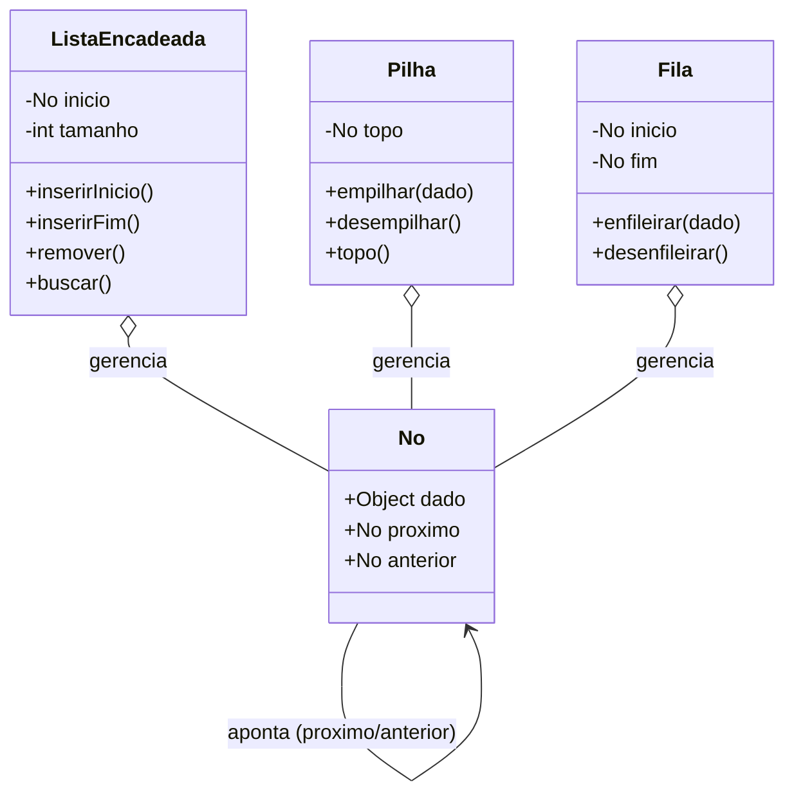
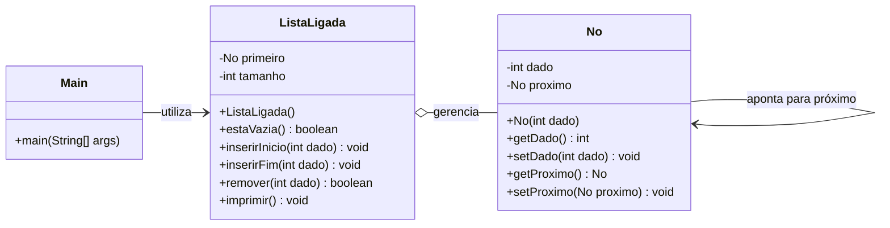
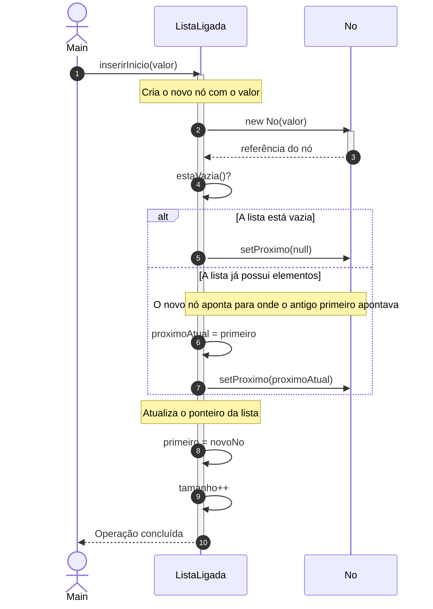
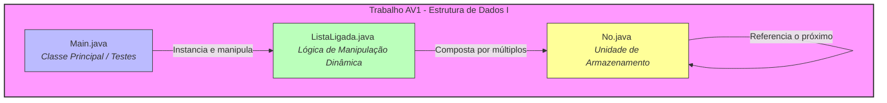

# Estrutura de Dados I

> **Semestre:** 4º Semestre
> **Curso:** Bacharelado em Sistemas de Informação (UniFEF)
> **Professor:** Prof. Ms. Wesley Soares de Souza
> **Escopo:** Fundamentos de algoritmos, complexidade computacional, memória/alocação dinâmica e estruturas lineares (listas sequenciais e ligadas)

---

## Sumário

1. [Objetivos de Aprendizagem e Ementa](#objetivos-de-aprendizagem-e-ementa)
2. [Aulas](#aulas)
3. [Trabalhos e Avaliações](#trabalhos-e-avaliações)
4. [Como Estudar com Este Material](#como-estudar-com-este-material)
5. [Estrutura do Repositório](#estrutura-do-repositório)
6. [Arquitetura e Modelagem do Conhecimento](#arquitetura-e-modelagem-do-conhecimento)
7. [Resumo Executivo](#resumo-executivo)
8. [Exercícios Práticos Implementados](#exercícios-práticos-implementados)
9. [Simulado Comentado](#simulado-comentado)
10. [CheatSheet de Revisão Rápida](#cheatsheet-de-revisão-rápida)
11. [Diagramas e Modelagem](#diagramas-e-modelagem)
12. [Material Complementar](#material-complementar)

---

## Objetivos de Aprendizagem e Ementa

A disciplina **Estrutura de Dados I**, ministrada pelo **Prof. Ms. Wesley Soares de Souza**, é fundamental para a formação do profissional de Sistemas de Informação. O objetivo principal é capacitar o estudante a escolher, projetar e implementar estruturas de dados eficientes para a resolução de problemas computacionais complexos.

### Ementa da disciplina

1. Fundamentos de projeto e análise de algoritmos, tipos abstratos de dados, complexidade computacional, organização da memória e alocação dinâmica.
2. Estudo, implementação e análise de estruturas de dados lineares, incluindo listas sequenciais e ligadas, listas circulares, pilhas, filas, deques e estruturas compostas, com aplicação de técnicas de desenvolvimento e avaliação de algoritmos.

### Conteúdo programático

Introdução à Estrutura de Dados e Projeto de Algoritmos · Análise de Algoritmos · Memória e Alocação Dinâmica · Listas Lineares Sequenciais · Listas Ligadas · Pilhas · Filas e Deques Dinâmicos · Estruturas Compostas · Projeto e Aplicação de Estruturas Lineares.

### Critérios de avaliação

```
[(AV1 × 0.8) + (T1 × 0.2)] + [(AV2 × 0.8) + (T2 × 0.2)]
─────────────────────────────────────────────────────── 
                         2
```

Duas avaliações (AV1 e AV2), cada uma composta por um trabalho (peso 2) e uma prova (peso 8), ambos valendo 10 pontos.

---

## Aulas

| Aula | Tema | Material |
| :--- | :--- | :--- |
| 01 | Introdução à Estrutura de Dados e Projeto de Algoritmos | [Conteúdo completo](Aulas/Aula%2001%20-%20Introducao%20e%20Projeto%20de%20Algoritmos/detalhes.md) · [Slides](Aulas/Aula%2001%20-%20Introducao%20e%20Projeto%20de%20Algoritmos/Aula%2001.pdf) · [Diagrama de atividades](Aulas/Aula%2001%20-%20Introducao%20e%20Projeto%20de%20Algoritmos/diagramas/atividades-refinamento-sucessivo.svg) |
| 02 | Análise de Algoritmos e Complexidade (Notação Big-O) | [Conteúdo completo](Aulas/Aula%2002%20-%20Analise%20de%20Algoritmos%20e%20Complexidade/detalhes.md) · [Slides](Aulas/Aula%2002%20-%20Analise%20de%20Algoritmos%20e%20Complexidade/Aula%2002.pdf) · [Exercícios de revisão](Aulas/Aula%2002%20-%20Analise%20de%20Algoritmos%20e%20Complexidade/Aula%2005%20-%20Exercicios%20de%20Revisao.pdf) · [Diagrama de atividades](Aulas/Aula%2002%20-%20Analise%20de%20Algoritmos%20e%20Complexidade/diagramas/atividades-analise-assintotica.svg) |
| 03 | Memória e Alocação Dinâmica (Stack, Heap, referências, Garbage Collector) | [Conteúdo completo](Aulas/Aula%2003%20-%20Memoria%20e%20Alocacao%20Dinamica/detalhes.md) · [Slides](Aulas/Aula%2003%20-%20Memoria%20e%20Alocacao%20Dinamica/Aula%2003.pdf) · [Diagrama de classes](Aulas/Aula%2003%20-%20Memoria%20e%20Alocacao%20Dinamica/diagramas/classes-no-referencias.svg) |
| 04 | Listas Lineares Sequenciais | [Conteúdo completo](Aulas/Aula%2004%20-%20Listas%20Lineares%20Sequenciais/detalhes.md) · [Slides](Aulas/Aula%2004%20-%20Listas%20Lineares%20Sequenciais/Aula%2004.pdf) · [Diagrama de classes](Aulas/Aula%2004%20-%20Listas%20Lineares%20Sequenciais/diagramas/classes-lista-sequencial.svg) · [Diagrama de atividades](Aulas/Aula%2004%20-%20Listas%20Lineares%20Sequenciais/diagramas/atividades-insercao-lista-sequencial.svg) |
| 05 | Listas Ligadas Dinâmicas | [Conteúdo completo](Aulas/Aula%2005%20-%20Listas%20Ligadas%20Dinamicas/detalhes.md) · [Diagrama de classes](Aulas/Aula%2005%20-%20Listas%20Ligadas%20Dinamicas/diagramas/classes-no-lista-ligada.svg) · [Fonte externa (Notion, sem material local)](https://outgoing-salt-444.notion.site/ED-I-Aula-05-Ligas-ligadas-din-micas-3ce8a4f8f8a780658e71e231669cbb5f) |

> A Aula 05 foi disponibilizada pelo professor apenas como link externo do Notion (ver [`Aulas/links-recursos.md`](Aulas/links-recursos.md)); a página não pôde ser extraída automaticamente (conteúdo renderizado via JavaScript). O `detalhes.md` da Aula 05 foi reconstruído a partir dos fundamentos de nó/referência já ensinados na Aula 03 e do enunciado real do Trabalho AV1 — consulte o link original em caso de divergência.

## Trabalhos e Avaliações

| Avaliação | Tema | Material |
| :--- | :--- | :--- |
| Trabalho | Complexidade de Algoritmos — busca linear/binária, Bubble Sort, Merge Sort | [Enunciado e implementação](Trabalhos/Complexidade%20de%20algoritmos/detalhes.md) |
| Trabalho AV1 | Sistema de Atendimento de uma Clínica com `ListaLigada<Paciente>` | [Enunciado completo](Trabalhos/Trabalho%20AV1/detalhes.md) · [Diagrama de classes](Trabalhos/Trabalho%20AV1/diagramas/classes-sistema-atendimento.svg) |
| Provas | — | Nenhuma prova foi aplicada/anexada à turma até o momento (pasta `Provas/` vazia) |

---

## Como Estudar com Este Material

1. **Acompanhe a cronologia** — siga a ordem das aulas listadas acima; cada `detalhes.md` reúne teoria, exemplos práticos e exercícios de fixação com gabarito.
2. **Pratique a codificação** — não apenas leia, implemente os códigos apresentados nos trabalhos e aulas (especialmente as classes `No` e `ListaLigada`).
3. **Consulte o resumo consolidado** — este README reúne, abaixo, resumo executivo, exercícios comentados, simulado com gabarito, cheat sheet e diagramas de modelagem em um único documento.
4. **Estude com flashcards** — importe [`Resumos-IA/flashcards-anki.tsv`](./Resumos-IA/flashcards-anki.tsv) no [Anki](https://apps.ankiweb.net/) para fixar os conceitos por repetição espaçada.
5. **Desafios** — resolva os exercícios de `Trabalhos/` sem consultar o gabarito primeiro; os enunciados originais (`.docx`/`.java`) estão anexados em cada pasta.

---

## Estrutura do Repositório

```bash
.
├── Aulas/
│   ├── Aula 01 - Introducao e Projeto de Algoritmos/
│   │   ├── detalhes.md              # Conteúdo completo: teoria + exemplos + exercícios
│   │   ├── diagramas/                # PlantUML (.puml) + SVG renderizado
│   │   └── Aula 01.pdf               # Slides originais do professor
│   ├── Aula 02 - Analise de Algoritmos e Complexidade/
│   ├── Aula 03 - Memoria e Alocacao Dinamica/
│   ├── Aula 04 - Listas Lineares Sequenciais/
│   ├── Aula 05 - Listas Ligadas Dinamicas/
│   └── links-recursos.md             # Link externo (Notion) da Aula 05
├── Trabalhos/
│   ├── Complexidade de algoritmos/   # Enunciado + implementação em Java
│   └── Trabalho AV1/                 # Enunciado (.docx) + código-fonte (.java) + diagramas
├── Provas/                           # (ainda sem materiais de prova aplicados)
└── Resumos-IA/                       # Material de apoio gerado por IA
    ├── Slides-Revisao-[...].pptx     # Apresentação de revisão
    ├── flashcards-anki.tsv           # Baralho para importar no Anki
    └── dataset-estudo-qa.jsonl       # Dataset de perguntas e respostas
```

Cada subpasta de `Aulas/` e `Trabalhos/` contém um `detalhes.md` com o conteúdo completo (ou o enunciado/contexto original e os arquivos entregues — código `.java`, documentos do professor `.docx`). Diagramas ficam em uma subpasta local `diagramas/`, com o `.puml` fonte ao lado do `.svg` renderizado.

---

## Arquitetura e Modelagem do Conhecimento

Diagrama estrutural representando a relação entre os principais conceitos e classes abordados na disciplina:



---

## Resumo Executivo

### Visão geral e objetivos da matéria

A disciplina **Estrutura de Dados I** fundamenta-se na premissa de que um software de alto desempenho depende tanto de uma lógica algorítmica apurada quanto da organização inteligente dos dados na memória. O curso aborda a transição conceitual do problema real até a solução implementada, cobrindo os fundamentos de projeto e análise de algoritmos, tipos abstratos de dados (TADs), gerenciamento de memória e o estudo aprofundado de estruturas lineares (listas sequenciais, listas ligadas, pilhas, filas e deques).

### Conceitos-chave e terminologia fundamental

* **Algoritmo:** sequência finita, ordenada e precisa de passos para resolver um problema (possui entrada, executa passos, produz saída e é executável). Distingue-se de *programa*, que é a implementação computacional em uma linguagem específica.
* **Tipo Abstrato de Dados (TAD):** modelo que define *quais* dados existem, *quais* operações podem ser realizadas e *qual* é o comportamento esperado, sem expor *como* os dados são armazenados ou implementados (encapsulamento e ocultação de informação).
* **Tamanho da entrada (n):** a quantidade de dados que o algoritmo precisa processar.
* **Análise assintótica e Notação Big-O:** metodologia para avaliar o crescimento do custo computacional (tempo ou espaço) à medida que o tamanho da entrada tende ao infinito, desprezando constantes e termos de menor ordem.
* **Alocação dinâmica, Stack e Heap:** variáveis locais e referências residem na *Stack*; objetos, instâncias e arrays criados em tempo de execução via `new` residem na *Heap*.

### Principais módulos abordados

**Módulo 1 — Introdução ao Projeto de Algoritmos e Refinamento Sucessivo**
* Do problema à solução: Compreensão → Modelagem → Algoritmo → Estrutura de Dados → Implementação.
* Refinamento sucessivo: decomposição de problemas complexos em subproblemas menores por níveis de abstração progressivos.

**Módulo 2 — Análise de Algoritmos e Complexidade**
* Melhor caso (mínima quantidade de operações), Pior caso (máxima quantidade — foco da Notação Big-O) e Caso médio.
* Classes de complexidade: O(1) constante, O(log n) logarítmica (ex.: Busca Binária), O(n) linear (ex.: Busca Sequencial), O(n²) quadrática (laços aninhados, ex.: Bubble Sort).

**Módulo 3 — Memória, Referências e Alocação Dinâmica**
* Tipos primitivos (armazenam valores diretamente) x tipos por referência (apontam para endereços na Heap).
* Uso de referências para construir encadeamentos de nós (`No`), viabilizando estruturas dinâmicas.
* Garbage Collector: libera automaticamente objetos na Heap sem referências ativas.

**Módulo 4 — Estruturas Lineares: Listas Sequenciais**
* Elementos em posições contíguas de memória (arrays).
* Capacidade (`length`) vs. Tamanho (elementos úteis, `0 ≤ tamanho ≤ capacidade`).
* Acesso por índice O(1); inserção/remoção no início ou meio O(n).

**Módulo 5 — Estruturas Lineares: Listas Ligadas**
* Nós alocados individualmente na Heap, encadeados por referência (`proximo`), sem capacidade fixa.
* Inserção no início O(1); busca, remoção e inserção no final O(n).

### Relação com o mercado e prática profissional

A escolha incorreta de uma estrutura de dados ou de um algoritmo ineficiente (ex.: substituir uma busca logarítmica por uma varredura quadrática) pode inviabilizar sistemas de grande escala ao processar milhões de registros. O domínio de TADs, alocação de memória e análise de complexidade capacita o profissional a projetar arquiteturas resilientes, otimizar consumo de recursos em nuvem e escrever código escalável.

### Dicas de ouro para estudo e provas

1. **Domine a Notação Big-O:** pratique a contagem de instruções em laços simples e aninhados; saiba justificar por que constantes e termos de menor grau são descartados.
2. **Diferencie capacidade de tamanho:** em listas sequenciais, valide sempre o limite do array antes de inserir e mantenha o controle estrito da variável `tamanho`.
3. **Desenhe a memória (Stack vs. Heap):** ao estudar ponteiros, referências e listas ligadas, desenhe blocos de memória e setas de referência.
4. **Compreenda o propósito dos TADs:** o TAD define o *contrato* (o que faz), isolando a implementação (como faz).
5. **Atenção aos casos-limite:** lista vazia, lista cheia, inserção na primeira e na última posição.

---

## Exercícios Práticos Implementados

Apostila prática traduzindo os fundamentos teóricos em códigos Java comentados e prontos para execução.

### Módulo 1: Fundamentos, Análise de Algoritmos e Complexidade

```java
public class AnaliseComplexidade {

    // O(1) - Complexidade Constante
    public static int obterPrimeiroElemento(int[] vetor) {
        if (vetor.length == 0) return -1;
        return vetor[0]; // Acesso direto por índice
    }

    // O(n) - Complexidade Linear
    public static boolean pesquisaSequencial(int[] vetor, int valorProcurado) {
        for (int i = 0; i < vetor.length; i++) {
            if (vetor[i] == valorProcurado) {
                return true;
            }
        }
        return false;
    }

    // O(n²) - Complexidade Quadrática
    public static void imprimirMatrizDePares(int n) {
        for (int i = 1; i <= n; i++) {
            for (int j = 1; j <= n; j++) {
                System.out.println("Par: (" + i + ", " + j + ")");
            }
        }
    }
}
```

### Módulo 2: Memória, Alocação Dinâmica e Referências (Stack vs. Heap)

```java
class No {
    int valor;
    No proximo;

    public No(int valor) {
        this.valor = valor;
        this.proximo = null;
    }
}

public class TesteMemoriaHeap {
    public static void main(String[] args) {
        No n1 = new No(10);
        No n2 = new No(20);
        No n3 = new No(30);

        n1.proximo = n2;
        n2.proximo = n3;

        No atual = n1;
        System.out.print("Estrutura Encadeada: ");
        while (atual != null) {
            System.out.print(atual.valor + " -> ");
            atual = atual.proximo;
        }
        System.out.println("NULL");

        // Se desconectarmos n2: n2 = null, o objeto 20 ainda é acessível via n1.proximo
        n2 = null;
        System.out.println("Após n2 = null, n1.proximo.valor ainda é: " + n1.proximo.valor);
    }
}
```

### Módulo 3: Listas Lineares Sequenciais

Uma Lista Sequencial armazena elementos em posições contíguas de memória, diferenciando **Capacidade** (tamanho total do vetor físico) de **Tamanho Atual** (elementos efetivamente inseridos) — implementação completa em [`Aulas/Aula 04 - Listas Lineares Sequenciais/detalhes.md`](Aulas/Aula%2004%20-%20Listas%20Lineares%20Sequenciais/detalhes.md).

### Módulo 4: Listas Ligadas Dinâmicas

Implementação completa de `No<T>` e `ListaLigada<T>` (inserção no início/fim, busca, remoção, percurso) em [`Aulas/Aula 05 - Listas Ligadas Dinamicas/detalhes.md`](Aulas/Aula%2005%20-%20Listas%20Ligadas%20Dinamicas/detalhes.md), aplicada ao estudo de caso do [Trabalho AV1](Trabalhos/Trabalho%20AV1/detalhes.md).

### Lista de exercícios práticos resolvidos

**Exercício 1 — Custo Computacional de Laços Aninhados**
```text
para i = 1 até n
    para j = 1 até i
        escreva(i, j)
    fim
fim
```
*Solução:* o primeiro laço roda N vezes; o segundo roda dependendo de i (1, 2, 3, ..., N vezes). O total é a soma da Progressão Aritmética: 1 + 2 + ... + N = N(N+1)/2 = (N² + N)/2. Descartando constantes e termos de menor ordem: **O(N²)**.

**Exercício 2 — Manipulação de Referências em Java**
```java
public class ExercicioReferencias {
    public static void main(String[] args) {
        No n1 = new No(10);
        No n2 = new No(20);
        No n3 = new No(30);

        n1.proximo = n2;
        n2.proximo = n3;

        n1.proximo = n3; // Pulando o nó central: n1 -> n3
        n2 = null;

        System.out.println("N1 aponta para o valor: " + n1.valor);
        System.out.println("O próximo de N1 aponta para o valor: " + n1.proximo.valor); // 30
    }
}
```

**Exercício 3 — Busca de Elemento em Lista Sequencial**
Adicionar à classe `ListaSequencial` um método `pesquisar(int valor)` que retorne o índice do elemento, ou `-1` caso não exista. No pior caso (elemento ausente ou na última posição), o algoritmo percorre todas as N posições — **O(N)**.

---

## Simulado Comentado

Simulado com **10 questões de múltipla escolha** (gabarito comentado) e **5 questões discursivas/estudos de caso práticos**, cobrindo Introdução, Algoritmos, Análise Assintótica (Big-O), Memória (Stack/Heap), Alocação Dinâmica e Listas Lineares.

### Múltipla escolha

1. Sobre Algoritmo e Programa: **c) Um algoritmo é uma sequência finita e ordenada de passos para resolver um problema, sendo independente de linguagem, ao passo que o programa é a sua implementação executável.**
2. O que define um TAD? **b) Quais dados existem e quais operações podem ser realizadas, ocultando como os dados são armazenados/implementados.**
3. Por que evitamos medir desempenho em segundos? **b) O tempo de execução depende de fatores externos: processador, memória, SO, compilador e linguagem.**
4. Dado T(n) = 3n² + 5n + 10, qual sua complexidade? **d) O(n²)** — descartamos constantes e termos de menor ordem.
5. `int x = vetor[5];` — qual a complexidade? **c) O(1)** — acesso direto por índice fixo.
6. Sobre Stack/Heap/GC: **e) I, II e III** (Stack guarda referências; Heap guarda objetos; GC limpa objetos sem referência).
7. O que ocorre no Heap ao executar `p1 = null;`? **c) O objeto perde sua associação com `p1`, tornando-se elegível para o Garbage Collector.**
8. Inserir no início/meio de uma Lista Sequencial (pior caso)? **c) O(n)** — exige deslocamento de elementos.
9. Diferença entre `tamanho` e `capacidade`? **b) Capacidade é o total de posições disponíveis; tamanho é a quantidade atual de elementos válidos.**
10. Qual estrutura segue LIFO? **b) Pilha (Stack).**

### Discursivas e estudos de caso

**Questão 11 (Refinamento de Algoritmo).** Fila de atendimento bancário: dados = nome/ID + horário de chegada; entra no fim (enqueue), sai do início (dequeue); FIFO — quem entrou primeiro é atendido primeiro.

**Questão 12 (Análise de Complexidade).** Dois laços `1 até n` aninhados: O(n²). Se o segundo rodasse só até n/2: custo n × (n/2) = n²/2 — descartando a constante, a complexidade final continua **O(n²)**.

**Questão 13 (Stack vs. Heap).** `Pessoa p1 = new Pessoa("Ana"); Pessoa p2 = p1; p2.setNome("Carlos");` — Stack contém as referências `p1`/`p2`; Heap contém o objeto único. Como `p2 = p1`, ambas apontam para o mesmo objeto — `p1.getNome()` retorna **"Carlos"**.

**Questão 14 (Nós e Alocação Dinâmica).** Declarar `No` e encadear três nós `10 -> 20 -> 30 -> null` (ver classe `No` no Módulo 2 acima e detalhamento completo na [Aula 05](Aulas/Aula%2005%20-%20Listas%20Ligadas%20Dinamicas/detalhes.md)).

**Questão 15 (Capacidade vs. Tamanho).** Com `capacidade=10`, `tamanho=3`, `lista.obter(15)` deve lançar `IndexOutOfBoundsException` — regra: `0 <= indice && indice < tamanho`.

---

## CheatSheet de Revisão Rápida

**1. Fundamentos e Algoritmos**
- **Algoritmo:** sequência finita, ordenada e precisa de passos (diferente do *programa*, que é a implementação em código).
- **Refinamento Sucessivo:** técnica de projeto que vai da abstração até os detalhes implementáveis.
- **TAD:** define *o que* a estrutura faz, sem expor *como* é implementada.

**2. Análise Assintótica e Notação Big-O**

| Complexidade | Nome | Exemplo |
| :--- | :--- | :--- |
| O(1) | Constante | Acessar um vetor por índice |
| O(log n) | Logarítmica | Busca Binária |
| O(n) | Linear | Pesquisa sequencial |
| O(n log n) | Linear-logarítmica | Merge Sort |
| O(n²) | Quadrática | Bubble Sort, Selection Sort |
| O(2ⁿ) | Exponencial | Recursões ingênuas (Fibonacci sem memoization) |

Casos de análise: **Melhor caso**, **Pior caso** (O — teto máximo) e **Caso médio**.

**3. Memória, Stack vs. Heap e Alocação Dinâmica**
- **Stack:** variáveis locais, chamadas de métodos e referências.
- **Heap:** objetos e arrays criados dinamicamente via `new`.
- **Garbage Collector:** limpa da Heap objetos sem referências ativas.

**4. Listas Sequenciais (Arrays)**

| Operação | Complexidade | Motivo |
| :--- | :--- | :--- |
| Acessar por índice | O(1) | Endereçamento direto |
| Pesquisar valor | O(n) | Pior caso exige varredura completa |
| Inserir no final (com espaço) | O(1) | Acesso direto ao fim |
| Inserir/remover no início ou meio | O(n) | Exige deslocamento de elementos |

**5. Listas Ligadas (Nós dinâmicos)**

| Operação | Complexidade | Motivo |
| :--- | :--- | :--- |
| Inserir no início | O(1) | Apenas religa ponteiros |
| Inserir no final | O(n) | Exige percorrer até o último nó |
| Buscar / remover por valor | O(n) | Exige percorrer nó a nó |

---

## Diagramas e Modelagem

### Diagramas por aula (PlantUML)

Os diagramas específicos de cada aula ficam junto do respectivo `detalhes.md`, em `diagramas/` (fonte `.puml` + `.svg` renderizado):

- [Refinamento Sucessivo — Do Problema à Solução](Aulas/Aula%2001%20-%20Introducao%20e%20Projeto%20de%20Algoritmos/diagramas/atividades-refinamento-sucessivo.svg) (diagrama de atividades)
- [Processo de Análise Assintótica de um Algoritmo](Aulas/Aula%2002%20-%20Analise%20de%20Algoritmos%20e%20Complexidade/diagramas/atividades-analise-assintotica.svg) (diagrama de atividades)
- [Memória: Referências, No e Alocação Dinâmica](Aulas/Aula%2003%20-%20Memoria%20e%20Alocacao%20Dinamica/diagramas/classes-no-referencias.svg) (diagrama de classes)
- [Lista Linear Sequencial](Aulas/Aula%2004%20-%20Listas%20Lineares%20Sequenciais/diagramas/classes-lista-sequencial.svg) (diagrama de classes)
- [Inserção em uma Lista Sequencial](Aulas/Aula%2004%20-%20Listas%20Lineares%20Sequenciais/diagramas/atividades-insercao-lista-sequencial.svg) (diagrama de atividades)
- [Lista Ligada Dinâmica — No\<T\> e ListaLigada\<T\>](Aulas/Aula%2005%20-%20Listas%20Ligadas%20Dinamicas/diagramas/classes-no-lista-ligada.svg) (diagrama de classes)
- [Trabalho AV1 — Sistema de Atendimento de uma Clínica](Trabalhos/Trabalho%20AV1/diagramas/classes-sistema-atendimento.svg) (diagrama de classes)

### Diagrama de classes UML (domínio da matéria — modelagem do Trabalho AV1)



* **`Main`**: classe de ponto de entrada responsável por instanciar a estrutura e testar suas operações.
* **`No`**: unidade básica de armazenamento, contendo a carga útil (`dado`) e uma referência (`proximo`) para o próximo elemento da cadeia.
* **`ListaLigada`**: gerencia a sequência de nós através de um ponteiro de início (`primeiro`), implementando os métodos de manipulação dinâmica exigidos na disciplina.

### Diagrama de sequência (fluxo de inserção em Lista Ligada)



1. **Solicitação:** `Main` invoca `inserirInicio(valor)` na instância de `ListaLigada`.
2. **Alocação dinâmica:** a lista cria um novo objeto `No`, alocando memória dinamicamente.
3. **Verificação de estado:** se vazia, o novo nó aponta para `null`; caso contrário, assume a referência do antigo primeiro elemento.
4. **Atualização de ponteiros:** o ponteiro `primeiro` passa a apontar para o novo nó, concluindo a inserção em tempo O(1).

### Diagrama arquitetural (organização de arquivos do Trabalho AV1)



* **Divisão de responsabilidades:** o projeto segue o padrão modular requisitado pelo Prof. Wesley Soares para o AV1.
* **`Main.java`** atua estritamente na interface de execução.
* **`ListaLigada.java`** concentra os algoritmos de complexidade e manipulação de ponteiros.
* **`No.java`** modela o encapsulamento do dado e do encadeamento de memória.

---

## Material Complementar

### Apresentação de revisão em slides

[`Resumos-IA/Slides-Revisao-[Prof. Wesley Soares] Estrutura de Dados I.pptx`](./Resumos-IA/Slides-Revisao-%5BProf.%20Wesley%20Soares%5D%20Estrutura%20de%20Dados%20I.pptx) — deck em dark mode (Slate/Navy/Teal/Indigo), 16:9 widescreen, cobrindo Visão Geral da Disciplina, Conceitos Fundamentais, Exercícios & Prática e Dicas de Prova.

### Flashcards para Anki

[`Resumos-IA/flashcards-anki.tsv`](./Resumos-IA/flashcards-anki.tsv) — cartões pergunta/resposta cobrindo dados institucionais da disciplina, algoritmos, memória e listas. Para importar: no Anki, `Arquivo → Importar`, selecione o `.tsv`, separador de campo "Tab", mapeamento `Frente`/`Verso`.

### Dataset de perguntas e respostas (JSONL)

[`Resumos-IA/dataset-estudo-qa.jsonl`](./Resumos-IA/dataset-estudo-qa.jsonl) — pares de pergunta/resposta com metadados de tópico e dificuldade, no formato [JSON Lines](https://jsonlines.org/), pronto para consumo por scripts/ferramentas de estudo.

```json
{"id": 1, "topico": "Apresentação da Disciplina", "pergunta": "Quem é o professor responsável pela disciplina de Estrutura de Dados I?", "resposta": "O professor responsável pela disciplina de Estrutura de Dados I é o Prof. Wesley Soares.", "dificuldade": "facil"}
{"id": 3, "topico": "Aula 01", "pergunta": "Qual é a data de postagem referente ao conteúdo da aula 01 da disciplina de Estrutura de Dados I?", "resposta": "O conteúdo da aula 01 foi postado em 06/08/2026.", "dificuldade": "facil"}
{"id": 8, "topico": "Listas Dinâmicas", "pergunta": "Qual é o tema principal abordado nos links úteis da aula 05?", "resposta": "O tema abordado nos links úteis da aula 05 refere-se a listas ligadas dinâmicas.", "dificuldade": "medio"}
```
