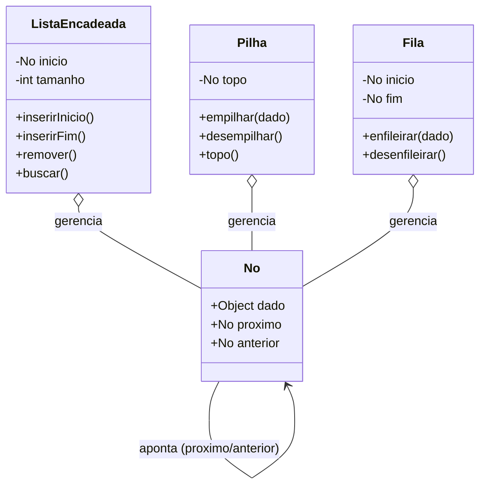

# 🎓 [Prof. Wesley Soares] Estrutura de Dados I
> **Semestre:** 4º Semestre  
> **Curso:** Bacharelado em Sistemas de Informação (UniFEF)  
> **Professor:** Prof. Wesley Soares  

---

## 🎯 Objetivos de Aprendizagem e Ementa

A disciplina de **Estrutura de Dados I** é fundamental para a formação do profissional de Sistemas de Informação. O objetivo principal é capacitar o estudante a escolher, projetar e implementar estruturas de dados eficientes para a resolução de problemas computacionais complexos.

### **Ementa da Disciplina:**
1. **Introdução e Análise de Complexidade:** Notação Big-O, eficiência de algoritmos e tempo de execução.
2. **Alocação Dinâmica de Memória:** Ponteiros, gerenciamento de heap e stack.
3. **Estruturas Lineares Básicas:** 
   - **Listas Lineares:** Sequenciais e Encadeadas (Simplesmente e Duplamente Encadeadas).
   - **Pilhas (Stacks):** Conceito LIFO e aplicações.
   - **Filas (Queues):** Conceito FIFO, filas circulares e de prioridade.
4. **Introdução a Algoritmos de Busca e Ordenação:** Métodos clássicos aplicados às estruturas estudadas.

---

## 🏗️ Arquitetura e Modelagem do Conhecimento

Abaixo está o diagrama estrutural que representa a relação entre os principais conceitos e classes abordados na disciplina:



---

## 📂 Estrutura das Pastas e Organização

O repositório está organizado de forma modular para facilitar o acompanhamento dos estudos:

```bash
.
├── 📂 Aulas/                     # Notas de aula (.md) e slides originais (.pdf) do professor
│   ├── 📄 2026-08-06 - Contedo aula 01.md
│   ├── 📄 2026-08-11 - Aula 02.md
│   ├── 📄 2026-09-01 - Aula anteriores.md
│   ├── 📄 2026-09-01 - Contedo para aula 05.md
│   ├── 📄 links-recursos.md
│   └── 📊 Aula 01.pdf … Aula 05.pdf
├── 📂 Trabalhos/                 # Atividades avaliativas com enunciado + resolução em código
│   ├── 📂 Complexidade de algoritmos/
│   └── 📂 Trabalho AV1/
├── 📂 Provas/                    # (ainda sem materiais de prova aplicados)
└── 📂 Resumos-IA/                # Material de apoio gerado por IA — tudo em um único README
    ├── 📄 README.md              # Resumo, exercícios, simulado, cheatsheet e diagramas
    ├── 📊 Slides-Revisao-[Prof. Wesley Soares] Estrutura de Dados I.pptx
    ├── 📇 flashcards-anki.tsv
    └── 🤖 dataset-estudo-qa.jsonl
```

Cada subpasta de `Trabalhos/` contém um `detalhes.md` com o enunciado/contexto original e o código-fonte entregue (`.java`).

---

## 🚀 Como Estudar com Este Material

1. **Acompanhe a Cronologia:** Siga a ordem das aulas listadas abaixo.
2. **Pratique a Codificação:** Não apenas leia, mas implemente os códigos apresentados nos trabalhos e aulas (especialmente as classes `No` e `ListaLigada`).
3. **Consulte o Resumos-IA:** [`Resumos-IA/README.md`](./Resumos-IA/README.md) reúne resumo executivo, exercícios comentados, simulado com gabarito, cheat sheet e diagramas — tudo em um único documento.
4. **Estude com Flashcards:** Importe [`Resumos-IA/flashcards-anki.tsv`](./Resumos-IA/flashcards-anki.tsv) no [Anki](https://apps.ankiweb.net/) para fixar os conceitos por repetição espaçada.

---

# 📚 CONTEÚDO ACADÊMICO

---

## 📌 Conteúdo Aula 01
> **Data de Postagem:** 06/08/2026  
> **Professor Responsável:** Prof. Wesley Soares  
> **Disciplina:** Estrutura de Dados I (4º Semestre)  

### 📋 Descrição
Introdução aos conceitos fundamentais de Estrutura de Dados, alinhamento da ementa, critérios de avaliação e a importância da organização eficiente de dados na memória.

---

## 📌 Aula 02
> **Data de Postagem:** 11/08/2026  
> **Professor Responsável:** Prof. Wesley Soares  
> **Disciplina:** Estrutura de Dados I (4º Semestre)  

### 📋 Descrição
Estudo aprofundado sobre alocação de memória, ponteiros e introdução à complexidade de algoritmos (Análise Assintótica e Notação Big-O).

---

## 📌 Aulas Anteriores
> **Data de Postagem:** 01/09/2026  
> **Professor Responsável:** Prof. Wesley Soares  
> **Disciplina:** Estrutura de Dados I (4º Semestre)  

### 📋 Descrição
Revisão consolidada dos tópicos abordados nas semanas iniciais, servindo como base preparatória para os primeiros desafios práticos.

---

## 📌 Conteúdo para Aula 05
> **Data de Postagem:** 01/09/2026  
> **Professor Responsável:** Prof. Wesley Soares  
> **Disciplina:** Estrutura de Dados I (4º Semestre)  

### 📋 Descrição
Estudo sobre listas encadeadas dinâmicas, ponteiros encadeados e manipulação de nós em tempo de execução.

### 🔗 Links Úteis da Aula
- [Notion - ED-I Aula 05: Listas Ligadas Dinâmicas](https://outgoing-salt-444.notion.site/ED-I-Aula-05-Ligas-ligadas-din-micas-3ce8a4f8f8a780658e71e231669cbb5f)

---

# 🛠️ TRABALHOS E AVALIAÇÕES

---

## 📋 Trabalho: Complexidade de Algoritmos
> **Professor:** Prof. Wesley Soares  
> **Disciplina:** Estrutura de Dados I (4º Semestre)  
> **Prazo de Entrega:** 19/08/2026 às 02:59  
> **Pontuação Máxima:** 100 pontos  

### 📋 Descrição
Atividade prática focada na análise de tempo de execução e consumo de memória de diferentes algoritmos de busca e ordenação utilizando a Notação Big-O.

---

## 📋 Trabalho: Trabalho AV1
> **Professor:** Prof. Wesley Soares  
> **Disciplina:** Estrutura de Dados I (4º Semestre)  
> **Prazo de Entrega:** 09/09/2026 às 02:59  
> **Pontuação Máxima:** 100 pontos  

### ⚙️ Instruções da Atividade
O projeto prático da AV1 deve ser submetido contendo obrigatoriamente a seguinte estrutura modular em código:
1. `Classe Main` (ponto de entrada e testes)
2. `Classe No` (representação do elemento e ponteiro)
3. `Classe ListaLigada` (implementação dos métodos de inserção, remoção e percurso)