# Caderno Consolidado - Estrutura de Dados I

> **Instituição:** Centro Universitário de Santa Fé do Sul (UniFEF)  
> **Curso:** Bacharelado em Sistemas de Informação (4º Semestre)  
> **Docente:** Prof. Ms. Wesley Soares de Souza  
> **Componente Curricular:** Estrutura de Dados I  
> **Documento:** Caderno Unificado de Teoria, Prática, Arquitetura e Avaliações

---

## Sumário

- [Caderno Consolidado - Estrutura de Dados I](#caderno-consolidado---estrutura-de-dados-i)
  - [Sumário](#sumário)
  - [Resumo Executivo](#resumo-executivo)
  - [Mapa de Conteúdo](#mapa-de-conteúdo)
  - [Fundamentos e Arquitetura](#fundamentos-e-arquitetura)
    - [O Conceito Formal de Algoritmo e Suas Seis Propriedades](#o-conceito-formal-de-algoritmo-e-suas-seis-propriedades)
    - [A Equação de Wirth: Algoritmos e Estruturas de Dados](#a-equação-de-wirth-algoritmos-e-estruturas-de-dados)
    - [Algoritmo versus Programa: Abstração e Materialização](#algoritmo-versus-programa-abstração-e-materialização)
    - [O Pipeline de Engenharia de Software: Do Problema à Solução](#o-pipeline-de-engenharia-de-software-do-problema-à-solução)
    - [Refinamento Sucessivo e Metodologia Descendente](#refinamento-sucessivo-e-metodologia-descendente)
    - [Tipos Abstratos de Dados: O Que versus Como](#tipos-abstratos-de-dados-o-que-versus-como)
    - [Abstração, Encapsulamento e Invariantes Estruturais](#abstração-encapsulamento-e-invariantes-estruturais)
    - [Critérios de Decisão na Escolha de Representação de Dados](#critérios-de-decisão-na-escolha-de-representação-de-dados)
    - [Fundamentos da Análise de Algoritmos e Inadequação do Tempo de Relógio](#fundamentos-da-análise-de-algoritmos-e-inadequação-do-tempo-de-relógio)
    - [Tamanho da Entrada, Contagem de Operações e Descarte de Constantes](#tamanho-da-entrada-contagem-de-operações-e-descarte-de-constantes)
    - [Análise Assintótica: Notações Big-O e Big-Omega](#análise-assintótica-notações-big-o-e-big-omega)
    - [Cenários de Execução: Pior Caso, Melhor Caso e Caso Médio](#cenários-de-execução-pior-caso-melhor-caso-e-caso-médio)
    - [Famílias de Complexidade Computacional](#famílias-de-complexidade-computacional)
    - [Arquitetura de Memória da JVM: Segmentos Stack e Heap](#arquitetura-de-memória-da-jvm-segmentos-stack-e-heap)
    - [Semântica de Tipos Primitivos versus Variáveis de Referência](#semântica-de-tipos-primitivos-versus-variáveis-de-referência)
    - [Ciclo de Vida de Objetos, Inalcançabilidade e o Garbage Collector](#ciclo-de-vida-de-objetos-inalcançabilidade-e-o-garbage-collector)
    - [Estruturas Lineares Sequenciais: Capacidade, Tamanho e Deslocamento](#estruturas-lineares-sequenciais-capacidade-tamanho-e-deslocamento)
    - [Estruturas Dinâmicas Encadeadas: Anatomia do Nó](#estruturas-dinâmicas-encadeadas-anatomia-do-nó)
    - [Lista Simplesmente Ligada: Início, Fim e Tamanho](#lista-simplesmente-ligada-início-fim-e-tamanho)
    - [Otimização de Inserção na Cauda com Ponteiro de Fim](#otimização-de-inserção-na-cauda-com-ponteiro-de-fim)
    - [Inserção Ordenada: Separação entre Busca e Religamento](#inserção-ordenada-separação-entre-busca-e-religamento)
    - [Busca Linear e Atualização por Índice em Estruturas Ligadas](#busca-linear-e-atualização-por-índice-em-estruturas-ligadas)
    - [Estruturas Lineares Restritas: O Tipo Abstrato de Dados Pilha](#estruturas-lineares-restritas-o-tipo-abstrato-de-dados-pilha)
    - [O Princípio LIFO e Operações Fundamentais da Pilha](#o-princípio-lifo-e-operações-fundamentais-da-pilha)
    - [Implementação de Pilha sobre Vetores e a Sentinela de Índice Negativo](#implementação-de-pilha-sobre-vetores-e-a-sentinela-de-índice-negativo)
    - [Mapeamento de Estados da Pilha: Overflow, Underflow e Exclusão Lógica](#mapeamento-de-estados-da-pilha-overflow-underflow-e-exclusão-lógica)
    - [Disciplinas de Atendimento: Modelagem de Filas sobre Listas Ligadas](#disciplinas-de-atendimento-modelagem-de-filas-sobre-listas-ligadas)
  - [Sintaxe e Exemplos Práticos](#sintaxe-e-exemplos-práticos)
    - [Lista Linear Sequencial Estática com Deslocamento Manual](#lista-linear-sequencial-estática-com-deslocamento-manual)
    - [Nó Dinâmico Auto-referenciado](#nó-dinâmico-auto-referenciado)
    - [Lista Simplesmente Ligada com Inserção O(1) e Inserção Ordenada](#lista-simplesmente-ligada-com-inserção-o1-e-inserção-ordenada)
    - [Pilha Sequencial Baseada em Array com Tratamento de Estados](#pilha-sequencial-baseada-em-array-com-tratamento-de-estados)
    - [Estudo de Caso do Trabalho AV1: Sistema de Atendimento Clínico](#estudo-de-caso-do-trabalho-av1-sistema-de-atendimento-clínico)
    - [Resolução Analítica do Trabalho de Complexidade de Algoritmos](#resolução-analítica-do-trabalho-de-complexidade-de-algoritmos)
  - [Boas Práticas e Armadilhas Comuns](#boas-práticas-e-armadilhas-comuns)
    - [Inversão de Ponteiros e Desconexão Prematura da Cadeia](#inversão-de-ponteiros-e-desconexão-prematura-da-cadeia)
    - [Confusão entre Capacidade Física e Tamanho Lógico](#confusão-entre-capacidade-física-e-tamanho-lógico)
    - [Negligência no Tratamento de Listas Vazias e Casos Unitários](#negligência-no-tratamento-de-listas-vazias-e-casos-unitários)
    - [Deslocamento Destrutivo em Vetores Sequenciais](#deslocamento-destrutivo-em-vetores-sequenciais)
    - [Quebra de Invariantes em Pilhas por Acesso Aleatório](#quebra-de-invariantes-em-pilhas-por-acesso-aleatório)
    - [Retenção de Memória Oculta por Ponteiros Mortos](#retenção-de-memória-oculta-por-ponteiros-mortos)
    - [Inversão da Ordem de Atualização de Topo em Pilhas](#inversão-da-ordem-de-atualização-de-topo-em-pilhas)
    - [Estimativa de Custo Baseada em Linhas de Código](#estimativa-de-custo-baseada-em-linhas-de-código)
    - [Confusão em Laços Aninhados Dependentes e Espaços Triangulares](#confusão-em-laços-aninhados-dependentes-e-espaços-triangulares)
    - [Dessincronização de Metadados de Controle](#dessincronização-de-metadados-de-controle)
  - [Tabelas Comparativas](#tabelas-comparativas)
    - [Matriz de Complexidade Assintótica entre Estruturas Lineares](#matriz-de-complexidade-assintótica-entre-estruturas-lineares)
    - [Comparativo Arquitetural de Memória: Stack versus Heap na JVM](#comparativo-arquitetural-de-memória-stack-versus-heap-na-jvm)
    - [Matriz de Decisão Arquitetural de Estruturas de Dados](#matriz-de-decisão-arquitetural-de-estruturas-de-dados)
    - [Comparativo de Disciplinas de Acesso dos Tipos Abstratos de Dados](#comparativo-de-disciplinas-de-acesso-dos-tipos-abstratos-de-dados)
  - [Linha do Tempo da Disciplina](#linha-do-tempo-da-disciplina)
  - [Glossário](#glossário)
  - [Checklist de Revisão para Prova](#checklist-de-revisão-para-prova)
    - [Roteiro Sistemático de Análise de Algoritmos](#roteiro-sistemático-de-análise-de-algoritmos)
    - [Bateria de Autoavaliação Conceitual](#bateria-de-autoavaliação-conceitual)

---

## Resumo Executivo

A disciplina de Estrutura de Dados I, ministrada no quarto semestre do curso de Bacharelado em Sistemas de Informação da UniFEF pelo Prof. Ms. Wesley Soares de Souza, consolida a transição do estudante de um paradigma de programação puramente operacional para a maturidade da engenharia de software e da ciência da computação formal. O foco pedagógico do curso transcende o conhecimento de regras sintáticas de linguagens de programação, estabelecendo como competência primária a capacidade de modelar dados em memória física e projetar algoritmos corretos, escaláveis e eficientes em tempo e espaço.

O escopo da disciplina abrange desde o refinamento sucessivo e a definição matemática de Tipos Abstratos de Dados (TAD) até a análise assintótica de algoritmos baseada na notação Big-O, explorando detalhadamente a arquitetura de gerenciamento de memória em tempo de execução da Máquina Virtual Java (JVM), especificamente nos segmentos Stack e Heap. São dissecadas e implementadas as principais estruturas lineares de dados: listas sequenciais contíguas (vetores), listas simplesmente encadeadas dinâmicas (com ponteiros de início e cauda) e pilhas operadas sob o princípio LIFO (*Last In, First Out*). Todas as operações fundamentais são analisadas à luz de seus custos assintóticos, seus trade-offs de engenharia e seus padrões de tratamento de borda.

---

## Mapa de Conteúdo

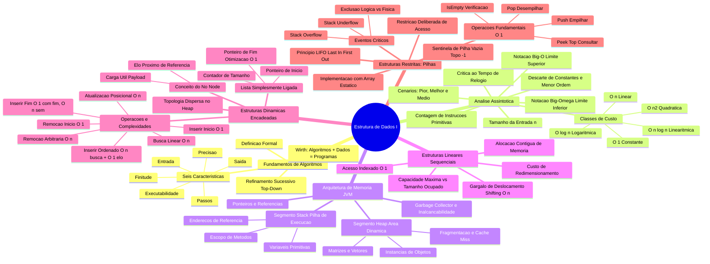

---

## Fundamentos e Arquitetura

### O Conceito Formal de Algoritmo e Suas Seis Propriedades

Um **algoritmo** é formalmente caracterizado como um conjunto finito de passos lógicos, determinísticos e ordenados que, a partir de um estado inicial e de um conjunto de dados de entrada (que pode ser nulo), transforma esses dados por meio de instruções inequívocas até atingir um estado final estável, produzindo uma solução computacional verificável para uma classe específica de problemas. O termo provém historicamente do matemático persa Abu Abdullah Muhammad ibn Musa al-Khwarizmi, pioneiro na formalização de regras mecânicas para resolução de equações no século IX.

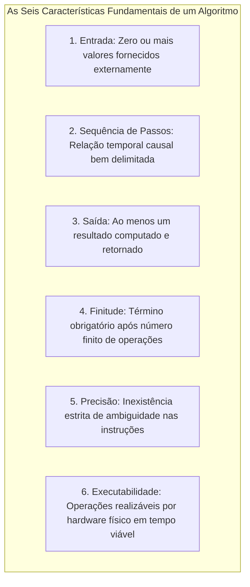

Para ser reconhecido como algoritmo pela ciência da computação teórica, o procedimento deve cumprir seis propriedades obrigatórias:

1. **Entrada (*Input*):** Define os parâmetros externos fornecidos ao processo. Um algoritmo pode admitir zero ou mais entradas. Quando a entrada é zero, a lógica opera sobre constantes universais fixas (por exemplo, calcular os primeiros dez dígitos de $\pi$).
2. **Sequência de Passos (*Sequence*):** As operações computacionais obedecem a uma ordem cronológica e determinística. A execução do passo $k+1$ depende causalmente da conclusão do estado resultante do passo $k$.
3. **Saída (*Output*):** Um algoritmo existe para satisfazer a um objetivo observável. Deve entregar ao menos uma informação de saída matematicamente relacionada aos dados fornecidos ou ao processamento efetuado.
4. **Finitude (*Finiteness*):** O processo computacional deve impreterivelmente convergir para uma condição de encerramento após uma quantidade finita de passos. Laços infinitos (*infinite loops*) divergem da definição estrita de algoritmo.
5. **Precisão (*Definiteness*):** Nenhuma instrução pode admitir dubiedade semântica ou subjetividade interpretativa. Instruções como "esperar alguns instantes" ou "processar até ficar satisfatório" invalidam a condição de algoritmo.
6. **Executabilidade (*Effectiveness*):** Cada primitiva elementar precisa ser viável na prática, ou seja, executável por um processador de estados finitos em tempo discreto. Operações como a divisão exata por zero ou a busca pelo último número real violam essa premissa.

### A Equação de Wirth: Algoritmos e Estruturas de Dados

Em 1976, o cientista da computação suíço Niklaus Wirth, criador da linguagem Pascal, publicou a formulação canônica que norteia toda a engenharia de software contemporânea:

$$\text{Algoritmos} + \text{Estruturas de Dados} = \text{Programas}$$

Essa proposição estabelece que algoritmos e estruturas de dados são entidades mutuamente dependentes. Um algoritmo representativo de lógica procedural é inútil se os dados subjacentes estiverem estruturados de maneira caótica ou inacessível. Paralelamente, uma estrutura de dados sofisticada permanece inerte sem algoritmos capazes de percorrê-la, mutá-la e recuperá-la em tempos operacionais aceitáveis.

### Algoritmo versus Programa: Abstração e Materialização

A separação conceitual entre algoritmo e programa delimita as fronteiras entre a ciência da computação teórica e a engenharia de computadores:

- **Algoritmo:** É uma construção matemática pura. Habita o domínio abstrato dos conceitos lógicos, independente de sistemas operacionais, compiladores ou semicondutores. Pode ser formalizado por pseudocódigo, diagramas formais ou máquinas de Turing.
- **Programa:** É a materialização instrumental de um algoritmo codificado sob a gramática rígida de uma linguagem de programação específica (como Java, C ou Rust). O programa está sujeito às limitações da máquina física: largura de registradores da CPU, tamanho máximo de tipos inteiros, alinhamento de bytes, estouro de pilha (*stack overflow*) e exaustão de memória dinâmica.

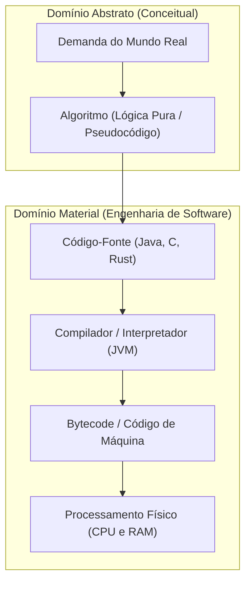

### O Pipeline de Engenharia de Software: Do Problema à Solução

A transformação de uma necessidade humana ou corporativa em um sistema computacional funcional exige o cumprimento sistemático de seis fases sequenciais de engenharia:

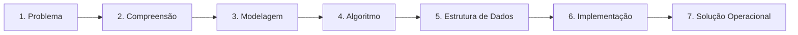

1. **Problema:** Enunciado do mundo real contendo ambiguidades, desejos de negócio e restrições.
2. **Compreensão:** Interpretação crítica, validação de regras de negócio e identificação formal de entradas e saídas esperadas.
3. **Modelagem:** Transposição dos requisitos para representações lógicas e entidades computáveis.
4. **Algoritmo:** Definição da sequência precisa de passos e transformações matemáticas para operar sobre o modelo.
5. **Estrutura de Dados:** Seleção da topologia de memória ótima (vetor, lista, pilha, fila) para armazenar as entidades.
6. **Implementação:** Codificação em linguagem executável, considerando tratamento de exceções e compiladores.
7. **Solução Operacional:** Sistema compilado, testado e validado frente aos casos de teste limites.

### Refinamento Sucessivo e Metodologia Descendente

O refinamento sucessivo (*stepwise refinement* ou abordagem *top-down*), formalizado por Niklaus Wirth, dita que problemas complexos não devem ser codificados diretamente. O desenvolvedor deve decompor o problema em camadas sucessivas de abstração decrescente:

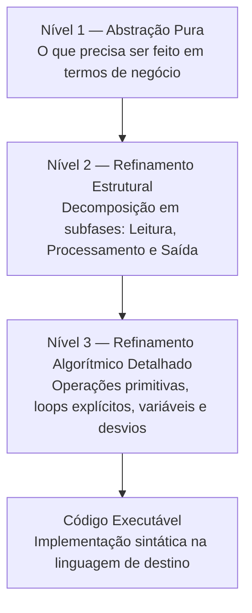

- **Nível 1 (Abstração Pura):** Enuncia o objetivo macro. Exemplo: "Calcular a média aritmética de três notas de um estudante".
- **Nível 2 (Refinamento Estrutural):** Identifica os subprocessos lógicos:
  1. Obter as três notas do discente.
  2. Somar os três valores coletados.
  3. Dividir a soma pela constante aritmética 3.
  4. Apresentar o resultado computado ao operador.
- **Nível 3 (Refinamento Algorítmico Detalhado):** Traduz os passos conceituais em instruções imperativas unívocas com atribuições e leituras diretas, prontas para codificação.

### Tipos Abstratos de Dados: O Que versus Como

Um **Tipo Abstrato de Dados (TAD)** é um modelo matemático composto por uma coleção de dados associada a um conjunto de operações primitivas autorizadas sobre eles. O núcleo do conceito reside no desacoplamento categórico entre:

- **A Interface Pública ("O QUE"):** O contrato exposto aos módulos clientes contendo assinaturas de funções, pré-condições, pós-condições e exceções.
- **A Implementação Privada ("COMO"):** A estrutura de armazenamento em memória física (seja um bloco contíguo indexado ou nós dinâmicos encadeados por ponteiros) e a lógica algorítmica interna dos métodos.

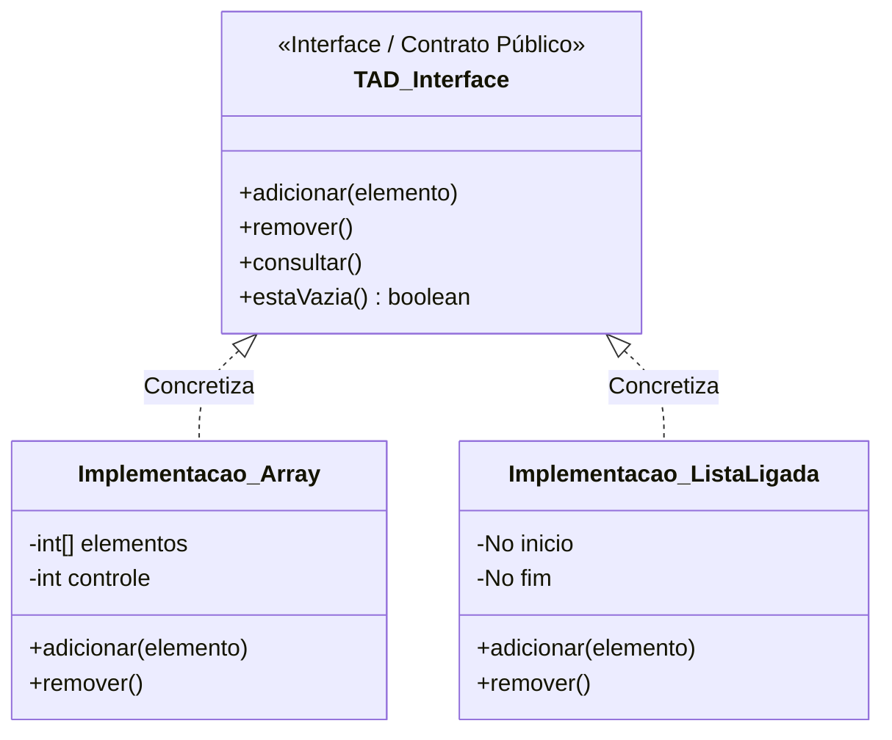

### Abstração, Encapsulamento e Invariantes Estruturais

A **abstração** protege a mente do engenheiro contra a sobrecarga de detalhes técnicos de baixo nível enquanto orquestra regras de negócio. O **encapsulamento** estabelece a barreira física de código (mediada por palavras-chave como `private` em linguagens orientadas a objetos) que impede o código cliente de mutar diretamente atributos internos de controle.

Essa blindagem assegura as **invariantes estruturais** do TAD. Em uma pilha estática, por exemplo, o ponteiro de topo deve refletir exatamente o índice do elemento inserido mais recentemente. Caso o código cliente pudesse executar `pilha.topo = 50` sem inserir elementos reais no array, toda a integridade da estrutura seria corrompida.

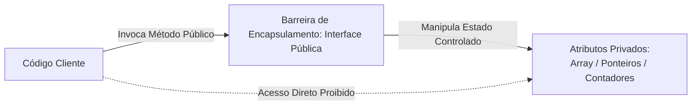

### Critérios de Decisão na Escolha de Representação de Dados

A escolha da representação concreta de um TAD é governada pelas operações primárias exigidas pelo problema de negócio, conforme consolidado na matriz de decisão do Prof. Wesley Soares:

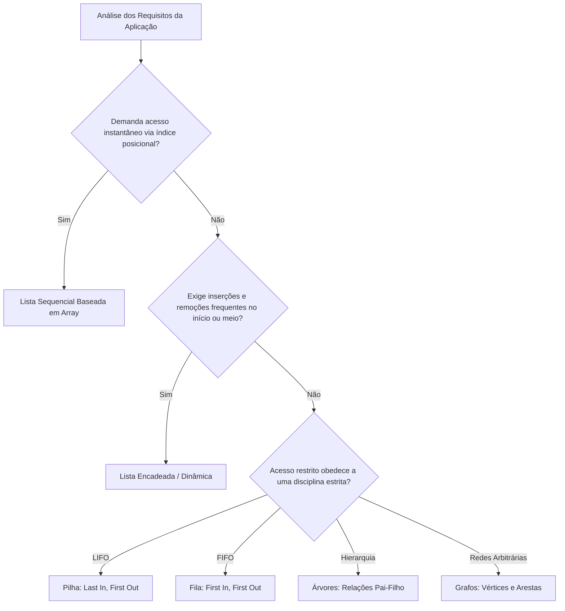

### Fundamentos da Análise de Algoritmos e Inadequação do Tempo de Relógio

Avaliar a eficiência de um algoritmo medindo o tempo físico de processamento (tempo de relógio cronometrado em segundos ou milissegundos) é uma abordagem frágil e cientificamente incorreta para caracterizar complexidade teórica. A cronometragem empírica sofre interferência de fatores voláteis alheios ao algoritmo:

- Clock da CPU, arquitetura e quantidade de núcleos de processamento.
- Carga momentânea de outros processos no sistema operacional.
- Latência da memória RAM e níveis de cache L1, L2 e L3.
- Versão do compilador, nível de otimização e comportamento do compilador JIT (*Just-In-Time*) da JVM.
- Volume e distribuição prévia específica dos dados testados.

A análise analítica de algoritmos substitui o tempo físico pela **contagem de passos elementares ou operações fundamentais** expressas em função puramente matemática do tamanho da entrada ($n$).

### Tamanho da Entrada, Contagem de Operações e Descarte de Constantes

O parâmetro $n$ formaliza o volume quantitativo de dados sobre o qual o algoritmo atuará: a quantidade de elementos de um array, o número de nós de uma lista ligada ou o valor inteiro de uma contagem regressiva.

Ao analisar o custo temporal $T(n)$, quantificamos instruções primitivas (atribuições, comparações booleanas, operações aritméticas e acessos a ponteiros). Considere a função:

$$T(n) = 3n^2 + 50n + 1000$$

À medida que a entrada escala em direção a grandes volumes de dados ($n \to \infty$):
- Para $n = 100.000$, o termo quadrático $3n^2$ resulta em $30.000.000.000$ operações.
- O termo linear $50n$ contribui com apenas $5.000.000$ operações (menos de 0,02% do total).
- O termo independente $1000$ torna-se matematicamente imperceptível.

A análise assintótica aplica duas regras universais de simplificação:
1. **Descarte de termos de menor ordem:** Preserva-se exclusivamente o termo cujo crescimento dita a ordem de grandeza dominante.
2. **Descarte de constantes multiplicativas:** O coeficiente escalar é eliminado, pois reflete apenas fatores de hardware, não a taxa de crescimento da curva.

Portanto: $T(n) = 3n^2 + 50n + 1000 \implies O(n^2)$.

### Análise Assintótica: Notações Big-O e Big-Omega

- **Notação Big-O ($O$):** Define o **limite superior assintótico**. Formalmente, diz-se que $T(n) = O(f(n))$ se existirem constantes reais positivas $c > 0$ e $n_0 \ge 1$ tais que:

$$0 \le T(n) \le c \cdot f(n), \quad \forall n \ge n_0$$

O Big-O representa a garantia formal de que o custo temporal do algoritmo não ultrapassará essa fronteira superior no pior cenário de execução possível.

- **Notação Big-Omega ($\Omega$):** Define o **limite inferior assintótico**. Formalmente, diz-se que $T(n) = \Omega(g(n))$ se existirem constantes reais positivas $c > 0$ e $n_0 \ge 1$ tais que:

$$0 \le c \cdot g(n) \le T(n), \quad \forall n \ge n_0$$

O Big-Omega estabelece o piso estrutural: o algoritmo exigirá ao menos essa quantidade de trabalho computacional, mesmo sob as circunstâncias mais favoráveis.

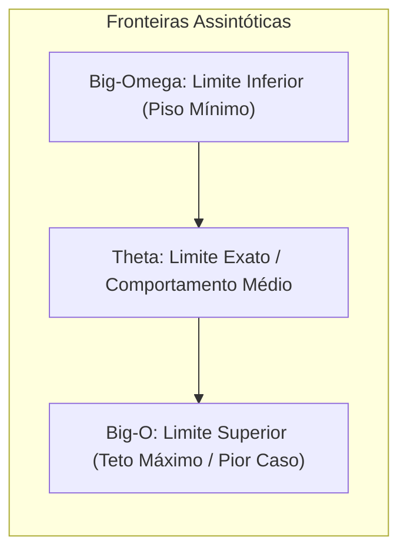

### Cenários de Execução: Pior Caso, Melhor Caso e Caso Médio

O custo de execução de um algoritmo não depende unicamente de $n$, mas também da organização espacial prévia dos dados na entrada:

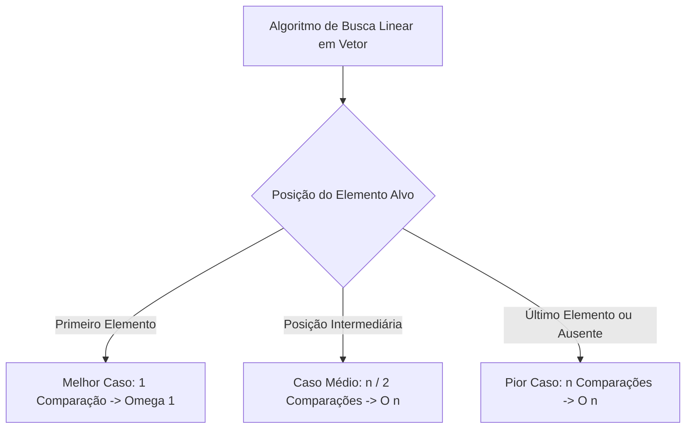

- **Melhor Caso:** A configuração de entrada mais favorável matematicamente. Na busca linear, ocorre quando a chave pesquisada ocupa exatamente o índice 0. O algoritmo conclui em tempo constante $\Omega(1)$.
- **Pior Caso:** A configuração de entrada que impõe o maior esforço operacional possível. Na busca linear, ocorre quando o elemento ocupa o índice $n-1$ ou inexiste na estrutura, forçando o laço a percorrer todas as $n$ posições: $O(n)$. Na engenharia de software, o pior caso é o padrão de referência para projetos críticos, pois define garantias de tempo de resposta sob estresse.
- **Caso Médio:** Modela o comportamento esperado considerando uma distribuição estatística uniforme de entradas possíveis. Na busca linear, requer em média $\frac{n+1}{2}$ iterações, convergindo assintoticamente para $\Theta(n)$.

### Famílias de Complexidade Computacional

As funções assintóticas fundamentais organizam-se em uma hierarquia estrita de dominância:

$$O(1) < O(\log n) < O(n) < O(n \log n) < O(n^2) < O(n^3) < O(2^n) < O(n!)$$

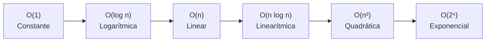

1. **Constante $O(1)$:** O número de operações independe do volume de dados. Exemplo: acesso indexado direto a um vetor (`v[i]`) ou push em pilha baseada em array.
2. **Logarítmica $O(\log n)$:** O espaço do problema é dividido sucessivamente por uma constante (geralmente 2) a cada passo. Exemplo: busca binária em vetor ordenado.
3. **Linear $O(n)$:** O volume de trabalho cresce proporcionalmente ao tamanho da entrada. Exemplo: busca linear ou varredura de contagem.
4. **Quadrática $O(n^2)$:** O processamento executa laços aninhados sobre o mesmo domínio de dados. Exemplo: algoritmos clássicos de ordenação por comparação simples (Bubble Sort, Selection Sort) e comparação de todos os pares.
5. **Exponencial $O(2^n)$ e Fatorial $O(n!)$:** Explosão combinatória impraticável para valores moderados de $n$. Exemplo: problema do caixeiro-viajante por enumeração exaustiva de permutações.

### Arquitetura de Memória da JVM: Segmentos Stack e Heap

A Máquina Virtual Java organiza o gerenciamento de memória em dois segmentos arquiteturais fundamentais em tempo de execução:

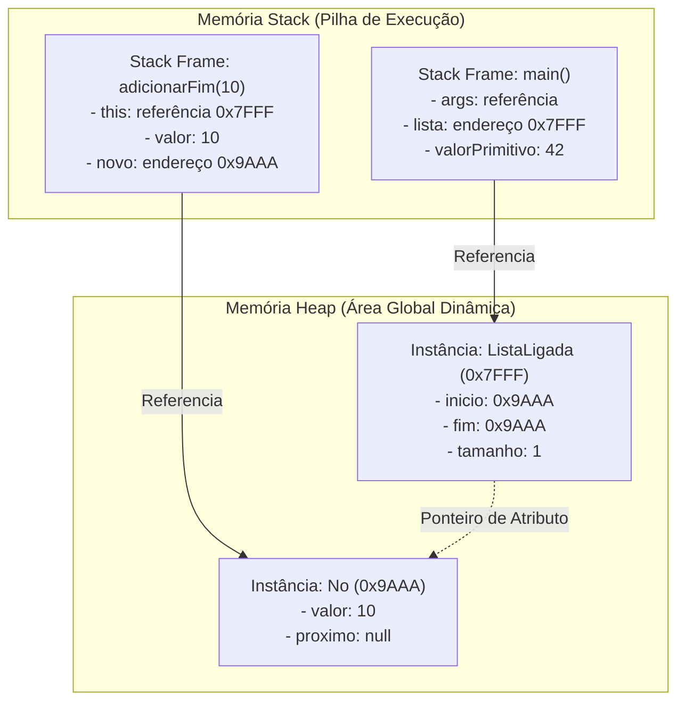

- **Memória Stack (Pilha de Execução):**
  - Dedicada à execução de threads e controle de chamadas de métodos.
  - Aloca *Stack Frames* de forma estritamente LIFO a cada invocação de método, destruindo-os instantaneamente no retorno (`return`).
  - Armazena variáveis locais primitivas (`int`, `double`, `boolean`) e variáveis de referência que contêm endereços apontando para o Heap.
  - Acesso de altíssima performance gerenciado diretamente pelo registrador de stack pointer da CPU.
  - Sujeita ao erro de estouro `java.lang.StackOverflowError` em recursões excessivas.

- **Memória Heap (Área Dinâmica Global):**
  - Espaço comum compartilhado onde residem todos os objetos instanciados via operador `new` e matrizes nativas.
  - Alocação dinâmica sob demanda em tempo de execução.
  - O ciclo de vida dos objetos independe do escopo do método que os instanciou.
  - Gerenciada automaticamente pelo coletor de lixo (*Garbage Collector*).
  - Sujeita ao esgotamento de capacidade com `java.lang.OutOfMemoryError: Java heap space`.

### Semântica de Tipos Primitivos versus Variáveis de Referência

A compreensão de estruturas dinâmicas em Java exige a distinção estrita entre passagem de dados primitivos e cópia de referências de ponteiro:

```java
int a = 10;
int b = a; // Copia o valor literal binário. 'b' possui seu próprio espaço independente.
b = 20;    // 'a' permanece rigorosamente 10.

No p1 = new No(10);
No p2 = p1; // Copia o endereço de memória contido em p1. Ambos apontam para o mesmo objeto no Heap.
p2.valor = 99; // Acessa o objeto compartilhado no Heap.
System.out.println(p1.valor); // Imprime 99.
```

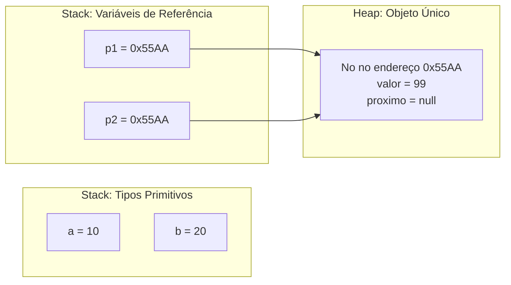

### Ciclo de Vida de Objetos, Inalcançabilidade e o Garbage Collector

Diferente de linguagens como C ou C++, onde o desalocamento é manual e propenso a falhas (`free` / `delete`), a JVM emprega o **Garbage Collector (GC)**.

O GC identifica a **inalcançabilidade** de objetos por meio de algoritmos de rastreabilidade a partir de raízes conhecidas (*GC Roots* — variáveis ativas na Stack, variáveis estáticas e threads em execução):

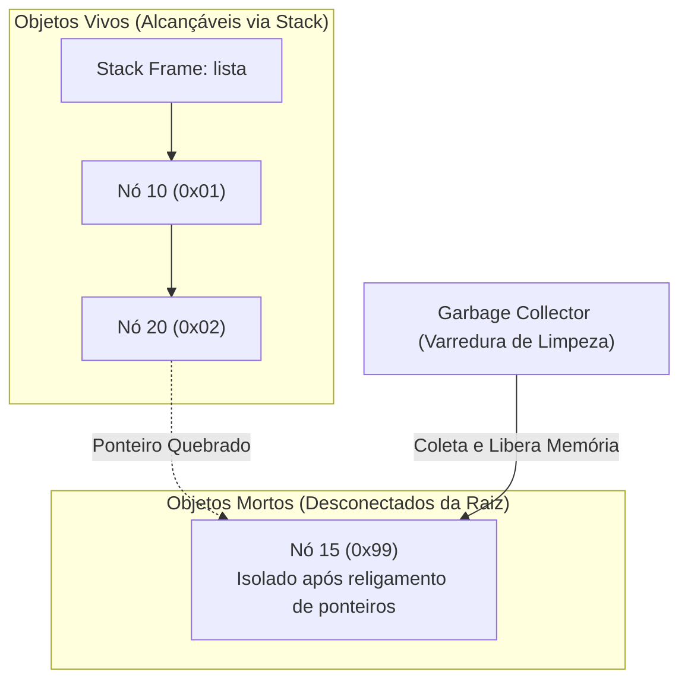

Quando um nó intermediário é removido de uma lista ligada e nenhuma variável na Stack ou objeto ativo aponta para ele, ele torna-se inalcançável. O GC detecta essa condição e recupera o bloco de memória do Heap de forma assíncrona.

### Estruturas Lineares Sequenciais: Capacidade, Tamanho e Deslocamento

Uma **Lista Linear Sequencial** é implementada sobre um vetor nativo contíguo (`array`). O endereço de qualquer elemento no índice $i$ é calculado diretamente pela unidade de controle de memória da CPU através da fórmula aritmética em tempo constante $O(1)$:

$$\text{Endereço}(i) = \text{EndereçoBase} + (i \times \text{TamanhoEmBytes})$$

Essa contiguidade impõe dois conceitos fundamentais que jamais devem ser confundidos:
- **Capacidade Máxima:** A quantidade total de células físicas alocadas na criação do vetor (`elementos.length`).
- **Tamanho Corrente ($t$):** A quantidade lógica de posições efetivamente ocupadas por dados válidos ($0 \le t \le \text{capacidade}$).

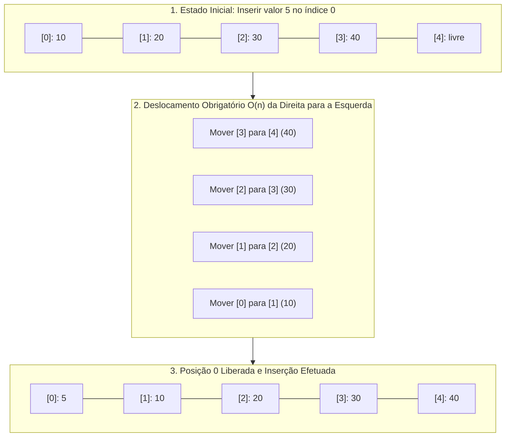

O **gargalo arquitetural do deslocamento (*shifting*)**: Para inserir ou remover um dado no índice 0 ou no meio de um array sequencial sem quebrar a ordem relativa dos elementos, o algoritmo é obrigado a copiar cada elemento adjacente para a casa vizinha. Se a estrutura contém $n$ elementos, a inserção no início impõe rigorosamente $n$ cópias de memória, resultando em complexidade linear $O(n)$.

### Estruturas Dinâmicas Encadeadas: Anatomia do Nó

A **Lista Simplesmente Ligada** elimina a necessidade de alocação de blocos contíguos de memória. Cada elemento reside em uma unidade atômica independente de alocação denominada **Nó** (*Node*).

Um nó é estruturado por dois atributos fundamentais:
1. **Carga Útil (*Payload* ou Valor):** A entidade de dados do domínio do problema (um número primitivo `int` ou uma referência complexa a um objeto como `Paciente`).
2. **Elo de Encadeamento (`proximo`):** Uma variável de referência que armazena o endereço do nó subsequente no Heap, ou a constante `null` se for o último elemento da cadeia.

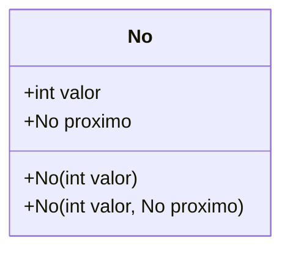

### Lista Simplesmente Ligada: Início, Fim e Tamanho

A classe controladora `ListaLigada` encapsula a topologia de ponteiros, mantendo três atributos privados que sustentam suas invariantes:

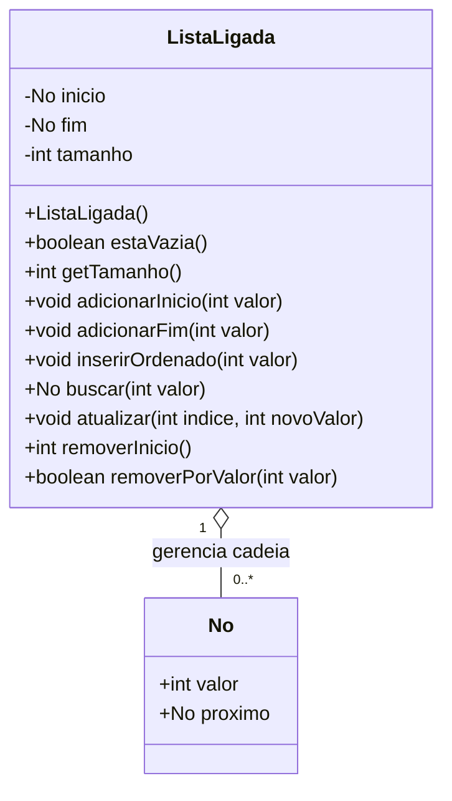

- `No inicio`: Referência direta para o primeiro nó da lista. Se a lista estiver vazia, contém `null`.
- `No fim`: Referência direta para o nó terminal da cadeia.
- `int tamanho`: Contador inteiro mantido e sincronizado a cada mutação estrutural, permitindo responder a consultas de cardinalidade em $O(1)$.

### Otimização de Inserção na Cauda com Ponteiro de Fim

Conforme formalizado pelo Prof. Wesley Soares em sala de aula, a manutenção do ponteiro `fim` é uma decisão de engenharia de software que redefine a complexidade assintótica da inserção no final da lista:

- **Abordagem Ingênua (Sem Ponteiro de Fim):** A estrutura possui unicamente a referência `inicio`. Para anexar um elemento ao final, o algoritmo precisa partir do primeiro nó e iterar sucessivamente nó a nó até encontrar aquele cujo campo `proximo == null`. Custo assintótico: **$O(n)$**.
- **Abordagem Otimizada (Com Ponteiro de Fim):** A estrutura memoriza a localização do último nó. A inserção executa duas manipulações diretas de referência: `this.fim.proximo = novo` e `this.fim = novo`. Custo assintótico: **$O(1)$ constante**.

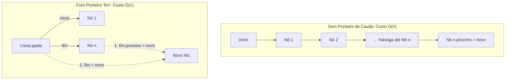

### Inserção Ordenada: Separação entre Busca e Religamento

A inserção de um elemento mantendo a propriedade de ordenação crescente em uma lista simplesmente ligada ilustra a regra da decomposição analítica:

1. **Fase 1 — Localização do Ponto de Inserção:** Percorrer a lista a partir do início avaliando a chave até encontrar o nó anterior ao local de encaixe. Custo temporal: **$O(n)$**.
2. **Fase 2 — Religamento de Referências:** Ajustar as duas conexões de encadeamento. Custo temporal: **$O(1)$**.

$$\text{Custo Total} = O(n) + O(1) = O(n)$$

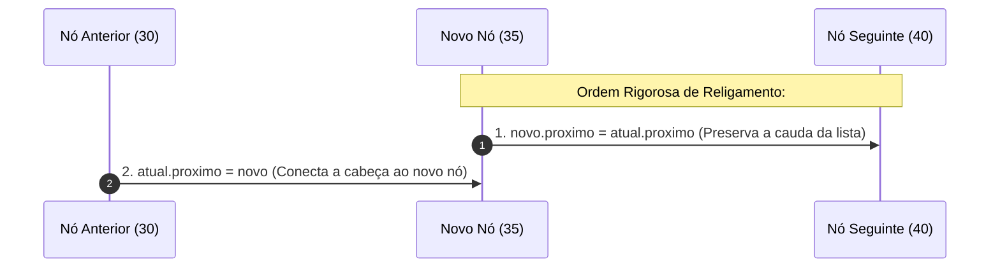

> **Aviso Crítico:** Caso a ordem acima seja invertida (`atual.proximo = novo` executado antes de salvar `atual.proximo`), o endereço do nó `40` e de todos os seus sucessores é irremediavelmente perdido da memória, destruindo a estrutura da lista.

### Busca Linear e Atualização por Índice em Estruturas Ligadas

Listas encadeadas **não possuem indexação física na memória RAM**. O índice em uma lista encadeada é uma abstração puramente posicional. Para acessar o elemento no índice $k$, o algoritmo precisa executar $k$ saltos de ponteiro sequenciais a partir do nó `inicio`.

- **Busca por Valor:** Percorre a cadeia comparando a carga útil (`atual.valor == valor`). Melhor caso no início: $\Omega(1)$. Pior caso no final ou ausente: $O(n)$.
- **Atualização por Índice:** Executa a navegação iterativa de $k$ passos ($O(n)$) e, ao alcançar o nó almejado, atribui o novo valor primitivo `atual.valor = novoValor` ($O(1)$). Complexidade final: $O(n)$.

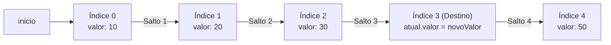

### Estruturas Lineares Restritas: O Tipo Abstrato de Dados Pilha

Uma **Pilha** (ou *Stack*) é um Tipo Abstrato de Dados linear no qual todas as operações de mutação (inserção e remoção) e consulta acontecem exclusivamente em uma única extremidade aberta: o **Topo** (*Top*). A extremidade oposta é a **Base** (*Bottom*).

```mermaid
flowchart TD
    subgraph PilhaDiagrama["Disciplina de Acesso Restrito da Pilha"]
        TopOp["Operações Permitidas Exclusivamente no Topo: push(), pop(), peek()"]
        TopOp --> ElTopo["Elemento no Topo (Último Inserido / Primeiro Removido)"]
        ElTopo --- ElMeio["Elemento Intermediário (Inacessível Diretamente)"]
        ElMeio --- ElBase["Elemento na Base (Primeiro Inserido / Último Removido)"]
    end
```

### O Princípio LIFO e Operações Fundamentais da Pilha

A semântica de operação da pilha é governada pelo princípio:

> **LIFO — Last In, First Out**  
> *O último elemento inserido na estrutura é obrigatoriamente o primeiro elemento a ser removido.*

O contrato formal de operações fundamentais da pilha inclui:
- `push(valor)`: Empilha um novo elemento sobre o topo atual. Custo: $O(1)$.
- `pop()`: Desempilha, remove e retorna o elemento atualmente no topo. Custo: $O(1)$.
- `peek()` (ou `top()`): Consulta o valor do topo sem desempilhá-lo. Custo: $O(1)$.
- `isEmpty()`: Predicado booleano que retorna `true` se a pilha não contiver itens válidos. Custo: $O(1)$.

```mermaid
sequenceDiagram
    autonumber
    actor Cliente as Código Cliente
    participant P as Pilha (Instância)

    Note over P: Pilha Vazia (topo = -1)
    Cliente->>P: push(10)
    Note over P: topo avança para 0; elementos[0] = 10
    Cliente->>P: push(20)
    Note over P: topo avança para 1; elementos[1] = 20
    Cliente->>P: peek()
    P-->>Cliente: Retorna 20 (topo permanece 1)
    Cliente->>P: pop()
    Note over P: Captura elementos[1] (20); topo recua para 0
    P-->>Cliente: Retorna 20
    Cliente->>P: pop()
    Note over P: Captura elementos[0] (10); topo recua para -1
    P-->>Cliente: Retorna 10 (Pilha Vazia)
```

### Implementação de Pilha sobre Vetores e a Sentinela de Índice Negativo

Na implementação sequencial baseada em array nativo, a indexação das posições segue a convenção clássica com base zero ($0$ até $\text{capacidade} - 1$). A matemática dos estados determina:

- Para $1$ elemento válido: o elemento reside no índice `0`. Logo, `topo = 0`.
- Para $2$ elementos válidos: o topo reside no índice `1`. Logo, `topo = 1`.
- Para $k$ elementos válidos: o topo reside no índice $k - 1$.
- Para $0$ elementos (Pilha Vazia): o topo reside no índice $0 - 1 = -1$.

> A constante `topo = -1` funciona como uma **sentinela matemática de vacuidade**, indicando que não existem dados ativos na estrutura.

```mermaid
flowchart LR
    subgraph MemoriaPilha["Array elementos[] com capacidade = 4"]
        P0["[0] = 10"]
        P1["[1] = 20"]
        P2["[2] = lixo / inativo"]
        P3["[3] = lixo / inativo"]
    end
    TopoPtr["Variável topo = 1"] --> P1
```

### Mapeamento de Estados da Pilha: Overflow, Underflow e Exclusão Lógica

A pilha transita entre estados discretos bem caracterizados:

```mermaid
stateDiagram-v2
    [*] --> Vazia: Instanciação (topo = -1)
    Vazia --> ComElementos: push(v)
    ComElementos --> ComElementos: push(v) [se topo < capacidade - 1]
    ComElementos --> Cheia: push(v) [se topo == capacidade - 1]
    Cheia --> ComElementos: pop()
    ComElementos --> ComElementos: pop() [se topo > 0]
    ComElementos --> Vazia: pop() [quando topo retorna a -1]
```

- **Stack Overflow (Estouro de Pilha):** Ocorre ao invocar `push(valor)` quando a estrutura já atingiu a capacidade máxima (`topo == capacidade - 1`). Dispara `IllegalStateException`.
- **Stack Underflow (Subfluxo de Pilha):** Ocorre ao invocar `pop()` ou `peek()` sobre uma estrutura vazia (`topo == -1` ou `isEmpty() == true`). Dispara `IllegalStateException`.
- **Exclusão Lógica versus Exclusão Física:** A operação `pop()` sobre array primitivo não apaga fisicamente os bits gravados na célula de memória. Ela apenas recua o marcador escalar `topo--`. A posição antiga permanece com seu valor físico residual até que um futuro `push()` a sobrescreva de forma segura.

### Disciplinas de Atendimento: Modelagem de Filas sobre Listas Ligadas

Uma **Fila** (*Queue*) impõe a disciplina **FIFO** (*First In, First Out* — o primeiro que entra é o primeiro a ser removido). 

Ao modelar uma fila utilizando uma lista simplesmente ligada com ponteiros de `inicio` e `fim`:
- **Inserção (*Enqueue*):** Injeta o novo nó na cauda (`fim`) em tempo constante $O(1)$.
- **Remoção de Atendimento (*Dequeue*):** Remove o nó da cabeça (`inicio`) em tempo constante $O(1)$.
- **Cancelamento Arbitrário (Trabalho AV1):** Permite retirar elementos intermediários por chave identificadora, exigindo busca linear $O(n)$ e religamento de ponteiros $O(1)$.

---

## Sintaxe e Exemplos Práticos

### Lista Linear Sequencial Estática com Deslocamento Manual

A classe abaixo materializa uma lista baseada em array com controle explícito de capacidade, tamanho e as operações de deslocamento de memória (*shifting*).

```java
public class ListaSequencialEstatica {
    private int[] elementos;
    private int tamanho;

    public ListaSequencialEstatica(int capacidade) {
        if (capacidade <= 0) {
            throw new IllegalArgumentException("A capacidade deve ser positiva.");
        }
        this.elementos = new int[capacidade];
        this.tamanho = 0;
    }

    public boolean estaVazia() {
        return this.tamanho == 0;
    }

    public boolean estaCheia() {
        return this.tamanho == this.elementos.length;
    }

    public int getTamanho() {
        return this.tamanho;
    }

    // Inserção no início: impõe deslocamento de todos os n elementos para a direita - O(n)
    public void inserirInicio(int valor) {
        if (estaCheia()) {
            throw new IllegalStateException("Capacidade máxima da lista atingida.");
        }

        // Deslocamento de trás para frente para evitar sobreposição destrutiva
        for (int i = this.tamanho - 1; i >= 0; i--) {
            this.elementos[i + 1] = this.elementos[i];
        }

        this.elementos[0] = valor;
        this.tamanho++;
    }

    // Inserção no fim: adição direta no índice apontado por tamanho - O(1)
    public void inserirFim(int valor) {
        if (estaCheia()) {
            throw new IllegalStateException("Capacidade máxima da lista atingida.");
        }
        this.elementos[this.tamanho] = valor;
        this.tamanho++;
    }

    // Remoção no início: impõe deslocamento de todos os n-1 elementos para a esquerda - O(n)
    public int removerInicio() {
        if (estaVazia()) {
            throw new IllegalStateException("Lista vazia: impossível remover.");
        }

        int valorRemovido = this.elementos[0];

        // Desloca elementos da esquerda para a direita cobrindo a vaga aberta
        for (int i = 0; i < this.tamanho - 1; i++) {
            this.elementos[i] = this.elementos[i + 1];
        }

        this.tamanho--;
        return valorRemovido;
    }

    // Acesso direto em tempo constante O(1)
    public int obter(int indice) {
        if (indice < 0 || indice >= this.tamanho) {
            throw new IndexOutOfBoundsException("Índice fora dos limites: " + indice);
        }
        return this.elementos[indice];
    }
}
```

### Nó Dinâmico Auto-referenciado

O átomo básico de alocação no Heap para a lista simplesmente ligada.

```java
public class No {
    public int valor;      // Carga útil transportada
    public No proximo;     // Referência para a próxima instância no Heap

    // Construtor elementar
    public No(int valor) {
        this.valor = valor;
        this.proximo = null;
    }

    // Construtor completo
    public No(int valor, No proximo) {
        this.valor = valor;
        this.proximo = proximo;
    }
}
```

### Lista Simplesmente Ligada com Inserção O(1) e Inserção Ordenada

Implementação canônica com ponteiros de início, cauda e contador de tamanho.

```java
public class ListaLigada {
    private No inicio;
    private No fim;
    private int tamanho;

    public ListaLigada() {
        this.inicio = null;
        this.fim = null;
        this.tamanho = 0;
    }

    public boolean estaVazia() {
        return this.inicio == null;
    }

    public int getTamanho() {
        return this.tamanho;
    }

    // Inserção na cabeça em tempo estrito O(1)
    public void adicionarInicio(int valor) {
        No novo = new No(valor);
        novo.proximo = this.inicio;
        this.inicio = novo;

        if (this.fim == null) {
            this.fim = novo;
        }
        this.tamanho++;
    }

    // Inserção na cauda otimizada em tempo estrito O(1) via ponteiro de fim
    public void adicionarFim(int valor) {
        No novo = new No(valor);

        if (estaVazia()) {
            this.inicio = novo;
            this.fim = novo;
        } else {
            this.fim.proximo = novo;
            this.fim = novo;
        }
        this.tamanho++;
    }

    // Inserção ordenada: O(n) na busca + O(1) no religamento
    public void inserirOrdenado(int valor) {
        No novo = new No(valor);

        // Caso 1: Lista vazia ou elemento menor que a cabeça
        if (estaVazia() || valor <= this.inicio.valor) {
            adicionarInicio(valor);
            return;
        }

        // Caso 2: Busca sequencial pelo ponto de inserção
        No atual = this.inicio;
        while (atual.proximo != null && atual.proximo.valor < valor) {
            atual = atual.proximo;
        }

        // Caso 3: Religamento de referências
        novo.proximo = atual.proximo;
        atual.proximo = novo;

        // Se inserido após o último, atualiza o ponteiro fim
        if (novo.proximo == null) {
            this.fim = novo;
        }
        this.tamanho++;
    }

    // Busca linear por valor: O(1) melhor caso, O(n) pior caso
    public No buscar(int valor) {
        No atual = this.inicio;
        while (atual != null) {
            if (atual.valor == valor) {
                return atual;
            }
            atual = atual.proximo;
        }
        return null; // Elemento ausente
    }

    // Atualização posicional: O(n) na navegação + O(1) na atribuição
    public void atualizar(int indice, int novoValor) {
        if (indice < 0 || indice >= this.tamanho) {
            throw new IndexOutOfBoundsException("Índice inválido: " + indice);
        }

        No atual = this.inicio;
        for (int i = 0; i < indice; i++) {
            atual = atual.proximo;
        }
        atual.valor = novoValor;
    }

    // Remoção na cabeça: O(1)
    public int removerInicio() {
        if (estaVazia()) {
            throw new IllegalStateException("Lista vazia: impossível remover.");
        }

        int valorExtraido = this.inicio.valor;
        this.inicio = this.inicio.proximo;
        this.tamanho--;

        if (this.inicio == null) {
            this.fim = null; // Lista esvaziou
        }

        return valorExtraido;
    }

    // Remoção por valor arbitrário: O(n)
    public boolean removerPorValor(int valor) {
        if (estaVazia()) {
            return false;
        }

        // Caso o elemento a remover seja o primeiro
        if (this.inicio.valor == valor) {
            removerInicio();
            return true;
        }

        No anterior = this.inicio;
        No atual = this.inicio.proximo;

        while (atual != null && atual.valor != valor) {
            anterior = atual;
            atual = atual.proximo;
        }

        if (atual == null) {
            return false; // Valor não encontrado
        }

        // Religamento desvinculando o nó atual
        anterior.proximo = atual.proximo;

        // Se o nó removido era o último, atualiza o ponteiro fim
        if (atual == this.fim) {
            this.fim = anterior;
        }

        atual.proximo = null; // Isolamento defensivo para o Garbage Collector
        this.tamanho--;
        return true;
    }
}
```

### Pilha Sequencial Baseada em Array com Tratamento de Estados

Implementação completa com salvaguardas de *Overflow* e *Underflow*, operando em tempo $O(1)$ para todos os métodos.

```java
public class Pilha {
    private int[] elementos;
    private int topo;

    public Pilha(int capacidade) {
        if (capacidade <= 0) {
            throw new IllegalArgumentException("A capacidade deve ser estritamente maior que zero.");
        }
        this.elementos = new int[capacidade];
        this.topo = -1; // Sentinela de pilha vazia
    }

    public boolean isEmpty() {
        return this.topo == -1;
    }

    public boolean isFull() {
        return this.topo == this.elementos.length - 1;
    }

    // Empilhar: pré-incrementa o topo e grava o elemento - O(1)
    public void push(int valor) {
        if (isFull()) {
            throw new IllegalStateException("Stack Overflow: capacidade máxima excedida.");
        }
        this.topo++;
        this.elementos[this.topo] = valor;
    }

    // Desempilhar: captura o elemento e pós-decrementa o topo - O(1)
    public int pop() {
        if (isEmpty()) {
            throw new IllegalStateException("Stack Underflow: impossível desempilhar de pilha vazia.");
        }
        int valorRetornado = this.elementos[this.topo];
        this.topo--; // Exclusão lógica
        return valorRetornado;
    }

    // Consultar o topo sem remover - O(1)
    public int peek() {
        if (isEmpty()) {
            throw new IllegalStateException("Stack Underflow: pilha vazia.");
        }
        return this.elementos[this.topo];
    }

    public int getTamanho() {
        return this.topo + 1;
    }
}
```

### Estudo de Caso do Trabalho AV1: Sistema de Atendimento Clínico

O Trabalho Prático AV1 solicitou um sistema completo em Java para gerenciamento de fila de atendimento clínico, composto por `Paciente`, `No`, `ListaLigada` e classe executável `Main`.

#### 1. Entidade de Domínio: Paciente.java
```java
public class Paciente {
    private String nome;
    private int idade;
    private int numeroConsulta;

    public Paciente(String nome, int idade, int numeroConsulta) {
        this.nome = nome;
        this.idade = idade;
        this.numeroConsulta = numeroConsulta;
    }

    public String getNome() {
        return nome;
    }

    public int getIdade() {
        return idade;
    }

    public int getNumeroConsulta() {
        return numeroConsulta;
    }

    @Override
    public String toString() {
        return "Paciente [Consulta #" + numeroConsulta + " | Nome: " + nome + " | Idade: " + idade + " anos]";
    }
}
```

#### 2. Unidade de Encadeamento: No.java
```java
public class No {
    private Paciente elemento;
    private No proximo;

    public No(Paciente elemento) {
        this.elemento = elemento;
        this.proximo = null;
    }

    public No(Paciente elemento, No proximo) {
        this.elemento = elemento;
        this.proximo = proximo;
    }

    public Paciente getElemento() {
        return elemento;
    }

    public void setElemento(Paciente elemento) {
        this.elemento = elemento;
    }

    public No getProximo() {
        return proximo;
    }

    public void setProximo(No proximo) {
        this.proximo = proximo;
    }
}
```

#### 3. Controladora da Fila Dinâmica: ListaLigada.java
```java
public class ListaLigada {
    private No primeiro;
    private No ultimo;
    private int tamanho;

    public ListaLigada() {
        this.primeiro = null;
        this.ultimo = null;
        this.tamanho = 0;
    }

    public boolean estaVazia() {
        return this.primeiro == null;
    }

    public int getTamanho() {
        return this.tamanho;
    }

    // Requisito 1: Adicionar paciente no final da fila - O(1)
    public void adicionar(Paciente paciente) {
        No novo = new No(paciente);
        if (estaVazia()) {
            this.primeiro = novo;
            this.ultimo = novo;
        } else {
            this.ultimo.setProximo(novo);
            this.ultimo = novo;
        }
        this.tamanho++;
    }

    // Requisito 2: Chamar próximo paciente (disciplina FIFO na cabeça) - O(1)
    public Paciente chamarProximo() {
        if (estaVazia()) {
            return null;
        }
        Paciente atendido = this.primeiro.getElemento();
        this.primeiro = this.primeiro.getProximo();
        this.tamanho--;

        if (this.primeiro == null) {
            this.ultimo = null;
        }
        return atendido;
    }

    // Requisito 3: Cancelar consulta por identificador - O(n)
    public boolean cancelarConsulta(int numeroConsulta) {
        if (estaVazia()) {
            return false;
        }

        // Caso especial: o paciente a ser cancelado é o primeiro da fila
        if (this.primeiro.getElemento().getNumeroConsulta() == numeroConsulta) {
            chamarProximo();
            return true;
        }

        No anterior = this.primeiro;
        No atual = this.primeiro.getProximo();

        while (atual != null && atual.getElemento().getNumeroConsulta() != numeroConsulta) {
            anterior = atual;
            atual = atual.getProximo();
        }

        if (atual == null) {
            return false; // Consulta não encontrada
        }

        anterior.setProximo(atual.getProximo());

        // Se o cancelado for o último da fila
        if (atual == this.ultimo) {
            this.ultimo = anterior;
        }

        atual.setProximo(null); // Isolamento defensivo para o Garbage Collector
        this.tamanho--;
        return true;
    }

    // Requisito 4: Consultar paciente por número de consulta - O(n)
    public Paciente consultarPaciente(int numeroConsulta) {
        No atual = this.primeiro;
        while (atual != null) {
            if (atual.getElemento().getNumeroConsulta() == numeroConsulta) {
                return atual.getElemento();
            }
            atual = atual.getProximo();
        }
        return null;
    }

    // Impressão sequencial da fila
    public void imprimirFila() {
        if (estaVazia()) {
            System.out.println("Fila de espera vazia.");
            return;
        }
        System.out.println("--- Fila de Espera Atual (" + this.tamanho + " pacientes) ---");
        No atual = this.primeiro;
        int posicao = 1;
        while (atual != null) {
            System.out.println(posicao + "º: " + atual.getElemento());
            atual = atual.getProximo();
            posicao++;
        }
        System.out.println("-------------------------------------------------");
    }
}
```

#### 4. Classe Demonstrativa: Main.java
```java
public class Main {
    public static void main(String[] args) {
        ListaLigada filaClinica = new ListaLigada();

        System.out.println("=================================================");
        System.out.println("SISTEMA DE ATENDIMENTO CLINICO - UNIFEF");
        System.out.println("=================================================");

        // Cadastro de 5 pacientes
        filaClinica.adicionar(new Paciente("Carlos Eduardo", 45, 101));
        filaClinica.adicionar(new Paciente("Mariana Souza", 28, 102));
        filaClinica.adicionar(new Paciente("Joao Pedro", 65, 103));
        filaClinica.adicionar(new Paciente("Ana Beatriz", 19, 104));
        filaClinica.adicionar(new Paciente("Roberto Lima", 52, 105));

        // Impressão da fila inicial
        filaClinica.imprimirFila();

        // Chamar o próximo paciente (remoção da cabeça)
        System.out.println("\n[Acao: Chamada de Atendimento]");
        Paciente chamado = filaClinica.chamarProximo();
        System.out.println("Atendendo agora: " + chamado);

        filaClinica.imprimirFila();

        // Cancelamento de uma consulta intermediária
        System.out.println("\n[Acao: Cancelamento de Consulta]");
        int consultaCancelar = 103;
        boolean cancelou = filaClinica.cancelarConsulta(consultaCancelar);
        if (cancelou) {
            System.out.println("Consulta #" + consultaCancelar + " cancelada com sucesso.");
        } else {
            System.out.println("Falha ao cancelar: consulta #" + consultaCancelar + " nao encontrada.");
        }

        filaClinica.imprimirFila();

        // Busca de paciente existente
        System.out.println("\n[Acao: Consulta de Paciente]");
        int consultaBuscar = 104;
        Paciente buscado = filaClinica.consultarPaciente(consultaBuscar);
        if (buscado != null) {
            System.out.println("Paciente localizado: " + buscado);
        } else {
            System.out.println("Paciente nao localizado na fila.");
        }

        // Busca de paciente inexistente
        int consultaInexistente = 999;
        Paciente naoEncontrado = filaClinica.consultarPaciente(consultaInexistente);
        if (naoEncontrado == null) {
            System.out.println("Consulta #" + consultaInexistente + " nao consta nos registros.");
        }
    }
}
```

### Resolução Analítica do Trabalho de Complexidade de Algoritmos

Abaixo constam os seis métodos exigidos no formulário oficial do Google Classroom, acompanhados de sua dedução matemática formal:

#### Questão 1: Método `somar`
```java
public static int somar(int[] valores) {
    int soma = 0;
    for (int i = 0; i < valores.length; i++) {
        soma += valores[i];
    }
    return soma;
}
```
- **Dedução:** Seja $n = \text{valores.length}$. O laço executa exatamente $n$ iterações. Cada passagem executa uma soma aritmética e uma atribuição indexada de tempo constante $O(1)$. 
- **Equação:** $T(n) = c_1 \cdot n + c_2 \implies \mathbf{O(n)}$ (Linear).

#### Questão 2: Método `buscaBinaria`
```java
public static int buscaBinaria(int[] valores, int procurado) {
    int inicio = 0;
    int fim = valores.length - 1;

    while (inicio <= fim) {
        int meio = (inicio + fim) / 2;
        if (valores[meio] == procurado) {
            return meio;
        }
        if (valores[meio] < procurado) {
            inicio = meio + 1;
        } else {
            fim = meio - 1;
        }
    }
    return -1;
}
```
- **Dedução:** A cada iteração do laço `while`, o espaço de busca remanescente é reduzido à metade ($\frac{n}{2^k}$). No pior caso (elemento ausente ou na última partição), a condição de término ocorre quando $\frac{n}{2^k} \le 1 \implies k = \lceil \log_2 n \rceil$.
- **Conclusão:** $\mathbf{O(\log n)}$ (Logarítmica).

#### Questão 3: Método `imprimirPares`
```java
public static void imprimirPares(int[] valores) {
    for (int i = 0; i < valores.length; i++) {
        for (int j = 0; j < valores.length; j++) {
            System.out.println(valores[i] + " - " + valores[j]);
        }
    }
}
```
- **Dedução:** Dois laços aninhados independentes. O laço externo roda $n$ vezes. Para cada iteração de $i$, o laço interno de $j$ roda $n$ vezes. O comando de impressão é executado $n \times n = n^2$ vezes.
- **Conclusão:** $\mathbf{O(n^2)}$ (Quadrática — assinalado como `O(nˆ2)` no formulário).

#### Questão 4: Método `contarIguais`
```java
public static int contarIguais(int[] valores) {
    int contador = 0;
    for (int i = 0; i < valores.length; i++) {
        for (int j = i + 1; j < valores.length; j++) {
            if (valores[i] == valores[j]) {
                contador++;
            }
        }
    }
    return contador;
}
```
- **Dedução:** Laços aninhados dependentes formando um espaço triangular de comparações. A quantidade de iterações do laço interno decresce: $(n-1) + (n-2) + \dots + 1 + 0$.
- **Somatório da Progressão Aritmética:**
$$S = \sum_{k=1}^{n-1} k = \frac{(n-1)n}{2} = \frac{1}{2}n^2 - \frac{1}{2}n$$
- Descartando o termo de menor ordem ($-\frac{1}{2}n$) e a constante multiplicativa ($\frac{1}{2}$), resta a ordem dominante $n^2$.
- **Conclusão:** $\mathbf{O(n^2)}$ (Quadrática — assinalado como `O(nˆ2)` no formulário).

#### Questão 5: Método `maior`
```java
public static int maior(int[] valores) {
    int maior = valores[0];
    int i = 1;
    while (i < valores.length) {
        if (valores[i] > maior) {
            maior = valores[i];
        }
        i++;
    }
    return maior;
}
```
- **Dedução:** O laço `while` itera a partir do índice $1$ até $n-1$, realizando exatamente $n-1$ comparações lineares simples.
- **Conclusão:** $\mathbf{O(n)}$ (Linear).

#### Questão 6: Método `reduzir`
```java
public static void reduzir(int n) {
    while (n > 1) {
        n = n / 2;
    }
}
```
- **Dedução:** A variável inteira $n$ é dividida por 2 a cada ciclo. O número de divisões inteiras sucessivas até atingir o valor 1 corresponde exatamente a $\lfloor \log_2 n \rfloor$.
- **Conclusão:** $\mathbf{O(\log n)}$ (Logarítmica).

---

## Boas Práticas e Armadilhas Comuns

### Inversão de Ponteiros e Desconexão Prematura da Cadeia
- **O Erro:** Ao inserir um nó entre `anterior` e `atual`, executar `anterior.proximo = novo` antes de `novo.proximo = atual`.
- **Consequência:** A referência para `atual` e todos os nós subsequentes é perdida da memória. O Java Garbage Collector descarta a lista restante.
- **Mitigação:** Regra mnemônica de ouro: *sempre amarre primeiro o novo nó à cauda da lista antes de alterar o ponteiro do nó anterior*.

### Confusão entre Capacidade Física e Tamanho Lógico
- **O Erro:** Em listas sequenciais ou pilhas sobre array, utilizar `array.length` como indicativo da quantidade de elementos presentes.
- **Consequência:** Disparo de `NullPointerException` ou processamento indevido de posições vazias contendo valores residuais.
- **Mitigação:** Manter rigorosamente uma variável inteira privada de controle (`tamanho` ou `topo`).

### Negligência no Tratamento de Listas Vazias e Casos Unitários
- **O Erro:** Omitir a verificação `if (this.inicio == null)` em métodos de inserção e remoção.
- **Consequência:** Disparo imediato de `NullPointerException` ao tentar acessar `fim.proximo` em lista vazia ou deixar o ponteiro `fim` apontando para um nó removido em lista que continha apenas 1 elemento.
- **Mitigação:** Toda operação estrutural deve cobrir expressamente três cenários: lista vazia ($t = 0$), lista unitária ($t = 1$) e lista com múltiplos nós ($t > 1$).

### Deslocamento Destrutivo em Vetores Sequenciais
- **O Erro:** Ao abrir espaço no início de um vetor (`inserirInicio`), iterar o laço da esquerda para a direita (`for (int i = 0; i < tamanho; i++) array[i+1] = array[i]`).
- **Consequência:** O primeiro valor sobrescreve o segundo, que por sua vez sobrescreve o terceiro, propagando o valor do índice 0 por todo o arranjo.
- **Mitigação:** Deslocamentos para a direita devem ser executados **da direita para a esquerda** (de trás para frente). Deslocamentos para a esquerda (remoção) devem ser executados **da esquerda para a direita**.

### Quebra de Invariantes em Pilhas por Acesso Aleatório
- **O Erro:** Criar um método `obter(int indice)` ou disponibilizar acesso público ao array interno de uma Pilha.
- **Consequência:** O código cliente pode burlar a disciplina LIFO, alterando estados intermediários e corrompendo invariantes de arquiteturas transacionais.
- **Mitigação:** Encapsulamento estrito. A interface pública do TAD Pilha deve expor unicamente `push`, `pop`, `peek` e `isEmpty`.

### Retenção de Memória Oculta por Ponteiros Mortos
- **O Erro:** Ao desvincular um nó de uma lista em linguagens com GC, esquecer de atribuir `noRemovido.proximo = null`.
- **Consequência:** Se outro objeto do sistema retiver uma referência temporária a `noRemovido`, toda a cadeia restante conectada ao seu campo `proximo` continuará retida no Heap, impedindo a ação do Garbage Collector (*loitering objects* / vazamento de memória).
- **Mitigação:** Isolar explicitamente nós removidos limpando seus ponteiros de encadeamento.

### Inversão da Ordem de Atualização de Topo em Pilhas
- **O Erro:** Na operação `push`, atribuir o dado antes de incrementar (`elementos[topo] = valor; topo++;`) mantendo a convenção de `topo = -1`.
- **Consequência:** Disparo de `ArrayIndexOutOfBoundsException: Index -1 out of bounds`.
- **Mitigação:** Para convenção de base vazia em -1, o `push` exige **pré-incremento** (`topo++; elementos[topo] = valor;`) e o `pop` exige **pós-decremento** (`valor = elementos[topo]; topo--;`).

### Estimativa de Custo Baseada em Linhas de Código
- **O Erro:** Julgar que um algoritmo expresso em poucas linhas (como um laço recursivo de Fibonacci ingênuo) é eficiente, enquanto um código extenso e estruturado é ineficiente.
- **Consequência:** Escolha de algoritmos com complexidade exponencial $O(2^n)$ que travam em produção.
- **Mitigação:** Avaliar a eficiência assintótica pela taxa matemática de expansão das instruções sob $n \to \infty$, nunca pela contagem visual de linhas de código.

### Confusão em Laços Aninhados Dependentes e Espaços Triangulares
- **O Erro:** Assumir que se um laço interno começa em `j = i + 1`, a complexidade seria reduzida para $O(n)$ ou $O(n \log n)$ porque executa "metade" das comparações.
- **Consequência:** Classificação errônea em avaliações formais e subdimensionamento de servidores.
- **Mitigação:** Aplicar a álgebra do somatório da PA: $\frac{n(n-1)}{2} = 0.5n^2 - 0.5n \implies O(n^2)$. Fatores constantes multiplicativos ($0.5$) não alteram a classe assintótica.

### Dessincronização de Metadados de Controle
- **O Erro:** Alterar ponteiros em inserções e esquecer de atualizar `this.tamanho++` ou vice-versa.
- **Consequência:** O método `getTamanho()` reporta dados falsos, gerando falhas em cascata em rotinas de validação de limites.
- **Mitigação:** Centralizar a mutação de contadores no mesmo bloco transacional em que ocorrem as alterações de ponteiro.

---

## Tabelas Comparativas

### Matriz de Complexidade Assintótica entre Estruturas Lineares

A tabela abaixo sintetiza o custo temporal assintótico de cada operação fundamental nas estruturas estudadas ao longo do semestre:

| Operação Fundamental | Lista Sequencial (Array Estático) | Lista Ligada (SEM ponteiro fim) | Lista Ligada (COM ponteiro fim) | Pilha Sequencial (Array Estático) |
| :--- | :--- | :--- | :--- | :--- |
| **Acesso por Índice (`get(i)`)** | $O(1)$ [Acesso Direto] | $O(n)$ [Navegação Sequencial] | $O(n)$ [Navegação Sequencial] | *Proibido por Definição* |
| **Inserção no Início** | $O(n)$ [Deslocamento Completo] | $O(1)$ [Ajuste de Referência] | $O(1)$ [Ajuste de Referência] | *Proibido por Definição* |
| **Inserção no Fim** | $O(1)$ [Se houver capacidade] | $O(n)$ [Varredura até Cauda] | $O(1)$ [Ajuste via Ponteiro `fim`] | $O(1)$ [`push` no Topo] |
| **Inserção no Meio (Ordenada)** | $O(n)$ [Busca + Deslocamento] | $O(n)$ [Busca + Religamento] | $O(n)$ [Busca + Religamento] | *Proibido por Definição* |
| **Remoção no Início** | $O(n)$ [Deslocamento à Esquerda] | $O(1)$ [Avanço de `inicio`] | $O(1)$ [Avanço de `inicio`] | *Proibido por Definição* |
| **Remoção no Fim** | $O(1)$ [Redução de Contador] | $O(n)$ [Localização do Penúltimo] | $O(n)$ [Localização do Penúltimo]* | $O(1)$ [`pop` no Topo] |
| **Busca por Valor** | $O(n)$ [Linear] / $O(\log n)$ [Binária]| $O(n)$ [Linear Sequencial] | $O(n)$ [Linear Sequencial] | *Proibido por Definição* |
| **Sobrecarga de Memória Extra** | Nenhuma (Apenas dados brutos) | Média (1 ponteiro por nó) | Média (1 ponteiro por nó + cauda) | Nenhuma (Apenas dados brutos) |

*\*Nota Pedagógica:* Em uma lista simplesmente ligada com ponteiro `fim`, a remoção no fim ainda custa $O(n)$ porque é mandatário retroceder o ponteiro `fim` para o penúltimo elemento, o que exige percorrer a lista desde o `inicio`. Para atingir $O(1)$ na remoção final, é necessária uma **Lista Duplamente Ligada**.

### Comparativo Arquitetural de Memória: Stack versus Heap na JVM

| Dimensão Arquitetural | Memória Stack (Pilha) | Memória Heap (Monte) |
| :--- | :--- | :--- |
| **Objetivo Primário** | Execução de threads e controle de escopo de métodos | Armazenamento de instâncias de objetos e arrays |
| **Mecanismo de Alocação** | Estritamente LIFO via registradores de hardware da CPU | Alocação dinâmica sob demanda em espaço contíguo ou disperso |
| **Velocidade de Acesso** | Extremamente rápida (tempo constante de hardware) | Mais lenta (indireção de ponteiros e falhas de cache L1/L2) |
| **Ciclo de Vida** | Vinculado rigidamente ao início e término do método | Dinâmico: sobrevive até tornar-se inalcançável |
| **Gerenciamento** | Automático e imediato no retorno do método | Assíncrono via Garbage Collector |
| **Conteúdo Armazenado** | Primitivos (`int`, `double`) e referências (endereços) | O corpo dos objetos (`Paciente`, `No`) e vetores |
| **Exceção de Esgotamento** | `java.lang.StackOverflowError` | `java.lang.OutOfMemoryError` |

### Matriz de Decisão Arquitetural de Estruturas de Dados

| Padrão de Demanda do Sistema | Estrutura Escolhida | Justificativa de Engenharia |
| :--- | :--- | :--- |
| Consulta aleatória intensa por índice numérico | **Lista Sequencial (Array)** | Aritmética de ponteiro direta $O(1)$ e localidade de cache |
| Inserções e remoções frequentes no início | **Lista Encadeada Dinâmica** | Religamento pontual de nós $O(1)$ sem deslocamento em bloco |
| Desfazimento de ações (*Undo/Ctrl+Z*) | **Pilha (Stack)** | Disciplina natural LIFO; restaura o último estado salvo |
| Triagem de processos em lote por ordem de chegada | **Fila (Queue)** | Disciplina FIFO; assegura atendimento cronológico justo |
| Tamanho dos dados estritamente imprevisível | **Lista Encadeada Dinâmica** | Alocação granular nó a nó; sem desperdício de redimensionamento |

### Comparativo de Disciplinas de Acesso dos Tipos Abstratos de Dados

| Critério Operacional | Lista Genérica (*List*) | Pilha (*Stack*) | Fila (*Queue*) |
| :--- | :--- | :--- | :--- |
| **Filosofia de Ordenação** | Posicional / Indexada | LIFO (*Last In, First Out*) | FIFO (*First In, First Out*) |
| **Ponto de Inserção** | Qualquer índice válido | Exclusivamente no Topo | Exclusivamente no Fim (*Tail*) |
| **Ponto de Remoção** | Qualquer índice válido | Exclusivamente no Topo | Exclusivamente no Início (*Head*) |
| **Inspeção sem Remoção** | Direta por índice (`get(i)`) | No topo via `peek()` | No início via `peek()` / `front()` |
| **Visibilidade Interna** | Todos os elementos visíveis | Elementos intermediários ocultos | Elementos intermediários ocultos |

---

## Linha do Tempo da Disciplina

O cronograma oficial de tópicos, materiais no Google Classroom, postagens no Notion e prazos de avaliação da disciplina estruturou-se da seguinte forma:

```mermaid
timeline
    title Cronograma Oficial de Estrutura de Dados I (2026)
    2026-08-06 : Aula 01 : Introdução a Algoritmos e Estrutura de Dados
               : Post no Classroom : Conteúdo aula 01
    2026-08-11 : Aula 02 : Fundamentos e Análise de Algoritmos (Refinamento e Big-O)
               : Post no Classroom : Aula 02
    2026-08-17 : Tarefa Postada : Trabalho - Complexidade de algoritmos (Formulário)
    2026-08-19 : Prazo de Entrega : Trabalho de Complexidade de algoritmos
    2026-09-01 : Aula 05 Notion / Aula 03 : Listas ligadas dinâmicas (Heap, Nós e Ponteiros)
               : Tarefa Postada : Trabalho AV1 (Sistema Clínico: Paciente, No, ListaLigada)
               : Post no Classroom : Conteúdo para aula 05 e Aulas anteriores
    2026-09-07 : Post no Classroom : Material de apoio e revisão para Prova AV1
    2026-09-08 : Avaliação Formal : Prova AV1 presencial
    2026-09-09 : Aula 06 Notion / Aula 07 : Lista Ligada Operações e Desempenho
               : Prazo de Entrega : Trabalho AV1 (código completo)
    2026-09-22 : Aula 08 Notion / Aula 06 : Pilhas Conceito e Implementação sobre Array
```

---

## Glossário

- **Algoritmo:** Sequência finita, determinística e não ambígua de instruções computacionais que soluciona uma classe de problemas.
- **Análise Assintótica:** Estudo do comportamento de recursos (tempo e espaço) de um algoritmo quando o tamanho da entrada tende ao infinito ($n \to \infty$).
- **Array (Vetor):** Estrutura de dados contígua de memória física com tamanho pré-fixado, acessível por índice direto em $O(1)$.
- **Busca Binária:** Algoritmo de busca logarítmica $O(\log n)$ que divide o espaço de busca ordenado pela metade a cada passo.
- **Busca Linear:** Algoritmo linear $O(n)$ que inspeciona elementos sequencialmente do início ao fim da estrutura.
- **Carga Útil (*Payload*):** O dado de negócio real transportado internamente por um nó de uma estrutura dinâmica.
- **Complexidade de Espaço:** Quantidade de memória adicional necessária para a execução do algoritmo em função de $n$.
- **Complexidade de Tempo:** Quantidade de operações fundamentais exigidas por um algoritmo para processar uma entrada de tamanho $n$.
- **Coletor de Lixo (*Garbage Collector*):** Mecanismo automático da JVM que identifica e desocupa blocos de memória Heap que não possuem mais referências ativas.
- **Deslocamento de Memória (*Shifting*):** Operação custosa $O(n)$ de mover elementos contíguos de um array para abrir vaga ou cobrir lacuna de remoção.
- **Encapsulamento:** Princípio de engenharia de software que isola os dados internos e o estado de uma estrutura de dados de acessos externos descontrolados.
- **Finitude (*Finiteness*):** Propriedade que obriga o algoritmo a encerrar sua execução após uma quantidade finita de passos.
- **FIFO (*First In, First Out*):** Disciplina onde o primeiro elemento enfileirado é o primeiro a ser desenfileirado (característica da Fila).
- **Invariante:** Condição lógica que permanece verdadeira antes e depois da execução de qualquer operação sobre a estrutura de dados.
- **LIFO (*Last In, First Out*):** Disciplina onde o último elemento empilhado é o primeiro a ser desempilhado (característica da Pilha).
- **Lista Encadeada (Ligada):** Coleção linear onde cada elemento é um nó independente que contém dados e um ponteiro para o próximo nó.
- **Memória Heap:** Região dinâmica de memória gerenciada pela JVM onde residem todas as instâncias de classes e arrays.
- **Memória Stack:** Área de alta performance onde a JVM aloca quadros de chamadas de métodos, variáveis locais e referências a objetos.
- **Nó (*Node*):** Unidade atômica constituinte de estruturas encadeadas, composta por carga útil e ponteiros de ligação.
- **Notação Big-O ($O$):** Representação formal do limite superior assintótico de crescimento da função de custo de um algoritmo.
- **Notação Big-Omega ($\Omega$):** Representação formal do limite inferior assintótico (piso mínimo de custo) de um algoritmo.
- **Pilha (*Stack*):** Tipo Abstrato de Dados linear restrito que impõe operações de inserção, remoção e consulta exclusivamente em seu topo.
- **Ponteiro / Referência:** Variável que armazena o endereço lógico de memória onde um objeto está fisicamente localizado.
- **Refinamento Sucessivo:** Metodologia de decomposição descendente (*top-down*) de um problema complexo em subpassos progressivamente mais simples.
- **Stack Overflow:** Condição de erro que ocorre ao tentar empilhar um elemento em uma pilha com capacidade esgotada.
- **Stack Underflow:** Condição de erro que ocorre ao tentar desempilhar ou inspecionar uma pilha vazia.
- **Tipo Abstrato de Dados (TAD):** Definição matemática de uma estrutura de dados orientada exclusivamente pelas operações oferecidas por sua interface, sem vincular implementação física interna.

---

## Checklist de Revisão para Prova

### Roteiro Sistemático de Análise de Algoritmos

Diante de qualquer questão teórica ou prática na avaliação, siga este roteiro de seis etapas estruturado pelo Prof. Wesley:

1. **Identificar a Entrada ($n$):** Qual é o parâmetro de escala do problema? É o tamanho de um array (`length`), a quantidade de nós de uma lista ligada ou um valor escalar de contagem regressiva?
2. **Localizar Operações Fundamentais:** Identifique quais instruções compõem o processamento nuclear (comparações relacionais `==`, `>`, `<`, atribuições ou cálculos aritméticos).
3. **Mapear Estruturas de Repetição:** O código possui laços simples, laços aninhados independentes ($n \times n$) ou laços dependentes com espaço triangular ($\frac{n(n-1)}{2}$)? A variável de controle é dividida/multiplicada (indicando $\log n$) ou incrementada passo a passo (indicando $n$)?
4. **Isolar Cenários de Pior e Melhor Caso:** Há desvios condicionais antecipados (`return` no meio, `break`)? Se houver, a melhor condição ocorre no início ($\Omega(1)$) e a pior no fim ($O(n)$)?
5. **Aplicar as Regras de Dominância Assintótica:** Descarte constantes multiplicativas e termos de menor ordem. Preserve apenas o expoente ou termo dominante.
6. **Verificar a Dinâmica de Memória:** O algoritmo manipula vetores contíguos com deslocamento ($O(n)$) ou nós dinâmicos com religamento de referências ($O(1)$)? Ocorre risco de `NullPointerException` ou vazamento de referências?

### Bateria de Autoavaliação Conceitual

1. **Por que a contagem do tempo de relógio é rejeitada na análise de algoritmos?**
   - *Resposta:* Porque sofre influência incontrolável de fatores externos como velocidade da CPU, carga do sistema operacional, memória cache e otimizações do compilador. A análise assintótica foca no número de passos lógicos independentemente de hardware.

2. **Qual é a diferença entre capacidade máxima e tamanho corrente em uma lista estática?**
   - *Resposta:* Capacidade é o tamanho físico total alocado para o array na sua criação (`elementos.length`). Tamanho corrente é a quantidade lógica de posições ocupadas por dados válidos naquele momento ($0 \le \text{tamanho} \le \text{capacidade}$).

3. **Por que a inserção no início de um vetor custa $O(n)$, enquanto na lista ligada custa $O(1)$?**
   - *Resposta:* No vetor, a inserção no índice 0 exige abrir espaço copiando todos os $n$ elementos uma posição para a direita. Na lista encadeada, não há contiguidade; basta instanciar o nó, apontar seu `proximo` para a cabeça atual e redefinir o ponteiro de início.

4. **Qual é a vantagem de manter um ponteiro para o `fim` em uma lista simplesmente ligada?**
   - *Resposta:* Permite realizar inserções no final da estrutura em tempo constante estrito $O(1)$. Sem esse ponteiro, é obrigatório percorrer todos os $n$ elementos da lista a partir do início para encontrar a cauda, degradando a operação para $O(n)$.

5. **Por que a operação de `pop()` em uma pilha sobre array primitivo utiliza exclusão lógica?**
   - *Resposta:* Porque não é necessário apagar os bits da memória física. Apenas decrementa-se o índice `topo--`. A posição torna-se logicamente inacessível para o contrato da pilha e será eventualmente sobrescrita por um futuro `push()`.

6. **Por que a análise de laços dependentes com $j = i + 1$ converge para $O(n^2)$ e não para $O(n)$?**
   - *Resposta:* Porque a soma das repetições resulta em uma progressão aritmética: $\frac{n(n-1)}{2} = 0.5n^2 - 0.5n$. Na análise assintótica, fatores constantes ($0.5$) e termos lineares são descartados sob grandes volumes de entrada, restando a classe quadrática dominante $O(n^2)$.

7. **Qual é a consequência de inverter a ordem de religamento de ponteiros em uma inserção intermediária?**
   - *Resposta:* Perde-se a referência da cauda da lista. Se o nó anterior apontar para o novo antes que o novo aponte para o próximo, o endereço da continuidade da cadeia é sobrescrito e os nós seguintes tornam-se inalcançáveis, sendo coletados pelo Garbage Collector.

8. **O que é um Tipo Abstrato de Dados (TAD)?**
   - *Resposta:* É uma formalização matemática que especifica os dados e o conjunto de operações permitidas com suas invariantes, separando rigidamente o contrato da interface pública ("o que faz") dos detalhes concretos de implementação em memória ("como faz").

---

## Fontes e Metadados

- Turma no Classroom: estrutura de dados 1 2026/02
- Itens processados: 0 materiais, 2 tarefas, 7 avisos
- Gerado em: 24/09/2026, 13:23:20 (BRT) via classroom-sync
