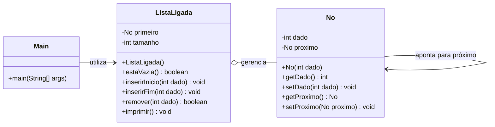
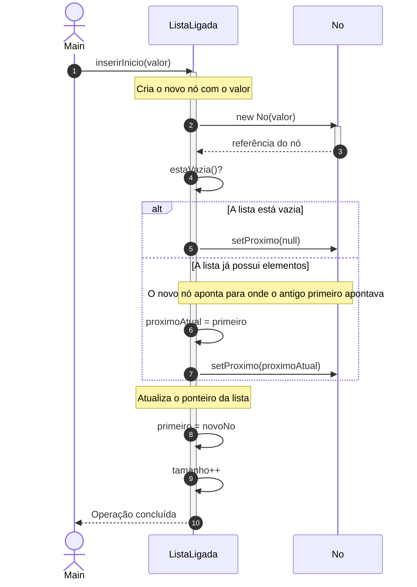
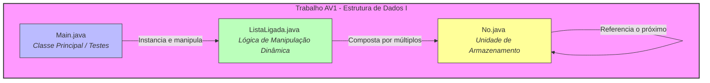

# [Prof. Wesley Soares] Estrutura de Dados I - Modelagem e Arquitetura

Com base nas diretrizes da disciplina de **Estrutura de Dados I** (4º Semestre) e nos requisitos específicos do **Trabalho AV1** (que exige a implementação das classes `Main`, `No` e `ListaLigada`), apresentamos a seguir a modelagem completa em diagramas **Mermaid**.

---

## 1. Diagrama de Classes UML (Domínio da Matéria)

Este diagrama modela a estrutura orientada a objetos fundamental para listas encadeadas dinâmicas (visto na Aula 05), contemplando os requisitos de envio do trabalho AV1.

### 💡 Explicação do Diagrama de Classes
* **`Main`**: Classe de ponto de entrada responsável por instanciar a estrutura e testar suas operações.
* **`No`**: Representa a unidade básica de armazenamento (nó), contendo a carga útil (`dado`) e uma referência (`proximo`) para o próximo elemento da cadeia.
* **`ListaLigada`**: Gerencia a sequência de nós através de um ponteiro de início (`primeiro`). Ela implementa os métodos de manipulação dinâmica dos dados exigidos na disciplina.

---

## 2. Diagrama de Sequência (Fluxo de Inserção em Lista Ligada)

O diagrama abaixo detalha o fluxo técnico de execução quando o sistema realiza a inserção de um novo elemento no início de uma lista ligada dinâmica.

### 💡 Explicação do Fluxo de Sequência
1. **Solicitação**: A classe `Main` invoca o método `inserirInicio(valor)` na instância de `ListaLigada`.
2. **Alocação Dinâmica**: A lista cria um novo objeto `No` alocando memória dinamicamente.
3. **Verificação de Estado**: Se a lista estiver vazia, o ponteiro de próximo do novo nó aponta para `null`. Caso contrário, ele assume a referência do antigo primeiro elemento.
4. **Atualização de Ponteiros**: O ponteiro principal da lista (`primeiro`) é atualizado para apontar para o novo nó recém-criado, concluindo a inserção em tempo $O(1)$.

---

## 3. Diagrama Arquitetural / Entidade-Relacionamento (Organização de Arquivos do Trabalho AV1)

Este diagrama arquitetural ilustra a estrutura de arquivos e dependências exigidas nas instruções de entrega do **Trabalho AV1**.

### 💡 Explicação da Arquitetura do Projeto
* **Divisão de Responsabilidades**: O projeto segue o padrão modular requisitado pelo Prof. Wesley Soares para o AV1.
* **`Main.java`** atua estritamente na interface de execução.
* **`ListaLigada.java`** concentra os algoritmos de complexidade e manipulação de ponteiros.
* **`No.java`** modela o encapsulamento do dado e do encadeamento de memória, garantindo o correto funcionamento das listas dinâmicas vistas na Aula 05.