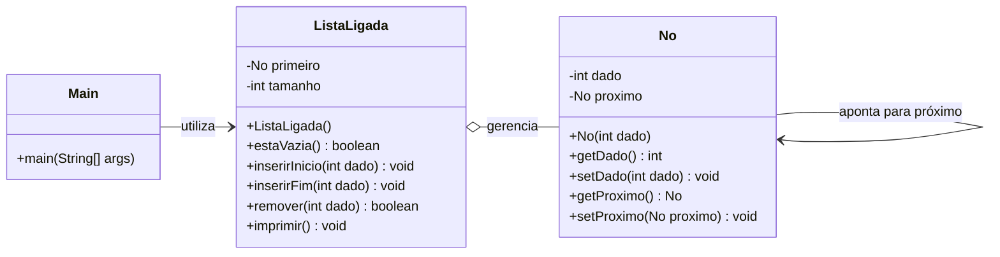
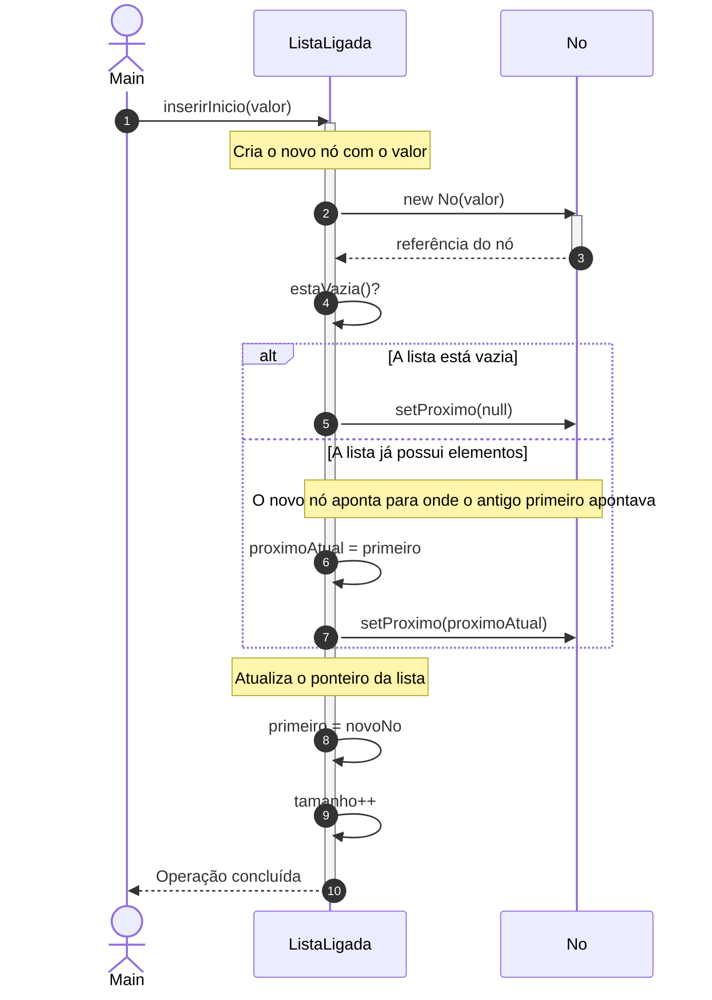
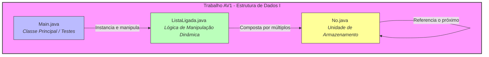

# 🤖 Material de Revisão com IA — Estrutura de Dados I

> **Matéria:** Estrutura de Dados I · **Professor:** Prof. Ms. Wesley Soares de Souza · **Semestre:** 4º Semestre
> Guia único e completo de revisão: resumo executivo, exercícios resolvidos em Java, simulado comentado, cheat sheet, diagramas de modelagem, slides de revisão, flashcards para Anki e dataset de perguntas e respostas.

---

## 🧭 Índice

- [📖 Resumo Executivo](#-resumo-executivo)
- [💻 Exercícios Práticos Implementados](#-exercícios-práticos-implementados)
- [📝 Simulado Comentado](#-simulado-comentado)
- [⚡ CheatSheet de Revisão Rápida](#-cheatsheet-de-revisão-rápida)
- [🗺️ Diagramas e Modelagem](#️-diagramas-e-modelagem)
- [🎞️ Apresentação de Revisão em Slides](#️-apresentação-de-revisão-em-slides)
- [🃏 Flashcards para Anki](#-flashcards-para-anki)
- [🤖 Dataset de Perguntas e Respostas (JSONL)](#-dataset-de-perguntas-e-respostas-jsonl)

---

## 📖 Resumo Executivo

### 1. Visão Geral e Objetivos da Matéria
A disciplina **Estrutura de Dados I** (4º Semestre), ministrada pelo Prof. Ms. Wesley Soares de Souza, fundamenta-se na premissa de que um software de alto desempenho depende tanto de uma lógica algorítmica apurada quanto da organização inteligente dos dados na memória. O curso aborda a transição conceitual do problema real até a solução implementada, cobrindo os fundamentos de projeto e análise de algoritmos, tipos abstratos de dados (TADs), gerenciamento de memória e o estudo aprofundado de estruturas lineares (listas sequenciais, listas ligadas, pilhas, filas e deques).

### 2. Conceitos-Chave e Terminologia Fundamental
* **Algoritmo:** Sequência finita, ordenada e precisa de passos para resolver um problema (possui entrada, executa passos, produz saída e é executável). Distingue-se de *programa*, que é a implementação computacional em uma linguagem específica.
* **Tipo Abstrato de Dados (TAD):** Modelo matemático que define *quais* dados existem, *quais* operações podem ser realizadas e *qual* é o comportamento esperado, sem expor *como* os dados são armazenados ou implementados (Princípio do Encapsulamento e Ocultação de Informação).
* **Tamanho da Entrada ($n$):** A quantidade de dados que o algoritmo precisa processar (ex.: número de elementos em um vetor ou registros a buscar).
* **Análise Assintótica e Notação Big O ($O$):** Metodologia para avaliar o crescimento do custo computacional (tempo ou espaço) à medida que o tamanho da entrada ($n$) tende ao infinito, desprezando constantes e termos de menor ordem.
* **Alocação Dinâmica, Stack e Heap:** Mecanismos de gerenciamento de memória onde variáveis locais e referências residem na *Stack* (Pilha), enquanto objetos, instâncias e arrays criados em tempo de execução via `new` residem na *Heap*.

### 3. Principais Módulos Abordados

**Módulo 1 — Introdução ao Projeto de Algoritmos e Refinamento Sucessivo**
* **Do Problema à Solução:** o ciclo engloba Compreensão → Modelagem → Algoritmo → Estrutura de Dados → Implementação.
* **Refinamento Sucessivo:** técnica de decomposição de problemas complexos em subproblemas menores através de níveis de abstração progressivos (do enunciado textual em alto nível até pseudocódigo executável).

**Módulo 2 — Análise de Algoritmos e Complexidade**
* Avaliação de desempenho independente de hardware, focando na contagem de operações e no comportamento de crescimento: **Melhor Caso** (mínima quantidade de operações), **Pior Caso** (máxima quantidade — foco principal da Notação Big O) e **Caso Médio** (comportamento esperado estatisticamente).
* Classes de complexidade comuns: $O(1)$ Constante (acesso direto por índice), $O(\log n)$ Logarítmica (ex.: Busca Binária), $O(n)$ Linear (ex.: Busca Sequencial), $O(n^2)$ Quadrática (laços aninhados, ex.: Bubble Sort e Selection Sort).

**Módulo 3 — Memória, Referências e Alocação Dinâmica**
* Diferenciação rigorosa entre **tipos primitivos** (armazenam valores diretamente) e **tipos por referência** (apontam para endereços de memória na *Heap*).
* Uso de referências (`null`, ponteiros lógicos em Java) para construir encadeamentos de nós (`No`), viabilizando estruturas dinâmicas.
* **Garbage Collector:** mecanismo automático de varredura que identifica e libera objetos na *Heap* que não possuem mais referências ativas na *Stack*.

**Módulo 4 — Estruturas Lineares: Listas Sequenciais**
* Organização de elementos em posições contíguas de memória (arrays).
* **Capacidade vs. Tamanho:** o *length* representa o limite máximo alocado no vetor, enquanto o atributo *tamanho* controla a quantidade real de elementos úteis preenchidos ($0 \le \text{tamanho} \le \text{capacidade}$).
* **Complexidade das Operações:** acesso por índice custa $O(1)$, mas inserções e remoções no início ou no meio exigem deslocamento de elementos, resultando em custo $O(n)$.

### 4. Relações com o Mercado e Prática Profissional
No desenvolvimento de software corporativo, a escolha incorreta de uma estrutura de dados ou de um algoritmo ineficiente (como substituir uma busca logarítmica ou estrutura indexada por uma varredura quadrática) pode inviabilizar sistemas de grande escala ao processar milhões de registros. O domínio de TADs, alocação de memória e análise de complexidade capacita o Engenheiro de Software a projetar arquiteturas resilientes, otimizar consumo de recursos computacionais em nuvem e escrever códigos escaláveis.

### 5. Dicas de Ouro para Estudo e Provas
1. **Domine a Notação Big O:** pratique a contagem de instruções em laços simples e aninhados. Em provas, saiba justificar matematicamente por que termos constantes e de menor grau são descartados.
2. **Diferencie Capacidade de Tamanho:** em listas sequenciais, valide sempre o limite do array antes de inserir dados e mantenha o controle estrito da variável `tamanho`.
3. **Desenhe a Memória (Stack vs. Heap):** ao estudar ponteiros, referências e listas ligadas, crie o hábito de desenhar blocos de memória e setas de referência para visualizar o comportamento de objetos e o impacto de atribuições como `p2 = p1` ou `n2 = null`.
4. **Compreenda o Propósito dos TADs:** o TAD define o *contrato* (o que faz), isolando a implementação (como faz) — cobrado conceitualmente em questões teóricas.
5. **Atenção aos Casos Limites (*Edge Cases*):** ao implementar operações em estruturas lineares, teste sempre os cenários extremos: lista vazia, lista cheia, inserção na primeira posição e inserção na última posição.

---

## 💻 Exercícios Práticos Implementados

Apostila prática com base nas aulas do Prof. Ms. Wesley Soares de Souza, traduzindo os fundamentos teóricos em códigos Java limpos, comentados e prontos para execução.

### Módulo 1: Fundamentos, Análise de Algoritmos e Complexidade

#### Exemplo Prático: Classes de Complexidade Big-O
```java
public class AnaliseComplexidade {

    // O(1) - Complexidade Constante
    // O tempo de execução não depende do tamanho do vetor.
    public static int obterPrimeiroElemento(int[] vetor) {
        if (vetor.length == 0) return -1;
        return vetor[0]; // Acesso direto por índice
    }

    // O(n) - Complexidade Linear
    // O número de operações cresce proporcionalmente a N.
    public static boolean pesquisaSequencial(int[] vetor, int valorProcurado) {
        for (int i = 0; i < vetor.length; i++) {
            if (vetor[i] == valorProcurado) {
                return true; // Encontrou
            }
        }
        return false;
    }

    // O(n²) - Complexidade Quadrática
    // Laços aninhados percorrem a entrada multiplicando as iterações.
    public static void imprimirMatrizDePares(int n) {
        for (int i = 1; i <= n; i++) {
            for (int j = 1; j <= n; j++) {
                System.out.println("Par: (" + i + ", " + j + ")");
            }
        }
    }

    public static void main(String[] args) {
        int[] dados = {10, 25, 31, 42, 58, 70, 81};

        System.out.println("--- Testando O(1) ---");
        System.out.println("Primeiro elemento: " + obterPrimeiroElemento(dados));

        System.out.println("\n--- Testando O(n) ---");
        System.out.println("O valor 42 está presente? " + pesquisaSequencial(dados, 42));

        System.out.println("\n--- Testando O(n²) para N = 3 ---");
        imprimirMatrizDePares(3);
    }
}
```

### Módulo 2: Memória, Alocação Dinâmica e Referências (Stack vs. Heap)

Em Estrutura de Dados, precisamos compreender como a memória RAM armazena variáveis primitivas (na **Stack**) e objetos/referências (na **Heap**). O operador `new` aloca dinamicamente espaço na Heap.

#### Exemplo Prático: Ponteiros e Encadeamento de Nós (`No`)
```java
// Definição da classe No para estruturas encadeadas
class No {
    int valor;
    No proximo;

    // Construtor
    public No(int valor) {
        this.valor = valor;
        this.proximo = null;
    }
}

public class TesteMemoriaHeap {
    public static void main(String[] args) {
        // Alocação dinâmica de nós na Heap
        No n1 = new No(10);
        No n2 = new No(20);
        No n3 = new No(30);

        // Encadeando os nós: n1 -> n2 -> n3 -> null
        n1.proximo = n2;
        n2.proximo = n3;

        // Percorrendo e imprimindo a estrutura encadeada
        No atual = n1;
        System.out.print("Estrutura Encadeada: ");
        while (atual != null) {
            System.out.print(atual.valor + " -> ");
            atual = atual.proximo;
        }
        System.out.println("NULL");

        // Demonstração de Coleta de Lixo (Garbage Collector)
        // Se desconectarmos n2: n2 = null, o objeto 20 ainda é acessível via n1.proximo
        n2 = null;
        System.out.println("Após n2 = null, n1.proximo.valor ainda é: " + n1.proximo.valor);
    }
}
```

### Módulo 3: Listas Lineares Sequenciais

Uma Lista Sequencial armazena elementos em posições contíguas de memória. Ela diferencia **Capacidade** (tamanho total do vetor físico) de **Tamanho Atual** (elementos efetivamente inseridos).

#### Exemplo Prático: Classe `ListaSequencial` Completa
```java
public class ListaSequencial {
    private int[] elementos;
    private int tamanho; // Quantidade de elementos armazenados atualmente
    private int capacidade; // Tamanho máximo do array

    // Construtor
    public ListaSequencial(int capacidade) {
        this.capacidade = capacidade;
        this.elementos = new int[this.capacidade];
        this.tamanho = 0;
    }

    // Sobrecarga de construtor padrão (capacidade 10)
    public ListaSequencial() {
        this(10);
    }

    // Retorna o tamanho atual da lista
    public int getTamanho() {
        return this.tamanho;
    }

    // Verifica se a lista está cheia
    public boolean estaCheia() {
        return this.tamanho == this.capacidade;
    }

    // Inserção no final da lista - O(1)
    public boolean adicionar(int valor) {
        if (estaCheia()) {
            System.out.println("Erro: Lista cheia!");
            return false;
        }
        this.elementos[this.tamanho] = valor;
        this.tamanho++;
        return true;
    }

    // Consulta por posição - O(1)
    public int obter(int posicao) {
        if (posicao < 0 || posicao >= this.tamanho) {
            throw new IndexOutOfBoundsException("Índice inválido para a lista.");
        }
        return this.elementos[posicao];
    }

    // Inserção no meio com deslocamento - O(n)
    public boolean inserirNaPosicao(int posicao, int valor) {
        if (estaCheia()) {
            System.out.println("Erro: Lista cheia!");
            return false;
        }
        if (posicao < 0 || posicao > this.tamanho) {
            System.out.println("Erro: Posição inválida!");
            return false;
        }

        // Deslocamento dos elementos para a direita
        for (int i = this.tamanho - 1; i >= posicao; i--) {
            this.elementos[i + 1] = this.elementos[i];
        }

        this.elementos[posicao] = valor;
        this.tamanho++;
        return true;
    }

    // Pesquisa sequencial - Pior caso: O(n)
    public int pesquisar(int valor) {
        for (int i = 0; i < this.tamanho; i++) {
            if (this.elementos[i] == valor) {
                return i; // Retorna o índice encontrado
            }
        }
        return -1; // Não encontrado
    }

    // Método para imprimir a lista
    public void imprimir() {
        System.out.print("[ ");
        for (int i = 0; i < this.tamanho; i++) {
            System.out.print(this.elementos[i] + " ");
        }
        System.out.println("] (Tamanho: " + this.tamanho + "/" + this.capacidade + ")");
    }

    // Método Principal para Testes
    public static void main(String[] args) {
        ListaSequencial lista = new ListaSequencial(5);

        lista.adicionar(10);
        lista.adicionar(20);
        lista.adicionar(30);

        System.out.println("Estado inicial da lista:");
        lista.imprimir();

        System.out.println("Inserindo o valor 25 na posição 1 (índice 1):");
        lista.inserirNaPosicao(1, 25);
        lista.imprimir();

        System.out.println("Elemento na posição 2: " + lista.obter(2));
    }
}
```

### 📝 Lista de Exercícios Práticos Resolvidos

**Exercício 1 — Custo Computacional de Laços Aninhados**
Determine a complexidade assintótica (Notação Big-O) do seguinte trecho de pseudocódigo apresentado em aula:
```text
para i = 1 até n
    para j = 1 até i
        escreva(i, j)
    fim
fim
```
*Solução:* o primeiro laço roda $N$ vezes; o segundo roda dependendo de $i$ (1, 2, 3, ..., $N$ vezes). O total de execuções é a soma da Progressão Aritmética: $1 + 2 + 3 + \dots + N = \frac{N(N + 1)}{2} = \frac{N^2 + N}{2}$. Descartando constantes e termos de menor ordem: **$O(N^2)$ (Complexidade Quadrática)**.

**Exercício 2 — Manipulação de Referências em Java**
Com base nos conceitos de alocação dinâmica da Aula 03, escreva um programa que crie três nós encadeados contendo os valores `10`, `20` e `30`, execute a remoção da referência intermediária e exiba o resultado no console.
```java
public class ExercicioReferencias {
    public static void main(String[] args) {
        No n1 = new No(10);
        No n2 = new No(20);
        No n3 = new No(30);

        n1.proximo = n2;
        n2.proximo = n3;

        // Pulando o nó central: n1 -> n3
        n1.proximo = n3;
        n2 = null; // n2 perde a referência principal da stack

        System.out.println("--- Após saltar o nó central ---");
        System.out.println("N1 aponta para o valor: " + n1.valor);
        System.out.println("O próximo de N1 aponta para o valor: " + n1.proximo.valor); // Deve ser 30
    }
}
```

**Exercício 3 — Busca de Elemento em Lista Sequencial**
Adicione à classe `ListaSequencial` um método `pesquisar(int valor)` que retorne o índice do elemento, ou `-1` caso não exista. *Análise:* no pior caso (elemento na última posição ou ausente), o algoritmo percorre todas as $N$ posições — complexidade **$O(N)$** (implementação já incluída na classe `ListaSequencial` acima).

---

## 📝 Simulado Comentado

Simulado completo contendo 10 questões de múltipla escolha (com gabarito comentado) e 5 questões discursivas/estudos de caso práticos, cobrindo Introdução, Algoritmos, Análise Assintótica (Big O), Memória (Stack/Heap), Alocação Dinâmica e Listas Lineares Sequenciais.

### Parte 1 — Múltipla Escolha

**Questão 1.** Sobre os conceitos de Algoritmo e Programa, assinale a alternativa correta:
a) Um algoritmo depende estritamente de uma linguagem de programação específica. b) Um programa é a solução conceitual e independente de plataforma, enquanto o algoritmo é a implementação compilada. **c) Um algoritmo é uma sequência finita e ordenada de passos para resolver um problema, sendo independente de linguagem, ao passo que o programa é a sua implementação executável.** d) Algoritmo e programa são sinônimos perfeitos. e) O algoritmo não precisa ser finito.
> **Gabarito: C** — o algoritmo é a lógica conceitual independente de linguagem; o programa é a implementação concreta compilada/interpretada.

**Questão 2.** O que define propriamente um Tipo Abstrato de Dados (TAD)? a) A linguagem de programação em que será codificada. **b) Quais dados existem e quais operações podem ser realizadas, ocultando como os dados são armazenados/implementados.** c) Quantos bytes de RAM vai consumir. d) Uso exclusivo de vetores estáticos. e) Obrigatoriedade de `malloc`/`new`.
> **Gabarito: B** — o TAD define o *que* a estrutura faz, ocultando o *como* (implementação interna).

**Questão 3.** Por que evitamos medir desempenho contando o tempo de execução em segundos? a) É imensurável por ferramentas modernas. **b) O tempo de execução depende de fatores externos e variáveis: processador, memória, SO, compilador e linguagem.** c) É sempre constante. d) A análise foca no consumo de energia. e) Só é válida para $O(2^n)$.
> **Gabarito: B** — a análise assintótica foca no comportamento de crescimento do número de operações, não em fatores de hardware.

**Questão 4.** Dada a função de custo $T(n) = 3n^2 + 5n + 10$, qual sua complexidade em Big O? a) $O(1)$ b) $O(n)$ c) $O(n \log n)$ **d) $O(n^2)$** e) $O(2^n)$
> **Gabarito: D** — descartamos constantes e termos de menor ordem ($5n$ e $10$), restando o termo dominante $n^2$.

**Questão 5.** `int x = vetor[5];` — independentemente do tamanho do vetor, qual a complexidade do acesso por índice? a) $O(n)$ b) $O(\log n)$ **c) $O(1)$** d) $O(n^2)$ e) $O(n \log n)$
> **Gabarito: C** — acesso direto a um vetor por índice fixo consome tempo constante.

**Questão 6.** Sobre a organização da memória em Java: I. A Stack armazena chamadas de métodos, variáveis locais e referências. II. O Heap armazena objetos e arrays criados com `new`. III. O Garbage Collector limpa automaticamente objetos sem referências ativas. a) Apenas I b) Apenas II c) Apenas I e II d) Apenas II e III **e) I, II e III**
> **Gabarito: E** — todas as afirmações estão corretas.

**Questão 7.** O que ocorre no Heap ao executar `p1 = null;`, sendo `p1` referência de um objeto existente? a) O objeto é apagado imediatamente. b) A referência aponta para o endereço zero. **c) O objeto perde sua associação com `p1`, tornando-se elegível para o Garbage Collector.** d) Lança `NullPointerException` imediatamente. e) A Stack é desalocada por completo.
> **Gabarito: C** — o objeto fica órfão e marcado para remoção futura pelo GC.

**Questão 8.** Em uma Lista Linear Sequencial (array), qual a complexidade no pior caso para inserir no início/meio, deslocando elementos subsequentes? a) $O(1)$ b) $O(\log n)$ **c) $O(n)$** d) $O(n^2)$ e) $O(n!)$
> **Gabarito: C** — exige deslocamento físico de todos os elementos subsequentes, custo linear.

**Questão 9.** Diferença entre `tamanho` (elementos armazenados) e `capacidade` (tamanho do array)? a) Não há diferença. **b) Capacidade é o total de posições disponíveis; tamanho é a quantidade atual de elementos válidos ($0 \le \text{tamanho} \le \text{capacidade}$).** c) Tamanho é limite físico do hardware. d) Tamanho é sempre fixo em 10. e) Capacidade controlada pelo programador, tamanho pelo GC.
> **Gabarito: B**.

**Questão 10.** Qual estrutura segue o princípio LIFO (*Last In, First Out*)? a) Fila (*Queue*) **b) Pilha (*Stack*)** c) Lista Sequencial d) Grafo e) Árvore Binária de Busca
> **Gabarito: B** — a Pilha opera sob LIFO.

### Parte 2 — Discursivas e Estudos de Caso

**Questão 11 (Refinamento de Algoritmo).** Descreva os passos (Nível 1 a 3) para um algoritmo que controla uma fila de atendimento bancário: quais dados armazenar, como uma pessoa entra/sai da fila, quem é atendido primeiro.
> **Resposta esperada:** dados = nome/ID + horário de chegada; entra no fim (enqueue) e sai do início (dequeue); atendido primeiro = quem entrou primeiro (FIFO). No refinamento sucessivo, parte-se da abstração do problema para subproblemas menores (estruturar dados, métodos de inserir/remover/verificar vazio).

**Questão 12 (Análise de Complexidade).** Complexidade do pseudocódigo com dois laços `1 até n` aninhados, e o que ocorreria se o segundo rodasse só até $n/2$?
> **Resposta esperada:** $O(n^2)$ — o primeiro laço roda $n$ vezes, o segundo mais $n$ vezes por volta ($n \times n$). Se o segundo rodasse até $n/2$: custo $n \times (n/2) = n^2/2$; descartando a constante $1/2$, a complexidade final continua **$O(n^2)$**.

**Questão 13 (Stack vs. Heap).** Para `Pessoa p1 = new Pessoa("Ana"); Pessoa p2 = p1; p2.setNome("Carlos");`, o que ocorre na Stack e na Heap? Qual a saída de `p1.getNome()`?
> **Resposta esperada:** Stack contém as referências `p1`/`p2`; Heap contém o objeto único `new Pessoa("Ana")`. Como `p2 = p1`, ambas apontam para o mesmo objeto — ao alterar via `p2`, `p1.getNome()` retorna **"Carlos"**.

**Questão 14 (Nós e Alocação Dinâmica).** Declare a classe `No` (atributo `valor`, referência `proximo`, construtor) e encadeie três nós `10 -> 20 -> 30 -> null`.
> **Resposta esperada:**
> ```java
> class No {
>     int valor;
>     No proximo;
>     public No(int valor) {
>         this.valor = valor;
>         this.proximo = null;
>     }
> }
> // Instanciação e encadeamento:
> No n1 = new No(10);
> No n2 = new No(20);
> No n3 = new No(30);
> n1.proximo = n2;
> n2.proximo = n3;
> ```

**Questão 15 (Capacidade vs. Tamanho).** Com `capacidade = 10`, `tamanho = 3`, `elementos = {10,20,30,0,0,0,0,0,0,0}`, o que `lista.obter(15)` deve retornar/disparar? Qual a regra de validação de limites?
> **Resposta esperada:** o índice `15` está fora do intervalo válido — deve lançar `IndexOutOfBoundsException` (ou erro controlado). Regra: `0 <= indice && indice < tamanho`.

---

## ⚡ CheatSheet de Revisão Rápida

**1. Fundamentos e Algoritmos**
- **Algoritmo:** sequência finita, ordenada e precisa de passos (diferente do *programa*, que é a implementação em código).
- **Refinamento Sucessivo:** técnica de projeto que vai da abstração até os detalhes implementáveis.
- **TAD:** define *o que* a estrutura faz (operações/comportamento), sem expor *como* é implementada — abstração + encapsulamento.

**2. Análise Assintótica e Notação Big O**

| Complexidade | Nome | Exemplo / Comportamento |
| :--- | :--- | :--- |
| $O(1)$ | Constante | Acessar um vetor por índice (`vetor[5]`) |
| $O(\log n)$ | Logarítmica | Busca Binária (reduz o problema à metade a cada passo) |
| $O(n)$ | Linear | Pesquisa sequencial / percorrer um vetor simples |
| $O(n \log n)$ | Linear-logarítmica | Algoritmos eficientes de ordenação (*Merge Sort*) |
| $O(n^2)$ | Quadrática | Laços aninhados (*Bubble Sort*, *Selection Sort*) |
| $O(2^n)$ | Exponencial | Recursões ingênuas (fibonacci sem memoization) |

Casos de análise: **Melhor caso** (mínimo de operações), **Pior caso** ($O$ — teto máximo) e **Caso médio** (comportamento esperado).

**3. Memória, Stack vs. Heap e Alocação Dinâmica**
- **Stack:** variáveis locais, chamadas de métodos e **referências**.
- **Heap:** **objetos** e arrays criados dinamicamente via `new`.
- Referência apontando para `null` gera `NullPointerException` ao tentar acessar membros.
- **Garbage Collector:** limpa da Heap objetos sem referências ativas.

**4. Estruturas Lineares: Listas Sequenciais (Arrays)**
- Elementos em posições físicas **consecutivas** de um array.
- `Capacidade` = tamanho total alocado (`length`); `Tamanho` = elementos realmente armazenados ($0 \le \text{tamanho} \le \text{capacidade}$).

| Operação | Complexidade | Motivo |
| :--- | :--- | :--- |
| Acessar por índice (`obter(i)`) | $O(1)$ | Endereçamento direto por posição |
| Pesquisar valor (`pesquisar(val)`) | $O(n)$ | Pior caso exige varredura completa |
| Inserir no final | $O(1)$ *(se houver espaço)* | Acesso direto ao fim |
| Inserir/Remover no início ou meio | $O(n)$ | Exige deslocamento de elementos |

---

## 🗺️ Diagramas e Modelagem

Modelagem completa baseada nos requisitos do **Trabalho AV1** (implementação das classes `Main`, `No` e `ListaLigada`), vista na Aula 05 (listas encadeadas dinâmicas).

### Diagrama de Classes UML (Domínio da Matéria)



* **`Main`**: classe de ponto de entrada responsável por instanciar a estrutura e testar suas operações.
* **`No`**: unidade básica de armazenamento, contendo a carga útil (`dado`) e uma referência (`proximo`) para o próximo elemento da cadeia.
* **`ListaLigada`**: gerencia a sequência de nós através de um ponteiro de início (`primeiro`), implementando os métodos de manipulação dinâmica exigidos na disciplina.

### Diagrama de Sequência (Fluxo de Inserção em Lista Ligada)



1. **Solicitação:** `Main` invoca `inserirInicio(valor)` na instância de `ListaLigada`.
2. **Alocação Dinâmica:** a lista cria um novo objeto `No`, alocando memória dinamicamente.
3. **Verificação de Estado:** se vazia, o novo nó aponta para `null`; caso contrário, assume a referência do antigo primeiro elemento.
4. **Atualização de Ponteiros:** o ponteiro `primeiro` passa a apontar para o novo nó, concluindo a inserção em tempo $O(1)$.

### Diagrama Arquitetural (Organização de Arquivos do Trabalho AV1)



* **Divisão de Responsabilidades:** o projeto segue o padrão modular requisitado pelo Prof. Wesley Soares para o AV1.
* **`Main.java`** atua estritamente na interface de execução.
* **`ListaLigada.java`** concentra os algoritmos de complexidade e manipulação de ponteiros.
* **`No.java`** modela o encapsulamento do dado e do encadeamento de memória.

---

## 🎞️ Apresentação de Revisão em Slides

**[`Slides-Revisao-[Prof. Wesley Soares] Estrutura de Dados I.pptx`](./Slides-Revisao-%5BProf.%20Wesley%20Soares%5D%20Estrutura%20de%20Dados%20I.pptx)**

Deck de 5 slides em dark mode (Slate/Navy/Teal/Indigo), 16:9 widescreen, cobrindo Visão Geral da Disciplina, Conceitos Fundamentais, Exercícios & Prática e Dicas de Prova — pronto para revisão rápida antes da avaliação.

---

## 🃏 Flashcards para Anki

**[`flashcards-anki.tsv`](./flashcards-anki.tsv)**

19 cartões no formato pergunta↔resposta (`.tsv`, separado por tabulação), cobrindo desde dados institucionais da disciplina (professor, fórmula de avaliação) até os conceitos técnicos de algoritmos, memória e listas sequenciais.

**Como importar:** no Anki, `Arquivo → Importar` → selecione o `.tsv` → mapeie a 1ª coluna para "Frente" e a 2ª para "Verso".

---

## 🤖 Dataset de Perguntas e Respostas (JSONL)

**[`dataset-estudo-qa.jsonl`](./dataset-estudo-qa.jsonl)**

14 pares de pergunta/resposta em formato [JSON Lines](https://jsonlines.org/), com metadados de tópico e dificuldade — pensado para consumo por ferramentas (fine-tuning, RAG, geração de quiz), não para leitura em prosa.

```json
{"id": 1, "topico": "Apresentação da Disciplina", "pergunta": "Quem é o professor responsável pela disciplina de Estrutura de Dados I?", "resposta": "O professor responsável pela disciplina de Estrutura de Dados I é o Prof. Wesley Soares.", "dificuldade": "facil"}
{"id": 3, "topico": "Aula 01", "pergunta": "Qual é a data de postagem referente ao conteúdo da aula 01 da disciplina de Estrutura de Dados I?", "resposta": "O conteúdo da aula 01 foi postado em 06/08/2026.", "dificuldade": "facil"}
{"id": 8, "topico": "Listas Dinâmicas", "pergunta": "Qual é o tema principal abordado nos links úteis da aula 05?", "resposta": "O tema abordado nos links úteis da aula 05 refere-se a listas ligadas dinâmicas.", "dificuldade": "medio"}
```
