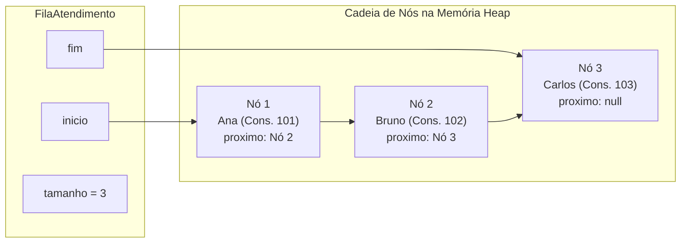
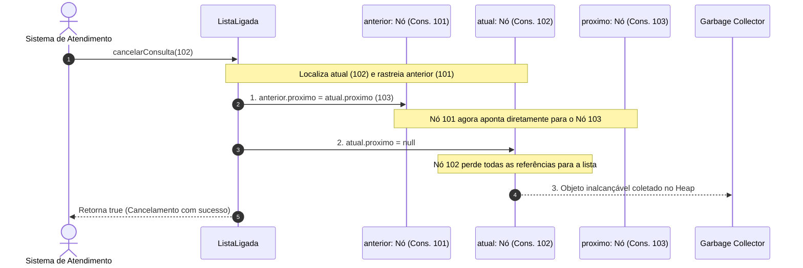
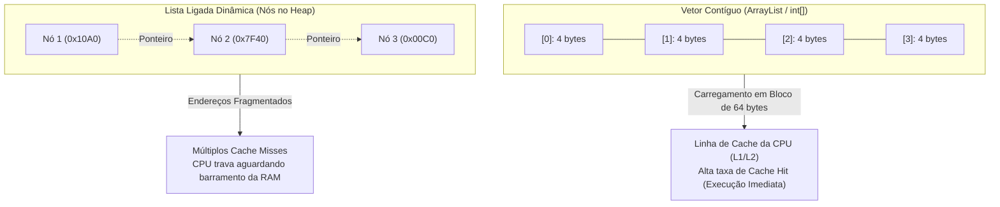

# Simulados Comentados - Estrutura de Dados I

> **Instituição:** Centro Universitário de Santa Fé do Sul (UniFEF)  
> **Curso:** Bacharelado em Sistemas de Informação (4º Semestre)  
> **Disciplina:** Estrutura de Dados I  
> **Docente:** Prof. Me. Wesley Soares de Souza  
> **Material de Referência:** Aulas 01 a 07, Trabalho de Complexidade de Algoritmos e Trabalho Prático AV1  

---

## Sumário

- [Apresentação e Orientações de Estudo](#apresentacao-e-orientacoes-de-estudo)
- [Simulado 1 - Questões Objetivas](#simulado-1---questoes-objetivas)
  - [Questão 01 - Fundamentos e Propriedades Formais de Algoritmos](#questao-01---fundamentos-e-propriedades-formais-de-algoritmos)
  - [Questão 02 - Tipos Abstratos de Dados e Encapsulamento](#questao-02---tipos-abstratos-de-dados-e-encapsulamento)
  - [Questão 03 - Metodologia de Análise Assintótica versus Medição Empírica](#questao-03---metodologia-de-analise-assintotica-versus-medicao-empirica)
  - [Questão 04 - Análise de Laços Dependentes e Progressão Aritmética](#questao-04---analise-de-lacos-dependentes-e-progressao-aritmetica)
  - [Questão 05 - Complexidade de Laços com Redução Logarítmica](#questao-05---complexidade-de-lacos-com-reducao-logaritmica)
  - [Questão 06 - Custo Estrutural de Listas Sequenciais e Shifting](#questao-06---custo-estrutural-de-listas-sequenciais-e-shifting)
  - [Questão 07 - Modelo de Memória da JVM: Stack, Heap e Referências](#questao-07---modelo-de-memoria-da-jvm-stack-heap-e-referencias)
  - [Questão 08 - Inserção Terminal em Listas Encadeadas e Ponteiro de Cauda](#questao-08---insercao-terminal-em-listas-encadeadas-e-ponteiro-de-cauda)
  - [Questão 09 - Encadeamento e Religamento Crítico de Referências](#questao-09---encadeamento-e-religamento-critico-de-referencias)
  - [Questão 10 - Matriz de Decisão Arquitetural: Vetor versus Lista Ligada](#questao-10---matriz-de-decisao-arquitetural-vetor-versus-lista-ligada)
  - [Questão 11 - Tipos Abstratos Restritos: Semântica e Disciplina da Pilha](#questao-11---tipos-abstratos-restritos-semantica-e-disciplina-da-pilha)
  - [Questão 12 - Pilha com Array Estático: Indexação Sentinela e Estados](#questao-12---pilha-com-array-estatico-indexacao-sentinela-e-estados)
- [Simulado 2 - Questões Discursivas](#simulado-2---questoes-discursivas)
  - [Questão 13 - Modelagem Conceitual e Implementação de TAD de Atendimento](#questao-13---modelagem-conceitual-e-implementacao-de-tad-de-atendimento)
  - [Questão 14 - Dedução Matemática Formal de Inserções em Memória Contígua](#questao-14---deducao-matematica-formal-de-insercoes-em-memoria-contigua)
  - [Questão 15 - Engenharia de Listas Ligadas: Algoritmo Robusto de Cancelamento](#questao-15---engenharia-de-listas-ligadas-algoritmo-robusto-de-cancelamento)
  - [Questão 16 - Pilha Estática, Invariantes do Topo e Vazamento de Memória](#questao-16---pilha-estatica-invariantes-do-topo-e-vazamento-de-memoria)
  - [Questão 17 - Decisão Arquitetural de Engenharia: Localidade de Cache e Sobrecarga](#questao-17---decisao-arquitetural-de-engenharia-localidade-de-cache-e-sobrecarga)
- [Gabarito Comentado](#gabarito-comentado)
  - [Gabarito do Simulado 1 (Objetivas)](#gabarito-do-simulado-1-objetivas)
  - [Gabarito do Simulado 2 (Discursivas)](#gabarito-do-simulado-2-discursivas)

---

## Apresentação e Orientações de Estudo

Este caderno de simulados foi estruturado para consolidar os conhecimentos teóricos, conceituais e práticos da disciplina de **Estrutura de Dados I**, ministrada no 4º semestre do curso de Bacharelado em Sistemas de Informação da UniFEF pelo Prof. Me. Wesley Soares de Souza.

O conteúdo aborda os tópicos fundamentais da computação estruturada e moderna:
1. Fundamentos de algoritmos, ciclo de resolução de problemas e características operacionais canônicas.
2. Refinamento sucessivo (*top-down*), Tipos Abstratos de Dados (TAD), abstração e encapsulamento de software.
3. Análise analítica de algoritmos, contagem de instruções elementares, ordens assintóticas de complexidade (Notação Big O e Notação Omega).
4. Gerenciamento e arquitetura de memória em tempo de execução: divisão estrutural entre Stack (Pilha) e Heap (Monte), referências de objetos, atuação do coletor de lixo (*Garbage Collector*) e localidade de referência em hardware.
5. Listas lineares sequenciais baseadas em arrays contíguos: cálculo de endereços, capacidade versus tamanho, gargalo do deslocamento de elementos (*shifting*) e custo de redimensionamento dinâmico.
6. Listas simplesmente encadeadas/ligadas dinâmicas: anatomia de nós, ponteiros de início (`head`) e fim (`tail`), inserção, busca, atualização e remoções com salvaguarda de invariantes.
7. Estruturas lineares restritas: o Tipo Abstrato de Dados Pilha (*Stack*), disciplina LIFO (*Last In, First Out*), controle de índices com sentinela `-1`, detecção de *Stack Overflow* e *Stack Underflow*, e exclusão lógica versus física.

Recomenda-se que o estudante resolva primeiro as questões sem consultar o gabarito, cronometrando o tempo de resolução e redigindo as soluções discursivas por completo antes de confrontar sua resposta com a rubrica avaliativa.

---

## Simulado 1 - Questões Objetivas

### Questão 01 - Fundamentos e Propriedades Formais de Algoritmos

Na ciência da computação clássica, a formulação do conceito de algoritmo transcende a mera sintaxe de linguagens de programação imperativas ou orientadas a objetos. Niklaus Wirth formalizou a relação simbiótica dos sistemas computacionais através da equação fundamental $\text{Algoritmos} + \text{Estruturas de Dados} = \text{Programas}$. Paralelamente, a literatura canônica estabelece seis propriedades essenciais para que uma sequência de passos seja legitimamente classificada como um algoritmo: entrada (*input*), sequência de passos, saída (*output*), finitude (*finiteness*), precisão/não ambiguidade (*definiteness*) e executabilidade/efetividade (*effectiveness*).

Considere um procedimento computacional projetado para processar registros financeiros que contenha a seguinte instrução em seu fluxo de controle:

```text
Passo 4: Enquanto o saldo da transação for divergente de zero, adicione gradualmente
         quantias monetárias proporcionais ao bom senso do operador até convergir.
```

Sob a ótica do rigor conceitual de algoritmos e das propriedades formais que regem a engenharia de software, assinale a alternativa que identifica a violação primária cometida pela instrução acima e sua implicação arquitetural.

- [A] Viola a propriedade da entrada (*input*), pois o procedimento exige dados financeiros sem antes declarar a tipagem primitiva das variáveis no sistema operacional hospedeiro.
- [B] Viola as propriedades de precisão (*definiteness*) e de executabilidade (*effectiveness*), uma vez que "adicionar quantias segundo o bom senso" introduz subjetividade não determinística e passos mecanicamente inexequíveis por um agente computacional.
- [C] Viola a propriedade da finitude (*finiteness*), exclusivamente porque qualquer laço que utilize a palavra-chave "Enquanto" diverge para loops infinitos, impossibilitando a compilação por compiladores modernos.
- [D] Viola a equação de Wirth, pois demonstra que estruturas de dados existem de forma independente e superior aos algoritmos, invalidando o uso de variáveis escalares na memória Heap.
- [E] Não apresenta violação formal, uma vez que a precisão de um algoritmo aceita termos semânticos abertos na fase de modelagem conceitual, sendo convertida em código determinístico pelo interpretador.

---

### Questão 02 - Tipos Abstratos de Dados e Encapsulamento

No desenvolvimento de sistemas orientados a alta escalabilidade, o isolamento modular é obtido através do uso de Tipos Abstratos de Dados (TAD). Um TAD especifica formalmente o conjunto de dados, as operações disponíveis sobre esses dados e o comportamento público da estrutura, sem divulgar ou amarrar sua definição à representação física na memória do computador ou aos algoritmos internos de manipulação.

Considere a modelagem de um TAD Ponto no plano cartesiano bidimensional e analise as seguintes asserções e a relação proposta entre elas:

I. Uma aplicação consumidora de um TAD Ponto deve invocar funções públicas como `criar(x, y)`, `obterX(p)` e `distancia(p1, p2)`, sendo terminantemente impedida de acessar campos internos como `p->x` ou `p.coordenadas[0]` diretamente.

**PORQUE**

II. O princípio do encapsulamento associado ao TAD estabelece que a interface pública responde "O QUE" a estrutura realiza, enquanto a implementação interna responde "COMO" a estrutura é armazenada, permitindo que a representação subjacente seja alterada de coordenadas cartesianas para coordenadas polares sem quebrar o código cliente.

A respeito dessas asserções, assinale a opção correta:

- [A] As asserções I e II são proposições verdadeiras, e a II é uma justificativa correta da I.
- [B] As asserções I e II são proposições verdadeiras, mas a II não é uma justificativa correta da I.
- [C] A asserção I é uma proposição verdadeira, e a II é uma proposição falsa.
- [D] A asserção I é uma proposição falsa, e a II é uma proposição verdadeira.
- [E] As asserções I e II são proposições falsas.

---

### Questão 03 - Metodologia de Análise Assintótica versus Medição Empírica

Durante uma sessão de revisão técnica de código em uma empresa de software, dois engenheiros apresentam soluções distintas para localizar chaves em um conjunto com $n$ registros ordenados. O Engenheiro A defende a Busca Sequencial, argumentando que ao rodar o algoritmo em sua estação de trabalho com um processador de última geração e 32 GB de memória RAM, a rotina gastou apenas 2 milissegundos para $n = 100.000$. O Engenheiro B defende a Busca Binária com base na análise matemática formal de contagem de instruções primitivas e notação assintótica Big O.

Considerando os fundamentos da análise assintótica de algoritmos ensinados na disciplina de Estrutura de Dados I, assinale a afirmativa tecnicamente correta que justifica por que a ciência da computação rejeita o tempo de relógio (*wall-clock time*) como métrica definitiva de comparação entre algoritmos.

- [A] A medição empírica de relógio é falha porque o compilador JIT (*Just-In-Time*) do Java converte algoritmos de complexidade quadrática em tempo constante de forma automática quando a máquina possui mais de 16 GB de memória física.
- [B] O tempo de relógio depende de variáveis externas não controladas, como clock do processador, arquitetura do barramento, carga de processos concorrentes no sistema operacional e latência da hierarquia de cache, enquanto a análise assintótica mede a taxa intrínseca de crescimento das operações em função de $n \to \infty$.
- [C] A análise de relógio é inadequada unicamente porque a unidade de milissegundos é matematicamente contínua, enquanto os computadores processam estados discretos, invalidando o uso de cronômetros em testes unitários.
- [D] A Busca Sequencial possui tempo de pior caso $O(\log n)$ e a Busca Binária possui tempo de pior caso $O(n)$, o que torna o resultado empírico do Engenheiro A matematicamente impossível e indicativo de fraude no benchmark.
- [E] A notação Big O restringe-se exclusivamente à análise de memória física consumida na pilha de execução (Stack), não possuindo correlação formal com a contagem de instruções de processamento da CPU.

---

### Questão 04 - Análise de Laços Dependentes e Progressão Aritmética

Considere o seguinte método implementado em linguagem Java, extraído da bateria de estudos analíticos da disciplina:

```java
public static int contarIguais(int[] valores) {
    int contador = 0;

    for (int i = 0; i < valores.length; i++) {
        for (int j = i + 1; j < valores.length; j++) {
            if (valores[i] == valores[j]) {
                contador++;
            }
        }
    }

    return contador;
}
```

Seja $n = \text{valores.length}$ o tamanho da entrada. Um estudante avaliou o código e afirmou: *"Como o laço interno não começa em zero e executa cada vez menos passos conforme o índice $i$ avança, o algoritmo executa metade das operações de um laço duplo tradicional, devendo ser formalmente classificado como $O(n)$"*.

Com base na dedução matemática formal da quantidade de comparações e nas regras de simplificação assintótica, a afirmação do estudante é:

- [A] Correta, pois a soma de repetições decrescentes anula o expoente quadrático da variável $n$, convergindo para uma progressão geométrica de ordem linear.
- [B] Incorreta, pois o laço interno executa uma divisão binária do vetor a cada passo, resultando em uma complexidade assintótica estrita de $O(n \log n)$.
- [C] Incorreta, pois a quantidade de comparações é expressa pela soma de uma Progressão Aritmética: $\sum_{k=1}^{n-1} k = \frac{n(n-1)}{2} = \frac{1}{2}n^2 - \frac{1}{2}n$, que pertence estritamente à classe $O(n^2)$ após o descarte de constantes multiplicativas e termos de menor ordem.
- [D] Correta no melhor caso, pois se o vetor não contiver elementos duplicados, o laço interno é imediatamente abortado pelo coletor de lixo, operando em tempo $O(1)$.
- [E] Incorreta, pois a presença da estrutura condicional `if (valores[i] == valores[j])` dentro do aninhamento eleva o custo computacional para a classe exponencial $O(2^n)$.

---

### Questão 05 - Complexidade de Laços com Redução Logarítmica

No estudo de algoritmos numéricos e controle de fluxo, a taxa de variação da variável de controle do laço determina sua curva assintótica de tempo. Observe atentamente a rotina abaixo:

```java
public static void reduzir(int n) {
    while (n > 1) {
        n = n / 2;
    }
}
```

Assuma que $n$ é um número inteiro positivo fornecido como parâmetro de entrada. A classe de complexidade assintótica no pior caso que descreve o comportamento temporal dessa rotina e a sua fundamentação matemática correspondem a:

- [A] $O(n)$, pois o laço executa uma operação aritmética simples de divisão para cada unidade inteira contida no valor inicial de $n$.
- [B] $O(1)$, pois independentemente do valor de $n$, a variável é reduzida até o número 1, o que caracteriza um processamento com término constante no registrador da CPU.
- [C] $O(n^2)$, pois a operação de divisão sucessiva exige conversões de ponto flutuante em nível de microcódigo de máquina, dobrando o custo por iteração.
- [D] $O(\log n)$, pois o tamanho do problema é dividido sistematicamente por 2 a cada iteração, exigindo $k$ passos tais que $2^k \ge n \implies k = \lceil \log_2 n \rceil$.
- [E] $O(n \log n)$, pois o algoritmo combina uma estrutura linear de repetição com uma decomposição polinomial de base 2.

---

### Questão 06 - Custo Estrutural de Listas Sequenciais e Shifting

Listas lineares sequenciais implementadas sobre arrays nativos contíguos em memória física garantem tempo constante $O(1)$ para acesso posicional aleatório via cálculo direto de endereço base:

$$\text{Endereço}(i) = \text{EndereçoBase} + (i \times \text{TamanhoElemento})$$

Entretanto, ao projetar operações de inserção e remoção no início ou no meio dessa estrutura, manifesta-se o fenômeno conhecido na literatura como deslocamento de memória (*shifting*).

Considere um vetor com capacidade física para 100 inteiros contendo atualmente $n = 50$ elementos ativos preenchidos da posição `0` até a posição `49`. Se uma rotina solicitar a inserção de uma nova chave no índice `0` (início da lista), o número exato de cópias/deslocamentos de memória requeridos e a complexidade dessa operação no pior caso são, respectivamente:

- [A] Exatamente 1 deslocamento, operando em complexidade de tempo $O(1)$.
- [B] Exatamente 49 deslocamentos, operando em complexidade de tempo $O(\log n)$.
- [C] Exatamente 50 deslocamentos de elementos em direção ao final do array, operando em complexidade temporal de pior caso $O(n)$.
- [D] Exatamente 100 deslocamentos, pois a capacidade total do array deve ser integralmente limpa antes de admitir novos dados, operando em $O(n^2)$.
- [E] Nenhum deslocamento, pois a linguagem Java realiza troca atômica de ponteiros de índice físico sem alterar o conteúdo da memória contígua.

---

### Questão 07 - Modelo de Memória da JVM: Stack, Heap e Referências

O modelo de gerenciamento de memória em tempo de execução da Máquina Virtual Java (JVM) estabelece papéis estruturalmente distintos para os segmentos denominados Stack (Pilha de Execução) e Heap (Monte Dinâmico).

Observe o seguinte trecho de código Java que manipula instâncias da classe `No`:

```java
No p1 = new No(10);
No p2 = new No(20);
p1.proximo = p2;
No p3 = p1;
p3.valor = 99;
p1 = null;
```

Após a execução completa de todas as linhas de comando acima, a configuração correta das variáveis na memória Stack, das instâncias no Heap e da atuação do *Garbage Collector* (GC) é:

- [A] As instâncias `No(10)` e `No(20)` foram destruídas imediatamente pelo GC no momento em que `p1 = null` foi executado, pois referências nulas provocam desalocação em cascata.
- [B] A variável `p3` na Stack mantém a referência de memória para o nó cujo valor foi alterado para `99`, e esse mesmo nó ainda referencia o objeto com valor `20` através do atributo `proximo`; portanto, nenhum objeto é coletado pelo GC.
- [C] A atribuição `No p3 = p1` duplicou o nó no Heap, criando uma cópia isolada com valor 10; logo, a mutação `p3.valor = 99` não alterou o valor apontado originalmente por `p1`.
- [D] A variável `p2` na Stack foi automaticamente movida para o Heap para permitir a atribuição `p1.proximo = p2`, convertendo o tipo do dado primitivo de 32 bits em 64 bits.
- [E] Ocorreu uma exceção do tipo `NullPointerException` na linha `p3.valor = 99`, uma vez que `p1` já havia sido limpo pelo ciclo de execução da JVM.

---

### Questão 08 - Inserção Terminal em Listas Encadeadas e Ponteiro de Cauda

Em uma lista simplesmente ligada de nós dinâmicos, a inclusão de novos elementos pode ser arquitetada com ou sem a manutenção de um ponteiro explícito para a cauda (`fim` ou `tail`).

Analise o comportamento do método `adicionarFim` implementado em uma classe `ListaLigada`:

```java
public void adicionarFim(int valor) {
    No novo = new No(valor);
    if (this.inicio == null) {
        this.inicio = novo;
        this.fim = novo;
    } else {
        this.fim.proximo = novo;
        this.fim = novo;
    }
    this.tamanho++;
}
```

Caso o arquiteto de software optasse por eliminar o atributo `private No fim;` da classe controladora para economizar os bytes de uma referência na memória, o método de inserção no final passaria a apresentar:

- [A] A mesma complexidade de tempo $O(1)$, pois a JVM armazena ponteiros implícitos de fim para todas as classes dinâmicas.
- [B] Degradação de desempenho de tempo constante $O(1)$ para tempo linear $O(n)$, visto que o algoritmo precisaria percorrer sequencialmente todos os nós a partir de `inicio` até encontrar o elemento cujo `proximo == null`.
- [C] Redução do consumo de tempo para $O(\log n)$, uma vez que a ausência do ponteiro `fim` viabiliza saltos binários sobre as referências da lista ligada.
- [D] Falha crítica de execução (*Stack Overflow*), pois listas dinâmicas encadeadas são estruturalmente incapazes de inserir dados na cauda sem um ponteiro físico permanente.
- [E] Comportamento idêntico ao de uma Pilha pura, invertendo a ordem dos elementos e forçando a estrutura a adotar disciplina LIFO (*Last In, First Out*).

---

### Questão 09 - Encadeamento e Religamento Crítico de Referências

Considere uma lista simplesmente ligada com nós contendo valores inteiros ordenados de forma crescente:

$$\text{inicio} \to [10] \to [20] \to [30] \to [40] \to \text{null}$$

Um desenvolvedor deseja inserir ordenadamente o valor `25` entre os nós `[20]` e `[30]`. Durante o percurso, o ponteiro auxiliar `atual` foi posicionado exatamente sobre o nó de valor `20`. Um novo nó foi criado: `No novo = new No(25);`.

Avalie os dois seguintes blocos de código propostos para efetuar o religamento da estrutura:

```java
// Proposta Alpha
novo.proximo = atual.proximo;
atual.proximo = novo;

// Proposta Beta
atual.proximo = novo;
novo.proximo = atual.proximo;
```

A análise lógica e estrutural dos dois blocos demonstra que:

- [A] Ambas as propostas funcionam perfeitamente, pois a ordem de atribuição de variáveis de referência é comutativa na linguagem Java.
- [B] A Proposta Alpha conecta a lista corretamente mantendo a integridade da cadeia, enquanto a Proposta Beta gera um ciclo autorreferenciado infinito (`novo.proximo` passa a apontar para o próprio `novo`) e perde irremediavelmente o acesso aos nós subsequentes `[30]` e `[40]`.
- [C] A Proposta Beta é superior porque atualiza o encadeamento a partir da cabeça da lista antes de alocar a memória na Stack.
- [D] A Proposta Alpha dispara uma exceção `NullPointerException`, pois não se pode ler `atual.proximo` antes de atribuir o endereço do nó `novo`.
- [E] Ambas as propostas corrompem a lista, sendo estritamente obrigatório desinstanciar o nó `[20]` e reinseri-lo a partir do nó `inicio`.

---

### Questão 10 - Matriz de Decisão Arquitetural: Vetor versus Lista Ligada

A seleção da estrutura de dados ideal para compor a espinha dorsal de um sistema computacional depende da identificação dos padrões de acesso, volume e mutação de dados requeridos pelo domínio de negócio.

Analise os seguintes cenários operacionais de engenharia de software:

- **Cenário 1:** Um módulo de telemetria e renderização gráfica de alta performance precisa consultar e atualizar posições de partículas no espaço tridimensional milhões de vezes por segundo através de índices matemáticos arbitrários (`obter(i)`), raramente inserindo ou removendo partículas após a inicialização.
- **Cenário 2:** Um sistema de triagem de mensagens de rede onde pacotes chegam e são despachados continuamente no início e no final da estrutura, com frequentes inclusões e exclusões de nós no meio da coleção sob fluxo constante, sem necessidade de consultas diretas por índice numérico.

Com base nas características de complexidade de tempo, consumo de memória e comportamento físico de hardware (localidade de cache), a recomendação técnica correta para os Cenários 1 e 2 é, respectivamente:

- [A] Cenário 1: Lista Ligada Dinâmica; Cenário 2: Lista Sequencial (Array).
- [B] Cenário 1: Pilha Estática; Cenário 2: Lista Sequencial (Array).
- [C] Cenário 1: Lista Sequencial (Array); Cenário 2: Lista Ligada Dinâmica.
- [D] Cenário 1: Fila Estática; Cenário 2: Pilha Dinâmica.
- [E] Ambos os cenários devem utilizar estritamente Listas Sequenciais, pois listas ligadas foram descontinuadas na arquitetura de computadores modernos.

---

### Questão 11 - Tipos Abstratos Restritos: Semântica e Disciplina da Pilha

A Pilha (*Stack*) é formalmente classificada como uma estrutura de dados linear de **acesso restrito**, regida pelo princípio **LIFO** (*Last In, First Out*). Todas as operações de mutação e consulta (`push`, `pop`, `peek`) ocorrem obrigatoriamente em uma única extremidade denominada **Topo** (*top*).

Um programador júnior sugeriu alterar a classe `Pilha` do sistema bancário para adicionar o seguinte método:

```java
public int obterElementoIntermediario(int indice) {
    return this.elementos[indice];
}
```

Sob os princípios da teoria de Tipos Abstratos de Dados e da integridade de engenharia de software, a inclusão desse método:

- [A] É recomendada, pois moderniza o conceito de pilha e eleva seu poder computacional para o nível de uma tabela hash sem violar o princípio LIFO.
- [B] É inócua, pois em linguagens orientadas a objetos qualquer classe com array interno já permite acesso indexado nativo sem necessidade de compilação.
- [C] Quebra a abstração e viola as invariantes fundamentais do TAD Pilha, destruindo a garantia de encapsulamento restritivo e permitindo que módulos externos processem estados fora de ordem, o que compromete rotinas como o controle transacional (*rollback*) e avaliadores sintáticos.
- [D] Deve ser aplicada apenas se a operação `pop()` for reconfigurada para remover da base da pilha em tempo linear $O(n)$.
- [E] Impede a atuação do coletor de lixo da JVM, provocando vazamento generalizado de memória física no disco rígido.

---

### Questão 12 - Pilha com Array Estático: Indexação Sentinela e Estados

Em uma implementação clássica de Pilha baseada em array estático de inteiros com capacidade $C = 5$, o ponteiro que rastreia a posição ativa é uma variável escalar inteira denominada `topo`.

A representação canônica adota a convenção de indexação baseada em zero:
- Quando a pilha contém 1 elemento, `topo = 0`.
- Quando a pilha está totalmente vazia, `topo = -1`.

Considere que sobre uma pilha inicialmente vazia ($C = 5$) foram executadas as seguintes chamadas sequenciais de métodos:

```java
pilha.push(10);
pilha.push(20);
pilha.push(30);
int a = pilha.pop();
pilha.push(40);
int b = pilha.peek();
```

Ao término dessas operações, o valor retornado na variável `b`, o valor corrente da variável de controle `topo` e o estado físico dos dados no array subjacente são, respectivamente:

- [A] `b = 40`; `topo = 2`; o array mantém os valores `[10, 20, 40]` nas posições 0, 1 e 2, enquanto a posição 3 mantém fisicamente o valor `30` residual (exclusão lógica).
- [B] `b = 30`; `topo = 3`; o array foi completamente reescrito para `[10, 20, 30, 40]`.
- [C] `b = 40`; `topo = 1`; a operação `pop()` zerou fisicamente todo o array por segurança da memória RAM.
- [D] `b = 20`; `topo = 0`; a invocação de `peek()` desempilhou o valor 40 automaticamente.
- [E] Ocorreu uma exceção de *Stack Overflow* durante a chamada `pilha.push(40)`, impedindo a leitura de `b`.

---

## Simulado 2 - Questões Discursivas

### Questão 13 - Modelagem Conceitual e Implementação de TAD de Atendimento

#### Contexto e Enunciado
Uma clínica médica especializada em exames laboratoriais necessita de um sistema informatizado para gerenciar a fila de espera de pacientes na recepção. O sistema deve ser concebido estritamente sob os conceitos de Tipos Abstratos de Dados (TAD) e estruturas lineares dinâmicas aprendidos na disciplina, sem fazer uso de classes utilitárias da *Java Collections Framework* (como `ArrayList` ou `LinkedList`).

Cada `Paciente` possui obrigatoriamente:
- `nome` (`String`)
- `idade` (`int`)
- `numeroConsulta` (`int`, identificador único)

O atendimento segue a disciplina FIFO (*First-In, First-Out*), admitindo também cancelamentos extemporâneos por desistência do paciente.

#### Tarefa Solicitada
1. Explique formalmente a separação entre a interface pública do TAD e sua realização em memória.
2. Apresente o código Java completo e compilável das classes `Paciente`, `No` e da classe controladora `FilaAtendimento` contendo:
   - Atributos privados fundamentais (`inicio`, `fim`, `tamanho`);
   - Método `enfileirar(Paciente p)`: inclusão no final em tempo constante $O(1)$;
   - Método `chamarProximo()`: remoção e retorno do primeiro paciente em tempo constante $O(1)$;
   - Método `estaVazia()`: verificação em tempo $O(1)$.
3. Desenhe um diagrama Mermaid estrutural representando o estado da cadeia de nós após a inserção sequencial de três pacientes: Ana (Cons. 101), Bruno (Cons. 102) e Carlos (Cons. 103).

---

### Questão 14 - Dedução Matemática Formal de Inserções em Memória Contígua

#### Contexto e Enunciado
Um engenheiro de software júnior propôs a utilização de uma lista linear sequencial baseada em vetor estático (`int[] elementos`) para gerenciar um histórico de eventos de auditoria. No projeto proposto, cada novo evento deve ser obrigatoriamente inserido na primeira posição física do arranjo (índice `0`), de modo que o evento mais recente esteja sempre imediatamente acessível no índice zero.

Considere que o vetor possui capacidade suficiente e que a lista contém atualmente $n$ elementos ocupando os índices de `0` até $n-1$.

#### Tarefa Solicitada
1. Descreva o algoritmo passo a passo necessário para viabilizar a inserção de um novo elemento no índice `0`, detalhando o sentido do deslocamento de memória (*shifting*) e explicando o que ocorreria se o sentido da varredura fosse invertido.
2. Deduza formalmente a quantidade total de operações de cópia de memória necessárias para inserir $m$ novos elementos consecutivamente na cabeça de uma lista que partiu inicialmente com $0$ elementos até atingir $m$ elementos, demonstrando matematicamente o somatório resultante e sua classificação final na Notação Big O.
3. Compare o custo assintótico dessa operação com a inserção no início em uma Lista Simplesmente Encadeada (`adicionarInicio`), justificando a diferença estrutural com base no modelo de alocação de memória na JVM.

---

### Questão 15 - Engenharia de Listas Ligadas: Algoritmo Robusto de Cancelamento

#### Contexto e Enunciado
Em listas encadeadas dinâmicas, operações de remoção no meio ou no fim da estrutura exigem tratamento rigoroso de ponteiros para evitar perda de encadeamento, vazamentos de memória e lançamento de exceções `NullPointerException`. 

No contexto do sistema clínico do Trabalho AV1, a operação `cancelarConsulta(int numeroConsulta)` deve localizar o nó correspondente à consulta informada e removê-lo da cadeia linear, mantendo os ponteiros `inicio`, `fim` e a variável `tamanho` rigorosamente íntegros.

#### Tarefa Solicitada
1. Apresente o código Java completo do método `public boolean cancelarConsulta(int numeroConsulta)`, tratando com precisão todos os seguintes casos de borda:
   - Lista inicialmente vazia;
   - Elemento a ser removido está na cabeça da lista (`inicio`);
   - Elemento a ser removido é o único elemento da lista (caso unitário onde `inicio == fim`);
   - Elemento a ser removido está no meio da lista;
   - Elemento a ser removido está na cauda da lista (`fim`);
   - Elemento pesquisado não existe na coleção.
2. Apresente um diagrama de sequência Mermaid ilustrando o processo de religamento de ponteiros e isolamento de um nó intermediário para coleta pelo *Garbage Collector*.
3. Classifique a complexidade assintótica de tempo da operação no melhor caso ($\Omega$) e no pior caso ($O$), justificando a resposta a partir do número de nós visitados.

---

### Questão 16 - Pilha Estática, Invariantes do Topo e Vazamento de Memória

#### Contexto e Enunciado
Durante a Aula 06, o Prof. Wesley Soares demonstrou a implementação do Tipo Abstrato de Dados Pilha utilizando um vetor primitivo estático (`int[] elementos`) controlado por um índice escalar denominado `topo`. A convenção pedagógica e industrial adota `topo = -1` para representar a ausência total de elementos úteis.

#### Tarefa Solicitada
1. Explique a fundamentação matemática da indexação baseada em zero que justifica o uso do valor `-1` para denotar pilha vazia.
2. Apresente a implementação Java dos métodos `push(int valor)` e `pop()`, demonstrando os testes de salvaguarda contra **Stack Overflow** e **Stack Underflow** com lançamento de exceções apropriadas.
3. Explique detalhadamente a diferença entre **exclusão lógica** e **exclusão física** na estrutura de pilha baseada em array.
4. *(Aprofundamento em Engenharia de Software):* Se em vez de um vetor de tipos primitivos (`int[]`) a pilha armazenasse objetos de negócio (`Object[]` ou `Paciente[]`), que problema de vazamento de referências (*memory leak* / retenção indevida de objetos no Heap) ocorreria caso o método `pop()` apenas decrementasse o índice com `topo--` sem atribuir `null` à posição desempilhada?

---

### Questão 17 - Decisão Arquitetural de Engenharia: Localidade de Cache e Sobrecarga

#### Contexto e Enunciado
Um arquiteto de software de um sistema de processamento de alto volume foi consultado por sua equipe técnica para decidir entre a utilização de uma Lista Linear Sequencial baseada em Array (`ArrayList`) e uma Lista Simplesmente Ligada (`LinkedList`). O time júnior sugeriu adotar a Lista Ligada para todos os módulos do sistema, alegando que "estruturas ligadas são dinâmicas e nunca gastam memória com vetores superdimensionados".

O arquiteto refutou a generalização, afirmando que a decisão depende de dois fatores fundamentais de hardware e arquitetura de computadores:
1. **Localidade espacial de referência e comportamento do Cache da CPU (L1/L2/L3)**;
2. **Sobrecarga de memória (*memory overhead*) por elemento armazenado**.

#### Tarefa Solicitada
1. Explique conceitualmente o princípio da localidade espacial de referência e explique por que a iteração sequencial sobre um vetor contíguo é fisicamente mais rápida para a CPU do que o percurso sobre nós encadeados dispersos na memória Heap.
2. Demonstre matematicamente a sobrecarga de memória calculando o consumo de bytes exigido para armazenar $1.000.000$ de números inteiros de 32 bits (`int`) em:
   - Um vetor primitivo contíguo `int[1.000.000]`;
   - Uma lista encadeada composta por $1.000.000$ de instâncias da classe `No` (considere arquitetura de 64 bits com ponteiro de referência consumindo 8 bytes e overhead de cabeçalho de objeto da JVM consumindo 16 bytes por instância de Nó).
3. Conclua com uma recomendação arquitetural clara indicando em qual cenário prático a Lista Ligada supera o Vetor Sequencial e em qual cenário ela jamais deve ser utilizada.

---

## Gabarito Comentado

### Gabarito do Simulado 1 (Objetivas)

---

#### Questão 01 - Fundamentos e Propriedades Formais de Algoritmos
- **Alternativa Correta:** **[B]**
- **Justificativa Técnica:** As seis propriedades essenciais de um algoritmo exigem rigor matemático absoluto. A **precisão** (*definiteness*) determina que cada instrução deve ser clara, determinística e unívoca, sem margem para subjetividade. A **executabilidade** (*effectiveness*) estabelece que cada operação deve ser realizável na prática por um agente mecânico em tempo finito. Instruções como "adicione quantias proporcionais ao bom senso do operador" falham categoricamente em ambas as propriedades, pois computadores não possuem discernimento subjetivo e não podem executar instruções desprovidas de formalização lógico-matemática.
- **Análise das Alternativas Distratoras:**
  - *A está errada:* A entrada (*input*) diz respeito aos dados brutos recebidos pelo algoritmo do domínio do problema, independentemente de tipagem física prévia em sistema operacional.
  - *C está errada:* O comando "Enquanto" é a base do controle de fluxo iterativo condicional e só gera laço infinito quando a condição de guarda não é alterada satisfatoriamente no corpo do loop.
  - *D está errada:* A equação de Niklaus Wirth ($\text{Algoritmos} + \text{Estruturas de Dados} = \text{Programas}$) coloca ambos os conceitos em simetria de importância; um não é superior ao outro.
  - *E está errada:* Nenhuma etapa de modelagem formal de algoritmos tolera subjetividade conceitual; pseudocódigos e diagramas exigem estrito determinismo causal.

---

#### Questão 02 - Tipos Abstratos de Dados e Encapsulamento
- **Alternativa Correta:** **[A]**
- **Justificativa Técnica:** Ambas as asserções são verdadeiras e a asserção II é a justificativa teórica direta da asserção I. O propósito primordial de um Tipo Abstrato de Dados (TAD) é estabelecer um contrato público formal (a interface) separando a especificação do comportamento da sua representação física na memória. O encapsulamento atua como barreira protetora: o código cliente manipula o ponto exclusivamente através de suas rotinas públicas autorizadas (`criar`, `obterX`, `distancia`). Caso a equipe decida refatorar a estrutura interna de coordenadas cartesianas $(x, y)$ para coordenadas polares $(r, \theta)$, nenhum sistema cliente é impactado, pois a interface pública não expõe os atributos privados.
- **Análise das Alternativas Distratoras:**
  - *B está errada:* A asserção II é exatamente a justificativa causal da asserção I, não podendo ser tratada como argumento desconectado.
  - *C, D e E estão erradas:* Ambas as afirmações são canônicas na teoria da programação orientada a objetos e tipos abstratos de dados.

---

#### Questão 03 - Metodologia de Análise Assintótica versus Medição Empírica
- **Alternativa Correta:** **[B]**
- **Justificativa Técnica:** A medição empírica de relógio depende de um ecossistema volátil e não reproduzível: capacidade de processamento da CPU, frequência instantânea da máquina, concorrência de processos em background, latência de barramento e alocação de memória cache. A análise analítica assintótica isola essas contingências externas, adotando uma abordagem puramente matemática: conta-se o número de operações fundamentais em função do tamanho da entrada $n$ e estuda-se o comportamento do algoritmo no limite em que $n \to \infty$.
- **Análise das Alternativas Distratoras:**
  - *A está errada:* O compilador JIT não é capaz de alterar a complexidade assintótica intrínseca de um algoritmo; laços quadráticos continuam exigindo operações quadráticas em tempo de execução.
  - *C está errada:* A incompatibilidade não é a escala contínua do tempo, mas sim a dependência do hardware e do ambiente físico.
  - *D está errada:* A afirmação inverte as ordens assintóticas: a Busca Sequencial é linear $O(n)$ e a Busca Binária é logarítmica $O(\log n)$.
  - *E está errada:* A notação Big O mede primariamente a complexidade temporal (número de instruções executadas pela CPU), além de poder ser aplicada também ao consumo espacial de memória auxiliar.

---

#### Questão 04 - Análise de Laços Dependentes e Progressão Aritmética
- **Alternativa Correta:** **[C]**
- **Justificativa Técnica:** No método `contarIguais`, o laço externo executa com $i$ variando de $0$ até $n-1$. O laço interno inicia em $j = i + 1$ e vai até $n-1$.
  - Para $i = 0$, $j$ executa $n - 1$ vezes;
  - Para $i = 1$, $j$ executa $n - 2$ vezes;
  - ...
  - Para $i = n - 2$, $j$ executa $1$ vez;
  - Para $i = n - 1$, $j$ executa $0$ vezes.
  
  O total de comparações é a soma de uma Progressão Aritmética:
  $$S = (n-1) + (n-2) + \dots + 1 = \sum_{k=1}^{n-1} k = \frac{n(n-1)}{2} = \frac{1}{2}n^2 - \frac{1}{2}n$$
  
  Pelas regras fundamentais da análise assintótica, descarta-se o termo de menor ordem ($-\frac{1}{2}n$) e elimina-se a constante multiplicativa ($\frac{1}{2}$), resultando estritamente em $O(n^2)$.
- **Análise das Alternativas Distratoras:**
  - *A está errada:* A redução proporcional não anula o termo quadrático dominante; o comportamento assintótico continua sendo uma parábola de crescimento quadrático.
  - *B está errada:* O algoritmo não divide o espaço de busca pela metade; ele apenas decrementa o ponto de partida linearmente em 1 unidade a cada iteração.
  - *D está errada:* Mesmo sem duplicatas, a condição `if` precisa ser avaliada em todas as iterações da PA, mantendo o custo $\Omega(n^2)$ no melhor caso.
  - *E está errada:* O laço é polinomial quadrático, não exponencial.

---

#### Questão 05 - Complexidade de Laços com Redução Logarítmica
- **Alternativa Correta:** **[D]**
- **Justificativa Técnica:** A cada iteração do laço `while (n > 1)`, o valor de $n$ é dividido por 2. Sejam as iterações $k = 1, 2, 3 \dots$:
  - Estado inicial: $n$
  - Após iteração 1: $\frac{n}{2}$
  - Após iteração 2: $\frac{n}{4} = \frac{n}{2^2}$
  - Após iteração $k$: $\frac{n}{2^k}$
  
  O laço encerra quando a variável atinge um valor menor ou igual a 1:
  $$\frac{n}{2^k} \le 1 \implies 2^k \ge n \implies k = \lceil \log_2 n \rceil$$
  Portanto, o número total de repetições é proporcional a $\log_2 n$, caracterizando complexidade estrita $O(\log n)$.
- **Análise das Alternativas Distratoras:**
  - *A está errada:* Para ser linear $O(n)$, o passo deveria subtrair uma constante (`n = n - 1`), e não dividir sucessivamente por 2.
  - *B está errada:* O número de passos varia conforme o valor de $n$; por exemplo, para $n = 1.024$ são 10 passos, para $n = 1.048.576$ são 20 passos.
  - *C está errada:* Divisões de números inteiros na CPU são operações aritméticas de tempo elementar $O(1)$.
  - *E está errada:* Não há laço aninhado para gerar a ordem linearítmica $O(n \log n)$.

---

#### Questão 06 - Custo Estrutural de Listas Sequenciais e Shifting
- **Alternativa Correta:** **[C]**
- **Justificativa Técnica:** Na lista linear sequencial, a contiguidade física de memória exige que os elementos ocupem gavetas adjacentes sem lacunas. Se temos $n = 50$ elementos ativos (índices `0` a `49`) e desejamos inserir uma nova chave no índice `0`, cada elemento já existente deve ser copiado uma casa para a direita para liberar o espaço inicial:
  - O elemento do índice `49` deve ser movido para o índice `50`;
  - O elemento do índice `48` para o `49`;
  - ... até que o elemento do índice `0` seja movido para o índice `1`.
  
  Isso perfaz exatamente 50 operações de cópia de memória. Como essa quantidade de deslocamentos escala de forma estritamente proporcional a $n$, o custo no pior caso para inserção na cabeça de um array é $O(n)$.
- **Análise das Alternativas Distratoras:**
  - *A está errada:* Apenas a inserção no final do array (quando há capacidade ociosa) custa $O(1)$.
  - *B está errada:* Não há divisão do espaço de busca que justifique comportamento logarítmico.
  - *D está errada:* Apenas os elementos ativos ($n = 50$) precisam ser deslocados; as 50 posições ociosas finais não realizam operações de cópia.
  - *E está errada:* Arrays em Java são blocos contíguos de memória fixa; não existe mágica de rearranjo atômico sem cópia de valores.

---

#### Questão 07 - Modelo de Memória da JVM: Stack, Heap e Referências
- **Alternativa Correta:** **[B]**
- **Justificativa Técnica:** 
  1. `No p1 = new No(10);` cria um objeto no Heap; `p1` na Stack armazena seu endereço (ex: `0x1000`).
  2. `No p2 = new No(20);` cria outro objeto no Heap; `p2` na Stack armazena seu endereço (ex: `0x2000`).
  3. `p1.proximo = p2;` conecta o objeto em `0x1000` ao objeto em `0x2000`.
  4. `No p3 = p1;` copia a referência de endereço (`0x1000`) para `p3`. Nenhuma nova instância é criada.
  5. `p3.valor = 99;` altera a carga útil do objeto em `0x1000`.
  6. `p1 = null;` anula a variável `p1` na Stack. Contudo, o objeto em `0x1000` permanece diretamente alcançável através de `p3`, e o objeto em `0x2000` continua alcançável via `p2` e via `p3.proximo`.
  Portanto, as regras de alcançabilidade (*root reachability*) impedem que o Garbage Collector colete qualquer objeto.
- **Análise das Alternativas Distratoras:**
  - *A está errada:* O GC só coleta objetos inalcançáveis a partir das raízes ativas (*GC Roots*). Como `p3` ainda aponta para o nó, ele não é recolhido.
  - *C está errada:* A atribuição de variáveis de classe em Java copia apenas o endereço da referência (ponteiro), nunca o objeto completo.
  - *D está errada:* Variáveis primitivas e referências residem no escopo de ativação de métodos na Stack; objetos instanciados com `new` sempre habitam o Heap.
  - *E está errada:* Não ocorre exceção, pois `p3` detém uma referência válida e não nula para o objeto no momento da alteração de `p3.valor`.

---

#### Questão 08 - Inserção Terminal em Listas Encadeadas e Ponteiro de Cauda
- **Alternativa Correta:** **[B]**
- **Justificativa Técnica:** Quando uma lista simplesmente encadeada mantém apenas o ponteiro `inicio`, qualquer inserção na cauda obriga o algoritmo a posicionar um ponteiro auxiliar no `inicio` e percorrer todos os nós através do laço `while (atual.proximo != null) atual = atual.proximo;`. Para uma lista com $n$ elementos, o laço executa $n - 1$ saltos de memória. Conforme $n$ cresce para milhões de elementos, essa operação consome tempo linear $O(n)$. Manter a referência de cauda (`fim`) é uma decisão de design que viabiliza o religamento direto `fim.proximo = novo; fim = novo;` em tempo constante $O(1)$.
- **Análise das Alternativas Distratoras:**
  - *A está errada:* A JVM não possui ponteiros mágicos implícitos em classes customizadas pelo programador; apenas os atributos explicitamente declarados existem.
  - *C está errada:* Listas simplesmente ligadas não permitem busca binária ou saltos logarítmicos, pois não possuem indexação contígua em memória física.
  - *D está errada:* A inserção no final continua sendo possível sem o ponteiro de cauda; ela apenas se torna ineficiente ($O(n)$).
  - *E está errada:* A disciplina LIFO é característica de pilhas (inserção e remoção na mesma extremidade); a lista ligada sem cauda continua sendo uma lista com inserção no fim e leitura no início se assim for programada.

---

#### Questão 09 - Encadeamento e Religamento Crítico de Referências
- **Alternativa Correta:** **[B]**
- **Justificativa Técnica:** Na inserção intermediária em uma lista ligada simples, a ordem dos passos é crítica para a integridade da estrutura:
  1. Primeiro, deve-se salvaguardar a referência do restante da lista: `novo.proximo = atual.proximo;`. Agora o novo nó sabe quem vem depois dele (`[30]`).
  2. Em seguida, conecta-se a primeira parte ao novo nó: `atual.proximo = novo;`.
  
  Se executarmos a Proposta Beta (`atual.proximo = novo;` seguido de `novo.proximo = atual.proximo;`), no primeiro comando o campo `atual.proximo` deixa de apontar para `[30]` e passa a apontar para `novo`. No segundo comando, ao fazer `novo.proximo = atual.proximo`, estamos fazendo `novo.proximo = novo`! Cria-se um ciclo de auto-referência fechado e perde-se irremediavelmente a referência para os nós `[30]` e `[40]`.
- **Análise das Alternativas Distratoras:**
  - *A está errada:* A atribuição de ponteiros é estritamente sequencial e sensível à ordem cronológica; não é comutativa.
  - *C está errada:* A Proposta Beta destrói a lista.
  - *D está errada:* A leitura de `atual.proximo` é perfeitamente segura na Proposta Alpha, pois `atual` é um nó válido e seu campo contém a referência do nó seguinte.
  - *E está errada:* A Proposta Alpha é o padrão canônico e correto de inserção em listas dinâmicas.

---

#### Questão 10 - Matriz de Decisão Arquitetural: Vetor versus Lista Ligada
- **Alternativa Correta:** **[C]**
- **Justificativa Técnica:** 
  - **Cenário 1:** Exige altíssima taxa de acesso aleatório por índice matemático (`obter(i)`). Em vetores (arrays), isso é resolvido em tempo estritamente constante $O(1)$ via cálculo de ponteiro em hardware. Além disso, vetores possuem contiguidade física na memória RAM, aproveitando as linhas de cache L1/L2 da CPU (*cache lines prefetching*). A Lista Ligada exigiria tempo linear $O(i)$ a cada leitura, inviabilizando o sistema gráfico. Logo, o Cenário 1 exige **Lista Sequencial (Array)**.
  - **Cenário 2:** Apresenta fluxo ininterrupto de inserções e remoções no início, fim e meio, sem demanda por acesso direto via índice. Na lista ligada, as mutações na cabeça e cauda custam $O(1)$ sem necessidade de deslocamento de blocos de memória (*shifting*). Logo, o Cenário 2 exige **Lista Ligada Dinâmica**.
- **Análise das Alternativas Distratoras:**
  - *A está errada:* Inverte completamente as indicações técnicas de ambas as estruturas.
  - *B e D estão erradas:* Sugerem pilhas e filas para um cenário gráfico que necessita de acesso indexado aleatório multidimensional irrestrito.
  - *E está errada:* Listas encadeadas são amplamente empregadas na construção de kernels de sistemas operacionais, gerenciadores de filas assíncronas e alocadores de memória.

---

#### Questão 11 - Tipos Abstratos Restritos: Semântica e Disciplina da Pilha
- **Alternativa Correta:** **[C]**
- **Justificativa Técnica:** O princípio dos Tipos Abstratos de Dados estabelece que certas estruturas existem deliberadamente para **limitar** a liberdade de acesso em prol da segurança das invariantes de negócio. Uma Pilha é estritamente LIFO. Se um desenvolvedor expuser um método como `obterElementoIntermediario(indice)`, ele quebra a abstração e transforma a pilha em um vetor desprotegido. Se um módulo externo alterar ou ler elementos do meio da pilha de execução de uma máquina virtual ou de um mecanismo de transações (*rollback*), o algoritmo de reversão falhará catastroficamente.
- **Análise das Alternativas Distratoras:**
  - *A está errada:* Permitir leitura arbitrária viola frontalmente a semântica da pilha; não é uma modernização, é uma regressão de design.
  - *B está errada:* Em Java, os atributos de uma classe bem encapsulada são declarados como `private`; o mundo exterior não possui acesso nativo aos arrays internos a menos que métodos públicos os exponham.
  - *D está errada:* A disciplina LIFO exige que todas as operações ocorram no topo, nunca na base.
  - *E está errada:* Falhas conceituais de encapsulamento não têm relação direta com alocação em disco rígido pelo coletor de lixo.

---

#### Questão 12 - Pilha com Array Estático: Indexação Sentinela e Estados
- **Alternativa Correta:** **[A]**
- **Justificativa Técnica:**
  Rastreando as instruções passo a passo:
  1. `pilha.push(10);` $\to$ `topo` pré-incrementado de `-1` para `0`; `elementos[0] = 10`.
  2. `pilha.push(20);` $\to$ `topo` pré-incrementado de `0` para `1`; `elementos[1] = 20`.
  3. `pilha.push(30);` $\to$ `topo` pré-incrementado de `1` para `2`; `elementos[2] = 30`.
  4. `int a = pilha.pop();` $\to$ lê `elementos[2]` (retorna `30`); `topo` decrementado de `2` para `1`. O valor 30 permanece gravado na célula 2 do array, mas torna-se inacessível logicamente (**exclusão lógica**).
  5. `pilha.push(40);` $\to$ `topo` pré-incrementado de `1` para `2`; `elementos[2] = 40` (sobrescreve o 30 antigo).
  6. `int b = pilha.peek();` $\to$ inspeciona `elementos[topo]` (que é `elementos[2]`), retornando `40`. A variável `topo` permanece com valor `2`.
  
  Assim, `b = 40`, `topo = 2` e os dados válidos são `[10, 20, 40]`. A posição `3` contém resíduo ou valor padrão zero de alocação inicial.
- **Análise das Alternativas Distratoras:**
  - *B está errada:* O valor 30 foi removido logicamente pelo `pop()`; ele não permanece na lista de elementos ativos.
  - *C está errada:* O `pop()` não zera fisicamente o vetor em tipos primitivos; apenas recua o ponteiro `topo`.
  - *D está errada:* A operação `peek()` apenas consulta o topo; ela não remove elementos da pilha.
  - *E está errada:* A pilha possuía capacidade $C = 5$ e atingiu no máximo 3 elementos concomitantes; não ocorreu estouro de capacidade.

---

### Gabarito do Simulado 2 (Discursivas)

---

#### Questão 13 - Modelagem Conceitual e Implementação de TAD de Atendimento

##### Resposta Modelo Esperada

###### 1. Justificativa Teórica e Separação de Camadas
Um Tipo Abstrato de Dados (TAD) define um modelo matemático de dados associado a um conjunto de operações que respeitam invariantes rígidas de negócio. A interface pública do TAD responde estritamente **O QUE** a estrutura faz (contrato: métodos públicos como `enfileirar`, `chamarProximo` e `estaVazia`), enquanto a camada de implementação responde **COMO** os dados são armazenados na memória (detalhes técnicos: alocação dinâmica em nós encadeados dispersos na memória Heap através dos atributos privados `inicio`, `fim` e `tamanho`). 

Ao blindar os nós através do encapsulamento, o código cliente é impedido de acoplar-se à topologia dos ponteiros, assegurando que as regras de integridade do atendimento (disciplina FIFO) nunca sejam corrompidas externamente.

###### 2. Código Java Completo

```java
// Entidade de Domínio: Paciente
public class Paciente {
    private String nome;
    private int idade;
    private int numeroConsulta;

    public Paciente(String nome, int idade, int numeroConsulta) {
        this.nome = nome;
        this.idade = idade;
        this.numeroConsulta = numeroConsulta;
    }

    public String getNome() { return nome; }
    public int getIdade() { return idade; }
    public int getNumeroConsulta() { return numeroConsulta; }

    @Override
    public String toString() {
        return "Paciente [Consulta #" + numeroConsulta + " | " + nome + " (" + idade + " anos)]";
    }
}

// Unidade Estrutural: Nó da Lista Ligada
public class No {
    public Paciente elemento;
    public No proximo;

    public No(Paciente elemento) {
        this.elemento = elemento;
        this.proximo = null;
    }
}

// Controladora do TAD: FilaAtendimento
public class FilaAtendimento {
    private No inicio;
    private No fim;
    private int tamanho;

    public FilaAtendimento() {
        this.inicio = null;
        this.fim = null;
        this.tamanho = 0;
    }

    public boolean estaVazia() {
        return this.inicio == null;
    }

    public int getTamanho() {
        return this.tamanho;
    }

    // Inserção no final da fila em O(1)
    public void enfileirar(Paciente p) {
        if (p == null) {
            throw new IllegalArgumentException("Paciente não pode ser nulo.");
        }

        No novo = new No(p);

        if (estaVazia()) {
            this.inicio = novo;
            this.fim = novo;
        } else {
            this.fim.proximo = novo;
            this.fim = novo;
        }

        this.tamanho++;
    }

    // Remoção do primeiro da fila (FIFO) em O(1)
    public Paciente chamarProximo() {
        if (estaVazia()) {
            throw new IllegalStateException("A fila de atendimento está vazia.");
        }

        Paciente atendido = this.inicio.elemento;
        this.inicio = this.inicio.proximo;

        // Se a fila ficou vazia após o atendimento, limpa o ponteiro de cauda
        if (this.inicio == null) {
            this.fim = null;
        }

        this.tamanho--;
        return atendido;
    }
}
```

###### 3. Diagrama Mermaid de Estado da Fila



##### Rubrica de Avaliação Analítica

| Critério Avaliado | Peso | Descrição do Nível de Excelência |
| :--- | :---: | :--- |
| **Conceituação de TAD e Encapsulamento** | 20% | Explicação precisa da cisão entre interface pública (contrato) e implementação interna privada, citando a preservação da regra FIFO. |
| **Corretude das Classes `Paciente` e `No`** | 20% | Implementação com atributos privados, construtores e integridade de tipos. |
| **Operação `enfileirar` com Cauda em $O(1)$** | 20% | Uso correto do ponteiro `fim`, tratamento obrigatório do caso de fila vazia e atualização correta de `tamanho`. |
| **Operação `chamarProximo` em $O(1)$ e Limpeza** | 20% | Remoção na cabeça com retorno do paciente, salvaguarda contra fila vazia (`IllegalStateException`) e reatribuição `fim = null` quando a lista esvazia. |
| **Diagrama Estrutural Mermaid** | 20% | Modelagem limpa demonstrando os ponteiros `inicio` no nó 1, `fim` no nó 3 e os apontamentos de `proximo`. |

##### Armadilhas e Erros Comuns
- Esquecer de atualizar o ponteiro `this.fim = null` quando o último paciente é chamado, deixando a estrutura com `inicio == null`, mas `fim` apontando para um nó descartado (invariante violada).
- Percorrer a lista com laço `while` para adicionar no final, degradando a operação para $O(n)$ por não utilizar o ponteiro `fim`.

---

#### Questão 14 - Dedução Matemática Formal de Inserções em Memória Contígua

##### Resposta Modelo Esperada

###### 1. Algoritmo de Inserção no Índice 0 e Sentido do Deslocamento
Para inserir uma chave no índice `0` de uma lista sequencial contendo $n$ elementos armazenados nas posições de `0` até $n-1$:
1. Verifica-se se há espaço disponível (`tamanho < capacidade`).
2. É obrigatório deslocar cada elemento para o índice imediatamente sucessor ($i \to i + 1$).
3. **Sentido do deslocamento:** O deslocamento deve ser realizado **da direita para a esquerda** (de trás para frente), iniciando no índice $n-1$ e progredindo até o índice $0$:
   ```text
   vetor[i + 1] = vetor[i];  // para i iniciando em n - 1 decrescendo até 0
   ```
4. **Armadilha do sentido inverso:** Se o deslocamento for iniciado da esquerda para a direita (do índice 0 para o final), o elemento `vetor[0]` sobrescreverá `vetor[1]`. Na iteração seguinte, o novo `vetor[1]` (que agora possui o valor do 0) sobrescreverá `vetor[2]`, e assim sucessivamente. Ao final, todos os elementos da lista serão substituídos pelo primeiro elemento, corrompendo irreversivelmente os dados do sistema.
5. Após o deslocamento completo, atribui-se o novo dado à vaga aberta: `vetor[0] = novoValor;`, e incrementa-se o contador: `tamanho++;`.

###### 2. Dedução Matemática Formal do Somatório de Cópia
Considere a inserção consecutiva de $m$ novos elementos na primeira posição física de uma lista inicialmente vazia ($n = 0$):
- Na 1ª inserção (tamanho atual 0): $0$ deslocamentos;
- Na 2ª inserção (tamanho atual 1): $1$ deslocamento;
- Na 3ª inserção (tamanho atual 2): $2$ deslocamentos;
- ...
- Na $m$-ésima inserção (tamanho atual $m-1$): $m - 1$ deslocamentos.

A quantidade total de cópias de memória $S(m)$ executadas é o somatório dos termos de uma Progressão Aritmética de razão 1:

$$S(m) = \sum_{k=0}^{m-1} k = 0 + 1 + 2 + \dots + (m - 1)$$

Aplicando a fórmula da soma dos termos de uma PA:

$$S(m) = \frac{(0 + (m - 1)) \times m}{2} = \frac{m(m - 1)}{2} = \frac{1}{2}m^2 - \frac{1}{2}m$$

Na análise assintótica com a Notação Big O, descartam-se os termos de menor ordem ($-\frac{1}{2}m$) e eliminam-se os coeficientes multiplicativos constantes ($\frac{1}{2}$). 

Conclui-se formalmente que o custo acumulado de $m$ inserções no início de um vetor sequencial pertence à classe de complexidade **$O(m^2)$** (quadrática).

###### 3. Confronto com Lista Simplesmente Ligada e Modelo JVM
Em uma Lista Simplesmente Ligada, a operação `adicionarInicio(valor)` opera através de:
```java
No novo = new No(valor);
novo.proximo = this.inicio;
this.inicio = novo;
```
Essa rotina não exige cópia nem remanejamento de nenhum elemento preexistente. Ela apenas instancia o nó no Heap e atualiza dois apontamentos de ponteiros na memória. 

- Cada inserção unitária custa rigorosamente **$O(1)$** (tempo constante).
- Consequentemente, para inserir $m$ elementos sucessivos no início da lista ligada, o custo total é:
  $$\sum_{k=1}^{m} O(1) = m \times O(1) = O(m) \quad \text{(linear)}$$

**Conclusão de Engenharia:** Para inserções no início, a lista ligada é assintoticamente superior à lista sequencial por ordens de magnitude ($O(m)$ versus $O(m^2)$). A contiguidade física do array na memória RAM cobra um preço proibitivo de movimentação de blocos na CPU a cada nova inserção na cabeça.

##### Rubrica de Avaliação Analítica

| Critério Avaliado | Peso | Descrição do Nível de Excelência |
| :--- | :---: | :--- |
| **Descrição do Algoritmo e Sentido do Shifting** | 30% | Explicação clara do remanejamento de trás para frente e demonstração do erro de sobrescrita caso executado da frente para trás. |
| **Dedução Matemática e Notação Big O** | 40% | Construção formal do somatório da Progressão Aritmética $\frac{m(m-1)}{2}$, descarte fundamentado de constantes e conclusão $O(m^2)$. |
| **Comparativo com Lista Ligada e Modelo JVM** | 30% | Explicação do ajuste de referências em tempo $O(1)$ na lista ligada, acumulando $O(m)$ no total, contrastando com o modelo contíguo de array. |

---

#### Questão 15 - Engenharia de Listas Ligadas: Algoritmo Robusto de Cancelamento

##### Resposta Modelo Esperada

###### 1. Implementação Completa em Java do Método `cancelarConsulta`

```java
public boolean cancelarConsulta(int numeroConsulta) {
    // Caso de Borda 1: Lista inicialmente vazia
    if (estaVazia()) {
        return false;
    }

    // Caso de Borda 2 e 3: Elemento a ser removido é o primeiro da lista
    if (this.inicio.elemento.getNumeroConsulta() == numeroConsulta) {
        this.inicio = this.inicio.proximo;
        
        // Se a lista tornou-se vazia (era caso unitário onde inicio == fim)
        if (this.inicio == null) {
            this.fim = null;
        }

        this.tamanho--;
        return true;
    }

    // Caso 4 e 5: Elemento a ser removido está no meio ou na cauda
    No anterior = this.inicio;
    No atual = this.inicio.proximo;

    // Varredura linear em busca da chave identificadora
    while (atual != null && atual.elemento.getNumeroConsulta() != numeroConsulta) {
        anterior = atual;
        atual = atual.proximo;
    }

    // Caso 6: Elemento pesquisado não existe na coleção
    if (atual == null) {
        return false;
    }

    // Religamento dos ponteiros: desconecta o nó atual da cadeia
    anterior.proximo = atual.proximo;

    // Se o elemento removido era o último, atualiza o ponteiro fim
    if (atual == this.fim) {
        this.fim = anterior;
    }

    // Boa prática de engenharia: isola o nó removido para facilitar a coleta pelo GC
    atual.proximo = null;

    this.tamanho--;
    return true;
}
```

###### 2. Diagrama de Sequência Mermaid: Religamento e Isolamento



###### 3. Análise Assintótica Formal
- **Melhor Caso ($\Omega(1)$):** Ocorre quando a consulta cancelada pertence ao primeiro nó da lista (`inicio`). O algoritmo executa apenas comparações constantes e uma reatribuição de ponteiro sem percorrer o laço `while`. Complexidade: **$\Omega(1)$** (constante).
- **Pior Caso ($O(n)$):** Ocorre quando a consulta a ser cancelada está no último nó da lista (`fim`) ou simplesmente não existe na coleção. O algoritmo é obrigado a percorrer integralmente todos os $n$ nós da estrutura encadeada. Complexidade: **$O(n)$** (linear).

##### Rubrica de Avaliação Analítica

| Critério Avaliado | Peso | Descrição do Nível de Excelência |
| :--- | :---: | :--- |
| **Tratamento de Lista Vazia e Inexistência** | 20% | Retorno `false` sem disparar `NullPointerException` para lista vazia e chave não encontrada. |
| **Tratamento da Cabeça e Lista Unitária** | 25% | Remoção correta em `this.inicio`, com atualização rigorosa de `this.fim = null` quando a lista fica vazia. |
| **Remoção Intermediária e Atualização da Cauda** | 25% | Religamento `anterior.proximo = atual.proximo` e reatribuição `this.fim = anterior` se o removido for a cauda. |
| **Diagrama de Sequência Mermaid** | 15% | Representação visual precisa das etapas de bypass e isolamento do nó. |
| **Análise de Complexidade ($\Omega$ e $O$)** | 15% | Identificação fundamentada do melhor caso $\Omega(1)$ e pior caso $O(n)$. |

---

#### Questão 16 - Pilha Estática, Invariantes do Topo e Vazamento de Memória

##### Resposta Modelo Esperada

###### 1. Fundamentação Matemática da Sentinela `topo = -1`
Em linguagens com indexação baseada em zero (como C, C++, Java e C#), o primeiro índice válido de qualquer vetor reside na posição `0`.
- Se a pilha contém $K = 1$ elemento, ele ocupa a posição física `elementos[0]`. Portanto, `topo = 0`.
- Se a pilha contém $K$ elementos ativos, o elemento do topo reside na posição `elementos[K - 1]`. Portanto, `topo = K - 1`.
- Seguindo a equação matemática para uma pilha contendo $K = 0$ elementos (vazia):
  $$\text{topo} = 0 - 1 = -1$$
Portanto, o valor `-1` atua como sentinela formal de vacuidade, indicando que nenhuma posição indexável do array contém dado útil.

###### 2. Implementação Java dos Métodos `push` e `pop`

```java
public class Pilha {
    private int[] elementos;
    private int topo;

    public Pilha(int capacidade) {
        if (capacidade <= 0) {
            throw new IllegalArgumentException("A capacidade deve ser maior que zero.");
        }
        this.elementos = new int[capacidade];
        this.topo = -1; // Inicialização da sentinela de vacuidade
    }

    public boolean estaVazia() {
        return this.topo == -1;
    }

    public boolean estaCheia() {
        return this.topo == this.elementos.length - 1;
    }

    public void push(int valor) {
        // Salvaguarda contra estouro de capacidade: Stack Overflow
        if (estaCheia()) {
            throw new IllegalStateException("Erro: Stack Overflow. A pilha atingiu a capacidade máxima.");
        }

        // Pré-incremento do ponteiro seguido de atribuição
        this.topo++;
        this.elementos[this.topo] = valor;
    }

    public int pop() {
        // Salvaguarda contra subfluxo de dados: Stack Underflow
        if (estaVazia()) {
            throw new IllegalStateException("Erro: Stack Underflow. Não é possível remover de uma pilha vazia.");
        }

        // Leitura do dado seguida de pós-decremento do ponteiro
        int valorDesempilhado = this.elementos[this.topo];
        this.topo--;
        return valorDesempilhado;
    }
}
```

###### 3. Exclusão Lógica versus Exclusão Física
- **Exclusão Lógica:** Ocorre quando uma estrutura invalida o acesso a determinado dado apenas atualizando seus marcadores ou ponteiros de controle, sem limpar os bytes da célula física de memória. No método `pop()` acima, a execução de `this.topo--` faz com que o índice aponte para a casa anterior. O valor numérico primitivo anterior continua gravado na célula do array, mas deixa de existir para a lógica do TAD. Qualquer chamada subsequente de `push` sobrescreverá o dado residual.
- **Exclusão Física:** Consiste em efetivamente apagar ou zerar os dados da memória (por exemplo, preencher o endereço com zeros ou desvincular referências de objetos atribuindo `null`), garantindo que nenhum resíduo permaneça no estado do hardware.

###### 4. Vazamento de Referências (*Memory Leak*) em Objetos no Heap
Em uma pilha de tipos primitivos (`int[]`), a exclusão lógica é perfeitamente segura e comum. Contudo, se a pilha armazenar referências de objetos (`Object[]` ou `Paciente[]`), a simples execução de `this.topo--` cria um grave **vazamento de memória (*loitering/memory leak*)**:

```java
// IMPLEMENTAÇÃO PROBLEMÁTICA PARA OBJETOS:
public Paciente popIncorreto() {
    if (estaVazia()) throw new IllegalStateException("Pilha Vazia");
    return this.elementos[this.topo--]; // O array interno ainda retém a referência!
}
```

**Mecanismo do Erro:** Mesmo que a pilha considere aquele elemento logicamente excluído, a célula `elementos[topo + 1]` do array continua armazenando o endereço de memória da instância de `Paciente` no Heap. Como o array faz parte de uma raiz ativa (*GC Root*), o *Garbage Collector* da JVM assume que o objeto ainda é necessário e **nunca coleta sua memória**, mesmo que nenhuma outra parte do sistema o utilize.

**Correção de Engenharia:** Na remoção de objetos em arrays, é mandatário realizar a limpeza explícita da referência:
```java
public Paciente popCorreto() {
    if (estaVazia()) throw new IllegalStateException("Pilha Vazia");
    Paciente removido = this.elementos[this.topo];
    this.elementos[this.topo] = null; // Libera explicitamente para o Garbage Collector
    this.topo--;
    return removido;
}
```

##### Rubrica de Avaliação Analítica

| Critério Avaliado | Peso | Descrição do Nível de Excelência |
| :--- | :---: | :--- |
| **Fundamentação Matemática do Topo -1** | 20% | Demonstração clara da relação de índices baseados em zero e dedução $K - 1 = -1$ para $K = 0$. |
| **Implementação de `push` e `pop` com Exceções** | 30% | Código correto com validações de capacidade máxima (*Overflow*) e vacuidade (*Underflow*) lançando exceções de estado. |
| **Distinção entre Exclusão Lógica e Física** | 25% | Explicação do recuo do ponteiro versus limpeza e sobrescrita de bytes em memória. |
| **Análise do Vazamento de Referências na JVM** | 25% | Identificação da retenção indevida de referências no array (*loitering*) impedindo a atuação do Garbage Collector e solução com `null`. |

---

#### Questão 17 - Decisão Arquitetural de Engenharia: Localidade de Cache e Sobrecarga

##### Resposta Modelo Esperada

###### 1. Princípio da Localidade Espacial de Referência e Hardware
O princípio da **localidade espacial de referência** estabelece que, ao acessar uma determinada posição de memória, há altíssima probabilidade de que posições de memória fisicamente adjacentes sejam acessadas em um futuro imediato.

Os processadores modernos mitigam o gargalo de velocidade entre a CPU e a memória RAM (*Memory Wall*) através de memórias cache ultrarrápidas organizadas em hierarquia (L1, L2 e L3). A CPU nunca transfere uma variável isolada da memória RAM; ela transfere um bloco contíguo de dados denominado **Linha de Cache** (*Cache Line*, tipicamente com 64 bytes de largura).



- **No Vetor Contíguo (`ArrayList` ou array nativo):** Como os elementos residem em endereços rigorosamente vizinhos, a leitura do índice `0` carrega automaticamente para o cache os índices de `1` a `15`. As iterações seguintes encontram os dados diretamente no cache da CPU (**Cache Hit**), operando em velocidade de frações de nanossegundos por ciclo de clock.
- **Na Lista Ligada (`LinkedList`):** Cada nó é alocado individualmente via operador `new` em momentos distintos, ficando espalhado em regiões fragmentadas da memória Heap. Ao avançar `atual = atual.proximo`, o ponteiro aponta para um endereço distante na RAM. A CPU quase certamente sofrerá uma falta de dados no cache (**Cache Miss**), sendo forçada a paralisar o pipeline de execução e aguardar a transferência lenta do barramento principal da placa-mãe.

###### 2. Cálculo Matemático da Sobrecarga de Memória (*Memory Overhead*)
Considere o armazenamento de $N = 1.000.000$ de números inteiros de 32 bits (4 bytes cada) sob arquitetura de 64 bits:

**A. Vetor Primitivo Contíguo (`int[1.000.000]`):**
- Cada inteiro consome estritamente $4$ bytes de memória física contígua.
- Overhead de cabeçalho do array na JVM: aproximadamente $24$ bytes (cabeçalho de objeto de 16 bytes + 4 bytes de tamanho + 4 bytes de padding).
$$\text{Memória Total} = (1.000.000 \times 4 \text{ bytes}) + 24 \text{ bytes} \approx 4.000.024 \text{ bytes} \approx \mathbf{3{,}81\text{ MB}}$$

**B. Lista Ligada (`1.000.000` de instâncias da classe `No`):**
Cada nó isolado contém:
- Cabeçalho de objeto da JVM (*Object Header* em 64 bits): $16$ bytes;
- Carga útil primitiva (`int valor`): $4$ bytes;
- Alinhamento de memória / padding interno do objeto: $4$ bytes;
- Ponteiro de referência para o próximo nó (`No proximo` em 64 bits): $8$ bytes.
- Total por cada nó instanciado: $16 + 4 + 4 + 8 = 32$ bytes.

Calculando para um milhão de nós:
$$\text{Memória dos Nós} = 1.000.000 \times 32 \text{ bytes} = 32.000.000 \text{ bytes}$$

Adicionando os objetos controladores e referências:
$$\text{Memória Total} \approx \mathbf{30{,}51\text{ MB}}$$

**Análise Comparativa:**
A lista simplesmente encadeada consome **mais de 8 vezes a quantidade de memória RAM** do vetor primitivo contíguo para armazenar rigorosamente a mesma massa de dados brutos ($30{,}51\text{ MB}$ contra $3{,}81\text{ MB}$), devido ao acúmulo de cabeçalhos de objetos e ponteiros de 64 bits.

###### 3. Recomendação Arquitetural de Engenharia
- **Adotar Lista Ligada:** Estruturas encadeadas superam o vetor em cenários onde a aplicação executa um volume maciço e contínuo de **inserções e remoções no início ou no meio da coleção**, e onde o volume de elementos varia drasticamente sem previsibilidade de tamanho, dispensando o acesso aleatório indexado (`obter(i)`). Exemplos clássicos: filas de mensagens assíncronas em sistemas operacionais e gerenciamento de buffers de entrada/saída em tempo real.
- **Jamais Adotar Lista Ligada:** Deve ser sumariamente evitada em sistemas que realizam varreduras e cálculos analíticos massivos sobre os dados (processamento científico, renderização de jogos, big data, machine learning) ou que necessitam de consultas arbitrárias por posição. Nesses casos, o vetor contíguo oferece desempenho de hardware incomensuravelmente superior graças ao aproveitamento do cache L1/L2 e à sobrecarga nula de ponteiros.

##### Rubrica de Avaliação Analítica

| Critério Avaliado | Peso | Descrição do Nível de Excelência |
| :--- | :---: | :--- |
| **Localidade de Referência e Cache Lines** | 35% | Explicação precisa do conceito de localidade espacial, linhas de cache de 64 bytes e distinção entre *Cache Hit* no vetor e *Cache Miss* na lista ligada. |
| **Cálculo Matemático da Sobrecarga de Memória** | 35% | Demonstração numérica precisa dos consumos (~3,81 MB vs ~30,51 MB), considerando tamanhos de inteiros, ponteiros de 64 bits e headers da JVM. |
| **Recomendação Arquitetural de Engenharia** | 30% | Apresentação de cenários reais adequados para cada estrutura com embasamento em complexidade e limitações de hardware. |

---

## Fontes e Metadados

- Turma no Classroom: estrutura de dados 1 2026/02
- Itens processados: 0 materiais, 2 tarefas, 7 avisos
- Gerado em: 24/09/2026, 13:23:20 (BRT) via classroom-sync
