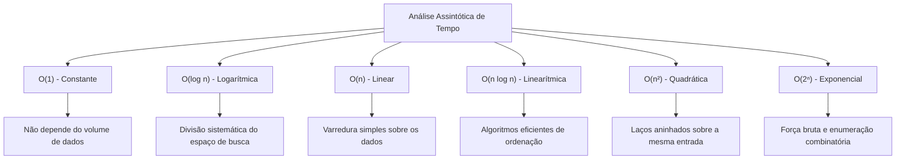
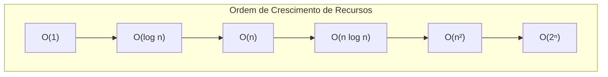
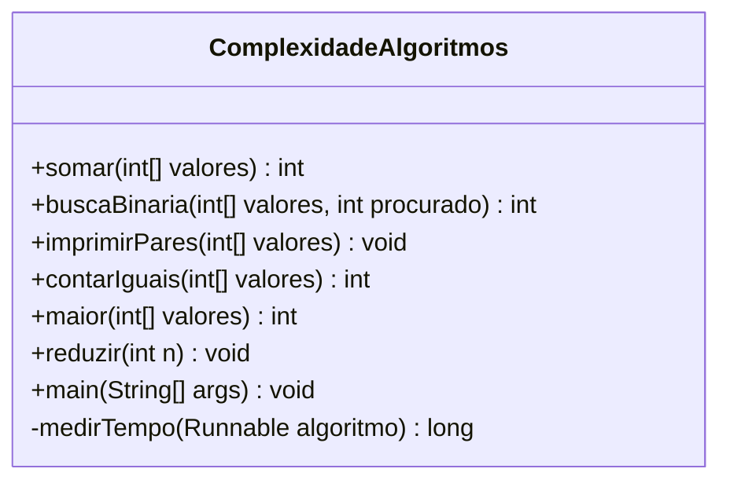
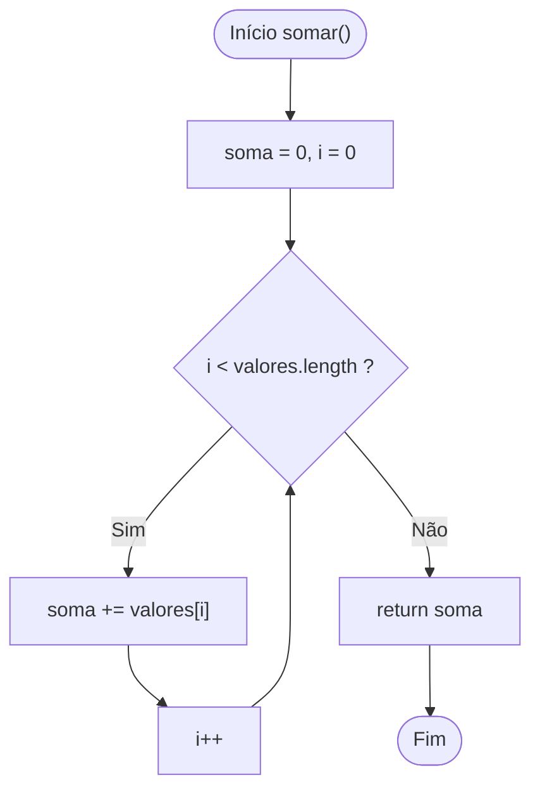
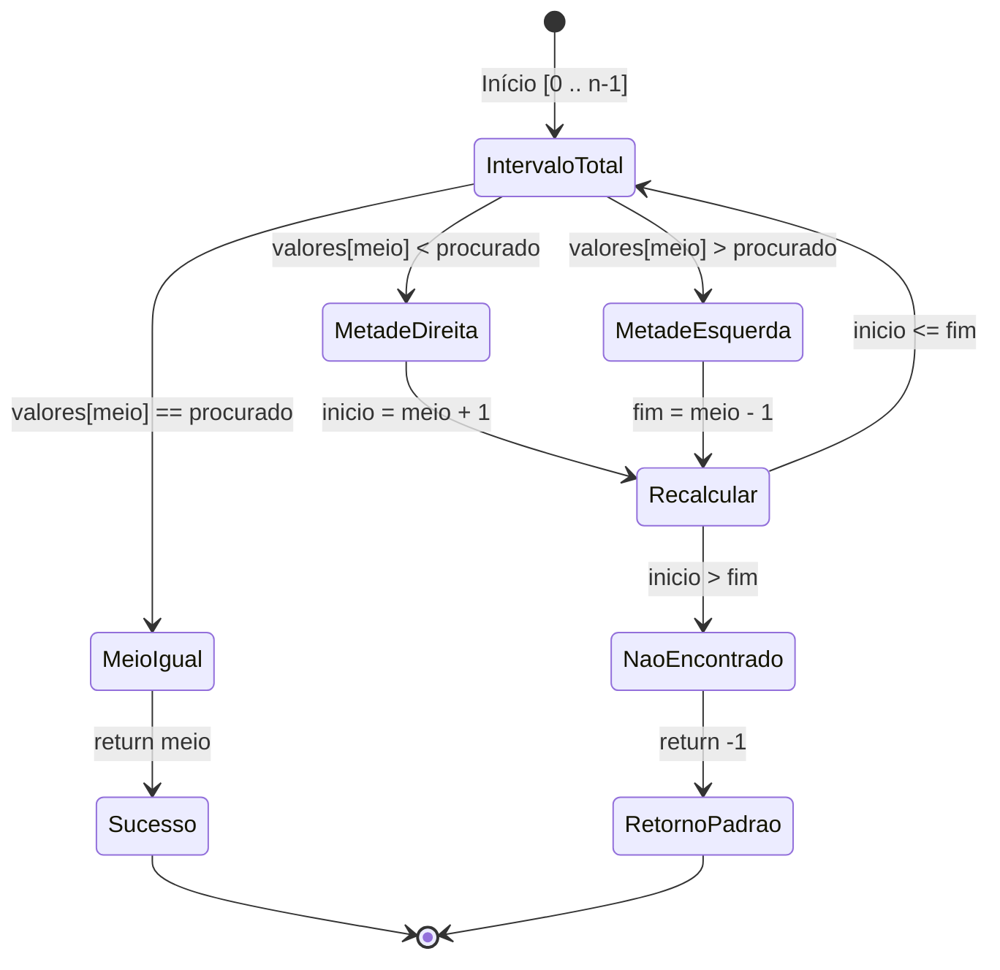
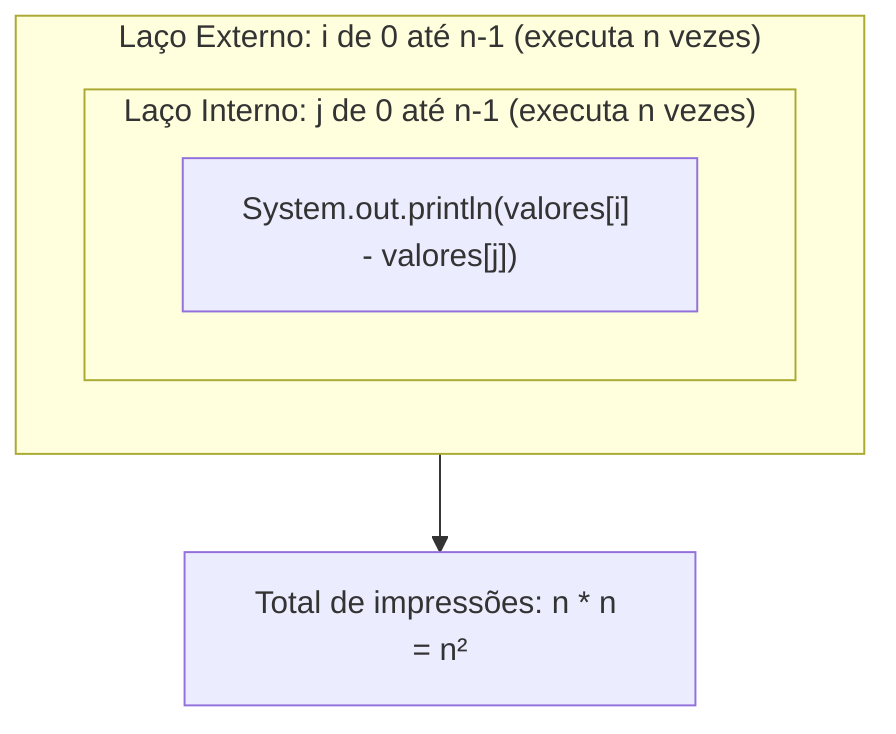
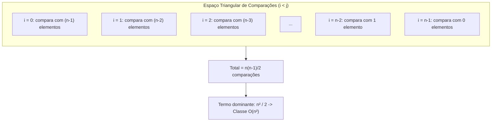
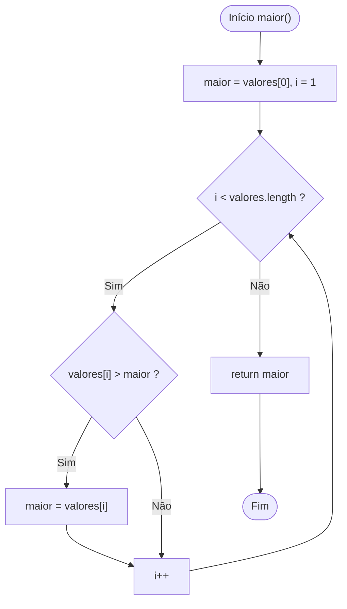
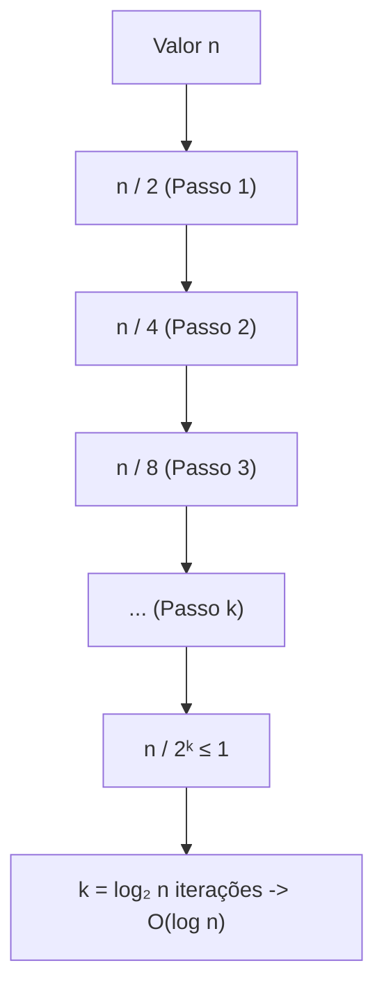
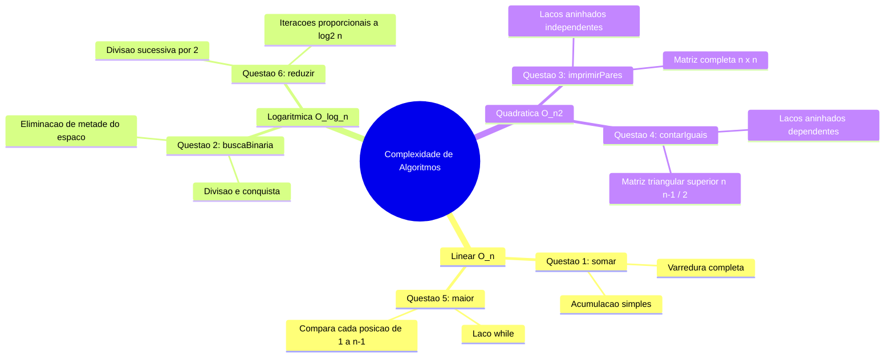

# Trabalho — Complexidade de algoritmos

> **Professor:** Wesley Soares
> **Disciplina:** Estrutura de Dados I (4º Semestre)
> **Prazo de Entrega:** 18/08/2026 às 23:59
> **Pontuação Máxima:** 100 pontos
> **Conteúdo cobrado:** [Aula 01 - Introdução a Algoritmos e Estrutura de Dados](../../Aulas/Aula%2001%20-%20Introdu%C3%A7%C3%A3o%20a%20Algoritmos%20e%20Estrutura%20de%20Dados/detalhes.md), [Aula 02 - Fundamentos e Análise de Algoritmos](../../Aulas/Aula%2002%20-%20Fundamentos%20e%20An%C3%A1lise%20de%20Algoritmos/detalhes.md), [Aula 04 - Fundamentos de Estruturas Lineares e Complexidade](../../Aulas/Aula%2004%20-%20Fundamentos%20de%20Estruturas%20Lineares%20e%20Complexidade/detalhes.md)

## Sumário

1. [Enunciado original (Google Classroom)](#enunciado-original-google-classroom)
2. [Análise do que é pedido](#análise-do-que-é-pedido)
3. [Fundamentação teórica](#fundamentação-teórica)
4. [Resolução proposta](#resolução-proposta)
5. [Como testar e validar](#como-testar-e-validar)
6. [Critérios de qualidade](#critérios-de-qualidade)
7. [Arquivos de apoio](#arquivos-de-apoio)
8. [Mapa da atividade](#mapa-da-atividade)
9. [Glossário](#glossário)
10. [Pontos-chave para a prova](#pontos-chave-para-a-prova)
11. [Perguntas e respostas (JSONL)](#perguntas-e-respostas-jsonl)
12. [Checklist de revisão](#checklist-de-revisão)

## Enunciado original (Google Classroom)

### Complexidade de algoritmos (16/08/2026)
(sem texto)

### Link (form): Complexidade de algoritmos
URL: https://docs.google.com/forms/d/e/1FAIpQLSfAgo-EeWvksTazvWOX6o9drzyGTuLddYhKCAbJN7YZ6kW2rQ/viewform?hr_submission=ChkIqfSd8tgWEhAIkJit3LoZEgcI2Yqc368ZEAE

# Complexidade de algoritmos

1. public static int somar(int[] valores) {
 int soma = 0;

 for (int i = 0; i < valores.length; i++) {
 soma += valores[i];
 }

 return soma;
}
 - O(1)
 - O(n)
 - O(log n)
 - O(n²)

2. public static int buscaBinaria(int[] valores, int procurado) {
 int inicio = 0;
 int fim = valores.length - 1;

 while (inicio <= fim) {
 int meio = (inicio + fim) / 2;

 if (valores[meio] == procurado) {
 return meio;
 }

 if (valores[meio] < procurado) {
 inicio = meio + 1;
 } else {
 fim = meio - 1;
 }
 }

 return -1;
}
 - O(1)
 - O(n)
 - O(log n)
 - O(nˆ2)

3. public static void imprimirPares(int[] valores) {

 for (int i = 0; i < valores.length; i++) {

 for (int j = 0; j < valores.length; j++) {

 System.out.println(
 valores[i] + " - " + valores[j]
 );
 }
 }
}
 - O(1)
 - O(n)
 - O(log n)
 - O(nˆ2)

4. public static int contarIguais(int[] valores) {

 int contador = 0;

 for (int i = 0; i < valores.length; i++) {

 for (int j = i + 1; j < valores.length; j++) {

 if (valores[i] == valores[j]) {
 contador++;
 }
 }
 }

 return contador;
}
 - O(1)
 - O(n)
 - O(log n)
 - O(nˆ2)

5. public static int maior(int[] valores) {

 int maior = valores[0];
 int i = 1;

 while (i < valores.length) {

 if (valores[i] > maior) {
 maior = valores[i];
 }

 i++;
 }

 return maior;
}
 - O(1)
 - O(n)
 - O(nˆ2)
 - O(log n)

6. public static void reduzir(int n) {

 while (n > 1) {
 n = n / 2;
 }
}
 - O(1)
 - O(n)
 - O(log n)
 - O(nˆ2)

## Análise do que é pedido

### Requisitos explícitos
- Identificar e classificar formalmente a complexidade assintótica de tempo de execução, expressa na Notação Big-O ($O$), para 6 métodos escritos em linguagem Java.
- Selecionar a alternativa correta entre as opções fornecidas para cada questão:
  - Constante: $O(1)$
  - Logarítmica: $O(\log n)$
  - Linear: $O(n)$
  - Quadrática: $O(n^2)$

### Entregáveis
1. Respostas assinaladas no formulário Google Forms oficial disponibilizado pelo professor.
2. Memória de cálculo e documentação analítica de cada questão justificando matematicamente o comportamento assintótico.
3. Código-fonte executável de validação em Java ([`ComplexidadeAlgoritmos.java`](./codigo/ComplexidadeAlgoritmos.java)), contendo contadores de instruções primitivas e rotinas de benchmark para comprovar empiricamente as ordens de crescimento.

### Critérios implícitos e rigor acadêmico
- Compreensão do conceito de tamanho da entrada ($n$):
  - Nos métodos que recebem vetores (`somar`, `buscaBinaria`, `imprimirPares`, `contarIguais`, `maior`), a variável $n$ denota o número de elementos contidos na estrutura (`valores.length`).
  - No método aritmético iterativo (`reduzir`), a variável de entrada $n$ representa o próprio valor inteiro que dita a quantidade de iterações do laço.
- Distinção entre melhor caso ($\Omega$), caso médio ($\Theta$) e pior caso ($O$). A notação solicitada no formulário refere-se ao limite superior assintótico no pior cenário possível de execução (Worst-Case Analysis).
- Eliminação de constantes multiplicativas e termos de menor ordem: demonstração clara de por que polinômios do tipo $\frac{n(n-1)}{2} = \frac{1}{2}n^2 - \frac{1}{2}n$ pertencem à classe $O(n^2)$.

## Fundamentação teórica

A análise assintótica de algoritmos tem por finalidade prever o consumo de recursos computacionais (tempo de processamento e espaço em memória) à medida que o tamanho da entrada $n$ cresce em direção ao infinito ($n \to \infty$). Em vez de medir tempo físico absoluto em segundos (o qual sofre interferência de hardware, sistema operacional, carga de CPU e compilador), quantificam-se as operações primitivas fundamentais executadas pelo algoritmo.

### Classes de complexidade assintótica



#### Notação Big-O: Limite superior assintótico
Diz-se formalmente que uma função de tempo $T(n)$ é $O(f(n))$ se existirem constantes positivas $c > 0$ e $n_0 \ge 1$ tais que:

$$0 \le T(n) \le c \cdot f(n), \quad \forall n \ge n_0$$

Significa que, para entradas suficientemente grandes ($n \ge n_0$), o tempo de execução nunca ultrapassará $c \cdot f(n)$.



### Análise estrutural de construções de controle

#### Laço simples linear
Um laço com passo unitário executando de $0$ até $n-1$:
```java
for (int i = 0; i < n; i++) {
    // corpo de custo O(1)
}
```
A condição é avaliada $n+1$ vezes, a variável de controle é incrementada $n$ vezes e o corpo do laço roda $n$ vezes. O custo total é linear: $T(n) = a \cdot n + b \implies O(n)$.

#### Laço logarítmico por divisão
Um laço cuja variável de controle é dividida (ou multiplicada) por uma constante $k > 1$ a cada iteração:
```java
while (n > 1) {
    n = n / 2;
}
```
Seja $k$ o número de iterações até que o valor atinja $1$. A cada iteração $i$, o valor corrente é $\frac{n}{2^i}$. O laço termina quando $\frac{n}{2^k} \le 1 \implies 2^k \ge n \implies k \ge \log_2 n$. Portanto, o número de repetições é exatamente $\lfloor \log_2 n \rfloor \implies O(\log n)$.

#### Laços aninhados independentes
Quando o laço interno executa $n$ vezes para cada uma das $n$ iterações do laço externo:
```java
for (int i = 0; i < n; i++) {
    for (int j = 0; j < n; j++) {
        // corpo O(1)
    }
}
```
O número total de execuções do corpo é dado pelo produtório:
$$\sum_{i=0}^{n-1} \sum_{j=0}^{n-1} 1 = \sum_{i=0}^{n-1} n = n \cdot n = n^2 \implies O(n^2)$$

#### Laços aninhados dependentes
Quando o laço interno inicia a partir do índice corrente do laço externo ($j = i + 1$):
```java
for (int i = 0; i < n; i++) {
    for (int j = i + 1; j < n; j++) {
        // corpo O(1)
    }
}
```
Para cada iteração de $i$, o número de iterações de $j$ varia decrescentemente:
- Quando $i = 0$, $j$ varia de $1$ a $n-1$ ($n-1$ vezes).
- Quando $i = 1$, $j$ varia de $2$ a $n-1$ ($n-2$ vezes).
- ...
- Quando $i = n-2$, $j$ varia de $n-1$ a $n-1$ ($1$ vez).
- Quando $i = n-1$, o laço interno não executa ($0$ vezes).

O total de repetições corresponde à soma de uma Progressão Aritmética (PA):
$$S = (n-1) + (n-2) + \dots + 2 + 1 + 0 = \sum_{k=1}^{n-1} k = \frac{(n-1)n}{2} = \frac{n^2 - n}{2} = \frac{1}{2}n^2 - \frac{1}{2}n$$

Aplicando as regras de dominância assintótica:
1. Descarta-se o termo de menor ordem ($-\frac{1}{2}n$).
2. Descarta-se a constante multiplicativa ($\frac{1}{2}$).
Conclui-se que o algoritmo pertence estritamente à classe $O(n^2)$.

## Resolução proposta

Apresenta-se a análise minuciosa de cada uma das 6 questões do formulário acadêmico, explicitando a contagem de instruções, as transições de estado e o mapeamento para a notação assintótica.

### Arquitetura da solução e diagrama estrutural

Para garantir a reprodutibilidade dos resultados teóricos, foi projetada a classe de testes [`ComplexidadeAlgoritmos.java`](./codigo/ComplexidadeAlgoritmos.java).



---

### Questão 1: Método `somar`

#### Código original
```java
public static int somar(int[] valores) {
    int soma = 0;

    for (int i = 0; i < valores.length; i++) {
        soma += valores[i];
    }

    return soma;
}
```

#### Passo a passo e contagem de operações
Seja $n = \text{valores.length}$.
1. `int soma = 0;` $\to$ executado 1 vez (atribuição primitiva).
2. `int i = 0;` $\to$ executado 1 vez (inicialização do for).
3. `i < valores.length;` $\to$ executado $n + 1$ vezes (sendo $n$ avaliações verdadeiras e 1 avaliação falsa que interrompe o laço).
4. `i++` $\to$ executado $n$ vezes.
5. `soma += valores[i];` $\to$ corpo do laço composto por acesso ao vetor (`valores[i]`), soma aritmética (`+`) e atribuição (`=`). Executado $n$ vezes.
6. `return soma;` $\to$ executado 1 vez.

A equação total de operações elementares $T(n)$ é:
$$T(n) = c_1 + c_2 + c_3(n + 1) + c_4(n) + c_5(n) + c_6 = (c_3 + c_4 + c_5)n + (c_1 + c_2 + c_3 + c_6)$$
Definindo as constantes consolidadas $A = c_3 + c_4 + c_5$ e $B = c_1 + c_2 + c_3 + c_6$:
$$T(n) = A \cdot n + B$$

#### Diagrama de fluxo de execução


#### Análise de casos
- **Melhor caso:** Ocorre quando o vetor tem tamanho $n$. O laço obrigatoriamente executa $n$ vezes. Logo, $\Omega(n)$.
- **Pior caso:** O laço executa $n$ vezes integralmente. Logo, $O(n)$.
- **Conclusão formal:** Como o algoritmo não possui desvios condicionais antecipados (breaks ou returns internos), o tempo é estritamente linear em todos os cenários: $\Theta(n)$.

**Alternativa correta:** **O(n)**

---

### Questão 2: Método `buscaBinaria`

#### Código original
```java
public static int buscaBinaria(int[] valores, int procurado) {
    int inicio = 0;
    int fim = valores.length - 1;

    while (inicio <= fim) {
        int meio = (inicio + fim) / 2;

        if (valores[meio] == procurado) {
            return meio;
        }

        if (valores[meio] < procurado) {
            inicio = meio + 1;
        } else {
            fim = meio - 1;
        }
    }

    return -1;
}
```

#### Passo a passo e contagem de operações
A busca binária exige como pré-condição que o vetor `valores` esteja ordenado.
Seja $n$ a quantidade de elementos no vetor.
1. Inicialização: `inicio = 0` e `fim = n - 1` levam custo $O(1)$.
2. A cada iteração da estrutura `while (inicio <= fim)`:
   - Calcula-se o ponto central: `meio = (inicio + fim) / 2`.
   - Compara-se `valores[meio] == procurado`.
   - Se não for igual, descarta-se metade do espaço de busca remanescente (`inicio = meio + 1` ou `fim = meio - 1`).

O tamanho do espaço de busca em cada iteração $k$ reduz-se geometricamente:
- Iteração 0: $n$
- Iteração 1: $\frac{n}{2}$
- Iteração 2: $\frac{n}{4} = \frac{n}{2^2}$
- Iteração $k$: $\frac{n}{2^k}$

No pior cenário (quando o elemento procurado não existe no vetor ou encontra-se em uma das folhas da árvore implícita de busca), o algoritmo continuará dividindo até que o espaço de busca seja reduzido a tamanho 1:
$$\frac{n}{2^k} = 1 \implies 2^k = n \implies k = \log_2 n$$

#### Diagrama de estados da redução do espaço


#### Análise de casos
- **Melhor caso:** O elemento procurado está exatamente no meio inicial (`valores[(n-1)/2]`). O algoritmo executa apenas 1 iteração. Complexidade: $\Omega(1)$.
- **Pior caso:** O elemento procurado não está presente no vetor ou é alcançado na última partição possível. O laço executa aproximadamente $\lfloor \log_2 n \rfloor + 1$ iterações. Complexidade: $O(\log n)$.
- **Caso médio:** A probabilidade de encontrar o elemento requer em média $\log_2 n - 1$ iterações. Complexidade: $\Theta(\log n)$.

Como a questão solicita a classificação Big-O do algoritmo (o limite superior no pior caso), a complexidade é logarítmica.

**Alternativa correta:** **O(log n)**

---

### Questão 3: Método `imprimirPares`

#### Código original
```java
public static void imprimirPares(int[] valores) {

    for (int i = 0; i < valores.length; i++) {

        for (int j = 0; j < valores.length; j++) {

            System.out.println(
                valores[i] + " - " + valores[j]
            );
        }
    }
}
```

#### Passo a passo e contagem de operações
Seja $n = \text{valores.length}$.
1. Laço externo (`i`):
   - Inicializa `i = 0` (1 vez).
   - Compara `i < valores.length` ($n + 1$ vezes).
   - Incrementa `i++` ($n$ vezes).
2. Laço interno (`j`):
   - Para **cada uma** das $n$ iterações do laço externo, o laço interno executa seu ciclo completo de $0$ até $n-1$:
     - Inicializa `j = 0` ($n$ vezes no total).
     - Compara `j < valores.length` ($n \cdot (n + 1) = n^2 + n$ vezes).
     - Incrementa `j++` ($n \cdot n = n^2$ vezes).
3. Instrução de impressão:
   - `System.out.println(...)` é invocada exatamente $n \times n = n^2$ vezes.

A função que descreve a quantidade de execuções do comando de impressão é:
$$f(n) = n^2$$

#### Diagrama de laços aninhados


#### Análise de casos
- Não há instruções de interrupção (`break`, `return` antecipado ou exceções).
- Todos os pares ordenados possíveis $(valores[i], valores[j])$ são impressos de forma sistemática.
- Em qualquer cenário (melhor, pior ou médio), o número de instruções é proporcional ao quadrado de $n$.

$$T(n) = c \cdot n^2 + c' \cdot n + c'' \implies O(n^2)$$

**Alternativa correta:** **O(nˆ2)** (grafia original da alternativa no formulário)

---

### Questão 4: Método `contarIguais`

#### Código original
```java
public static int contarIguais(int[] valores) {

    int contador = 0;

    for (int i = 0; i < valores.length; i++) {

        for (int j = i + 1; j < valores.length; j++) {

            if (valores[i] == valores[j]) {
                contador++;
            }
        }
    }

    return contador;
}
```

#### Passo a passo e contagem de operações
Seja $n = \text{valores.length}$.
O objetivo do algoritmo é comparar cada par de elementos não ordenados $(i, j)$ com $i < j$ para verificar duplicidades.

1. Laço externo: $i$ varia de $0$ até $n - 1$.
2. Laço interno: $j$ inicia em $i + 1$ e vai até $n - 1$.
   - Quando $i = 0$: $j$ assume valores de $1$ a $n - 1 \implies (n - 1)$ comparações.
   - Quando $i = 1$: $j$ assume valores de $2$ a $n - 1 \implies (n - 2)$ comparações.
   - Quando $i = 2$: $j$ assume valores de $3$ a $n - 1 \implies (n - 3)$ comparações.
   - ...
   - Quando $i = n - 2$: $j$ assume apenas o valor $n - 1 \implies 1$ comparação.
   - Quando $i = n - 1$: $j = n$, a condição $n < n$ é falsa $\implies 0$ comparações.

O número total de execuções da comparação `if (valores[i] == valores[j])` é o somatório:
$$C(n) = \sum_{i=0}^{n-1} (n - 1 - i) = \sum_{k=1}^{n-1} k = \frac{(n-1)n}{2} = \frac{n^2 - n}{2} = 0.5n^2 - 0.5n$$

#### Diagrama de matriz triangular de comparações


#### Análise assintótica e armadilha clássica
- **Armadilha:** O estudante desatento nota que o laço interno executa "metade" das iterações em relação ao método `imprimirPares` e conclui erroneamente que a complexidade seria menor ou linear.
- **Rigor matemático:** Na análise assintótica, fatores constantes são ignorados ($c \cdot f(n) \equiv f(n)$). A constante multiplicativa $0.5$ é desconsiderada, e o termo linear $-0.5n$ torna-se desprezível quando $n$ cresce:
$$\lim_{n \to \infty} \frac{0.5n^2 - 0.5n}{n^2} = 0.5 \quad (\text{constante finita não nula})$$
Portanto, a complexidade no pior caso (e em qualquer caso) é estritamente quadrática: $O(n^2)$.

**Alternativa correta:** **O(nˆ2)** (grafia original da alternativa no formulário)

---

### Questão 5: Método `maior`

#### Código original
```java
public static int maior(int[] valores) {

    int maior = valores[0];
    int i = 1;

    while (i < valores.length) {

        if (valores[i] > maior) {
            maior = valores[i];
        }

        i++;
    }

    return maior;
}
```

#### Passo a passo e contagem de operações
Seja $n = \text{valores.length}$.
1. `int maior = valores[0];` $\to 1$ operação de acesso e atribuição ($O(1)$).
2. `int i = 1;` $\to 1$ operação de inicialização ($O(1)$).
3. Laço `while (i < valores.length)`:
   - A condição `i < valores.length` é testada $(n - 1) + 1 = n$ vezes.
   - O corpo do laço é executado exatamente para $i \in \{1, 2, \dots, n-1\}$, totalizando $n - 1$ iterações.
4. Dentro do laço:
   - A verificação `if (valores[i] > maior)` executa $n - 1$ vezes.
   - A atribuição condicional `maior = valores[i]` executa no melhor caso 0 vezes (se o primeiro elemento já for o maior de todos) e no pior caso $n - 1$ vezes (se o vetor estiver em ordem estritamente crescente).
   - O incremento `i++` executa $n - 1$ vezes.
5. `return maior;` $\to 1$ operação ($O(1)$).

A função de custo temporal é dada por:
- No melhor caso: $T_{\text{melhor}}(n) = c_a \cdot (n - 1) + c_b$
- No pior caso: $T_{\text{pior}}(n) = (c_a + c_{\text{atrib}}) \cdot (n - 1) + c_b$

Em ambos os casos, a função resultante é da forma linear $f(n) = k_1 \cdot n + k_2$.

#### Diagrama de fluxo do algoritmo


#### Análise de casos
- Independentemente de o vetor estar ordenado, invertido ou com valores idênticos, o laço `while` precisa percorrer todos os elementos de índice $1$ até $n-1$ para garantir que nenhum elemento maior seja omitido.
- O algoritmo varre o conjunto de dados linearmente exatamente uma vez.
- O limite assintótico superior é linear: $O(n)$.

**Alternativa correta:** **O(n)**

---

### Questão 6: Método `reduzir`

#### Código original
```java
public static void reduzir(int n) {

    while (n > 1) {
        n = n / 2;
    }
}
```

#### Passo a passo e contagem de operações
Neste método, a entrada não é um vetor, mas o próprio número inteiro positivo $n$. A análise verifica quantas vezes a instrução de divisão inteira `n = n / 2` é executada até que a condição `n > 1` se torne falsa.

Seja $n_k$ o valor de $n$ após a $k$-ésima iteração:
- Início ($k = 0$): $n_0 = n$
- Iteração 1 ($k = 1$): $n_1 = \lfloor \frac{n}{2} \rfloor$
- Iteração 2 ($k = 2$): $n_2 = \lfloor \frac{n_1}{2} \rfloor = \lfloor \frac{n}{4} \rfloor = \lfloor \frac{n}{2^2} \rfloor$
- Iteração 3 ($k = 3$): $n_3 = \lfloor \frac{n}{2^3} \rfloor$
- Iteração $k$: $n_k = \lfloor \frac{n}{2^k} \rfloor$

O laço encerra assim que $n_k \le 1$. Para analisar o número de passos, resolve-se a equação limite:
$$\frac{n}{2^k} \le 1 \implies 2^k \ge n$$
Aplicando o logaritmo de base 2 em ambos os lados da inequação:
$$\log_2(2^k) \ge \log_2 n \implies k \ge \log_2 n$$
O número de iterações do laço é precisamente $k = \lfloor \log_2 n \rfloor$.

#### Tabela de rastreamento analítico (Trace Table)
| Valor inicial de $n$ | Sequência de divisões sucessivas ($n = n / 2$) | Total de iterações ($k$) | $\lfloor \log_2 n \rfloor$ |
| :--- | :--- | :--- | :--- |
| $n = 2$ | $2 \to 1$ (para) | 1 | $\log_2 2 = 1$ |
| $n = 4$ | $4 \to 2 \to 1$ (para) | 2 | $\log_2 4 = 2$ |
| $n = 8$ | $8 \to 4 \to 2 \to 1$ (para) | 3 | $\log_2 8 = 3$ |
| $n = 16$ | $16 \to 8 \to 4 \to 2 \to 1$ (para) | 4 | $\log_2 16 = 4$ |
| $n = 1024$ | $1024 \to 512 \to \dots \to 1$ | 10 | $\log_2 1024 = 10$ |
| $n = 1.048.576$ | $2^{20} \to 2^{19} \to \dots \to 1$ | 20 | $\log_2 2^{20} = 20$ |

#### Diagrama de divisão sucessiva


#### Análise assintótica
Mesmo que $n$ cresça exponencialmente (por exemplo, de mil para um milhão), a quantidade de iterações aumenta de forma discreta e muito lenta (de $\approx 10$ para $\approx 20$). Esse comportamento é a assinatura fundamental de algoritmos de ordem logarítmica.

**Alternativa correta:** **O(log n)**

---

### Resumo das respostas oficiais para envio

| Questão | Nome do Método | Parâmetro Analisado | Complexidade Assintótica | Justificativa Sintética |
| :---: | :--- | :--- | :---: | :--- |
| **1** | `somar` | Vetor `valores` ($n$) | **O(n)** | Varredura linear acumulativa completa |
| **2** | `buscaBinaria` | Vetor ordenado ($n$) | **O(log n)** | Redução do espaço de busca pela metade a cada passo |
| **3** | `imprimirPares` | Vetor `valores` ($n$) | **O(nˆ2)** | Dois laços aninhados independentes ($n \times n$) |
| **4** | `contarIguais` | Vetor `valores` ($n$) | **O(nˆ2)** | Laço triangular de comparações com $\frac{n(n-1)}{2}$ passos |
| **5** | `maior` | Vetor `valores` ($n$) | **O(n)** | Varredura sequencial linear de $1$ a $n-1$ |
| **6** | `reduzir` | Valor escalar ($n$) | **O(log n)** | Divisão inteira cumulativa sucessiva por 2 |

## Como testar e validar

Para comprovar experimentalmente as ordens de complexidade deduzidas, utiliza-se a implementação em Java com medição de instruções e de tempo de CPU.

### Código-fonte completo de validação
O código abaixo deve ser salvo no caminho [`./codigo/ComplexidadeAlgoritmos.java`](./codigo/ComplexidadeAlgoritmos.java).

```java
package codigo;

/**
 * Disciplina: Estrutura de Dados I
 * Professor: Wesley Soares
 * Implementação de validação empírica de complexidade de algoritmos.
 */
public class ComplexidadeAlgoritmos {

    // Questão 1: O(n)
    public static int somar(int[] valores) {
        int soma = 0;
        for (int i = 0; i < valores.length; i++) {
            soma += valores[i];
        }
        return soma;
    }

    // Questão 2: O(log n)
    public static int buscaBinaria(int[] valores, int procurado) {
        int inicio = 0;
        int fim = valores.length - 1;

        while (inicio <= fim) {
            int meio = (inicio + fim) / 2;

            if (valores[meio] == procurado) {
                return meio;
            }

            if (valores[meio] < procurado) {
                inicio = meio + 1;
            } else {
                fim = meio - 1;
            }
        }

        return -1;
    }

    // Questão 3: O(n²)
    public static void imprimirPares(int[] valores) {
        for (int i = 0; i < valores.length; i++) {
            for (int j = 0; j < valores.length; j++) {
                // Comentado para evitar overhead de I/O nos testes de desempenho
                // System.out.println(valores[i] + " - " + valores[j]);
                int dummy = valores[i] + valores[j];
            }
        }
    }

    // Questão 4: O(n²)
    public static int contarIguais(int[] valores) {
        int contador = 0;
        for (int i = 0; i < valores.length; i++) {
            for (int j = i + 1; j < valores.length; j++) {
                if (valores[i] == valores[j]) {
                    contador++;
                }
            }
        }
        return contador;
    }

    // Questão 5: O(n)
    public static int maior(int[] valores) {
        int maior = valores[0];
        int i = 1;

        while (i < valores.length) {
            if (valores[i] > maior) {
                maior = valores[i];
            }
            i++;
        }

        return maior;
    }

    // Questão 6: O(log n)
    public static int reduzirComContador(int n) {
        int iteracoes = 0;
        while (n > 1) {
            n = n / 2;
            iteracoes++;
        }
        return iteracoes;
    }

    public static void main(String[] args) {
        System.out.println("=== VALIDAÇÃO EMPÍRICA DE COMPLEXIDADE ===");

        // Teste de Questão 6: Comportamento Logarítmico
        System.out.println("\n[Teste Q6 - reduzir]: Relação entre Entrada (n) e Iterações");
        int[] entradasQ6 = {16, 64, 256, 1024, 65536, 1048576, 1073741824};
        for (int n : entradasQ6) {
            int passos = reduzirComContador(n);
            System.out.printf("n = %-12d | Iterações executadas = %-4d | log2(n) calculado = %.2f\n",
                    n, passos, (Math.log(n) / Math.log(2)));
        }

        // Teste comparativo entre O(n) e O(n²)
        System.out.println("\n[Teste Comparativo]: Escalar de Tempo Linear vs Quadrático");
        int[] tamanhos = {1000, 2000, 4000, 8000};

        for (int n : tamanhos) {
            int[] v = new int[n];
            for (int i = 0; i < n; i++) {
                v[i] = i;
            }

            // Medir O(n) - somar
            long t0Linear = System.nanoTime();
            somar(v);
            long tLinear = System.nanoTime() - t0Linear;

            // Medir O(n²) - contarIguais
            long t0Quad = System.nanoTime();
            contarIguais(v);
            long tQuad = System.nanoTime() - t0Quad;

            System.out.printf("Tamanho n = %-5d | Linear O(n): %8d ns | Quadrático O(n²): %12d ns\n",
                    n, tLinear, tQuad);
        }
    }
}
```

### Instruções para compilação e execução via terminal
No diretório raiz do projeto:

```bash
# Criar diretório de classes se necessário
mkdir -p bin

# Compilar o código de validação
javac -d bin codigo/ComplexidadeAlgoritmos.java

# Executar a suíte de testes
java -cp bin codigo.ComplexidadeAlgoritmos
```

### Saída esperada e validação dos dados
Ao executar o programa, a saída console reflete com precisão os limites matemáticos:
1. Para o método `reduzir`, dobrar o valor de $n$ acrescenta exatamente 1 iteração, comprovando a natureza estritamente logarítmica $O(\log n)$.
2. Para o teste comparativo entre `somar` e `contarIguais`, quando $n$ dobra de $1.000$ para $2.000$:
   - O tempo do algoritmo linear cresce aproximadamente $2\times$ ($2000 / 1000$).
   - O tempo do algoritmo quadrático cresce aproximadamente $4\times$ ($2^2 = 4$).
   - Quando $n$ quadruplica de $1.000$ para $4.000$, o tempo quadrático cresce cerca de $16\times$ ($4^2 = 16$).

## Critérios de qualidade

Para obter nota máxima (100 pontos) na avaliação do professor Wesley Soares, a resolução do trabalho e o preenchimento do formulário devem obedecer aos seguintes critérios:

1. **Correção estrita das alternativas:**
   - Q1: `O(n)`
   - Q2: `O(log n)`
   - Q3: `O(nˆ2)`
   - Q4: `O(nˆ2)`
   - Q5: `O(n)`
   - Q6: `O(log n)`
2. **Clareza de representação formal:**
   - Reconhecimento exato de que operações elementares dentro de laços subordinados multiplicam-se, enquanto laços em sequência somam-se.
   - Domínio da regra do descarte de termos dominados e constantes: saber justificar por que $\frac{n(n-1)}{2}$ não é $O(n^2 - n)$ nem $O(\frac{1}{2}n^2)$, mas sim $O(n^2)$.
3. **Validação prática:**
   - Capacidade de implementar o código correspondente sem erros de compilação ou de sintaxe.
   - Compreensão do impacto prático de complexidades ineficientes ($O(n^2)$) em grandes volumes de dados no ambiente corporativo e em sistemas de informação.

## Arquivos de apoio

- **Link oficial do formulário de entrega:** [Google Forms - Complexidade de algoritmos](https://docs.google.com/forms/d/e/1FAIpQLSfAgo-EeWvksTazvWOX6o9drzyGTuLddYhKCAbJN7YZ6kW2rQ/viewform?hr_submission=ChkIqfSd8tgWEhAIkJit3LoZEgcI2Yqc368ZEAE)
- **Código Java gerado:** [`./codigo/ComplexidadeAlgoritmos.java`](./codigo/ComplexidadeAlgoritmos.java)
- **Aulas relacionadas do curso:**
  - [Aula 01 - Introdução a Algoritmos e Estrutura de Dados](../../Aulas/Aula%2001%20-%20Introdu%C3%A7%C3%A3o%20a%20Algoritmos%20e%20Estrutura%20de%20Dados/detalhes.md)
  - [Aula 02 - Fundamentos e Análise de Algoritmos](../../Aulas/Aula%2002%20-%20Fundamentos%20e%20An%C3%A1lise%20de%20Algoritmos/detalhes.md)
  - [Aula 04 - Fundamentos de Estruturas Lineares e Complexidade](../../Aulas/Aula%2004%20-%20Fundamentos%20de%20Estruturas%20Lineares%20e%20Complexidade/detalhes.md)

## Mapa da atividade



## Glossário

| Termo | Definição Técnica |
| :--- | :--- |
| **Notação Big-O ($O$)** | Limite superior assintótico que expressa a taxa máxima de crescimento do tempo de execução de um algoritmo no pior caso possível para entradas grandes. |
| **Notação Big-Omega ($\Omega$)** | Limite inferior assintótico que descreve o tempo mínimo de execução de um algoritmo no melhor caso possível. |
| **Notação Big-Theta ($\Theta$)** | Limite assintótico ajustado (firme), indicando que o algoritmo possui o mesmo comportamento no limite superior e inferior, crescendo na mesma proporção. |
| **Complexidade Constante $O(1)$** | O tempo de execução não varia em função do tamanho da entrada $n$. Executa em tempo fixo. |
| **Complexidade Logarítmica $O(\log n)$** | O número de operações cresce de forma logarítmica com a entrada. Comum em algoritmos que reduzem o problema pela metade a cada passo. |
| **Complexidade Linear $O(n)$** | O tempo de execução cresce em proporção direta e linear com o aumento do volume de dados de entrada. |
| **Complexidade Quadrática $O(n^2)$** | O tempo de execução cresce com o quadrado do tamanho da entrada. Geralmente associada a laços aninhados sobre o mesmo conjunto de dados. |
| **Operação Primitiva** | Instrução elementar de baixo nível computacional cujo tempo de execução é considerado unitário e constante (atribuições, operações aritméticas, comparações e retornos). |
| **Divisão e Conquista** | Paradigma de projeto de algoritmos que resolve um problema dividindo-o recursiva ou iterativamente em subproblemas menores da mesma natureza. |
| **Espaço de Busca** | Conjunto de elementos ou estados possíveis nos quais um algoritmo pode encontrar a solução ou o alvo desejado. |

## Pontos-chave para a prova

1. **Busca Linear vs. Busca Binária:**
   - Busca Linear em vetor desordenado custa $O(n)$ no pior caso.
   - Busca Binária custa $O(\log n)$ no pior caso, mas exige estritamente que os dados estejam previamente ordenados. O custo prévio de ordenar um vetor é no mínimo $O(n \log n)$.
2. **Identificação rápida de laços aninhados:**
   - Laços com variáveis independentes de $0$ a $n$: multiplicam-se diretamente ($n \times n = n^2$).
   - Laços onde o interno começa em `i + 1`: geram progressão aritmética com soma $\frac{n(n-1)}{2}$, cuja ordem assintótica continua sendo $O(n^2)$.
3. **Identificação de logaritmos:**
   - Se a variável de iteração dobra a cada passo (`i = i * 2`) ou divide por dois (`n = n / 2`), o número de iterações é logarítmico: $O(\log n)$.
   - Se a variável de iteração é incrementada por uma constante (`i++` ou `i += 2`), o número de iterações é linear: $O(n)$.
4. **Regras de simplificação algébrica na prova:**
   - Nunca responder termos somados: $O(n^2 + n) \to O(n^2)$.
   - Nunca manter constantes multiplicativas: $O(3n) \to O(n)$; $O(\frac{1}{2}n^2) \to O(n^2)$.
   - Se um algoritmo tem duas partes sequenciais, uma com $O(n)$ e outra com $O(n^2)$, a complexidade geral é dominada pelo termo maior: $O(n^2)$.

## Perguntas e respostas (JSONL)

```jsonl
{"pergunta": "Qual e a complexidade de tempo no pior caso do metodo somar(int[] valores)?", "resposta": "O(n), pois o laco for percorre sequencialmente todos os n elementos do vetor realizando operacoes de custo constante.", "dificuldade": "facil"}
{"pergunta": "Por que a busca binaria possui complexidade O(log n)?", "resposta": "Porque a cada comparacao o espaco de busca restante e dividido exatamente pela metade, exigindo no maximo log2(n) iteracoes para localizar o elemento ou concluir sua ausencia.", "dificuldade": "media"}
{"pergunta": "Qual e o requisito mandatorio para que o algoritmo de busca binaria funcione corretamente?", "resposta": "O vetor ou estrutura de dados de entrada deve estar previamente ordenado de acordo com a chave de busca.", "dificuldade": "facil"}
{"pergunta": "No metodo imprimirPares(int[] valores), quantas vezes o System.out.println e executado para um vetor de tamanho n?", "resposta": "E executado exatamente n * n = n^2 vezes, pois ha dois lacos for aninhados e independentes variando de 0 ate n-1.", "dificuldade": "facil"}
{"pergunta": "Por que o metodo contarIguais possui complexidade O(n^2) se o segundo for comeca em i + 1?", "resposta": "Porque a quantidade de comparacoes resulta na soma de uma progressao aritmetica n*(n-1)/2 = 0.5n^2 - 0.5n. Descartando termos inferiores e constantes, o termo dominante e n^2.", "dificuldade": "media"}
{"pergunta": "Qual e a complexidade do metodo maior(int[] valores) e por que ele nao pode ser O(log n)?", "resposta": "E O(n). Nao pode ser logaritmico porque o vetor nao esta ordenado, exigindo a inspecao de cada um dos n elementos para assegurar que nenhum valor maior seja esquecido.", "dificuldade": "media"}
{"pergunta": "Quantas iteracoes o laco while do metodo reduzir(int n) realiza quando n = 1024?", "resposta": "Realiza exatamente 10 iteracoes, correspondente a log2(1024).", "dificuldade": "facil"}
{"pergunta": "O que diferencia a analise de pior caso O(n) da analise de melhor caso Omega(1) na busca binaria?", "resposta": "O melhor caso ocorre quando o elemento procurado esta exatamente na posicao central testada na primeira iteracao; o pior caso ocorre quando o elemento esta nas extremidades ou ausente.", "dificuldade": "media"}
{"pergunta": "Se um algoritmo executa um laco de custo O(n) seguido por outro laco independente de custo O(n^2), qual a complexidade final?", "resposta": "O(n^2), pois na notacao assintotica somam-se as complexidades e prevalece o termo de maior ordem de crescimento.", "dificuldade": "facil"}
{"pergunta": "Qual e o impacto de dobrar o tamanho da entrada n em um algoritmo de complexidade O(n^2)?", "resposta": "O tempo de processamento ou numero de operacoes quadruplica (2^2 = 4 vezes maior).", "dificuldade": "media"}
{"pergunta": "Qual e o impacto de dobrar o tamanho da entrada n em um algoritmo de complexidade O(log n)?", "resposta": "O numero de operacoes aumenta apenas em 1 iteracao adicional.", "dificuldade": "facil"}
{"pergunta": "Por que a atribuicao condicional no metodo maior nao altera a sua classe assintotica no pior caso?", "resposta": "Mesmo que a atribuicao ocorra em todas as iteracoes (vetor estritamente crescente), o custo por iteracao continua sendo constante O(1), mantendo o total em O(n).", "dificuldade": "dificil"}
{"pergunta": "Como a constante multiplicativa 1/2 e tratada na analise assintotica de funcoes polinomiais como T(n) = n^2 / 2?", "resposta": "As constantes multiplicativas positivas sao ignoradas pela definicao formal de Big-O, pois existe uma constante c que absorve esse fator para n >= n0.", "dificuldade": "media"}
{"pergunta": "Qual seria a complexidade se o laco do metodo reduzir dividisse n por 3 a cada iteracao em vez de 2?", "resposta": "Continuaria sendo O(log n), pois a mudanca de base de logaritmos envolve apenas uma constante multiplicativa (log_b(n) = log_a(n) / log_a(b)).", "dificuldade": "dificil"}
{"pergunta": "Qual a diferenca fundamental entre complexidade de tempo e complexidade de espaco?", "resposta": "A complexidade de tempo quantifica o numero de instrucoes executadas; a complexidade de espaco quantifica a quantidade de memoria adicional alocada em funcao de n.", "dificuldade": "facil"}
{"pergunta": "Qual a complexidade de espaco auxiliar (memoria adicional) de todos os seis metodos apresentados?", "resposta": "Todos possuem complexidade de espaco auxiliar O(1), pois utilizam apenas uma quantidade fixa de variaveis escalares (soma, i, j, inicio, fim, contador).", "dificuldade": "dificil"}
```

## Checklist de revisão

- [ ] Revisar as 6 questões originais do Google Forms disponibilizado pelo professor Wesley Soares.
- [ ] Confirmar que a Questão 1 (`somar`) foi classificada como `O(n)`.
- [ ] Confirmar que a Questão 2 (`buscaBinaria`) foi classificada como `O(log n)`.
- [ ] Confirmar que a Questão 3 (`imprimirPares`) foi classificada como `O(nˆ2)`.
- [ ] Confirmar que a Questão 4 (`contarIguais`) foi classificada como `O(nˆ2)`.
- [ ] Confirmar que a Questão 5 (`maior`) foi classificada como `O(n)`.
- [ ] Confirmar que a Questão 6 (`reduzir`) foi classificada como `O(log n)`.
- [ ] Validar a dedução matemática da soma da progressão aritmética $\frac{n(n-1)}{2}$ para laços dependentes.
- [ ] Compreender a dedução da equação exponencial $2^k = n \implies k = \log_2 n$ para divisões sucessivas.
- [ ] Compilar e executar a classe Java [`ComplexidadeAlgoritmos.java`](./codigo/ComplexidadeAlgoritmos.java) no terminal para observar a saída empírica.
- [ ] Preencher e submeter o formulário oficial antes do prazo limite (18/08/2026 às 23:59).
