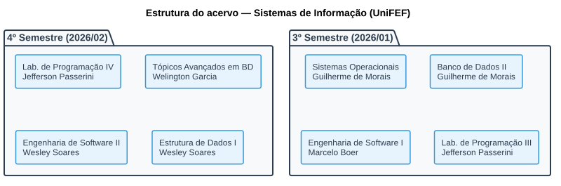
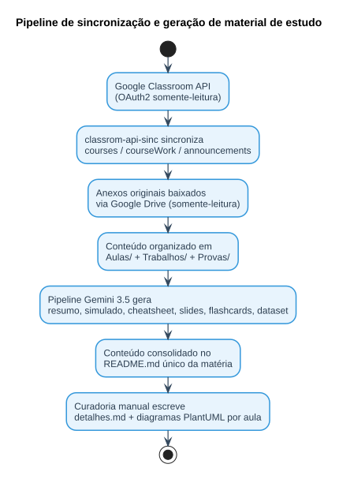

# Acervo Acadêmico — Sistemas de Informação (UniFEF)

Portfólio de aulas, trabalhos, provas e material de revisão do curso de Bacharelado em Sistemas de Informação (UniFEF). Cobre os semestres com conteúdo ativo — 3º e 4º — em 8 disciplinas.

## Estrutura do acervo

Cada disciplina é identificada pelo professor responsável e contém enunciados originais, código executável, e material de revisão.



## Matérias

### 4º Semestre (2026/02)

| Disciplina | Docente | Acesso |
| :--- | :--- | :--- |
| Laboratório de Programação IV — Java, Spring Boot, JPA, PostgreSQL, Liquibase | Jefferson Passerini | [Abrir pasta](<4º Semestre/[Prof. Jefferson Passerini] Laboratório de Programação IV>) |
| Tópicos Avançados em Banco de Dados — PostgreSQL, Subconsultas, Views, Triggers | Welington Garcia | [Abrir pasta](<4º Semestre/[Prof. Welington Garcia] Tópicos Avançados em Banco de Dados>) |
| Engenharia de Software II — Scrum, MoSCoW, Casos de Uso, Requisitos | Wesley Soares | [Abrir pasta](<4º Semestre/[Prof. Wesley Soares] Engenharia de Software II>) |
| Estrutura de Dados I — C, Listas Encadeadas, Pilhas, Filas, Ponteiros | Wesley Soares | [Abrir pasta](<4º Semestre/[Prof. Wesley Soares] Estrutura de Dados I>) |

### 3º Semestre (2026/01)

| Disciplina | Docente | Acesso |
| :--- | :--- | :--- |
| Sistemas Operacionais — Gerenciamento de Memória, Processos, Deadlocks, Threads | Guilherme de Morais | [Abrir pasta](<3º Semestre/[Prof. Guilherme de Morais] Sistemas Operacionais>) |
| Banco de Dados II — SQL DDL/DML, JOINs, Chaves Estrangeiras, Agregações | Guilherme de Morais | [Abrir pasta](<3º Semestre/[Prof. Guilherme de Morais] Banco de Dados II>) |
| Engenharia de Software I — Astah UML, Diagramas de Classes, Casos de Uso | Marcelo Boer | [Abrir pasta](<3º Semestre/[Prof. Marcelo Boer] Engenharia de Software I>) |
| Laboratório de Programação III — Java Web, Servlets, JDBC, MVC | Jefferson Passerini | [Abrir pasta](<3º Semestre/[Prof. Jefferson Passerini] Laboratório de Programação III>) |

## Estrutura de cada disciplina

```text
[Prof. Nome] Nome da Disciplina/
├── README.md                  Guia único da matéria — ementa, tabela de aulas/
│                               avaliações, resumo executivo, simulado, cheatsheet
│                               e diagramas, tudo consolidado
├── Aulas/
│   └── <Nome da Aula>/
│       ├── detalhes.md         Teoria completa + exemplos + exercícios com gabarito
│       ├── diagramas/          Diagramas PlantUML (.puml fonte + .svg renderizado)
│       └── (materiais originais: slides .html/.pdf/.pptx, posts do Classroom)
├── Trabalhos/<Atividade>/      Enunciado real (extraído do .docx original) + código-fonte resolvido
├── Provas/<Avaliação>/         Enunciado real + gabarito, quando existir localmente
└── Resumos-IA/                 Só os formatos que exigem arquivo próprio pra funcionar
    ├── Slides-Revisao-*.pptx   Apresentação de revisão (dark mode, 16:9)
    ├── flashcards-anki.tsv     Baralho para importar no Anki
    └── dataset-estudo-qa.jsonl Dataset de perguntas e respostas
```

Cada matéria tem um único `README.md` — o antigo `Resumos-IA/README.md` foi incorporado a ele. Cada aula tem sua própria pasta com `detalhes.md` completo (teoria, exemplos práticos e exercícios com gabarito, extraídos do material original do professor) e uma subpasta `diagramas/` com diagramas PlantUML no padrão visual deste acervo — skinparam customizado, cores `#3498DB` / `#2C3E50` / `#E8F4FD` / `#34495E`.

Quando o material original de uma aula está incompleto ou indisponível localmente (por exemplo, um link externo que não pôde ser extraído), o `detalhes.md` correspondente sinaliza essa lacuna explicitamente em vez de inventar conteúdo.

## Tecnologias

| Tecnologia | Uso | Disciplinas |
| :--- | :--- | :--- |
| PostgreSQL | Subselects, views, JOINs, otimização | Tópicos Avançados em BD, Banco de Dados II |
| Java / Spring | Backend MVC, Servlets, JPA, Liquibase | Lab. de Programação III e IV |
| C | Estruturas de dados, listas, pilhas, filas | Estrutura de Dados I |
| TypeScript | Automação e scripts de estudo | Ferramentas de apoio |
| PlantUML | Diagramas ER, classes, sequência e atividades por aula | Todas as disciplinas |

## Pipeline de sincronização e IA

Este repositório é só o resultado final, publicado separadamente do motor que o gera (`classrom-api-sinc`, um projeto próprio em TypeScript, não versionado aqui de propósito).



### Sincronização com o Google Classroom

A autenticação usa OAuth2 (`google-auth-library`, com token local renovável) com escopos estritamente somente-leitura:

| Escopo OAuth2 | Para quê |
| :--- | :--- |
| `classroom.courses.readonly` | Lista as matérias em que o aluno está matriculado (`courses.list`) |
| `classroom.coursework.me.readonly` | Busca trabalhos/atividades por matéria (`courses.courseWork.list`) |
| `classroom.courseworkmaterials.readonly` | Busca materiais de apoio por matéria (`courses.courseWorkMaterials.list`) |
| `classroom.announcements.readonly` | Avisos e anúncios de aula (`courses.announcements.list`) |
| `drive.readonly` | Baixa anexos (PDF, DOCX, slides) via Google Drive API |

"Consultar uma matéria" é, na prática, uma chamada `courses.list` pra descobrir o `courseId`, seguida de `courseWork.list`/`courseWorkMaterials.list`/`announcements.list` filtradas por esse ID — cada resposta vira um item que o sincronizador classifica por professor/disciplina e organiza nas pastas `Aulas/`, `Trabalhos/` e `Provas/` daqui do acervo.

### Geração de material de estudo com IA

Com o conteúdo bruto sincronizado, uma segunda etapa consulta a Google Gemini API diretamente via REST (`generateContent`), com uma cadeia de fallback de modelos (`gemini-3.5-flash-lite` → `gemini-3.5-flash` → `gemini-flash-latest`) para continuar funcionando mesmo sob limite de taxa. Por matéria, isso gera:

| Saída | Descrição |
| :--- | :--- |
| Resumo executivo | Síntese didática de toda a ementa |
| Simulado comentado | 10 questões objetivas + 5 discursivas com gabarito |
| CheatSheet | Folha de revisão de 1 página |
| Exercícios resolvidos | Código real (`.sql`/`.c`/`.java`) validado |
| Diagramas | Classes, sequência e arquitetura |
| Slides PPTX | Deck de revisão dark-mode, 5 slides, 16:9 |
| Flashcards Anki | 20–30 cartões `.tsv` prontos para importar |
| Dataset JSONL | Pares pergunta/resposta estruturados (ver abaixo) |

Os 6 primeiros itens ficam consolidados no `README.md` único de cada matéria — só o PPTX, o TSV e o JSONL continuam como arquivo separado, por serem formatos que exigem isso pra funcionar.

### Curadoria manual complementar

O pipeline automático gera o resumo executivo, o simulado e o cheatsheet — mas não substitui o `detalhes.md` de cada aula, que é escrito/revisado manualmente a partir dos materiais originais (slides, `.docx`, `.pdf`) para garantir conteúdo completo (teoria + exemplos + exercícios com gabarito) e os diagramas PlantUML específicos de cada aula. Essa camada de curadoria roda por fora do `classrom-api-sinc` e, como o gerador ainda recria as pastas fragmentadas do `Resumos-IA/` (`CheatSheets/`, `Resumos/`, `Simulados/`, etc.) a cada `sync`/`generate-ai`, é preciso reaplicá-la — ou consolidar manualmente de novo — depois de qualquer nova rodada de sincronização.

### O dataset JSONL — formato e exemplo real

Cada `dataset-estudo-qa.jsonl` é uma lista de objetos JSON, um por linha ([JSON Lines](https://jsonlines.org/), o formato padrão pra fine-tuning/RAG), no schema:

```json
{"id": <int>, "topico": "<string>", "pergunta": "<string>", "resposta": "<string>", "dificuldade": "facil | medio | dificil"}
```

Exemplo real, extraído de [`Banco de Dados II/Resumos-IA/dataset-estudo-qa.jsonl`](<3º Semestre/[Prof. Guilherme de Morais] Banco de Dados II/Resumos-IA/dataset-estudo-qa.jsonl>):

```jsonl
{"id": 1, "topico": "INSERT, DELETE e UPDATE", "pergunta": "Qual é a função do comando INSERT em Banco de Dados Relacionais?", "resposta": "O comando INSERT é utilizado para adicionar uma ou mais novas linhas (registros) em uma tabela existente.", "dificuldade": "facil"}
{"id": 2, "topico": "INSERT, DELETE e UPDATE", "pergunta": "Por que o uso da cláusula WHERE é crítico ao executar o comando DELETE?", "resposta": "A cláusula WHERE especifica quais registros devem ser excluídos. Sem ela, o comando DELETE removerá todas as linhas da tabela.", "dificuldade": "medio"}
```

Cada linha é um objeto JSON independente e machine-readable — ao contrário do resto do material, que fica em prosa dentro do `README.md` único de cada matéria. É esse formato que torna o dataset diretamente consumível por scripts de estudo, geradores de flashcards e pipelines de RAG/fine-tuning locais.

### Atualizações

O acervo é atualizado sob demanda: quando surge conteúdo novo em alguma matéria no Google Classroom, uma nova rodada de sincronização + geração roda localmente e o resultado é incorporado a este repositório.

## Licença

Código autoral e resoluções distribuídos sob a licença [MIT](LICENSE). Direitos didáticos da instituição — enunciados de listas e critérios avaliativos pertencem ao corpo docente do Centro Universitário UniFEF.

Autor: [Murilo (@murilolol)](https://github.com/murilolol). Feito durante a graduação em Sistemas de Informação — UniFEF, 2025–2028.
