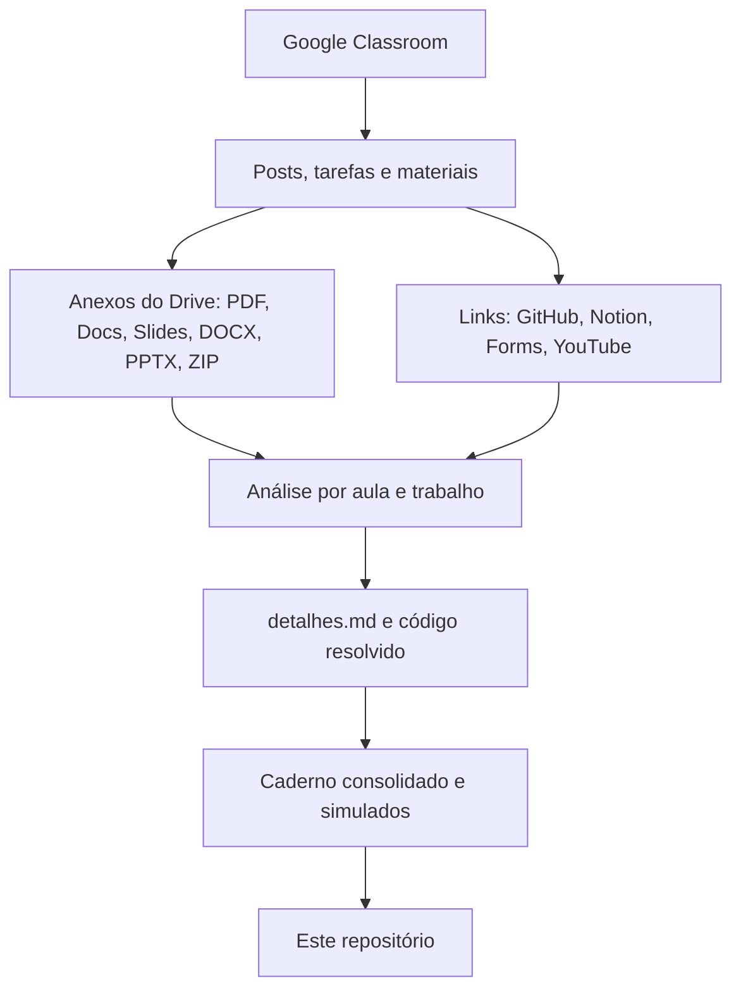

# Acervo Acadêmico - Sistemas de Informação (UniFEF)

Material de estudo do Bacharelado em Sistemas de Informação da UniFEF, sincronizado do Google Classroom e documentado automaticamente: aulas explicadas em profundidade, código resolvido, trabalhos, provas e material de revisão por disciplina.

> Última sincronização: 23/09/2026, 21:54:51 (BRT)

## Disciplinas

### 4º Semestre

| Disciplina | Professor | Aulas | Trabalhos e provas | Revisão |
| :--- | :--- | :---: | :---: | :--- |
| [Tópicos Avançados em Banco de Dados](4%C2%BA%20Semestre/%5BProf.%20Welington%20Garcia%5D%20T%C3%B3picos%20Avan%C3%A7ados%20em%20Banco%20de%20Dados/README.md) | Welington Garcia | 3 | 5 | [Caderno](4%C2%BA%20Semestre/%5BProf.%20Welington%20Garcia%5D%20T%C3%B3picos%20Avan%C3%A7ados%20em%20Banco%20de%20Dados/Resumos-IA/Caderno-Consolidado.md) |

**Total:** 3 aulas e 5 trabalhos/provas documentados.

## Estrutura de cada disciplina

```text
Nº Semestre/[Prof. Nome] Disciplina/
├── README.md              índice da disciplina
├── Avisos.md              mural completo do Classroom, em ordem cronológica
├── Aulas/Aula NN - Tema/
│   ├── detalhes.md        explicação completa com diagramas, tabelas e exercícios resolvidos
│   ├── codigo/            exemplos e exercícios resolvidos na linguagem da aula
│   ├── links-recursos.md  links do professor (GitHub, Notion, formulários)
│   └── anexos             PDFs e arquivos originais
├── Trabalhos/ e Provas/   enunciado, análise, resolução proposta e código
└── Resumos-IA/           Caderno-Consolidado.md e Simulados-Comentados.md
```

## Como o acervo é gerado



1. **Coleta:** turmas, avisos, tarefas e materiais do Google Classroom com acesso somente leitura.
2. **Extração:** anexos do Drive convertidos para texto/PDF, repositórios GitHub clonados, páginas do Notion e formulários lidos na íntegra.
3. **Documentação:** cada aula e trabalho vira um `detalhes.md` extenso, com diagramas UML/ER/fluxo em Mermaid e código resolvido em `codigo/`.
4. **Revisão:** por disciplina, um caderno consolidado e simulados comentados.

Os diagramas usam Mermaid nativo do GitHub e acompanham automaticamente o tema claro ou escuro.

## Licença

Veja [LICENSE](LICENSE).
