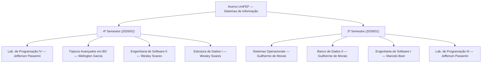
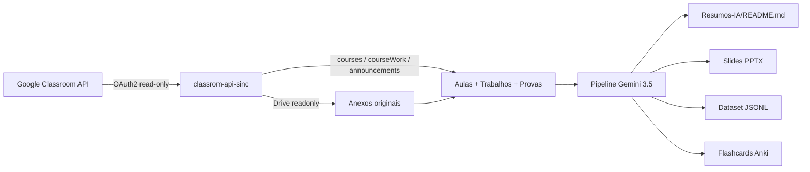

# Acervo Acadêmico — Sistemas de Informação (UniFEF)

Portfólio universitário de aulas, trabalhos, provas e material de revisão gerado com
IA, cobrindo o curso de Bacharelado em Sistemas de Informação (UniFEF). Cobre os
semestres com conteúdo ativo: **3º** e **4º**, 8 disciplinas.

[](LICENSE)
[](#matérias)

## Sumário

- [Estrutura do acervo](#estrutura-do-acervo)
- [Matérias](#matérias)
- [Estrutura de cada disciplina](#estrutura-de-cada-disciplina)
- [Tecnologias](#tecnologias)
- [Pipeline de sincronização e IA](#pipeline-de-sincronização-e-ia)
- [Licença](#licença)

---

## Estrutura do acervo

Cada disciplina é identificada pelo professor responsável e contém enunciados
originais, código executável, diagramas UML em Mermaid e material de revisão.



---

## Matérias

### 4º Semestre — Atual (2026/02)

| Disciplina | Docente | Acesso |
| :--- | :--- | :--- |
| **Laboratório de Programação IV**<br><sub>Java · Spring Boot · JPA · PostgreSQL · Liquibase</sub> | Jefferson Passerini | [Abrir pasta](<4º Semestre/[Prof. Jefferson Passerini] Laboratório de Programação IV>) |
| **Tópicos Avançados em Banco de Dados**<br><sub>PostgreSQL · Subconsultas · Views · Triggers</sub> | Welington Garcia | [Abrir pasta](<4º Semestre/[Prof. Welington Garcia] Tópicos Avançados em Banco de Dados>) |
| **Engenharia de Software II**<br><sub>Scrum · MoSCoW · Casos de Uso · Requisitos</sub> | Wesley Soares | [Abrir pasta](<4º Semestre/[Prof. Wesley Soares] Engenharia de Software II>) |
| **Estrutura de Dados I**<br><sub>C · Listas Encadeadas · Pilhas · Filas · Ponteiros</sub> | Wesley Soares | [Abrir pasta](<4º Semestre/[Prof. Wesley Soares] Estrutura de Dados I>) |

### 3º Semestre (2026/01)

| Disciplina | Docente | Acesso |
| :--- | :--- | :--- |
| **Sistemas Operacionais**<br><sub>Gerenciamento de Memória · Processos · Deadlocks · Threads</sub> | Guilherme de Morais | [Abrir pasta](<3º Semestre/[Prof. Guilherme de Morais] Sistemas Operacionais>) |
| **Banco de Dados II**<br><sub>SQL DDL/DML · JOINs · Chaves Estrangeiras · Agregações</sub> | Guilherme de Morais | [Abrir pasta](<3º Semestre/[Prof. Guilherme de Morais] Banco de Dados II>) |
| **Engenharia de Software I**<br><sub>Astah UML · Diagramas de Classes · Casos de Uso</sub> | Marcelo Boer | [Abrir pasta](<3º Semestre/[Prof. Marcelo Boer] Engenharia de Software I>) |
| **Laboratório de Programação III**<br><sub>Java Web · Servlets · JDBC · MVC</sub> | Jefferson Passerini | [Abrir pasta](<3º Semestre/[Prof. Jefferson Passerini] Laboratório de Programação III>) |

---

## Estrutura de cada disciplina

```text
[Prof. Nome] Nome da Disciplina/
├── README.md                  Guia da matéria + diagrama Mermaid
├── Aulas/                     Anúncios, materiais didáticos e referências
├── Trabalhos/                 Enunciado original + código-fonte resolvido
├── Provas/                    Avaliações semestrais com gabaritos
└── Resumos-IA/                Material de estudo — tudo em um único README
    ├── README.md               Resumo, exercícios, simulado, cheatsheet, diagramas
    ├── Slides-Revisao-*.pptx   Apresentação de revisão (dark mode, 16:9)
    ├── flashcards-anki.tsv     Baralho para importar no Anki
    └── dataset-estudo-qa.jsonl Dataset de perguntas e respostas
```

`Resumos-IA/` é deliberadamente plana: resumo, exercícios comentados, simulado,
cheatsheet e diagramas UML/Mermaid vivem dentro de um único `README.md` por matéria.
Só ficam como arquivo separado os formatos que exigem isso pra funcionar — `.pptx`
(PowerPoint), `.tsv` (importação no Anki) — e o `.jsonl` do dataset (formato de
consumo por ferramenta, não de leitura em prosa).

---

## Tecnologias

| Tecnologia | Uso | Disciplinas |
| :--- | :--- | :--- |
|  | Subselects, views, JOINs, otimização | Tópicos Avançados em BD, Banco de Dados II |
|  | Backend MVC, Servlets, JPA, Liquibase | Lab. de Programação III e IV |
|  | Estruturas de dados, listas, pilhas, filas | Estrutura de Dados I |
|  | Automação e scripts de estudo | Ferramentas de apoio |
|  | Diagramas de classe, sequência e ER | Engenharia de Software I e II |

---

## Pipeline de sincronização e IA

Este repositório é só o resultado final, publicado separadamente do motor que o gera
(`classrom-api-sinc`, um projeto próprio em TypeScript, não versionado aqui de
propósito). O pipeline roda em duas etapas independentes:



### Sincronização com o Google Classroom

A autenticação usa OAuth2 (`google-auth-library`, com token local renovável) com
escopos estritamente somente-leitura:

| Escopo OAuth2 | Para quê |
| :--- | :--- |
| `classroom.courses.readonly` | Lista as matérias em que o aluno está matriculado (`courses.list`) |
| `classroom.coursework.me.readonly` | Busca trabalhos/atividades por matéria (`courses.courseWork.list`) |
| `classroom.courseworkmaterials.readonly` | Busca materiais de apoio por matéria (`courses.courseWorkMaterials.list`) |
| `classroom.announcements.readonly` | Avisos e anúncios de aula (`courses.announcements.list`) |
| `drive.readonly` | Baixa anexos (PDF, DOCX, slides) via Google Drive API |

"Consultar uma matéria" é, na prática, uma chamada `courses.list` pra descobrir o
`courseId`, seguida de `courseWork.list`/`courseWorkMaterials.list`/
`announcements.list` filtradas por esse ID — cada resposta vira um item que o
sincronizador classifica por professor/disciplina e organiza nas pastas `Aulas/`,
`Trabalhos/` e `Provas/` daqui do acervo.

### Geração de material de estudo com IA

Com o conteúdo bruto sincronizado, uma segunda etapa consulta a Google Gemini API
diretamente via REST (`generateContent`), com uma cadeia de fallback de modelos
(`gemini-3.5-flash-lite` → `gemini-3.5-flash` → `gemini-flash-latest`) para continuar
funcionando mesmo sob limite de taxa. Por matéria, isso gera:

| Saída | Descrição |
| :--- | :--- |
| Resumo executivo | Síntese didática de toda a ementa |
| Simulado comentado | 10 questões objetivas + 5 discursivas com gabarito |
| CheatSheet | Folha de revisão de 1 página |
| Exercícios resolvidos | Código real (`.sql`/`.c`/`.java`) validado |
| Diagramas UML/Mermaid | Classes, sequência e arquitetura |
| Slides PPTX | Deck de revisão dark-mode, 5 slides, 16:9 |
| Flashcards Anki | 20–30 cartões `.tsv` prontos para importar |
| Dataset JSONL | Pares pergunta/resposta estruturados (ver abaixo) |

Os 6 primeiros itens ficam consolidados em um único `Resumos-IA/README.md` por
matéria — só o PPTX, o TSV e o JSONL continuam como arquivo separado, por serem
formatos que exigem isso pra funcionar.

### O dataset JSONL — formato e exemplo real

Cada `dataset-estudo-qa.jsonl` é uma lista de objetos JSON, um por linha ([JSON
Lines](https://jsonlines.org/), o formato padrão pra fine-tuning/RAG), no schema:

```json
{"id": <int>, "topico": "<string>", "pergunta": "<string>", "resposta": "<string>", "dificuldade": "facil | medio | dificil"}
```

Exemplo real, extraído de [`Banco de Dados II/Resumos-IA/dataset-estudo-qa.jsonl`](<3º Semestre/[Prof. Guilherme de Morais] Banco de Dados II/Resumos-IA/dataset-estudo-qa.jsonl>):

```jsonl
{"id": 1, "topico": "INSERT, DELETE e UPDATE", "pergunta": "Qual é a função do comando INSERT em Banco de Dados Relacionais?", "resposta": "O comando INSERT é utilizado para adicionar uma ou mais novas linhas (registros) em uma tabela existente.", "dificuldade": "facil"}
{"id": 2, "topico": "INSERT, DELETE e UPDATE", "pergunta": "Por que o uso da cláusula WHERE é crítico ao executar o comando DELETE?", "resposta": "A cláusula WHERE especifica quais registros devem ser excluídos. Sem ela, o comando DELETE removerá todas as linhas da tabela.", "dificuldade": "medio"}
```

Cada linha é um objeto JSON independente e machine-readable — ao contrário do resto do
material, que fica em prosa dentro do `README.md` único de cada matéria. É esse
formato que torna o dataset diretamente consumível por scripts de estudo, geradores de
flashcards e pipelines de RAG/fine-tuning locais.

### Atualizações

O acervo é atualizado sob demanda: quando surge conteúdo novo em alguma matéria no
Google Classroom, uma nova rodada de sincronização + geração roda localmente e o
resultado é incorporado a este repositório.

---

## Licença

- **Código autoral e resoluções:** distribuídos sob a licença [MIT](LICENSE).
- **Direitos didáticos da instituição:** enunciados de listas e critérios avaliativos
  pertencem ao corpo docente do Centro Universitário UniFEF.
- **Autor:** [Murilo (@murilolol)](https://github.com/murilolol)

<sub>Feito durante a graduação em Sistemas de Informação — UniFEF, 2025–2028.</sub>
