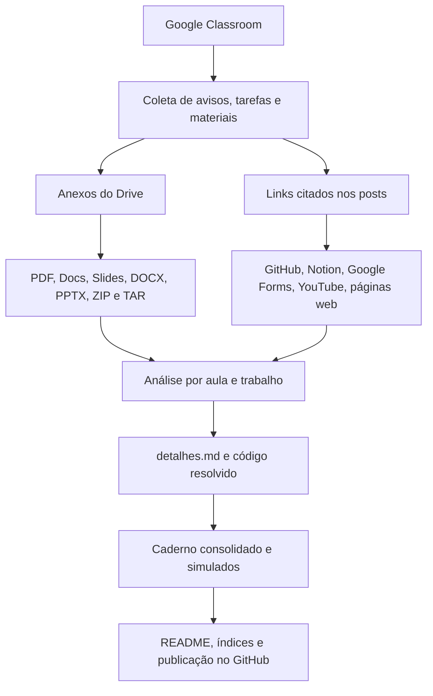
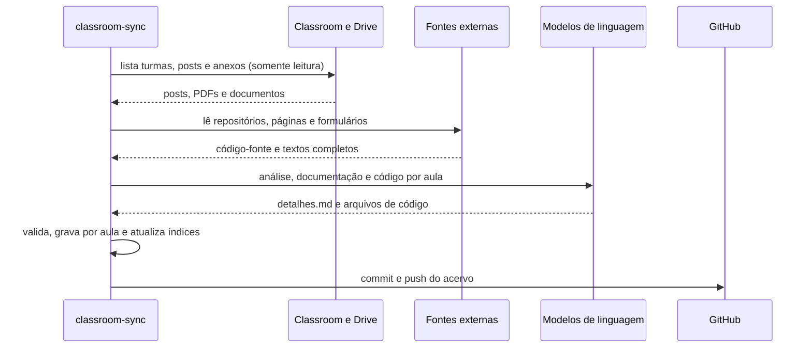

# Acervo Acadêmico - Sistemas de Informação (UniFEF)

> Material de estudo vivo do Bacharelado em Sistemas de Informação do Centro Universitário UniFEF: cada aula, trabalho e prova postados pelos professores no Google Classroom, documentados em profundidade, com diagramas, código resolvido e material de revisão.

**Última sincronização:** 23 de setembro de 2026 às 22:09 (horário de Brasília)

## Sumário

- [Sobre o projeto](#sobre-o-projeto)
- [Por que este acervo existe](#por-que-este-acervo-existe)
- [O acervo em números](#o-acervo-em-números)
- [Disciplinas](#disciplinas)
- [Como estudar com este material](#como-estudar-com-este-material)
- [Anatomia de uma disciplina](#anatomia-de-uma-disciplina)
- [Como o acervo é construído](#como-o-acervo-é-construído)
- [Tecnologias do motor de sincronização](#tecnologias-do-motor-de-sincronização)
- [Princípios de qualidade](#princípios-de-qualidade)
- [Aviso acadêmico](#aviso-acadêmico)
- [Autor e licença](#autor-e-licença)

## Sobre o projeto

Este repositório reúne, organiza e explica todo o conteúdo das disciplinas cursadas no Bacharelado em Sistemas de Informação da UniFEF. Ele não é um depósito de arquivos soltos: cada postagem do professor passa por um processo que baixa os anexos, lê os links citados (repositórios GitHub, páginas do Notion, formulários) e transforma tudo em documentação técnica navegável.

O resultado, para cada disciplina, é:

- **Aulas documentadas**: explicação aprofundada de cada tópico, com diagramas UML, ER e de fluxo, tabelas comparativas, glossário e exercícios resolvidos passo a passo.
- **Código pronto para executar**: exemplos do professor organizados e comentados, e resolução completa dos exercícios na linguagem da disciplina.
- **Trabalhos e provas**: enunciado original, análise do que é pedido, fundamentação teórica e uma resolução proposta comentada.
- **Revisão**: um caderno consolidado com toda a matéria e simulados comentados no estilo ENADE.
- **Mural completo**: todas as postagens do Classroom preservadas em ordem cronológica.

## Por que este acervo existe

| Problema no dia a dia do curso | Como o acervo resolve |
| :--- | :--- |
| Material espalhado entre Classroom, Drive, Notion, GitHub e formulários | Tudo consolidado em uma pasta por disciplina, com links preservados |
| Slides e PDFs resumidos demais para estudar sozinho | Cada aula vira um documento explicativo com contexto, exemplos e armadilhas comuns |
| Exercícios sem gabarito | Resolução completa e comentada, com código executável em `codigo/` |
| Revisar um semestre inteiro antes da prova | Caderno consolidado por disciplina e simulados com justificativa de cada alternativa |
| Conteúdo que some quando a turma do Classroom é arquivada | Histórico permanente e versionado em Git |

Além de apoio aos estudos, o projeto é também um exercício prático de engenharia de software: integração com APIs do Google Workspace, processamento de documentos, orquestração de modelos de linguagem com tolerância a falhas e automação de publicação.

## O acervo em números

| Indicador | Total |
| :--- | ---: |
| Semestres | 2 |
| Disciplinas | 8 |
| Aulas documentadas | 6 |
| Trabalhos e provas | 5 |
| Arquivos de código resolvido | 28 |
| Linhas de documentação (Markdown) | 8.250 |
| Linguagens nos códigos | Java, JavaScript, SQL |

## Disciplinas

### 4º Semestre

| Disciplina | Professor | Aulas | Trabalhos e provas | Código | Revisão |
| :--- | :--- | :---: | :---: | :--- | :--- |
| [Laboratório de Programação IV](4%C2%BA%20Semestre/%5BProf.%20Jefferson%20Passerini%5D%20Laborat%C3%B3rio%20de%20Programa%C3%A7%C3%A3o%20IV/README.md) | Jefferson Passerini | 1 | 0 | Java | - |
| [Tópicos Avançados em Banco de Dados](4%C2%BA%20Semestre/%5BProf.%20Welington%20Garcia%5D%20T%C3%B3picos%20Avan%C3%A7ados%20em%20Banco%20de%20Dados/README.md) | Welington Garcia | 3 | 5 | SQL | [Caderno](4%C2%BA%20Semestre/%5BProf.%20Welington%20Garcia%5D%20T%C3%B3picos%20Avan%C3%A7ados%20em%20Banco%20de%20Dados/Resumos-IA/Caderno-Consolidado.md) · [Simulados](4%C2%BA%20Semestre/%5BProf.%20Welington%20Garcia%5D%20T%C3%B3picos%20Avan%C3%A7ados%20em%20Banco%20de%20Dados/Resumos-IA/Simulados-Comentados.md) |
| [Engenharia de Software II](4%C2%BA%20Semestre/%5BProf.%20Wesley%20Soares%5D%20Engenharia%20de%20Software%20II/README.md) | Wesley Soares | 0 | 0 | - | - |
| [Estrutura de Dados I](4%C2%BA%20Semestre/%5BProf.%20Wesley%20Soares%5D%20Estrutura%20de%20Dados%20I/README.md) | Wesley Soares | 0 | 0 | - | - |

**Laboratório de Programação IV** - conteúdo das aulas:

- [Aula 01 - Persistencia e Transacoes com Spring Data e Liquibase](4%C2%BA%20Semestre/%5BProf.%20Jefferson%20Passerini%5D%20Laborat%C3%B3rio%20de%20Programa%C3%A7%C3%A3o%20IV/Aulas/Aula%2001%20-%20Persistencia%20e%20Transacoes%20com%20Spring%20Data%20e%20Liquibase/detalhes.md)

**Tópicos Avançados em Banco de Dados** - conteúdo das aulas:

- [Aula 01 - Consultas Avançadas com Joins e Subselects](4%C2%BA%20Semestre/%5BProf.%20Welington%20Garcia%5D%20T%C3%B3picos%20Avan%C3%A7ados%20em%20Banco%20de%20Dados/Aulas/Aula%2001%20-%20Consultas%20Avan%C3%A7adas%20com%20Joins%20e%20Subselects/detalhes.md)
- [Aula 02 - Views e Materialized Views em PostgreSQL](4%C2%BA%20Semestre/%5BProf.%20Welington%20Garcia%5D%20T%C3%B3picos%20Avan%C3%A7ados%20em%20Banco%20de%20Dados/Aulas/Aula%2002%20-%20Views%20e%20Materialized%20Views%20em%20PostgreSQL/detalhes.md)
- [Aula 03 - Stored Procedures e Programacao PL pgSQL](4%C2%BA%20Semestre/%5BProf.%20Welington%20Garcia%5D%20T%C3%B3picos%20Avan%C3%A7ados%20em%20Banco%20de%20Dados/Aulas/Aula%2003%20-%20Stored%20Procedures%20e%20Programacao%20PL%20pgSQL/detalhes.md)

### 3º Semestre

| Disciplina | Professor | Aulas | Trabalhos e provas | Código | Revisão |
| :--- | :--- | :---: | :---: | :--- | :--- |
| [Banco de Dados II](3%C2%BA%20Semestre/%5BProf.%20Guilherme%20de%20Morais%5D%20Banco%20de%20Dados%20II/README.md) | Guilherme de Morais | 0 | 0 | - | - |
| [Sistemas Operacionais](3%C2%BA%20Semestre/%5BProf.%20Guilherme%20de%20Morais%5D%20Sistemas%20Operacionais/README.md) | Guilherme de Morais | 0 | 0 | - | - |
| [Laboratório de Programação III](3%C2%BA%20Semestre/%5BProf.%20Jefferson%20Passerini%5D%20Laborat%C3%B3rio%20de%20Programa%C3%A7%C3%A3o%20III/README.md) | Jefferson Passerini | 2 | 0 | JavaScript, Java, SQL | - |
| [Engenharia de Software I](3%C2%BA%20Semestre/%5BProf.%20Marcelo%20Boer%5D%20Engenharia%20de%20Software%20I/README.md) | Marcelo Boer | 0 | 0 | - | - |

**Laboratório de Programação III** - conteúdo das aulas:

- [Aula 02 - Estrutura de Projeto e Frontend em Java Web](3%C2%BA%20Semestre/%5BProf.%20Jefferson%20Passerini%5D%20Laborat%C3%B3rio%20de%20Programa%C3%A7%C3%A3o%20III/Aulas/Aula%2002%20-%20Estrutura%20de%20Projeto%20e%20Frontend%20em%20Java%20Web/detalhes.md)
- [Aula 03 - Conexão com Banco de Dados e Servlet Filters](3%C2%BA%20Semestre/%5BProf.%20Jefferson%20Passerini%5D%20Laborat%C3%B3rio%20de%20Programa%C3%A7%C3%A3o%20III/Aulas/Aula%2003%20-%20Conex%C3%A3o%20com%20Banco%20de%20Dados%20e%20Servlet%20Filters/detalhes.md)

## Como estudar com este material

1. **Comece pelo README da disciplina.** Ele lista as aulas em ordem, os trabalhos com prazo e pontuação e os links de revisão.
2. **Estude aula por aula pelo `detalhes.md`.** A seção "Mapa da aula" dá a visão geral; depois cada tópico traz explicação, diagrama e exemplos.
3. **Pratique com o código.** Tente resolver os exercícios antes de abrir `codigo/`; depois compare com a resolução comentada.
4. **Revise com o checklist e as perguntas.** Todo `detalhes.md` termina com pontos-chave, perguntas e respostas e um checklist de revisão.
5. **Antes da prova, use o caderno e os simulados.** O `Caderno-Consolidado.md` cobre a disciplina inteira; os `Simulados-Comentados.md` treinam questões objetivas e discursivas com gabarito justificado.
6. **Confira o original quando houver dúvida.** O post do professor e os anexos ficam na mesma pasta da aula, e o `Avisos.md` guarda o mural completo.

## Anatomia de uma disciplina

```text
Nº Semestre/[Prof. Nome] Disciplina/
├── README.md                  índice: aulas, trabalhos, provas e revisão
├── Avisos.md                  mural completo do Classroom, em ordem cronológica
├── Aulas/
│   └── Aula NN - Tema/
│       ├── detalhes.md        explicação completa, diagramas, exercícios e checklist
│       ├── codigo/            exemplos e exercícios resolvidos
│       ├── links-recursos.md  links do professor e o que cada um contém
│       ├── AAAA-MM-DD - Post.md  post original do Classroom
│       └── anexos             PDFs e arquivos originais
├── Trabalhos/                 enunciado, análise, resolução proposta e código
├── Provas/                    avaliações com a mesma estrutura
└── Resumos-IA/
    ├── Caderno-Consolidado.md toda a disciplina em um documento
    └── Simulados-Comentados.md questões com gabarito comentado
```

Cada `detalhes.md` segue a mesma estrutura, o que facilita estudar qualquer disciplina do mesmo jeito:

| Seção | Conteúdo |
| :--- | :--- |
| Objetivo e contexto | O que a aula ensina e o que é preciso saber antes |
| Um bloco por tópico | Explicação, diagrama Mermaid, tabela comparativa e exemplos |
| Código da aula | Arquivos de `codigo/` explicados trecho a trecho |
| Exercícios | Enunciado, raciocínio e resolução completa |
| Erros comuns e boas práticas | Armadilhas frequentes em prova e na prática |
| Glossário e pontos-chave | Termos da aula e o essencial para a prova |
| Perguntas e respostas | Pares em JSONL, prontos para flashcards |
| Checklist de revisão | Lista para marcar o que já foi dominado |

## Como o acervo é construído

O conteúdo é gerado por um motor de sincronização próprio, o **classroom-sync**, escrito em TypeScript. Ele roda localmente, lê o Classroom com permissões somente leitura e publica o resultado neste repositório.





Etapas em detalhe:

1. **Coleta**: turmas ativas, avisos, tarefas e materiais pela API do Google Classroom.
2. **Extração**: Google Docs e Planilhas viram texto, apresentações viram PDF, arquivos Word e PowerPoint são convertidos, compactados são descompactados e lidos, repositórios do GitHub são clonados e páginas do Notion são lidas na íntegra.
3. **Detecção de novidades**: o que já está no acervo é reconhecido pela data, título, links e anexos; só o que é novo é processado.
4. **Documentação**: para cada aula e trabalho, uma análise estruturada identifica tema, linguagem, tópicos e exercícios; em seguida é produzido o `detalhes.md` completo e o código resolvido.
5. **Revisão**: com as aulas prontas, são gerados o caderno consolidado e os simulados da disciplina.
6. **Publicação**: índices e este README são reconstruídos a partir das pastas, e o resultado é versionado no GitHub.

## Tecnologias do motor de sincronização

| Camada | Tecnologia |
| :--- | :--- |
| Linguagem e execução | TypeScript, Node.js, tsx |
| Integração Google | Google Classroom API, Google Drive API, OAuth 2.0 com escopos somente leitura |
| Modelos de linguagem | Google Gemini (várias chaves e modelos com rodízio automático) e Claude como alternativa |
| Processamento de documentos | Files API do Gemini, textutil do macOS, extração de PPTX, ZIP e TAR |
| Fontes externas | Git (clone raso), API pública do Notion, Google Forms, oEmbed do YouTube |
| Documentação | Markdown do GitHub e diagramas Mermaid |
| Publicação | Git com commit e push automáticos |

## Princípios de qualidade

- **Fidelidade ao material**: o conteúdo parte do que o professor postou; complementos de conhecimento geral são sinalizados como tal.
- **Profundidade**: documentos de aula e trabalho têm centenas de linhas, com diagramas, tabelas, exemplos e exercícios resolvidos.
- **Código executável**: exemplos completos, comentados, sem trechos omitidos.
- **Diagramas nativos**: Mermaid renderizado pelo próprio GitHub, sem cores fixas, acompanhando o tema claro ou escuro.
- **Estrutura previsível**: todas as disciplinas seguem a mesma organização de pastas e seções.
- **Rastreabilidade**: post original, anexos e links do professor ficam ao lado da documentação.
- **Resiliência**: falhas de rede ou de cota não perdem trabalho; cada aula é gravada ao ficar pronta e o processo retoma de onde parou.

## Aviso acadêmico

Este acervo é material de apoio ao estudo e não substitui as aulas, a bibliografia oficial nem a orientação dos professores. Os materiais originais (slides, PDFs e enunciados) pertencem aos respectivos docentes e à UniFEF e estão aqui apenas como referência de estudo. As resoluções propostas servem para aprendizado e conferência; a produção dos trabalhos avaliativos deve respeitar as regras de integridade acadêmica da instituição.

## Autor e licença

- **Autor:** Murilo Rocha Silva, Bacharelado em Sistemas de Informação, UniFEF.
- **Licença:** veja [LICENSE](LICENSE).
