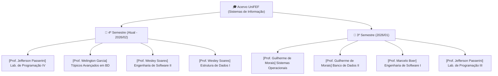

<div align="center">

# 🎓 Acervo Acadêmico — Sistemas de Informação (UniFEF)

**Portfólio universitário completo de aulas, trabalhos práticos, resoluções em código, provas e materiais de estudo com Inteligência Artificial.**

[](https://fef.br)
[](https://fef.br)
[-FF6F00?style=for-the-badge&logo=clock&logoColor=white)](#-4º-semestre-atual---202602)
[](LICENSE)

<br />

```text
Acervo Ativo: 3º e 4º Semestres Catalogados (8 Disciplinas Completas)
```

</div>

---

## 🧭 Índice Remissivo e Navegação Rápida

- [🏛️ Estrutura Geral do Acervo](#️-estrutura-geral-do-acervo)
- [📚 Semestres Catalogados](#-semestres-catalogados)
  - [4º Semestre (Atual - 2026/02)](#-4º-semestre-atual---202602)
  - [3º Semestre (2026/01)](#-3º-semestre-202601)
- [📂 Arquitetura Padrão de Cada Disciplina](#-arquitetura-padrão-de-cada-disciplina)
- [💻 Tecnologias & Linguagens Aplicadas](#-tecnologias--linguagens-aplicadas)
- [🤖 Materiais de Estudo Gerados por IA](#-materiais-de-estudo-gerados-por-ia)
- [📜 Licença & Disclaimer Acadêmico](#-licença--disclaimer-acadêmico)

---

## 🏛️ Estrutura Geral do Acervo

O acervo contém exclusivamente os semestres com disciplinas ativas e conteúdos reais catalogados (**3º Semestre** e **4º Semestre**). Cada disciplina é identificada com o nome do **Professor Responsável**, acompanhada de códigos executáveis, enunciados originais, diagramas UML em Mermaid e apresentações de slides:



---

## 📚 Semestres Catalogados

### 🟢 4º Semestre (Atual - 2026/02)

| Disciplina | Docente Responsável | Tecnologias Principais | Acesso Direto |
| :--- | :--- | :--- | :--- |
| **Laboratório de Programação IV** | Prof. Jefferson Passerini | Java, Spring Boot, JPA, PostgreSQL, Liquibase | [Acessar Pasta](<4º Semestre/[Prof. Jefferson Passerini] Laboratório de Programação IV>) |
| **Tópicos Avançados em Banco de Dados** | Prof. Welington Garcia | PostgreSQL, Subconsultas, Views, Triggers, Otimização | [Acessar Pasta](<4º Semestre/[Prof. Welington Garcia] Tópicos Avançados em Banco de Dados>) |
| **Engenharia de Software II** | Prof. Wesley Soares | Scrum, MoSCoW, Casos de Uso, Requisitos, Modelagem | [Acessar Pasta](<4º Semestre/[Prof. Wesley Soares] Engenharia de Software II>) |
| **Estrutura de Dados I** | Prof. Wesley Soares | C, Listas Encadeadas, Pilhas, Filas, Ponteiros | [Acessar Pasta](<4º Semestre/[Prof. Wesley Soares] Estrutura de Dados I>) |

---

### 🔵 3º Semestre (2026/01)

| Disciplina | Docente Responsável | Tecnologias Principais | Acesso Direto |
| :--- | :--- | :--- | :--- |
| **Sistemas Operacionais** | Prof. Guilherme de Morais | Gerenciamento de Memória, Processos, Deadlocks, Threads | [Acessar Pasta](<3º Semestre/[Prof. Guilherme de Morais] Sistemas Operacionais>) |
| **Banco de Dados II** | Prof. Guilherme de Morais | SQL DDL/DML, JOINs, Chaves Estrangeiras, Agregações | [Acessar Pasta](<3º Semestre/[Prof. Guilherme de Morais] Banco de Dados II>) |
| **Engenharia de Software I** | Prof. Marcelo Boer | Astah UML, Diagramas de Classes, Casos de Uso, Processos | [Acessar Pasta](<3º Semestre/[Prof. Marcelo Boer] Engenharia de Software I>) |
| **Laboratório de Programação III** | Prof. Jefferson Passerini | Java Web, Servlets, JDBC, Front-end JS, MVC | [Acessar Pasta](<3º Semestre/[Prof. Jefferson Passerini] Laboratório de Programação III>) |

---

## 📂 Arquitetura Padrão de Cada Disciplina

Cada matéria possui um ecossistema independente e completo:

```text
📁 [Prof. Nome] Nome da Disciplina/
├── 📄 README.md                            # Guia didático + Diagrama Mermaid da matéria
├── 📁 Aulas/                               # Anúncios, materiais didáticos e referências
├── 📁 Trabalhos/                           # Atividades com enunciado original e código fonte resolvido
├── 📁 Provas/                              # Avaliações semestrais com gabaritos
└── 📁 Resumos-IA/                          # Central de estudo e revisão — tudo em um único README
    ├── 📄 README.md                        # Resumo, exercícios, simulado, cheatsheet e diagramas — um documento só
    ├── 📊 Slides-Revisao-*.pptx            # Apresentação de revisão (dark mode, 5 slides, 16:9)
    ├── 📇 flashcards-anki.tsv              # Baralho pronto para importar no Anki
    └── 🤖 dataset-estudo-qa.jsonl          # Dataset de perguntas e respostas (Q&A)
```

> A pasta `Resumos-IA/` é deliberadamente plana: todo o conteúdo textual (resumo,
> exercícios comentados, simulado, cheatsheet e diagramas UML/Mermaid) vive dentro de
> um único `README.md` por matéria. Só ficam como arquivo separado os formatos que
> exigem isso para funcionar — `.pptx` (PowerPoint) e `.tsv` (importação no Anki) — e o
> `.jsonl` do dataset (formato de consumo por ferramenta, não de leitura em prosa).

---

## 💻 Tecnologias & Linguagens Aplicadas

<div align="center">

| Tecnologia | Utilização Principal | Disciplinas Relacionadas |
| :---: | :--- | :--- |
|  | Subselects, Views, JOINs, Otimização | Tópicos Avançados em BD, Banco de Dados II |
|  | Backend MVC, Servlets, JPA, Liquibase | Lab. de Programação III e IV |
|  | Estruturas de Dados, Listas, Pilhas, Filas | Estrutura de Dados I |
|  | Automações e scripts de estudo | Ferramentas de Apoio |
|  | Diagramas de Classe, Sequência e ER | Engenharia de Software I e II |

</div>

---

## 🤖 Materiais de Estudo Gerados por IA

Todo o conteúdo de revisão foi sintetizado via **Google Gemini 3.5**, contemplando:
1. **Soluções Executáveis de Exercícios:** Cada lista em Word/PDF possui seu correspondente script `.sql`, `.c` ou `.java` validado.
2. **Slides PowerPoint (.pptx):** Decks de 5 slides em tema escuro profissional para apresentações em seminários.
3. **Datasets JSONL:** ~14–15 pares de perguntas e respostas por matéria para treino ou integração em LLMs locais.

---

## 📜 Licença & Disclaimer Acadêmico

- **Código Autoral e Resoluções:** Distribuídos sob a licença [MIT](LICENSE).
- **Direitos Didáticos da Instituição:** Enunciados de listas e critérios avaliativos pertencem ao corpo docente do **Centro Universitário UniFEF**.
- **Autor:** [Murilo (@murilolol)](https://github.com/murilolol)

<div align="center">
<sub>Feito com dedicação durante a graduação em Sistemas de Informação • UniFEF 2025–2028</sub>
</div>
